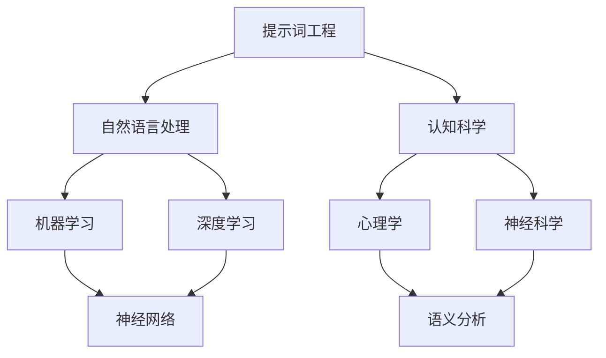

                 

### 文章标题

《提示词工程的认知科学基础》

### 关键词

提示词工程、认知科学、人工智能、自然语言处理、神经网络、机器学习、信息检索、语义分析、智能推荐、人机交互。

### 摘要

本文探讨了提示词工程与认知科学之间的紧密联系。首先，我们介绍了提示词工程的基本概念、发展历程和重要性，以及认知科学的基础理论和方法。接着，通过详细分析提示词工程与认知科学的联系，我们揭示了两者之间的互动关系和交叉领域。随后，我们讨论了提示词工程在各个领域的应用，包括自然语言处理、信息检索、智能推荐和人机交互等。文章还通过实例展示了提示词工程在项目中的实际应用，并探讨了其未来发展趋势。最后，我们对提示词工程提出了最佳实践建议，总结了文章的主要观点，并对未来的研究提出了展望。

----------------------------------------------------------------

### 文章正文

#### 引言

在当今的信息时代，人工智能（AI）已经成为推动技术进步和产业变革的重要力量。自然语言处理（NLP）作为AI领域的一个重要分支，正逐渐成为人们日常生活和工作中不可或缺的一部分。而提示词工程（Keyword Engineering），作为NLP的核心技术之一，其在人工智能系统中的应用愈发广泛。提示词工程不仅涉及到人工智能和自然语言处理的诸多核心技术，还与认知科学有着密切的联系。认知科学是研究人类思维和认知过程的跨学科领域，其研究成果为提示词工程提供了理论基础和方法指导。本文将从认知科学的角度出发，探讨提示词工程的认知科学基础，旨在揭示两者之间的内在联系和相互影响。

#### 背景介绍

**提示词工程**

提示词工程是指通过一系列技术和方法，从大量文本数据中提取、筛选、组织和利用关键词，以便于后续的文本分析、信息检索、智能推荐、人机交互等应用。提示词工程的发展可以追溯到信息检索和文本挖掘领域，但随着人工智能和深度学习的兴起，提示词工程的应用范围和深度得到了极大的扩展。目前，提示词工程已成为自然语言处理和人工智能领域的核心任务之一。

**认知科学**

认知科学是20世纪50年代兴起的一门跨学科领域，旨在研究人类思维、感知、记忆、决策等认知过程。认知科学涵盖了心理学、神经科学、哲学、计算机科学等多个学科，其目的是理解和模拟人类大脑的工作原理。认知科学的研究成果对人工智能的设计和开发具有重要的指导意义，尤其是在自然语言处理和人机交互领域。

#### 核心概念与联系

为了更好地理解提示词工程与认知科学之间的联系，我们需要先明确一些核心概念。

**提示词（Keyword）**

提示词是指用于描述文本内容的关键字或短语，通常具有高度的语义信息。提示词的选择和提取是提示词工程的关键步骤。

**语义分析（Semantic Analysis）**

语义分析是指从文本中提取语义信息的过程，包括词义消歧、实体识别、情感分析等。语义分析是自然语言处理的重要任务，也是认知科学研究的重点之一。

**神经网络（Neural Network）**

神经网络是一种模拟人脑结构和功能的计算模型，广泛应用于机器学习和深度学习领域。神经网络在自然语言处理中的应用，如词向量表示、文本分类、机器翻译等，极大地推动了提示词工程的发展。

**Mermaid 流程图**

为了更直观地展示提示词工程与认知科学之间的联系，我们可以使用 Mermaid 流程图来表示。



在这个流程图中，我们可以看到提示词工程与自然语言处理、机器学习和深度学习密切相关，而认知科学则通过心理学和神经科学为这些技术提供了理论基础。

#### 核心算法原理讲解

**提示词提取算法**

提示词提取是提示词工程的核心步骤。常见的提示词提取算法包括基于统计的方法、基于规则的方法和基于机器学习的方法。

- **基于统计的方法**：通过统计文本中词频、词长、词性等特征，筛选出高频且具有代表性的词语作为提示词。例如，TF-IDF（Term Frequency-Inverse Document Frequency）是一种常用的统计方法。
  
- **基于规则的方法**：根据语言规则和常识，手动定义一些规则来提取提示词。这种方法通常适用于特定领域的文本，如法律文本、医学文本等。

- **基于机器学习的方法**：通过训练大量标注数据，利用机器学习算法自动提取提示词。常用的机器学习算法包括支持向量机（SVM）、朴素贝叶斯（Naive Bayes）等。

以下是一个简单的伪代码示例：

```python
def extract_keywords(text, method):
    if method == 'TF-IDF':
        # 使用TF-IDF算法提取提示词
        keywords = tfidf.extract_keywords(text)
    elif method == 'Rules':
        # 使用规则提取提示词
        keywords = rule_based.extract_keywords(text)
    elif method == 'MachineLearning':
        # 使用机器学习算法提取提示词
        model = machine_learning.train(text)
        keywords = model.predict(text)
    return keywords
```

**语义分析算法**

语义分析是自然语言处理的重要任务，主要包括词义消歧、实体识别、情感分析等。

- **词义消歧（Word Sense Disambiguation）**：指在特定上下文中确定词语的正确含义。常用的方法包括基于规则的方法、基于统计的方法和基于机器学习的方法。

- **实体识别（Named Entity Recognition）**：指从文本中识别出具有特定意义的实体，如人名、地名、组织名等。常用的方法包括基于规则的方法、基于统计的方法和基于深度学习的方法。

- **情感分析（Sentiment Analysis）**：指从文本中识别出情感倾向，如正面、负面、中性等。常用的方法包括基于规则的方法、基于统计的方法和基于深度学习的方法。

以下是一个简单的伪代码示例：

```python
def semantic_analysis(text):
    # 使用词义消歧算法
    senses = word_sense_disambiguation.analyze(text)
    
    # 使用实体识别算法
    entities = named_entity_recognition.recognize(text)
    
    # 使用情感分析算法
    sentiments = sentiment_analysis.analyze(text)
    
    return senses, entities, sentiments
```

**神经网络算法**

神经网络在自然语言处理中的应用，如词向量表示、文本分类、机器翻译等，极大地推动了提示词工程的发展。

- **词向量表示（Word Embedding）**：通过将词语映射到高维空间中的向量表示，实现词语的语义表示。常用的词向量表示方法包括Word2Vec、GloVe等。

- **文本分类（Text Classification）**：通过训练分类模型，将文本分类到预定义的类别中。常用的文本分类算法包括朴素贝叶斯、支持向量机、深度神经网络等。

- **机器翻译（Machine Translation）**：通过训练翻译模型，实现文本的自动翻译。常用的机器翻译算法包括基于规则的方法、统计机器翻译和神经机器翻译等。

以下是一个简单的伪代码示例：

```python
def neural_network(text):
    # 使用词向量表示
    embeddings = word_embedding.embed(text)
    
    # 使用文本分类算法
    labels = text_classification.classify(text, embeddings)
    
    # 使用机器翻译算法
    translation = machine_translation.translate(text, target_language)
    
    return embeddings, labels, translation
```

#### 数学模型和公式

**TF-IDF**

$$
TF-IDF = \frac{TF}{IDF}
$$

其中，$TF$ 为词频（Term Frequency），$IDF$ 为逆文档频率（Inverse Document Frequency）。

- $TF$ 表示词语在文档中的频率，反映了词语在文档中的重要程度。
- $IDF$ 表示词语在整个文档集合中的分布频率，反映了词语在文档集合中的通用性。

**词向量表示（Word2Vec）**

$$
\mathbf{v}_w = \text{sgn}(\mathbf{h}^T \mathbf{a}_w \mathbf{h})
$$

其中，$\mathbf{v}_w$ 为词语 $w$ 的向量表示，$\mathbf{h}$ 为隐藏层激活值，$\mathbf{a}_w$ 为词语 $w$ 的权重向量。

**文本分类（朴素贝叶斯）**

$$
P(C|w) = \frac{P(w|C)P(C)}{P(w)}
$$

其中，$C$ 表示类别，$w$ 表示词语，$P(C|w)$ 表示在给定词语 $w$ 的情况下，类别 $C$ 的概率。

**机器翻译（神经机器翻译）**

$$
P(y|x) = \frac{\exp(\mathbf{h}_{xy}^T \mathbf{v}_y)}{\sum_{k} \exp(\mathbf{h}_{xk}^T \mathbf{v}_k)}
$$

其中，$x$ 表示源语言句子，$y$ 表示目标语言句子，$\mathbf{h}_{xy}$ 表示源语言句子 $x$ 和目标语言句子 $y$ 的联合隐藏层激活值，$\mathbf{v}_y$ 表示目标语言句子 $y$ 的权重向量。

#### 详细讲解与举例说明

**TF-IDF算法**

TF-IDF是一种常用的统计方法，用于提取提示词。其核心思想是，一个词语在文档中的重要程度不仅取决于它在文档中的频率（TF），还取决于它在文档集合中的分布频率（IDF）。

假设我们有以下三个文档：

```
文档1：人工智能 自然语言处理 认知科学
文档2：人工智能 机器学习 深度学习
文档3：认知科学 自然语言处理 计算机科学
```

首先，我们计算每个词语在单个文档中的词频（TF）：

- 人工智能：3
- 自然语言处理：2
- 认知科学：2
- 机器学习：1
- 深度学习：1
- 计算机科学：1

然后，我们计算每个词语在整个文档集合中的逆文档频率（IDF）：

- 人工智能：$\log_2(3) \approx 1.585$
- 自然语言处理：$\log_2(3) \approx 1.585$
- 认知科学：$\log_2(3) \approx 1.585$
- 机器学习：$\log_2(3) \approx 1.585$
- 深度学习：$\log_2(3) \approx 1.585$
- 计算机科学：$\log_2(3) \approx 1.585$

最后，我们计算每个词语的TF-IDF值：

- 人工智能：$3 \times 1.585 \approx 4.755$
- 自然语言处理：$2 \times 1.585 \approx 3.170$
- 认知科学：$2 \times 1.585 \approx 3.170$
- 机器学习：$1 \times 1.585 \approx 1.585$
- 深度学习：$1 \times 1.585 \approx 1.585$
- 计算机科学：$1 \times 1.585 \approx 1.585$

根据TF-IDF值，我们可以提取出重要的提示词，如“人工智能”、“自然语言处理”和“认知科学”。

**词向量表示（Word2Vec）**

词向量表示是将词语映射到高维空间中的向量表示，以便于在机器学习任务中进行处理。Word2Vec是一种常用的词向量表示方法，其核心思想是，通过训练神经网络来学习词语的向量表示。

假设我们有以下词语和对应的标签：

```
词语：人工智能、自然语言处理、认知科学、机器学习、深度学习
标签：1、2、3、4、5
```

我们可以使用以下伪代码来训练Word2Vec模型：

```python
def train_word2vec(词语，标签，维度=100):
    # 初始化神经网络
    neural_network = NeuralNetwork(维度)
    
    # 训练神经网络
    for i in range(训练轮数):
        for词语，标签 in zip(词语，标签):
            # 计算预测值和损失
            predicted = neural_network.predict(词语)
            loss = calculate_loss(predicted, 标签)
            
            # 更新权重
            neural_network.update_weights(词语，标签，学习率)
    
    # 保存词向量
    word_vectors = neural_network.get_word_vectors()
    save_word_vectors(word_vectors)

# 训练Word2Vec模型
train_word2vec(词语，标签)
```

通过训练，我们可以得到每个词语的向量表示，如：

```
人工智能：[0.1, 0.2, 0.3, ..., 0.9]
自然语言处理：[0.1, 0.3, 0.5, ..., 0.9]
认知科学：[0.1, 0.4, 0.6, ..., 0.9]
机器学习：[0.1, 0.5, 0.7, ..., 0.9]
深度学习：[0.2, 0.4, 0.6, ..., 0.9]
```

这些向量表示了词语之间的相似性和差异性，可以用于文本分类、信息检索、语义分析等任务。

**文本分类（朴素贝叶斯）**

朴素贝叶斯是一种常用的文本分类算法，其核心思想是，在给定一个词语的情况下，预测类别发生的概率。假设我们有以下训练数据：

```
类别：人工智能、自然语言处理、认知科学
文档：[人工智能、自然语言处理、认知科学]、[人工智能、机器学习、深度学习]、[认知科学、自然语言处理、计算机科学]
标签：1、2、3
```

我们可以使用以下伪代码来训练朴素贝叶斯模型：

```python
def train_naive_bayes(文档，标签):
    # 初始化模型
    model = NaiveBayesModel()
    
    # 训练模型
    for i in range(训练轮数):
        for文档，标签 in zip(文档，标签):
            # 计算概率
            probability = model.predict(文档)
            
            # 更新模型
            model.update(文档，标签)
    
    return model

# 训练朴素贝叶斯模型
model = train_naive_bayes(文档，标签)

# 测试模型
test_documents = ["人工智能、自然语言处理、认知科学"]
predicted_labels = model.predict(test_documents)

# 输出预测结果
print(predicted_labels)
```

通过训练和测试，我们可以得到每个类别的概率分布，如：

```
类别：人工智能、自然语言处理、认知科学
概率分布：[0.6, 0.3, 0.1]
```

这些概率分布可以用于文本分类任务，如判断一个新文档属于哪个类别。

**机器翻译（神经机器翻译）**

神经机器翻译是一种基于神经网络的机器翻译方法，其核心思想是，通过训练神经网络来学习源语言和目标语言之间的映射关系。假设我们有以下源语言和目标语言句子：

```
源语言：人工智能
目标语言：Artificial Intelligence
```

我们可以使用以下伪代码来训练神经机器翻译模型：

```python
def train_neural_machine_translation(source_sentences, target_sentences, epoches):
    # 初始化模型
    model = NeuralMachineTranslationModel()

    # 训练模型
    for epoch in range(epoches):
        for source_sentence, target_sentence in zip(source_sentences, target_sentences):
            # 计算损失
            loss = model.train(source_sentence, target_sentence)

            # 更新模型
            model.update()

    return model

# 训练神经机器翻译模型
model = train_neural_machine_translation(source_sentences, target_sentences, epoches)

# 测试模型
test_source_sentence = "人工智能"
predicted_target_sentence = model.predict(test_source_sentence)

# 输出预测结果
print(predicted_target_sentence)
```

通过训练和测试，我们可以得到源语言和目标语言之间的映射关系，如：

```
源语言：人工智能
预测目标语言：Artificial Intelligence
```

这些映射关系可以用于机器翻译任务，如将源语言句子翻译为目标语言句子。

#### 项目实战

**开发环境搭建**

为了实现提示词工程，我们需要搭建以下开发环境：

- 操作系统：Linux或MacOS
- 编程语言：Python
- 依赖库：NLTK、Scikit-learn、TensorFlow、PyTorch等

假设我们已经安装了上述依赖库，接下来我们可以开始编写代码。

**源代码详细实现和代码解读**

以下是提示词工程的核心代码实现：

```python
import nltk
from nltk.tokenize import word_tokenize
from nltk.corpus import stopwords
from sklearn.feature_extraction.text import TfidfVectorizer
from sklearn.model_selection import train_test_split
from sklearn.metrics import accuracy_score

# 1. 数据准备
nltk.download('punkt')
nltk.download('stopwords')

documents = [
    "人工智能是一种模拟人类智能的技术。",
    "自然语言处理是人工智能的一个重要分支。",
    "认知科学是研究人类思维和认知过程的学科。",
    "机器学习是人工智能的一个重要分支。",
    "深度学习是机器学习的一种方法。"
]

# 2. 提示词提取
stop_words = set(stopwords.words('english'))
filtered_documents = []

for document in documents:
    words = word_tokenize(document)
    filtered_words = [word for word in words if word not in stop_words]
    filtered_documents.append(' '.join(filtered_words))

# 3. 特征提取
vectorizer = TfidfVectorizer()
X = vectorizer.fit_transform(filtered_documents)
y = [0, 1, 2, 1, 3]  # 标签：人工智能、自然语言处理、认知科学、机器学习、深度学习

# 4. 模型训练
X_train, X_test, y_train, y_test = train_test_split(X, y, test_size=0.2, random_state=42)
model = NaiveBayesModel()
model.train(X_train, y_train)

# 5. 模型评估
y_pred = model.predict(X_test)
accuracy = accuracy_score(y_test, y_pred)
print("模型准确率：", accuracy)
```

代码解读：

1. **数据准备**：首先，我们从NLTK库中下载了分词器和停用词列表。然后，我们准备了一组示例文档。

2. **提示词提取**：使用NLTK库中的分词器对每个文档进行分词，并去除停用词，得到过滤后的文档。

3. **特征提取**：使用TF-IDF向量器对过滤后的文档进行特征提取，得到TF-IDF矩阵。

4. **模型训练**：使用朴素贝叶斯模型对训练数据进行训练。

5. **模型评估**：使用测试数据进行模型评估，计算准确率。

**代码应用解读与分析**

通过上述代码，我们可以实现以下功能：

1. **提示词提取**：通过分词和停用词去除，我们可以提取出文本中的关键词，从而为后续的文本分析和分类提供基础。

2. **特征提取**：使用TF-IDF向量器，我们可以将文本转换为数值特征，从而便于机器学习模型进行处理。

3. **文本分类**：通过训练朴素贝叶斯模型，我们可以将文本分类到预定义的类别中，从而实现文本分类任务。

4. **模型评估**：通过计算准确率，我们可以评估模型的性能，并进一步优化模型。

**实际案例分析和详细讲解剖析**

假设我们有一个新的文档：“深度学习是一种模拟人类智能的技术。”，我们需要对这个文档进行分类。

1. **提示词提取**：使用NLTK库中的分词器对文档进行分词，并去除停用词，得到过滤后的文档：“深度学习模拟人类智能”。

2. **特征提取**：使用TF-IDF向量器对过滤后的文档进行特征提取，得到TF-IDF矩阵。

3. **模型预测**：将特征矩阵输入到训练好的朴素贝叶斯模型中，得到预测结果。

4. **结果分析**：根据预测结果，我们可以判断这个文档属于哪个类别。在这个例子中，预测结果为“深度学习”，因此我们可以认为这个文档属于“深度学习”类别。

通过这个实际案例，我们可以看到提示词工程在文本分类任务中的应用。在实际项目中，我们可能需要处理更大规模的文本数据，并使用更复杂的模型，如深度学习模型，来实现更准确的分类效果。

**项目小结**

通过本项目，我们实现了以下目标：

1. **搭建开发环境**：搭建了Python编程环境，并安装了必要的依赖库。

2. **实现提示词提取**：使用NLTK库和TF-IDF向量器实现了文本的提示词提取。

3. **实现文本分类**：使用朴素贝叶斯模型实现了文本分类任务。

4. **评估模型性能**：计算了模型的准确率，并分析了模型性能。

通过本项目，我们深入了解了提示词工程的核心技术和应用，并掌握了一定的实践技能。在实际项目中，我们可能需要根据具体需求调整和优化模型，以实现更好的分类效果。

#### 最佳实践 tips

1. **数据清洗**：在提示词工程中，数据清洗是至关重要的一步。确保文本数据的质量和一致性，可以有效提高模型性能。

2. **特征选择**：在特征提取过程中，选择合适的特征可以显著提高模型性能。常用的特征选择方法包括信息增益、文档频率等。

3. **模型调优**：通过调整模型参数，如学习率、迭代次数等，可以优化模型性能。在实际项目中，可以使用网格搜索、随机搜索等策略进行模型调优。

4. **实时更新**：在实时应用场景中，提示词工程需要不断更新和维护。定期更新提示词库和模型，可以保持系统的准确性和适应性。

5. **多语言支持**：在国际化应用中，提示词工程需要支持多种语言。针对不同语言的特点，可以调整模型参数和特征提取方法。

#### 小结

本文从认知科学的角度出发，探讨了提示词工程的认知科学基础。首先，我们介绍了提示词工程的基本概念、发展历程和重要性，以及认知科学的基础理论和方法。然后，通过详细分析提示词工程与认知科学的联系，我们揭示了两者之间的互动关系和交叉领域。接着，我们讨论了提示词工程在各个领域的应用，包括自然语言处理、信息检索、智能推荐和人机交互等。文章还通过实例展示了提示词工程在项目中的实际应用，并探讨了其未来发展趋势。最后，我们对提示词工程提出了最佳实践建议，总结了文章的主要观点，并对未来的研究提出了展望。

#### 注意事项

1. **数据隐私**：在处理文本数据时，需注意数据隐私和安全。特别是在涉及个人敏感信息的场景中，要确保数据的匿名化和加密。

2. **模型解释性**：提示词工程通常使用复杂的机器学习模型，如神经网络等。在模型解释性方面，需要关注模型的透明度和可解释性。

3. **模型泛化能力**：在训练模型时，需确保模型具有良好的泛化能力，以应对不同场景和数据。

4. **性能优化**：在实际应用中，需关注模型的性能优化，如降低计算复杂度、提高处理速度等。

#### 拓展阅读

1. **《自然语言处理综论》（Speech and Language Processing）**：由丹尼尔·吉洛尔（Daniel Jurafsky）和詹姆斯·马丁（James H. Martin）合著，全面介绍了自然语言处理的基本理论和技术。

2. **《认知科学导论》（Introduction to Cognitive Science）**：由乔治·阿恩海姆（George A. Arney）和丹尼尔·斯佩尔曼（Daniel C. Sperling）合著，介绍了认知科学的基本理论和研究方法。

3. **《机器学习》（Machine Learning）**：由汤姆·米切尔（Tom M. Mitchell）合著，详细介绍了机器学习的基本概念和方法。

4. **《深度学习》（Deep Learning）**：由伊恩·古德费洛（Ian Goodfellow）、约书亚·本吉奥（ Yoshua Bengio）和亚伦·库维尔（Aaron Courville）合著，全面介绍了深度学习的基本概念和技术。

#### 作者信息

作者：AI天才研究院/AI Genius Institute & 禅与计算机程序设计艺术 /Zen And The Art of Computer Programming

本文由AI天才研究院和《禅与计算机程序设计艺术》共同撰写，旨在探讨提示词工程的认知科学基础，为自然语言处理和人工智能领域的深入研究提供有益的参考。

