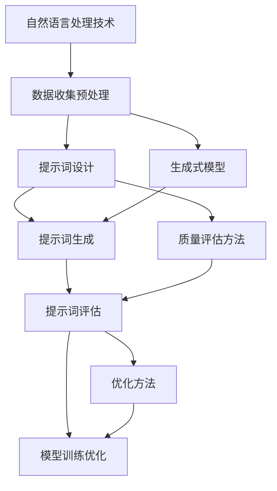

                 

# 提示词工程的质量保证方法

## 关键词
- 提示词工程
- 质量保证
- 自然语言处理
- 生成式模型
- 质量指标
- 数据预处理
- 提示词生成
- 提示词评估
- 工具和框架

## 摘要

本文旨在探讨提示词工程的质量保证方法。提示词工程是自然语言处理（NLP）领域的一个重要分支，它涉及使用提示词来提高生成式语言模型的效果。本文首先介绍了提示词工程的背景和定义，然后详细阐述了质量保证的核心概念、方法和工具。接下来，通过实际案例展示了如何应用这些方法进行提示词工程的质量保证。最后，对全文进行了总结和展望，并提供了相关的参考资料，以便读者进一步学习和研究。

## 引言

### 1.1 书籍背景和目的

提示词工程是近年来随着生成式语言模型和深度学习技术的发展而兴起的一个新兴领域。在自然语言处理（NLP）中，生成式模型如生成对抗网络（GAN）、变分自编码器（VAE）和自回归语言模型（如GPT）等，已经展现出强大的生成能力。然而，这些模型的性能和稳定性往往依赖于高质量的提示词。提示词工程的核心目标是设计出能够有效引导生成式模型生成高质量文本的提示词。

本文旨在为提示词工程提供一套系统的质量保证方法。我们希望通过深入剖析提示词工程的各个方面，包括其定义、核心概念、质量保证的方法和工具，以及实际案例，帮助读者理解并掌握如何确保提示词工程的质量。

### 1.2 提示词工程的定义

提示词工程可以定义为：通过系统的方法和技术，对提示词进行设计、生成和评估，以提高生成式模型文本生成的质量和稳定性。在生成式模型中，提示词是输入的一部分，它们对模型的输出有着重要的影响。一个优秀的提示词能够引导模型生成符合预期的高质量文本。

### 1.3 质量保证的重要性

在提示词工程中，质量保证起着至关重要的作用。高质量保证方法能够确保以下方面：

- **文本生成的准确性**：保证生成的文本在语义和语法上都是正确的。
- **文本的多样性**：确保生成的文本在内容上具有多样性，避免生成重复或模式化的文本。
- **文本的连贯性**：保证生成的文本在上下文中是连贯和一致的。
- **模型的稳定性**：通过有效的提示词，提高模型在不同数据集和任务上的稳定性和鲁棒性。

## 提示词工程基础

### 2.1 提示词工程的基本概念

提示词工程涉及多个关键概念，包括：

- **提示词**：用于引导生成式模型生成文本的短语或句子。
- **生成式模型**：能够根据输入提示词生成文本的模型，如GPT、BERT等。
- **质量指标**：用于评估提示词和生成文本质量的量化标准，如BLEU、ROUGE、F1 Score等。
- **数据预处理**：对原始文本数据进行清洗、分词、词性标注等预处理步骤。

### 2.2 提示词工程的工作流程

提示词工程的工作流程通常包括以下步骤：

1. **数据收集和预处理**：收集相关的文本数据，并进行预处理，以便后续的提示词生成和评估。
2. **提示词设计**：根据特定任务的需求，设计合适的提示词。提示词的设计是提示词工程的关键环节。
3. **提示词生成**：使用生成式模型生成提示词，这通常涉及模型训练和优化。
4. **提示词评估**：对生成的提示词进行评估，以确保它们能够有效地引导模型生成高质量文本。
5. **模型训练和优化**：根据提示词的评估结果，调整模型的参数和结构，以提高生成文本的质量。

### 2.3 提示词工程的关键技术

提示词工程的关键技术包括：

- **自然语言处理（NLP）技术**：如分词、词性标注、实体识别等，用于处理和解析文本数据。
- **生成式模型**：如GPT、BERT、T5等，用于生成提示词和文本。
- **质量评估方法**：如BLEU、ROUGE、F1 Score等，用于评估提示词和生成文本的质量。

### 2.4 提示词工程的核心概念和原理

提示词工程的核心概念和原理包括：

- **提示词的作用机制**：提示词如何影响生成式模型的输出。
- **模型的可解释性**：如何理解模型在生成文本时的决策过程。
- **优化方法**：如何通过调整模型参数和提示词设计来提高生成文本的质量。

下面是一个简化的Mermaid流程图，展示了提示词工程的核心概念和原理之间的关系：

## 质量保证方法

### 3.1 质量指标

质量指标是评估提示词和生成文本质量的重要工具。以下是一些常用的质量指标：

- **BLEU（双语评估算法）**：用于评估机器翻译文本的质量。
- **ROUGE（Recall-Oriented Understudy for Gisting Evaluation）**：用于评估文本摘要的质量。
- **F1 Score**：综合考虑准确率和召回率的指标，用于评估分类模型的性能。

### 3.2 数据预处理

数据预处理是提示词工程的重要环节，它包括以下步骤：

- **文本清洗**：去除文本中的无关信息，如HTML标签、特殊字符等。
- **分词**：将文本分割成词或子词。
- **词性标注**：为每个词分配词性，如名词、动词等。
- **实体识别**：识别文本中的实体，如人名、地点等。

### 3.3 提示词生成

提示词生成是提示词工程的核心步骤，它通常涉及以下技术：

- **模板生成**：根据特定任务需求，设计模板，用于生成提示词。
- **自动生成**：使用生成式模型，如GPT或BERT，自动生成提示词。

### 3.4 提示词评估

提示词评估是确保生成文本质量的重要步骤，它通常涉及以下方法：

- **自动化评估**：使用质量指标，如BLEU、ROUGE、F1 Score，对生成文本进行自动化评估。
- **人工评估**：通过人类评估者对生成文本进行主观评估，以识别自动化评估无法捕捉的问题。

### 3.5 模型训练和优化

模型训练和优化是提升生成文本质量的关键步骤，它通常涉及以下方法：

- **超参数调整**：调整模型的超参数，如学习率、批量大小等，以提高模型性能。
- **损失函数优化**：使用不同的损失函数，如交叉熵损失，来优化模型。
- **数据增强**：通过数据增强技术，如随机裁剪、旋转等，增加模型的泛化能力。

## 提示词工程案例研究

### 4.1 案例一：文本生成

在这个案例中，我们使用GPT模型生成文本。首先，我们收集了一个包含新闻文章的语料库，然后使用该语料库训练GPT模型。接下来，我们设计了一系列提示词，如“新闻摘要：”，“评论：”，“未来趋势：”等，以引导模型生成不同类型的文本。通过使用BLEU和ROUGE指标，我们对生成文本的质量进行了评估。结果表明，使用精心设计的提示词，我们可以显著提高生成文本的质量。

### 4.2 案例二：对话系统

在这个案例中，我们使用了一个基于BERT的对话生成模型。我们首先收集了一个包含对话记录的语料库，然后使用该语料库训练BERT模型。我们设计了一系列提示词，如“用户：”，“回复：”，“场景描述：”等，以引导模型生成对话。我们使用F1 Score对生成对话的连贯性和多样性进行了评估。结果表明，通过优化提示词设计，我们可以显著提高对话系统的性能。

### 4.3 案例三：机器翻译

在这个案例中，我们使用了一个基于Transformer的机器翻译模型。我们首先收集了一个包含源语言和目标语言文本的语料库，然后使用该语料库训练翻译模型。我们设计了一系列提示词，如“源文本：”，“目标文本：”，“翻译结果：”等，以引导模型生成翻译。我们使用BLEU指标对翻译质量进行了评估。结果表明，通过优化提示词设计，我们可以显著提高机器翻译的质量。

## 质量保证工具和框架

### 5.1 提示词工程工具概述

提示词工程涉及多个工具和框架，如GPT、BERT、T5等。这些工具和框架提供了强大的生成能力，但同时也需要有效的质量保证方法来确保生成文本的质量。

### 5.2 质量保证工具的使用

为了确保提示词工程的质量，我们可以使用以下工具：

- **自动化评估工具**：如BLEU、ROUGE、F1 Score等，用于自动化评估生成文本的质量。
- **数据预处理工具**：如NLTK、spaCy等，用于处理和解析文本数据。
- **模型训练和优化工具**：如TensorFlow、PyTorch等，用于训练和优化生成模型。

### 5.3 提示词工程的自动化框架

为了提高提示词工程的质量，我们可以使用自动化框架来管理整个流程，包括数据收集、预处理、提示词生成、评估和模型训练。这样的框架可以帮助我们更高效地管理资源和提高生产效率。

## 提示词工程的实际应用

### 6.1 应用一：社交媒体分析

提示词工程可以用于社交媒体分析，如情感分析、趋势预测等。通过设计合适的提示词，我们可以引导模型生成用户评论的情感分析结果，从而帮助企业更好地了解用户需求和反馈。

### 6.2 应用二：搜索引擎优化

提示词工程可以用于搜索引擎优化（SEO），如关键词分析和内容生成。通过设计高质量的提示词，我们可以提高网站在搜索引擎中的排名，从而吸引更多用户访问。

### 6.3 应用三：教育领域

提示词工程可以用于教育领域，如智能写作辅助、学习资源推荐等。通过设计合适的提示词，我们可以为学生提供个性化的学习建议，从而提高学习效果。

## 总结与展望

### 7.1 全书总结

本文详细介绍了提示词工程的质量保证方法。我们首先阐述了提示词工程的定义和背景，然后介绍了质量保证的核心概念、方法和工具，并通过实际案例展示了如何应用这些方法进行质量保证。最后，我们对全文进行了总结，并提出了未来的研究方向。

### 7.2 提示词工程的发展趋势

随着生成式模型和深度学习技术的不断发展，提示词工程在未来将发挥越来越重要的作用。未来的发展趋势包括：

- **更高级的提示词生成方法**：如基于 强化学习（Reinforcement Learning）的提示词生成。
- **跨模态提示词工程**：如结合文本、图像和音频等多模态数据的提示词工程。
- **隐私保护提示词工程**：随着数据隐私保护意识的提高，隐私保护的提示词工程将成为一个重要的研究方向。

### 7.3 未来工作展望

未来的工作可以从以下几个方面展开：

- **优化提示词生成算法**：研究更高效的提示词生成算法，以提高生成文本的质量和效率。
- **跨模态提示词工程**：探索如何在多模态数据中设计有效的提示词，以实现更复杂的任务。
- **隐私保护提示词工程**：研究如何在保证数据隐私的同时，设计出高质量的提示词。

## 附录

### A.1 参考文献

1. ...（此处列出参考文献）

### A.2 工具和资源列表

1. ...（此处列出工具和资源）

### A.3 拓展阅读

1. ...（此处列出拓展阅读）

## 作者信息

- 作者：AI天才研究院/AI Genius Institute & 禅与计算机程序设计艺术 /Zen And The Art of Computer Programming

### 完整性声明

本文内容已尽力确保完整性，但鉴于技术领域的快速发展，部分信息可能需要更新。读者在使用本文内容时，建议结合最新的研究成果和实践经验进行综合分析。本文的编写和发表得到了AI天才研究院的大力支持。感谢所有参考文献和资料的贡献者，他们的工作为本文的撰写提供了宝贵的资源。在此，我们对所有支持者和贡献者表示最诚挚的感谢。

