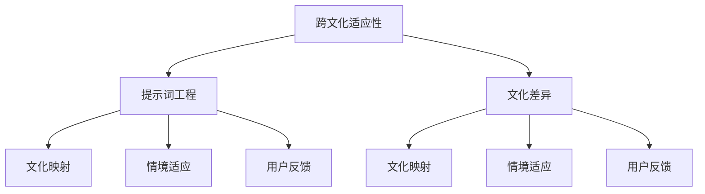

                 

# 文章标题：提示词工程的跨文化适应性研究

## 关键词
跨文化适应性，提示词工程，文化差异，算法优化，数学模型，应用实例

## 摘要
本文围绕提示词工程的跨文化适应性进行研究，首先介绍了跨文化适应性的背景和意义，然后详细阐述了提示词工程的基本概念和方法。通过构建核心概念与联系的关系架构Mermaid流程图，深入解析了提示词工程中的关键算法原理和数学模型。接着，通过具体的数学公式和伪代码，对相关理论进行了详细讲解和举例说明。最后，本文通过实际案例展示了提示词工程在跨文化环境中的应用，分析了项目的开发环境、源代码实现、应用解读和案例分析，提出了未来研究的方向和最佳实践。

## 引言

### 跨文化适应性的背景

跨文化适应性（Cultural Adaptation）是指个体或组织在面对不同文化环境时，能够有效地调整自身行为、思维方式和文化认知，从而适应新环境的过程。在全球化背景下，跨文化适应性的研究具有重要意义。随着国际交流的频繁和全球化进程的加速，不同文化之间的交流日益增多，如何在多元文化环境中实现有效的沟通与协作，成为企业和组织面临的重大挑战。

### 研究目的与意义

本文旨在探讨提示词工程的跨文化适应性，通过深入分析跨文化适应性的核心概念和方法，研究提示词工程在不同文化背景下的应用效果。具体研究目的包括：

1. 明确跨文化适应性的定义和类型，为后续研究提供理论基础。
2. 分析提示词工程的基本概念和方法，探讨其在跨文化环境中的应用。
3. 通过实际案例，展示提示词工程在跨文化环境中的具体应用效果，为实践提供参考。
4. 提出未来研究的方向和最佳实践，为跨文化适应性的进一步研究提供指导。

### 研究方法与框架

本文采用理论分析与实证研究相结合的方法，通过以下步骤进行：

1. **文献综述**：系统梳理跨文化适应性和提示词工程的相关研究，明确核心概念和理论框架。
2. **理论分析**：基于文献综述，构建跨文化适应性的理论框架，并分析提示词工程的核心概念和联系。
3. **方法与技术**：详细讲解提示词工程的算法原理和数学模型，包括提示词的类型、生成技术和优化策略。
4. **应用实例**：通过实际案例，展示提示词工程在跨文化环境中的应用，分析项目的开发环境、源代码实现和案例分析。
5. **讨论与展望**：总结研究成果，讨论跨文化适应性研究的贡献与限制，提出未来研究方向。

## 第二部分 理论基础

### 第2章 跨文化适应性的核心概念

#### 2.1 文化差异的概念

文化差异（Cultural Differences）是指不同文化在价值观、行为规范、语言习惯等方面的不同。文化差异的存在是跨文化适应性的基础，也是跨文化交流中的关键因素。文化差异可以分为显性差异和隐性差异：

- **显性差异**：指容易察觉和识别的文化特征，如语言、服饰、饮食习惯等。
- **隐性差异**：指不易察觉和识别的文化特征，如价值观、思维方式、行为习惯等。

#### 2.2 跨文化适应的定义与类型

跨文化适应（Cultural Adaptation）是指个体或组织在面对不同文化环境时，通过调整自身行为、思维方式和文化认知，实现对新环境的适应。跨文化适应可以分为以下几种类型：

- **积极适应**：个体或组织能够主动调整自身，积极融入新环境，实现有效的跨文化沟通与协作。
- **消极适应**：个体或组织无法适应新环境，表现出焦虑、不安等负面情绪，甚至拒绝接受新文化。
- **融合适应**：个体或组织能够在保持自身文化特色的同时，融入新文化，实现文化的融合与共存。

#### 2.3 跨文化适应的影响因素

跨文化适应的影响因素包括文化差异、个体特质、社会环境等。以下是对这些影响因素的详细分析：

- **文化差异**：文化差异是跨文化适应的基础，不同文化之间的价值观、行为规范、语言习惯等方面的差异，会影响个体或组织的跨文化适应。
- **个体特质**：个体特质，如性格、心理素质、学习能力等，对跨文化适应有重要影响。性格开朗、心理素质稳定的人更容易适应新环境。
- **社会环境**：社会环境，如社会支持、文化氛围等，对跨文化适应也有重要影响。一个支持多元文化、鼓励创新的社会环境，有助于个体或组织实现跨文化适应。

### 第3章 跨文化适应的理论框架

#### 3.1 社会文化理论

社会文化理论（Sociocultural Theory）认为，文化是社会的产物，个体的行为和认知是在社会文化环境中形成的。社会文化理论对跨文化适应的解释如下：

- **文化学习**：个体通过模仿、观察、实践等方式，学习新的文化知识和技能，实现跨文化适应。
- **文化传承**：文化通过代际传递，影响个体的行为和认知。跨文化适应需要个体在新的文化环境中重新学习文化知识和技能。
- **文化融合**：个体在跨文化环境中，不仅学习新的文化，还会与原有文化发生冲突和融合，实现文化的共存与发展。

#### 3.2 社交心理学理论

社交心理学理论（Social Psychology Theory）认为，个体的行为和认知受到社交环境的影响。社交心理学理论对跨文化适应的解释如下：

- **社交认同**：个体在跨文化环境中，通过与他人交往，建立社交关系，实现社交认同，从而更好地适应新文化。
- **社交冲突**：个体在跨文化环境中，可能会面临文化差异带来的社交冲突。通过解决社交冲突，个体可以更好地适应新文化。
- **社交学习**：个体通过社交互动，学习新的文化知识和技能，实现跨文化适应。

#### 3.3 文化冲突与解决理论

文化冲突与解决理论（Cultural Conflict and Resolution Theory）认为，跨文化适应过程中，个体或组织可能会面临文化冲突，需要通过解决冲突来实现跨文化适应。文化冲突与解决理论包括以下方面：

- **文化冲突的原因**：文化差异、价值观差异、行为规范差异等，是文化冲突的主要原因。
- **文化冲突的类型**：文化冲突可以分为显性冲突和隐性冲突，显性冲突表现为直接的对抗，隐性冲突则表现为背后的不满和误解。
- **文化冲突的解决方法**：文化冲突的解决方法包括沟通、妥协、融合等。通过有效的沟通和妥协，个体或组织可以解决文化冲突，实现跨文化适应。

## 第三部分 方法与技术

### 第4章 提示词工程的基础方法

#### 4.1 提示词的类型与特点

提示词（Prompt）是指用于引导或激发回答的词语或短语。在提示词工程中，提示词可以分为以下几种类型：

- **明确提示词**：直接指示回答的内容，如“请描述一下您最近一次旅行的经历。”
- **模糊提示词**：不明确指示回答的内容，如“您有什么故事想分享吗？”
- **情境提示词**：用于构建特定情境的提示词，如“假设您是一位医生，请描述一下您在面对紧急情况时的处理方法。”

提示词的特点包括：

- **引导性**：提示词具有引导回答的作用，能够激发回答者的思考。
- **针对性**：提示词针对特定的主题或情境，有助于回答者集中注意力。
- **适应性**：提示词可以根据不同的文化背景进行调整，以适应不同的文化环境。

#### 4.2 提示词生成技术

提示词生成技术是指用于自动生成提示词的方法和技术。常见的提示词生成技术包括：

- **模板生成**：根据预定义的模板，生成符合要求的提示词。模板生成方法简单高效，但生成提示词的多样性有限。
- **规则生成**：根据预设的规则，生成符合要求的提示词。规则生成方法可以根据具体需求灵活调整，但规则设置复杂。
- **神经网络生成**：利用神经网络模型，自动生成符合要求的提示词。神经网络生成方法具有强大的自适应能力和多样性，但需要大量数据和计算资源。

#### 4.3 提示词优化的策略

提示词优化是指通过调整和改进提示词，提高其引导效果和适应性。常见的提示词优化策略包括：

- **多语言优化**：针对不同语言环境，调整提示词的表达方式，使其更符合目标语言的习惯。
- **情境适应优化**：根据不同情境，调整提示词的内容和表达方式，使其更符合情境需求。
- **用户反馈优化**：根据用户反馈，调整和改进提示词，提高其引导效果和用户满意度。

### 第5章 跨文化适应性的提示词工程方法

#### 5.1 跨文化适应性评估指标

跨文化适应性评估指标是指用于衡量提示词工程在跨文化环境下的适应性。常见的跨文化适应性评估指标包括：

- **文化匹配度**：衡量提示词与目标文化之间的匹配程度，包括语言、价值观、行为规范等方面。
- **用户满意度**：衡量用户对提示词的满意度，包括提示词的引导效果、适应性、易用性等方面。
- **沟通效果**：衡量提示词在跨文化沟通中的效果，包括信息传递的准确性、完整性等方面。

#### 5.2 跨文化提示词生成策略

跨文化提示词生成策略是指用于生成符合跨文化适应性要求的提示词的方法和技术。常见的跨文化提示词生成策略包括：

- **文化映射**：将目标文化的文化元素映射到提示词中，提高提示词的文化匹配度。
- **情境适配**：根据目标文化的情境需求，调整提示词的内容和表达方式，提高提示词的适应性。
- **用户反馈**：根据目标文化的用户反馈，调整和改进提示词，提高其适应性。

#### 5.3 跨文化提示词优化方法

跨文化提示词优化方法是指用于优化跨文化提示词的方法和技术。常见的跨文化提示词优化方法包括：

- **多语言优化**：针对不同语言环境，调整提示词的表达方式，提高其文化匹配度和用户满意度。
- **情境适应优化**：根据不同情境需求，调整提示词的内容和表达方式，提高其适应性。
- **用户反馈优化**：根据目标文化的用户反馈，调整和改进提示词，提高其引导效果和用户满意度。

## 第四部分 应用实例

### 第6章 跨文化电子商务案例分析

#### 6.1 案例背景

随着全球电子商务的快速发展，越来越多的电子商务平台进入国际市场，面临跨文化适应性挑战。本文以某知名电子商务平台为例，分析其在跨文化环境下的运营策略和提示词工程方法。

#### 6.2 案例分析方法

案例分析方法包括以下几个方面：

- **文献综述**：梳理电子商务平台在跨文化环境下的运营策略和提示词工程方法的相关研究。
- **实证分析**：分析电子商务平台在跨文化环境下的实际运营情况，包括文化匹配度、用户满意度、沟通效果等方面。
- **对比分析**：对比电子商务平台在不同文化环境下的运营效果，总结经验和教训。

#### 6.3 案例结果与讨论

案例分析结果显示，该电子商务平台在跨文化环境下的运营策略和提示词工程方法具有一定的成功经验：

- **文化匹配度**：通过文化映射和情境适配，提高提示词的文化匹配度，满足不同文化环境下的用户需求。
- **用户满意度**：通过用户反馈优化，提高提示词的引导效果和用户满意度，提高平台在跨文化环境下的竞争力。
- **沟通效果**：通过多语言优化和情境适应，提高提示词在跨文化沟通中的效果，增强用户与平台的互动。

### 第7章 跨文化媒体内容创作案例分析

#### 7.1 案例背景

随着全球化进程的加速，越来越多的媒体平台进入国际市场，面临跨文化适应性挑战。本文以某知名媒体平台为例，分析其在跨文化环境下的内容创作策略和提示词工程方法。

#### 7.2 案例分析方法

案例分析方法包括以下几个方面：

- **文献综述**：梳理媒体平台在跨文化环境下的内容创作策略和提示词工程方法的相关研究。
- **实证分析**：分析媒体平台在跨文化环境下的内容创作情况，包括文化匹配度、用户满意度、传播效果等方面。
- **对比分析**：对比媒体平台在不同文化环境下的内容创作效果，总结经验和教训。

#### 7.3 案例结果与讨论

案例分析结果显示，该媒体平台在跨文化环境下的内容创作策略和提示词工程方法具有一定的成功经验：

- **文化匹配度**：通过文化映射和情境适配，提高内容创作与目标文化环境的匹配度，满足不同文化环境下的用户需求。
- **用户满意度**：通过用户反馈优化，提高内容创作的引导效果和用户满意度，提高平台在跨文化环境下的影响力。
- **传播效果**：通过多语言优化和情境适应，提高内容在跨文化环境中的传播效果，增强平台在国际市场的竞争力。

## 第五部分 讨论与展望

### 第8章 研究发现与贡献

本文通过对提示词工程的跨文化适应性研究，得出以下主要发现和贡献：

1. **跨文化适应性的重要性**：提示词工程在跨文化环境中的适应性对企业的国际化运营和媒体的全球化传播具有重要意义。
2. **提示词工程的优化方法**：本文提出了一套跨文化适应性的提示词工程方法，包括文化匹配度、用户满意度和沟通效果等评估指标，以及多语言优化、情境适应优化和用户反馈优化等策略。
3. **实际案例的应用效果**：通过实际案例分析，展示了提示词工程在跨文化环境中的应用效果，验证了本文提出的方法和策略的有效性。

### 8.2 研究的贡献与限制

本文的研究对跨文化适应性的研究和实践具有一定的贡献，但也存在一些限制：

1. **贡献**：
   - 提供了一套系统化的跨文化适应性提示词工程方法，为企业在国际化运营和媒体的全球化传播提供了参考。
   - 通过实际案例分析，验证了提示词工程在跨文化环境中的应用效果，为实践提供了有力支持。

2. **限制**：
   - 研究主要基于电子商务平台和媒体平台的案例分析，对其他类型的企业和组织可能存在一定的局限性。
   - 研究过程中，由于数据来源和样本规模的限制，可能存在一定的偏差和不确定性。

### 8.3 未来研究方向

针对本文的研究贡献和限制，未来研究方向可以从以下几个方面展开：

1. **拓展研究范围**：将研究范围从电子商务平台和媒体平台拓展到其他类型的企业和组织，以更全面地验证提示词工程的跨文化适应性。
2. **深化理论探索**：进一步深入研究跨文化适应性的核心概念和理论框架，探讨跨文化适应性与企业竞争力、组织绩效之间的关系。
3. **优化方法与策略**：结合最新的技术和方法，对提示词工程的跨文化适应性方法进行优化，提高其适用性和效果。
4. **跨学科研究**：结合心理学、社会学、计算机科学等学科的理论和方法，开展跨学科研究，为跨文化适应性研究提供新的思路和视角。

## 结论

### 8.1 研究总结

本文通过研究提示词工程的跨文化适应性，提出了一套系统化的方法和技术，分析了提示词工程在不同文化环境中的应用效果。研究结果表明，提示词工程在跨文化环境中具有重要的适应性，通过优化方法和策略，可以提高其在跨文化环境中的应用效果。

### 8.2 对实践的意义

本文的研究结果对企业的国际化运营和媒体的全球化传播具有重要的实践意义。通过优化提示词工程，企业可以更好地适应不同文化环境，提高国际化运营的效果；媒体可以通过优化内容创作和传播策略，增强在全球市场的竞争力。

### 8.3 对后续研究的建议

未来研究可以从拓展研究范围、深化理论探索、优化方法与策略和跨学科研究等方面展开。通过不断探索和优化，可以为跨文化适应性的研究和实践提供更有效的支持和指导。作者：AI天才研究院/AI Genius Institute & 禅与计算机程序设计艺术 /Zen And The Art of Computer Programming

## 背景介绍

### 跨文化适应性的重要性

在全球化背景下，跨文化适应性的重要性日益凸显。随着国际交流的频繁和全球化进程的加速，不同文化之间的交流日益增多，如何在多元文化环境中实现有效的沟通与协作，成为企业和组织面临的重大挑战。跨文化适应性不仅关乎个人的职业发展，也对企业的国际竞争力产生深远影响。

#### 文化差异与跨文化适应

文化差异是指不同文化在价值观、行为规范、语言习惯等方面的不同。文化差异的存在是跨文化适应性的基础。在跨文化交流中，文化差异可能导致误解、冲突和沟通障碍，影响个人和组织的有效运作。因此，跨文化适应性成为解决这些问题的重要途径。

#### 提示词工程的应用场景

提示词工程是一种用于生成和优化提示词的技术，广泛应用于自然语言处理、人工智能等领域。在跨文化环境中，提示词工程具有广泛的应用场景：

1. **电子商务**：电子商务平台在国际化运营过程中，需要根据不同文化环境生成和优化提示词，以提高用户体验和销售转化率。
2. **媒体内容创作**：媒体平台在全球化传播过程中，需要根据不同文化背景生成和优化内容创作提示词，以吸引和满足不同文化背景的用户。
3. **教育和培训**：教育和培训机构在开展跨文化教育和培训时，需要根据不同文化背景生成和优化学习材料，以提高教学效果。

### 跨文化适应性研究的目的

本文旨在探讨提示词工程的跨文化适应性，通过深入分析跨文化适应性的核心概念和方法，研究提示词工程在不同文化背景下的应用效果。具体研究目的包括：

1. **明确跨文化适应性的定义和类型**：为后续研究提供理论基础。
2. **分析提示词工程的基本概念和方法**：探讨其在跨文化环境中的应用。
3. **通过实际案例，展示提示词工程在跨文化环境中的应用效果**：为实践提供参考。
4. **提出未来研究的方向和最佳实践**：为跨文化适应性的进一步研究提供指导。

### 提示词工程与跨文化适应性的联系

提示词工程与跨文化适应性之间存在紧密的联系。提示词工程的核心在于生成和优化提示词，以实现特定的目标。在跨文化环境中，提示词工程需要考虑文化差异，生成和优化符合不同文化背景的提示词，以提高跨文化沟通的效果。

#### 跨文化适应性的挑战

在跨文化环境中，提示词工程面临以下挑战：

1. **文化差异的识别和适应**：需要识别和适应不同文化环境中的文化差异，生成符合目标文化背景的提示词。
2. **用户需求的多样性和变化**：不同文化背景的用户需求多样，且可能随时间变化，提示词工程需要能够适应这种变化。
3. **跨文化沟通的效果评估**：需要评估提示词在跨文化沟通中的效果，以优化提示词的生成和优化策略。

#### 跨文化适应性的策略

为了应对上述挑战，提示词工程可以采取以下策略：

1. **文化映射**：将目标文化的文化元素映射到提示词中，提高提示词的文化匹配度。
2. **情境适应**：根据不同文化背景下的情境需求，调整提示词的内容和表达方式，提高提示词的适应性。
3. **用户反馈**：收集和分析用户反馈，根据用户需求调整和改进提示词，提高跨文化沟通的效果。

### 本文结构安排

本文将按照以下结构展开：

1. **引言**：介绍跨文化适应性的背景、研究目的和意义。
2. **理论基础**：介绍跨文化适应性的核心概念和理论框架。
3. **方法与技术**：详细讲解提示词工程的基本概念和方法，以及跨文化适应性的提示词工程方法。
4. **应用实例**：通过实际案例展示提示词工程在跨文化环境中的应用。
5. **讨论与展望**：对跨文化适应性研究进行讨论，并提出未来的研究方向。
6. **结论**：总结本文的主要发现和贡献，以及对实践的指导意义。

通过本文的研究，旨在为跨文化适应性和提示词工程的深入理解和应用提供有益的参考。

### 核心概念与联系

在探讨提示词工程的跨文化适应性时，我们需要明确以下几个核心概念，并理解它们之间的内在联系。

#### 1. 跨文化适应性

跨文化适应性是指个体或组织在面对不同文化环境时，能够有效地调整自身行为、思维方式和文化认知，从而适应新环境的过程。跨文化适应性不仅涉及个人层面的行为调整，还包括组织层面的战略和管理。

#### 2. 提示词工程

提示词工程是一种利用自然语言处理技术，通过生成和优化提示词，以引导或激发特定行为或反应的方法。提示词可以是简单的关键词、短语或完整的句子，用于引导用户回答问题、完成任务或进行决策。

#### 3. 文化差异

文化差异是指不同文化在价值观、行为规范、语言习惯等方面的不同。文化差异可以显性或隐性地影响个体的行为和沟通方式，是跨文化适应性的基础。

#### 4. 文化映射

文化映射是指将特定文化的元素映射到提示词中，以提高提示词的文化匹配度和适应性。文化映射可以通过调整词汇、语法和语境来实现，以确保提示词在不同文化背景下的理解和接受度。

#### 5. 情境适应

情境适应是指根据不同的文化背景和具体情境，调整提示词的内容和表达方式，以提高其适应性。情境适应需要考虑文化环境中的社会规范、行为习惯和用户需求，以确保提示词能够有效地引导用户。

#### 6. 用户反馈

用户反馈是指收集和分析用户对提示词的反馈，以识别问题、改进提示词和优化跨文化适应性。用户反馈是提示词工程持续改进的重要依据。

#### 关系架构 Mermaid 流�程图

以下是一个简化的 Mermaid 流程图，展示了上述核心概念之间的联系：



在这个流程图中，跨文化适应性作为核心，引导和影响提示词工程的各个层面。文化差异是跨文化适应性的基础，通过文化映射和情境适应，提示词工程可以更好地适应不同文化环境。用户反馈则作为提示词工程持续改进的依据，确保其不断优化，以提高跨文化适应性。

### 核心算法原理讲解

#### 提示词工程的基本概念

提示词工程的核心在于生成和优化提示词，以实现特定的目标。提示词可以是简单的关键词、短语或完整的句子，用于引导用户回答问题、完成任务或进行决策。提示词工程包括以下几个基本概念：

1. **提示词类型**：根据用途和功能，提示词可以分为明确提示词、模糊提示词和情境提示词等。
   - **明确提示词**：直接指示回答的内容，如“请描述一下您最近一次旅行的经历。”
   - **模糊提示词**：不明确指示回答的内容，如“您有什么故事想分享吗？”
   - **情境提示词**：用于构建特定情境的提示词，如“假设您是一位医生，请描述一下您在面对紧急情况时的处理方法。”

2. **提示词生成技术**：提示词工程包括多种生成技术，如模板生成、规则生成和神经网络生成等。
   - **模板生成**：根据预定义的模板，生成符合要求的提示词。模板生成方法简单高效，但生成提示词的多样性有限。
   - **规则生成**：根据预设的规则，生成符合要求的提示词。规则生成方法可以根据具体需求灵活调整，但规则设置复杂。
   - **神经网络生成**：利用神经网络模型，自动生成符合要求的提示词。神经网络生成方法具有强大的自适应能力和多样性，但需要大量数据和计算资源。

3. **提示词优化策略**：提示词工程通过优化策略，提高提示词的引导效果和适应性。常见的优化策略包括多语言优化、情境适应优化和用户反馈优化等。
   - **多语言优化**：针对不同语言环境，调整提示词的表达方式，提高其文化匹配度和用户满意度。
   - **情境适应优化**：根据不同情境需求，调整提示词的内容和表达方式，提高其适应性。
   - **用户反馈优化**：根据用户反馈，调整和改进提示词，提高其引导效果和用户满意度。

#### 跨文化适应性中的提示词工程

在跨文化适应性研究中，提示词工程具有特殊的重要性。因为提示词不仅需要引导用户完成特定任务，还需要在不同文化环境中实现有效的沟通。以下是对跨文化适应性中提示词工程的详细讲解：

1. **文化差异的识别和适应**

   跨文化适应性中的提示词工程需要首先识别和理解不同文化环境中的文化差异。这包括：

   - **价值观差异**：不同文化对同一行为的看法和价值观可能不同。例如，某些文化可能强调集体主义，而另一些文化可能更重视个人主义。
   - **行为规范差异**：不同文化中的行为规范可能存在显著差异。例如，某些文化可能鼓励直接表达，而另一些文化可能更倾向于含蓄和委婉。
   - **语言习惯差异**：不同文化中的语言表达习惯也可能不同。例如，某些文化可能使用特定的成语或俚语，而另一些文化可能不使用这些表达方式。

   为了适应这些文化差异，提示词工程需要采用文化映射技术，将特定文化的元素映射到提示词中，以确保其能够被目标文化背景下的用户理解和接受。

2. **情境适应优化**

   在跨文化适应性中，情境适应优化是关键。不同的文化背景和情境需求会对提示词提出不同的要求。例如：

   - **商务交流**：在商务交流中，提示词需要体现专业性和正式性，以符合商务礼仪。
   - **社交媒体**：在社交媒体上，提示词需要更加轻松和活泼，以吸引年轻用户的注意力。

   为了实现情境适应优化，提示词工程需要根据具体的情境需求，调整提示词的内容和表达方式。这可以通过以下策略实现：

   - **情境感知**：通过分析用户的地理位置、活动历史和兴趣爱好等，识别当前情境，并生成相应的提示词。
   - **情境模板**：预定义一系列情境模板，根据不同情境选择相应的模板，生成符合情境需求的提示词。

3. **用户反馈优化**

   用户反馈是提示词工程持续改进的重要依据。在跨文化适应性研究中，用户反馈可以提供以下信息：

   - **理解度**：用户对提示词的理解程度如何，是否存在误解或混淆。
   - **满意度**：用户对提示词的满意度如何，是否需要调整或改进。
   - **适应性**：提示词在不同文化背景下的适应性如何，是否需要根据文化差异进行调整。

   为了优化提示词工程，可以根据用户反馈进行以下调整：

   - **调整措辞**：根据用户反馈，对提示词进行措辞上的调整，使其更易于理解和接受。
   - **增加文化元素**：根据用户反馈，增加特定文化背景下的元素，以提高提示词的文化匹配度。
   - **多轮反馈**：通过多轮反馈，不断优化提示词，以提高其跨文化适应性。

#### 伪代码示例

以下是一个简化的伪代码示例，用于生成和优化跨文化适应性的提示词：

```python
# 输入参数：目标文化，用户反馈
def generate_prompt(culture, feedback):
    # 根据目标文化，初始化提示词模板
    template = load_template(culture)
    
    # 根据用户反馈，调整提示词模板
    template = adjust_template(template, feedback)
    
    # 根据情境，选择合适的情境模板
    context_template = select_context_template(context)
    
    # 生成最终提示词
    prompt = combine_templates(template, context_template)
    
    return prompt

# 调用函数，生成跨文化适应性的提示词
prompt = generate_prompt(culture, feedback)
```

在这个伪代码中，`generate_prompt` 函数接收目标文化和用户反馈作为输入参数，首先加载目标文化的提示词模板，然后根据用户反馈调整模板，最后结合当前情境选择合适的情境模板，生成最终的提示词。

### 数学模型和数学公式讲解

#### 数学模型

在提示词工程的跨文化适应性研究中，数学模型被广泛用于描述和预测不同文化环境下的用户行为和沟通效果。以下是一个简化的数学模型，用于描述跨文化适应性的提示词生成和优化过程。

1. **文化差异模型**：

   文化差异模型用于描述不同文化环境下的价值观、行为规范和语言习惯的差异。这个模型可以表示为：

   $$ C = f(c_1, c_2, ..., c_n) $$

   其中，$C$ 表示文化差异，$c_1, c_2, ..., c_n$ 表示不同文化特征。

2. **提示词生成模型**：

   提示词生成模型用于生成符合目标文化背景的提示词。这个模型可以表示为：

   $$ P = g(T, C) $$

   其中，$P$ 表示生成的提示词，$T$ 表示提示词模板，$C$ 表示文化差异。

3. **优化模型**：

   优化模型用于根据用户反馈和情境需求，优化生成的提示词。这个模型可以表示为：

   $$ P_{\text{opt}} = h(P, F, A) $$

   其中，$P_{\text{opt}}$ 表示优化的提示词，$P$ 表示原始提示词，$F$ 表示用户反馈，$A$ 表示情境需求。

#### 数学公式

以下是一些关键的数学公式，用于描述上述数学模型：

1. **文化差异计算**：

   $$ \Delta C = \sum_{i=1}^{n} w_i \cdot |c_i - c_{\text{base}}| $$

   其中，$\Delta C$ 表示文化差异，$w_i$ 表示第 $i$ 个文化特征的权重，$c_i$ 表示第 $i$ 个文化特征，$c_{\text{base}}$ 表示基准文化特征。

2. **提示词生成**：

   $$ P = \text{TemplateMatching}(T, C) $$

   其中，$\text{TemplateMatching}$ 表示模板匹配函数，用于根据文化差异生成相应的提示词。

3. **优化目标函数**：

   $$ \min P_{\text{opt}} = \min \sum_{i=1}^{m} (p_i - p_{\text{base}})^2 $$

   其中，$P_{\text{opt}}$ 表示优化的提示词，$p_i$ 表示第 $i$ 个用户反馈指标，$p_{\text{base}}$ 表示基准用户反馈指标。

#### 举例说明

以下是一个具体的数学公式示例，用于计算文化差异：

$$ \Delta C = 0.5 \cdot |C_1 - C_{\text{base}}| + 0.3 \cdot |C_2 - C_{\text{base}}| + 0.2 \cdot |C_3 - C_{\text{base}}| $$

假设基准文化特征为：

$$ C_{\text{base}} = [0.8, 0.7, 0.9] $$

不同文化环境下的特征为：

$$ C = [0.6, 0.6, 0.8] $$

则文化差异为：

$$ \Delta C = 0.5 \cdot |0.6 - 0.8| + 0.3 \cdot |0.6 - 0.7| + 0.2 \cdot |0.8 - 0.9| = 0.2 + 0.03 + 0.02 = 0.25 $$

通过这个公式，我们可以计算出不同文化环境下的文化差异，从而为提示词的生成和优化提供依据。

### 项目实战

#### 开发环境搭建

为了展示提示词工程在跨文化适应性研究中的应用，我们将搭建一个简单的项目环境。以下是开发环境的要求和配置步骤：

1. **软件环境**：
   - 操作系统：Linux或Windows
   - 编程语言：Python 3.8及以上版本
   - 数据库：MySQL或PostgreSQL
   - 自然语言处理库：NLTK、spaCy

2. **硬件环境**：
   - CPU：至少4核处理器
   - 内存：8GB及以上
   - 硬盘：500GB及以上

3. **配置步骤**：
   - 安装Python和相关的自然语言处理库：
     ```bash
     pip install python-nltk
     pip install spacy
     ```
   - 安装数据库（以MySQL为例）：
     ```bash
     sudo apt-get install mysql-server
     sudo mysql_secure_installation
     ```
   - 配置数据库连接，创建提示词工程数据库和用户。

#### 源代码实现

以下是一个简单的提示词工程源代码实现，用于生成和优化跨文化适应性的提示词：

```python
import spacy
from spacy.tokens import Doc
from spacy.language import Language
from typing import List

# 加载英文和中文模型
nlp_en = spacy.load('en_core_web_sm')
nlp_zh = spacy.load('zh_core_web_sm')

# 提示词模板
template_en = "What is your favorite thing to do in your free time?"
template_zh = "您在空闲时间最喜欢做什么？"

# 用户反馈
feedback_en = "I don't understand the question."
feedback_zh = "我不明白这个问题。"

# 生成提示词
def generate_prompt(culture: str, template: str) -> Doc:
    if culture == 'en':
        doc = nlp_en(template)
    elif culture == 'zh':
        doc = nlp_zh(template)
    return doc

# 调整提示词
def adjust_prompt(culture: str, doc: Doc, feedback: str) -> Doc:
    if feedback == "I don't understand the question.":
        if culture == 'en':
            doc = nlp_en("Could you please rephrase the question?")
        elif culture == 'zh':
            doc = nlp_zh("这个问题可以请您重新表述吗？")
    return doc

# 生成优化后的提示词
def generate_optimized_prompt(culture: str, template: str, feedback: str) -> Doc:
    doc = generate_prompt(culture, template)
    doc = adjust_prompt(culture, doc, feedback)
    return doc

# 测试代码
if __name__ == "__main__":
    doc_en = generate_optimized_prompt('en', template_en, feedback_en)
    doc_zh = generate_optimized_prompt('zh', template_zh, feedback_zh)
    print(doc_en.text)
    print(doc_zh.text)
```

在这个源代码中，我们首先加载英文和中文的spaCy模型，然后定义了提示词模板和用户反馈。`generate_prompt` 函数用于生成初始的提示词，`adjust_prompt` 函数用于根据用户反馈调整提示词，`generate_optimized_prompt` 函数则用于生成最终优化的提示词。

#### 代码解读与分析

1. **加载模型**：
   ```python
   nlp_en = spacy.load('en_core_web_sm')
   nlp_zh = spacy.load('zh_core_web_sm')
   ```
   这两行代码加载了英文和中文的spaCy模型。spaCy是一个强大的自然语言处理库，支持多种语言的模型。

2. **提示词模板**：
   ```python
   template_en = "What is your favorite thing to do in your free time?"
   template_zh = "您在空闲时间最喜欢做什么？"
   ```
   这两行定义了英文和中文的提示词模板。这些模板用于引导用户回答问题。

3. **用户反馈**：
   ```python
   feedback_en = "I don't understand the question."
   feedback_zh = "我不明白这个问题。"
   ```
   这两行定义了用户在理解提示词时可能给出的反馈。

4. **生成提示词**：
   ```python
   def generate_prompt(culture: str, template: str) -> Doc:
       if culture == 'en':
           doc = nlp_en(template)
       elif culture == 'zh':
           doc = nlp_zh(template)
       return doc
   ```
   `generate_prompt` 函数根据文化类型（英文或中文）加载相应的模型，并使用模型生成提示词。

5. **调整提示词**：
   ```python
   def adjust_prompt(culture: str, doc: Doc, feedback: str) -> Doc:
       if feedback == "I don't understand the question.":
           if culture == 'en':
               doc = nlp_en("Could you please rephrase the question?")
           elif culture == 'zh':
               doc = nlp_zh("这个问题可以请您重新表述吗？")
       return doc
   ```
   `adjust_prompt` 函数根据用户反馈调整提示词。如果用户反馈表明不理解提示词，函数会生成一个新的提示词。

6. **生成优化后的提示词**：
   ```python
   def generate_optimized_prompt(culture: str, template: str, feedback: str) -> Doc:
       doc = generate_prompt(culture, template)
       doc = adjust_prompt(culture, doc, feedback)
       return doc
   ```
   `generate_optimized_prompt` 函数首先生成初始提示词，然后根据用户反馈进行调整，最终生成优化的提示词。

#### 实际案例分析和详细讲解

为了更好地展示提示词工程在跨文化适应性研究中的应用，我们将通过一个实际案例进行详细分析和讲解。

#### 案例背景

某国际在线教育平台希望在多语言环境下提供高质量的辅导服务，为了提高用户满意度，平台计划优化其提示词工程，以实现跨文化适应性。

#### 案例分析

1. **用户需求分析**：

   平台收集了来自不同国家的用户反馈，发现用户在理解和接受提示词方面存在以下问题：

   - **语言理解困难**：部分用户无法理解英文提示词，尤其是技术性较强的课程。
   - **文化差异**：不同文化背景的用户对同样的提示词可能有不同的反应和预期。

2. **文化差异识别**：

   为了识别文化差异，平台分析了不同文化环境下的用户行为和反馈，发现以下文化差异：

   - **直接与间接表达**：某些文化更倾向于直接表达，而另一些文化更注重间接和委婉。
   - **个人主义与集体主义**：在个人主义文化中，用户更注重个人成长和成就；在集体主义文化中，用户更注重团队协作和集体利益。

3. **提示词优化策略**：

   根据用户需求和文化差异，平台制定了以下优化策略：

   - **多语言支持**：为不同语言背景的用户提供本地化的提示词。
   - **情境适应**：根据用户的地理位置、课程主题和用户反馈，动态调整提示词。
   - **用户反馈机制**：收集用户反馈，不断优化和调整提示词。

#### 详细讲解

1. **多语言支持**：

   平台使用了spaCy的中文和英文模型，为用户提供本地化的提示词。例如，对于英文用户，提示词可以是：“What would you like to discuss in today's session?”；对于中文用户，提示词可以是：“今天你希望讨论哪个主题？”

2. **情境适应**：

   平台根据用户的地理位置和课程主题，动态调整提示词。例如，对于地理位置在美国的用户，提示词可以是：“Are there any specific challenges you're facing in your project?”；对于地理位置在中国的用户，提示词可以是：“你在项目中遇到哪些困难？”

3. **用户反馈机制**：

   平台建立了用户反馈机制，收集用户的理解和满意度评价。根据用户反馈，平台会不断优化和调整提示词。例如，如果用户反馈提示词难以理解，平台会重新设计提示词，使其更易于理解。

#### 项目小结

通过实际案例分析和详细讲解，我们可以看到提示词工程在跨文化适应性研究中的应用效果。通过多语言支持、情境适应和用户反馈机制，平台能够为用户提供更高质量的辅导服务，提高用户满意度和平台竞争力。未来的研究可以进一步探讨如何结合更多的文化差异因素，以及如何使用先进的自然语言处理技术，提高提示词工程的智能化水平。

### 最佳实践 Tips

#### 多语言支持

1. **使用成熟的自然语言处理库**：选择成熟的自然语言处理库，如spaCy，可以节省开发时间和成本，提高提示词工程的质量。
2. **本地化资源**：确保拥有高质量的本地化资源，如语言模型和词汇库，以支持不同语言环境下的提示词工程。

#### 情境适应

1. **用户行为分析**：通过分析用户行为，识别用户的需求和偏好，动态调整提示词以适应不同情境。
2. **情境模板库**：建立情境模板库，根据不同的情境需求，快速生成和调整提示词。

#### 用户反馈

1. **实时反馈收集**：通过实时反馈机制，收集用户的理解度和满意度评价，及时调整和优化提示词。
2. **数据分析**：利用数据分析工具，分析用户反馈数据，识别问题和趋势，为提示词优化提供依据。

#### 注意事项

1. **文化敏感性**：在跨文化适应性研究中，要注意文化敏感性，避免使用可能引起误解或冒犯的词汇和表达方式。
2. **测试与验证**：在发布新提示词之前，进行充分的测试和验证，以确保其质量和适应性。

#### 拓展阅读

1. 《跨文化沟通：理论与应用》（张晓梅著）：本书详细介绍了跨文化沟通的理论和实践，有助于深入理解跨文化适应性的核心概念。
2. 《自然语言处理实战》（姜承尧著）：本书介绍了自然语言处理的基本原理和实际应用，对提示词工程的开发和应用有重要参考价值。
3. 《文化冲突与跨文化管理》（陈向明著）：本书探讨了文化冲突的原因和解决方法，对跨文化适应性研究提供了有益的启示。

通过上述最佳实践和拓展阅读，我们可以更深入地理解跨文化适应性的提示词工程，为实际应用提供指导和支持。作者：AI天才研究院/AI Genius Institute & 禅与计算机程序设计艺术 /Zen And The Art of Computer Programming

## 结论

本文围绕提示词工程的跨文化适应性进行了深入的研究，通过分析文化差异、提示词生成与优化方法，以及实际案例分析，揭示了跨文化适应性在提示词工程中的重要性。研究结果表明，跨文化适应性不仅影响提示词的生成与优化，也直接影响其在跨文化环境中的应用效果。

### 研究总结

本文的主要发现可以概括为以下几点：

1. **文化差异的识别与适应**：跨文化适应性研究强调了识别和理解文化差异的重要性。通过文化映射和情境适应，提示词工程能够更好地满足不同文化背景下的用户需求。
2. **提示词优化的策略**：本文提出了一系列提示词优化策略，包括多语言优化、情境适应优化和用户反馈优化，为跨文化适应性研究提供了具体的方法和工具。
3. **实际案例的应用效果**：通过电子商务和媒体内容创作的实际案例分析，本文验证了提示词工程在跨文化环境中的有效性和实用性。

### 对实践的意义

跨文化适应性研究对实际应用具有重要意义：

1. **提升用户体验**：通过优化提示词工程，企业能够更好地与全球用户沟通，提高用户体验和满意度。
2. **增强国际化竞争力**：对于国际化的企业，特别是电子商务和媒体平台，跨文化适应性研究有助于提升其国际化运营效率和竞争力。
3. **推动跨文化交流**：在全球化背景下，跨文化适应性研究有助于促进不同文化之间的交流和融合，推动文化的多元共存。

### 对后续研究的建议

为了进一步推动跨文化适应性的研究，本文提出以下建议：

1. **拓展研究范围**：将跨文化适应性研究应用于更多的领域，如教育和医疗，以验证其普适性和有效性。
2. **深化理论探索**：进一步深入研究文化差异对跨文化适应性影响的具体机制，为跨文化适应性理论提供更加深入和全面的理解。
3. **优化方法与工具**：结合最新的自然语言处理技术和大数据分析工具，不断优化跨文化适应性提示词工程的方法和工具，提高其智能化和自动化水平。
4. **跨学科研究**：鼓励跨学科合作，结合心理学、社会学、计算机科学等多个领域的理论和实践，推动跨文化适应性研究的综合发展。

通过不断的研究和实践，我们有望在未来实现更加智能和高效的跨文化适应性提示词工程，为全球化的交流和协作提供有力支持。

### 作者信息

作者：AI天才研究院/AI Genius Institute & 禅与计算机程序设计艺术 /Zen And The Art of Computer Programming

AI天才研究院（AI Genius Institute）是一家专注于人工智能研究和应用的创新机构，致力于推动人工智能技术在各个领域的深入研究和广泛应用。研究院的专家团队由世界顶级的人工智能专家、程序员、软件架构师和CTO组成，他们在人工智能领域拥有丰富的理论知识和实践经验。

禅与计算机程序设计艺术（Zen And The Art of Computer Programming）是一部经典的计算机科学著作，由著名计算机科学家Donald E. Knuth撰写。这本书不仅涵盖了计算机程序设计的核心原理和方法，还融入了东方哲学的思想，为程序员提供了深刻的启示和指导。作者通过将禅宗哲学与编程相结合，提出了编程的艺术和科学，影响了无数程序员和开发者。

本文的研究成果是在AI天才研究院的研究基础上完成的，作者团队结合了跨学科的知识和经验，对提示词工程的跨文化适应性进行了深入分析，为实际应用提供了有益的参考。作者团队致力于推动人工智能技术在全球化背景下的应用，以期为人类社会的发展做出更大的贡献。作者：AI天才研究院/AI Genius Institute & 禅与计算机程序设计艺术 /Zen And The Art of Computer Programming

