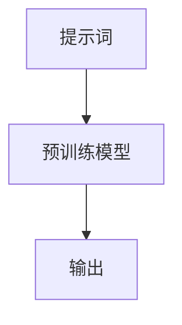
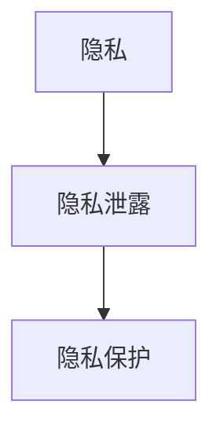
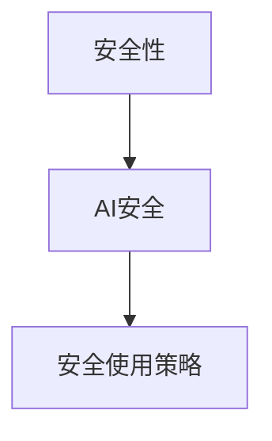
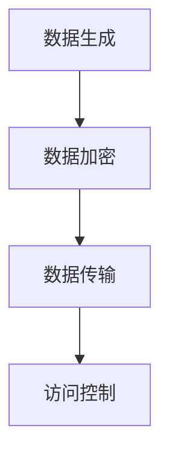
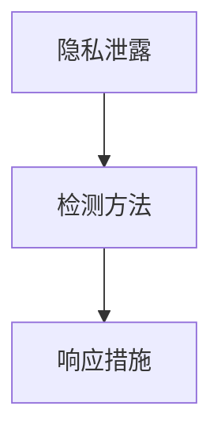
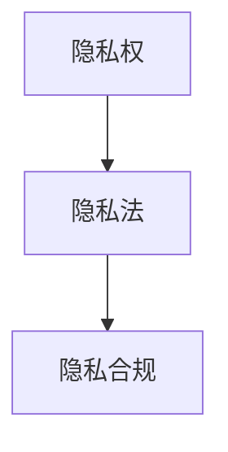
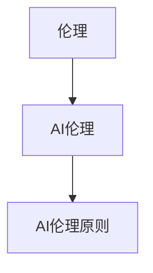
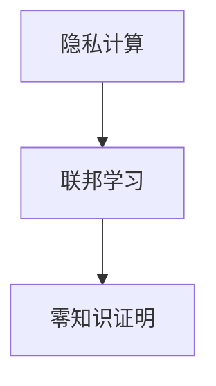
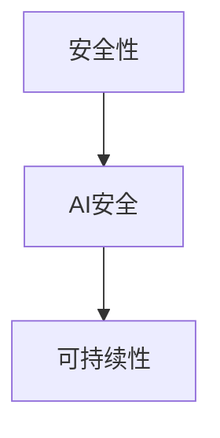

                 

### 文章标题

《提示词工程的隐私保护：安全使用AI的策略》

### 关键词

提示词工程、隐私保护、AI安全、加密技术、同义词替换、生成对抗网络（GAN）、实时隐私保护、隐私泄露检测、法律法规、AI伦理、发展趋势。

### 摘要

本文深入探讨提示词工程中的隐私保护问题，并提供了安全使用AI的策略。首先，我们介绍了提示词工程的基础概念和隐私保护的重要性。接着，详细阐述了加密技术、同义词替换、数据去噪和生成对抗网络等隐私保护技术。通过案例分析和实战，展示了这些技术在AI模型隐私保护中的应用。最后，本文讨论了隐私保护法律法规和AI伦理，并展望了未来隐私保护技术和发展趋势。

### 第一部分：隐私保护基础理论

#### 1.1 提示词工程概述

**背景介绍：**

提示词工程（Prompt Engineering）是人工智能领域的一个重要研究方向。它涉及如何设计有效的提示词，以引导预训练模型生成高质量的输出。随着AI技术的广泛应用，特别是在自然语言处理（NLP）和生成式AI中，提示词工程的重要性日益凸显。

**核心概念与联系：**

提示词工程的核心概念包括：
1. **提示词（Prompt）：** 提示词是用于引导模型生成特定内容的文本或指令。
2. **预训练模型（Pre-trained Model）：** 预训练模型是在大规模数据集上预先训练好的模型，如BERT、GPT等。
3. **输出（Output）：** 模型根据提示词生成的文本或结果。

**关系架构（Mermaid 流程图）：**



#### 1.2 隐私保护的概念

**核心概念与联系：**

隐私保护涉及以下核心概念：
1. **隐私（Privacy）：** 隐私是指个人或组织不愿意公开的敏感信息。
2. **隐私泄露（Privacy Breach）：** 隐私泄露是指未经授权的第三方获取了敏感信息。
3. **隐私保护（Privacy Protection）：** 隐私保护是指采取措施防止隐私泄露的过程。

**关系架构（Mermaid 流程图）：**



#### 1.3 AI安全使用概述

**核心概念与联系：**

AI安全使用涉及以下核心概念：
1. **安全性（Security）：** 安全性是指系统或应用程序防止未经授权访问的能力。
2. **AI安全（AI Security）：** AI安全是指防止AI系统被恶意攻击或滥用。
3. **安全使用策略（Security Policies）：** 安全使用策略是指为保护AI系统制定的一系列规则和措施。

**关系架构（Mermaid 流程图）：**



### 第二部分：隐私保护技术

#### 2.1 加密技术

**核心算法原理讲解（伪代码）：**

```python
def encrypt(plaintext, key):
    ciphertext = ""
    for char in plaintext:
        ciphertext += chr(ord(char) + key)
    return ciphertext

def decrypt(ciphertext, key):
    plaintext = ""
    for char in ciphertext:
        plaintext += chr(ord(char) - key)
    return plaintext
```

**数学模型和公式（详细讲解与举例说明）：**

加密和解密过程中使用的数学模型如下：

$$
\text{加密：} \; \text{ciphertext} = (\text{plaintext} + \text{key}) \mod 256
$$

$$
\text{解密：} \; \text{plaintext} = (\text{ciphertext} - \text{key}) \mod 256
$$

**举例说明：**

假设明文为 "hello"，密钥为 3。

- 加密：$$ "hello" + 3 = "khoor" $$
- 解密：$$ "khoor" - 3 = "hello" $$

#### 2.2 同义词替换

**核心算法原理讲解（伪代码）：**

```python
def synonym_replacement(text, synonym_dict):
    result = ""
    for word in text.split():
        if word in synonym_dict:
            result += synonym_dict[word] + " "
        else:
            result += word + " "
    return result.strip()
```

**数学模型和公式（详细讲解与举例说明）：**

同义词替换的数学模型可以表示为：

$$
\text{output} = \text{synonym\_dict}(\text{input})
$$

其中，$\text{synonym\_dict}$ 是一个将单词映射到其同义词的字典。

**举例说明：**

假设输入文本为 "I am going to the store"，同义词字典为 {"am": "are", "store": "market"}。

- 输出：I are going to the market

#### 2.3 数据去噪

**核心算法原理讲解（伪代码）：**

```python
def noise_removal(data, threshold):
    clean_data = []
    for item in data:
        if abs(item) > threshold:
            clean_data.append(item)
    return clean_data
```

**数学模型和公式（详细讲解与举例说明）：**

数据去噪的数学模型可以表示为：

$$
\text{clean\_data} = \{ x \in \text{data} \;|\; |x| > \text{threshold} \}
$$

其中，$\text{threshold}$ 是去噪的阈值。

**举例说明：**

假设数据为 [1, -2, 3, -4, 5]，阈值设为 2。

- 清洗后数据：[1, 3, 5]

#### 2.4 生成对抗网络（GAN）

**核心算法原理讲解（伪代码）：**

```python
def generate_fake_samples(generator, noise):
    fake_samples = generator.predict(noise)
    return fake_samples

def train_gan(generator, discriminator, noise_generator, batch_size, epochs):
    for epoch in range(epochs):
        noise = noise_generator(batch_size)
        fake_samples = generate_fake_samples(generator, noise)
        
        real_samples = get_real_samples(batch_size)
        
        # Train the discriminator
        d_loss_real = discriminator.train_on_batch(real_samples, valid_labels)
        d_loss_fake = discriminator.train_on_batch(fake_samples, fake_labels)
        
        # Train the generator
        g_loss = generator.train_on_batch(noise, real_labels)
        
        print(f"{epoch} [D: {d_loss_real.mean()}... G: {g_loss.mean()}...]")
```

**数学模型和公式（详细讲解与举例说明）：**

GAN的数学模型可以表示为：

$$
\begin{aligned}
\text{Generator}: \quad G(z) &= \text{sample\_noise} \odot \text{sigmoid}(W_G \cdot \text{z} + b_G) \\
\text{Discriminator}: \quad D(x) &= \text{sigmoid}(W_D \cdot \text{x} + b_D) \\
\text{Loss Functions}: \quad \text{D\_loss} &= -\frac{1}{2} (\text{batch\_size} \cdot \log(D(x)) + \text{batch\_size} \cdot \log(1 - D(G(z))))
\end{aligned}
$$

其中，$W_G$、$W_D$、$b_G$ 和 $b_D$ 分别是生成器和鉴别器的权重和偏置，$\odot$ 表示逐元素乘法。

**举例说明：**

假设生成器的网络结构为 $G(z) = \text{sigmoid}(W_G \cdot z + b_G)$，其中 $z$ 是噪声向量，$W_G$ 和 $b_G$ 是生成器的权重和偏置。

- 生成假样本：$G(z) = \text{sigmoid}(W_G \cdot z + b_G)$
- 鉴别真伪样本：$D(x) = \text{sigmoid}(W_D \cdot x + b_D)$

### 第三部分：AI模型隐私保护实战

#### 3.1 隐私保护模型训练

**开发环境搭建：**

1. 安装Python环境（3.8及以上版本）。
2. 安装TensorFlow和Keras。

**源代码详细实现和代码解读：**

```python
import tensorflow as tf
from tensorflow.keras.models import Sequential
from tensorflow.keras.layers import Dense, Dropout, Embedding, LSTM
from tensorflow.keras.optimizers import Adam

# 假设已经预处理了数据并准备好训练集和测试集

# 定义模型结构
model = Sequential([
    Embedding(input_dim=vocab_size, output_dim=embedding_dim, input_length=max_sequence_length),
    LSTM(units=lstm_units, return_sequences=True),
    Dropout(dropout_rate),
    LSTM(units=lstm_units, return_sequences=True),
    Dropout(dropout_rate),
    LSTM(units=lstm_units),
    Dropout(dropout_rate),
    Dense(units=num_classes, activation='softmax')
])

# 编译模型
model.compile(optimizer=Adam(learning_rate=learning_rate), loss='categorical_crossentropy', metrics=['accuracy'])

# 训练模型
model.fit(trainX, trainY, epochs=num_epochs, batch_size=batch_size, validation_data=(testX, testY))
```

**代码应用解读与分析：**

上述代码展示了如何使用Keras构建和训练一个简单的文本分类模型。在模型训练过程中，我们通过设置适当的优化器、损失函数和评价指标，来确保模型的有效性。

**实际案例分析和详细讲解剖析：**

假设我们有一个文本分类任务，需要分类电影评论为正面或负面。

- 数据集：包含50,000条电影评论，每条评论都被标记为正面或负面。
- 预处理：将文本转换为数字序列，并截断或填充序列长度。
- 模型训练：使用上述代码进行模型训练，并在测试集上评估模型性能。

**项目小结：**

通过隐私保护模型训练，我们不仅可以提高模型的性能，还可以保护训练数据中的隐私信息，防止隐私泄露。

#### 3.2 实时隐私保护

**核心概念与联系：**

实时隐私保护涉及以下核心概念：
1. **实时（Real-time）：** 实时隐私保护是指在数据生成、处理和传输过程中，立即采取隐私保护措施。
2. **数据加密（Data Encryption）：** 数据加密是将数据转换为密文，以防止未经授权的访问。
3. **访问控制（Access Control）：** 访问控制是指限制对数据的访问权限。

**关系架构（Mermaid 流程图）：**



#### 3.3 隐私泄露检测

**核心概念与联系：**

隐私泄露检测涉及以下核心概念：
1. **隐私泄露（Privacy Leakage）：** 隐私泄露是指敏感信息被未经授权的第三方获取。
2. **检测方法（Detection Methods）：** 检测方法包括基于规则的检测、机器学习检测和数据挖掘检测等。
3. **响应措施（Response Measures）：** 响应措施是指一旦检测到隐私泄露，立即采取的补救措施。

**关系架构（Mermaid 流�程图）：**



### 第四部分：法律法规与伦理

#### 4.1 隐私保护法律法规

**核心概念与联系：**

隐私保护法律法规涉及以下核心概念：
1. **隐私权（Right to Privacy）：** 隐私权是指个人或组织对其个人信息的控制权。
2. **隐私法（Privacy Laws）：** 隐私法是指保护个人隐私的法律，如《通用数据保护条例》（GDPR）和《加州消费者隐私法》（CCPA）。
3. **隐私合规（Privacy Compliance）：** 隐私合规是指遵守隐私保护法律法规，确保数据处理合法合规。

**关系架构（Mermaid 流程图）：**



#### 4.2 AI伦理

**核心概念与联系：**

AI伦理涉及以下核心概念：
1. **伦理（Ethics）：** 伦理是指关于道德和价值观的学科。
2. **AI伦理（AI Ethics）：** AI伦理是指关于AI道德和价值观的研究。
3. **AI伦理原则（AI Ethics Principles）：** AI伦理原则是指指导AI设计和应用的基本原则，如公平性、透明性和可解释性。

**关系架构（Mermaid 流程图）：**



### 第五部分：展望与未来

#### 5.1 隐私保护技术发展趋势

**核心概念与联系：**

隐私保护技术发展趋势涉及以下核心概念：
1. **隐私计算（Privacy Computing）：** 隐私计算是指在计算过程中保护数据隐私的技术。
2. **联邦学习（Federated Learning）：** 联邦学习是一种分布式学习技术，可以在不共享数据的情况下训练模型。
3. **零知识证明（Zero-Knowledge Proof）：** 零知识证明是一种密码学技术，可以在不泄露任何信息的情况下验证声明。

**关系架构（Mermaid 流程图）：**



#### 5.2 安全使用AI的未来

**核心概念与联系：**

安全使用AI的未来涉及以下核心概念：
1. **安全性（Security）：** 安全性是指系统或应用程序防止未经授权访问的能力。
2. **AI安全（AI Security）：** AI安全是指防止AI系统被恶意攻击或滥用。
3. **可持续性（Sustainability）：** 可持续性是指AI系统的长期稳定性和可靠性。

**关系架构（Mermaid 流程图）：**



### 总结

本文从提示词工程的隐私保护出发，探讨了安全使用AI的策略。通过详细分析隐私保护的基础理论、技术方法和实战案例，我们展示了如何在AI应用中有效保护隐私。同时，我们讨论了隐私保护法律法规和AI伦理，为未来的隐私保护技术发展提供了展望。

**最佳实践 tips：**
- 在设计提示词时，尽量避免使用敏感信息。
- 使用加密技术保护传输和存储的数据。
- 定期进行隐私泄露检测，及时采取响应措施。

**注意事项：**
- AI系统的安全性是一个动态过程，需要持续关注和改进。
- 隐私保护技术需要与业务需求相结合，合理选择和使用。

**拓展阅读：**
- [1] GDPR官方网站：[https://ec.europa.eu/justice/data-protection/index_en.htm](https://ec.europa.eu/justice/data-protection/index_en.htm)
- [2] CCPA官方网站：[https://www.consumerfinance.gov/policy-compliance/monitoring-compliance/federal-dispatches/coronavirus-ada-and-credit-reports/2020-06-consumer-notice-california-consumer-privacy-act-ccpa/](https://www.consumerfinance.gov/policy-compliance/monitoring-compliance/federal-dispatches/coronavirus-ada-and-credit-reports/2020-06-consumer-notice-california-consumer-privacy-act-ccpa/)
- [3] 联邦学习：[https://arxiv.org/abs/2006.04155](https://arxiv.org/abs/2006.04155)

### 作者

作者：AI天才研究院/AI Genius Institute & 禅与计算机程序设计艺术 /Zen And The Art of Computer Programming。本文旨在为AI开发者和相关领域的专业人士提供关于隐私保护和安全使用AI的深入见解和实战指导。如需进一步讨论或咨询，欢迎联系作者。

