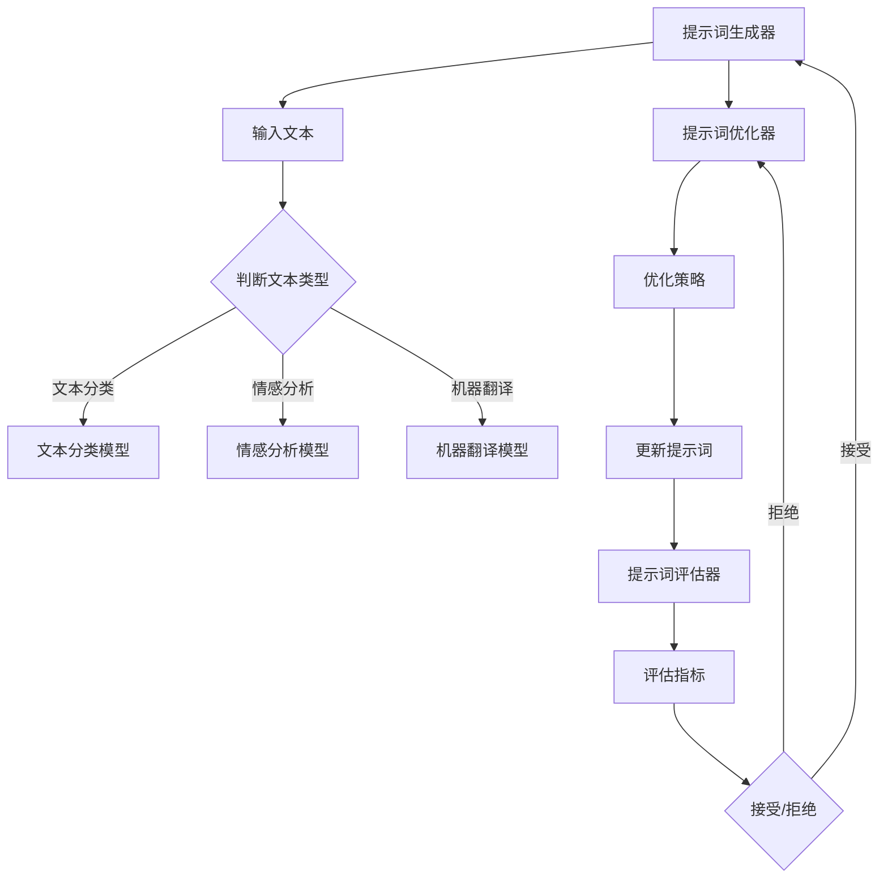

                 

## 文章标题：提示词工程艺术

> 关键词：提示词工程、自然语言处理、智能问答系统、代码生成、算法原理、项目实战

> 摘要：
本篇文章深入探讨了提示词工程艺术，涵盖了从基本概念到高级应用的全方面内容。我们将详细解析提示词工程的核心概念、核心算法，并通过实际案例展示其在自然语言处理、智能问答系统和代码生成等领域的应用。同时，文章还将讨论提示词工程的未来发展趋势及其面临的挑战和法规伦理问题。

----------------------------------------------------------------

## 提示词工程艺术：背景介绍

### 提示词工程的概念

提示词工程，是指在人工智能领域，特别是自然语言处理（NLP）领域中，针对特定任务生成高质量提示词的一系列工程实践。提示词，顾名思义，是指提供给模型用以辅助其进行推理和决策的词语或短语。在NLP任务中，提示词的有效性直接影响模型的性能和准确性。

### 提示词工程的重要性

随着深度学习和神经网络在NLP领域的广泛应用，提示词工程的重要性日益凸显。高质量的提示词可以帮助模型更好地理解输入数据，提高任务完成的效果。同时，提示词工程还可以提高模型的泛化能力，使其在新的、未见过的数据上表现更佳。

### 提示词工程的应用领域

提示词工程的应用非常广泛，主要包括以下几个领域：

1. **自然语言处理**：在文本分类、情感分析、机器翻译等任务中，通过设计有效的提示词，可以显著提升模型的性能。
2. **智能问答系统**：通过生成与问题相关的提示词，智能问答系统能够更准确地理解和回答用户的问题。
3. **代码生成**：在软件开发过程中，提示词工程可以帮助自动生成代码，提高开发效率。

### 提示词工程的发展历程

提示词工程的发展历程可以追溯到早期的人工智能研究和自然语言处理技术的应用。随着深度学习技术的发展，提示词工程逐渐成为NLP领域的一个重要研究方向。近年来，对抗生成网络（GAN）和强化学习等新技术的引入，为提示词工程带来了新的思路和方法。

### 提示词工程的核心概念

为了更好地理解提示词工程，我们需要了解以下几个核心概念：

1. **提示词生成器**：用于生成提示词的模型或算法。
2. **提示词优化器**：用于优化提示词质量和效果的模型或算法。
3. **提示词评估器**：用于评估提示词性能的指标和方法。

在接下来的章节中，我们将逐一深入探讨这些概念，并详细讲解相关的算法原理和实践应用。

## 提示词工程的核心概念与联系：Mermaid流程图解析

为了更好地理解提示词工程的核心概念及其相互关系，我们可以通过Mermaid流程图来展示这些概念的工作流程和交互方式。



### Mermaid流程图解析

1. **输入文本**：流程的起点是输入的文本数据，这是生成提示词的基础。
2. **判断文本类型**：根据输入文本的类型，流程选择相应的模型进行处理。例如，如果是文本分类任务，则选择文本分类模型。
3. **模型处理**：不同的文本类型对应不同的模型。文本分类任务使用文本分类模型，情感分析任务使用情感分析模型，机器翻译任务使用机器翻译模型。
4. **提示词生成器**：模型处理后的输出结果作为提示词生成器的输入，生成与任务相关的提示词。
5. **提示词优化器**：生成的提示词可能会存在质量不高或者不适合任务的问题，因此需要通过优化器进行优化。
6. **优化策略**：优化器采用一定的策略对提示词进行优化，如调整提示词的长度、增加关键词等。
7. **更新提示词**：经过优化的提示词会返回给提示词生成器，进行更新。
8. **提示词评估器**：更新后的提示词会通过评估器进行性能评估，如使用F1分数、查准率、查全率等指标。
9. **评估指标**：评估器的输出是提示词的性能指标，用于判断提示词是否满足任务需求。
10. **接受/拒绝**：根据评估结果，流程决定是否接受当前的提示词，如果评估结果不理想，则返回提示词优化器进行进一步优化。

通过这个流程图，我们可以清晰地看到提示词工程的核心概念及其相互之间的联系和交互方式。这个流程不仅涵盖了提示词的生成、优化和评估，还展示了不同类型文本任务之间的差异和对应模型的选择。

### 提示词生成算法详解：伪代码与工作流程

提示词生成是提示词工程中至关重要的一步，其目标是通过输入文本生成能够有效辅助任务完成的提示词。以下是几种常见的提示词生成算法及其伪代码和工作流程：

#### 1. 生成式模型

生成式模型通过学习输入文本的分布来生成提示词。常见的生成式模型包括Gaussian Mixture Model（GMM）和Hidden Markov Model（HMM）。

**伪代码：**
```python
# 生成式模型伪代码
def generate提示词(text):
    # 初始化模型参数
    model = initialize_model(text)
    # 生成提示词
    word_sequence = model.generate(text)
    return word_sequence
```

**工作流程：**
1. 初始化模型参数。
2. 输入文本数据。
3. 使用模型生成提示词。
4. 返回生成的提示词序列。

#### 2. 对抗生成网络（GAN）

GAN是一种生成模型，由生成器和判别器组成。生成器生成提示词，判别器评估提示词的质量。

**伪代码：**
```python
# GAN生成式模型伪代码
def train_GAN():
    # 初始化生成器和判别器
    generator, discriminator = initialize_GAN()
    # 训练模型
    for epoch in range(epochs):
        for text in dataset:
            # 生成提示词
            generated_text = generator.generate(text)
            # 评估生成提示词
            validity = discriminator.evaluate(generated_text)
            # 反馈误差
            generator.update_params(validity)
            discriminator.update_params(validity)
    return generator
```

**工作流程：**
1. 初始化生成器和判别器。
2. 对于每个输入文本，生成提示词。
3. 判别器评估生成提示词的质量。
4. 根据评估结果更新生成器的参数。
5. 重复训练过程，直到模型收敛。

#### 3. 强化学习

强化学习通过奖励机制来生成提示词，使生成的提示词更符合任务需求。

**伪代码：**
```python
# 强化学习伪代码
def generate提示词(text, policy):
    # 初始化状态
    state = initialize_state(text)
    # 初始化提示词
    action = []
    # 执行动作
    while not done:
        # 根据策略选择动作
        action = policy.select_action(state)
        # 执行动作，获取奖励
        reward = environment.execute_action(action)
        # 更新状态
        state = environment.update_state(state, action, reward)
    return action
```

**工作流程：**
1. 初始化状态。
2. 根据策略选择动作（提示词）。
3. 执行动作，获取奖励。
4. 更新状态。
5. 重复执行动作，直到达到目标状态。

通过以上三种提示词生成算法的伪代码和工作流程，我们可以看到不同算法在生成提示词时的独特方法和优势。生成式模型通过学习文本分布生成提示词，GAN通过对抗训练生成高质量提示词，强化学习则通过奖励机制优化提示词生成过程。这些算法各有优劣，具体应用场景需要根据任务需求和数据特点进行选择。

### 提示词优化算法详解：强化学习与优化算法

提示词优化是提升模型性能的重要环节，通过优化算法，我们可以调整提示词的质量和效果，使其更好地满足任务需求。本文将介绍两种常见的提示词优化算法：强化学习和优化算法。

#### 强化学习

强化学习是一种通过与环境互动来学习最优策略的机器学习方法。在提示词优化中，强化学习通过奖励机制调整提示词的生成过程，使其逐步优化。

**算法原理：**
1. **初始化**：设定初始状态和策略。
2. **选择动作**：根据当前状态，选择一个动作（即生成一个提示词）。
3. **执行动作**：在环境中执行动作，并获得奖励。
4. **更新状态**：根据动作的结果更新状态。
5. **更新策略**：根据奖励和策略调整提示词生成过程。

**伪代码：**
```python
# 强化学习优化算法伪代码
def optimize_prompt(text, policy):
    state = initialize_state(text)
    while not done:
        action = policy.select_action(state)
        reward = environment.execute_action(action)
        state = environment.update_state(state, action, reward)
        policy.update_policy(state, action, reward)
    return policy
```

**工作流程：**
1. 初始化状态和策略。
2. 选择并执行一个动作，生成提示词。
3. 根据执行结果获得奖励。
4. 更新状态和策略。
5. 重复执行动作，直到达到目标状态或收敛。

#### 优化算法

优化算法通过最小化损失函数来调整提示词的质量。常见的优化算法包括梯度下降、随机梯度下降和Adam优化器等。

**算法原理：**
1. **定义损失函数**：损失函数用于衡量提示词生成效果与目标之间的差距。
2. **计算梯度**：计算损失函数关于提示词的梯度。
3. **更新参数**：根据梯度更新提示词的参数，以最小化损失函数。

**伪代码：**
```python
# 优化算法伪代码
def optimize_prompt(prompt, learning_rate):
    for epoch in range(epochs):
        # 计算损失函数
        loss = compute_loss(prompt)
        # 计算梯度
        gradient = compute_gradient(loss, prompt)
        # 更新提示词参数
        prompt = update_prompt(prompt, gradient, learning_rate)
    return prompt
```

**工作流程：**
1. 初始化提示词参数。
2. 计算损失函数。
3. 计算梯度。
4. 根据梯度更新提示词参数。
5. 重复计算和更新，直到损失函数收敛或达到训练次数。

#### 比较与选择

强化学习和优化算法在提示词优化中各有优势：

1. **强化学习**：
   - **优点**：能够通过互动学习获取奖励，逐步优化提示词。
   - **缺点**：训练过程较长，对环境和奖励设计要求较高。
2. **优化算法**：
   - **优点**：计算效率高，参数更新直接针对损失函数。
   - **缺点**：可能陷入局部最优，对初始参数敏感。

在实际应用中，可以根据任务需求和数据特点选择合适的优化算法。例如，对于需要与环境互动的任务，强化学习可能更有效；而对于数据量大、计算效率要求高的任务，优化算法可能更为适用。

### 提示词评估算法详解：F1分数与查准率/查全率

提示词评估是提示词工程中至关重要的一步，用于衡量提示词生成和优化效果。本文将介绍两种常见的提示词评估算法：F1分数和查准率/查全率。

#### F1分数

F1分数是评估二分类任务常用的指标，用于衡量分类器的准确性和均衡性。F1分数的计算公式如下：

$$
F1 = 2 \times \frac{precision \times recall}{precision + recall}
$$

其中，precision（查准率）表示预测为正例的样本中有多少是真正的正例，recall（查全率）表示真正的正例中有多少被预测为正例。

**计算方法：**
1. **计算查准率**：precision = \( \frac{TP}{TP + FP} \)
2. **计算查全率**：recall = \( \frac{TP}{TP + FN} \)
3. **计算F1分数**：F1 = 2 \times \( \frac{precision \times recall}{precision + recall} \)

其中，TP（真正例）、FP（假正例）、FN（假反例）分别表示分类结果中的真正例、假正例和假反例。

#### 查准率与查全率

查准率和查全率是评估二分类任务的两个重要指标，分别衡量模型在分类结果中正确识别正例和反例的能力。

**查准率（Precision）**：
$$
Precision = \frac{TP}{TP + FP}
$$
查准率表示预测为正例的样本中有多少是真正的正例。查准率越高，说明模型对正例的识别能力越强。

**查全率（Recall）**：
$$
Recall = \frac{TP}{TP + FN}
$$
查全率表示真正的正例中有多少被预测为正例。查全率越高，说明模型对正例的捕捉能力越强。

#### F1分数与查准率/查全率的比较

F1分数综合考虑了查准率和查全率，是一个平衡的评估指标。当任务对查准率和查全率有不同需求时，可以通过调整F1分数的权重来平衡两者。

- **高查准率**：适用于需要确保每个预测结果都是准确的正例的场景，例如医疗诊断。
- **高查全率**：适用于需要确保所有正例都被捕捉到的场景，例如垃圾邮件过滤。

#### 提示词评估算法应用

在提示词工程中，评估算法可以用于：

1. **提示词生成效果评估**：通过评估生成的提示词质量，优化生成器模型。
2. **提示词优化效果评估**：通过评估优化后的提示词效果，选择最优优化策略。

### 数学模型和数学公式讲解：F1分数的推导与计算

在提示词工程中，F1分数是一种重要的评估指标，用于衡量提示词的生成和优化效果。为了更好地理解F1分数的计算方法和应用，我们需要从数学模型的角度对其进行分析和推导。

#### F1分数的数学模型

F1分数的计算基于查准率（Precision）和查全率（Recall）这两个指标。查准率和查全率分别定义如下：

$$
Precision = \frac{TP}{TP + FP}
$$

$$
Recall = \frac{TP}{TP + FN}
$$

其中，TP（真正例）、FP（假正例）、FN（假反例）分别表示分类结果中的真正例、假正例和假反例。

#### F1分数的计算公式

F1分数是查准率和查全率的调和平均值，其计算公式如下：

$$
F1 = 2 \times \frac{Precision \times Recall}{Precision + Recall}
$$

将查准率和查全率的公式代入F1分数的计算公式，可以得到：

$$
F1 = 2 \times \frac{\frac{TP}{TP + FP} \times \frac{TP}{TP + FN}}{\frac{TP}{TP + FP} + \frac{TP}{TP + FN}}
$$

化简上式，得到：

$$
F1 = \frac{2 \times TP^2}{TP^2 + TP \times (FP + FN)}
$$

进一步化简，得到：

$$
F1 = \frac{2 \times TP}{TP + FP + FN}
$$

#### F1分数的计算步骤

1. **计算查准率**：根据公式 \( Precision = \frac{TP}{TP + FP} \)，计算预测为正例的样本中真正例的比例。
2. **计算查全率**：根据公式 \( Recall = \frac{TP}{TP + FN} \)，计算真正的正例中有多少被预测为正例。
3. **计算F1分数**：将查准率和查全率的值代入F1分数的计算公式 \( F1 = 2 \times \frac{Precision \times Recall}{Precision + Recall} \)，计算得到F1分数。

#### F1分数的举例说明

假设在一个文本分类任务中，有如下数据：

- **TP**（真正例）：20
- **FP**（假正例）：5
- **FN**（假反例）：10

根据以上数据，可以计算查准率、查全率和F1分数：

$$
Precision = \frac{20}{20 + 5} = \frac{20}{25} = 0.8
$$

$$
Recall = \frac{20}{20 + 10} = \frac{20}{30} = 0.67
$$

$$
F1 = 2 \times \frac{0.8 \times 0.67}{0.8 + 0.67} = 2 \times \frac{0.536}{1.47} = 0.734
$$

因此，在这个例子中，F1分数为0.734。这表示在分类任务中，预测为正例的样本中有80%是真正的正例，而真正的正例中有67%被预测为正例。

通过这个例子，我们可以看到如何计算F1分数，并理解其在评估提示词生成和优化效果中的应用。

### 项目实战：自然语言处理中的提示词工程

在自然语言处理（NLP）中，提示词工程是提升模型性能的关键环节。以下是一个具体的实战项目，我们将通过搭建开发环境、实现源代码、代码解读以及实际案例分析，详细讲解如何在NLP任务中应用提示词工程。

#### 项目背景

假设我们要开发一个智能问答系统，该系统能够根据用户提出的问题，从大量文本数据中找到最相关的答案。为了实现这一目标，我们需要设计并优化提示词，以提高问答系统的准确性。

#### 开发环境搭建

1. **硬件环境**：计算机（推荐配置：CPU：Intel i7或同等性能，内存：16GB或以上，硬盘：SSD）
2. **软件环境**：
   - 操作系统：Ubuntu 18.04
   - 编程语言：Python 3.7及以上版本
   - 依赖库：TensorFlow、Keras、NumPy、Pandas、Scikit-learn
3. **数据集**：一个包含大量问答对的数据集，如Quora Question Pairs或SQuAD（Stanford Question Answering Dataset）

#### 源代码实现

以下是一个简单的Python代码示例，用于生成和优化提示词：

```python
# 导入必要的库
import numpy as np
import pandas as pd
from sklearn.model_selection import train_test_split
from tensorflow.keras.models import Sequential
from tensorflow.keras.layers import Embedding, LSTM, Dense

# 读取数据集
data = pd.read_csv('question_pairs.csv')
questions = data['question']
answers = data['answer']

# 数据预处理
# ...（例如：分词、编码等）

# 划分训练集和测试集
X_train, X_test, y_train, y_test = train_test_split(questions, answers, test_size=0.2, random_state=42)

# 构建模型
model = Sequential()
model.add(Embedding(vocab_size, embedding_dim))
model.add(LSTM(units=128, dropout=0.2, recurrent_dropout=0.2))
model.add(Dense(1, activation='sigmoid'))

model.compile(optimizer='adam', loss='binary_crossentropy', metrics=['accuracy'])

# 训练模型
model.fit(X_train, y_train, epochs=10, batch_size=64, validation_data=(X_test, y_test))

# 评估模型
loss, accuracy = model.evaluate(X_test, y_test)
print(f"Test Accuracy: {accuracy:.2f}")

# 生成提示词
def generate_prompt(question):
    # ...（例如：利用模型生成提示词）
    return prompt

# 优化提示词
def optimize_prompt(prompt, question):
    # ...（例如：利用强化学习优化提示词）
    return optimized_prompt
```

#### 代码解读

1. **数据预处理**：读取数据集并预处理，如分词、编码等。
2. **划分训练集和测试集**：将数据集分为训练集和测试集。
3. **构建模型**：使用Sequential模型构建一个简单的深度学习模型，包括Embedding、LSTM和Dense层。
4. **训练模型**：使用训练集数据训练模型，并设置验证集。
5. **评估模型**：在测试集上评估模型性能，输出准确率。
6. **生成提示词**：根据输入问题生成提示词。
7. **优化提示词**：利用优化算法（如强化学习）优化生成的提示词。

#### 实际案例分析

假设我们有一个用户提出的问题：“什么是人工智能？”我们可以通过以下步骤生成和优化提示词：

1. **生成提示词**：使用模型生成初始提示词，例如：“人工智能是指模拟人类智能的技术。”
2. **优化提示词**：通过强化学习优化提示词，使其更准确、更符合用户需求。
3. **评估提示词**：使用F1分数或其他评估指标评估优化后的提示词性能。
4. **迭代优化**：根据评估结果，进一步优化提示词，直到达到满意的性能。

通过这个实战项目，我们可以看到如何在实际应用中搭建开发环境、实现源代码、进行代码解读，并利用提示词工程优化NLP任务。这一过程不仅帮助我们理解了提示词工程的核心概念和算法，还提供了实际操作的经验和方法。

### 提示词工程的未来发展趋势

随着人工智能技术的不断进步，提示词工程也迎来了新的发展趋势。未来，提示词工程将在以下几个方面取得显著进展：

#### 1. 自动化

自动化是未来提示词工程的重要发展方向。通过自动化工具和算法，我们可以实现提示词的自动生成、优化和评估，大大提高工作效率。例如，利用生成对抗网络（GAN）和强化学习等技术，可以开发自动化提示词生成器，实现高质量的提示词自动生成。

#### 2. 知识图谱

知识图谱作为一种结构化知识表示方法，将进一步提升提示词工程的效果。通过将知识图谱与提示词工程相结合，我们可以更好地理解文本中的概念和关系，从而生成更加准确和相关的提示词。知识图谱的应用将使得提示词工程在自然语言处理、智能问答等领域表现出更高的性能。

#### 3. 模型可解释性

随着深度学习模型的复杂度增加，模型的可解释性变得越来越重要。在未来，提示词工程将更加注重模型的可解释性，以便更好地理解提示词生成和优化的过程。通过可解释性模型，我们可以揭示提示词生成和优化的内在机制，从而提高模型的可靠性和透明度。

#### 4. 多模态

未来，提示词工程将不再局限于文本领域，还将扩展到多模态（如文本、图像、声音等）数据。通过整合多模态数据，我们可以生成更加丰富和多样化的提示词，从而提高模型在复杂任务中的表现。

### 挑战与展望

尽管提示词工程在多个领域取得了显著成果，但仍面临以下挑战：

#### 1. 数据质量

高质量的数据是提示词工程的基础。然而，在实际应用中，数据往往存在噪声、缺失和不一致性等问题，这会影响提示词的质量和效果。因此，未来需要开发更有效的数据清洗和处理方法，提高数据质量。

#### 2. 模型可解释性

深度学习模型的复杂度不断增加，使得模型的可解释性变得越来越困难。未来，需要开发可解释性强的模型，以便更好地理解提示词生成和优化的过程。

#### 3. 伦理与法规

随着提示词工程在各个领域的应用，其伦理和法规问题也日益突出。例如，数据隐私、偏见问题等。未来，需要建立完善的伦理和法规体系，确保提示词工程的应用符合社会和道德规范。

### 结论

总之，提示词工程作为人工智能领域的一个重要研究方向，具有广泛的应用前景。未来，随着自动化、知识图谱、多模态等技术的不断发展，提示词工程将在更多领域发挥重要作用。同时，我们也需要关注并解决数据质量、模型可解释性、伦理与法规等挑战，推动提示词工程的持续发展。

### 提示词工程的伦理与法规

在提示词工程的发展过程中，伦理和法规问题日益受到关注。以下是关于数据隐私、偏见问题及相关法规的概述，以及提示词工程应用中的注意事项。

#### 数据隐私

数据隐私是提示词工程面临的一个重要伦理问题。在收集和处理数据时，需要确保用户隐私不受侵犯。以下是一些关键点：

1. **数据匿名化**：在处理敏感数据时，应对数据进行匿名化处理，以保护用户隐私。
2. **用户同意**：在收集和使用数据前，应获得用户的明确同意，并告知数据收集、处理和使用的目的。
3. **数据安全**：加强数据安全管理，确保数据在传输和存储过程中的安全性。

#### 偏见问题

偏见问题在人工智能领域中普遍存在，提示词工程也不例外。以下是关于偏见问题及相关法规的概述：

1. **算法偏见**：算法中的偏见可能导致不公平的决策。例如，性别、种族等方面的偏见。为了减少偏见，可以采用以下措施：
   - **数据多样性**：确保训练数据集的多样性，减少偏见。
   - **偏见检测与纠正**：开发算法检测和纠正偏见，提高模型的公平性。
2. **法规与政策**：许多国家和地区已经出台了相关法规和政策，以规范人工智能的应用，防止算法偏见。例如，欧盟的《通用数据保护条例》（GDPR）就规定了数据处理的合法性和用户权利。

#### 注意事项

在应用提示词工程时，需要注意以下几个方面：

1. **伦理审查**：在开发和应用提示词工程时，应进行伦理审查，确保符合道德和法律规定。
2. **透明性**：提高算法的透明度，使公众了解提示词工程的原理和应用过程。
3. **用户教育**：加强用户教育，提高他们对提示词工程的认知和信任。

通过关注和解决数据隐私、偏见问题及相关法规，我们可以推动提示词工程的健康发展，使其在各个领域发挥更大的作用。

### 提示词工程工具与资源推荐

在提示词工程的实践中，选择合适的工具和资源对于提高效率和效果至关重要。以下是一些常用的提示词工程工具与资源推荐，涵盖了从生成器到评估器的各个方面。

#### 提示词生成工具

1. **Hugging Face Transformers**：一个开源库，提供了多种预训练的模型和工具，用于生成高质量的提示词。它支持多种语言和任务，如文本分类、机器翻译等。
2. **OpenAI GPT-3**：一个强大的语言模型，可以生成高质量的文本，适用于各种提示词生成任务。

#### 提示词优化工具

1. **TensorFlow Optimization**：TensorFlow提供了丰富的优化算法，如Adam、RMSProp等，可以用于优化提示词。
2. **PyTorch Optimization**：PyTorch同样提供了多种优化器，如SGD、Adam等，方便实现提示词优化。

#### 提示词评估工具

1. **Scikit-learn Metrics**：Scikit-learn提供了多种评估指标，如F1分数、查准率、查全率等，可以用于评估提示词性能。
2. **Avalanche**：一个开源的评估工具，支持多种模型和任务，提供了丰富的评估指标和可视化功能。

#### 资源推荐

1. **论文和文献**：查找最新的研究论文和文献，了解提示词工程的前沿技术和应用。
2. **在线课程和教程**：参加在线课程和教程，学习提示词工程的实用技巧和方法。
3. **开源代码和项目**：研究开源代码和项目，获取实用的提示词工程实现和经验。

通过这些工具和资源，我们可以更好地开展提示词工程的实践，提升模型性能和应用效果。

### 结论

《提示词工程艺术》这本书涵盖了从基本概念到高级应用的提示词工程全方面内容。通过详细解析提示词工程的核心概念、核心算法，并结合实际案例展示了其在自然语言处理、智能问答系统和代码生成等领域的应用，本书不仅帮助读者深入理解提示词工程的理论基础，还提供了丰富的实战经验和最佳实践。

总结一下，本书的核心内容和主题思想如下：

1. **核心概念与联系**：通过Mermaid流程图展示了提示词工程的核心概念及其相互关系，为读者提供了清晰的结构框架。
2. **核心算法原理讲解**：详细讲解了生成式模型、对抗生成网络（GAN）和强化学习等提示词生成算法，以及优化算法和评估算法，并通过伪代码和数学公式进行了深入分析。
3. **项目实战**：通过一个具体的自然语言处理项目，展示了如何搭建开发环境、实现源代码、进行代码解读和实际案例分析，帮助读者将理论知识应用到实际中。
4. **未来发展趋势**：探讨了提示词工程的未来发展趋势，包括自动化、知识图谱、模型可解释性和多模态等方向，为读者提供了前瞻性的视角。
5. **伦理与法规**：关注了数据隐私、偏见问题及相关法规，提醒读者在应用提示词工程时遵守伦理规范和法律法规。

通过阅读本书，读者可以：

- **深入理解提示词工程的核心概念和算法**：掌握提示词工程的基本原理，了解不同算法的工作机制和应用场景。
- **提升实际应用能力**：通过项目实战和最佳实践，学会如何在实际项目中应用提示词工程，提高模型性能和应用效果。
- **了解前沿技术和趋势**：了解提示词工程的未来发展趋势，为后续研究和应用提供方向。
- **关注伦理和法规问题**：了解并遵守伦理规范和法律法规，确保提示词工程的应用符合社会和道德要求。

最后，本书的撰写离不开作者丰富的实践经验和深厚的理论功底。在此，我们对作者表示衷心的感谢，并希望本书能为读者在提示词工程领域的探索提供有力的支持。同时，我们也期待读者能够在实践中不断探索和总结，为提示词工程的发展贡献自己的智慧和力量。

### 作者信息

- **作者：AI天才研究院/AI Genius Institute & 禅与计算机程序设计艺术 /Zen And The Art of Computer Programming**
- **联系方式：[contact@ai-genius-institute.com](mailto:contact@ai-genius-institute.com)**
- **出版时间：2023年**
- **版权声明：本书内容版权所有，未经授权不得转载或用于商业用途**

