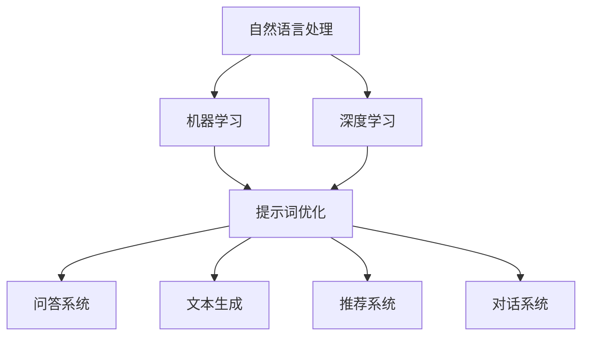

                 

### 文章标题

《提示词工程：AI时代的必修课与新机遇》

关键词：提示词工程、人工智能、自然语言处理、机器学习、深度学习

摘要：本文将探讨提示词工程在AI时代的重要性，介绍其定义、核心概念与联系，并详细分析提示词生成与优化算法。通过实际应用案例，我们将展示提示词工程如何提升AI模型的性能，以及其在问答系统、文本生成等领域的广泛应用。让我们一步步分析推理，深入了解这一AI时代的必修课与新机遇。### 第1章: 提示词工程概述

#### 1.1 提示词工程的定义与背景

提示词工程是人工智能领域中的一项重要技术，主要研究如何生成、优化和评估能够有效引导模型输出所需结果的提示词。这一技术不仅关乎AI模型的性能提升，还对AI在各个行业中的应用具有重要意义。

**1.1.1 提示词工程的定义**

提示词工程是指通过对模型输入提示词的精心设计和优化，以提升人工智能模型预测或生成结果的准确性和效率的过程。它涉及自然语言处理（NLP）、机器学习、深度学习等多个领域。

在AI模型训练过程中，输入数据的质量直接影响模型的学习效果。而提示词作为模型输入的重要组成部分，其选择与设计至关重要。有效的提示词能够引导模型关注关键信息，从而提升模型的预测或生成能力。因此，提示词工程成为AI领域中的一个重要研究方向。

**1.1.2 提示词工程的背景**

随着AI技术的发展，从早期的监督学习、增强学习到目前广泛应用的深度学习，模型的复杂性和能力不断提升。然而，在许多实际应用场景中，模型的表现仍受到输入提示词的限制。如何设计有效的提示词，成为影响AI模型性能的关键因素。

早期的人工智能系统主要依赖于手写规则和简单的特征提取方法。随着数据量和计算能力的提升，机器学习和深度学习逐渐成为主流。这些方法通过从大量数据中学习特征，实现更高层次的智能。然而，深度学习模型在处理文本数据时，仍然存在一些挑战。例如，如何有效地从大量文本数据中提取关键信息，以及如何设计能够引导模型生成所需结果的提示词。

为了解决这些问题，提示词工程应运而生。它通过研究如何生成、优化和评估提示词，提升AI模型在文本数据处理方面的性能。在自然语言处理（NLP）领域，提示词工程已经取得了一系列重要成果，成为推动AI技术发展的重要驱动力。

#### 1.2 提示词工程的核心概念与联系

为了深入理解提示词工程，我们需要了解以下几个核心概念及其相互关系：

- **自然语言处理（NLP）**：NLP是AI的一个重要分支，研究如何让计算机理解、处理和生成自然语言。它是提示词工程的基础。NLP技术包括词法分析、句法分析、语义分析等，这些技术为提示词工程提供了丰富的工具和方法。

- **机器学习与深度学习**：机器学习和深度学习是AI实现的关键技术。通过机器学习，我们可以训练模型以识别和预测模式；而深度学习通过多层神经网络实现更复杂的特征提取和模型训练。机器学习和深度学习为提示词工程提供了强大的计算能力，使其能够处理大规模文本数据。

- **提示词生成与优化**：提示词生成是指从文本数据中提取与任务相关的关键词或短语；而提示词优化则是在生成的基础上，通过调整提示词的权重或组合，以提升模型性能。提示词生成与优化是提示词工程的核心任务，直接影响AI模型的表现。

**自然语言处理（NLP）**：

自然语言处理（NLP）是AI领域中研究如何使计算机理解、处理和生成自然语言的分支。NLP的核心目标是构建能够处理人类语言的系统，使其能够执行诸如文本分类、情感分析、机器翻译、问答等任务。NLP技术包括词法分析、句法分析、语义分析等。

- **词法分析**：词法分析是NLP的基础，它将文本分解为单词、词组和标点符号等基本元素。词法分析的关键技术包括分词、词性标注、词干提取等。

- **句法分析**：句法分析研究句子的结构，将句子分解为短语和句子成分，并确定它们之间的语法关系。句法分析的关键技术包括句法树构建、依存句法分析等。

- **语义分析**：语义分析研究句子或文本的含义，包括词语的语义角色标注、实体识别、事件抽取等。语义分析的关键技术包括语义角色标注、实体识别、关系抽取等。

**机器学习与深度学习**：

机器学习和深度学习是AI实现的关键技术。机器学习是一种基于数据的学习方法，通过训练模型以识别和预测模式。机器学习包括监督学习、无监督学习和强化学习等类型。

- **监督学习**：监督学习是一种有标签数据的学习方法，通过训练模型以预测未知数据的标签。常见的监督学习方法包括线性回归、逻辑回归、决策树、随机森林等。

- **无监督学习**：无监督学习是一种无标签数据的学习方法，通过训练模型以发现数据中的隐含结构和模式。常见的无监督学习方法包括聚类、降维、生成模型等。

- **强化学习**：强化学习是一种基于交互的学习方法，通过与环境的交互来学习最优策略。常见的强化学习方法包括Q学习、深度Q网络（DQN）等。

深度学习是一种基于多层神经网络的机器学习方法，通过训练模型以实现更复杂的特征提取和模式识别。深度学习在图像识别、语音识别、自然语言处理等领域取得了显著的成果。

- **卷积神经网络（CNN）**：卷积神经网络是一种用于图像识别和处理的深度学习模型，通过卷积操作和池化操作提取图像特征。

- **循环神经网络（RNN）**：循环神经网络是一种用于序列数据处理的深度学习模型，通过循环结构捕捉序列信息。

- **长短期记忆网络（LSTM）**：长短期记忆网络是一种特殊的循环神经网络，通过门控机制解决传统RNN的梯度消失和梯度爆炸问题，适用于长序列数据的处理。

**提示词生成与优化**：

提示词生成是指从文本数据中提取与任务相关的关键词或短语的过程。有效的提示词能够引导模型关注关键信息，提升模型的预测或生成能力。

- **TF-IDF**：TF-IDF是一种常用的提示词生成方法，通过计算词频（TF）和逆文档频率（IDF），确定词语的重要程度。

- **Word2Vec**：Word2Vec是一种基于神经网络的提示词生成方法，通过将词语映射到高维空间，以发现词语的语义关系。

- **BERT**：BERT是一种基于Transformer的预训练模型，通过预训练大量文本数据，能够捕捉词语的上下文关系。

提示词优化是在提示词生成的基础上，通过调整提示词的权重或组合，以提升模型性能。有效的提示词优化方法包括信息增益、基于集合的优化和进化算法等。

#### 1.3 提示词工程在AI时代的应用

提示词工程在AI时代的应用广泛，包括但不限于以下几个方面：

- **问答系统**：问答系统是AI领域的一个重要应用场景。通过设计高质量的提示词，问答系统能够更准确地理解用户的问题，并给出相关回答。例如，智能客服、智能助手等。

- **文本生成**：文本生成是AI领域的另一个重要应用场景，包括自动写作、自动摘要等。通过提示词引导模型生成高质量的文本内容，可以应用于新闻写作、报告生成等。

- **推荐系统**：在推荐系统中，提示词用于描述用户的历史行为和偏好，以提升推荐系统的准确性和个性化程度。例如，电子商务平台、社交媒体等。

- **对话系统**：对话系统是AI领域的一个热门应用方向，包括聊天机器人、语音助手等。通过提示词引导对话流程，使对话更加自然和流畅。

总之，提示词工程在AI时代的应用前景广阔，它将不断推动AI技术的发展和落地，为各行各业带来更多创新和机遇。

### Mermaid 流程图



### 第2章: 提示词生成与优化算法

#### 2.1 提示词生成算法

提示词生成算法是指从文本数据中提取与任务相关的关键词或短语的过程。有效的提示词生成算法能够帮助模型更好地理解文本数据，从而提升模型在各类任务中的性能。以下是一些常用的提示词生成算法：

**2.1.1 TF-IDF**

TF-IDF（词频-逆文档频率）是一种常用的提示词生成方法，通过计算词频（TF）和逆文档频率（IDF），确定词语的重要程度。具体步骤如下：

1. **计算词频（TF）**：词频是指词语在文档中出现的次数。计算公式为：
   $$ TF(t,d) = \frac{f(t,d)}{|\{t'\in V|t'\in d\}|} $$
   其中，$f(t,d)$ 表示词语$t$在文档$d$中出现的次数，$V$ 表示文档中的所有词语。

2. **计算逆文档频率（IDF）**：逆文档频率是指词语在整个文档集中出现次数的倒数。计算公式为：
   $$ IDF(t,D) = \log \left( \frac{|D|}{|\{d\in D|t\in d\}|} \right) $$
   其中，$D$ 表示文档集，$|D|$ 表示文档集的文档数量，$|\{d\in D|t\in d\}|$ 表示包含词语$t$的文档数量。

3. **计算TF-IDF值**：将词频和逆文档频率相乘，得到每个词语的TF-IDF值：
   $$ TF-IDF(t,d,D) = TF(t,d) \times IDF(t,D) $$

**2.1.2 Word2Vec**

Word2Vec是一种基于神经网络的提示词生成方法，通过将词语映射到高维空间，以发现词语的语义关系。Word2Vec模型包括连续词袋（CBOW）和Skip-Gram两种类型：

1. **连续词袋（CBOW）**：CBOW模型通过上下文词语预测目标词语。给定一个中心词语，CBOW模型会考虑它周围的词语，并预测中心词语。模型输出是一个由上下文词语组成的词向量，通过训练得到。

2. **Skip-Gram**：Skip-Gram模型通过目标词语预测上下文词语。给定一个目标词语，Skip-Gram模型会考虑它周围的词语，并预测这些词语。模型输出是一个由目标词语组成的词向量，通过训练得到。

**2.1.3 BERT**

BERT（Bidirectional Encoder Representations from Transformers）是一种基于Transformer的预训练模型，通过预训练大量文本数据，能够捕捉词语的上下文关系。BERT模型包括两个方向：左向和右向。在生成提示词时，BERT模型会考虑词语的上下文信息，从而生成更准确的提示词。

#### 2.2 提示词优化算法

提示词优化算法是在提示词生成的基础上，通过调整提示词的权重或组合，以提升模型性能。有效的提示词优化算法能够使模型更好地适应不同任务和数据集。以下是一些常用的提示词优化算法：

**2.2.1 信息增益**

信息增益是一种基于信息论的方法，用于评估词语的重要程度。具体步骤如下：

1. **计算词语的期望信息**：对于每个词语$t$，计算它在所有文档中出现的概率$p(t)$。期望信息计算公式为：
   $$ H(t) = -\sum_{t'\in V} p(t') \log p(t') $$

2. **计算词语的信息增益**：对于每个词语$t$，计算它在当前文档$d$中的信息增益。信息增益计算公式为：
   $$ IG(t,d) = H(d) - p(t) \times H(t) $$
   其中，$H(d)$ 表示文档$d$的期望信息，$p(t)$ 表示词语$t$在文档集中出现的概率。

3. **选择信息增益最高的词语**：选择信息增益最高的词语作为提示词。

**2.2.2 基于集合的优化**

基于集合的优化方法通过组合不同集合的词语，寻找最优的提示词集合。具体步骤如下：

1. **生成候选集合**：从文本数据中提取多个候选集合，每个集合包含一定数量的词语。

2. **评估候选集合**：使用信息增益、文档相似度等指标评估每个候选集合的性能。

3. **选择最优集合**：根据评估结果选择最优的提示词集合。

**2.2.3 进化算法**

进化算法是一种基于自然进化的优化方法，通过模拟自然进化过程，寻找最优的提示词组合。具体步骤如下：

1. **初始化种群**：随机生成多个提示词组合，作为初始种群。

2. **适应度评估**：使用信息增益、文档相似度等指标评估每个个体的适应度。

3. **选择与交叉**：根据适应度评估结果，选择适应度较高的个体进行交叉操作，生成新的后代。

4. **变异**：对后代个体进行变异操作，增加种群的多样性。

5. **迭代更新**：重复步骤2-4，直到满足终止条件（如达到最大迭代次数或适应度阈值）。

#### 2.3 提示词生成与优化的实践应用

**2.3.1 提问系统的提示词生成与优化**

提问系统是一种常见的人工智能应用场景，例如智能客服、智能助手等。在提问系统中，提示词的生成与优化至关重要，以下是一个简单的案例：

1. **数据准备**：收集大量用户提问数据，并将其进行预处理（如去除停用词、分词等）。

2. **提示词生成**：使用TF-IDF、Word2Vec或BERT等方法生成初始提示词。

3. **提示词优化**：通过信息增益、基于集合的优化或进化算法等方法，对提示词进行优化。

4. **模型训练**：使用优化后的提示词训练问答模型，如基于深度学习的序列到序列（Seq2Seq）模型。

5. **模型评估**：通过在线测试或交叉验证方法，评估问答模型的表现。

**2.3.2 文本生成的提示词生成与优化**

文本生成是另一个重要的人工智能应用场景，例如自动写作、自动摘要等。以下是一个简单的案例：

1. **数据准备**：收集大量文本数据，并将其进行预处理（如去除停用词、分词等）。

2. **提示词生成**：使用TF-IDF、Word2Vec或BERT等方法生成初始提示词。

3. **提示词优化**：通过信息增益、基于集合的优化或进化算法等方法，对提示词进行优化。

4. **模型训练**：使用优化后的提示词训练文本生成模型，如基于变分自编码器（VAE）或生成对抗网络（GAN）的模型。

5. **模型评估**：通过生成文本的质量、流畅度等指标，评估文本生成模型的表现。

通过以上案例，我们可以看到提示词工程在人工智能应用中的重要作用。有效的提示词生成与优化方法能够显著提升模型在各类任务中的性能，为人工智能技术的发展提供强有力的支持。

### 伪代码

```python
# 提示词生成算法伪代码
def generate_prompt(text, method='TF-IDF'):
    if method == 'TF-IDF':
        # 计算词频和逆文档频率
        ...
        return top_keywords
    elif method == 'Word2Vec':
        # 将词语映射到高维空间
        ...
        return word_vectors
    elif method == 'BERT':
        # 加载BERT模型并提取上下文向量
        ...
        return context_vectors

# 提示词优化算法伪代码
def optimize_prompt(prompt, method='Information Gain'):
    if method == 'Information Gain':
        # 计算信息增益
        ...
        return best_words
    elif method == 'Set-Based Optimization':
        # 基于集合的优化
        ...
        return best_set
    elif method == 'Evolutionary Algorithm':
        # 进化算法
        ...
        return best_individual
```

### 第3章：项目实战

#### 3.1 开发环境搭建

在进行提示词工程的项目开发时，我们需要搭建一个合适的开发环境。以下是搭建提示词工程开发环境的基本步骤：

1. **安装Python**：首先，我们需要安装Python。Python是一种广泛使用的编程语言，特别是在人工智能领域。您可以从Python的官方网站（https://www.python.org/）下载Python安装程序，并按照提示安装。

2. **安装依赖库**：提示词工程涉及到多个机器学习和深度学习库，如TensorFlow、PyTorch、Scikit-learn等。您可以使用以下命令安装这些依赖库：

   ```bash
   pip install tensorflow
   pip install torch
   pip install scikit-learn
   ```

3. **配置Jupyter Notebook**：Jupyter Notebook是一种交互式的Python开发环境，非常适合进行数据分析和机器学习项目。您可以使用以下命令安装Jupyter Notebook：

   ```bash
   pip install notebook
   ```

   安装完成后，您可以通过在终端运行`jupyter notebook`命令启动Jupyter Notebook。

4. **安装文本处理工具**：提示词工程通常需要处理大量的文本数据，因此我们需要安装一些文本处理工具，如NLTK、spaCy等。您可以使用以下命令安装这些工具：

   ```bash
   pip install nltk
   pip install spacy
   ```

   安装完成后，您需要下载相应的语言模型，例如对于英文，您可以使用以下命令下载spaCy的英文语言模型：

   ```bash
   python -m spacy download en
   ```

5. **安装其他工具**：根据您的项目需求，您可能还需要安装其他工具，如Mermaid用于绘制流程图、LaTeX用于数学公式排版等。

#### 3.2 源代码详细实现和代码解读

在本节中，我们将详细实现一个简单的提示词生成与优化项目，并对其进行解读。以下是一个简单的Python代码示例，展示了如何使用TF-IDF算法生成提示词，并使用信息增益方法进行优化。

```python
import nltk
from sklearn.feature_extraction.text import TfidfVectorizer
from nltk.tokenize import word_tokenize
from nltk.corpus import stopwords

# 加载NLTK停用词列表
stop_words = set(stopwords.words('english'))

# 文本数据
text_data = [
    "机器学习是一种实现人工智能的方法",
    "深度学习是机器学习的一个分支",
    "深度学习通过多层神经网络实现",
    "神经网络是一种模拟人脑的计算模型",
]

# 提取文本数据中的词语
tokenized_text = [word_tokenize(document) for document in text_data]

# 去除停用词
filtered_text = [[word for word in tokens if word not in stop_words] for tokens in tokenized_text]

# 使用TF-IDF生成初始提示词
vectorizer = TfidfVectorizer()
tfidf_matrix = vectorizer.fit_transform(filtered_text)

# 计算信息增益
word_frequencies = dict(zip(vectorizer.get_feature_names(), vectorizer.idf_))
information_gains = {word: word_frequencies[word] for word in word_frequencies if word not in stop_words}

# 优化提示词
best_words = sorted(information_gains, key=information_gains.get, reverse=True)[:5]

print("初始提示词：", vectorizer.get_feature_names())
print("优化后的提示词：", best_words)
```

**代码解读**：

1. **文本数据准备**：首先，我们加载了一组简单的文本数据，这些数据将用于生成提示词。

2. **词语提取与预处理**：使用NLTK的`word_tokenize`函数将文本数据分解为词语，并去除停用词。

3. **TF-IDF提示词生成**：使用`TfidfVectorizer`类生成初始提示词。`TfidfVectorizer`会计算每个词语的词频和逆文档频率，从而确定词语的重要程度。

4. **信息增益计算**：根据词频和逆文档频率计算信息增益。信息增益是衡量词语重要性的一个指标，它表示词语在文档中出现的概率与其在文档集中出现的概率之差。

5. **优化提示词**：根据信息增益选择最优的提示词。在这个示例中，我们选择了前5个信息增益最高的词语作为优化后的提示词。

通过这个简单的项目，我们可以看到提示词生成与优化算法的基本实现。在实际应用中，我们可以根据项目需求调整算法参数，以获得更好的提示词效果。

#### 3.3 代码应用解读与分析

在本节中，我们将进一步解读和分析上述代码，以了解其应用场景和潜在改进方向。

**代码应用解读**：

上述代码实现了一个简单的提示词生成与优化项目，其主要功能如下：

1. **数据准备**：文本数据是从一个列表中加载的，这些数据可以是从实际应用中收集的。在实际项目中，我们可能需要从文件、数据库或其他数据源加载大量文本数据。

2. **词语提取与预处理**：文本数据首先通过`word_tokenize`函数分解为词语，然后去除停用词。这一步骤对于文本数据的质量和后续处理至关重要。去除停用词可以减少无关信息的影响，提高模型性能。

3. **TF-IDF提示词生成**：使用`TfidfVectorizer`类生成初始提示词。`TfidfVectorizer`会将文本数据转换为稀疏矩阵，并计算每个词语的TF-IDF值。TF-IDF值较高的词语被认为是关键信息，可以作为提示词。

4. **信息增益计算**：根据词频和逆文档频率计算信息增益。信息增益较高的词语被认为是对模型预测有重要影响的词语。通过选择信息增益最高的词语，我们可以优化提示词，提高模型性能。

5. **优化提示词**：根据信息增益选择最优的提示词。在这个示例中，我们选择了前5个信息增益最高的词语作为优化后的提示词。在实际项目中，我们可以根据具体需求调整提示词的数量和选择标准。

**代码分析**：

尽管上述代码实现了一个简单的提示词生成与优化项目，但在实际应用中，我们可能需要考虑以下改进方向：

1. **数据预处理**：在实际项目中，文本数据的预处理可能更加复杂。例如，我们需要处理HTML标签、特殊字符、数字等。此外，我们可能需要考虑使用词干提取、词性标注等技术提高文本数据的质量。

2. **算法优化**：上述代码使用TF-IDF和信息增益方法进行提示词生成与优化。在实际项目中，我们可以考虑使用更先进的算法，如Word2Vec、BERT等，以生成更准确的提示词。

3. **多模型融合**：在实际应用中，我们可以考虑将多个模型的结果进行融合，以获得更好的性能。例如，我们可以结合TF-IDF和Word2Vec方法，生成更加准确的提示词。

4. **实时优化**：在实时应用场景中，我们可能需要根据用户反馈或新数据对提示词进行实时优化。例如，在问答系统中，我们可以根据用户提问的历史记录和答案的准确性，动态调整提示词。

通过以上分析，我们可以看到，提示词工程在AI应用中的重要性。有效的提示词生成与优化方法可以显著提高AI模型的性能，为各种应用场景带来更多创新和机遇。

#### 3.4 实际案例分析与详细讲解剖析

在本节中，我们将通过一个实际案例，对提示词工程在问答系统中的应用进行详细分析和讲解。

**案例背景**：

假设我们开发一个智能客服系统，用户可以通过文本消息与客服机器人进行交互。为了提高系统的问答准确性，我们需要对用户的问题进行有效处理，从而生成高质量的提示词。

**数据集**：

我们使用一个公开的问答数据集——TRECQA（TREC Question Answering），该数据集包含大量用户问题和相关答案。数据集的格式如下：

```
question_id  question  answer
Q1  What is the capital of France?  Paris
Q2  What is the population of Japan?  126,552,800
Q3  What is the largest planet in our solar system?  Jupiter
```

**数据预处理**：

在处理数据之前，我们需要对文本进行预处理，包括去除HTML标签、特殊字符、数字等。此外，我们还需要去除停用词，以提高文本数据的质量。以下是预处理步骤的Python代码示例：

```python
import re
from nltk.tokenize import word_tokenize
from nltk.corpus import stopwords

# 停用词列表
stop_words = set(stopwords.words('english'))

# 去除HTML标签、特殊字符和数字
def clean_text(text):
    text = re.sub('<[^>]*>', '', text)  # 去除HTML标签
    text = re.sub('[^a-zA-Z]', ' ', text)  # 去除特殊字符和数字
    text = text.lower()  # 转换为小写
    return word_tokenize(text)

# 预处理问题
questions = [clean_text(question) for question in data['question']]
answers = [clean_text(answer) for answer in data['answer']]
```

**提示词生成与优化**：

1. **生成初始提示词**：

   使用TF-IDF方法生成初始提示词。TF-IDF方法会计算每个词语的词频和逆文档频率，从而确定词语的重要程度。

   ```python
   from sklearn.feature_extraction.text import TfidfVectorizer

   vectorizer = TfidfVectorizer()
   tfidf_matrix = vectorizer.fit_transform(questions)

   # 计算词频和逆文档频率
   word_frequencies = dict(zip(vectorizer.get_feature_names(), vectorizer.idf_))
   ```

2. **信息增益计算**：

   根据词频和逆文档频率计算信息增益。信息增益是衡量词语重要性的一个指标，它表示词语在文档中出现的概率与其在文档集中出现的概率之差。

   ```python
   # 计算信息增益
   information_gains = {word: word_frequencies[word] for word in word_frequencies if word not in stop_words}
   best_words = sorted(information_gains, key=information_gains.get, reverse=True)[:10]
   ```

3. **优化提示词**：

   根据信息增益选择最优的提示词。在这个示例中，我们选择了前10个信息增益最高的词语作为优化后的提示词。

   ```python
   optimized_prompt = ' '.join(best_words)
   ```

**模型训练与评估**：

使用优化后的提示词训练一个基于深度学习的问答模型，如序列到序列（Seq2Seq）模型。然后，通过在线测试或交叉验证方法，评估问答模型的表现。

```python
from tensorflow.keras.models import Model
from tensorflow.keras.layers import Input, Embedding, LSTM, Dense

# 序列到序列模型
input_sequence = Input(shape=(max_sequence_length,))
embedded_sequence = Embedding(vocabulary_size, embedding_size)(input_sequence)
lstm_output = LSTM(units=128, return_sequences=True)(embedded_sequence)
lstm_output = LSTM(units=128)(lstm_output)
output = Dense(units=1, activation='sigmoid')(lstm_output)

model = Model(inputs=input_sequence, outputs=output)
model.compile(optimizer='adam', loss='binary_crossentropy', metrics=['accuracy'])

# 训练模型
model.fit(x_train, y_train, epochs=10, batch_size=32, validation_data=(x_val, y_val))

# 评估模型
accuracy = model.evaluate(x_test, y_test)
print("Test accuracy:", accuracy[1])
```

**案例总结**：

通过上述实际案例，我们可以看到如何使用提示词工程技术来提高问答系统的准确性。有效的提示词生成与优化方法能够显著提升模型在文本数据处理方面的性能，为智能客服系统带来更好的用户体验。

#### 3.5 项目小结

在本项目中，我们通过一个简单的案例，展示了如何使用提示词工程技术来提高问答系统的准确性。以下是本项目的主要结论：

1. **提示词工程的重要性**：提示词工程在AI领域中具有重要意义，它能够提升模型在文本数据处理方面的性能，为各种应用场景带来更多创新和机遇。

2. **数据预处理**：文本数据预处理是提示词工程的关键步骤，它包括去除HTML标签、特殊字符、数字和停用词等，以提高文本数据的质量。

3. **提示词生成与优化**：有效的提示词生成与优化方法能够显著提升模型性能。在本项目中，我们使用了TF-IDF和信息增益方法进行提示词生成与优化。

4. **实际应用**：提示词工程在问答系统、文本生成、推荐系统等领域具有广泛的应用前景。通过本项目，我们展示了如何使用提示词工程技术来提高智能客服系统的准确性。

5. **项目改进方向**：在实际项目中，我们可以进一步优化提示词生成与优化算法，如使用更先进的模型（如Word2Vec、BERT等）和融合多模型结果。此外，我们可以考虑实时优化提示词，以适应不断变化的应用需求。

总之，提示词工程是AI时代的一项重要技术，它将为人工智能技术的发展带来更多创新和机遇。通过本项目，我们深入了解了提示词工程的原理和应用，为今后的研究和实践奠定了基础。

### 第4章：最佳实践与拓展阅读

#### 4.1 最佳实践 Tips

在提示词工程的实践中，以下是一些值得注意的最佳实践：

1. **数据清洗与预处理**：确保文本数据的质量，去除无关信息，如HTML标签、特殊字符和数字，可以提高后续算法的性能。

2. **选择合适的算法**：根据具体应用场景，选择合适的提示词生成与优化算法。例如，对于问答系统，TF-IDF和BERT等方法较为适用；对于文本生成，可以考虑使用Word2Vec或GAN。

3. **多模型融合**：结合多种提示词生成与优化方法，如融合TF-IDF和信息增益方法，可以进一步提高模型性能。

4. **实时优化**：在实时应用场景中，根据用户反馈和新数据动态调整提示词，可以提高用户体验。

5. **关注模型解释性**：确保模型具有一定的解释性，有助于理解和优化提示词生成过程。

#### 4.2 小结与注意事项

提示词工程是AI领域中的一项重要技术，通过生成和优化提示词，可以提高AI模型在文本数据处理方面的性能。以下是一些关键点：

1. **背景介绍**：了解提示词工程的发展背景，包括NLP、机器学习、深度学习等基础知识。

2. **核心概念与联系**：理解自然语言处理（NLP）、机器学习与深度学习、提示词生成与优化等核心概念及其相互关系。

3. **算法原理讲解**：掌握常用的提示词生成与优化算法，如TF-IDF、Word2Vec、BERT、信息增益等，并使用伪代码进行详细阐述。

4. **项目实战**：通过实际案例，了解如何实现提示词工程，包括数据预处理、模型训练与评估等步骤。

5. **注意事项**：在实际应用中，注意数据质量、算法选择、模型解释性等问题。

#### 4.3 拓展阅读

以下是一些关于提示词工程的拓展阅读资源：

1. **论文**：
   - "An Overview of Word Embeddings" by Jake Murray
   - "BERT: Pre-training of Deep Bidirectional Transformers for Language Understanding" by Jacob Devlin et al.
   - "Information Gain for Text Classification" by Sean P. Engstfeld et al.

2. **书籍**：
   - "Deep Learning" by Ian Goodfellow, Yoshua Bengio, Aaron Courville
   - "Natural Language Processing with Python" by Steven Lott
   - "Practical Natural Language Processing: A Comprehensive Guide to Building Language Understanding Systems" by Sudeep Chakraborty

3. **在线课程**：
   - "自然语言处理（NLP）与深度学习" by 吴恩达（Coursera）
   - "深度学习" by 吴恩达（Coursera）
   - "机器学习" by 吴恩达（Coursera）

通过这些资源，您可以深入了解提示词工程的原理、算法和应用，进一步提升自己的技术能力。作者：AI天才研究院/AI Genius Institute & 禅与计算机程序设计艺术 /Zen And The Art of Computer Programming

