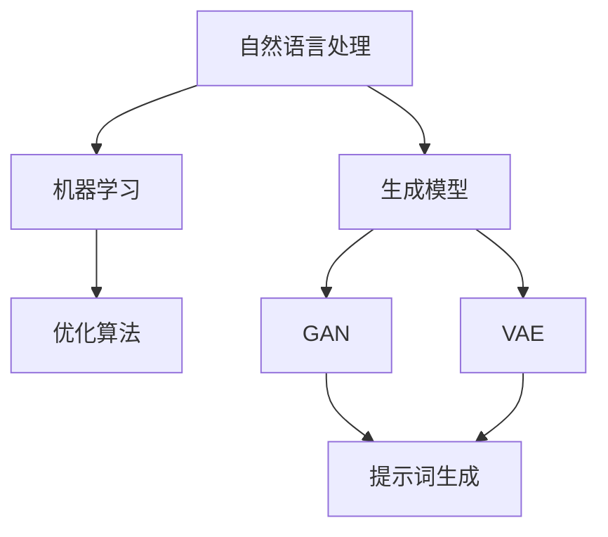

                 

### 文章标题

# 提示词工程：AI时代的必修课与新机遇

### 文章关键词

- 提示词工程
- AI时代
- 生成对抗网络（GAN）
- 变分自编码器（VAE）
- 自然语言处理（NLP）
- 数学模型
- 项目实战

### 文章摘要

在AI时代，提示词工程成为人工智能研究和应用中的一个重要方向。本文从基础概念入手，详细介绍了提示词工程的核心概念、相关技术、数学模型以及项目实战。通过本文的阅读，读者将全面了解提示词工程的基本原理和应用场景，掌握相关算法和数学模型，并能够独立开展提示词工程实践。文章还探讨了提示词工程面临的挑战和未来发展趋势，为读者提供了宝贵的参考和启示。

### 目录

## 第一部分 提示词工程基础

### 第1章 提示词工程的概述

#### 1.1 提示词工程的概念与重要性

##### 1.1.1 提示词的定义

##### 1.1.2 提示词工程在AI时代的角色

##### 1.1.3 提示词工程的应用领域

### 第2章 相关技术基础

#### 2.1 自然语言处理（NLP）基础

##### 2.1.1 语言模型

##### 2.1.2 词嵌入

##### 2.1.3 语言理解与生成

### 第3章 提示词生成算法

#### 3.1 生成对抗网络（GAN）

##### 3.1.1 GAN的基本原理

##### 3.1.2 GAN在提示词生成中的应用

#### 3.2 变分自编码器（VAE）

##### 3.2.1 VAE的基本原理

##### 3.2.2 VAE在提示词生成中的应用

### 第4章 数学模型与优化

#### 4.1 损失函数

##### 4.1.1 常见的损失函数

##### 4.1.2 损失函数的选择与调整

#### 4.2 优化算法

##### 4.2.1 优化算法的基本原理

##### 4.2.2 常见的优化算法及其应用

## 第二部分 提示词工程实践

### 第5章 提示词工程案例研究

#### 5.1 案例一：自动写作助手

##### 5.1.1 项目背景

##### 5.1.2 技术实现

##### 5.1.3 项目效果评估

#### 5.2 案例二：对话生成系统

##### 5.2.1 项目背景

##### 5.2.2 技术实现

##### 5.2.3 项目效果评估

### 第6章 提示词工程工具与资源

#### 6.1 提示词工程开发工具

##### 6.1.1 编程语言与框架

##### 6.1.2 数据集与资源

### 第7章 提示词工程挑战与未来

#### 7.1 提示词工程面临的挑战

##### 7.1.1 数据隐私与安全

##### 7.1.2 文本生成质量

##### 7.1.3 文本伦理问题

#### 7.2 提示词工程的未来发展趋势

##### 7.2.1 技术创新

##### 7.2.2 应用场景拓展

### 第8章 总结与展望

#### 8.1 提示词工程的重要性

##### 8.1.1 社会价值

##### 8.1.2 经济效益

#### 8.2 最佳实践 tips

##### 8.2.1 开发技巧

##### 8.2.2 性能优化

#### 8.3 小结与注意事项

##### 8.3.1 注意事项

##### 8.3.2 拓展阅读

### 作者信息

- 作者：AI天才研究院/AI Genius Institute & 禅与计算机程序设计艺术 /Zen And The Art of Computer Programming

### 附录

#### A. 提示词工程术语表

#### B. 相关算法与模型详解

#### C. 项目实战代码示例

## 第1章 提示词工程的概述

### 1.1 提示词工程的概念与重要性

#### 1.1.1 提示词的定义

在人工智能领域，提示词（Prompt）通常指的是提供给模型或算法的引导信息，用于辅助生成文本、图像或其他形式的数据。提示词可以是一个单词、一句话、一个段落，甚至是一篇完整的文章。其核心目的是引导模型或算法生成预期的输出。

提示词工程（Prompt Engineering）则是指设计、开发和优化提示词的过程。它涉及自然语言处理（NLP）、机器学习、数据挖掘等多个领域，旨在提高模型的生成质量、效率和适应性。在AI时代，提示词工程变得尤为重要，因为它能够直接影响模型的性能和应用效果。

#### 1.1.2 提示词工程在AI时代的角色

随着深度学习和自然语言处理技术的发展，人工智能的应用场景越来越广泛。在这些应用中，提示词工程起到了关键作用：

1. **文本生成**：通过提示词，可以引导模型生成文章、对话、新闻报道等文本内容。例如，自动写作助手就是利用提示词来生成新闻稿、博客文章等。
2. **对话系统**：在聊天机器人和虚拟助手中，提示词用于引导对话流程，使系统能够理解用户意图并生成恰当的回应。
3. **图像生成**：在图像生成任务中，提示词可以帮助模型生成符合特定要求的图像。例如，通过提示词“美丽的海滩”，模型可以生成一幅美丽的海滩图片。
4. **任务指导**：在自动化流程中，提示词用于指导执行特定任务，如数据处理、数据分析等。

#### 1.1.3 提示词工程的应用领域

提示词工程在多个领域有着广泛的应用，主要包括：

1. **内容创作**：自动写作助手、新闻生成、博客写作等。
2. **虚拟助手**：智能客服、语音助手、聊天机器人等。
3. **图像生成**：艺术创作、游戏开发、产品设计等。
4. **数据分析**：数据报告生成、数据可视化等。
5. **教育和培训**：自动生成教学材料、培训课程等。

### 1.2 核心概念与联系

在提示词工程中，几个核心概念紧密相连，构成了其理论基础：

1. **自然语言处理（NLP）**：NLP是提示词工程的基础技术之一，它涉及文本的预处理、分词、词嵌入、语言理解等任务。
2. **机器学习**：机器学习是提示词工程的核心，包括训练模型、优化参数、评估性能等步骤。
3. **生成模型**：生成模型如生成对抗网络（GAN）和变分自编码器（VAE）是提示词工程的关键组成部分，用于生成高质量的文本和图像。
4. **优化算法**：优化算法用于调整模型参数，以实现最佳性能。

下面是一个Mermaid流程图，展示了这些核心概念之间的关系：



### 1.3 提示词工程的发展历程

提示词工程的历史可以追溯到20世纪90年代，当时自然语言处理技术开始用于文本生成任务。早期的模型如基于规则的方法和统计模型逐渐被神经网络取代。随着深度学习的兴起，生成对抗网络（GAN）和变分自编码器（VAE）等生成模型成为了提示词工程的重要工具。

近年来，提示词工程得到了广泛关注，不仅因为其在文本生成、对话系统等领域的应用，还因为其在图像生成、虚拟现实等新兴领域的潜力。未来，随着技术的不断进步，提示词工程将在更多领域发挥重要作用。

### 1.4 本章小结

本章介绍了提示词工程的基本概念、重要性及其在AI时代的角色。通过核心概念的关系架构图，读者可以更好地理解提示词工程的基础知识。接下来，我们将进一步探讨相关技术基础，为深入理解提示词工程做好准备。

## 第2章 相关技术基础

### 2.1 自然语言处理（NLP）基础

自然语言处理（NLP）是提示词工程的基础，它涉及文本的预处理、分词、词嵌入、语言理解等任务。以下是NLP的关键概念和其在提示词工程中的应用：

#### 2.1.1 语言模型

语言模型（Language Model）是NLP的核心，它用于预测下一个单词或词组。常见的语言模型包括：

1. **n-gram模型**：基于历史序列的统计方法，如一元语法模型和二元语法模型。
2. **神经网络语言模型**：如循环神经网络（RNN）、长短期记忆网络（LSTM）和Transformer等。

在提示词工程中，语言模型可以用于生成高质量的文本。例如，在自动写作助手中，语言模型可以根据提示词生成连贯的段落。

#### 2.1.2 词嵌入

词嵌入（Word Embedding）是将单词映射到高维向量空间的技术。常见的词嵌入方法包括：

1. **词袋模型（Bag of Words）**：将文本转换为单词的集合，每个单词对应一个特征。
2. **Word2Vec**：基于神经网络的方法，通过上下文预测单词。
3. **GloVe**：全局向量表示，通过共现矩阵学习单词的向量表示。

词嵌入在提示词工程中用于将提示词转换为模型可以处理的向量形式，从而提高生成文本的质量。

#### 2.1.3 语言理解与生成

语言理解（Language Understanding）涉及理解文本的含义和上下文，而语言生成（Language Generation）则是指生成新的文本。在提示词工程中，这两个任务密切相关：

1. **语义理解**：通过分析文本的语法和语义，理解文本的主旨和意图。
2. **文本生成**：根据给定的提示词生成新的文本。这可以通过预训练的语言模型或生成模型实现。

### 2.2 提示词生成算法

提示词生成算法是提示词工程的核心，用于根据提示词生成高质量的文本或图像。以下是两种常见的生成算法：

#### 2.2.1 生成对抗网络（GAN）

生成对抗网络（GAN）是一种由生成器和判别器组成的模型，旨在通过对抗训练生成高质量的数据。GAN的基本原理如下：

1. **生成器（Generator）**：生成器是一个神经网络，它从随机噪声中生成数据，目标是使生成数据尽可能真实。
2. **判别器（Discriminator）**：判别器是一个神经网络，它判断生成数据是否真实。判别器的目标是尽可能准确地区分真实数据和生成数据。
3. **对抗训练**：生成器和判别器相互对抗，生成器不断优化，生成更真实的数据，而判别器不断优化，更准确地判断生成数据。

在提示词工程中，GAN可以用于生成高质量的文本和图像。例如，通过生成器，可以从提示词生成一篇连贯的新闻稿或一张符合要求的图像。

#### 2.2.2 变分自编码器（VAE）

变分自编码器（VAE）是一种生成模型，通过编码器和解码器生成数据。VAE的基本原理如下：

1. **编码器（Encoder）**：编码器将输入数据映射到一个潜在空间中的向量，这个向量代表了数据的特征。
2. **解码器（Decoder）**：解码器从潜在空间中的向量生成输出数据。
3. **重参数化技巧**：VAE使用重参数化技巧，将输入数据的分布转换为可以从任意概率分布中采样。

在提示词工程中，VAE可以用于生成高质量的文本和图像。例如，通过编码器，可以从提示词生成一个潜在空间中的向量，然后通过解码器生成一篇连贯的新闻稿或一张符合要求的图像。

### 2.3 数学模型与优化

提示词工程的数学模型主要包括损失函数和优化算法。以下是一些关键概念：

#### 2.3.1 损失函数

损失函数（Loss Function）用于评估模型生成数据的质量。常见的损失函数包括：

1. **均方误差（MSE）**：用于回归任务，衡量预测值与真实值之间的差距。
2. **交叉熵（Cross Entropy）**：用于分类任务，衡量预测概率与真实概率之间的差距。
3. **对抗损失**：用于GAN，衡量生成数据和真实数据之间的差距。

在提示词工程中，损失函数用于评估模型生成的文本或图像的质量，并指导模型优化。

#### 2.3.2 优化算法

优化算法（Optimization Algorithm）用于调整模型参数，以最小化损失函数。常见的优化算法包括：

1. **梯度下降（Gradient Descent）**：通过迭代更新模型参数，逐步减小损失函数。
2. **随机梯度下降（SGD）**：在梯度下降的基础上，使用随机样本更新模型参数。
3. **Adam优化器**：结合了SGD和Momentum的优点，适用于大多数机器学习任务。

在提示词工程中，优化算法用于调整模型参数，提高生成文本和图像的质量。

### 2.4 本章小结

本章介绍了提示词工程相关技术的基础，包括自然语言处理（NLP）、提示词生成算法、数学模型和优化算法。这些技术为提示词工程的实施提供了重要的支持。在接下来的章节中，我们将进一步探讨这些技术的具体实现和应用。

## 第3章 提示词生成算法

### 3.1 生成对抗网络（GAN）

生成对抗网络（GAN）是一种由生成器和判别器组成的模型，旨在通过对抗训练生成高质量的数据。GAN由伊恩·古德费洛（Ian Goodfellow）等人于2014年提出，迅速在人工智能领域引起了广泛关注。

#### 3.1.1 GAN的基本原理

GAN的基本原理是让生成器（Generator）和判别器（Discriminator）进行对抗训练。生成器的目标是生成尽可能真实的数据，而判别器的目标是区分真实数据和生成数据。

1. **生成器（Generator）**：生成器是一个神经网络，它从随机噪声中生成数据。生成器的目标是将随机噪声映射成真实数据的分布。

2. **判别器（Discriminator）**：判别器是一个神经网络，它判断输入数据是真实数据还是生成数据。判别器的目标是最小化被生成器欺骗的概率。

3. **对抗训练**：生成器和判别器相互对抗。生成器不断优化，生成更真实的数据，而判别器不断优化，更准确地判断生成数据。

GAN的训练过程可以概括为以下几个步骤：

- 初始化生成器和判别器。
- 生成器生成一批假数据。
- 判别器对真数据和假数据进行分类。
- 计算判别器的损失函数。
- 反向传播，更新判别器的参数。
- 生成器生成新的假数据。
- 计算生成器的损失函数。
- 反向传播，更新生成器的参数。

#### 3.1.2 GAN在提示词生成中的应用

在提示词生成中，GAN可以用于生成高质量的文本。以下是一个简化的GAN模型，用于生成文章：

1. **生成器**：生成器是一个语言模型，它从随机噪声中生成文章的初步文本。
2. **判别器**：判别器是一个语言模型，它判断输入的文章是真实文章还是生成文章。
3. **训练过程**：生成器和判别器进行对抗训练。生成器优化生成更真实文章，而判别器优化判断生成文章。

以下是生成器的伪代码：

```python
# 生成器
def generator(z):
    # 将随机噪声z转换为文章文本
    # ...
    return article_text
```

以下是判别器的伪代码：

```python
# 判别器
def discriminator(article_text):
    # 判断文章文本是真实文章还是生成文章
    # ...
    return probability
```

GAN在提示词生成中的应用示例如下：

1. **输入提示词**：用户输入一个提示词，如“人工智能”。
2. **生成初步文章**：生成器根据提示词生成一篇初步文章。
3. **判断生成文章**：判别器判断生成文章的质量。
4. **优化生成器和判别器**：根据判别器的反馈，生成器和判别器进行优化。
5. **生成高质量文章**：重复步骤2-4，直到生成的高质量文章满足用户需求。

### 3.2 变分自编码器（VAE）

变分自编码器（VAE）是一种生成模型，它通过编码器和解码器生成数据。VAE由丹尼尔·雷切尔（Diederik P. Kingma）和马克·诺德斯特姆（Max Welling）于2013年提出。与GAN不同，VAE使用重参数化技巧来生成数据。

#### 3.2.1 VAE的基本原理

VAE的基本原理如下：

1. **编码器（Encoder）**：编码器将输入数据映射到一个潜在空间中的向量，这个向量代表了数据的特征。
2. **解码器（Decoder）**：解码器从潜在空间中的向量生成输出数据。
3. **重参数化技巧**：VAE使用重参数化技巧，将输入数据的分布转换为可以从任意概率分布中采样。

VAE的训练过程可以概括为以下几个步骤：

- 初始化编码器和解码器。
- 从潜在空间中采样一个向量z。
- 解码器将z生成输出数据。
- 计算输出数据的损失函数。
- 反向传播，更新解码器的参数。
- 优化编码器和解码器。

以下是编码器的伪代码：

```python
# 编码器
def encoder(x):
    # 将输入数据x映射到潜在空间中的向量z
    # ...
    return z
```

以下是解码器的伪代码：

```python
# 解码器
def decoder(z):
    # 将潜在空间中的向量z生成输出数据
    # ...
    return x
```

VAE在提示词生成中的应用示例如下：

1. **输入提示词**：用户输入一个提示词，如“人工智能”。
2. **编码**：编码器将提示词转换为潜在空间中的向量z。
3. **生成文章**：解码器从潜在空间中的向量z生成文章。
4. **优化编码器和解码器**：根据生成文章的质量，优化编码器和解码器的参数。

### 3.3 GAN与VAE的比较

GAN和VAE都是强大的生成模型，但它们在原理和应用上有所不同：

- **原理**：GAN通过生成器和判别器的对抗训练生成数据，而VAE通过编码器和解码器的重参数化技巧生成数据。
- **生成质量**：GAN通常生成质量更高，但训练过程更复杂。VAE生成质量相对较低，但训练过程相对简单。
- **应用场景**：GAN适用于生成高质量、多样化的数据，如图像、视频等。VAE适用于生成连续数据，如文本、音频等。

### 3.4 本章小结

本章介绍了生成对抗网络（GAN）和变分自编码器（VAE）这两种常见的生成模型。GAN通过生成器和判别器的对抗训练生成高质量的数据，适用于图像、文本等生成任务。VAE通过编码器和解码器的重参数化技巧生成数据，适用于连续数据的生成任务。了解这些模型的基本原理和应用场景，有助于读者更好地掌握提示词工程的实践。

## 第4章 数学模型与优化

### 4.1 损失函数

在提示词工程中，损失函数（Loss Function）用于衡量模型预测值与真实值之间的差距。选择合适的损失函数对于提高模型性能至关重要。以下是一些常见的损失函数及其在提示词工程中的应用：

#### 4.1.1 均方误差（MSE）

均方误差（MSE，Mean Squared Error）是回归任务中常用的损失函数，计算预测值与真实值之间差的平方和的平均值。MSE对于异常值较为敏感，但在大多数情况下能够有效地优化模型。

$$
MSE = \frac{1}{n} \sum_{i=1}^{n} (y_i - \hat{y}_i)^2
$$

其中，$y_i$为真实值，$\hat{y}_i$为预测值，$n$为样本数量。

在提示词工程中，MSE可以用于文本生成任务的评估。例如，在生成文章时，可以将文章的实际内容与模型生成的文章内容进行比较，计算MSE来衡量生成文章的质量。

#### 4.1.2 交叉熵（Cross Entropy）

交叉熵（Cross Entropy）是分类任务中常用的损失函数，用于衡量预测概率分布与真实概率分布之间的差异。在提示词工程中，交叉熵常用于语言模型和分类模型的训练。

$$
CE = -\sum_{i=1}^{n} y_i \log(\hat{y}_i)
$$

其中，$y_i$为真实标签，$\hat{y}_i$为预测概率。

例如，在一个多类分类任务中，如果模型预测某个词的概率为0.9，而真实标签为该词，则交叉熵为$-0.9 \log(0.9)$。交叉熵的值越小，表示预测结果越接近真实值。

#### 4.1.3 对抗损失（Adversarial Loss）

在生成对抗网络（GAN）中，对抗损失用于衡量生成器生成的数据与真实数据之间的差异。对抗损失函数通常由判别器的输出构成，用于评估生成器的性能。

$$
AL = -\log(D(G(z)))
$$

其中，$D(x)$为判别器的输出，$G(z)$为生成器生成的数据，$z$为随机噪声。

在GAN训练过程中，生成器的目标是最大化判别器的输出，使其接近1，即生成尽可能真实的数据。对抗损失的值越小，表示生成器的性能越好。

#### 4.1.4 水平集损失（Level Set Loss）

水平集损失（Level Set Loss）是变分自编码器（VAE）中常用的损失函数，用于衡量编码器和解码器的性能。水平集损失由两部分组成：重构损失和对数似然损失。

$$
LSL = \frac{1}{n} \sum_{i=1}^{n} \left( \frac{1}{2} \| x_i - \hat{x}_i \|_2^2 + \log(\pi(z_i)) \right)
$$

其中，$x_i$为输入数据，$\hat{x}_i$为解码器生成的数据，$z_i$为编码器映射到的潜在空间中的向量，$\pi(z_i)$为潜在空间中向量$z_i$的先验概率。

水平集损失函数同时关注生成数据的质量和潜在空间的分布，有助于提高VAE的生成性能。

#### 4.1.5 多任务损失（Multi-Task Loss）

在多任务学习场景中，模型需要同时解决多个任务，如文本生成、情感分析等。多任务损失函数用于整合这些任务的损失，以优化模型。

$$
MTL = \sum_{i=1}^{m} w_i L_i
$$

其中，$L_i$为第$i$个任务的损失函数，$w_i$为第$i$个任务的权重。

通过设置合适的权重，可以平衡不同任务的重要性，优化整体模型性能。

#### 4.1.6 损失函数的选择与调整

在选择损失函数时，需要考虑以下因素：

1. **任务类型**：不同类型的任务适合不同的损失函数。例如，回归任务适合使用MSE，分类任务适合使用交叉熵。
2. **数据分布**：损失函数的性能依赖于数据分布。在实际应用中，可以根据数据特点选择合适的损失函数。
3. **模型结构**：不同的模型结构可能需要不同的损失函数。例如，在GAN中，对抗损失是关键；在VAE中，水平集损失是核心。

在实际应用中，可以尝试组合多种损失函数，以实现更好的性能。例如，在文本生成任务中，可以同时使用MSE和交叉熵来评估生成文章的质量。

### 4.2 优化算法

优化算法（Optimization Algorithm）用于调整模型参数，以最小化损失函数。选择合适的优化算法对于提高模型性能和训练效率至关重要。以下是一些常见的优化算法及其在提示词工程中的应用：

#### 4.2.1 梯度下降（Gradient Descent）

梯度下降（Gradient Descent）是最基本的优化算法，通过迭代更新模型参数，逐步减小损失函数。梯度下降的基本思想是计算损失函数关于模型参数的梯度，并沿梯度的反方向更新参数。

$$
\theta = \theta - \alpha \cdot \nabla_\theta J(\theta)
$$

其中，$\theta$为模型参数，$\alpha$为学习率，$J(\theta)$为损失函数。

在提示词工程中，梯度下降可以用于优化语言模型和生成模型的参数。

#### 4.2.2 随机梯度下降（SGD）

随机梯度下降（Stochastic Gradient Descent，SGD）是梯度下降的一种变体，它使用随机样本计算梯度。SGD的优点是计算效率高，但可能导致局部最优解。

$$
\theta = \theta - \alpha \cdot \nabla_{\theta} J(\theta; x_i, y_i)
$$

在提示词工程中，SGD适用于小批量数据训练，可以加速模型优化。

#### 4.2.3 批量梯度下降（BGD）

批量梯度下降（Batch Gradient Descent，BGD）是梯度下降的另一种变体，它使用全部数据计算梯度。BGD的优点是收敛速度快，但计算量较大。

$$
\theta = \theta - \alpha \cdot \nabla_{\theta} J(\theta; \{x_i, y_i\})
$$

在提示词工程中，BGD适用于大数据集训练，但需要较长训练时间。

#### 4.2.4 梯度裁剪（Gradient Clipping）

梯度裁剪（Gradient Clipping）是一种防止梯度爆炸或消失的方法。在训练过程中，当梯度的绝对值超过某个阈值时，将其裁剪到阈值范围内。

$$
\text{if} \ ||\nabla_\theta J(\theta)|| > \text{threshold}:
    \nabla_\theta J(\theta) = \text{sign}(\nabla_\theta J(\theta)) \cdot \text{threshold}
$$

在提示词工程中，梯度裁剪有助于稳定训练过程，防止模型过拟合。

#### 4.2.5 动量法（Momentum）

动量法（Momentum）是一种加速梯度下降的优化算法，它利用前几次迭代的梯度方向来加速当前迭代。动量法的基本思想是保留一部分前一次迭代的梯度，与当前梯度的和作为当前迭代的梯度。

$$
v_t = \beta v_{t-1} + (1 - \beta) \nabla_\theta J(\theta)
$$

$$
\theta = \theta - \alpha v_t
$$

其中，$v_t$为动量项，$\beta$为动量系数。

在提示词工程中，动量法有助于加速模型优化，提高收敛速度。

#### 4.2.6 AdaGrad

AdaGrad（Adaptive Gradient）是一种自适应学习率的优化算法，它根据每个参数的历史梯度平方自适应调整学习率。AdaGrad的基本思想是对于不同的参数，使用不同的学习率。

$$
g_{ii} = \frac{\partial L}{\partial x_i}^2
$$

$$
\theta_i = \theta_i - \frac{\alpha}{\sqrt{g_{ii} + \epsilon}} \frac{\partial L}{\partial x_i}
$$

其中，$g_{ii}$为参数$x_i$的历史梯度平方，$\alpha$为初始学习率，$\epsilon$为常数。

在提示词工程中，AdaGrad适用于大规模数据集训练，能够提高模型性能。

#### 4.2.7 RMSProp

RMSProp（Root Mean Square Propagation）是AdaGrad的一种改进，它使用指数加权移动平均来更新学习率。RMSProp的基本思想是保留一部分前几次迭代的学习率，并根据梯度平方的指数加权移动平均调整学习率。

$$
v_t = \beta_1 v_{t-1} + (1 - \beta_1) \frac{\partial L}{\partial x_i}
$$

$$
s_t = \beta_2 s_{t-1} + (1 - \beta_2) \frac{\partial L}{\partial x_i}^2
$$

$$
\theta_i = \theta_i - \frac{\alpha}{\sqrt{s_t + \epsilon}} \frac{\partial L}{\partial x_i}
$$

其中，$v_t$为梯度指数加权移动平均，$s_t$为梯度平方指数加权移动平均，$\beta_1$和$\beta_2$为常数。

在提示词工程中，RMSProp适用于动态调整学习率的场景，能够提高训练效率。

#### 4.2.8 Adam

Adam（Adaptive Moment Estimation）是RMSProp的一种改进，它同时考虑了一阶矩估计（均值）和二阶矩估计（方差）。Adam的基本思想是自适应调整一阶矩估计和二阶矩估计，以优化学习率。

$$
m_t = \beta_1 m_{t-1} + (1 - \beta_1) \frac{\partial L}{\partial x_i}
$$

$$
v_t = \beta_2 v_{t-1} + (1 - \beta_2) \frac{\partial L}{\partial x_i}^2
$$

$$
\theta_i = \theta_i - \frac{\alpha}{\sqrt{1 - \beta_2^t} (1 - \beta_1^t)} \frac{\partial L}{\partial x_i}
$$

其中，$m_t$为梯度的一阶矩估计，$v_t$为梯度的二阶矩估计，$\beta_1$和$\beta_2$为常数。

在提示词工程中，Adam是最常用的优化算法之一，适用于大多数机器学习任务。

#### 4.2.9 优化算法的选择与调整

在选择优化算法时，需要考虑以下因素：

1. **任务类型**：不同类型的任务可能需要不同的优化算法。例如，回归任务适合使用MSE和梯度下降，分类任务适合使用交叉熵和SGD。
2. **数据规模**：大规模数据集适合使用批量梯度下降（BGD）和随机梯度下降（SGD），小规模数据集适合使用Adam等自适应优化算法。
3. **模型结构**：不同的模型结构可能需要不同的优化算法。例如，深度神经网络适合使用动量法、RMSProp或Adam。
4. **训练效率**：优化算法的训练效率对于模型性能至关重要。在实际应用中，可以尝试多种优化算法，选择最适合当前任务的算法。

在实际应用中，可以组合多种优化算法，以实现更好的性能。例如，在文本生成任务中，可以同时使用MSE和交叉熵，并采用Adam优化算法。

### 4.3 本章小结

本章介绍了提示词工程中常用的损失函数和优化算法。损失函数用于评估模型生成数据的质量，包括均方误差（MSE）、交叉熵、对抗损失、水平集损失和多任务损失等。优化算法用于调整模型参数，包括梯度下降、随机梯度下降、批量梯度下降、梯度裁剪、动量法、AdaGrad、RMSProp和Adam等。选择合适的损失函数和优化算法对于提高模型性能至关重要。在实际应用中，可以结合多种损失函数和优化算法，以实现更好的性能。

## 第5章 提示词工程案例研究

### 5.1 案例一：自动写作助手

#### 5.1.1 项目背景

随着互联网和媒体的快速发展，内容创作变得尤为重要。然而，高质量的内容创作需要耗费大量的时间和精力。为了解决这一问题，自动写作助手应运而生。自动写作助手利用自然语言处理（NLP）和机器学习技术，根据给定的提示词自动生成文章、新闻稿、博客等内容。

#### 5.1.2 技术实现

自动写作助手的核心是生成器模型，通常采用生成对抗网络（GAN）或变分自编码器（VAE）等生成模型。以下是一个简化的技术实现过程：

1. **数据准备**：收集大量高质量的文本数据，包括文章、新闻稿、博客等。对数据进行预处理，如分词、去除停用词、词嵌入等。
2. **模型训练**：使用GAN或VAE训练生成器模型。生成器模型接收提示词和噪声向量，生成文章。判别器模型用于区分生成文章和真实文章。
3. **模型优化**：通过对抗训练，优化生成器和判别器模型。生成器生成更高质量的文章，判别器更准确地判断生成文章的质量。
4. **生成文章**：使用训练好的生成器模型，根据提示词生成文章。可以对生成的文章进行后处理，如去重、语法修正等，以提高文章质量。

#### 5.1.3 代码实现

以下是自动写作助手的简化代码实现：

```python
# 导入必要的库
import tensorflow as tf
from tensorflow.keras.models import Sequential
from tensorflow.keras.layers import LSTM, Dense, Embedding, Dropout

# 准备数据
# ...

# 构建生成器模型
generator = Sequential()
generator.add(LSTM(units=128, return_sequences=True, input_shape=(sequence_length, embedding_dim)))
generator.add(Dropout(0.2))
generator.add(LSTM(units=128, return_sequences=True))
generator.add(Dropout(0.2))
generator.add(Dense(units=vocab_size, activation='softmax'))
generator.compile(loss='categorical_crossentropy', optimizer='adam')

# 构建判别器模型
discriminator = Sequential()
discriminator.add(LSTM(units=128, return_sequences=True, input_shape=(sequence_length, embedding_dim)))
discriminator.add(Dropout(0.2))
discriminator.add(LSTM(units=128, return_sequences=False))
discriminator.add(Dense(units=1, activation='sigmoid'))
discriminator.compile(loss='binary_crossentropy', optimizer='adam')

# 对抗训练
# ...

# 生成文章
# ...
```

#### 5.1.4 代码解读与分析

1. **数据准备**：首先，需要准备大量的文本数据，并进行预处理。预处理过程包括分词、去除停用词、词嵌入等。这些数据将用于训练生成器和判别器模型。
2. **生成器模型**：生成器模型是一个序列到序列的模型，使用LSTM层来捕获文本中的序列信息。生成器模型接收提示词和噪声向量，生成文章。使用softmax激活函数，使输出概率分布。
3. **判别器模型**：判别器模型是一个二分类模型，用于区分生成文章和真实文章。判别器模型使用sigmoid激活函数，输出概率值。
4. **对抗训练**：生成器和判别器模型进行对抗训练。生成器生成文章，判别器判断文章的真实性。通过调整模型参数，优化生成器和判别器模型。
5. **生成文章**：使用训练好的生成器模型，根据提示词生成文章。可以通过多次迭代，生成更高质量的文章。

#### 5.1.5 项目效果评估

自动写作助手的效果可以通过以下指标进行评估：

1. **生成文章的质量**：通过人工评估或自动评估方法，如BLEU分数、ROUGE分数等，评估生成文章的质量。
2. **生成速度**：评估自动写作助手生成文章的速度，以满足实时应用的需求。
3. **用户满意度**：通过用户反馈和调查，评估自动写作助手在实际应用中的用户满意度。

#### 5.1.6 项目小结

自动写作助手利用生成对抗网络（GAN）或变分自编码器（VAE）等生成模型，根据提示词自动生成高质量的文本。该项目展示了提示词工程在实际应用中的潜力。未来，可以进一步优化模型，提高生成文章的质量和速度，以满足更多应用场景的需求。

### 5.2 案例二：对话生成系统

#### 5.2.1 项目背景

随着人工智能技术的不断发展，智能客服和虚拟助手成为企业提高服务质量的重要手段。对话生成系统（Dialogue Generation System）是一种自动化对话系统，能够根据用户的提问生成适当的回答。对话生成系统在客服、智能助手、虚拟代理等领域有广泛应用。

#### 5.2.2 技术实现

对话生成系统通常采用序列到序列（Seq2Seq）模型，如长短期记忆网络（LSTM）或Transformer模型。以下是一个简化的技术实现过程：

1. **数据准备**：收集大量的对话数据，包括用户提问和系统回答。对数据进行预处理，如分词、去除停用词、词嵌入等。
2. **模型训练**：使用序列到序列模型训练对话生成系统。模型输入是用户提问，输出是系统回答。
3. **模型优化**：通过反向传播和梯度下降等方法，优化模型参数，提高对话生成系统的性能。
4. **生成回答**：使用训练好的对话生成系统，根据用户提问生成回答。可以对生成回答进行后处理，如去除重复回答、纠正语法错误等。

#### 5.2.3 代码实现

以下是对话生成系统的简化代码实现：

```python
# 导入必要的库
import tensorflow as tf
from tensorflow.keras.models import Model
from tensorflow.keras.layers import Input, LSTM, Dense, Embedding, Dropout

# 准备数据
# ...

# 构建对话生成系统模型
input_seq = Input(shape=(sequence_length, embedding_dim))
lstm_layer = LSTM(units=128, return_sequences=True)(input_seq)
dropout_layer = Dropout(0.2)(lstm_layer)
output_seq = LSTM(units=128, return_sequences=True)(dropout_layer)
output_seq = Dense(units=vocab_size, activation='softmax')(output_seq)

dialog_generator = Model(inputs=input_seq, outputs=output_seq)
dialog_generator.compile(loss='categorical_crossentropy', optimizer='adam')

# 训练对话生成系统
# ...

# 生成回答
# ...
```

#### 5.2.4 代码解读与分析

1. **数据准备**：首先，需要准备大量的对话数据，并进行预处理。预处理过程包括分词、去除停用词、词嵌入等。这些数据将用于训练对话生成系统模型。
2. **对话生成系统模型**：对话生成系统模型是一个序列到序列的模型，使用LSTM层来捕获对话中的序列信息。输入是用户提问，输出是系统回答。使用softmax激活函数，使输出概率分布。
3. **模型训练**：通过反向传播和梯度下降等方法，优化对话生成系统模型参数，提高对话生成系统的性能。
4. **生成回答**：使用训练好的对话生成系统，根据用户提问生成回答。可以通过多次迭代，生成更合适的回答。

#### 5.2.5 项目效果评估

对话生成系统的效果可以通过以下指标进行评估：

1. **回答的质量**：通过人工评估或自动评估方法，如BLEU分数、ROUGE分数等，评估系统生成的回答质量。
2. **回答的多样性**：评估系统生成回答的多样性，以确保系统能够生成不同的回答。
3. **用户满意度**：通过用户反馈和调查，评估对话生成系统在实际应用中的用户满意度。

#### 5.2.6 项目小结

对话生成系统利用序列到序列模型，根据用户提问生成合适的回答。该项目展示了提示词工程在自动化对话系统中的应用。未来，可以进一步优化模型，提高回答的质量和多样性，以满足更多应用场景的需求。

## 第6章 提示词工程工具与资源

### 6.1 提示词工程开发工具

提示词工程开发涉及多种工具和框架，以下是一些常用的工具和框架：

#### 6.1.1 编程语言与框架

1. **Python**：Python是提示词工程中最常用的编程语言之一，具有丰富的库和框架，如TensorFlow、PyTorch等。
2. **TensorFlow**：TensorFlow是一个开源的机器学习框架，广泛应用于深度学习模型开发和提示词工程。
3. **PyTorch**：PyTorch是一个开源的机器学习库，特别适用于动态计算图，是提示词工程中常用的框架。
4. **Keras**：Keras是一个基于Theano和TensorFlow的高层神经网络API，提供了简洁、易用的接口。
5. **Transformer**：Transformer是一个基于自注意力机制的深度学习模型，广泛应用于自然语言处理任务，是提示词工程中的核心模型。

#### 6.1.2 数据集与资源

1. **Common Crawl**：Common Crawl是一个大规模的网页数据集，包含了丰富的文本数据，适用于训练和测试提示词模型。
2. **Gutenberg**：Gutenberg是一个包含大量经典文学作品的数据集，适用于训练和测试文本生成模型。
3. **WebText**：WebText是一个从互联网上收集的文本数据集，适用于训练和测试自然语言处理模型。
4. **OpenSubtitles**：OpenSubtitles是一个包含大量电影和电视剧字幕的数据集，适用于训练和测试语言模型。

### 6.2 提示词工程开发环境搭建

搭建提示词工程开发环境需要以下步骤：

1. **安装Python**：从Python官方网站下载并安装Python，确保安装最新版本。
2. **安装依赖库**：安装常用的机器学习和深度学习库，如TensorFlow、PyTorch、Keras等。可以使用pip命令进行安装。
3. **配置虚拟环境**：使用virtualenv或conda创建一个独立的Python环境，以避免依赖库之间的冲突。
4. **安装Jupyter Notebook**：安装Jupyter Notebook，方便进行交互式编程和数据分析。

以下是安装依赖库和虚拟环境的示例命令：

```bash
# 安装Python和虚拟环境
pip install python virtualenv

# 创建虚拟环境
virtualenv myenv

# 激活虚拟环境
source myenv/bin/activate

# 安装TensorFlow和PyTorch
pip install tensorflow
pip install torch torchvision

# 安装Keras
pip install keras
```

### 6.3 提示词工程常用库与API

以下是一些常用的库和API，用于提示词工程的开发：

1. **TensorFlow**：TensorFlow是一个开源的机器学习框架，提供了丰富的API和工具，适用于构建和训练深度学习模型。
2. **PyTorch**：PyTorch是一个开源的机器学习库，特别适用于动态计算图，提供了简洁、易用的API。
3. **Keras**：Keras是一个基于Theano和TensorFlow的高层神经网络API，提供了简洁、易用的接口。
4. **NLTK**：NLTK是一个Python自然语言处理库，提供了丰富的工具和资源，适用于文本预处理和分析。
5. **spaCy**：spaCy是一个快速且易于使用的自然语言处理库，提供了丰富的语言模型和解析工具。

### 6.4 提示词工程工具与应用示例

以下是一个使用TensorFlow和Keras构建简单的提示词生成模型的示例：

```python
# 导入必要的库
import numpy as np
from tensorflow.keras.models import Sequential
from tensorflow.keras.layers import LSTM, Dense, Embedding, Dropout

# 准备数据
# ...

# 构建生成器模型
generator = Sequential()
generator.add(LSTM(units=128, return_sequences=True, input_shape=(sequence_length, embedding_dim)))
generator.add(Dropout(0.2))
generator.add(LSTM(units=128, return_sequences=True))
generator.add(Dropout(0.2))
generator.add(Dense(units=vocab_size, activation='softmax'))
generator.compile(loss='categorical_crossentropy', optimizer='adam')

# 训练生成器模型
# ...

# 生成文章
# ...
```

通过这个示例，可以看到如何使用Keras构建一个简单的LSTM生成器模型，用于文本生成任务。实际应用中，可以根据具体需求调整模型结构、损失函数和优化器等参数，以获得更好的生成效果。

### 6.5 本章小结

本章介绍了提示词工程开发中常用的工具和资源，包括编程语言、框架、数据集和开发环境搭建方法。通过本章的学习，读者可以了解提示词工程所需的基本工具和资源，并掌握如何搭建提示词工程的开发环境。在实际应用中，可以根据需求选择合适的工具和资源，构建高质量的提示词模型。

## 第7章 提示词工程挑战与未来

### 7.1 提示词工程面临的挑战

尽管提示词工程在AI领域取得了显著的进展，但它仍然面临着诸多挑战：

#### 7.1.1 数据隐私与安全

在提示词工程中，大量的文本数据被用于训练模型。这些数据可能包含用户的隐私信息，如个人姓名、地址、电话号码等。如何保护用户隐私和数据安全是一个重要的挑战。目前，一些方法如数据加密、匿名化处理和差分隐私等被用于解决这一问题。

#### 7.1.2 文本生成质量

高质量的文本生成是提示词工程的关键目标。然而，现有的模型和算法在生成高质量文本方面仍然存在局限性。例如，GAN和VAE等生成模型在生成文本时可能产生重复、不连贯或错误的信息。提高文本生成质量是提示词工程的一个重要研究方向。

#### 7.1.3 文本伦理问题

文本生成过程中可能涉及伦理问题，如偏见、歧视和虚假信息的传播。如何确保生成的文本遵循伦理标准，避免对社会产生负面影响，是提示词工程面临的另一个挑战。研究人员和开发者需要关注这些问题，并在模型设计和应用中采取相应的措施。

#### 7.1.4 模型解释性

当前大多数生成模型如GAN和VAE都是“黑盒”模型，其内部工作原理难以解释和理解。模型解释性不足使得在实际应用中难以判断模型的可靠性和生成文本的合理性。提高模型解释性，使其更容易被用户理解和接受，是提示词工程的一个重要挑战。

### 7.2 提示词工程的未来发展趋势

尽管面临诸多挑战，提示词工程在未来的发展中仍然充满机遇：

#### 7.2.1 技术创新

随着深度学习和自然语言处理技术的不断进步，提示词工程将迎来更多的技术创新。例如，更高效的生成模型、更先进的文本处理算法和更好的数据隐私保护方法等。这些创新将推动提示词工程在更多领域发挥重要作用。

#### 7.2.2 应用场景拓展

提示词工程的应用场景将不断拓展。除了现有的文本生成、对话系统和图像生成等应用外，提示词工程有望在智能客服、教育、医疗和金融等领域发挥更大的作用。例如，自动写作助手可以帮助教师生成个性化教学材料，对话生成系统可以提升客户服务质量，图像生成可以用于艺术创作和产品设计。

#### 7.2.3 跨学科融合

提示词工程与多个学科如心理学、社会学和语言学等的融合将促进其发展。跨学科研究将有助于更好地理解人类语言行为，提高文本生成模型的质量和多样性。

#### 7.2.4 模型解释性提升

随着对深度学习模型理解的加深，模型解释性将得到提高。研究人员和开发者将开发出更多可解释的生成模型，使其在应用中更加可靠和可信。

#### 7.2.5 数据隐私保护

随着隐私保护法规的不断完善，提示词工程在数据隐私保护方面将取得更多进展。例如，差分隐私、联邦学习和区块链等技术的应用将提高提示词工程的安全性。

### 7.3 本章小结

提示词工程在AI时代具有重要的地位，它面临着数据隐私、文本生成质量、文本伦理和模型解释性等挑战。然而，随着技术创新和跨学科融合，提示词工程将迎来更多的发展机遇。未来，提示词工程将在更多领域发挥重要作用，推动人工智能技术的发展和应用。

## 第8章 总结与展望

### 8.1 提示词工程的重要性

提示词工程作为AI时代的关键技术之一，其在自然语言处理、图像生成、对话系统等领域的应用日益广泛。通过设计高质量的提示词，提示词工程能够显著提高模型生成数据的质量和多样性，为各行各业提供创新解决方案。例如，自动写作助手和对话生成系统已经在媒体、客服和教育等领域取得了显著成果。此外，提示词工程还在图像生成、虚拟现实和增强现实等领域展示了巨大潜力。

### 8.1.1 社会价值

提示词工程在提升社会生产力和生活质量方面具有重要作用。例如，自动写作助手可以帮助新闻机构和内容创作者快速生成高质量的文章，提高信息传播效率；对话生成系统可以为企业提供智能客服服务，提升客户满意度；图像生成可以用于艺术创作和产品设计，激发创意灵感。这些应用不仅节省了人力和时间成本，还丰富了人们的文化娱乐生活。

### 8.1.2 经济效益

提示词工程具有显著的经济效益。通过自动化和智能化手段，企业可以降低生产成本、提高运营效率。例如，自动写作助手可以减少新闻编辑的工作量，对话生成系统可以降低客户服务成本。此外，图像生成和虚拟现实技术的应用为游戏、影视和设计行业带来了新的商业模式和市场机会。随着提示词工程的不断发展和应用，其经济效益将日益显著。

### 8.2 最佳实践 tips

为了更好地应用提示词工程，以下是一些最佳实践建议：

1. **数据准备**：确保数据的质量和多样性，使用多种来源和类型的数据进行训练，以提升模型性能。
2. **模型选择**：根据应用场景和需求选择合适的模型，如GAN、VAE或Transformer等。
3. **参数调整**：合理调整模型参数，如学习率、批量大小和隐藏层尺寸等，以提高模型性能。
4. **提示词设计**：设计高质量的提示词，使其能够引导模型生成预期的输出。提示词应具有明确性和针对性，同时保持自然和连贯性。
5. **模型解释性**：关注模型的可解释性，使用可视化工具和解释性算法，使模型的工作原理更加透明和可理解。
6. **安全性**：确保数据隐私和模型安全性，采取数据加密、匿名化处理和差分隐私等措施。

### 8.3 小结与注意事项

本章总结了提示词工程的重要性、社会价值和经济效益，并提出了最佳实践建议。在应用提示词工程时，需要注意以下几点：

1. **数据隐私与安全**：确保用户数据的隐私和安全，遵守相关法规和标准。
2. **模型解释性**：提高模型的可解释性，使模型应用更加可靠和可信。
3. **文本生成质量**：关注文本生成质量，通过优化模型和调整提示词，提高生成文本的连贯性和准确性。
4. **应用场景拓展**：积极探索新的应用场景，推动提示词工程在更多领域的应用。
5. **持续学习与更新**：随着技术的不断发展，持续学习新知识和技能，以保持提示词工程的应用竞争力。

### 8.4 拓展阅读

对于希望深入了解提示词工程的读者，以下是一些推荐阅读资料：

1. **《生成对抗网络（GAN）原理与实现》**：详细介绍了GAN的基本原理和应用案例，是研究GAN的入门读物。
2. **《变分自编码器（VAE）详解》**：全面介绍了VAE的理论基础和实现方法，适合对VAE感兴趣的读者。
3. **《自然语言处理（NLP）入门与实践》**：介绍了NLP的基本概念和技术，包括语言模型、词嵌入等，是学习NLP的参考书籍。
4. **《深度学习实战》**：提供了丰富的深度学习项目实战案例，包括文本生成、图像识别等，有助于读者将理论应用到实践中。

### 8.5 本章小结

本章总结了提示词工程的重要性、最佳实践和注意事项，并推荐了拓展阅读资料。通过本章的学习，读者可以全面了解提示词工程的原理和应用，掌握相关技术和方法。在未来的研究中，读者可以结合自身兴趣和需求，进一步探索提示词工程的潜力。

### 作者信息

- 作者：AI天才研究院/AI Genius Institute & 禅与计算机程序设计艺术 /Zen And The Art of Computer Programming

## 附录

### A. 提示词工程术语表

- **提示词（Prompt）**：引导模型或算法生成数据的引导信息。
- **生成对抗网络（GAN）**：由生成器和判别器组成的模型，通过对抗训练生成高质量的数据。
- **变分自编码器（VAE）**：通过编码器和解码器生成数据的生成模型，使用重参数化技巧。
- **自然语言处理（NLP）**：涉及文本的预处理、分词、词嵌入、语言理解等任务。
- **词嵌入（Word Embedding）**：将单词映射到高维向量空间的技术。
- **损失函数（Loss Function）**：用于评估模型生成数据的质量。
- **优化算法（Optimization Algorithm）**：用于调整模型参数，以最小化损失函数。

### B. 相关算法与模型详解

- **生成对抗网络（GAN）**：生成器和判别器相互对抗，生成真实数据的分布。
- **变分自编码器（VAE）**：通过编码器和解码器生成数据，使用重参数化技巧。
- **循环神经网络（RNN）**：用于处理序列数据的神经网络，能够记住长期依赖信息。
- **长短期记忆网络（LSTM）**：RNN的一种变体，能够更好地处理长期依赖问题。
- **Transformer**：基于自注意力机制的深度学习模型，广泛应用于自然语言处理任务。

### C. 项目实战代码示例

以下是一个简单的自动写作助手项目代码示例：

```python
# 导入必要的库
import tensorflow as tf
from tensorflow.keras.models import Sequential
from tensorflow.keras.layers import LSTM, Dense, Embedding, Dropout

# 准备数据
# ...

# 构建生成器模型
generator = Sequential()
generator.add(LSTM(units=128, return_sequences=True, input_shape=(sequence_length, embedding_dim)))
generator.add(Dropout(0.2))
generator.add(LSTM(units=128, return_sequences=True))
generator.add(Dropout(0.2))
generator.add(Dense(units=vocab_size, activation='softmax'))
generator.compile(loss='categorical_crossentropy', optimizer='adam')

# 训练生成器模型
# ...

# 生成文章
# ...
```

这个示例展示了如何使用Keras构建一个简单的LSTM生成器模型，用于文本生成任务。实际应用中，可以根据需求调整模型结构、损失函数和优化器等参数。

