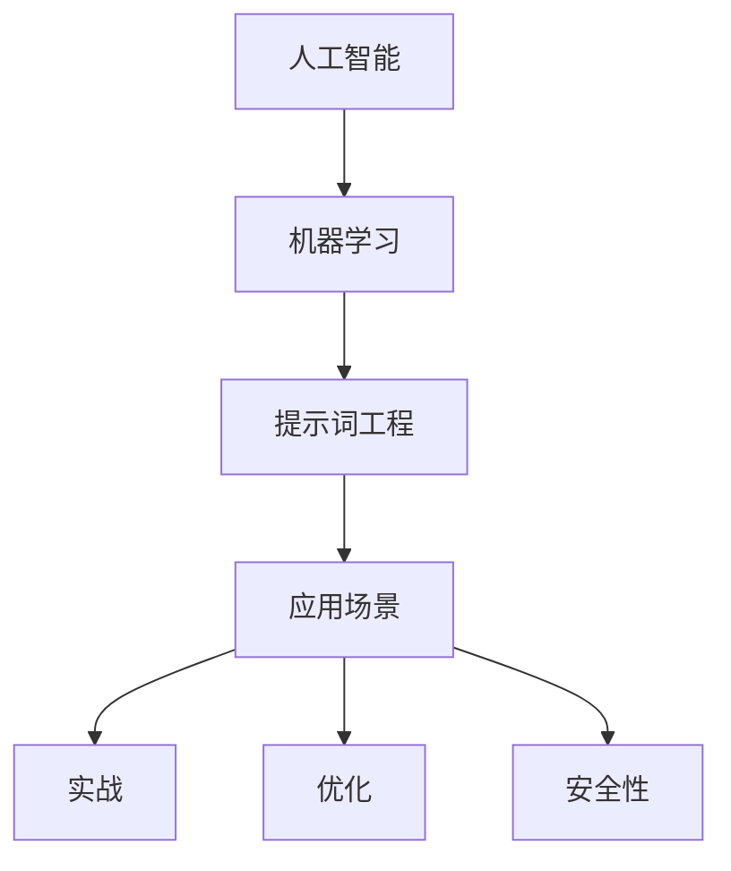

                 

# 提示词工程：AI时代的必修课与新机遇

> 关键词：AI、机器学习、提示词工程、应用场景、实战、优化、安全性

> 摘要：本文将深入探讨AI时代下的提示词工程，解析其核心概念、原理与应用。通过系统性的分析和逐步推理，我们将揭示提示词工程在自然语言处理、计算机视觉和数据科学等领域的广泛应用，同时探讨其技术优化、安全性考虑以及AI时代的新机遇。

## 设计思路

设计这篇关于提示词工程的文章，我们需要遵循以下原则：

1. **核心概念的清晰阐述**：首先介绍AI和机器学习的基本概念，然后逐步引入提示词工程，确保读者能够理解这一技术的背景和意义。
   
2. **结构化内容组织**：按照由浅入深的顺序，先介绍基础理论，再介绍应用场景和实战案例，最后探讨优化和安全性问题。

3. **技术细节的详尽讲解**：使用伪代码、LaTeX公式和实际案例来详细阐述核心算法原理和数学模型。

4. **逻辑清晰、条理分明**：确保每个章节的内容紧密相连，形成完整的逻辑链条。

### 第一部分：AI基础与提示词工程概述

#### 1.1 AI与机器学习概述

人工智能（AI）是计算机科学的一个分支，旨在使机器表现出类似于人类智能的行为。机器学习（ML）是AI的核心技术之一，通过数据驱动的方式使机器能够从经验中学习并改进其性能。

#### 1.2 提示词工程的基本概念

提示词工程是机器学习中的一个重要领域，主要关注如何设计有效的提示词来指导模型学习。提示词是一种特殊的输入，它能够帮助模型更好地理解数据并进行预测。

### 核心概念联系架构 Mermaid 流程图



### 第二部分：AI时代的提示词工程实践

#### 2.1 自然语言处理中的提示词应用

在自然语言处理（NLP）中，提示词工程广泛应用于文本生成、情感分析、命名实体识别等领域。例如，通过设计有效的提示词，我们可以训练出一个能够生成高质量文本的模型。

#### 2.2 计算机视觉中的提示词应用

在计算机视觉（CV）中，提示词工程可以帮助模型更好地理解和识别图像中的对象。例如，在图像分类任务中，提示词可以指导模型识别不同的对象类别。

#### 2.3 数据科学中的提示词应用

在数据科学中，提示词工程可以用于数据预处理、特征提取和模型训练等环节。有效的提示词可以提高数据质量和模型性能。

### 核心算法原理讲解与伪代码

```python
# 提示词生成算法伪代码
def generate_prompt(data):
    # 对输入数据进行预处理
    preprocessed_data = preprocess_data(data)
    
    # 利用预处理的输入数据生成提示词
    prompt = generate_from_preprocessed_data(preprocessed_data)
    
    return prompt
```

### 第三部分：AI时代的新机遇

#### 3.1 提示词工程在商业中的应用

提示词工程在商业领域的应用非常广泛，包括市场营销、客户服务和业务自动化等。有效的提示词可以提高企业的运营效率和客户满意度。

#### 3.2 提示词工程的未来发展趋势

随着AI技术的不断发展，提示词工程也将迎来新的机遇。未来的发展趋势包括多模态学习、个性化提示词生成和自适应提示词优化等。

### 最佳实践 tips、小结、注意事项、拓展阅读

#### 最佳实践 tips

- 设计提示词时，要充分考虑数据的分布和模型的优化目标。
- 在实际应用中，不断调整和优化提示词，以提高模型性能。
- 注意保护用户数据隐私，确保提示词工程的安全性。

#### 小结

本文系统地介绍了AI时代下的提示词工程，从基础概念到应用实践，再到未来发展趋势，全面解析了这一技术的核心内容。

#### 注意事项

- 提示词工程需要大量的数据支持，确保数据质量和多样性。
- 在实际应用中，要密切关注模型的性能和安全问题。

#### 拓展阅读

- [《深度学习》](https://www.deeplearningbook.org/)：了解深度学习的基本原理和算法。
- [《自然语言处理综论》](https://nlp.stanford.edu/coling2014/)：深入学习自然语言处理的相关技术。
- [《计算机视觉：算法与应用》](https://www.computer-vision-textbook.com/)：了解计算机视觉的基础知识。

### 结语

作者：AI天才研究院/AI Genius Institute & 禅与计算机程序设计艺术 /Zen And The Art of Computer Programming

本文旨在为读者提供关于提示词工程的全面了解，帮助他们在AI时代中抓住新机遇，提升技术能力。希望本文能够成为您在AI领域学习和实践的指南。

