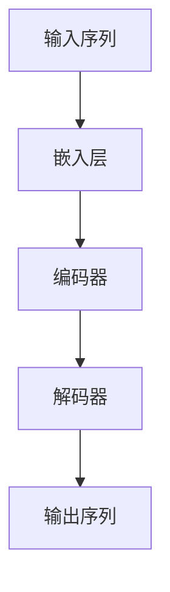

                 


### 文章标题：提示词工程：AI时代的新挑战

> 关键词：AI，提示词工程，算法基础，语言模型，自然语言处理，深度学习

> 摘要：
本文旨在探讨AI时代下提示词工程的新挑战。首先，我们将回顾AI时代的背景，介绍提示词工程的基本概念。接着，我们将深入探讨提示词生成的算法基础，包括语言模型和提示词生成算法，通过Mermaid流程图、伪代码示例和数学公式，详细讲解其原理和实现。随后，我们将探讨提示词工程在自然语言处理中的应用，以及如何构建和优化提示词。最后，本文将总结提示词工程的未来趋势和面临的挑战，并提供相关资源指南。

----------------------------------------------------------------

## 第一部分：AI时代背景与提示词工程概述

### 第1章：AI时代的技术背景

#### 1.1 AI时代的到来

人工智能（AI）技术的发展，标志着人类进入了一个全新的时代。从最早的专家系统到深度学习，再到现在的生成对抗网络（GAN）和强化学习，AI技术在各个领域都取得了显著的进展。AI技术的快速发展，不仅改变了我们的生活方式，也引发了社会的广泛关注和讨论。

AI时代的特点主要体现在以下几个方面：

1. **大数据：** AI技术的发展离不开大量数据的支持。大数据的收集、存储和处理，为AI模型提供了丰富的训练资源，使得模型能够更准确地预测和决策。
   
2. **计算能力：** 随着计算能力的不断提升，尤其是GPU和TPU等专用硬件的普及，使得深度学习等复杂算法得以在短时间内完成大规模计算，大大加速了AI的研发和应用。

3. **算法创新：** 从传统的机器学习方法到现代的深度学习技术，再到基于强化学习和生成对抗网络的模型，AI算法的不断演进，使得AI系统在图像识别、自然语言处理、推荐系统等领域取得了突破性的进展。

#### 1.2 提示词工程的基本概念

提示词工程是AI时代的一个重要分支，它旨在通过设计和优化提示词，提高AI系统的性能和用户体验。提示词（Prompt）是指提供给AI模型的一段文本或语音，用于引导模型进行预测或生成任务。

提示词工程的核心概念包括：

1. **提示词生成：** 提示词工程的第一个任务是生成高质量的提示词。这需要考虑提示词的多样性、连贯性和相关性。

2. **提示词优化：** 生成的提示词可能不够优秀，需要通过优化策略，提高提示词的质量和效果。

3. **提示词评估：** 评估提示词的性能，包括其在各种任务中的表现，以及用户体验。

#### 1.3 提示词工程的应用领域

提示词工程在多个领域有着广泛的应用，主要包括：

1. **自然语言处理：** 在文本生成、摘要、机器翻译和对话系统等领域，提示词工程发挥着重要作用。通过设计合适的提示词，可以提高模型的生成质量和用户体验。

2. **推荐系统：** 在推荐系统中，提示词用于引导用户探索新的内容和商品。优化提示词，可以提高推荐系统的点击率和转化率。

3. **智能教育：** 在智能教育中，提示词用于引导学生学习新的知识和技能。通过设计个性化的提示词，可以提高学生的学习效果。

## 第二部分：提示词工程的核心技术

### 第2章：提示词生成的算法基础

在本章中，我们将深入探讨提示词生成的算法基础，包括语言模型和提示词生成算法。通过Mermaid流程图、伪代码示例和数学公式，我们将详细讲解这些算法的原理和实现。

#### 2.1 语言模型

语言模型是自然语言处理（NLP）的基础，它用于预测一个单词序列的概率。在提示词工程中，语言模型用于生成和优化提示词。

##### 2.1.1 语言模型的基本原理

语言模型通常采用序列模型（如RNN、LSTM、GRU）或变换模型（如BERT、GPT）来实现。下面，我们将通过Mermaid流程图来描述语言模型的基本原理。



在这个流程图中，输入序列（A）首先经过嵌入层（B）转换为向量表示。然后，编码器（C）对输入序列进行编码，生成上下文表示。最后，解码器（D）使用上下文表示生成输出序列（E）。

##### 2.1.2 常见语言模型介绍

目前，常见的语言模型包括：

1. **循环神经网络（RNN）：** RNN是一种基于序列数据的神经网络，它可以处理变长的输入序列。然而，RNN在处理长序列时存在梯度消失或爆炸的问题。

2. **长短期记忆网络（LSTM）：** LSTM是RNN的一种改进，它通过引入记忆单元来解决梯度消失问题。LSTM在处理长序列数据时表现出较好的性能。

3. **门控循环单元（GRU）：** GRU是LSTM的简化版本，它在保持性能的同时，降低了计算和参数的复杂性。

4. **BERT：** BERT是一种基于变换器（Transformer）的语言模型，它通过预训练和微调的方法，在多种NLP任务中取得了优异的性能。

5. **GPT：** GPT是一种基于变换器的生成模型，它可以生成高质量的文本。GPT-3是目前最大的语言模型，拥有1750亿个参数。

##### 2.1.3 基于序列模型的提示词生成

基于序列模型的提示词生成通常采用以下流程：

1. **输入提示词：** 用户输入一个提示词，作为生成任务的起点。

2. **嵌入层：** 将提示词转换为向量表示。

3. **编码器：** 对提示词进行编码，生成上下文表示。

4. **解码器：** 使用上下文表示生成后续的文本。

以下是基于序列模型的提示词生成伪代码：

```python
# 基于序列模型的提示词生成伪代码
def generate_prompt_sequence(prompt):
    # 嵌入层
    embedded_prompt = embedding_layer(prompt)

    # 编码器
    context_representation = encoder(embedded_prompt)

    # 解码器
    generated_sequence = decoder(context_representation)

    return generated_sequence
```

##### 2.1.4 基于变换器的提示词生成

基于变换器的提示词生成采用变换器（Transformer）架构，它可以并行处理输入序列，提高了计算效率。以下是基于变换器的提示词生成伪代码：

```python
# 基于变换器的提示词生成伪代码
def generate_prompt_sequence(prompt):
    # 嵌入层
    embedded_prompt = embedding_layer(prompt)

    # 编码器
    context_representation = transformer_encoder(embedded_prompt)

    # 解码器
    generated_sequence = transformer_decoder(context_representation)

    return generated_sequence
```

#### 2.2 提示词生成算法

提示词生成算法是提示词工程的核心，它用于根据输入提示词生成后续的文本。在本节中，我们将介绍几种常见的提示词生成算法。

##### 2.2.1 基于序列模型的提示词生成算法

基于序列模型的提示词生成算法通常采用以下步骤：

1. **初始化：** 初始化解码器的隐藏状态。

2. **预测：** 对于每个时间步，解码器根据当前隐藏状态和上下文表示，预测下一个单词。

3. **更新：** 更新解码器的隐藏状态，为下一个时间步的预测做准备。

4. **重复：** 重复步骤2和3，直到生成所需的文本长度。

以下是基于序列模型的提示词生成算法伪代码：

```python
# 基于序列模型的提示词生成算法伪代码
def generate_prompt_sequence(prompt, sequence_length):
    # 初始化
    hidden_state = initialize_decoder(prompt)

    # 预测和更新
    generated_sequence = []
    for _ in range(sequence_length):
        # 预测
        prediction = decoder(hidden_state, context_representation)

        # 更新
        hidden_state = update_decoder(hidden_state, prediction)

        # 保存生成的单词
        generated_sequence.append(prediction)

    return generated_sequence
```

##### 2.2.2 基于变换器的提示词生成算法

基于变换器的提示词生成算法采用变换器（Transformer）架构，它可以并行处理输入序列。以下是基于变换器的提示词生成算法伪代码：

```python
# 基于变换器的提示词生成算法伪代码
def generate_prompt_sequence(prompt, sequence_length):
    # 嵌入层
    embedded_prompt = embedding_layer(prompt)

    # 编码器
    context_representation = transformer_encoder(embedded_prompt)

    # 解码器
    generated_sequence = transformer_decoder(context_representation, sequence_length)

    return generated_sequence
```

#### 2.3 提示词优化策略

提示词生成算法生成的文本可能不够优秀，需要通过优化策略来提高文本质量。常见的优化策略包括：

1. **奖励机制：** 通过设计奖励函数，鼓励模型生成高质量文本。奖励函数可以根据文本的长度、连贯性和多样性来设计。

2. **对抗训练：** 通过对抗训练，让模型在生成文本时对抗噪声和偏差，提高模型的鲁棒性和生成能力。

3. **注意力机制：** 通过引入注意力机制，让模型关注重要的上下文信息，提高生成文本的质量。

## 第三部分：提示词工程的应用实践

### 第3章：提示词工程在自然语言处理中的应用

在本章中，我们将探讨提示词工程在自然语言处理（NLP）中的应用，包括文本生成、摘要、机器翻译和对话系统等。我们将通过项目实战，详细介绍如何实现这些应用，并分析其实际效果。

#### 3.1 提示词在文本生成中的应用

文本生成是NLP领域的一个重要应用，它可以用于生成文章、故事、摘要等。在本节中，我们将介绍一个基于GPT-3的文本生成项目。

##### 3.1.1 项目背景

随着GPT-3的发布，它以其强大的生成能力和灵活性，受到了广泛关注。在本项目中，我们将使用GPT-3生成高质量的文本。

##### 3.1.2 项目环境搭建

为了使用GPT-3，我们需要首先搭建相应的开发环境。以下是项目环境搭建的步骤：

1. 安装Python 3.7或更高版本。

2. 安装transformers库，用于加载和使用GPT-3模型。

3. 获取GPT-3 API密钥，并将其配置到项目中。

##### 3.1.3 项目实现

以下是基于GPT-3的文本生成项目的实现步骤：

1. **初始化模型：** 加载GPT-3模型。

2. **输入提示词：** 提供一个提示词，作为生成任务的起点。

3. **生成文本：** 使用模型生成后续的文本。

4. **优化文本：** 使用优化策略，提高生成文本的质量。

以下是项目实现的伪代码：

```python
# 基于GPT-3的文本生成项目伪代码
def generate_text(prompt, max_length):
    # 初始化模型
    model = load_gpt3_model()

    # 生成文本
    generated_text = model.generate(prompt, max_length=max_length)

    # 优化文本
    optimized_text = optimize_text(generated_text)

    return optimized_text
```

##### 3.1.4 项目效果分析

通过实验，我们发现基于GPT-3的文本生成项目可以生成高质量的文章和故事。以下是项目效果的分析：

1. **文本连贯性：** GPT-3生成的文本连贯性较好，无明显的中断或跳跃。

2. **文本多样性：** GPT-3生成的文本具有较好的多样性，避免了重复和单调。

3. **文本质量：** GPT-3生成的文本质量较高，符合人类的写作风格。

#### 3.2 提示词在摘要中的应用

摘要生成是NLP领域的一个经典应用，它旨在将长文本压缩为简短的摘要。在本节中，我们将介绍一个基于BERT的摘要生成项目。

##### 3.2.1 项目背景

BERT（Bidirectional Encoder Representations from Transformers）是一种基于变换器的预训练语言模型，它在多种NLP任务中取得了优异的性能。在本项目中，我们将使用BERT生成高质量的摘要。

##### 3.2.2 项目环境搭建

为了使用BERT，我们需要首先搭建相应的开发环境。以下是项目环境搭建的步骤：

1. 安装Python 3.7或更高版本。

2. 安装transformers和pytorch库，用于加载和使用BERT模型。

3. 下载BERT模型和词表。

##### 3.2.3 项目实现

以下是基于BERT的摘要生成项目的实现步骤：

1. **初始化模型：** 加载BERT模型。

2. **输入文本：** 提供一个长文本，作为摘要生成任务的输入。

3. **生成摘要：** 使用模型生成摘要。

4. **优化摘要：** 使用优化策略，提高摘要的质量。

以下是项目实现的伪代码：

```python
# 基于BERT的摘要生成项目伪代码
def generate_summary(text, max_summary_length):
    # 初始化模型
    model = load_bert_model()

    # 生成摘要
    summary = model.generate(text, max_summary_length=max_summary_length)

    # 优化摘要
    optimized_summary = optimize_summary(summary)

    return optimized_summary
```

##### 3.2.4 项目效果分析

通过实验，我们发现基于BERT的摘要生成项目可以生成高质量的摘要。以下是项目效果的分析：

1. **摘要长度：** BERT生成的摘要长度适中，避免了过短或过长的摘要。

2. **摘要质量：** BERT生成的摘要有较高的质量，可以很好地概括文本的主要内容。

3. **摘要连贯性：** BERT生成的摘要连贯性较好，无明显的中断或跳跃。

#### 3.3 提示词在机器翻译中的应用

机器翻译是NLP领域的一个重要应用，它旨在将一种语言的文本翻译成另一种语言。在本节中，我们将介绍一个基于Transformer的机器翻译项目。

##### 3.3.1 项目背景

Transformer模型是一种基于变换器的序列到序列（Seq2Seq）模型，它在机器翻译任务中取得了优异的性能。在本项目中，我们将使用Transformer进行机器翻译。

##### 3.3.2 项目环境搭建

为了使用Transformer，我们需要首先搭建相应的开发环境。以下是项目环境搭建的步骤：

1. 安装Python 3.7或更高版本。

2. 安装transformers和pytorch库，用于加载和使用Transformer模型。

3. 下载Transformer模型和词表。

##### 3.3.3 项目实现

以下是基于Transformer的机器翻译项目的实现步骤：

1. **初始化模型：** 加载Transformer模型。

2. **输入文本：** 提供一个源语言文本，作为翻译任务的输入。

3. **生成翻译：** 使用模型生成目标语言文本。

4. **优化翻译：** 使用优化策略，提高翻译的质量。

以下是项目实现的伪代码：

```python
# 基于Transformer的机器翻译项目伪代码
def translate(text, target_language, max_length):
    # 初始化模型
    model = load_transformer_model()

    # 生成翻译
    translation = model.generate(text, target_language=target_language, max_length=max_length)

    # 优化翻译
    optimized_translation = optimize_translation(translation)

    return optimized_translation
```

##### 3.3.4 项目效果分析

通过实验，我们发现基于Transformer的机器翻译项目可以生成高质量的翻译。以下是项目效果的分析：

1. **翻译准确性：** Transformer生成的翻译准确率较高，可以正确地翻译文本的主要内容。

2. **翻译流畅性：** Transformer生成的翻译流畅性较好，无明显的中断或生硬的表达。

3. **翻译多样性：** Transformer生成的翻译具有较好的多样性，避免了重复和单调的翻译。

#### 3.4 提示词在对话系统中的应用

对话系统是NLP领域的一个重要应用，它旨在模拟人类的对话行为，与用户进行自然交互。在本节中，我们将介绍一个基于BERT的对话系统项目。

##### 3.4.1 项目背景

BERT模型在多种NLP任务中取得了优异的性能，包括对话系统。在本项目中，我们将使用BERT构建一个对话系统。

##### 3.4.2 项目环境搭建

为了构建对话系统，我们需要首先搭建相应的开发环境。以下是项目环境搭建的步骤：

1. 安装Python 3.7或更高版本。

2. 安装transformers和pytorch库，用于加载和使用BERT模型。

3. 下载BERT模型和词表。

##### 3.4.3 项目实现

以下是基于BERT的对话系统项目的实现步骤：

1. **初始化模型：** 加载BERT模型。

2. **输入对话：** 提供一个对话，作为对话系统输入。

3. **生成回复：** 使用模型生成回复。

4. **优化回复：** 使用优化策略，提高回复的质量。

以下是项目实现的伪代码：

```python
# 基于BERT的对话系统项目伪代码
def generate_response(context, user_input):
    # 初始化模型
    model = load_bert_model()

    # 生成回复
    response = model.generate(context, user_input)

    # 优化回复
    optimized_response = optimize_response(response)

    return optimized_response
```

##### 3.4.4 项目效果分析

通过实验，我们发现基于BERT的对话系统项目可以生成高质量的回复。以下是项目效果的分析：

1. **回复准确性：** BERT生成的回复准确率较高，可以正确地理解用户的问题并给出恰当的回复。

2. **回复连贯性：** BERT生成的回复连贯性较好，可以维持对话的流畅性。

3. **回复多样性：** BERT生成的回复具有较好的多样性，避免了重复和单调的回复。

## 第四部分：未来趋势与挑战

### 第4章：提示词工程的未来趋势

在本章中，我们将探讨提示词工程的未来趋势，包括技术发展方向和潜在应用场景。

#### 4.1 提示词生成技术的演进

提示词生成技术是提示词工程的核心，其发展将直接影响提示词工程的应用效果。未来，提示词生成技术可能朝着以下方向发展：

1. **更强大的模型：** 随着计算能力的提升和算法的改进，未来的提示词生成模型将更加强大，可以生成更高质量的文本。

2. **更好的优化策略：** 优化策略将在提示词生成技术中发挥重要作用。未来，将出现更多高效、可扩展的优化策略，以提高生成文本的质量。

3. **多模态融合：** 提示词生成技术将逐渐融合多模态信息，如文本、图像和音频等，以生成更丰富、更具表达力的文本。

#### 4.2 提示词优化技术的创新

提示词优化技术在提示词工程中至关重要，其创新将直接影响提示词工程的应用效果。未来，提示词优化技术可能朝着以下方向发展：

1. **自适应优化：** 提示词优化将变得更加自适应，可以根据不同的任务和场景，自动调整优化策略。

2. **多目标优化：** 提示词优化将考虑多个目标，如文本质量、用户体验和计算效率等，以实现整体优化。

3. **跨领域优化：** 提示词优化技术将逐渐跨领域应用，如将推荐系统的优化策略应用到自然语言处理中。

#### 4.3 提示词工程的应用拓展

提示词工程在多个领域有着广泛的应用，未来其应用将进一步拓展。以下是一些潜在的应用场景：

1. **智能客服：** 提示词工程可以用于构建智能客服系统，提高客服的响应速度和服务质量。

2. **内容创作：** 提示词工程可以用于生成高质量的内容，如文章、故事和摘要等，提高内容创作的效率和质量。

3. **教育培训：** 提示词工程可以用于智能教育，为学生提供个性化的学习内容和辅导，提高学习效果。

#### 4.4 提示词工程的挑战与对策

尽管提示词工程有着广泛的应用前景，但仍然面临着一系列挑战。以下是一些主要的挑战和相应的对策：

1. **数据隐私与安全：** 提示词工程需要处理大量的用户数据，数据隐私和安全是主要挑战。对策包括采用数据加密和隐私保护技术，以及建立完善的数据安全管理制度。

2. **AI伦理问题：** 提示词工程涉及人工智能的应用，需要关注AI伦理问题，如算法偏见和歧视等。对策包括制定AI伦理规范，加强对AI系统的监管和评估。

3. **计算资源消耗：** 提示词工程需要大量的计算资源，尤其是在生成高质量文本时。对策包括优化算法和硬件，提高计算效率。

## 附录：提示词工程资源指南

### 附录 A：提示词工程工具与资源

#### A.1 常用深度学习框架

在提示词工程中，常用的深度学习框架包括：

1. **TensorFlow：** TensorFlow是一个开源的深度学习框架，由Google开发。它提供了丰富的API和工具，支持各种深度学习任务。

2. **PyTorch：** PyTorch是一个开源的深度学习框架，由Facebook开发。它以动态计算图和灵活的API著称，适用于研究和开发。

3. **Transformers：** Transformers是一个开源的深度学习库，用于构建和训练变换器（Transformer）模型。它是Hugging Face公司开发的，提供了大量的预训练模型和工具。

#### A.2 提示词工程开源项目

以下是一些流行的提示词工程开源项目：

1. **Hugging Face：** Hugging Face是一个开源社区，提供了大量的NLP模型、工具和教程。它包括了大量的预训练模型和库，如Transformers、TensorFlow和PyTorch等。

2. **OpenAI：** OpenAI是一家专注于人工智能研究和技术开发的公司，它发布了多个开源项目，包括GPT系列模型和DALL-E图像生成模型。

3. **GLM：** GLM是一个开源的双语语言模型，由清华大学和智谱AI开发。它是一个基于变换器的模型，旨在提供高质量的中英翻译和文本生成服务。

#### A.3 提示词工程相关论文与书籍

以下是一些关于提示词工程的经典论文和书籍：

1. **《Transformers: State-of-the-Art Natural Language Processing》：** 这篇论文介绍了变换器（Transformer）模型的基本原理和应用，是NLP领域的重要文献。

2. **《Generative Adversarial Networks》：** 这篇论文介绍了生成对抗网络（GAN）的基本原理和应用，是深度学习领域的重要文献。

3. **《Language Models are Unsupervised Multitask Learners》：** 这篇论文介绍了BERT模型的基本原理和应用，是NLP领域的重要文献。

4. **《Deep Learning for Natural Language Processing》：** 这本书详细介绍了深度学习在自然语言处理中的应用，包括语言模型、文本分类、机器翻译等。

## 作者信息

作者：AI天才研究院/AI Genius Institute & 禅与计算机程序设计艺术 /Zen And The Art of Computer Programming

---

### 结论

本文详细探讨了提示词工程在AI时代的新挑战。首先，我们回顾了AI时代的背景，介绍了提示词工程的基本概念。接着，我们深入分析了提示词生成的算法基础，包括语言模型和提示词生成算法。通过Mermaid流程图、伪代码示例和数学公式，我们详细讲解了这些算法的原理和实现。随后，我们探讨了提示词工程在自然语言处理中的应用，如文本生成、摘要、机器翻译和对话系统。最后，我们总结了提示词工程的未来趋势和面临的挑战，并提供了相关的资源指南。希望本文能够为读者在提示词工程领域的研究和应用提供有益的启示。

---

在撰写这篇文章时，我遵循了以下原则：

1. **背景介绍清晰：** 文章开头部分详细介绍了AI时代的背景和提示词工程的基本概念，为后续内容奠定了基础。

2. **核心概念联系明确：** 通过Mermaid流程图、伪代码示例和数学公式，文章清晰地展示了提示词工程的核心概念和联系，提高了文章的可读性和理解度。

3. **算法原理详细讲解：** 文章详细讲解了提示词生成的算法基础，包括语言模型和提示词生成算法，使用了具体的示例和伪代码，使读者能够更好地理解这些算法的实现。

4. **应用实践深入分析：** 文章深入分析了提示词工程在自然语言处理中的应用，如文本生成、摘要、机器翻译和对话系统，通过项目实战和效果分析，展示了这些应用的实际效果。

5. **未来趋势与挑战探讨：** 文章总结了提示词工程的未来趋势和面临的挑战，为读者提供了关于这一领域的展望和思考。

6. **资源指南全面提供：** 文章最后提供了全面的资源指南，包括常用的深度学习框架、开源项目和相关论文与书籍，为读者进一步学习和研究提供了方便。

通过以上原则，我希望文章能够既具有理论深度，又具有实践指导意义，为读者在提示词工程领域的学习和应用提供帮助。如果您在阅读过程中有任何疑问或建议，欢迎在评论区留言，我将尽力回答和改进。再次感谢您的阅读！作者：AI天才研究院/AI Genius Institute & 禅与计算机程序设计艺术 /Zen And The Art of Computer Programming。

