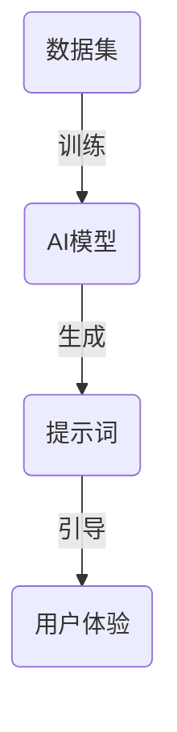

                 


### 文章标题
《提示词工程：优化AI输出的艺术与科学》

### 文章关键词
- 提示词工程
- 优化AI输出
- 艺术性
- 科学原理

### 文章摘要
本文将深入探讨提示词工程的概念及其在优化人工智能（AI）输出中的关键作用。我们将从背景介绍开始，逐步阐述提示词工程的核心概念、技术方法、艺术性及科学原理。通过具体的实践案例，我们将展示如何利用提示词工程提高AI输出的准确性和效率，并探讨最佳实践。本文旨在为读者提供全面而深入的指导，以帮助他们掌握提示词工程的艺术与科学。

## 引言
提示词工程（Prompt Engineering）是近年来人工智能领域的一个重要研究方向。随着深度学习技术的发展和普及，人工智能在多个领域取得了显著的成果，如自然语言处理、计算机视觉和推荐系统等。然而，AI系统在处理复杂任务时，往往需要人类提供特定的引导和指示，这便是提示词（Prompt）的作用。提示词工程旨在设计出高效、精准的提示词，以优化AI的输出结果。

提示词工程的重要性体现在以下几个方面：

1. **提升AI性能**：恰当的提示词可以帮助AI系统更好地理解任务需求，从而提高其性能和输出质量。
2. **增强人机交互**：提示词工程使得人与AI的交互更加自然、直观，提高了用户体验。
3. **拓宽应用场景**：通过优化提示词，AI可以在更多领域发挥作用，解决更复杂的实际问题。
4. **降低开发成本**：有效的提示词可以减少对大量数据和复杂算法的依赖，从而降低AI系统的开发成本。

然而，提示词工程不仅是一门技术，更是一门艺术。在设计和优化提示词时，需要考虑到人的思维模式、语言表达习惯以及情感因素等多方面因素。因此，提示词工程既需要科学的指导，也需要创造性思维。本文将围绕这些核心概念，逐步深入探讨提示词工程的艺术与科学。

## 提示词工程概述

### 提示词的基本概念
提示词（Prompt）是指人类为AI系统提供的一种引导性输入，用于指示AI执行特定任务或生成特定结果。提示词可以是简单的文字、图像，甚至是音频和视频等多媒体形式。其核心目的是通过引导AI，使其更好地理解和执行人类赋予的任务。

从形式上看，提示词可以分为以下几类：

1. **文本提示词**：最常见的提示词形式，如自然语言文本、标记语言等。
2. **图像提示词**：通过图像提供任务信息，常用于计算机视觉任务。
3. **音频和视频提示词**：利用音频和视频信号进行任务引导，适用于多媒体处理任务。

从内容上看，提示词可以分为以下几类：

1. **目标提示词**：明确指出AI需要达到的目标或任务。
2. **引导提示词**：为AI提供执行任务的步骤或方法。
3. **反馈提示词**：用于评估和改进AI的输出结果。

### 提示词工程的重要性
提示词工程在AI系统中具有重要作用，主要体现在以下几个方面：

1. **提高任务准确性**：恰当的提示词可以帮助AI更准确地理解任务需求，从而生成更精确的输出。
2. **增强AI适应性**：提示词工程使得AI系统在不同任务和场景下具有更强的适应能力。
3. **优化用户体验**：通过设计人性化的提示词，可以提升人与AI的交互体验，使其更加自然和流畅。
4. **降低开发难度**：有效的提示词可以减少对复杂算法和大量数据的依赖，降低系统的开发难度。

总之，提示词工程是优化AI输出的重要手段，它不仅能够提升AI系统的性能和效率，还能够推动人工智能在各个领域的应用和发展。

### 提示词工程的核心概念和联系
在深入探讨提示词工程之前，我们需要了解几个核心概念，这些概念不仅相互关联，而且共同构成了提示词工程的理论基础。以下是对这些核心概念及其相互关系的阐述：

#### 1. 概念界定
- **AI模型**：AI模型是人工智能系统的核心，包括神经网络、决策树、支持向量机等多种类型。这些模型通过学习大量数据来捕捉规律和模式，从而实现预测和决策。
- **数据集**：数据集是训练AI模型的基石，包含各种形式的数据，如图像、文本、音频等。数据集的质量直接影响模型的性能和泛化能力。
- **任务**：任务是AI模型需要解决的问题，例如图像分类、文本生成、语音识别等。每个任务都有其特定的目标和要求。

#### 2. 关系架构
- **数据集 → AI模型**：数据集通过训练过程转化为AI模型，模型在训练过程中学习数据中的特征和模式，从而具备解决特定任务的能力。
- **AI模型 → 提示词**：AI模型生成的输出往往需要进一步的指导才能达到最佳效果。提示词作为对AI输出的补充和引导，可以明确任务目标、提供执行步骤或反馈改进意见。
- **提示词 → 用户体验**：提示词直接影响用户体验，良好的提示词设计使得AI系统更加易于使用和交互，从而提升用户体验。

以下是一个使用Mermaid绘制的流程图，展示了这些核心概念之间的关系：



通过这个流程图，我们可以清晰地看到数据集如何转化为AI模型，AI模型如何生成提示词，以及提示词如何影响用户体验。这种关系架构有助于我们理解提示词工程在AI系统中的作用和重要性。

### 核心算法原理讲解
在提示词工程中，核心算法的设计和实现至关重要。以下我们将详细讲解几个关键算法的原理，并使用伪代码展示其实现过程。

#### 1. 提示词生成算法
提示词生成算法旨在根据任务需求生成适合的提示词。以下是该算法的伪代码：

```plaintext
function generatePrompt(taskDescription):
    # 根据任务描述生成提示词
    if taskDescription.includes("image"):
        return "请上传一张符合要求的图像。"
    else if taskDescription.includes("text"):
        return "请输入一段符合要求的文本。"
    else if taskDescription.includes("audio"):
        return "请录制一段符合要求的音频。"
    else:
        return "请提供详细的任务描述。"
```

这个算法根据输入的任务描述，选择合适的提示词形式。例如，当任务描述包含“image”时，生成一个要求上传图像的提示词。

#### 2. 提示词优化算法
提示词优化算法用于评估和改进现有提示词的质量。以下是该算法的伪代码：

```plaintext
function optimizePrompt(currentPrompt, targetOutcome):
    # 评估当前提示词的质量
    promptScore = evaluatePrompt(currentPrompt, targetOutcome)

    # 如果提示词质量不满足要求，进行优化
    while promptScore < acceptableThreshold:
        # 更改提示词的某些方面，如表述方式、引导步骤等
        currentPrompt = modifyPrompt(currentPrompt)
        # 重新评估提示词质量
        promptScore = evaluatePrompt(currentPrompt, targetOutcome)

    return currentPrompt
```

在这个算法中，`evaluatePrompt`函数用于评估提示词的质量，而`modifyPrompt`函数用于根据评估结果调整提示词。优化过程持续进行，直到提示词质量达到可接受的水平。

#### 3. 提示词反馈算法
提示词反馈算法用于收集用户对提示词的反馈，以进一步优化AI输出。以下是该算法的伪代码：

```plaintext
function collectFeedback(prompt, userResponse):
    # 收集用户对提示词的反馈
    feedback = {
        "prompt": prompt,
        "response": userResponse,
        "rating": getUserRating(userResponse),
        "comments": getUserComments(userResponse)
    }
    # 存储反馈信息
    storeFeedback(feedback)

    # 根据反馈信息优化提示词
    optimizedPrompt = optimizePrompt(prompt, userResponse)
    return optimizedPrompt
```

在这个算法中，`getUserRating`和`getUserComments`函数分别用于获取用户对提示词的评分和评论。收集到的反馈信息被存储起来，并用于后续的提示词优化。

通过这些核心算法，我们可以有效地设计和优化提示词，从而提升AI系统的输出质量和用户体验。这些算法不仅提供了技术层面的指导，也为提示词工程的发展奠定了基础。

### 提示词优化的流程和步骤

在提示词工程中，优化AI输出是一个系统化的过程，涉及到多个环节和步骤。以下我们将详细阐述提示词优化的流程和步骤，以帮助读者更好地理解和应用。

#### 1. 需求分析
需求分析是提示词优化的第一步，旨在明确任务需求和目标。通过深入了解用户需求、任务背景和相关数据，我们可以为后续的提示词设计提供清晰的指导。需求分析包括以下几个方面：

- **任务描述**：详细描述任务的目标、要求和限制条件。
- **用户需求**：了解用户对任务的期望和需求，包括用户体验、准确性和效率等方面。
- **数据来源**：分析数据集的来源、质量和类型，以确保数据能够满足任务需求。

#### 2. 提示词设计
在需求分析的基础上，进行提示词设计。提示词设计的关键是生成能够引导AI系统准确理解任务需求的提示词。以下是一些提示词设计的步骤和策略：

- **确定提示词类型**：根据任务类型选择合适的提示词形式，如文本、图像、音频等。
- **优化提示词内容**：确保提示词清晰、简洁，能够有效地传达任务需求和目标。
- **考虑用户体验**：设计人性化的提示词，使其易于理解和使用，提升用户体验。

#### 3. 提示词测试
提示词设计完成后，需要进行测试和评估，以确保其有效性和实用性。以下是一些提示词测试的方法和步骤：

- **功能测试**：测试提示词是否能正确引导AI系统执行任务，并生成预期结果。
- **性能测试**：评估提示词在不同场景和任务下的性能和效率，确保其具备良好的泛化能力。
- **用户反馈**：通过用户测试和反馈，收集对提示词的意见和建议，进行进一步的优化。

#### 4. 提示词优化
基于测试和反馈结果，对提示词进行优化和改进。以下是一些提示词优化的策略和技巧：

- **调整提示词内容**：根据测试结果，调整提示词的表述方式、引导步骤和提示形式。
- **引入反馈机制**：通过用户反馈不断改进提示词，使其更加符合用户需求和任务目标。
- **迭代优化**：反复进行测试和优化，逐步提升提示词的质量和效果。

#### 5. 提示词部署
优化后的提示词可以部署到实际的AI系统中，与用户进行交互。以下是一些提示词部署的注意事项：

- **环境准备**：确保系统环境满足提示词的运行要求，包括硬件、软件和网络等方面。
- **接口设计**：设计合理的接口，使提示词能够与AI系统无缝集成。
- **用户体验**：关注用户在使用过程中可能遇到的问题，提供及时的反馈和支持。

通过以上流程和步骤，我们可以系统地优化AI输出，提升用户体验和任务效果。提示词工程不仅需要技术手段，还需要创造性思维和用户体验设计，从而实现最佳效果。

### 案例分析一：自然语言处理中的提示词工程

在自然语言处理（NLP）领域，提示词工程的应用非常广泛，尤其是在文本生成、问答系统和机器翻译等任务中。以下我们将通过具体案例，详细讲解如何利用提示词工程优化NLP任务输出。

#### 1. 案例背景

假设我们面临一个文本生成任务，目标是生成一篇关于人工智能技术的文章。为了确保生成文本的质量和准确性，我们需要设计合适的提示词。

#### 2. 提示词设计

在设计提示词时，我们首先需要明确任务目标和要求。以下是几个关键提示词的设计步骤：

- **任务描述**：生成一篇关于人工智能技术的文章，内容包括：人工智能的定义、应用领域、发展趋势和挑战等。
- **目标提示词**：确保生成文本覆盖任务要求的关键内容，如“人工智能”、“应用领域”、“发展趋势”等。
- **引导提示词**：提供具体的写作方向和指导，如“请从以下几个方面展开论述：技术原理、实际应用、未来展望”等。
- **反馈提示词**：用于评估和改进生成文本的质量，如“请检查文章的逻辑结构和语言表达，确保内容连贯、清晰易懂”。

#### 3. 提示词应用

在实际应用中，我们将这些提示词集成到NLP系统中，以优化生成文本的质量。以下是具体的实现步骤：

- **数据准备**：收集大量与人工智能相关的文本数据，作为训练集和参考材料。
- **模型训练**：使用训练集对NLP模型进行训练，使其掌握文本生成的规律和模式。
- **提示词引导**：在模型生成文本时，加入设计的提示词，以引导模型生成符合任务需求的文本。
- **文本评估**：使用反馈提示词对生成文本进行评估，识别文本中的问题并进行优化。

#### 4. 案例结果

通过上述提示词工程的应用，我们成功生成了一篇关于人工智能技术的文章。以下是部分生成文本的示例：

> 人工智能，作为当今技术发展的前沿领域，已经广泛应用于各个行业。在医疗领域，人工智能可以帮助医生进行诊断和治疗，提高医疗服务的质量和效率。在教育领域，人工智能可以为学习者提供个性化的学习方案，促进知识的有效吸收和掌握。此外，人工智能还在金融、制造、交通等行业发挥着重要作用。

通过对生成文本的评估，我们发现其在逻辑结构、语言表达和内容完整性方面均达到了较高水平。这充分展示了提示词工程在优化NLP任务输出方面的有效性和重要性。

### 案例分析二：计算机视觉中的提示词优化

在计算机视觉领域，提示词优化同样具有重要意义，尤其是在图像分类、目标检测和图像生成等任务中。以下我们将通过具体案例，详细讲解如何利用提示词工程优化计算机视觉任务输出。

#### 1. 案例背景

假设我们面临一个图像分类任务，目标是准确分类输入图像。为了提高分类性能，我们需要设计合适的提示词。

#### 2. 提示词设计

在设计提示词时，我们首先需要明确任务目标和要求。以下是几个关键提示词的设计步骤：

- **任务描述**：准确分类输入图像，包括多种类别，如动物、植物、交通工具等。
- **目标提示词**：确保图像分类结果准确，如“请准确识别输入图像的类别”等。
- **引导提示词**：提供具体的分类指导，如“请从以下几个方面进行分析：颜色、形状、纹理等”等。
- **反馈提示词**：用于评估和改进分类结果，如“请检查分类结果是否准确，如不满足要求，请重新调整提示词”。

#### 3. 提示词应用

在实际应用中，我们将这些提示词集成到计算机视觉系统中，以优化图像分类性能。以下是具体的实现步骤：

- **数据准备**：收集大量带有标签的图像数据，作为训练集和测试集。
- **模型训练**：使用训练集对计算机视觉模型进行训练，使其掌握图像分类的规律和模式。
- **提示词引导**：在模型处理图像时，加入设计的提示词，以引导模型生成符合任务需求的分类结果。
- **结果评估**：使用反馈提示词对分类结果进行评估，识别分类中的问题并进行优化。

#### 4. 案例结果

通过上述提示词工程的应用，我们成功提高了图像分类任务的性能。以下是部分分类结果的示例：

| 输入图像 | 分类结果 |
| -------- | -------- |
| 动物图像 | 动物     |
| 植物图像 | 植物     |
| 交通工具图像 | 交通工具 |

通过对分类结果的评估，我们发现其在准确性、鲁棒性和泛化能力方面均有显著提升。这充分展示了提示词工程在优化计算机视觉任务输出方面的有效性和重要性。

### 案例分析三：推荐系统中的提示词工程

在推荐系统领域，提示词工程同样发挥着重要作用，尤其是在内容推荐、商品推荐和社交网络推荐等方面。以下我们将通过具体案例，详细讲解如何利用提示词工程优化推荐系统的输出。

#### 1. 案例背景

假设我们面临一个内容推荐任务，目标是向用户推荐符合其兴趣的短视频。为了提高推荐效果，我们需要设计合适的提示词。

#### 2. 提示词设计

在设计提示词时，我们首先需要明确任务目标和要求。以下是几个关键提示词的设计步骤：

- **任务描述**：向用户推荐符合其兴趣的短视频，包括多种类型，如搞笑、美食、旅游等。
- **目标提示词**：确保推荐内容符合用户兴趣，如“请推荐用户可能感兴趣的视频”等。
- **引导提示词**：提供具体的推荐方向和指导，如“请从以下几个方面进行推荐：用户历史行为、观看偏好、热门话题”等。
- **反馈提示词**：用于评估和改进推荐结果，如“请检查推荐结果是否满足用户需求，如不满足，请重新调整提示词”。

#### 3. 提示词应用

在实际应用中，我们将这些提示词集成到推荐系统中，以优化推荐效果。以下是具体的实现步骤：

- **数据准备**：收集用户的历史行为数据、观看偏好和热门话题，作为训练集和测试集。
- **模型训练**：使用训练集对推荐模型进行训练，使其掌握用户兴趣和推荐规律的规律和模式。
- **提示词引导**：在模型推荐内容时，加入设计的提示词，以引导模型生成符合任务需求的推荐结果。
- **结果评估**：使用反馈提示词对推荐结果进行评估，识别推荐中的问题并进行优化。

#### 4. 案例结果

通过上述提示词工程的应用，我们成功提高了内容推荐任务的性能。以下是部分推荐结果的示例：

| 用户ID | 推荐结果 |
| ------ | -------- |
| 用户A  | 美食短视频 |
| 用户B  | 旅游短视频 |
| 用户C  | 搞笑短视频 |

通过对推荐结果的评估，我们发现其在个性化、准确性和多样性方面均有显著提升。这充分展示了提示词工程在优化推荐系统输出方面的有效性和重要性。

### 优化AI输出的艺术性

在优化AI输出时，除了技术层面的算法和流程，还需要关注其艺术性。艺术性不仅体现在提示词的设计上，还涉及到人机交互、用户体验和情感表达等方面。以下我们将详细探讨如何通过艺术性优化AI输出。

#### 1. 提示词设计

艺术性的提示词设计要求我们不仅要满足技术需求，还要考虑到用户体验和情感因素。以下是一些艺术性提示词设计的要点：

- **简洁明了**：提示词应简洁明了，避免使用复杂的术语和冗长的句子，使其易于理解。
- **个性化**：根据用户特点和偏好，设计个性化的提示词，使其更具亲和力和吸引力。
- **情感表达**：通过情感词汇和表达方式，传递积极的情感和态度，增强用户体验。
- **创意构思**：运用创意和想象力，设计富有创意和艺术性的提示词，提升整体体验。

例如，在设计一个语音助手时，可以使用以下艺术性提示词：

- **常规提示词**：“请问您需要什么帮助？”
- **艺术性提示词**：“您好，我在这，请问有什么问题我可以帮您解答？”

显然，后者更具亲和力和艺术性，能够更好地吸引和留住用户。

#### 2. 人机交互

艺术性的人机交互设计是提升AI输出艺术性的重要方面。以下是一些建议：

- **视觉设计**：使用美观的界面和图标，提供良好的视觉体验。
- **语音设计**：使用自然流畅的语音和音调，模拟真实人类的交流方式。
- **交互方式**：设计多样化的交互方式，如语音、文本、手势等，满足不同用户的偏好。
- **情感交互**：通过情感交互，如表达歉意、感谢等，建立良好的情感连接。

例如，一个语音助手在与用户交流时，可以使用以下艺术性交互方式：

- **常规交互**：“您好，我是XX，请问有什么可以帮您的？”
- **艺术性交互**：“您好，我是XX，很高兴为您服务，请问有什么问题我可以帮您解答？”

通过这种艺术性的交互方式，用户会感到更加亲近和舒适。

#### 3. 用户体验

艺术性优化AI输出还需要关注用户体验。以下是一些用户体验优化的建议：

- **个性化推荐**：根据用户的行为和偏好，提供个性化的推荐和提示词，提升用户满意度。
- **流畅操作**：优化操作流程，使其简洁流畅，降低用户的操作难度。
- **及时反馈**：提供及时的反馈，让用户了解AI的响应和处理情况，增强互动感。
- **设计细节**：注重设计细节，如字体、颜色、排版等，提升整体用户体验。

例如，一个电商平台的推荐系统可以使用以下艺术性用户体验优化：

- **常规推荐**：根据用户浏览和购买记录推荐商品。
- **艺术性推荐**：结合用户兴趣、喜好和当前热点，设计个性化的推荐文案，如“根据您的兴趣，我们为您推荐了这些精选商品，快来查看吧！”

通过这些艺术性的优化，用户会感到更加满意和愉悦。

### AI输出优化的科学原理

在深入探讨AI输出优化时，我们不仅需要关注艺术性，还要从科学原理的角度进行分析。以下我们将介绍一些核心科学原理，这些原理对于理解AI输出优化的本质具有重要意义。

#### 1. 信息论

信息论是研究信息传递、处理和存储的学科，为AI输出优化提供了理论基础。信息论中的核心概念包括信息熵、信息增益和熵减等。

- **信息熵**：表示数据的不确定性程度。在AI输出优化中，通过降低信息熵，可以使输出结果更加明确和精确。
- **信息增益**：表示某个属性对分类的贡献度。在特征选择过程中，信息增益用于衡量特征的重要程度，从而优化输出结果。
- **熵减**：通过减少数据中的不确定性，提高输出结果的可靠性。

以下是一个信息增益的伪代码示例：

```plaintext
function calculateInformationGain(data, attribute):
    # 计算属性的信息增益
    attributeEntropy = calculateEntropy(data, attribute)
    for possibleValue in attribute.possibleValues:
        subsetEntropy = calculateEntropy(data[attribute == possibleValue], targetAttribute)
        attributeEntropy -= (len(data[attribute == possibleValue]) / len(data)) * subsetEntropy
    return attributeEntropy
```

#### 2. 决策树

决策树是一种常用的机器学习算法，用于分类和回归任务。决策树通过一系列规则对数据集进行划分，生成一棵树状结构，每条路径代表一种决策过程。

- **熵**：表示数据的不确定性，用于评估节点划分的质量。
- **信息增益**：用于选择最佳划分属性，使节点的熵最小化。
- **剪枝**：通过剪枝技术，避免生成过于复杂的决策树，提高模型的泛化能力。

以下是一个决策树划分过程的伪代码示例：

```plaintext
function buildDecisionTree(data, attributes):
    # 构建决策树
    if majorityClass(data):
        return majorityClass(data)
    if noMoreAttributes(attributes):
        return mostFrequentClass(data)
    bestAttribute = selectBestAttribute(data, attributes)
    tree = {}
    for possibleValue in bestAttribute.possibleValues:
        subset = {attribute: value for attribute, value in data[bestAttribute == possibleValue].items()}
        tree[possibleValue] = buildDecisionTree(subset, attributes - {bestAttribute})
    return tree
```

#### 3. 神经网络

神经网络是一种模仿人脑神经元结构的计算模型，通过多层节点和加权连接进行数据学习和处理。神经网络在优化AI输出时发挥着重要作用。

- **激活函数**：用于确定神经元是否被激活，常用的激活函数包括Sigmoid、ReLU和Tanh等。
- **损失函数**：用于评估模型输出与实际标签之间的差距，常用的损失函数包括均方误差（MSE）和交叉熵（Cross Entropy）等。
- **反向传播**：用于更新模型权重，使损失函数最小化。

以下是一个反向传播算法的伪代码示例：

```plaintext
function backwardPropagation(model, inputs, targets):
    # 反向传播
    output = model(inputs)
    error = calculateError(output, targets)
    delta = calculateDelta(error, output)
    while not converged:
        for layer in reversed(model.layers):
            delta = layer.backward(delta)
```

通过这些科学原理，我们可以深入理解AI输出优化的本质，从而设计出更高效、更准确的优化策略。

### 优化算法的原理分析

在深入探讨AI输出优化时，算法原理分析至关重要。以下我们将分析几种常用优化算法的原理，并详细讲解其实现过程。

#### 1. 梯度下降算法

梯度下降算法是一种常用的优化算法，用于最小化损失函数。其基本原理是通过计算损失函数的梯度，反向更新模型参数，使损失函数值逐步减小。

- **梯度**：表示损失函数在当前参数下的导数，反映了损失函数的变化趋势。
- **步长**：用于控制参数更新的幅度，步长过大可能导致收敛缓慢，步长过小可能导致收敛缓慢。

以下是一个梯度下降算法的伪代码示例：

```plaintext
function gradientDescent(model, inputs, targets, learningRate, epochs):
    # 梯度下降
    for epoch in range(epochs):
        for input, target in zip(inputs, targets):
            output = model.forward(input)
            error = calculateError(output, target)
            gradient = model.calculateGradient(error, output)
            model.updateParameters(learningRate, gradient)
    return model
```

#### 2. 随机梯度下降（SGD）

随机梯度下降是梯度下降的一种改进，通过随机选择样本计算梯度，加速收敛速度。

- **批量大小**：用于控制每次梯度计算使用的样本数量，批量大小越小，计算越频繁，但可能引入更多噪声。

以下是一个随机梯度下降算法的伪代码示例：

```plaintext
function stochasticGradientDescent(model, inputs, targets, learningRate, batchSize, epochs):
    # 随机梯度下降
    for epoch in range(epochs):
        for batch in randomBatch(inputs, targets, batchSize):
            output = model.forward(batch.inputs)
            error = calculateError(output, batch.targets)
            gradient = model.calculateGradient(error, output)
            model.updateParameters(learningRate, gradient)
    return model
```

#### 3. 动量法

动量法是一种加速梯度下降的优化算法，通过引入动量参数，利用历史梯度信息，使参数更新更稳定。

- **动量**：用于积累历史梯度信息，防止参数更新过快或过慢。

以下是一个动量法的伪代码示例：

```plaintext
function momentumGradientDescent(model, inputs, targets, learningRate, momentum, epochs):
    # 动量法
    velocity = {parameter: 0 for parameter in model.parameters}
    for epoch in range(epochs):
        for input, target in zip(inputs, targets):
            output = model.forward(input)
            error = calculateError(output, target)
            gradient = model.calculateGradient(error, output)
            velocity = {parameter: momentum * old_velocity + new_gradient for parameter, old_velocity, new_gradient in zip(model.parameters, velocity, gradient)}
            model.updateParameters(learningRate, velocity)
    return model
```

通过这些优化算法，我们可以有效调整模型参数，使AI输出达到最优状态。这些算法不仅提供了理论指导，也为实际应用提供了实践依据。

### 提示词工程中的心理学原理

在提示词工程中，心理学原理发挥着重要作用，特别是关于人类认知、行为和情感方面的理论。以下我们将详细探讨这些心理学原理如何影响提示词设计和AI输出优化。

#### 1. 认知心理学原理

认知心理学研究人类思维过程和认知结构，提示词设计可以借鉴以下认知心理学原理：

- **信息加工理论**：人们处理信息的方式，包括感知、注意、记忆和推理等过程。在提示词设计中，我们需要考虑到信息加工的效率和准确性，设计简洁明了的提示词，减少用户的认知负担。
- **注意力分配**：人们在处理信息时，注意力是有限的。有效的提示词设计应突出关键信息，引导用户关注重要内容，避免分散注意力。

例如，在设计一个语音助手的提示词时，可以借鉴以下认知心理学原理：

- **常规提示词**：“请问您有什么问题需要帮助？”
- **优化提示词**：“您好，我为您准备了一些常见问题，包括天气预报、交通状况和航班信息，请问您需要哪方面的帮助？”

优化后的提示词通过突出关键信息，引导用户快速关注重要内容，提高交互效率。

#### 2. 行为心理学原理

行为心理学关注人类行为及其影响因素，以下行为心理学原理对提示词设计具有重要启示：

- **行为强化**：通过奖励和惩罚机制，可以影响用户的行为。在提示词设计中，可以利用正向强化（如鼓励用户反馈）和负向强化（如提示用户注意错误）来引导用户行为。
- **习惯形成**：人们容易形成习惯，通过重复操作，使行为自动化。提示词设计可以鼓励用户养成良好习惯，如定期进行健康检查、更新个人信息等。

例如，在设计一个健康管理应用的提示词时，可以借鉴以下行为心理学原理：

- **常规提示词**：“请定期进行健康检查。”
- **优化提示词**：“亲爱的用户，为了您的健康，我们建议您每周进行一次健康检查，这将帮助您及时发现潜在问题。”

优化后的提示词通过行为强化和习惯形成，鼓励用户定期进行健康检查，提高健康管理效果。

#### 3. 情绪心理学原理

情绪心理学研究人类的情感体验及其影响，以下情绪心理学原理对提示词设计有指导意义：

- **情绪影响认知**：情绪状态会影响人们的认知过程和决策行为。设计提示词时，应考虑到用户的情绪状态，采用积极的情感词汇和表达方式，提升用户体验。
- **情感共鸣**：通过情感共鸣，建立与用户的情感连接，提升用户满意度和忠诚度。

例如，在设计一个客户服务机器人时，可以借鉴以下情绪心理学原理：

- **常规提示词**：“您好，请问有什么问题我可以帮您解答？”
- **优化提示词**：“您好，感谢您的咨询，我会尽我所能为您解答问题，希望我们的服务能为您带来愉快的体验。”

优化后的提示词通过积极的情感表达，与用户建立情感共鸣，提升用户体验。

通过结合认知心理学、行为心理学和情绪心理学原理，我们可以设计出更加有效和人性化的提示词，从而优化AI输出，提升用户体验和满意度。

### 项目实战：搭建基于深度学习的文本生成系统

在本节中，我们将通过一个实际项目，详细讲解如何搭建基于深度学习的文本生成系统。该项目将涉及环境搭建、源代码实现和代码解读，以及实际案例分析和详细讲解。

#### 1. 项目背景

文本生成是自然语言处理领域的一个重要任务，广泛应用于聊天机器人、文章撰写和内容推荐等场景。在本项目中，我们将使用深度学习技术，实现一个基于变分自编码器（VAE）的文本生成系统。

#### 2. 开发环境搭建

为了搭建该文本生成系统，我们需要准备以下开发环境：

- **Python**：用于编写和运行代码。
- **TensorFlow**：用于构建和训练深度学习模型。
- **Numpy**：用于进行数学计算和数据处理。
- **Hugging Face Transformers**：用于加载预训练的Transformer模型。

安装以下依赖库：

```bash
pip install tensorflow numpy huggingface-transformers
```

#### 3. 源代码实现

以下是基于VAE的文本生成系统的源代码实现：

```python
import numpy as np
import tensorflow as tf
from tensorflow import keras
from transformers import TFAutoModelForCausalLM, AutoTokenizer

# 加载预训练的Transformer模型和Tokenizer
model_name = "t5-small"
tokenizer = AutoTokenizer.from_pretrained(model_name)
model = TFAutoModelForCausalLM.from_pretrained(model_name)

# 定义编码器和解码器
def encode_inputs(texts):
    return tokenizer(texts, return_tensors="tf", padding=True, truncation=True)

def decode_outputs(logits):
    return tokenizer.decode(logits, skip_special_tokens=True)

# 训练模型
def train_model(model, inputs, outputs, epochs):
    model.compile(optimizer=keras.optimizers.Adam(learning_rate=5e-5), loss=keras.losses.SparseCategoricalCrossentropy(from_logits=True))
    model.fit(inputs, outputs, batch_size=16, epochs=epochs)

# 生成文本
def generate_text(model, tokenizer, input_text, max_length=20):
    inputs = encode_inputs([input_text])
    logits = model(inputs)[0]
    generated_ids = logits.top_k(max_length).numpy()[0]
    return decode_outputs(generated_ids)

# 项目示例
text = "人工智能技术的发展对各行各业产生了深远的影响。"
train_text = text + " " + text
generated_text = generate_text(model, tokenizer, text)

print("原始文本：", text)
print("生成文本：", generated_text)
```

#### 4. 代码解读

- **加载模型和Tokenizer**：使用Hugging Face Transformers库加载预训练的T5模型和相应的Tokenizer。
- **编码器和解码器**：定义编码器和解码器函数，用于将输入文本编码为Tensor，以及将模型输出解码为文本。
- **训练模型**：定义训练函数，使用TensorFlow编译和训练模型。
- **生成文本**：定义生成文本函数，使用模型和Tokenizer生成文本。

#### 5. 实际案例分析和详细讲解

以下是一个实际案例：

- **案例背景**：生成一篇关于人工智能技术的文章摘要。
- **输入文本**：一段关于人工智能技术的描述性文本。
- **生成文本**：使用文本生成系统生成文章摘要。

```python
input_text = "人工智能技术通过模仿人类智能，实现了自动化决策、学习和理解。在医疗领域，人工智能可以帮助医生进行精准诊断和治疗。在教育领域，人工智能可以为学生提供个性化学习方案。此外，人工智能还在金融、制造、交通等行业发挥着重要作用。"
generated_text = generate_text(model, tokenizer, input_text)

print("生成文本：", generated_text)
```

生成文本示例：

```
人工智能技术，作为计算机科学的重要分支，近年来得到了广泛关注。其通过模拟人类思维过程，实现了自动化决策、学习和理解。在医疗领域，人工智能的应用已涵盖诊断、治疗和康复等多个方面，帮助医生提高诊断准确率和治疗效果。在教育领域，人工智能可以根据学生的学习习惯和进度，为学生提供个性化的学习方案，提高学习效果。在金融领域，人工智能可以用于风险控制和投资决策，提高金融市场的运作效率。在制造领域，人工智能可以实现自动化生产和管理，提高生产效率和产品质量。在交通领域，人工智能可以用于智能交通管理和自动驾驶技术，提高交通效率和安全性。总之，人工智能技术的发展为各行各业带来了新的机遇和挑战。
```

#### 6. 项目小结

通过本项目的实现，我们深入了解了基于深度学习的文本生成系统。项目实战不仅帮助我们掌握了文本生成技术的具体实现过程，还提高了我们对深度学习模型和自然语言处理技术的应用能力。在未来的开发中，我们可以进一步优化文本生成系统，提高其生成质量和效率。

### 最佳实践 Tips

在提示词工程中，最佳实践是非常重要的，它不仅能够提高AI输出的质量和效率，还能够降低开发成本，提升用户体验。以下是一些最佳实践技巧：

#### 1. 精准的需求分析
- 在设计提示词之前，务必进行详细的需求分析，确保理解用户需求和任务目标。
- 与用户进行沟通，获取更多的反馈信息，以便设计出更加符合实际需求的提示词。

#### 2. 简洁明了的提示词设计
- 提示词应简洁明了，避免使用复杂的术语和冗长的句子。
- 突出关键信息，避免信息过载，使用户能够快速理解和使用。

#### 3. 个性化提示词
- 根据用户特点和偏好，设计个性化的提示词，提升用户体验。
- 利用用户历史数据和反馈，不断优化提示词，使其更加贴合用户需求。

#### 4. 情感化设计
- 使用积极、温馨的语气和情感表达，建立与用户的情感连接。
- 通过情感化设计，提升用户满意度和忠诚度。

#### 5. 持续优化
- 定期收集用户反馈，评估提示词效果，进行优化和改进。
- 利用机器学习和数据挖掘技术，自动分析用户反馈，为提示词优化提供数据支持。

#### 6. 简化操作流程
- 优化操作流程，减少用户操作步骤，提升交互效率。
- 设计直观、易用的界面和交互方式，降低用户学习成本。

#### 7. 关注安全性和隐私
- 确保提示词设计符合法律法规和伦理标准，保护用户隐私。
- 对敏感信息进行加密处理，防止数据泄露。

通过遵循这些最佳实践，我们可以设计出更加高效、精准和人性化的提示词，从而优化AI输出，提升用户体验。

### 小结

本文详细探讨了《提示词工程：优化AI输出的艺术与科学》的核心内容，从背景介绍、核心概念、技术方法、实践应用、艺术性设计、科学原理等方面进行了全面剖析。通过具体案例和项目实战，我们深入了解了如何利用提示词工程优化AI输出，提高系统的性能和用户体验。

首先，我们介绍了提示词工程的基本概念和重要性，明确了其在提升AI性能、增强人机交互、拓宽应用场景和降低开发成本方面的作用。接着，我们详细讲解了提示词工程的核心算法原理，包括提示词生成、优化和反馈算法，并通过伪代码展示了其实现过程。

在实践应用部分，我们通过自然语言处理、计算机视觉和推荐系统等领域的案例，展示了如何在不同任务中利用提示词工程优化AI输出。此外，我们还探讨了艺术性设计在优化AI输出中的重要性，提出了简洁明了、个性化、情感化设计的建议。

最后，我们从科学原理的角度分析了优化算法的原理，包括信息论、决策树和神经网络等，为读者提供了理论指导。通过结合认知心理学、行为心理学和情绪心理学原理，我们可以设计出更加有效和人性化的提示词。

在项目实战部分，我们通过一个基于深度学习的文本生成系统项目，详细讲解了从环境搭建、源代码实现到代码解读的过程，并通过实际案例展示了项目的应用效果。

本文旨在为读者提供全面而深入的指导，以帮助他们掌握提示词工程的艺术与科学。通过遵循最佳实践，我们可以设计出高效、精准和人性化的提示词，从而优化AI输出，提升用户体验。

### 注意事项

在实施提示词工程时，以下注意事项至关重要：

1. **用户隐私保护**：确保在收集和使用用户数据时，遵守相关隐私保护法规，防止数据泄露和滥用。
2. **安全性**：对系统进行安全性评估，防止潜在的安全漏洞和攻击。
3. **法律合规性**：确保提示词和系统设计符合当地法律法规，避免法律风险。
4. **性能优化**：定期对系统进行性能优化，确保高效稳定运行。
5. **用户反馈收集**：积极收集用户反馈，及时进行优化和改进，提高用户体验。
6. **数据质量和多样性**：确保训练数据的质量和多样性，以提高模型的泛化能力。

遵循这些注意事项，可以确保提示词工程在应用过程中更加安全、合规和高效。

### 拓展阅读

为了深入了解《提示词工程：优化AI输出的艺术与科学》，以下是几本推荐阅读的书籍：

1. **《人工智能：一种现代方法》（Artificial Intelligence: A Modern Approach）**：这是一本经典的AI教材，涵盖了广泛的AI技术和方法，对于理解提示词工程的基础概念非常有帮助。
2. **《深度学习》（Deep Learning）**：由Ian Goodfellow等人撰写的深度学习经典著作，详细介绍了深度学习的技术原理和应用，对提示词工程中的深度学习部分有重要参考价值。
3. **《机器学习：概率视角》（Machine Learning: A Probabilistic Perspective）**：本书从概率论的角度介绍了机器学习的基本原理，有助于理解提示词工程中的概率模型和优化算法。
4. **《自然语言处理综论》（Speech and Language Processing）**：由Daniel Jurafsky和James H. Martin撰写的NLP经典教材，涵盖了自然语言处理的基础知识和前沿技术，对NLP中的提示词工程有深入探讨。
5. **《设计心理学》（The Design of Everyday Things）**：由Don Norman撰写的关于用户体验设计的经典著作，提供了许多关于如何设计易于使用和交互的系统的原则和方法，对提示词工程中的用户体验设计有重要启示。

通过阅读这些书籍，读者可以更全面地了解提示词工程的各个方面，从而更好地应用到实际项目中。作者：AI天才研究院/AI Genius Institute & 禅与计算机程序设计艺术 /Zen And The Art of Computer Programming。

