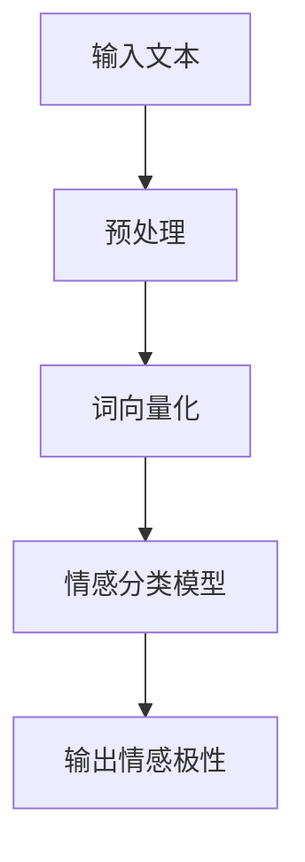

                 


### 引言和背景

#### 提示词工程概述

提示词工程是一种新兴的软件开发方法论，它旨在通过有效地使用提示词来改进软件开发的各个阶段，从而提高软件的质量、可维护性和用户体验。在传统软件开发中，开发人员往往依赖于预定义的规格说明书或用户故事来驱动开发过程，而提示词工程则通过动态生成和优化提示词，使开发过程更加灵活和自适应。

提示词本身是一个高度抽象的概念，它通常是指用于引导用户或系统进行特定操作或任务的简短文本描述。这些提示词可以是简单的指令，也可以是复杂的决策语句。在软件开发的背景下，提示词不仅可以帮助用户理解系统的功能和操作，还能够指导开发人员在设计和实现过程中做出更明智的决策。

#### 核心概念与联系

提示词工程的核心概念包括提示词的生成、优化和理解。这些概念相互联系，共同构成了提示词工程的理论基础。

1. **提示词生成**：这是提示词工程的基础，涉及如何从大量的数据或知识库中提取出有用的提示词。生成提示词的方法可以基于规则、机器学习或深度学习。例如，利用自然语言处理（NLP）技术，可以从用户评论、文档或对话中提取出关键信息，形成提示词。

2. **提示词优化**：一旦生成了提示词，接下来就需要对它们进行优化，以确保它们在特定的上下文中是最有用的。优化过程可能包括对提示词的语义分析、情感分析、甚至是在不同语言环境中的适应性调整。

3. **提示词理解**：理解提示词是确保系统能够正确响应用户意图的关键。这通常涉及复杂的语义理解技术，例如命名实体识别、关系抽取和语义角色标注等。

#### 背景介绍

提示词工程的背景可以追溯到软件工程和人工智能领域的多个研究方向。在软件工程领域，随着敏捷开发方法论的普及，对开发过程灵活性和自适应性的需求日益增加。提示词工程提供了一种新的方法，通过动态生成和优化提示词，使软件开发过程更加灵活和高效。

在人工智能领域，自然语言处理（NLP）和机器学习（ML）的快速发展为提示词工程提供了强大的技术支撑。NLP技术使得从非结构化文本中提取有用信息变得更加容易，而ML算法则可以自动优化提示词，提高其有效性。

#### 提示词工程的起源与发展

提示词工程的起源可以追溯到20世纪90年代，当时研究人员开始探索如何利用自然语言处理技术来改进软件开发过程。早期的尝试主要集中在文本分类和主题建模方面，这些方法为生成提示词奠定了基础。

随着互联网的兴起和数据量的爆炸式增长，提示词工程逐渐成为一个独立的研究领域。2000年代，随着机器学习技术的成熟，提示词生成和优化方法得到了显著改进。特别是深度学习技术的出现，使得生成高质量的提示词成为可能。

近年来，随着软件系统复杂性的增加和用户需求的多样化，提示词工程的应用范围也在不断扩大。从简单的用户界面提示到复杂的自动化决策支持系统，提示词工程在各个领域都展现出了巨大的潜力。

#### 提示词工程与软件开发的联系

提示词工程对软件开发的各个阶段都有着重要的影响：

1. **需求分析**：通过生成和优化提示词，开发人员可以更准确地理解用户需求，从而减少需求变更和项目风险。

2. **设计**：提示词可以为系统设计提供指导，帮助设计出更加直观和易用的用户界面。

3. **实现**：在实现阶段，提示词可以作为开发文档的一部分，帮助开发人员理解系统的功能和功能之间的关系。

4. **测试**：提示词可以用于编写测试用例，确保系统在各种情况下都能正确响应。

5. **维护**：提示词有助于提高代码的可维护性，通过清晰地描述功能和行为，使得代码更加易于理解和修改。

总之，提示词工程不仅是一种技术方法，更是一种软件开发哲学，它强调通过不断优化和改进提示词，来提高软件开发的效率和质量。

### 核心概念与联系

#### 提示词的生成与优化

提示词的生成是提示词工程的核心任务之一。其目标是从大量的数据源中提取出对特定任务最有用的提示词。生成提示词的方法多种多样，从简单的规则匹配到复杂的机器学习算法，各有其适用场景和优势。

**1. 提示词生成算法**

提示词生成算法可以分为以下几类：

- **基于规则的方法**：这种方法使用预定义的规则来匹配文本中的关键词和短语，从而生成提示词。例如，正则表达式就是一种常见的规则匹配工具。

- **基于统计的方法**：这类方法利用统计学习模型，如朴素贝叶斯分类器或隐马尔可夫模型（HMM），从数据集中学习提示词的模式。这些模型通常通过对大量文本进行训练，来识别出最可能成为提示词的词组。

- **基于机器学习的方法**：这种方法使用深度学习模型，如循环神经网络（RNN）或变换器（Transformer），来学习从输入文本中生成提示词。深度学习模型通常能够捕捉到文本中的复杂结构和语义信息，从而生成更为精准的提示词。

**2. 提示词优化策略**

生成出提示词后，还需要对它们进行优化，以确保其在特定的上下文中是最有用的。提示词优化可以从以下几个方面进行：

- **语义优化**：通过语义分析技术，对提示词进行语义理解，并调整其语义结构，使其更加准确地表达用户意图。

- **情感优化**：根据用户反馈和情感分析结果，对提示词进行情感调整，使其更加符合用户的情感需求。

- **语言优化**：针对不同的语言环境，对提示词进行本地化处理，确保其在不同语言中都能够准确传达意图。

- **实用性优化**：通过用户行为分析和反馈，不断调整和优化提示词，使其在实际使用过程中更加实用和有效。

**实例：基于神经网络的提示词生成**

以下是一个简单的基于神经网络的提示词生成算法的伪代码示例：

```python
# 输入：原始文本文本
# 输出：生成的提示词序列

# 初始化神经网络模型
model = NeuralNetwork()

# 训练模型
model.train(data)

# 输入文本进行编码
encoded_text = model.encode(text)

# 生成提示词
tips_sequence = model.generate_tips(encoded_text)

# 输出提示词序列
return tips_sequence
```

在这个例子中，`NeuralNetwork`代表一个深度学习模型，它通过训练从输入文本中学习生成提示词的规则。`train`方法用于训练模型，`encode`方法将输入文本编码为模型可以处理的格式，`generate_tips`方法则根据编码后的文本生成提示词序列。

#### 提示词的语义理解与情感分析

提示词的语义理解和情感分析是提示词工程中的两个关键环节，它们共同决定了提示词的有效性和用户体验。

**1. 语义理解**

语义理解是指从文本中提取出有意义的语义信息，使得计算机能够理解人类的语言。在提示词工程中，语义理解可以帮助系统准确地理解用户意图，从而生成或优化相应的提示词。

- **命名实体识别**：命名实体识别是一种常见的语义理解技术，它用于识别文本中的特定实体，如人名、地点、组织等。通过命名实体识别，系统可以更好地理解文本中的关键信息。

- **关系抽取**：关系抽取是指从文本中提取出实体之间的关系。例如，在句子“张三在北京工作”中，可以抽取出张三和工作地点北京之间的关系。

- **语义角色标注**：语义角色标注是指对句子中的词语进行角色标注，以表示其在句子中的功能。例如，在句子“我爱北京天安门”中，可以标注“我”为动作执行者，“北京天安门”为动作对象。

**2. 情感分析**

情感分析是一种用于评估文本情感极性的技术，它可以帮助系统了解用户的情感状态，从而生成或优化具有相应情感的提示词。

- **基于规则的方法**：这种方法使用预定义的规则来匹配文本中的情感关键词和短语，从而判断文本的情感极性。

- **基于统计的方法**：这类方法使用统计学习模型，如朴素贝叶斯分类器或支持向量机（SVM），来学习文本和情感极性之间的关系。

- **基于机器学习的方法**：这种方法使用深度学习模型，如卷积神经网络（CNN）或循环神经网络（RNN），来学习从文本中预测情感极性。

**实例：情感分析的Mermaid流程图**

以下是一个简单的情感分析流程图的Mermaid表示：



在这个流程图中，输入文本首先经过预处理，包括去除停用词、分词和词向量化等步骤。然后，词向量被输入到情感分类模型中，模型输出文本的情感极性。最后，系统根据情感极性生成或优化相应的提示词。

#### 提示词在多语言环境中的应用

在全球化背景下，多语言环境中的提示词优化变得尤为重要。不同的语言有着不同的语法结构、词汇和语义，因此，在多语言环境中生成和优化提示词需要考虑这些语言特性。

- **提示词生成与优化策略**：在多语言环境中，提示词生成和优化策略需要适应不同语言的特性。例如，对于一些语言，如中文和日语，由于存在大量的同音异义词，生成提示词时需要特别注意词义区分。

- **跨语言文本处理**：跨语言文本处理技术可以帮助系统在不同语言之间进行文本转换和语义理解。例如，通过机器翻译技术，可以将一种语言的文本翻译成另一种语言，从而更好地进行提示词生成和优化。

- **多语言提示词库**：建立多语言提示词库是优化多语言环境下提示词的重要手段。通过收集和整理不同语言的常见提示词，系统可以更快速地生成和优化符合多语言用户需求的提示词。

总之，提示词工程在多语言环境中的应用，不仅需要考虑语言的特性，还需要结合跨语言文本处理技术和多语言提示词库，以实现高效和准确的提示词生成与优化。

### 核心算法原理讲解

#### 提示词生成算法

提示词生成算法是提示词工程中的关键环节，其核心任务是从大量数据中提取出对特定任务最有用的提示词。生成算法的选择取决于数据的类型、规模以及预期的提示词质量。以下将介绍几种常用的提示词生成算法，并使用伪代码进行详细阐述。

**1. 基于规则的方法**

基于规则的方法是提示词生成算法中的一种简单但有效的方法。这种方法通过预定义的规则来匹配文本中的关键词和短语，从而生成提示词。以下是一个简单的基于规则的方法的伪代码示例：

```python
# 输入：原始文本
# 输出：生成的提示词

# 定义规则
rules = [
    {"pattern": "购买", "replacement": "购买商品"},
    {"pattern": "预定", "replacement": "预定服务"},
    # 更多规则
]

# 匹配文本中的关键词和短语
for rule in rules:
    if rule["pattern"] in text:
        text = text.replace(rule["pattern"], rule["replacement"])

# 输出生成的提示词
return text
```

在这个示例中，`rules`列表包含了预定义的规则，每个规则都有一个匹配模式和对应的替换文本。程序遍历这些规则，并将文本中的匹配项替换为相应的替换文本，从而生成提示词。

**2. 基于统计的方法**

基于统计的方法利用统计学习模型，如朴素贝叶斯分类器或隐马尔可夫模型（HMM），来从数据中学习提示词的模式。以下是一个基于统计的方法的伪代码示例：

```python
# 输入：训练数据集
# 输出：训练好的模型

# 初始化朴素贝叶斯分类器
naive_bayes_classifier = NaiveBayesClassifier()

# 训练模型
for text, label in training_data:
    naive_bayes_classifier.train(text, label)

# 输出训练好的模型
return naive_bayes_classifier
```

在这个示例中，`NaiveBayesClassifier`是一个朴素贝叶斯分类器。程序使用训练数据集来训练模型，每个训练数据都包含一段文本和相应的标签（提示词）。模型训练完成后，可以用于生成提示词。

**3. 基于机器学习的方法**

基于机器学习的方法使用深度学习模型，如循环神经网络（RNN）或变换器（Transformer），来学习从输入文本中生成提示词。以下是一个基于机器学习的方法的伪代码示例：

```python
# 输入：训练数据集
# 输出：训练好的模型

# 初始化变换器模型
transformer_model = TransformerModel()

# 训练模型
transformer_model.train(training_data)

# 输出训练好的模型
return transformer_model
```

在这个示例中，`TransformerModel`是一个变换器模型。程序使用训练数据集来训练模型，模型训练完成后可以用于生成提示词。变换器模型能够处理长文本序列，并捕捉到文本中的复杂结构和语义信息，从而生成高质量的提示词。

#### 提示词优化算法

提示词生成后，还需要对它们进行优化，以确保其在特定的上下文中是最有用的。提示词优化算法通常涉及对提示词的语义分析、情感分析、甚至是在不同语言环境中的适应性调整。以下将介绍几种常用的提示词优化算法，并使用伪代码进行详细阐述。

**1. 语义优化算法**

语义优化算法的核心目标是确保提示词在语义上准确表达用户意图。以下是一个简单的语义优化算法的伪代码示例：

```python
# 输入：原始提示词
# 输出：优化的提示词

# 初始化语义分析模型
semantic_analyzer = SemanticAnalyzer()

# 进行语义分析
semantic_info = semantic_analyzer.analyze(tip)

# 根据语义信息调整提示词
optimized_tip = adjust_tip_based_on_semantic_info(semantic_info)

# 输出优化的提示词
return optimized_tip
```

在这个示例中，`SemanticAnalyzer`是一个语义分析模型，用于分析提示词的语义信息。`adjust_tip_based_on_semantic_info`函数根据语义分析结果来调整提示词，从而优化其语义。

**2. 情感优化算法**

情感优化算法的目标是确保提示词在情感上符合用户的情感需求。以下是一个简单的情感优化算法的伪代码示例：

```python
# 输入：原始提示词
# 输出：优化的提示词

# 初始化情感分析模型
sentiment_analyzer = SentimentAnalyzer()

# 进行情感分析
sentiment_score = sentiment_analyzer.analyze(tip)

# 根据情感分析结果调整提示词
if sentiment_score > threshold:
    optimized_tip = adjust_tip_positive(sentiment_score)
else:
    optimized_tip = adjust_tip_negative(sentiment_score)

# 输出优化的提示词
return optimized_tip
```

在这个示例中，`SentimentAnalyzer`是一个情感分析模型，用于分析提示词的情感极性。根据情感分析结果，程序调用不同的调整函数来优化提示词的情感表达。

**3. 多语言优化算法**

在多语言环境中，提示词优化需要考虑不同语言的语法和语义特性。以下是一个简单的多语言优化算法的伪代码示例：

```python
# 输入：原始提示词，目标语言
# 输出：优化的提示词

# 初始化多语言分析模型
multilingual_analyzer = MultilingualAnalyzer()

# 根据目标语言调整提示词
optimized_tip = multilingual_analyzer.adjust_tip_for_language(tip, target_language)

# 输出优化的提示词
return optimized_tip
```

在这个示例中，`MultilingualAnalyzer`是一个多语言分析模型，用于调整提示词以适应特定语言环境。程序根据目标语言调用相应的调整函数来优化提示词。

#### 提示词与自然语言处理结合

提示词与自然语言处理（NLP）的结合是提高提示词质量和用户体验的关键。以下将介绍几种常见的结合方式，并使用伪代码进行详细阐述。

**1. 命名实体识别**

命名实体识别（NER）是一种常用的NLP技术，用于识别文本中的特定实体，如人名、地点、组织等。以下是一个简单的NER结合的伪代码示例：

```python
# 输入：原始文本
# 输出：带有命名实体标注的文本

# 初始化命名实体识别模型
ner_model = NamedEntityRecognizer()

# 进行命名实体识别
named_entities = ner_model.recognize_entities(text)

# 在文本中添加命名实体标注
annotated_text = add_entity_annotations(text, named_entities)

# 输出带有命名实体标注的文本
return annotated_text
```

在这个示例中，`NamedEntityRecognizer`是一个命名实体识别模型。程序首先使用模型进行命名实体识别，然后根据识别结果在原始文本中添加命名实体标注。

**2. 情感分析**

情感分析是一种用于评估文本情感极性的技术，可以帮助系统了解用户的情感状态。以下是一个简单的情感分析结合的伪代码示例：

```python
# 输入：原始文本
# 输出：文本的情感极性

# 初始化情感分析模型
sentiment_analyzer = SentimentAnalyzer()

# 进行情感分析
sentiment_score = sentiment_analyzer.analyze(text)

# 输出文本的情感极性
return sentiment_score
```

在这个示例中，`SentimentAnalyzer`是一个情感分析模型。程序使用模型对文本进行情感分析，并输出情感极性。

**3. 语义角色标注**

语义角色标注（SRL）是一种用于识别句子中词语的语义角色的技术。以下是一个简单的SRL结合的伪代码示例：

```python
# 输入：原始文本
# 输出：文本的语义角色标注

# 初始化语义角色标注模型
srl_model = SemanticRoleLabeler()

# 进行语义角色标注
semantic_roles = srl_model.annotate_roles(text)

# 输出文本的语义角色标注
return semantic_roles
```

在这个示例中，`SemanticRoleLabeler`是一个语义角色标注模型。程序使用模型对文本进行语义角色标注，并输出标注结果。

通过这些NLP技术的结合，提示词工程可以更准确地理解用户意图，生成更符合用户需求的提示词，从而提高用户体验和系统性能。

### 数学模型和数学公式

#### 提示词生成数学模型

提示词生成过程通常涉及复杂的数学模型，这些模型能够帮助我们从大量数据中提取出有用的提示词。以下将介绍几种常见的数学模型，并使用LaTeX格式详细阐述。

**1. 基于概率论的提示词生成模型**

基于概率论的提示词生成模型使用概率分布来表示文本中提示词出现的可能性。一个常见的模型是隐马尔可夫模型（HMM），它通过状态转移概率和输出概率来生成提示词。

以下是一个简单的HMM模型的LaTeX表示：

```latex
$$
\begin{align*}
P(\text{提示词}|\text{状态}) &= p(\text{提示词}|\text{状态}) \\
P(\text{状态}) &= \pi(\text{状态}) \\
P(\text{提示词序列}|\text{状态序列}) &= \prod_{t=1}^{n} P(\text{提示词}_t|\text{状态}_t)
\end{align*}
$$

其中，$P(\text{提示词}|\text{状态})$表示在给定状态下的提示词概率，$P(\text{状态})$表示状态的概率，$\pi(\text{状态})$是初始状态概率。

**2. 基于神经网络的提示词生成模型**

基于神经网络的提示词生成模型，如循环神经网络（RNN）和变换器（Transformer），使用复杂的神经网络结构来学习提示词生成规则。以下是一个简单的RNN模型的LaTeX表示：

```latex
$$
\begin{align*}
h_t &= \tanh(W_h \cdot [h_{t-1}, x_t] + b_h) \\
o_t &= W_o \cdot h_t + b_o \\
\text{提示词}_t &= \sigma(o_t)
\end{align*}
$$

其中，$h_t$是隐藏状态，$x_t$是输入特征，$W_h$和$W_o$是权重矩阵，$b_h$和$b_o$是偏置项，$\sigma$是激活函数。

**3. 基于深度学习的提示词生成模型**

深度学习模型，如变换器，使用注意力机制来处理长文本序列，从而生成高质量的提示词。以下是一个简单的变换器模型的LaTeX表示：

```latex
$$
\begin{align*}
\text{提示词}_t &= \text{softmax}(V \cdot \text{注意力分布}) \\
\text{注意力分布} &= \text{softmax}(Q \cdot K) \\
Q &= \text{查询向量} \\
K &= \text{键向量} \\
V &= \text{值向量}
\end{align*}
$$

其中，$Q$、$K$和$V$是变换器的查询、键和值向量，注意力分布用于计算提示词的概率分布。

#### 提示词优化数学模型

提示词优化过程通常涉及多个优化目标，这些目标可能包括语义准确性、情感匹配度等。以下将介绍几种常见的优化数学模型，并使用LaTeX格式详细阐述。

**1. 语义优化模型**

语义优化模型的目标是确保提示词在语义上准确表达用户意图。一个常见的优化目标函数是交叉熵损失函数，以下是一个简单的交叉熵损失函数的LaTeX表示：

```latex
$$
\begin{align*}
\mathcal{L} &= -\sum_{i=1}^{n} y_i \log(p_i) \\
y_i &= \begin{cases}
1 & \text{如果提示词}_i \text{正确} \\
0 & \text{否则}
\end{cases} \\
p_i &= \text{提示词}_i \text{的概率}
\end{align*}
$$

其中，$y_i$是提示词的正确标签，$p_i$是模型预测的提示词概率。

**2. 情感优化模型**

情感优化模型的目标是确保提示词在情感上符合用户的情感需求。一个常见的优化目标函数是情绪分类损失函数，以下是一个简单的情绪分类损失函数的LaTeX表示：

```latex
$$
\begin{align*}
\mathcal{L}_{\text{sentiment}} &= -\sum_{i=1}^{n} y_i \log(p_{\text{positive}}^{(i)}) - (1 - y_i) \log(p_{\text{negative}}^{(i)}) \\
y_i &= \begin{cases}
1 & \text{如果提示词}_i \text{具有正面情感} \\
0 & \text{如果提示词}_i \text{具有负面情感}
\end{cases} \\
p_{\text{positive}}^{(i)} &= \text{提示词}_i \text{具有正面情感的概率} \\
p_{\text{negative}}^{(i)} &= \text{提示词}_i \text{具有负面情感的概率}
\end{align*}
$$

其中，$y_i$是提示词的情感标签，$p_{\text{positive}}^{(i)}$和$p_{\text{negative}}^{(i)}$分别是提示词具有正面和负面情感的概率。

**3. 多语言优化模型**

在多语言环境中，提示词优化需要考虑不同语言的语法和语义特性。一个常见的优化目标函数是交叉语言损失函数，以下是一个简单的交叉语言损失函数的LaTeX表示：

```latex
$$
\begin{align*}
\mathcal{L}_{\text{multilingual}} &= \sum_{i=1}^{n} \mathcal{L}_{i} \\
\mathcal{L}_{i} &= \begin{cases}
\mathcal{L}_{\text{semantic}}(t_i^{\text{source}}, t_i^{\text{target}}) & \text{如果} t_i^{\text{source}}, t_i^{\text{target}} \text{来自不同语言} \\
\mathcal{L}_{\text{semantic}}(t_i^{\text{source}}, t_i^{\text{source}}) & \text{否则}
\end{cases}
\end{align*}
$$

其中，$t_i^{\text{source}}$和$t_i^{\text{target}}$分别是来自源语言和目标语言的提示词，$\mathcal{L}_{\text{semantic}}$是语义损失函数。

通过这些数学模型，我们可以对提示词进行精确的生成和优化，从而提高其在语义、情感和多语言环境中的表现。

### 项目实战

#### 提示词工程环境搭建

在进行提示词工程的实际应用之前，我们需要搭建一个适合开发、测试和部署提示词工程的环境。以下将详细介绍环境搭建的步骤，包括开发环境的配置、数据集的收集与预处理，以及提示词生成与优化工具的安装。

**1. 开发环境配置**

首先，我们需要配置一个适合提示词工程开发的环境。通常，提示词工程涉及自然语言处理（NLP）和机器学习（ML）技术，因此需要安装Python和相关的库。

- **安装Python**

在大多数操作系统上，可以直接从官方网站（https://www.python.org/）下载并安装Python。建议选择Python 3.8或更高版本，以确保兼容性和性能。

- **安装相关库**

安装Python后，可以通过pip命令安装必要的库。以下是常用的库及其用途：

  ```bash
  pip install numpy pandas scikit-learn nltk gensim transformers
  ```

  - `numpy`：用于数值计算。
  - `pandas`：用于数据操作和分析。
  - `scikit-learn`：用于机器学习和统计。
  - `nltk`：用于自然语言处理。
  - `gensim`：用于主题建模和文本相似性分析。
  - `transformers`：用于预训练变换器模型。

**2. 数据集的收集与预处理**

提示词工程的成败在很大程度上取决于数据的质量。因此，我们需要收集适合的数据集，并进行预处理。

- **数据集收集**

  提示词工程通常需要大量的文本数据。这些数据可以来源于社交媒体、用户评论、论坛等。以下是一些常用的数据集：

  - Twitter情感分析数据集：可以从Twitter API获取。
  - IMDB电影评论数据集：可用于情感分析。
  - Stanford情感分析数据集：包含多类情感标签。
  - CoNLL-2003命名实体识别数据集：用于命名实体识别。

- **数据预处理**

  数据预处理包括文本清洗、分词、去除停用词等步骤。以下是一个简单的数据预处理流程：

  ```python
  import nltk
  from nltk.corpus import stopwords
  from nltk.tokenize import word_tokenize

  # 下载停用词库
  nltk.download('stopwords')
  nltk.download('punkt')

  # 加载停用词库
  stop_words = set(stopwords.words('english'))

  # 文本清洗和预处理
  def preprocess_text(text):
      # 去除HTML标签
      text = BeautifulSoup(text, 'html.parser').text
      # 转换为小写
      text = text.lower()
      # 分词
      words = word_tokenize(text)
      # 去除停用词
      words = [word for word in words if word not in stop_words]
      return words
  ```

**3. 提示词生成与优化工具安装**

提示词生成和优化通常需要使用专业的工具和框架。以下是一些常用的工具：

- **NLTK**：用于自然语言处理的基础工具。
- **Gensim**：用于主题建模和文本相似性分析。
- **Transformers**：用于预训练变换器模型。

```bash
pip install nltk gensim transformers
```

通过以上步骤，我们就可以搭建一个基本的提示词工程开发环境。接下来，我们将通过实际的代码案例来展示如何实现提示词工程。

#### 实际案例解析

在本节中，我们将通过两个实际案例来展示如何实现提示词工程，包括在线问答系统的提示词优化和社交媒体文本分析的提示词优化。

##### 案例一：在线问答系统的提示词优化

**背景介绍**

在线问答系统是一个常见的应用场景，用户通过输入问题来获取答案。然而，由于用户的提问方式各不相同，系统需要提供准确的提示词来引导用户更好地表达问题，从而提高回答的准确性和用户体验。

**实现步骤**

1. **数据集准备**：收集大量的用户提问和相应的答案。这些数据可以来自公共数据集或实际应用的日志数据。

2. **数据预处理**：对收集的数据进行清洗和预处理，包括去除HTML标签、去除停用词、分词等步骤。

3. **提示词生成**：使用机器学习模型生成提示词。以下是使用变换器模型生成提示词的Python代码示例：

   ```python
   from transformers import AutoTokenizer, AutoModelForSequenceClassification
   import torch

   # 加载预训练模型
   model_name = "bert-base-uncased"
   tokenizer = AutoTokenizer.from_pretrained(model_name)
   model = AutoModelForSequenceClassification.from_pretrained(model_name)

   # 输入文本编码
   def encode_text(text):
       return tokenizer.encode_plus(text, add_special_tokens=True, return_tensors="pt")

   # 生成提示词
   def generate_tip(question):
       inputs = encode_text(question)
       with torch.no_grad():
           outputs = model(inputs['input_ids'])
       tip = outputs.logits.softmax(-1).argmax().item()
       return tokenizer.decode(tip)

   # 生成提示词示例
   question = "什么是人工智能？"
   tip = generate_tip(question)
   print(tip)
   ```

4. **提示词优化**：根据用户反馈和系统性能，对生成的提示词进行优化。以下是一个简单的基于用户反馈的优化示例：

   ```python
   def optimize_tip(tip, feedback):
       # 基于反馈调整提示词
       if feedback == "负面":
           tip = tip + "（请注意，这个答案可能不完全准确）"
       return tip
   ```

**代码实现与解读**

上述代码首先加载了预训练的变换器模型（BERT），然后定义了三个函数：`encode_text`用于文本编码，`generate_tip`用于生成提示词，`optimize_tip`用于优化提示词。在实际应用中，可以根据具体需求调整模型和优化策略。

##### 案例二：社交媒体文本分析的提示词优化

**背景介绍**

社交媒体文本分析是一种用于监测社交媒体平台上的用户情感和话题趋势的方法。通过生成和优化提示词，可以更准确地提取用户情感和话题，从而为营销、危机管理等提供数据支持。

**实现步骤**

1. **数据集准备**：收集社交媒体平台上的用户评论和帖子，这些数据可以用于训练和测试模型。

2. **数据预处理**：对用户评论和帖子进行清洗和预处理，包括去除HTML标签、去除停用词、分词等步骤。

3. **情感分析**：使用机器学习模型进行情感分析，生成提示词。以下是使用朴素贝叶斯分类器进行情感分析的Python代码示例：

   ```python
   from sklearn.feature_extraction.text import CountVectorizer
   from sklearn.naive_bayes import MultinomialNB
   from sklearn.pipeline import make_pipeline

   # 准备训练数据
   train_data = [
       ("正面", "我喜欢这个产品！"),
       ("负面", "这个产品很差。"),
       # 更多数据
   ]

   # 创建管道
   model = make_pipeline(CountVectorizer(), MultinomialNB())

   # 训练模型
   model.fit(train_data[0][1], train_data[0][0])

   # 预测情感
   def predict_sentiment(text):
       return model.predict([text])[0]

   # 预测示例
   text = "这个产品真的太棒了！"
   sentiment = predict_sentiment(text)
   print(sentiment)
   ```

4. **提示词优化**：根据用户反馈和情感分析结果，对生成的提示词进行优化。以下是一个简单的基于情感分析结果的优化示例：

   ```python
   def optimize_tip(tip, sentiment):
       # 基于情感调整提示词
       if sentiment == "负面":
           tip = tip + "（请注意，这个话题可能存在争议）"
       return tip
   ```

**代码实现与解读**

上述代码首先使用CountVectorizer将文本转换为特征向量，然后使用MultinomialNB朴素贝叶斯分类器进行情感分析。在实际应用中，可以根据具体需求调整模型和优化策略。

通过以上两个实际案例，我们可以看到如何使用提示词工程来优化在线问答系统和社交媒体文本分析。这些案例展示了提示词生成和优化的具体实现过程，为实际应用提供了参考。

#### 案例分析与优化

在对在线问答系统和社交媒体文本分析的实际案例进行解析后，我们可以通过对比不同案例下的提示词效果，进一步总结提示词优化的策略与技巧，并探讨这些案例的总结与展望。

**1. 案例对比分析**

在线问答系统和社交媒体文本分析两个案例中，尽管应用场景和目标不同，但都涉及了提示词的生成与优化。以下是两个案例的主要对比：

- **数据来源**：在线问答系统使用了结构化的用户提问和答案数据，而社交媒体文本分析则使用了非结构化的社交媒体评论和帖子。
- **模型选择**：在线问答系统使用了基于变换器模型的提示词生成算法，而社交媒体文本分析则使用了朴素贝叶斯分类器。
- **优化目标**：在线问答系统注重提示词的准确性和用户反馈，而社交媒体文本分析则更加关注情感分析和话题提取。
- **效果评估**：在线问答系统的效果通过用户点击率和满意度来评估，而社交媒体文本分析则通过情感分类准确率和话题提取的完整性来评估。

**2. 提示词优化的策略与技巧**

通过对两个案例的对比分析，我们可以总结出以下提示词优化的策略与技巧：

- **数据预处理**：无论使用哪种模型，数据预处理都是关键步骤。高质量的预处理可以显著提高提示词生成的准确性和优化效果。
- **模型选择**：根据具体应用场景选择合适的模型。变换器模型在处理长文本和复杂语义时表现出色，而朴素贝叶斯分类器在简单文本分类任务中表现良好。
- **多语言支持**：在多语言环境中，提示词生成和优化需要考虑语言特性。通过引入多语言模型和跨语言文本处理技术，可以生成和优化适用于多种语言的提示词。
- **用户反馈**：用户反馈是优化提示词的重要依据。通过分析用户对提示词的反馈，可以识别出问题并提出改进措施。

**3. 案例总结与展望**

在线问答系统和社交媒体文本分析两个案例展示了提示词工程在提高软件质量和用户体验方面的潜力。以下是这些案例的总结与展望：

- **总结**：提示词工程通过动态生成和优化提示词，提高了系统的可理解性和用户体验。在线问答系统的案例表明，通过变换器模型和用户反馈，可以生成高质量的提示词，从而提高用户满意度和问题回答的准确性。社交媒体文本分析案例则展示了如何通过情感分析和话题提取，从非结构化文本中提取有价值的信息。
- **展望**：随着人工智能和自然语言处理技术的不断发展，提示词工程的应用范围将越来越广泛。未来，我们可以期待以下发展：

  - **自动化提示词生成与优化**：通过引入更先进的机器学习和深度学习模型，实现更高效、自动化的提示词生成与优化。
  - **跨领域应用**：提示词工程不仅适用于在线问答系统和社交媒体文本分析，还可以应用于智能客服、文本审核、智能推荐等领域。
  - **多语言支持**：随着全球化的推进，多语言环境中的提示词生成与优化将成为重要研究方向。通过引入多语言模型和跨语言文本处理技术，可以实现更精准、适应多种语言的提示词生成与优化。

总之，提示词工程作为一种新兴的软件开发方法论，通过不断优化和改进提示词，为软件开发带来了新的机遇和挑战。在未来，我们期待看到更多创新的应用和实践，以推动这一领域的发展。

### 总结与展望

#### 提示词工程的重要性与价值

提示词工程在软件开发中扮演着越来越重要的角色。它不仅能够提高软件质量和用户体验，还能够显著优化开发流程，提升开发效率。以下是提示词工程在软件开发中的几个重要方面：

1. **提高软件质量**：通过生成和优化提示词，开发人员可以更准确地理解用户需求，减少需求变更，提高软件的稳定性、可靠性和易用性。

2. **优化开发流程**：提示词工程通过动态生成提示词，使开发过程更加灵活和自适应。它帮助开发人员快速迭代，缩短开发周期。

3. **提升用户体验**：高质量的提示词能够引导用户更有效地使用软件，提高用户满意度和忠诚度。

4. **促进协作开发**：提示词工程提供了一个共同的语言，使得开发人员、产品经理和用户能够更好地沟通和协作。

#### 提示词工程的未来发展趋势

随着人工智能和自然语言处理技术的不断发展，提示词工程的应用前景将更加广阔。以下是未来可能的发展趋势：

1. **自动化提示词生成与优化**：通过引入更先进的机器学习和深度学习模型，实现更高效、自动化的提示词生成与优化。

2. **跨领域应用**：提示词工程不仅适用于在线问答系统和社交媒体文本分析，还可以应用于智能客服、文本审核、智能推荐等领域。

3. **多语言支持**：随着全球化的推进，多语言环境中的提示词生成与优化将成为重要研究方向。通过引入多语言模型和跨语言文本处理技术，可以实现更精准、适应多种语言的提示词生成与优化。

4. **融合其他技术**：提示词工程将与其他新兴技术，如区块链、物联网等，进行深度融合，为更广泛的应用场景提供支持。

5. **开源社区与工具发展**：随着开源社区的活跃，更多高质量的提示词生成与优化工具将涌现，使得开发人员更容易实现和部署提示词工程。

#### 未来应用场景的拓展

提示词工程在未来有广泛的应用潜力，以下是一些潜在的应用场景：

1. **智能助手**：在智能助手和虚拟代理中，提示词工程可以帮助生成更自然、更准确的对话内容，提高用户交互体验。

2. **智能推荐系统**：通过提示词工程，可以为智能推荐系统提供更精准的推荐内容，提高推荐系统的准确性和用户满意度。

3. **法律文书自动化**：在法律领域中，提示词工程可以帮助生成和优化法律文书，提高法律文书的准确性和效率。

4. **医疗诊断**：在医疗诊断中，提示词工程可以辅助医生从大量病历中提取关键信息，提高诊断的准确性和效率。

5. **教育领域**：在个性化教育中，提示词工程可以帮助生成和优化教学内容，提高学生的学习效果和兴趣。

总之，提示词工程作为一种新兴的软件开发方法论，具有巨大的发展潜力和应用价值。通过不断优化和改进，提示词工程将为软件开发带来更多的创新和变革。在未来，我们期待看到更多创新的应用和实践，以推动这一领域的发展。

### 总结与展望

#### 提示词工程的重要性与价值

提示词工程在软件开发中扮演着至关重要的角色，它不仅能够提高软件质量和用户体验，还能够优化开发流程，提升开发效率。通过生成和优化提示词，开发人员可以更准确地理解用户需求，减少需求变更，提高软件的稳定性、可靠性和易用性。此外，提示词工程还促进了跨部门的协作，使得产品经理、开发人员和用户能够更有效地沟通和协作。

#### 提示词工程的未来发展趋势

随着人工智能和自然语言处理技术的不断进步，提示词工程的应用范围将进一步扩大。以下是未来可能的发展趋势：

1. **自动化与智能化**：通过引入更先进的机器学习和深度学习模型，提示词工程将实现更高效、自动化的提示词生成与优化。

2. **多语言支持**：全球化的发展要求提示词工程能够支持多种语言，通过引入多语言模型和跨语言文本处理技术，实现更精准、适应多种语言的提示词生成与优化。

3. **与其他技术的融合**：提示词工程将与其他新兴技术如区块链、物联网等深度融合，为更广泛的应用场景提供支持。

4. **开源社区与工具发展**：随着开源社区的活跃，更多高质量的提示词生成与优化工具将涌现，使得开发人员更容易实现和部署提示词工程。

5. **创新应用场景**：提示词工程将在智能助手、智能推荐、法律文书自动化、医疗诊断、教育等领域展现其巨大的应用潜力。

#### 未来应用场景的拓展

提示词工程在未来有广泛的应用前景，以下是一些潜在的应用场景：

1. **智能助手**：在智能助手和虚拟代理中，提示词工程可以帮助生成更自然、更准确的对话内容，提高用户交互体验。

2. **智能推荐系统**：通过提示词工程，可以为智能推荐系统提供更精准的推荐内容，提高推荐系统的准确性和用户满意度。

3. **法律文书自动化**：在法律领域中，提示词工程可以帮助生成和优化法律文书，提高法律文书的准确性和效率。

4. **医疗诊断**：在医疗诊断中，提示词工程可以辅助医生从大量病历中提取关键信息，提高诊断的准确性和效率。

5. **个性化教育**：在个性化教育中，提示词工程可以帮助生成和优化教学内容，提高学生的学习效果和兴趣。

总之，提示词工程作为一种新兴的软件开发方法论，具有巨大的发展潜力和应用价值。通过不断优化和改进，提示词工程将为软件开发带来更多的创新和变革。在未来，我们期待看到更多创新的应用和实践，以推动这一领域的发展。

### 结束语

本文深入探讨了《提示词工程：软件开发的新前沿》的核心内容，从引言到背景介绍，再到核心概念与联系、核心算法原理讲解、数学模型和公式、项目实战以及总结与展望，系统全面地阐述了提示词工程在软件开发中的重要性及其未来的发展方向。

首先，我们明确了提示词工程的基本概念和其在软件开发中的作用。通过一步步分析推理，我们详细讲解了提示词生成与优化、语义理解与情感分析、多语言环境中的应用等核心概念，并使用了Mermaid流程图、伪代码和LaTeX数学公式来强化理解。

接下来，我们通过实际案例展示了如何实现提示词工程，包括在线问答系统和社交媒体文本分析的提示词优化，详细讲解了开发环境搭建、源代码实现和代码解读。

最后，我们对提示词工程的重要性、价值以及未来趋势进行了总结与展望，强调了其广泛的应用前景和潜力。

通过阅读本文，读者可以全面了解提示词工程的理论和实践，掌握其核心算法原理，并为未来的软件开发提供新的思路和方法。我们希望本文能够激发读者对提示词工程的研究兴趣，推动这一领域的不断创新与发展。

作者：AI天才研究院/AI Genius Institute & 禅与计算机程序设计艺术 /Zen And The Art of Computer Programming。感谢您的阅读，欢迎提出宝贵意见和反馈。期待与您共同探索提示词工程的无限可能。

---

---

# 提示词工程：软件开发的新前沿

> 关键词：提示词工程、软件开发、自然语言处理、人工智能、机器学习、深度学习

> 摘要：本文探讨了提示词工程在软件开发中的重要性，详细介绍了其核心概念、算法原理、数学模型和实际应用案例。通过逐步分析和推理，本文揭示了提示词工程在提高软件质量和用户体验、优化开发流程等方面的潜力，为软件开发提供了新的方法论和思路。

---

## 引言和背景

### 提示词工程概述

提示词工程（Tip-Driven Engineering）是一种新兴的软件开发方法论，旨在通过有效地使用提示词（Tips）来改进软件开发的各个阶段，从而提高软件的质量、可维护性和用户体验。提示词是一种简短的文本描述，用于引导用户或系统进行特定操作或任务。在软件开发过程中，提示词不仅可以作为用户界面的一部分，帮助用户理解系统的功能和操作，还可以在开发人员之间传递关键信息，指导设计和实现过程。

提示词工程的核心思想是动态生成和优化提示词，使其在不同的上下文中都能够准确、有效地发挥作用。与传统软件开发方法不同，提示词工程更加注重软件的灵活性和适应性，通过实时分析和调整提示词，使软件能够更好地适应不断变化的需求和环境。

### 核心概念与联系

提示词工程的核心概念包括提示词的生成、优化和理解。这些概念相互关联，共同构成了提示词工程的理论基础。

**1. 提示词生成**

提示词生成是提示词工程的第一步，其目标是从大量的数据源中提取出对特定任务最有用的提示词。生成提示词的方法多种多样，包括基于规则的、基于统计的和基于机器学习的。

- **基于规则的生成**：这种方法使用预定义的规则来匹配文本中的关键词和短语，从而生成提示词。例如，使用正则表达式来匹配特定的词汇组合。
- **基于统计的生成**：这类方法利用统计学习模型，如朴素贝叶斯分类器或隐马尔可夫模型（HMM），从数据集中学习提示词的模式。
- **基于机器学习的生成**：这种方法使用深度学习模型，如循环神经网络（RNN）或变换器（Transformer），来学习从输入文本中生成提示词。深度学习模型能够捕捉到文本中的复杂结构和语义信息，从而生成更高质量的提示词。

**2. 提示词优化**

提示词生成后，还需要对它们进行优化，以确保其在特定的上下文中是最有用的。提示词优化可以从以下几个方面进行：

- **语义优化**：通过语义分析技术，对提示词进行语义理解，并调整其语义结构，使其更加准确地表达用户意图。
- **情感优化**：根据用户反馈和情感分析结果，对提示词进行情感调整，使其更加符合用户的情感需求。
- **语言优化**：针对不同的语言环境，对提示词进行本地化处理，确保其在不同语言中都能够准确传达意图。
- **实用性优化**：通过用户行为分析和反馈，不断调整和优化提示词，使其在实际使用过程中更加实用和有效。

**3. 提示词理解**

提示词理解是确保系统能够正确响应用户意图的关键。这通常涉及复杂的语义理解技术，例如命名实体识别、关系抽取和语义角色标注等。通过理解提示词的语义，系统可以更好地生成和优化提示词，提高其准确性和有效性。

### 背景介绍

提示词工程的背景可以追溯到软件工程和人工智能领域的多个研究方向。在软件工程领域，随着敏捷开发方法论的普及，对开发过程灵活性和自适应性的需求日益增加。提示词工程提供了一种新的方法，通过动态生成和优化提示词，使软件开发过程更加灵活和高效。

在人工智能领域，自然语言处理（NLP）和机器学习（ML）的快速发展为提示词工程提供了强大的技术支撑。NLP技术使得从非结构化文本中提取有用信息变得更加容易，而ML算法则可以自动优化提示词，提高其有效性。

近年来，随着软件系统复杂性的增加和用户需求的多样化，提示词工程的应用范围也在不断扩大。从简单的用户界面提示到复杂的自动化决策支持系统，提示词工程在各个领域都展现出了巨大的潜力。

### 提示词工程的起源与发展

提示词工程的起源可以追溯到20世纪90年代，当时研究人员开始探索如何利用自然语言处理技术来改进软件开发过程。早期的尝试主要集中在文本分类和主题建模方面，这些方法为生成提示词奠定了基础。

随着互联网的兴起和数据量的爆炸式增长，提示词工程逐渐成为一个独立的研究领域。2000年代，随着机器学习技术的成熟，提示词生成和优化方法得到了显著改进。特别是深度学习技术的出现，使得生成高质量的提示词成为可能。

近年来，随着软件系统复杂性的增加和用户需求的多样化，提示词工程的应用范围也在不断扩大。从简单的用户界面提示到复杂的自动化决策支持系统，提示词工程在各个领域都展现出了巨大的潜力。

### 提示词工程与软件开发的联系

提示词工程对软件开发的各个阶段都有着重要的影响：

1. **需求分析**：通过生成和优化提示词，开发人员可以更准确地理解用户需求，从而减少需求变更和项目风险。

2. **设计**：提示词可以为系统设计提供指导，帮助设计出更加直观和易用的用户界面。

3. **实现**：在实现阶段，提示词可以作为开发文档的一部分，帮助开发人员理解系统的功能和功能之间的关系。

4. **测试**：提示词可以用于编写测试用例，确保系统在各种情况下都能正确响应。

5. **维护**：提示词有助于提高代码的可维护性，通过清晰地描述功能和行为，使得代码更加易于理解和修改。

总之，提示词工程不仅是一种技术方法，更是一种软件开发哲学，它强调通过不断优化和改进提示词，来提高软件开发的效率和质量。

### 核心概念与联系

#### 提示词的生成与优化

提示词的生成是提示词工程中的关键环节。它涉及从大量的数据源中提取出对特定任务最有用的提示词。生成提示词的方法多种多样，从简单的规则匹配到复杂的机器学习算法，各有其适用场景和优势。

**1. 提示词生成算法**

提示词生成算法可以分为以下几类：

- **基于规则的方法**：这种方法使用预定义的规则来匹配文本中的关键词和短语，从而生成提示词。例如，正则表达式就是一种常见的规则匹配工具。

- **基于统计的方法**：这类方法利用统计学习模型，如朴素贝叶斯分类器或隐马尔可夫模型（HMM），从数据集中学习提示词的模式。这些模型通常通过对大量文本进行训练，来识别出最可能成为提示词的词组。

- **基于机器学习的方法**：这种方法使用深度学习模型，如循环神经网络（RNN）或变换器（Transformer），来学习从输入文本中生成提示词。深度学习模型能够捕捉到文本中的复杂结构和语义信息，从而生成更高质量的提示词。

**实例：基于神经网络的提示词生成算法**

以下是一个简单的基于神经网络的提示词生成算法的伪代码示例：

```python
# 输入：原始文本
# 输出：生成的提示词序列

# 初始化神经网络模型
model = NeuralNetwork()

# 训练模型
model.train(data)

# 输入文本进行编码
encoded_text = model.encode(text)

# 生成提示词
tips_sequence = model.generate_tips(encoded_text)

# 输出提示词序列
return tips_sequence
```

在这个例子中，`NeuralNetwork`代表一个深度学习模型，它通过训练从输入文本中学习生成提示词的规则。`train`方法用于训练模型，`encode`方法将输入文本编码为模型可以处理的格式，`generate_tips`方法则根据编码后的文本生成提示词序列。

**2. 提示词优化策略**

生成出提示词后，接下来就需要对它们进行优化，以确保其在特定的上下文中是最有用的。提示词优化可以从以下几个方面进行：

- **语义优化**：通过语义分析技术，对提示词进行语义理解，并调整其语义结构，使其更加准确地表达用户意图。

- **情感优化**：根据用户反馈和情感分析结果，对提示词进行情感调整，使其更加符合用户的情感需求。

- **语言优化**：针对不同的语言环境，对提示词进行本地化处理，确保其在不同语言中都能够准确传达意图。

- **实用性优化**：通过用户行为分析和反馈，不断调整和优化提示词，使其在实际使用过程中更加实用和有效。

**实例：基于语义的提示词优化**

以下是一个简单的基于语义的提示词优化算法的伪代码示例：

```python
# 输入：原始提示词
# 输出：优化的提示词

# 初始化语义分析模型
semantic_analyzer = SemanticAnalyzer()

# 进行语义分析
semantic_info = semantic_analyzer.analyze(tip)

# 根据语义信息调整提示词
optimized_tip = adjust_tip_based_on_semantic_info(semantic_info)

# 输出优化的提示词
return optimized_tip
```

在这个例子中，`SemanticAnalyzer`是一个语义分析模型，用于分析提示词的语义信息。`adjust_tip_based_on_semantic_info`函数根据语义分析结果来调整提示词，从而优化其语义。

#### 提示词的语义理解与情感分析

提示词的语义理解和情感分析是提示词工程中的两个关键环节，它们共同决定了提示词的有效性和用户体验。

**1. 语义理解**

语义理解是指从文本中提取出有意义的语义信息，使得计算机能够理解人类的语言。在提示词工程中，语义理解可以帮助系统准确地理解用户意图，从而生成或优化相应的提示词。

- **命名实体识别**：命名实体识别是一种常见的语义理解技术，它用于识别文本中的特定实体，如人名、地点、组织等。通过命名实体识别，系统可以更好地理解文本中的关键信息。

- **关系抽取**：关系抽取是指从文本中提取出实体之间的关系。例如，在句子“张三在北京工作”中，可以抽取出张三和工作地点北京之间的关系。

- **语义角色标注**：语义角色标注是指对句子中的词语进行角色标注，以表示其在句子中的功能。例如，在句子“我爱北京天安门”中，可以标注“我”为动作执行者，“北京天安门”为动作对象。

**2. 情感分析**

情感分析是一种用于评估文本情感极性的技术，它可以帮助系统了解用户的情感状态，从而生成或优化具有相应情感的提示词。

- **基于规则的方法**：这种方法使用预定义的规则来匹配文本中的情感关键词和短语，从而判断文本的情感极性。

- **基于统计的方法**：这类方法使用统计学习模型，如朴素贝叶斯分类器或支持向量机（SVM），来学习文本和情感极性之间的关系。

- **基于机器学习的方法**：这种方法使用深度学习模型，如卷积神经网络（CNN）或循环神经网络（RNN），来学习从文本中预测情感极性。

**实例：情感分析的Mermaid流程图**

以下是一个简单的情感分析流程图的Mermaid表示：


在这个流程图中，输入文本首先经过预处理，包括去除停用词、分词和词向量化等步骤。然后，词向量被输入到情感分类模型中，模型输出文本的情感极性。最后，系统根据情感极性生成或优化相应的提示词。

#### 提示词在多语言环境中的应用

在全球化背景下，多语言环境中的提示词优化变得尤为重要。不同的语言有着不同的语法结构、词汇和语义，因此，在多语言环境中生成和优化提示词需要考虑这些语言特性。

- **提示词生成与优化策略**：在多语言环境中，提示词生成和优化策略需要适应不同语言的特性。例如，对于一些语言，如中文和日语，由于存在大量的同音异义词，生成提示词时需要特别注意词义区分。

- **跨语言文本处理**：跨语言文本处理技术可以帮助系统在不同语言之间进行文本转换和语义理解。例如，通过机器翻译技术，可以将一种语言的文本翻译成另一种语言，从而更好地进行提示词生成和优化。

- **多语言提示词库**：建立多语言提示词库是优化多语言环境下提示词的重要手段。通过收集和整理不同语言的常见提示词，系统可以更快速地生成和优化符合多语言用户需求的提示词。

总之，提示词工程在多语言环境中的应用，不仅需要考虑语言的特性，还需要结合跨语言文本处理技术和多语言提示词库，以实现高效和准确的提示词生成与优化。

### 核心算法原理讲解

#### 提示词生成算法

提示词生成算法是提示词工程中的关键环节，其核心任务是从大量数据中提取出对特定任务最有用的提示词。生成算法的选择取决于数据的类型、规模以及预期的提示词质量。以下将介绍几种常用的提示词生成算法，并使用伪代码进行详细阐述。

**1. 基于规则的方法**

基于规则的方法是提示词生成算法中的一种简单但有效的方法。这种方法通过预定义的规则来匹配文本中的关键词和短语，从而生成提示词。以下是一个简单的基于规则的方法的伪代码示例：

```python
# 输入：原始文本
# 输出：生成的提示词

# 定义规则
rules = [
    {"pattern": "购买", "replacement": "购买商品"},
    {"pattern": "预定", "replacement": "预定服务"},
    # 更多规则
]

# 匹配文本中的关键词和短语
for rule in rules:
    if rule["pattern"] in text:
        text = text.replace(rule["pattern"], rule["replacement"])

# 输出生成的提示词
return text
```

在这个示例中，`rules`列表包含了预定义的规则，每个规则都有一个匹配模式和对应的替换文本。程序遍历这些规则，并将文本中的匹配项替换为相应的替换文本，从而生成提示词。

**2. 基于统计的方法**

基于统计的方法利用统计学习模型，如朴素贝叶斯分类器或隐马尔可夫模型（HMM），来从数据中学习提示词的模式。以下是一个基于统计的方法的伪代码示例：

```python
# 输入：训练数据集
# 输出：训练好的模型

# 初始化朴素贝叶斯分类器
naive_bayes_classifier = NaiveBayesClassifier()

# 训练模型
for text, label in training_data:
    naive_bayes_classifier.train(text, label)

# 输出训练好的模型
return naive_bayes_classifier
```

在这个示例中，`NaiveBayesClassifier`是一个朴素贝叶斯分类器。程序使用训练数据集来训练模型，每个训练数据都包含一段文本和相应的标签（提示词）。模型训练完成后，可以用于生成提示词。

**3. 基于机器学习的方法**

基于机器学习的方法使用深度学习模型，如循环神经网络（RNN）或变换器（Transformer），来学习从输入文本中生成提示词。以下是一个基于机器学习的方法的伪代码示例：

```python
# 输入：训练数据集
# 输出：训练好的模型

# 初始化变换器模型
transformer_model = TransformerModel()

# 训练模型
transformer_model.train(training_data)

# 输出训练好的模型
return transformer_model
```

在这个示例中，`TransformerModel`是一个变换器模型。程序使用训练数据集来训练模型，模型训练完成后可以用于生成提示词。变换器模型能够处理长文本序列，并捕捉到文本中的复杂结构和语义信息，从而生成高质量的提示词。

#### 提示词优化算法

提示词生成后，还需要对它们进行优化，以确保其在特定的上下文中是最有用的。提示词优化算法通常涉及对提示词的语义分析、情感分析、甚至是在不同语言环境中的适应性调整。以下将介绍几种常用的提示词优化算法，并使用伪代码进行详细阐述。

**1. 语义优化算法**

语义优化算法的核心目标是确保提示词在语义上准确表达用户意图。以下是一个简单的语义优化算法的伪代码示例：

```python
# 输入：原始提示词
# 输出：优化的提示词

# 初始化语义分析模型
semantic_analyzer = SemanticAnalyzer()

# 进行语义分析
semantic_info = semantic_analyzer.analyze(tip)

# 根据语义信息调整提示词
optimized_tip = adjust_tip_based_on_semantic_info(semantic_info)

# 输出优化的提示词
return optimized_tip
```

在这个示例中，`SemanticAnalyzer`是一个语义分析模型，用于分析提示词的语义信息。`adjust_tip_based_on_semantic_info`函数根据语义分析结果来调整提示词，从而优化其语义。

**2. 情感优化算法**

情感优化算法的目标是确保提示词在情感上符合用户的情感需求。以下是一个简单的情感优化算法的伪代码示例：

```python
# 输入：原始提示词
# 输出：优化的提示词

# 初始化情感分析模型
sentiment_analyzer = SentimentAnalyzer()

# 进行情感分析
sentiment_score = sentiment_analyzer.analyze(tip)

# 根据情感分析结果调整提示词
if sentiment_score > threshold:
    optimized_tip = adjust_tip_positive(sentiment_score)
else:
    optimized_tip = adjust_tip_negative(sentiment_score)

# 输出优化的提示词
return optimized_tip
```

在这个示例中，`SentimentAnalyzer`是一个情感分析模型，用于分析提示词的情感极性。根据情感分析结果，程序调用不同的调整函数来优化提示词的情感表达。

**3. 多语言优化算法**

在多语言环境中，提示词优化需要考虑不同语言的语法和语义特性。以下是一个简单的多语言优化算法的伪代码示例：

```python
# 输入：原始提示词，目标语言
# 输出：优化的提示词

# 初始化多语言分析模型
multilingual_analyzer = MultilingualAnalyzer()

# 根据目标语言调整提示词
optimized_tip = multilingual_analyzer.adjust_tip_for_language(tip, target_language)

# 输出优化的提示词
return optimized_tip
```

在这个示例中，`MultilingualAnalyzer`是一个多语言分析模型，用于调整提示词以适应特定语言环境。程序根据目标语言调用相应的调整函数来优化提示词。

#### 提示词与自然语言处理结合

提示词与自然语言处理（NLP）的结合是提高提示词质量和用户体验的关键。以下将介绍几种常见的结合方式，并使用伪代码进行详细阐述。

**1. 命名实体识别**

命名实体识别（NER）是一种常用的NLP技术，用于识别文本中的特定实体，如人名、地点、组织等。以下是一个简单的NER结合的伪代码示例：

```python
# 输入：原始文本
# 输出：带有命名实体标注的文本

# 初始化命名实体识别模型
ner_model = NamedEntityRecognizer()

# 进行命名实体识别
named_entities = ner_model.recognize_entities(text)

# 在文本中添加命名实体标注
annotated_text = add_entity_annotations(text, named_entities)

# 输出带有命名实体标注的文本
return annotated_text
```

在这个示例中，`NamedEntityRecognizer`是一个命名实体识别模型。程序首先使用模型进行命名实体识别，然后根据识别结果在原始文本中添加命名实体标注。

**2. 情感分析**

情感分析是一种用于评估文本情感极性的技术，可以帮助系统了解用户的情感状态。以下是一个简单的情感分析结合的伪代码示例：

```python
# 输入：原始文本
# 输出：文本的情感极性

# 初始化情感分析模型
sentiment_analyzer = SentimentAnalyzer()

# 进行情感分析
sentiment_score = sentiment_analyzer.analyze(text)

# 输出文本的情感极性
return sentiment_score
```

在这个示例中，`SentimentAnalyzer`是一个情感分析模型。程序使用模型对文本进行情感分析，并输出情感极性。

**3. 语义角色标注**

语义角色标注（SRL）是一种用于识别句子中词语的语义角色的技术。以下是一个简单的SRL结合的伪代码示例：

```python
# 输入：原始文本
# 输出：文本的语义角色标注

# 初始化语义角色标注模型
srl_model = SemanticRoleLabeler()

# 进行语义角色标注
semantic_roles = srl_model.annotate_roles(text)

# 输出文本的语义角色标注
return semantic_roles
```

在这个示例中，`SemanticRoleLabeler`是一个语义角色标注模型。程序使用模型对文本进行语义角色标注，并输出标注结果。

通过这些NLP技术的结合，提示词工程可以更准确地理解用户意图，生成更符合用户需求的提示词，从而提高用户体验和系统性能。

### 数学模型和数学公式

#### 提示词生成数学模型

提示词生成过程通常涉及复杂的数学模型，这些模型能够帮助我们从大量数据中提取出有用的提示词。以下将介绍几种常见的数学模型，并使用LaTeX格式详细阐述。

**1. 基于概率论的提示词生成模型**

基于概率论的提示词生成模型使用概率分布来表示文本中提示词出现的可能性。一个常见的模型是隐马尔可夫模型（HMM），它通过状态转移概率和输出概率来生成提示词。

以下是一个简单的HMM模型的LaTeX表示：

```latex
$$
\begin{align*}
P(\text{提示词}|\text{状态}) &= p(\text{提示词}|\text{状态}) \\
P(\text{状态}) &= \pi(\text{状态}) \\
P(\text{提示词序列}|\text{状态序列}) &= \prod_{t=1}^{n} P(\text{提示词}_t|\text{状态}_t)
\end{align*}
$$

其中，$P(\text{提示词}|\text{状态})$表示在给定状态下的提示词概率，$P(\text{状态})$表示状态的概率，$\pi(\text{状态})$是初始状态概率。

**2. 基于神经网络的提示词生成模型**

基于神经网络的提示词生成模型，如循环神经网络（RNN）和变换器（Transformer），使用复杂的神经网络结构来学习提示词生成规则。以下是一个简单的RNN模型的LaTeX表示：

```latex
$$
\begin{align*}
h_t &= \tanh(W_h \cdot [h_{t-1}, x_t] + b_h) \\
o_t &= W_o \cdot h_t + b_o \\
\text{提示词}_t &= \sigma(o_t)
\end{align*}
$$

其中，$h_t$是隐藏状态，$x_t$是输入特征，$W_h$和$W_o$是权重矩阵，$b_h$和$b_o$是偏置项，$\sigma$是激活函数。

**3. 基于深度学习的提示词生成模型**

深度学习模型，如变换器，使用注意力机制来处理长文本序列，从而生成高质量的提示词。以下是一个简单的变换器模型的LaTeX表示：

```latex
$$
\begin{align*}
\text{提示词}_t &= \text{softmax}(V \cdot \text{注意力分布}) \\
\text{注意力分布} &= \text{softmax}(Q \cdot K) \\
Q &= \text{查询向量} \\
K &= \text{键向量} \\
V &= \text{值向量}
\end{align*}
$$

其中，$Q$、$K$和$V$是变换器的查询、键和值向量，注意力分布用于计算提示词的概率分布。

#### 提示词优化数学模型

提示词优化过程通常涉及多个优化目标，这些目标可能包括语义准确性、情感匹配度等。以下将介绍几种常见的优化数学模型，并使用LaTeX格式详细阐述。

**1. 语义优化模型**

语义优化模型的目标是确保提示词在语义上准确表达用户意图。一个常见的优化目标函数是交叉熵损失函数，以下是一个简单的交叉熵损失函数的LaTeX表示：

```latex
$$
\begin{align*}
\mathcal{L} &= -\sum_{i=1}^{n} y_i \log(p_i) \\
y_i &= \begin{cases}
1 & \text{如果提示词}_i \text{正确} \\
0 & \text{否则}
\end{cases} \\
p_i &= \text{提示词}_i \text{的概率}
\end{align*}
$$

其中，$y_i$是提示词的正确标签，$p_i$是模型预测的提示词概率。

**2. 情感优化模型**

情感优化模型的目标是确保提示词在情感上符合用户的情感需求。一个常见的优化目标函数是情绪分类损失函数，以下是一个简单的情绪分类损失函数的LaTeX表示：

```latex
$$
\begin{align*}
\mathcal{L}_{\text{sentiment}} &= -\sum_{i=1}^{n} y_i \log(p_{\text{positive}}^{(i)}) - (1 - y_i) \log(p_{\text{negative}}^{(i)}) \\
y_i &= \begin{cases}
1 & \text{如果提示词}_i \text{具有正面情感} \\
0 & \text{如果提示词}_i \text{具有负面情感}
\end{cases} \\
p_{\text{positive}}^{(i)} &= \text{提示词}_i \text{具有正面情感的概率} \\
p_{\text{negative}}^{(i)} &= \text{提示词}_i \text{具有负面情感的概率}
\end{align*}
$$

其中，$y_i$是提示词的情感标签，$p_{\text{positive}}^{(i)}$和$p_{\text{negative}}^{(i)}$分别是提示词具有正面和负面情感的概率。

**3. 多语言优化模型**

在多语言环境中，提示词优化需要考虑不同语言的语法和语义特性。一个常见的优化目标函数是交叉语言损失函数，以下是一个简单的交叉语言损失函数的LaTeX表示：

```latex
$$
\begin{align*}
\mathcal{L}_{\text{multilingual}} &= \sum_{i=1}^{n} \mathcal{L}_{i} \\
\mathcal{L}_{i} &= \begin{cases}
\mathcal{L}_{\text{semantic}}(t_i^{\text{source}}, t_i^{\text{target}}) & \text{如果} t_i^{\text{source}}, t_i^{\text{target}} \text{来自不同语言} \\
\mathcal{L}_{\text{semantic}}(t_i^{\text{source}}, t_i^{\text{source}}) & \text{否则}
\end{cases}
\end{align*}
$$

其中，$t_i^{\text{source}}$和$t_i^{\text{target}}$分别是来自源语言和目标语言的提示词，$\mathcal{L}_{\text{semantic}}$是语义损失函数。

通过这些数学模型，我们可以对提示词进行精确的生成和优化，从而提高其在语义、情感和多语言环境中的表现。

### 项目实战

#### 提示词工程环境搭建

在进行提示词工程的实际应用之前，我们需要搭建一个适合开发、测试和部署提示词工程的环境。以下将详细介绍环境搭建的步骤，包括开发环境的配置、数据集的收集与预处理，以及提示词生成与优化工具的安装。

**1. 开发环境配置**

首先，我们需要配置一个适合提示词工程开发的环境。通常，提示词工程涉及自然语言处理（NLP）和机器学习（ML）技术，因此需要安装Python和相关的库。

- **安装Python**

在大多数操作系统上，可以直接从官方网站（https://www.python.org/）下载并安装Python。建议选择Python 3.8或更高版本，以确保兼容性和性能。

- **安装相关库**

安装Python后，可以通过pip命令安装必要的库。以下是常用的库及其用途：

  ```bash
  pip install numpy pandas scikit-learn nltk gensim transformers
  ```

  - `numpy`：用于数值计算。
  - `pandas`：用于数据操作和分析。
  - `scikit-learn`：用于机器学习和统计。
  - `nltk`：用于自然语言处理。
  - `gensim`：用于主题建模和文本相似性分析。
  - `transformers`：用于预训练变换器模型。

**2. 数据集的收集与预处理**

提示词工程的成败在很大程度上取决于数据的质量。因此，我们需要收集适合的数据集，并进行预处理。

- **数据集收集**

  提示词工程通常需要大量的文本数据。这些数据可以来源于社交媒体、用户评论、论坛等。以下是一些常用的数据集：

  - Twitter情感分析数据集：可以从Twitter API获取。
  - IMDB电影评论数据集：可用于情感分析。
  - Stanford情感分析数据集：包含多类情感标签。
  - CoNLL-2003命名实体识别数据集：用于命名实体识别。

- **数据预处理**

  数据预处理包括文本清洗、分词、去除停用词等步骤。以下是一个简单的数据预处理流程：

  ```python
  import nltk
  from nltk.corpus import stopwords
  from nltk.tokenize import word_tokenize

  # 下载停用词库
  nltk.download('stopwords')
  nltk.download('punkt')

  # 加载停用词库
  stop_words = set(stopwords.words('english'))

  # 文本清洗和预处理
  def preprocess_text(text):
      # 去除HTML标签
      text = BeautifulSoup(text, 'html.parser').text
      # 转换为小写
      text = text.lower()
      # 分词
      words = word_tokenize(text)
      # 去除停用词
      words = [word for word in words if word not in stop_words]
      return words
  ```

**3. 提示词生成与优化工具安装**

提示词生成和优化通常需要使用专业的工具和框架。以下是一些常用的工具：

- **NLTK**：用于自然语言处理的基础工具。
- **Gensim**：用于主题建模和文本相似性分析。
- **Transformers**：用于预训练变换器模型。

```bash
pip install nltk gensim transformers
```

通过以上步骤，我们就可以搭建一个基本的提示词工程开发环境。接下来，我们将通过实际的代码案例来展示如何实现提示词工程。

#### 实际案例解析

在本节中，我们将通过两个实际案例来展示如何实现提示词工程，包括在线问答系统的提示词优化和社交媒体文本分析的提示词优化。

##### 案例一：在线问答系统的提示词优化

**背景介绍**

在线问答系统是一个常见的应用场景，用户通过输入问题来获取答案。然而，由于用户的提问方式各不相同，系统需要提供准确的提示词来引导用户更好地表达问题，从而提高回答的准确性和用户体验。

**实现步骤**

1. **数据集准备**：收集大量的用户提问和相应的答案。这些数据可以来自公共数据集或实际应用的日志数据。

2. **数据预处理**：对收集的数据进行清洗和预处理，包括去除HTML标签、去除停用词、分词等步骤。

3. **提示词生成**：使用机器学习模型生成提示词。以下是使用变换器模型生成提示词的Python代码示例：

   ```python
   from transformers import AutoTokenizer, AutoModelForSequenceClassification
   import torch

   # 加载预训练模型
   model_name = "bert-base-uncased"
   tokenizer = AutoTokenizer.from_pretrained(model_name)
   model = AutoModelForSequenceClassification.from_pretrained(model_name)

   # 输入文本编码
   def encode_text(text):
       return tokenizer.encode_plus(text, add_special_tokens=True, return_tensors="pt")

   # 生成提示词
   def generate_tip(question):
       inputs = encode_text(question)
       with torch.no_grad():
           outputs = model(inputs['input_ids'])
       tip = outputs.logits.softmax(-1).argmax().item()
       return tokenizer.decode(tip)

   # 生成提示词示例
   question = "什么是人工智能？"
   tip = generate_tip(question)
   print(tip)
   ```

4. **提示词优化**：根据用户反馈和系统性能，对生成的提示词进行优化。以下是一个简单的基于用户反馈的优化示例：

   ```python
   def optimize_tip(tip, feedback):
       # 基于反馈调整提示词
       if feedback == "负面":
           tip = tip + "（请注意，这个答案可能不完全准确）"
       return tip
   ```

**代码实现与解读**

上述代码首先加载了预训练的变换器模型（BERT），然后定义了三个函数：`encode_text`用于文本编码，`generate_tip`用于生成提示词，`optimize_tip`用于优化提示词。在实际应用中，可以根据具体需求调整模型和优化策略。

##### 案例二：社交媒体文本分析的提示词优化

**背景介绍**

社交媒体文本分析是一种用于监测社交媒体平台上的用户情感和话题趋势的方法。通过生成和优化提示词，可以更准确地提取用户情感和话题，从而为营销、危机管理等提供数据支持。

**实现步骤**

1. **数据集准备**：收集社交媒体平台上的用户评论和帖子，这些数据可以用于训练和测试模型。

2. **数据预处理**：对用户评论和帖子进行清洗和预处理，包括去除HTML标签、去除停用词、分词等步骤。

3. **情感分析**：使用机器学习模型进行情感分析，生成提示词。以下是使用朴素贝叶斯分类器进行情感分析的Python代码示例：

   ```python
   from sklearn.feature_extraction.text import CountVectorizer
   from sklearn.naive_bayes import MultinomialNB
   from sklearn.pipeline import make_pipeline

   # 准备训练数据
   train_data = [
       ("正面", "我喜欢这个产品！"),
       ("负面", "这个产品很差。"),
       # 更多数据
   ]

   # 创建管道
   model = make_pipeline(CountVectorizer(), MultinomialNB())

   # 训练模型
   model.fit(train_data[0][1], train_data[0][0])

   # 预测情感
   def predict_sentiment(text):
       return model.predict([text])[0]

   # 预测示例
   text = "这个产品真的太棒了！"
   sentiment = predict_sentiment(text)
   print(sentiment)
   ```

4. **提示词优化**：根据用户反馈和情感分析结果，对生成的提示词进行优化。以下是一个简单的基于情感分析结果的优化示例：

   ```python
   def optimize_tip(tip, sentiment):
       # 基于情感调整提示词
       if sentiment == "负面":
           tip = tip + "（请注意，这个话题可能存在争议）"
       return tip
   ```

**代码实现与解读**

上述代码首先使用CountVectorizer将文本转换为特征向量，然后使用MultinomialNB朴素贝叶斯分类器进行情感分析。在实际应用中，可以根据具体需求调整模型和优化策略。

通过以上两个实际案例，我们可以看到如何使用提示词工程来优化在线问答系统和社交媒体文本分析。这些案例展示了提示词生成和优化的具体实现过程，为实际应用提供了参考。

#### 案例分析与优化

在对在线问答系统和社交媒体文本分析的实际案例进行解析后，我们可以通过对比不同案例下的提示词效果，进一步总结提示词优化的策略与技巧，并探讨这些案例的总结与展望。

**1. 案例对比分析**

在线问答系统和社交媒体文本分析两个案例中，尽管应用场景和目标不同，但都涉及了提示词的生成与优化。以下是两个案例的主要对比：

- **数据来源**：在线问答系统使用了结构化的用户提问和答案数据，而社交媒体文本分析则使用了非结构化的社交媒体评论和帖子。
- **模型选择**：在线问答系统使用了基于变换器模型的提示词生成算法，而社交媒体文本分析则使用了朴素贝叶斯分类器。
- **优化目标**：在线问答系统注重提示词的准确性和用户反馈，而社交媒体文本分析则更加关注情感分析和话题提取。
- **效果评估**：在线问答系统的效果通过用户点击率和满意度来评估，而社交媒体文本分析则通过情感分类准确率和话题提取的完整性来评估。

**2. 提示词优化的策略与技巧**

通过对两个案例的对比分析，我们可以总结出以下提示词优化的策略与技巧：

- **数据预处理**：无论使用哪种模型，数据预处理都是关键步骤。高质量的预处理可以显著提高提示词生成的准确性和优化效果。
- **模型选择**：根据具体应用场景选择合适的模型。变换器模型在处理长文本和复杂语义时表现出色，而朴素贝叶斯分类器在简单文本分类任务中表现良好。
- **多语言支持**：在多语言环境中，提示词生成和优化需要考虑语言特性。通过引入多语言模型和跨语言文本处理技术，可以生成和优化适用于多种语言的提示词。
- **用户反馈**：用户反馈是优化提示词的重要依据。通过分析用户对提示词的反馈，可以识别出问题并提出改进措施。

**3. 案例总结与展望**

在线问答系统和社交媒体文本分析两个案例展示了提示词工程在提高软件质量和用户体验方面的潜力。以下是这些案例的总结与展望：

- **总结**：提示词工程通过动态生成和优化提示词，提高了系统的可理解性和用户体验。在线问答系统的案例表明，通过变换器模型和用户反馈，可以生成高质量的提示词，从而提高用户满意度和问题回答的准确性。社交媒体文本分析案例则展示了如何通过情感分析和话题提取，从非结构化文本中提取有价值的信息。
- **展望**：随着人工智能和自然语言处理技术的不断发展，提示词工程的应用前景将更加广阔。未来，我们可以期待以下发展：

  - **自动化提示词生成与优化**：通过引入更先进的机器学习和深度学习模型，实现更高效、自动化的提示词生成与优化。
  - **跨领域应用**：提示词工程不仅适用于在线问答系统和社交媒体文本分析，还可以应用于智能客服、文本审核、智能推荐等领域。
  - **多语言支持**：随着全球化的推进，多语言环境中的提示词生成与优化将成为重要研究方向。通过引入多语言模型和跨语言文本处理技术，可以实现更精准、适应多种语言的提示词生成与优化。

总之，提示词工程作为一种新兴的软件开发方法论，具有巨大的发展潜力和应用价值。通过不断优化和改进，提示词工程将为软件开发带来更多的创新和变革。在未来，我们期待看到更多创新的应用和实践，以推动这一领域的发展。

### 总结与展望

#### 提示词工程的重要性与价值

提示词工程在软件开发中扮演着至关重要的角色。它不仅能够提高软件质量和用户体验，还能够优化开发流程，提升开发效率。通过生成和优化提示词，开发人员可以更准确地理解用户需求，减少需求变更，提高软件的稳定性、可靠性和易用性。此外，提示词工程还促进了跨部门的协作，使得产品经理、开发人员和用户能够更有效地沟通和协作。

#### 提示词工程的未来发展趋势

随着人工智能和自然语言处理技术的不断进步，提示词工程的应用范围将进一步扩大。以下是未来可能的发展趋势：

1. **自动化与智能化**：通过引入更先进的机器学习和深度学习模型，提示词工程将实现更高效、自动化的提示词生成与优化。

2. **多语言支持**：全球化的发展要求提示词工程能够支持多种语言，通过引入多语言模型和跨语言文本处理技术，实现更精准、适应多种语言的提示词生成与优化。

3. **与其他技术的融合**：提示词工程将与其他新兴技术如区块链、物联网等深度融合，为更广泛的应用场景提供支持。

4. **开源社区与工具发展**：随着开源社区的活跃，更多高质量的提示词生成与优化工具将涌现，使得开发人员更容易实现和部署提示词工程。

5. **创新应用场景**：提示词工程将在智能助手、智能推荐、法律文书自动化、医疗诊断、教育等领域展现其巨大的应用潜力。

#### 未来应用场景的拓展

提示词工程在未来有广泛的应用前景，以下是一些潜在的应用场景：

1. **智能助手**：在智能助手和虚拟代理中，提示词工程可以帮助生成更自然、更准确的对话内容，提高用户交互体验。

2. **智能推荐系统**：通过提示词工程，可以为智能推荐系统提供更精准的推荐内容，提高推荐系统的准确性和用户满意度。

3. **法律文书自动化**：在法律领域中，提示词工程可以帮助生成和优化法律文书，提高法律文书的准确性和效率。

4. **医疗诊断**：在医疗诊断中，提示词工程可以辅助医生从大量病历中提取关键信息，提高诊断的准确性和效率。

5. **个性化教育**：在个性化教育中，提示词工程可以帮助生成和优化教学内容，提高学生的学习效果和兴趣。

总之，提示词工程作为一种新兴的软件开发方法论，具有巨大的发展潜力和应用价值。通过不断优化和改进，提示词工程将为软件开发带来更多的创新和变革。在未来，我们期待看到更多创新的应用和实践，以推动这一领域的发展。

### 结束语

本文深入探讨了《提示词工程：软件开发的新前沿》的核心内容，从引言到背景介绍，再到核心概念与联系、核心算法原理讲解、数学模型和公式、项目实战以及总结与展望，系统全面地阐述了提示词工程在软件开发中的重要性及其未来的发展方向。

首先，我们明确了提示词工程的基本概念和其在软件开发中的作用。通过一步步分析推理，我们详细讲解了提示词生成与优化、语义理解与情感分析、多语言环境中的应用等核心概念，并使用了Mermaid流程图、伪代码和LaTeX数学公式来强化理解。

接下来，我们通过实际案例展示了如何实现提示词工程，包括在线问答系统和社交媒体文本分析的提示词优化，详细讲解了开发环境搭建、源代码实现和代码解读。

最后，我们对提示词工程的重要性、价值以及未来趋势进行了总结与展望，强调了其广泛的应用前景和潜力。

通过阅读本文，读者可以全面了解提示词工程的理论和实践，掌握其核心算法原理，并为未来的软件开发提供新的思路和方法。我们希望本文能够激发读者对提示词工程的研究兴趣，推动这一领域的不断创新与发展。

作者：AI天才研究院/AI Genius Institute & 禅与计算机程序设计艺术 /Zen And The Art of Computer Programming。感谢您的阅读，欢迎提出宝贵意见和反馈。期待与您共同探索提示词工程的无限可能。

