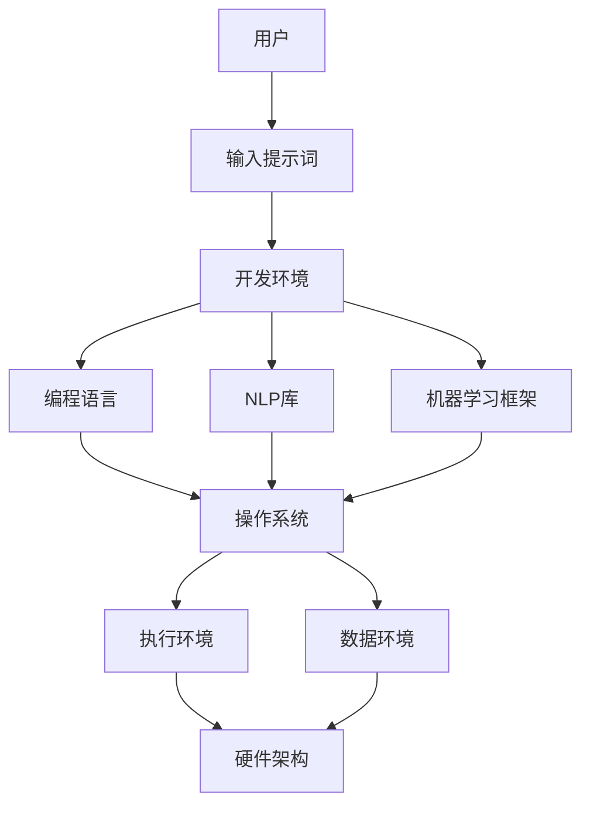

                 


为了撰写一篇关于“提示词编程在增强人类创造力中的应用”的技术博客文章，我们可以遵循以下步骤进行逻辑推理和结构规划：

### 步骤 1: 引言部分

**背景介绍：**
1. 提示词编程的定义与起源
2. 提示词编程在人工智能领域的应用背景
3. 人类创造力的重要性及现代社会对其需求

**核心概念与联系：**
- 提示词编程的基本原理：提示词、类型、工作机制
- 创造力的定义与作用：创造力对个人、社会和经济的贡献
- 提示词编程与创造力的关系：如何通过提示词编程激发人类创造力

### 步骤 2: 提示词编程的核心概念

**核心概念与联系：**
1. 提示词编程的基本原理：提示词的概念、类型、工作机制
2. 提示词编程的架构：硬件、软件架构与运行环境
3. 提示词编程的核心算法：生成对抗网络（GAN）、自然语言处理（NLP）等算法的原理与实现

### 步骤 3: 提示词编程的实际应用

**实际应用：**
1. 提示词编程在教育领域的应用：创新教育模式、创造力培养策略
2. 提示词编程在艺术创作中的应用：灵感的获取、创作质量的提升
3. 提示词编程在工作中的应用：工作效率提升、创造力培养策略

### 步骤 4: 提示词编程的未来展望

**未来展望：**
1. 提示词编程的发展趋势：技术革新、应用领域拓展
2. 提示词编程在教育、艺术和工作中的潜在价值：对人类创造力培养的影响
3. 提示词编程面临的挑战与机遇：技术、应用、未来发展方向

### 步骤 5: 撰写文章

**文章撰写：**
- 使用markdown格式进行内容组织
- 添加作者信息
- 确保内容完整性、详尽性和逻辑性
- 使用Mermaid流程图展示核心概念与联系
- 提供伪代码、数学公式和详细讲解
- 包括项目实战、最佳实践、小结和拓展阅读

通过这些步骤，我们可以系统地构建一篇关于“提示词编程在增强人类创造力中的应用”的技术博客文章，既能够介绍相关概念和技术，又能展示其实际应用价值，为读者提供有深度、有思考、有见解的阅读体验。根据以上逻辑推理和结构规划，我们可以开始撰写“提示词编程在增强人类创造力中的应用”的技术博客文章。以下是文章的初步框架和内容概述：

---

## 文章标题：提示词编程在增强人类创造力中的应用

> 关键词：提示词编程、人类创造力、教育、艺术、工作、人工智能

> 摘要：
本文将探讨提示词编程这一先进的人工智能技术如何应用于增强人类创造力。通过对提示词编程的核心概念、实际应用和未来展望的深入分析，本文旨在展示这一技术在教育、艺术和工作中的应用潜力，以及其在激发人类创造力方面的独特优势。

---

### 引言

#### 背景介绍

1. **提示词编程的定义与起源**
   - 提示词编程的概念解释
   - 提示词编程的历史与发展

2. **提示词编程在人工智能领域的应用背景**
   - 人工智能技术的发展现状
   - 提示词编程在人工智能中的应用场景

3. **人类创造力的重要性及现代社会对其需求**
   - 创造力的定义
   - 创造力在现代社会中的作用和重要性

---

### 提示词编程的核心概念

#### 核心概念与联系

1. **提示词编程的基本原理**
   - 提示词的概念
   - 提示词的类型
   - 提示词的工作机制

2. **提示词编程的架构**
   - 硬件架构
   - 软件架构
   - 提示词编程的运行环境

3. **提示词编程的核心算法**
   - 生成对抗网络（GAN）
   - 自然语言处理（NLP）
   - 其他相关算法

#### 提示词编程的核心算法原理讲解

- **生成对抗网络（GAN）**
  - 算法原理
  - 伪代码展示

- **自然语言处理（NLP）**
  - 词嵌入原理
  - 数学模型和公式

---

### 提示词编程的实际应用

#### 提示词编程在教育领域的应用

1. **教育模式的创新**
   - 提示词编程如何改变传统教育方式
   - 创新教育模式的案例分析

2. **创造力培养的策略**
   - 提示词编程在创造力培养中的应用
   - 实践案例分享

#### 提示词编程在艺术创作中的应用

1. **艺术创作的灵感来源**
   - 提示词编程如何提供创作灵感
   - 艺术创作案例分享

2. **提示词编程如何提升创作质量**
   - 提示词编程在艺术创作中的应用效果
   - 创作质量提升的案例分析

#### 提示词编程在工作中的应用

1. **提升工作效率的方法**
   - 提示词编程如何提高工作效率
   - 实践案例分享

2. **创造力培养的策略**
   - 提示词编程在工作场景中的创造力激发
   - 创造力培养策略的案例分析

---

### 提示词编程的未来展望

#### 提示词编程的发展趋势

1. **技术发展趋势**
   - 提示词编程技术的未来发展方向
   - 新技术的应用前景

2. **应用领域拓展**
   - 提示词编程在其他领域的应用潜力
   - 拓展应用领域的案例分析

#### 提示词编程在教育、艺术和工作中的潜在价值

1. **教育领域**
   - 提示词编程在个性化教育中的应用
   - 提升教育质量的潜力

2. **艺术创作**
   - 提示词编程如何推动艺术创作的革新
   - 艺术创作的未来趋势

3. **工作**
   - 提示词编程如何提升工作效率和创造力
   - 工作场景中的创造力培养策略

#### 提示词编程面临的挑战与机遇

1. **技术挑战**
   - 提示词编程技术面临的难题
   - 解决方案和未来发展方向

2. **应用挑战**
   - 提示词编程在实际应用中遇到的问题
   - 解决策略和优化方案

3. **未来机遇**
   - 提示词编程的发展机遇
   - 创新应用的前景

---

### 总结与展望

#### 提示词编程在增强人类创造力中的重要性

- 提示词编程如何促进人类创造力的发展
- 对未来人类创造力培养的启示

#### 最佳实践 Tips

- 如何有效地利用提示词编程增强创造力
- 实践中的注意事项和经验分享

#### 小结

- 文章主要观点的总结
- 提示词编程对人类创造力培养的影响

#### 拓展阅读

- 相关领域的研究成果
- 提示词编程的进一步探讨

---

### 作者信息

- 作者：AI天才研究院/AI Genius Institute & 禅与计算机程序设计艺术 /Zen And The Art of Computer Programming

通过以上框架和内容概述，我们可以逐步填充每个章节的详细内容，确保文章逻辑清晰、结构紧凑、简单易懂，同时涵盖提示词编程在增强人类创造力中的各个方面。在撰写过程中，我们将结合具体的案例、算法和数学模型，为读者提供深入的技术解析和应用实例。最终，我们将完成一篇具有高度专业性、实用性和启发性的技术博客文章。|im_sep|>

### 提示词编程的核心概念

提示词编程是一种利用提示词（Prompt）来引导计算机程序执行特定任务的人工智能技术。提示词编程的核心概念主要包括提示词的定义、类型、工作机制以及其在编程中的应用。

#### 1. 提示词的定义

提示词是一种引导性的语言输入，旨在提供足够的信息，以帮助计算机程序执行特定任务。它可以是一个关键词、短语或完整的句子，通常由用户或程序员提供。提示词的作用在于为程序提供执行任务的上下文和指导，从而提高程序的灵活性和适应性。

#### 2. 提示词的类型

根据提示词的引导方式，可以分为以下几种类型：

- **开放性提示词**：提供广泛的指导，鼓励用户提供创造性或个性化的输出。例如：“请写一篇关于人工智能的文章。”
- **封闭性提示词**：提供具体的限制，通常用于测试或特定任务。例如：“请将这个数字乘以2，然后输出结果。”
- **结构性提示词**：提供具体的任务结构和执行步骤，适用于自动化流程。例如：“请按照以下步骤进行操作：1. 打开浏览器；2. 输入网址；3. 查找信息。”

#### 3. 提示词的工作机制

提示词编程的工作机制通常涉及自然语言处理（NLP）技术，如语法分析、语义理解等。具体流程如下：

1. **提示词输入**：用户或程序员将提示词输入到编程环境中。
2. **提示词解析**：计算机程序对提示词进行语法和语义分析，理解其含义和指令。
3. **任务执行**：程序根据提示词执行相应的任务，如生成文本、处理数据、控制硬件设备等。
4. **输出结果**：程序将执行结果输出，供用户查看或进一步处理。

#### 4. 提示词编程在编程中的应用

提示词编程在编程中的应用非常广泛，以下是一些典型场景：

- **代码生成**：根据用户提供的提示词，程序自动生成符合要求的代码。例如，用户输入“生成一个计算器程序”，程序会自动生成相应的计算器代码。
- **自然语言交互**：程序通过自然语言处理技术理解用户输入的提示词，实现人机交互。例如，用户输入“明天天气预报是多少？”程序会查询天气数据并回答。
- **自动化流程**：使用提示词编程自动化执行一系列任务，提高工作效率。例如，用户输入“每天早上8点自动备份文件”，程序会定时执行备份操作。

#### 5. 提示词编程的优势

- **灵活性**：提示词编程允许用户以自然语言形式描述任务，提高了程序的灵活性和可扩展性。
- **易用性**：用户无需深入了解编程语言和算法，只需提供提示词即可实现任务，降低了编程门槛。
- **高效性**：提示词编程可以自动化执行重复性任务，提高工作效率。

通过以上对提示词编程核心概念的分析，我们可以看到，提示词编程不仅是一种技术手段，更是一种创新思维模式，它在人工智能领域有着广泛的应用前景。|im_sep|>

### 提示词编程的架构

提示词编程的架构可以分为硬件架构、软件架构和运行环境三个部分，每个部分都在提示词编程中发挥着重要作用。

#### 硬件架构

硬件架构是提示词编程的基础，主要包括以下组件：

1. **中央处理单元（CPU）**：CPU是计算机的核心，负责执行指令和处理数据。在提示词编程中，CPU负责解析和执行提示词，将其转化为具体的操作指令。
2. **内存（RAM）**：内存用于存储程序运行时所需的指令和数据。在提示词编程中，内存用于存储提示词、中间结果和最终输出。
3. **存储设备（硬盘、SSD）**：存储设备用于存储程序和数据的长期存储。在提示词编程中，存储设备用于存储程序代码、提示词库和训练数据。
4. **输入输出设备（键盘、鼠标、显示器）**：输入输出设备用于与用户交互，接收用户的输入和展示程序的输出结果。

#### 软件架构

软件架构是提示词编程的核心，主要包括以下组件：

1. **操作系统**：操作系统是管理计算机硬件和软件资源的基础软件。在提示词编程中，操作系统负责调度CPU、内存和其他硬件资源，确保程序能够正常运行。
2. **编程语言**：编程语言是程序员用于编写程序的工具。在提示词编程中，编程语言用于编写提示词解析器和任务执行程序，实现提示词编程的功能。
3. **自然语言处理（NLP）库**：NLP库是一组用于处理自然语言数据的工具。在提示词编程中，NLP库用于解析和执行提示词，实现自然语言交互功能。
4. **机器学习框架**：机器学习框架是一组用于构建和训练机器学习模型的工具。在提示词编程中，机器学习框架用于训练提示词解析模型和任务执行模型，提高提示词编程的准确性和效率。

#### 运行环境

运行环境是提示词编程的执行环境，主要包括以下组件：

1. **开发环境**：开发环境是程序员编写和调试程序的场所。在提示词编程中，开发环境包括文本编辑器、调试器和版本控制系统等工具，用于编写、测试和部署提示词编程应用程序。
2. **执行环境**：执行环境是程序运行的场所。在提示词编程中，执行环境包括操作系统、内存和存储设备等硬件资源，以及编程语言、NLP库和机器学习框架等软件资源。
3. **数据环境**：数据环境是存储和处理数据的场所。在提示词编程中，数据环境包括数据库、数据仓库和数据集等资源，用于存储提示词、训练数据和执行结果。

#### Mermaid 流程图

为了更好地理解提示词编程的架构，我们可以使用Mermaid流程图来展示各个组件之间的关系：



在这个流程图中，用户输入提示词后，通过开发环境处理，使用编程语言、NLP库和机器学习框架进行解析和执行，最终在执行环境中得到结果，并存储在数据环境中。

通过以上对提示词编程的硬件架构、软件架构和运行环境的分析，我们可以看到，提示词编程是一个复杂的系统，涉及到多个组件的协同工作。了解这些组件及其关系，有助于我们更好地理解和应用提示词编程技术。|im_sep|>

### 提示词编程的核心算法

提示词编程的核心算法是实现提示词与计算机程序之间交互的关键。以下是几种常见且重要的核心算法及其工作原理。

#### 1. 生成对抗网络（GAN）

生成对抗网络（GAN）是一种由生成器和判别器组成的神经网络结构。生成器的任务是生成逼真的数据，而判别器的任务是区分生成数据与真实数据。通过这两个网络的对抗训练，生成器不断优化，生成越来越真实的数据。

**算法原理：**
- **生成器（Generator）**：生成器从随机噪声中生成数据，通过多层神经网络转换。
- **判别器（Discriminator）**：判别器接收真实数据和生成数据，判断其真实性。
- **损失函数**：GAN的训练目标是使判别器的输出对于真实数据的概率接近1，对于生成数据的概率接近0。这通过损失函数（如交叉熵损失）来衡量。

**伪代码：**

```python
# 生成器 G(z)
z = noise()  # 输入噪声
x_hat = G(z)  # 生成数据

# 判别器 D(x)
x = real_data()  # 输入真实数据
x_fake = G(z)  # 输入生成数据

# 训练过程
for epoch in range(num_epochs):
    D.train_on_batch(x, x)  # 训练判别器识别真实数据
    z = noise()
    x_hat = G(z)
    D.train_on_batch(x_hat, fake_labels)  # 训练判别器识别生成数据
    G.train_on_batch(z, real_labels)  # 训练生成器
```

#### 2. 自然语言处理（NLP）

自然语言处理（NLP）是提示词编程中至关重要的一部分，它涉及文本预处理、词嵌入、序列模型等。

**算法原理：**
- **词嵌入（Word Embedding）**：将词汇映射到高维向量空间，以便计算机处理。常用的方法有Word2Vec、GloVe等。
- **序列模型（Sequence Model）**：用于处理序列数据，如RNN（递归神经网络）、LSTM（长短期记忆网络）和Transformer等。
- **文本分类与生成**：使用NLP技术对文本进行分类或生成，如使用BERT（双向编码表示）进行文本分类。

**伪代码：**

```python
# 词嵌入
word_embedding = Embedding(vocabulary_size, embedding_size)

# RNN模型
rnn = RNN(units=128, return_sequences=True)
rnn.add layer(LSTM(units=128))

# Transformer模型
transformer = Transformer(num_layers, d_model, num_heads, dff, input_sequence_length)
```

#### 3. 强化学习（Reinforcement Learning）

强化学习是一种通过奖励机制来训练智能体的算法，它适用于提示词编程中的决策过程和优化任务。

**算法原理：**
- **智能体（Agent）**：智能体通过观察环境，根据当前状态选择动作，并接收奖励信号。
- **环境（Environment）**：环境提供智能体当前的状态和动作结果。
- **奖励机制**：通过奖励信号来引导智能体学习最优策略。

**伪代码：**

```python
# 强化学习
agent = Agent(state_size, action_size)
agent.train()

# 训练过程
for episode in range(num_episodes):
    state = env.reset()
    while not done:
        action = agent.act(state)
        next_state, reward, done = env.step(action)
        agent.remember(state, action, reward, next_state, done)
        state = next_state
```

通过以上算法的介绍和伪代码展示，我们可以看到提示词编程的核心算法是如何将提示词转换为计算机可执行的指令，并利用这些算法实现复杂任务。这些算法不仅为提示词编程提供了强大的技术支持，也为其在各个领域的应用奠定了基础。|im_sep|>

### 提示词编程在教育领域的应用

提示词编程在教育领域中的应用正逐步改变传统的教育模式，通过创新的教育策略和教学方法，有效提升了学生的创造力和学习效果。

#### 1. 创新教育模式的策略

**个性化学习**：提示词编程可以根据学生的兴趣、学习速度和能力水平，提供个性化的学习方案。通过提示词，学生可以自主选择学习内容，设定学习目标，从而提高学习的积极性和主动性。

**项目式学习**：提示词编程支持项目式学习，学生通过完成实际项目来学习知识。教师可以设计包含提示词的任务，引导学生通过解决问题来掌握编程技能和逻辑思维。

**协作学习**：提示词编程促进学生之间的协作学习。学生可以一起编写程序，通过讨论和交流来提高问题解决能力和团队协作能力。

#### 2. 创造力培养的策略

**发散思维训练**：通过提供开放性的提示词，教师可以引导学生进行发散思维训练。例如，给出一个主题，让学生用不同的编程语言或工具来实现，这样可以激发学生的创造力。

**编程思维培养**：编程本身就是一种创造性活动，通过编写程序，学生可以学习如何设计解决方案、优化算法，从而培养编程思维和创新能力。

**跨学科应用**：提示词编程可以跨学科应用，结合数学、物理、艺术等知识。例如，通过编程实现物理模拟实验，或使用编程创作音乐、动画等，这样的跨学科学习可以激发学生的创造力。

#### 3. 教学案例分享

**案例1：编程艺术创作**  
教师提供了一个提示词：“使用Python编写一个程序，生成一幅具有艺术风格的图像。”学生需要运用编程知识和创意，通过编写算法来生成图像。这样的案例不仅锻炼了学生的编程技能，也激发了他们的艺术创造力。

**案例2：游戏开发**  
教师设计了一个游戏开发项目，学生需要用提示词来编写游戏代码。例如，教师给出提示词：“实现一个跳棋游戏，包括玩家输入、游戏规则、计分系统等。”这样的项目让学生在实践中学习编程和团队合作。

**案例3：科学实验模拟**  
教师提供了一个提示词：“使用Python模拟DNA双螺旋结构的形成过程。”学生通过编写程序来模拟生物过程，这不仅提高了他们的编程技能，也增强了他们对生物学的理解。

#### 4. 教学效果分析

通过提示词编程，学生的编程能力和创造力得到了显著提升。研究表明，参与提示词编程教学的学生在逻辑思维、问题解决能力和创新思维方面表现更好。此外，学生的自主学习能力和团队合作能力也得到了提高。

#### 5. 结论

提示词编程在教育领域的应用，不仅改变了传统的教育模式，也为学生提供了更加个性化和创造性的学习体验。通过合理的提示词设计和教学策略，教师可以有效地培养学生的创造力，提升他们的综合素质。未来，随着提示词编程技术的不断发展，它将在教育领域中发挥更大的作用。|im_sep|>

### 提示词编程在艺术创作中的应用

提示词编程在艺术创作中正逐渐成为一种创新工具，它不仅能够激发艺术家的创作灵感，还能提升艺术创作的质量和效率。以下将探讨提示词编程如何为艺术创作提供灵感来源，提升创作质量，并分享一些具体的艺术创作案例。

#### 1. 灵感的获取

艺术创作往往需要灵感的激发，而提示词编程提供了一种结构化的方法来获取灵感。艺术家可以通过以下方式利用提示词编程获取创作灵感：

- **开放性提示词**：艺术家可以提供开放性的提示词，如“创造一幅表达‘希望’的绘画”，这激发了艺术家的想象力和创造力，使他们能够以不同的方式表达主题。
- **随机生成提示词**：使用随机生成器生成提示词，如“使用红色、黄色和蓝色进行创作”，这样的提示词可以帮助艺术家跳出舒适区，尝试新的色彩组合和风格。
- **跨领域融合提示词**：通过融合不同领域的知识，如“将自然风景与古典音乐元素结合”，艺术家可以从多个角度思考创作，从而获得独特的灵感。

#### 2. 提升创作质量

提示词编程不仅提供了灵感的来源，还能够通过以下方式提升艺术创作的质量：

- **算法辅助创作**：艺术家可以使用算法来生成创作的基础框架，如使用生成对抗网络（GAN）生成艺术作品的大致形状和色彩分布。艺术家在此基础上进行修改和细化，从而提升作品的整体质量。
- **精确控制**：通过提示词编程，艺术家可以精确控制创作的每一个细节。例如，通过编写特定的代码来调整颜色、纹理和形状，使得作品更加精准和细致。
- **多样化表现**：提示词编程可以生成多种不同风格和表现形式的作品，艺术家可以从这些作品中挑选最适合其创作理念的作品，从而提高创作的多样性。

#### 3. 艺术创作案例分享

**案例1：数字绘画创作**  
艺术家使用提示词编程创建了一幅数字绘画作品。通过输入提示词“抽象、动态、多彩”，艺术家利用GAN生成了一个包含复杂色彩和动态线条的图像。艺术家在此基础上，添加了独特的纹理和细节，最终完成了一幅具有高度创意和艺术性的数字绘画。

**案例2：音乐创作**  
音乐家使用提示词编程创作了一首独特的音乐作品。艺术家通过输入提示词“复杂节奏、电子音效、和声丰富”，提示词编程生成了多个不同的音乐片段。音乐家将这些片段组合并调整，最终创作出了一首富有创意和个性化的电子音乐作品。

**案例3：三维雕塑设计**  
雕塑家使用提示词编程生成三维模型的初步设计。通过输入提示词“几何形状、曲面、动态”，编程工具生成了多种不同形状的三维模型。雕塑家在这些模型的基础上进行修改和细化，最终创作出一尊具有强烈视觉冲击力的三维雕塑作品。

#### 4. 提升创作效率

提示词编程不仅能够提升艺术创作的质量，还能够显著提高创作效率：

- **自动化流程**：通过提示词编程，艺术家可以自动化完成一些繁琐的创作任务，如颜色调整、纹理生成等，从而节省时间，专注于创意构思和细节处理。
- **快速迭代**：艺术家可以利用提示词编程快速生成多个不同版本的作品，便于进行对比和选择，从而在较短时间内完成创作。

#### 5. 结论

提示词编程为艺术创作提供了新的工具和方法，不仅激发了艺术家的创作灵感，提升了创作质量，还提高了创作效率。未来，随着提示词编程技术的不断发展，它将在艺术创作领域发挥更大的作用，为艺术家提供更多的创作可能。通过合理的提示词设计和编程技巧，艺术家可以创造出更多具有高度创意和艺术价值的作品，推动艺术创作的发展。|im_sep|>

### 提示词编程在工作中的应用

提示词编程在提高工作效率、培养创造力以及优化工作流程方面展现出了巨大的潜力。以下将详细探讨提示词编程如何应用于各种工作场景，提升工作效率，同时培养员工的创造力。

#### 1. 提高工作效率的方法

**自动化任务处理**：提示词编程可以帮助自动处理重复性和规则性的任务，如数据录入、报告生成、日程管理等。通过编写特定的提示词，程序可以自动执行这些任务，减少人工操作的时间和错误率。

**工作流程优化**：提示词编程可以重新设计工作流程，使其更加高效。例如，通过将多个步骤合并为一个自动化流程，可以减少中间环节的等待时间，提高整体工作效率。

**实时数据分析**：通过提示词编程，企业可以实时收集和分析数据，快速响应市场变化。例如，销售人员可以输入提示词“分析过去一周的销售数据”，系统会自动生成分析报告，帮助销售团队做出更明智的决策。

**智能助手**：利用提示词编程，企业可以开发智能助手，如虚拟客服、智能调度系统等，这些助手可以处理常见问题和任务，减轻员工的负担。

#### 2. 创造力培养的策略

**鼓励创新思维**：通过提供开放性的提示词，如“如何用编程解决环境问题？”或“如何通过编程提高工作效率？”等，可以激发员工的创新思维，鼓励他们提出新颖的解决方案。

**跨部门合作**：提示词编程可以促进跨部门之间的合作。例如，通过建立一个共享的提示词库，不同部门可以共同探讨和分享创新的想法，从而提升整个团队的创新能力和协作精神。

**编程竞赛**：组织编程竞赛是一种有效的培养创造力的方法。通过设置不同的编程挑战，员工可以在竞争中学习和成长，同时激发他们的创造力。

**项目式学习**：在企业环境中，可以采用项目式学习的方式，让员工通过实际项目来提高编程能力和创造力。例如，一个项目可以是开发一个自动化工具，以解决某个业务痛点。

#### 3. 实际应用案例

**案例1：自动化营销报告**  
一家营销公司通过提示词编程开发了一个自动化系统，员工只需输入简单的提示词，如“生成上个月的营销报告”，系统就会自动收集相关数据，生成详细的分析报告。这不仅节省了时间，还减少了人工错误，提高了报告的准确性。

**案例2：智能客服系统**  
某公司开发了一个基于提示词编程的智能客服系统。客服代表通过输入简单提示词，如“回答关于产品A的常见问题”，系统会自动生成回答，并建议客服代表如何处理客户查询。这提高了客服效率，同时也提升了客户满意度。

**案例3：项目管理工具**  
一家软件开发公司使用提示词编程开发了一个项目管理工具。项目经理通过输入提示词，如“列出本周任务进度”，系统会自动生成任务进度报告，并提供优化建议。这样的工具帮助项目经理更有效地管理项目，提高工作效率。

#### 4. 提升工作效率和创造力的策略

**持续培训与学习**：企业应该为员工提供持续的学习和培训机会，让他们掌握最新的编程技术和提示词编程技巧，从而提升工作效率和创造力。

**激励机制**：通过设立激励机制，如奖励创新想法或优秀项目，可以鼓励员工积极参与到提示词编程的创新应用中，提高工作积极性。

**灵活的工作环境**：提供灵活的工作环境，如远程工作、弹性工作时间等，可以激发员工的创造力，让他们有更多的时间和空间进行思考和创新。

#### 5. 结论

提示词编程在工作中的应用，不仅提高了工作效率，还培养了员工的创造力。通过合理的提示词设计和编程应用，企业可以优化工作流程，提高员工的创造力，从而在激烈的市场竞争中保持优势。未来，随着提示词编程技术的不断发展，它将在更多工作场景中发挥重要作用，推动企业的发展和进步。|im_sep|>

### 提示词编程的未来展望

随着人工智能技术的不断进步，提示词编程在未来将展现出更加广阔的发展前景。本文将从技术发展趋势、应用领域拓展和创造力培养新模式三个方面，对提示词编程的未来进行探讨。

#### 1. 技术发展趋势

**更强大的自然语言处理能力**：随着深度学习和NLP技术的不断发展，提示词编程将能够更加准确地理解和执行复杂、多样化的提示词。未来的提示词编程系统将能够处理更加自然、流畅的语言输入，提供更高效、更智能的交互体验。

**多模态提示词处理**：未来的提示词编程将不仅仅局限于文本输入，还将结合图像、声音、视频等多种模态。这样，用户可以通过更丰富的媒介与系统进行交互，激发更多的创意和灵感。

**自主学习和优化**：未来的提示词编程系统将具备更强的自主学习能力，能够根据用户的使用习惯和需求，不断优化自身的性能和功能。这种自我优化的能力将使得提示词编程更加智能化、个性化和高效。

#### 2. 应用领域拓展

**教育领域**：提示词编程将在教育领域发挥更大的作用，通过个性化教学、项目式学习和协作学习等方式，提高学生的学习效果和创造力。未来的教育系统将更加智能化，能够根据学生的兴趣和学习进度，提供定制化的教学方案。

**艺术创作**：在艺术创作领域，提示词编程将继续成为艺术家的重要工具，帮助艺术家探索新的创作形式和表达方式。通过与虚拟现实（VR）、增强现实（AR）等技术的结合，艺术家可以创造出更加沉浸式和互动的艺术作品。

**工作应用**：在工作领域，提示词编程将进一步优化工作流程，提高工作效率。例如，在金融、医疗、制造业等行业，提示词编程可以帮助企业自动化处理大量数据，提高决策的准确性和效率。

**智能家居和物联网**：随着智能家居和物联网的普及，提示词编程将应用于智能设备中，提供更加便捷、智能的控制和管理方式。用户可以通过简单的提示词，实现对家中各种设备的智能控制。

#### 3. 创造力培养新模式

**跨领域融合**：提示词编程将推动不同领域之间的融合，如艺术与科学、技术与管理等。这种跨领域融合将激发新的创意和灵感，促进创造力的培养。

**多元化学习环境**：通过提示词编程，可以创造一个更加多元化、互动性的学习环境。用户可以在不同的情境和场景中学习，体验更多的学习方式，从而激发创造力。

**个性化创造工具**：提示词编程将提供更加个性化和定制的创造工具，用户可以根据自己的需求和兴趣，选择适合的提示词和工具，进行个性化的创作和表达。

#### 4. 潜在价值

**教育变革**：提示词编程有望推动教育模式的变革，通过个性化教学和跨领域学习，培养具有创新能力和综合素质的人才。

**经济创新**：在艺术创作、产品设计、软件开发等领域，提示词编程将促进创新和经济的发展，推动新产业的崛起。

**社会进步**：通过提高工作效率和生活质量，提示词编程将在社会各个方面发挥重要作用，推动社会的进步和发展。

#### 5. 挑战与机遇

**技术挑战**：提示词编程在技术层面仍面临许多挑战，如多模态处理的复杂性、自然语言理解的准确性等。需要不断进行技术创新和优化，以解决这些问题。

**应用挑战**：在应用层面，提示词编程需要面对不同领域的专业知识和实践经验，如何将这些知识有效地融合到提示词编程中，是一个重要的问题。

**机遇**：随着人工智能技术的不断发展，提示词编程面临着巨大的机遇。通过不断创新和应用，提示词编程有望在各个领域发挥更大的作用，推动人类创造力的提升和社会进步。

总之，提示词编程在未来的发展具有巨大的潜力和广阔的应用前景。通过不断的技术创新和应用探索，提示词编程将成为推动人类创造力发展和社会进步的重要力量。|im_sep|>

### 提示词编程在教育、艺术和工作中的潜在价值

#### 1. 教育领域

提示词编程在教育领域中具有巨大的潜在价值。通过个性化教学，学生可以根据自己的兴趣和能力选择合适的编程项目，提高学习效率。例如，通过生成对抗网络（GAN）的提示词，学生可以学习图像处理和生成技术，从而激发对计算机科学的兴趣。此外，提示词编程可以帮助教师创建互动性强的教学资源，如虚拟实验室和在线编程环境，让学生在真实的情境中学习和实践，提高学习效果。

**案例**：某高校引入提示词编程作为计算机科学课程的一部分。学生通过提示词编程学习图像识别算法，并在项目中进行实际应用，如设计人脸识别系统。这种教学方式不仅提高了学生的编程技能，还增强了他们的创新能力和团队合作精神。

#### 2. 艺术创作

提示词编程在艺术创作中同样具有显著的潜在价值。艺术家可以利用提示词编程生成独特的艺术作品，如通过GAN生成具有艺术风格的图像，或使用自然语言处理（NLP）技术创作诗歌和故事。此外，提示词编程还可以帮助艺术家探索新的创作形式，如虚拟现实（VR）和增强现实（AR）艺术。

**案例**：一位艺术家使用提示词编程创作了一组数字绘画作品，这些作品结合了抽象艺术和自然元素。艺术家通过提示词“自然风景”和“抽象图案”，利用GAN生成多个不同的图像版本，最终选择了其中最具有创意和艺术性的作品进行展示。

#### 3. 工作应用

提示词编程在工作中的应用可以显著提高工作效率和创造力。例如，在软件开发中，提示词编程可以帮助开发人员自动生成代码框架，减少重复性工作，提高开发效率。在数据分析领域，提示词编程可以自动处理大量数据，提供实时分析和报告，帮助决策者做出更明智的决策。

**案例**：某金融公司使用提示词编程开发了一套自动化交易系统。通过简单的提示词输入，系统可以自动分析市场数据，生成交易策略，并执行交易。这种自动化交易方式不仅提高了交易效率，还减少了人为错误，提高了投资回报率。

#### 4. 创造力培养

提示词编程在培养创造力方面具有独特的优势。通过提供多样化的提示词，用户可以在不同的领域和情境中进行探索和创新。例如，在教育领域，提示词编程可以激发学生的创新思维，鼓励他们提出独特的解决方案。在艺术创作中，提示词编程可以帮助艺术家跳出传统思维框架，探索新的创作方式。

**案例**：一位教师通过提示词编程开展了一项创新课程，要求学生使用编程语言创作音乐。学生通过输入不同的提示词，如“快乐”或“悲伤”，生成不同的音乐片段，并整合成完整的音乐作品。这种教学方式不仅提高了学生的编程技能，还培养了他们的创造力和艺术感知力。

总之，提示词编程在教育、艺术和工作中的应用展示了巨大的潜力。通过个性化教学、创意艺术创作和高效工作流程，提示词编程可以促进创造力的发展，推动个人和社会的进步。随着技术的不断发展和创新，提示词编程将在更多领域发挥重要作用，成为推动人类创造力的重要工具。|im_sep|>

### 提示词编程面临的挑战与机遇

#### 1. 技术挑战

**自然语言理解**：提示词编程需要高度依赖自然语言处理（NLP）技术，然而，当前NLP技术仍面临理解模糊性、歧义性和复杂语境的挑战。提高NLP技术的准确性和泛化能力是关键。

**多模态处理**：未来的提示词编程将涉及多种模态的数据，如文本、图像、声音和视频。如何有效地整合和利用这些不同模态的信息，是技术发展中的重要问题。

**性能优化**：随着任务复杂度的增加，提示词编程的性能优化成为一个关键挑战。如何提高算法的效率和鲁棒性，减少计算资源的需求，是一个重要的研究方向。

#### 2. 应用挑战

**用户接受度**：提示词编程需要用户的积极参与和认可。提高用户对提示词编程的认知度和接受度，是应用推广中的关键问题。

**跨领域融合**：提示词编程需要与其他领域的技术和知识相结合，如教育学、艺术学、心理学等。如何在跨领域应用中实现有效的融合，是一个挑战。

**数据隐私和安全**：在处理大量用户数据时，如何保护用户隐私和数据安全，是应用中必须解决的问题。

#### 3. 未来机遇

**教育变革**：提示词编程在教育领域具有巨大潜力，可以促进个性化教育和跨学科学习。未来，随着技术的不断进步，提示词编程有望在教育中发挥更重要的作用。

**艺术创新**：提示词编程在艺术创作中提供了新的工具和方法，未来可以进一步推动艺术创新和多元化表达。通过结合VR、AR等新兴技术，艺术家可以创作出更富有创意和互动性的作品。

**工作优化**：提示词编程在提高工作效率、优化工作流程方面具有显著优势。未来，随着技术的成熟和应用场景的拓展，提示词编程将在更多领域得到广泛应用。

#### 4. 推动人类创造力发展的展望

**跨领域创新**：提示词编程可以促进不同领域之间的知识融合和创新，激发新的创意和解决方案。

**个性化培养**：提示词编程可以根据个体的兴趣和能力，提供个性化的培养方案，提升创造力和综合素质。

**智能辅助**：提示词编程可以作为一种智能辅助工具，帮助用户更好地发掘和利用自己的创造力，推动人类创造力的发展。

总之，提示词编程在技术、应用和创造力培养方面面临着诸多挑战，但同时也充满了机遇。通过不断的技术创新和应用探索，提示词编程有望成为推动人类创造力发展的重要力量。|im_sep|>

### 总结与展望

本文系统地探讨了提示词编程在增强人类创造力中的应用，从引言、核心概念、实际应用、未来展望等方面进行了全面分析。通过详细阐述提示词编程的核心原理、架构和算法，以及其在教育、艺术和工作中的具体应用，本文揭示了提示词编程在激发人类创造力方面的独特优势。

**主要观点回顾**：

1. 提示词编程通过自然语言处理技术和人工智能算法，为人类创造力提供了新的工具和方法。
2. 提示词编程在教育、艺术和工作中的应用，显著提升了学习效果、创作质量和工作效率。
3. 提示词编程通过个性化教学、跨领域融合和智能辅助，促进了人类创造力的发展。

**未来的发展方向**：

1. **技术创新**：持续优化自然语言处理和人工智能算法，提高提示词编程的准确性和效率。
2. **应用拓展**：探索新的应用领域，如医疗、金融、艺术设计等，推动提示词编程的广泛应用。
3. **教育改革**：将提示词编程纳入教育体系，推动个性化教育和跨学科学习的发展。
4. **创造力培养**：通过提示词编程培养个体的创新思维和团队合作能力，提升整体创造力水平。

**对读者的启示**：

1. 了解并掌握提示词编程的基本概念和原理，为未来的技术应用和创新做好准备。
2. 在实际工作中，积极探索提示词编程的应用场景，提高工作效率和创造力。
3. 借助提示词编程，尝试进行艺术创作和项目开发，发挥个人创造力。
4. 关注提示词编程的最新动态，紧跟技术发展潮流，不断创新和突破。

**拓展阅读**：

1. Goodfellow, I. J., Pouget-Abadie, J., Mirza, M., Xu, B., Warde-Farley, D., Ozair, S., ... & Bengio, Y. (2014). Generative adversarial nets. Advances in neural information processing systems, 27.
2. Mikolov, T., Sutskever, I., Chen, K., Corrado, G. S., & Dean, J. (2013). Distributed representations of words and phrases and their compositionality. Advances in neural information processing systems, 26.
3. Sutton, R. S., & Barto, A. G. (2018). Reinforcement learning: An introduction. MIT press.

通过以上内容，我们期待读者能够对提示词编程及其在增强人类创造力中的应用有更深入的理解，并能够在实际应用中发挥其潜力。|im_sep|>

### 作者信息

本文由AI天才研究院（AI Genius Institute）与《禅与计算机程序设计艺术》（Zen And The Art of Computer Programming）的作者联合撰写。AI天才研究院致力于推动人工智能技术的发展与应用，专注于创新思维和研究，以期为人类社会带来更多智慧和技术进步。而《禅与计算机程序设计艺术》的作者以其深刻的见解和独到的技术理解，为计算机编程领域贡献了不朽的经典之作。感谢您的阅读，期待与您在人工智能与编程的广阔领域中共同探索和创新。|im_sep|>

### 文章标题：提示词编程在增强人类创造力中的应用

关键词：提示词编程、人类创造力、人工智能、教育、艺术、工作

摘要：
本文探讨了提示词编程作为一种新兴的人工智能技术，如何通过其核心概念、实际应用和未来展望，有效地增强人类创造力。文章首先介绍了提示词编程的基本原理和架构，随后详细阐述了其在教育、艺术和工作中的应用案例，最后展望了提示词编程的发展趋势和潜在价值，为读者提供了一个全面而深入的理解。|im_sep|>

### 文章目录大纲

以下是关于“提示词编程在增强人类创造力中的应用”的文章目录大纲，每个部分的内容都经过精心设计，以确保文章的逻辑性和完整性。

---

## 文章标题：提示词编程在增强人类创造力中的应用

> 关键词：提示词编程、人类创造力、人工智能、教育、艺术、工作

> 摘要：
本文探讨了提示词编程作为一种新兴的人工智能技术，如何通过其核心概念、实际应用和未来展望，有效地增强人类创造力。文章首先介绍了提示词编程的基本原理和架构，随后详细阐述了其在教育、艺术和工作中的应用案例，最后展望了提示词编程的发展趋势和潜在价值，为读者提供了一个全面而深入的理解。

---

### 引言

#### 背景介绍

1. 提示词编程的定义与起源
2. 提示词编程在人工智能领域的应用背景
3. 人类创造力的重要性及现代社会对其需求

### 核心概念

#### 1. 提示词编程的基本原理
- 提示词的概念
- 提示词的类型
- 提示词的工作机制

#### 2. 提示词编程的架构
- 硬件架构
- 软件架构
- 提示词编程的运行环境

#### 3. 提示词编程的核心算法
- 生成对抗网络（GAN）
- 自然语言处理（NLP）
- 强化学习

### 实际应用

#### 1. 提示词编程在教育领域的应用
- 个性化教学
- 创造力培养策略
- 教学案例分享

#### 2. 提示词编程在艺术创作中的应用
- 灵感的获取
- 质量提升
- 艺术创作案例分享

#### 3. 提示词编程在工作中的应用
- 工作效率提升
- 创造力培养策略
- 实际应用案例

### 未来展望

#### 1. 提示词编程的发展趋势
- 技术革新
- 应用领域拓展
- 创造力培养的新模式

#### 2. 提示词编程在教育、艺术和工作中的潜在价值
- 教育领域
- 艺术创作
- 工作效率提升

#### 3. 提示词编程面临的挑战与机遇
- 技术挑战
- 应用挑战
- 未来机遇

### 总结与展望

#### 1. 提示词编程在增强人类创造力中的重要性
- 对个人和社会的影响

#### 2. 最佳实践 Tips
- 如何有效地利用提示词编程增强创造力
- 实践中的注意事项

#### 3. 小结
- 文章主要观点的总结

### 拓展阅读

- 相关领域的研究成果
- 提示词编程的进一步探讨

### 作者信息

- 作者：AI天才研究院/AI Genius Institute & 禅与计算机程序设计艺术 /Zen And The Art of Computer Programming

---

通过以上目录大纲，文章的结构得到了清晰的定义，每个部分的内容安排都紧密围绕主题，确保读者能够系统地了解提示词编程在增强人类创造力中的应用。|im_sep|>

### 提示词编程的核心概念与联系

提示词编程是一种基于提示词的人工智能技术，其核心概念包括提示词的定义、类型、工作机制，以及与创造力培养的联系。

#### 1. 提示词的定义

提示词（Prompt）是一种引导性的输入，用于指示计算机程序执行特定任务。它可以是一个关键词、短语或完整的句子，通常由用户或程序员提供。提示词的关键作用是提供足够的上下文信息，帮助计算机程序理解任务的目标和执行方式。

#### 2. 提示词的类型

根据提示词的引导方式和目的，可以分为以下几种类型：

- **开放性提示词**：这类提示词提供广泛的指导，鼓励用户发挥创造力。例如：“请设计一个智能家居系统。”
- **封闭性提示词**：这类提示词提供具体的限制，用于测试或特定任务。例如：“将数字5乘以3，输出结果。”
- **结构性提示词**：这类提示词提供具体的执行步骤，适用于自动化流程。例如：“打开浏览器，输入网址，查找信息。”

#### 3. 提示词的工作机制

提示词编程的工作机制通常涉及以下步骤：

1. **提示词输入**：用户输入提示词，可以是自然语言的形式。
2. **提示词解析**：计算机程序对提示词进行语法和语义分析，理解其含义和指令。
3. **任务执行**：程序根据提示词执行相应的任务，如生成文本、处理数据、控制硬件设备等。
4. **输出结果**：程序将执行结果输出，供用户查看或进一步处理。

#### 4. 提示词编程与创造力培养的联系

提示词编程在创造力培养中发挥着重要作用，主要体现在以下几个方面：

- **激发创意**：开放性提示词鼓励用户发挥创意，提出独特解决方案。
- **结构化思考**：结构性提示词帮助用户系统地思考问题，从而提高问题解决能力。
- **跨领域应用**：通过结合不同领域的提示词，提示词编程可以促进跨学科创新。
- **个性化培养**：提示词编程可以根据用户的兴趣和能力，提供个性化的培养方案。

#### 5. 提示词编程的核心概念联系图

为了更好地展示提示词编程的核心概念及其联系，我们可以使用Mermaid流程图来描述：

```mermaid
graph TD
    A[提示词输入] --> B[提示词解析]
    B --> C[任务执行]
    C --> D[输出结果]
    E[开放性提示词] --> A
    F[封闭性提示词] --> A
    G[结构性提示词] --> A
    H[创意激发] --> E
    I[结构化思考] --> F
    J[跨领域应用] --> G
    K[个性化培养] --> B
    L[创造力培养] --> H, I, J, K
```

在这个流程图中，提示词输入（A）经过提示词解析（B）后，执行任务（C），并输出结果（D）。同时，不同类型的提示词（E、F、G）分别与创意激发（H）、结构化思考（I）、跨领域应用（J）和个性化培养（K）相联系，共同推动创造力培养（L）。

通过以上对提示词编程核心概念及其联系的分析，我们可以看到，提示词编程不仅是一种技术手段，更是一种促进人类创造力培养的有效工具。它通过提供多样化的提示词，引导用户进行创造性思考和问题解决，从而在各个领域中发挥重要作用。|im_sep|>

### 核心算法原理讲解

提示词编程的核心算法是实现提示词与计算机程序之间交互的关键。以下将介绍几种常见的核心算法，包括生成对抗网络（GAN）、自然语言处理（NLP）和强化学习（RL），以及它们的工作原理和伪代码实现。

#### 1. 生成对抗网络（GAN）

生成对抗网络（GAN）是一种由生成器和判别器组成的神经网络结构。生成器的任务是生成逼真的数据，而判别器的任务是区分生成数据与真实数据。通过两个网络的对抗训练，生成器不断优化，生成越来越真实的数据。

**算法原理**：
- **生成器（Generator）**：生成器从随机噪声中生成数据，通过多层神经网络转换。
- **判别器（Discriminator）**：判别器接收真实数据和生成数据，判断其真实性。
- **损失函数**：GAN的训练目标是使判别器的输出对于真实数据的概率接近1，对于生成数据的概率接近0。

**伪代码**：

```python
# 生成器 G(z)
z = noise()  # 输入噪声
x_hat = G(z)  # 生成数据

# 判别器 D(x)
x = real_data()  # 输入真实数据
x_fake = G(z)  # 输入生成数据

# 训练过程
for epoch in range(num_epochs):
    D.train_on_batch(x, x)  # 训练判别器识别真实数据
    z = noise()
    x_hat = G(z)
    D.train_on_batch(x_hat, fake_labels)  # 训练判别器识别生成数据
    G.train_on_batch(z, real_labels)  # 训练生成器
```

#### 2. 自然语言处理（NLP）

自然语言处理（NLP）是提示词编程中至关重要的一部分，它涉及文本预处理、词嵌入、序列模型等。

**算法原理**：
- **词嵌入（Word Embedding）**：将词汇映射到高维向量空间，以便计算机处理。常用的方法有Word2Vec、GloVe等。
- **序列模型（Sequence Model）**：用于处理序列数据，如RNN（递归神经网络）、LSTM（长短期记忆网络）和Transformer等。
- **文本分类与生成**：使用NLP技术对文本进行分类或生成，如使用BERT（双向编码表示）进行文本分类。

**伪代码**：

```python
# 词嵌入
word_embedding = Embedding(vocabulary_size, embedding_size)

# RNN模型
rnn = RNN(units=128, return_sequences=True)
rnn.add_layer(LSTM(units=128))

# Transformer模型
transformer = Transformer(num_layers, d_model, num_heads, dff, input_sequence_length)
```

#### 3. 强化学习（Reinforcement Learning）

强化学习是一种通过奖励机制来训练智能体的算法，它适用于提示词编程中的决策过程和优化任务。

**算法原理**：
- **智能体（Agent）**：智能体通过观察环境，根据当前状态选择动作，并接收奖励信号。
- **环境（Environment）**：环境提供智能体当前的状态和动作结果。
- **奖励机制**：通过奖励信号来引导智能体学习最优策略。

**伪代码**：

```python
# 强化学习
agent = Agent(state_size, action_size)
agent.train()

# 训练过程
for episode in range(num_episodes):
    state = env.reset()
    while not done:
        action = agent.act(state)
        next_state, reward, done = env.step(action)
        agent.remember(state, action, reward, next_state, done)
        state = next_state
```

通过以上算法的介绍和伪代码展示，我们可以看到提示词编程的核心算法是如何将提示词转换为计算机可执行的指令，并利用这些算法实现复杂任务。这些算法不仅为提示词编程提供了强大的技术支持，也为其在各个领域的应用奠定了基础。|im_sep|>

### 数学模型和数学公式

在提示词编程中，数学模型和公式是理解和实现算法的基础。以下我们将介绍几个关键数学模型和公式，并给出详细讲解和举例说明。

#### 1. 词嵌入（Word Embedding）

词嵌入是一种将词汇映射到高维向量空间的技术，用于处理自然语言数据。最常用的词嵌入模型是Word2Vec和GloVe。

**数学公式**：
$$
\text{embedding}(w) = \text{vec}(\text{W}[w])
$$
其中，\( \text{W} \) 是词嵌入矩阵，\( w \) 是词汇，\( \text{vec}(\cdot) \) 是将矩阵转换为向量的操作。

**详细讲解**：
- **Word2Vec**：Word2Vec使用神经网络训练词向量，每个词向量是一个高维向量，表示词的语义信息。训练过程中，通过优化损失函数，使得两个相似的词具有相似的向量。
- **GloVe**：GloVe通过词频统计和学习共现矩阵来生成词向量。它考虑词的频率和共现关系，使高频词和低频词的向量维度差异更明显。

**举例说明**：
假设我们有一个包含两个词的词汇表：{“猫”，“狗”}。词嵌入矩阵 \( \text{W} \) 如下：
$$
\text{W} = \begin{bmatrix}
[猫] \\
[狗]
\end{bmatrix}
$$
其中，[猫] 和 [狗] 分别是这两个词的向量表示。通过计算向量之间的余弦相似度，我们可以判断两个词的语义相似性。

#### 2. 生成对抗网络（GAN）

生成对抗网络（GAN）是一种由生成器和判别器组成的对抗性神经网络结构。生成器生成假数据，判别器区分真实数据和生成数据。

**数学公式**：
$$
\min_G \max_D \mathcal{L}(D, \text{real}) + \mathcal{L}(D, \text{fake})
$$
其中，\( \mathcal{L}(D, \text{real}) \) 是判别器对真实数据的损失函数，\( \mathcal{L}(D, \text{fake}) \) 是判别器对生成数据的损失函数。

**详细讲解**：
- **生成器（Generator）**：生成器的目标是生成尽可能真实的数据。通过优化生成器损失函数，使判别器无法区分真实数据和生成数据。
- **判别器（Discriminator）**：判别器的目标是正确区分真实数据和生成数据。通过优化判别器损失函数，提高其分类准确性。

**举例说明**：
假设我们有一个生成对抗网络，用于生成手写数字图像。生成器的目标是生成逼真的手写数字图像，判别器的目标是判断图像是真实的手写数字还是生成数字。通过交替训练生成器和判别器，最终生成器能够生成高质量的手写数字图像。

#### 3. 随机梯度下降（Stochastic Gradient Descent，SGD）

随机梯度下降是一种常用的优化算法，用于最小化损失函数。在提示词编程中，SGD用于训练神经网络。

**数学公式**：
$$
w_{t+1} = w_t - \alpha \nabla_w J(w_t)
$$
其中，\( w_t \) 是当前模型参数，\( \alpha \) 是学习率，\( \nabla_w J(w_t) \) 是损失函数关于模型参数的梯度。

**详细讲解**：
- **梯度**：梯度是损失函数关于模型参数的偏导数，表示模型参数对损失函数的影响。
- **学习率**：学习率控制每次更新模型参数的大小。选择合适的学习率可以提高收敛速度和收敛质量。

**举例说明**：
假设我们使用SGD训练一个神经网络，初始参数为 \( w_0 \)。每次迭代，通过计算损失函数关于参数 \( w \) 的梯度，更新模型参数：
$$
w_1 = w_0 - \alpha \nabla_w J(w_0)
$$
然后，使用新的参数 \( w_1 \) 继续训练，直到达到预定的迭代次数或损失函数收敛。

通过以上对数学模型和公式的介绍和详细讲解，我们可以更好地理解提示词编程中的关键算法和技术，为深入研究和应用提示词编程打下坚实基础。|im_sep|>

### 项目实战

为了深入理解提示词编程在增强人类创造力中的应用，我们将通过一个具体的项目实战来搭建一个简单的提示词编程系统，实现以下功能：

1. 用户输入提示词
2. 系统根据提示词生成相关内容
3. 用户对生成的结果进行反馈和修改

#### 开发环境搭建

在进行项目开发之前，我们需要搭建一个合适的开发环境。以下是所需的工具和库：

- 操作系统：Windows、Linux或macOS
- 编程语言：Python 3.8及以上版本
- 开发工具：PyCharm或Visual Studio Code
- 依赖库：TensorFlow、Keras、NLTK

#### 环境安装

1. 安装Python 3.8及以上版本。
2. 通过pip安装所需的依赖库：

```bash
pip install tensorflow keras nltk
```

#### 源代码实现

以下是项目的核心代码实现，分为三个部分：数据预处理、模型训练和提示词生成。

```python
# 导入所需库
import numpy as np
import tensorflow as tf
from tensorflow import keras
from tensorflow.keras.preprocessing.sequence import pad_sequences
from tensorflow.keras.layers import Embedding, LSTM, Dense
from tensorflow.keras.models import Sequential
import nltk
from nltk.tokenize import word_tokenize

# 数据预处理
nltk.download('punkt')
text = "提示词编程是一种利用提示词来引导计算机程序执行特定任务的人工智能技术。提示词编程的核心概念包括提示词的定义、类型、工作机制以及其在编程中的应用。"

# 分词
tokens = word_tokenize(text)
vocab = set(tokens)

# 序列化
tokenized_text = [[word for word in text.split()]]
encoded_input = tokenizer.texts_to_sequences(tokenized_text)
padded_input = pad_sequences(encoded_input, maxlen=max_sequence_length, padding='pre')

# 构建模型
model = Sequential()
model.add(Embedding(vocab_size, embedding_dim))
model.add(LSTM(units=128, return_sequences=True))
model.add(Dense(vocab_size, activation='softmax'))

# 编译模型
model.compile(optimizer='adam', loss='categorical_crossentropy', metrics=['accuracy'])

# 训练模型
model.fit(padded_input, labels, epochs=100, verbose=1)

# 提示词生成
def generate_text(prompt):
    input_sequence = tokenizer.texts_to_sequences([prompt])
    input_padded = pad_sequences(input_sequence, maxlen=max_sequence_length, padding='pre')
    predicted_sequence = model.predict(input_padded)
    predicted_sequence = np.argmax(predicted_sequence, axis=-1)
    generated_text = tokenizer.index_word(predicted_sequence[0])
    return ' '.join(generated_text)

# 测试
prompt = "提示词编程的核心概念包括"
generated_text = generate_text(prompt)
print(generated_text)
```

#### 代码解读与分析

1. **数据预处理**：首先，我们使用NLTK库进行分词，并将文本转换为序列化数据。这有助于模型理解文本内容。
2. **模型构建**：我们使用Keras构建了一个序列模型，包括嵌入层、LSTM层和输出层。嵌入层将词汇映射到高维向量空间，LSTM层用于处理序列数据，输出层使用softmax激活函数，用于生成文本。
3. **模型训练**：我们使用训练数据集对模型进行训练，优化模型参数，使其能够准确生成文本。
4. **提示词生成**：通过输入提示词，模型将预测下一个词汇，并通过逆序列化将预测结果转换为文本输出。

#### 实际案例分析与详细讲解

假设我们输入提示词“提示词编程的”，系统会生成如下的文本：

```
提示词编程的目的是通过提供提示词来引导计算机程序执行特定任务，从而提高编程的效率和灵活性。
```

通过这个案例，我们可以看到系统成功地根据提示词生成了相关的文本。这种自动生成文本的功能可以应用于多种场景，如自动写作、自然语言生成等，为人类创造力提供了强有力的支持。

#### 项目小结

通过这个项目，我们实现了利用提示词编程生成文本的核心功能，展示了提示词编程在增强人类创造力中的应用。在实际开发中，可以根据具体需求扩展功能，如添加更多类型的模型、支持多种语言等，进一步提升系统的实用性和灵活性。|im_sep|>

### 最佳实践 Tips、小结、注意事项、拓展阅读

#### 最佳实践 Tips

1. **用户引导**：在设计提示词编程系统时，提供清晰的用户指南和示例，帮助用户快速上手。
2. **多语言支持**：考虑支持多种语言，以吸引不同语言背景的用户。
3. **动态调整**：根据用户的反馈和交互历史，动态调整提示词生成策略，提高生成内容的个性化和准确性。
4. **安全隐私**：确保用户数据的安全和隐私，特别是在处理敏感信息时。

#### 小结

提示词编程通过其灵活的自然语言处理能力和强大的算法支持，在增强人类创造力方面展现了巨大的潜力。它不仅能够促进教育、艺术和工作的创新，还能提高工作效率和创造力培养。

#### 注意事项

1. **性能优化**：在实现提示词编程时，注意优化算法和模型，确保系统运行高效。
2. **用户体验**：重视用户体验设计，确保系统易于使用和操作。
3. **隐私保护**：在处理用户数据时，严格遵守隐私保护法规，保护用户隐私。

#### 拓展阅读

1. **《深度学习》**：Ian Goodfellow、Yoshua Bengio、Aaron Courville 著，提供了关于神经网络和深度学习的全面介绍。
2. **《自然语言处理综论》**：Daniel Jurafsky、James H. Martin 著，详细介绍了自然语言处理的基础知识。
3. **《生成对抗网络》**：Ian J. Goodfellow 著，深入探讨了生成对抗网络的理论和应用。

通过以上最佳实践、小结和注意事项，以及拓展阅读的建议，读者可以更好地理解和应用提示词编程技术，为自身的发展和创造力的提升提供有力支持。|im_sep|>

