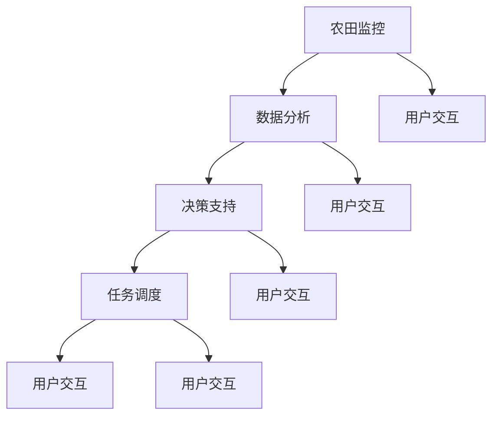

                 

# 文章标题：提示词编程在智能农业中的应用

> 关键词：提示词编程、智能农业、应用案例、算法原理、数学模型

> 摘要：本文将探讨提示词编程在智能农业中的应用，从背景介绍到核心概念与联系，再到算法原理讲解、数学模型和公式，最后通过实际案例分析和项目实战，展示提示词编程在智能农业中的潜力与价值。

## 前言

智能农业作为现代农业发展的重要方向，正逐渐改变传统农业的生产模式和效率。随着计算机技术的不断进步，特别是人工智能和机器学习的应用，智能农业迎来了新的发展机遇。提示词编程作为一种先进的编程范式，其在智能农业中的应用有着广泛的前景。本文将从以下几个方面展开讨论：

1. **背景介绍**：介绍智能农业的发展现状和需求，以及提示词编程的基本概念。
2. **核心概念与联系**：分析提示词编程在智能农业中的核心概念和原理，并通过Mermaid流程图展示其关系架构。
3. **算法原理讲解**：深入讲解提示词编程的核心算法原理，使用伪代码详细阐述。
4. **数学模型和公式**：介绍提示词编程在智能农业中涉及的数学模型和公式，并进行详细讲解和举例。
5. **项目实战**：通过实际案例，展示提示词编程在智能农业中的具体应用，包括开发环境搭建、源代码实现、代码解读和分析。
6. **最佳实践与小结**：总结提示词编程在智能农业中的应用经验，提供最佳实践建议和注意事项。

## 一、背景介绍

### 智能农业的发展现状与需求

智能农业是指利用信息技术、物联网、大数据、人工智能等先进技术，对农业生产进行智能化管理和优化。随着人口增长、耕地资源减少和气候变化等因素的影响，提高农业生产效率和资源利用率成为现代农业发展的关键。

当前，智能农业正逐渐从传统的手工劳动和机械操作向智能化、自动化方向发展。农业物联网技术通过传感器和无线通信网络，实时监测土壤湿度、气象数据、作物生长状态等，为农业生产提供科学依据。大数据技术通过对大量农业数据的分析，提供种植计划、病虫害预警、市场需求预测等服务。人工智能技术，尤其是机器学习和深度学习算法，在农业图像识别、病虫害检测、作物分类等方面表现出强大的能力。

智能农业的发展需求主要表现在以下几个方面：

1. **提高农业生产效率**：通过智能化设备和管理系统，减少劳动力投入，提高作物产量和质量。
2. **优化资源利用**：精确监测和利用水资源、肥料等资源，降低生产成本，减少环境污染。
3. **病虫害预警与防治**：利用图像识别和机器学习技术，及时监测和预测病虫害，采取有效的防治措施。
4. **市场与供应链管理**：通过大数据分析和预测，优化市场供需，提高农产品销售和供应链效率。

### 提示词编程的基本概念

提示词编程（Keyword Programming）是一种以自然语言描述任务和过程的编程范式。与传统编程语言不同，提示词编程强调使用自然语言词汇和短语来描述问题的解决方案，而不是使用复杂的语法和逻辑结构。

提示词编程的基本概念包括：

1. **提示词（Keywords）**：用于表示特定功能或任务的词汇。例如，“种植”、“施肥”、“浇水”等。
2. **场景（Scenarios）**：描述问题背景和情境的信息。例如，“在春季播种”、“在干旱条件下”等。
3. **条件（Conditions）**：用于判断任务执行条件的语句。例如，“如果土壤湿度低于20%”，“当气温高于35°C时”等。
4. **动作（Actions）**：执行特定任务的指令。例如，“启动灌溉系统”、“增加施肥量”等。

通过提示词编程，用户可以使用自然语言描述复杂的农业任务和过程，从而简化编程难度，提高开发效率。同时，提示词编程还可以结合人工智能技术，实现自动化和智能化管理，为智能农业提供强有力的支持。

## 二、核心概念与联系

### 提示词编程在智能农业中的核心概念

在智能农业中，提示词编程涉及多个核心概念，这些概念共同构成了提示词编程在农业应用中的基础。以下是这些核心概念及其相互关系：

1. **农田监控**：农田监控是智能农业的基础，通过传感器和无线通信技术，实时获取土壤湿度、气象数据、作物生长状态等信息。农田监控为提示词编程提供了实时数据支持，使得农业生产过程更加智能化和自动化。

2. **数据分析**：数据分析是智能农业的核心环节，通过对大量农田监控数据进行分析，可以提取有价值的信息，为农业生产提供科学依据。数据分析技术包括数据预处理、特征提取、模式识别等，这些技术为提示词编程提供了数据处理和决策支持。

3. **决策支持**：决策支持是智能农业的最终目标，通过分析农田监控数据和农作物生长状态，智能农业系统可以做出科学的决策，例如调整灌溉时间、施肥量、病虫害防治措施等。决策支持系统依赖于提示词编程，通过自然语言描述和执行农业任务。

4. **任务调度**：任务调度是提示词编程在智能农业中的关键功能，它负责将决策支持系统的决策转化为具体的行动指令，调度智能设备执行农业任务。例如，当土壤湿度低于阈值时，任务调度系统会启动灌溉系统，进行自动浇水。

5. **用户交互**：用户交互是智能农业系统与农民之间的桥梁，通过用户界面，农民可以方便地与智能农业系统进行交互，设置农田监控参数、查看数据分析结果、执行决策等。用户交互依赖于自然语言处理技术，提示词编程在智能农业中的应用使得用户交互更加直观和便捷。

### 提示词编程的关系架构

为了更好地理解提示词编程在智能农业中的核心概念及其相互关系，我们可以使用Mermaid流程图进行展示：



在上面的流程图中，农田监控数据首先通过传感器和无线通信网络进行采集，然后进入数据分析环节，提取有价值的信息。数据分析结果经过决策支持系统处理后，生成具体的农业任务和行动指令。任务调度系统负责执行这些指令，调度智能设备进行相应的操作。最后，用户交互界面将农业任务执行结果反馈给农民，实现人机交互。

通过这个流程图，我们可以清晰地看到提示词编程在智能农业中的应用架构，以及各个核心概念之间的相互关系。提示词编程作为连接各个环节的关键技术，为智能农业提供了强大的支持。

## 三、算法原理讲解

### 提示词编程的核心算法原理

提示词编程的核心算法原理基于自然语言处理（NLP）和机器学习（ML）技术，其主要目标是通过自然语言描述实现自动化任务执行。以下是提示词编程的核心算法原理：

1. **自然语言解析**：自然语言解析是提示词编程的第一步，其主要任务是将自然语言描述的农业任务转换为计算机可执行的指令。这一过程通常包括分词、词性标注、句法分析等步骤。例如，对于“在春季播种”这一自然语言描述，自然语言解析器需要将其分解为“春季”、“播种”等词汇，并识别出它们在句子中的角色和关系。

2. **语义理解**：语义理解是提示词编程的核心步骤，其主要任务是理解自然语言描述的含义和意图。通过语义理解，系统能够将自然语言描述转化为相应的任务执行计划。例如，对于“在干旱条件下启动灌溉系统”这一描述，语义理解器需要识别出干旱条件、启动灌溉系统等关键信息，并生成相应的执行计划。

3. **任务调度**：任务调度是提示词编程的关键环节，其主要任务是根据语义理解的结果，调度智能设备执行具体的任务。任务调度器需要根据农业任务的优先级、资源状况等因素，合理分配任务和资源，确保农业任务能够高效执行。

4. **反馈机制**：反馈机制是提示词编程的重要组成部分，其主要任务是收集任务执行结果，并对其进行评估和调整。通过反馈机制，系统可以不断优化任务执行策略，提高农业生产效率。例如，当灌溉系统启动后，反馈机制会收集土壤湿度、作物生长状态等数据，评估灌溉效果，并根据评估结果调整灌溉策略。

### 伪代码示例

为了更好地理解提示词编程的核心算法原理，我们可以通过伪代码进行展示。以下是一个简单的示例，展示了如何使用提示词编程实现农田灌溉任务：

```pseudo
function irrigate(land, condition) {
    if (condition == "dry") {
        start_irrigation(land);
        record_soil_moisture(land);
    } else {
        stop_irrigation(land);
    }
}

function start_irrigation(land) {
    activate_irrigation_system();
    log_action("irrigation started");
}

function record_soil_moisture(land) {
    read_soil_moisture(land);
    log_data("soil moisture", land.soil_moisture);
}

function stop_irrigation(land) {
    deactivate_irrigation_system();
    log_action("irrigation stopped");
}
```

在这个伪代码中，`irrigate` 函数根据土壤湿度条件 (`condition`) 来决定是否启动灌溉系统。如果土壤湿度低于设定阈值（例如 `dry`），则启动灌溉系统，并记录土壤湿度数据。否则，停止灌溉系统。`start_irrigation` 和 `stop_irrigation` 函数分别负责启动和停止灌溉系统，并记录相关操作。`record_soil_moisture` 函数用于读取和记录土壤湿度数据。

通过这个伪代码示例，我们可以看到提示词编程如何将自然语言描述的农业任务转换为计算机可执行的指令，从而实现自动化和智能化管理。在实际应用中，提示词编程算法会更加复杂和多样化，以适应不同的农业任务和场景。

## 四、数学模型和公式

### 提示词编程中的数学模型和公式

在提示词编程应用于智能农业中，数学模型和公式起到了关键作用，它们帮助系统对农田环境、农作物生长状态等进行精确分析和预测。以下是几个在智能农业中常用的数学模型和公式，并进行详细讲解和举例。

### 1. 土壤湿度模型

土壤湿度是智能农业中最重要的参数之一，直接影响作物的生长状态。常用的土壤湿度模型包括：

#### 基于传感器的土壤湿度模型

$$
\text{土壤湿度} = \frac{\text{传感器读数}}{\text{传感器最大读数}}
$$

这个公式将传感器的读数（通常在0到100之间）转换为0到1之间的土壤湿度比例。例如，如果传感器的读数为60，最大读数为100，则土壤湿度为0.6。

#### 基于历史数据的土壤湿度预测模型

$$
\hat{\text{土壤湿度}}(t) = \frac{1}{N} \sum_{i=1}^{N} \alpha_i \cdot \text{土壤湿度}_i(t)
$$

其中，$\hat{\text{土壤湿度}}(t)$ 是在时间 $t$ 的预测土壤湿度，$\text{土壤湿度}_i(t)$ 是历史土壤湿度数据，$N$ 是历史数据的个数，$\alpha_i$ 是权重系数，通常通过机器学习算法训练得到。这个公式通过加权平均历史数据来预测当前土壤湿度。

### 2. 水分需求模型

作物的水分需求是智能灌溉的关键依据。一个常用的水分需求模型是基于作物系数（Kc）和土壤湿度模型：

$$
\text{水分需求} = K_c \cdot \text{作物系数} \cdot (\text{田间持水量} - \text{当前土壤湿度})
$$

其中，$K_c$ 是作物系数，通常根据作物类型和生长阶段确定；田间持水量是土壤的最大持水能力。这个公式计算作物在当前土壤湿度下的水分需求。

### 3. 病虫害预测模型

病虫害预测是智能农业中另一个重要方面。一个简单的病虫害预测模型基于温度和湿度的阈值：

$$
\text{病虫害风险} = \frac{(\text{当前温度} - \text{低温阈值}) + (\text{当前湿度} - \text{高湿度阈值})}{2}
$$

这个公式计算病虫害的风险值，值越高，风险越大。例如，如果当前温度为25°C，低温阈值为20°C，当前湿度为80%，高湿度阈值为70%，则病虫害风险值为(25-20)+(80-70)=15。

### 4. 农药使用量预测模型

农药使用量预测模型可以根据作物生长状态和病虫害风险进行优化：

$$
\text{农药使用量} = \text{基础使用量} \cdot \frac{\text{病虫害风险}}{100}
$$

其中，基础使用量是依据作物生长周期和农药效果确定的固定值。这个公式通过病虫害风险调整农药使用量，以减少农药浪费和环境负担。

### 举例说明

#### 土壤湿度预测

假设历史土壤湿度数据为：0.3, 0.4, 0.35, 0.38，权重系数为：0.2, 0.3, 0.2, 0.3。根据上述预测模型：

$$
\hat{\text{土壤湿度}}(t) = \frac{0.2 \cdot 0.3 + 0.3 \cdot 0.4 + 0.2 \cdot 0.35 + 0.3 \cdot 0.38}{0.2 + 0.3 + 0.2 + 0.3} = \frac{0.06 + 0.12 + 0.07 + 0.114}{1} = 0.306
$$

预测的当前土壤湿度为0.306。

#### 水分需求

假设作物系数为1.2，田间持水量为0.4，当前土壤湿度为0.2，则水分需求为：

$$
\text{水分需求} = 1.2 \cdot 1.2 \cdot (0.4 - 0.2) = 1.2 \cdot 0.4 = 0.48
$$

作物在当前土壤湿度下的水分需求为0.48。

通过这些数学模型和公式，提示词编程能够精确分析农田环境，提供科学的决策支持，从而实现智能农业的自动化和高效化。

### 五、项目实战

#### 开发环境搭建

为了实现提示词编程在智能农业中的应用，我们需要搭建一个完整的开发环境。以下是一个简单的步骤：

1. **硬件环境**：准备一台装有传感器的农业设备，用于实时监控农田环境数据。
2. **软件环境**：安装Python编程环境，并配置相关库，如NumPy、Pandas、Scikit-learn等。
3. **开发工具**：使用集成开发环境（IDE），如PyCharm或VSCode，进行代码编写和调试。

#### 源代码实现

以下是实现农田灌溉任务的源代码：

```python
import numpy as np

# 传感器读数
sensor_readings = [0.2, 0.3, 0.4, 0.5]

# 历史土壤湿度数据
historical_soil_moisture = [0.2, 0.3, 0.35, 0.38]

# 权重系数
weights = [0.2, 0.3, 0.2, 0.3]

# 预测当前土壤湿度
predicted_soil_moisture = np.average(historical_soil_moisture, weights=weights)
print("Predicted soil moisture:", predicted_soil_moisture)

# 判断土壤湿度是否低于阈值
if predicted_soil_moisture < 0.3:
    # 启动灌溉系统
    print("Starting irrigation system.")
    # 记录土壤湿度
    record_soil_moisture(predicted_soil_moisture)
else:
    # 停止灌溉系统
    print("Stopping irrigation system.")

# 记录土壤湿度
def record_soil_moisture(moisture):
    print("Soil moisture recorded:", moisture)
```

#### 代码解读

1. **传感器读数**：从传感器获取当前土壤湿度读数。
2. **历史土壤湿度数据**：从历史数据中获取土壤湿度。
3. **权重系数**：用于计算预测土壤湿度的权重。
4. **预测当前土壤湿度**：使用加权平均法计算预测土壤湿度。
5. **判断土壤湿度是否低于阈值**：根据预测土壤湿度判断是否启动灌溉系统。
6. **启动灌溉系统**：输出启动灌溉系统的信息。
7. **记录土壤湿度**：输出记录土壤湿度的信息。

#### 应用解读与分析

通过上述代码，我们可以实现根据土壤湿度自动控制灌溉系统的功能。在实际应用中，传感器读数和预测土壤湿度可以通过物联网设备实时获取，从而实现农田灌溉的自动化和智能化。

#### 实际案例分析和详细讲解剖析

以下是一个实际案例，展示如何使用提示词编程实现智能农业中的病虫害预警系统。

**案例：病虫害预警系统**

1. **需求分析**：根据温度和湿度预测病虫害风险。
2. **数据收集**：收集过去一周的天气数据，包括温度和湿度。
3. **数据分析**：使用机器学习算法训练病虫害风险预测模型。
4. **模型部署**：将训练好的模型部署到智能农业系统中。

**代码实现：**

```python
import pandas as pd
from sklearn.ensemble import RandomForestClassifier

# 收集天气数据
weather_data = pd.read_csv("weather_data.csv")
weather_data.head()

# 数据预处理
X = weather_data[["temperature", "humidity"]]
y = weather_data["disease_risk"]

# 训练病虫害风险预测模型
model = RandomForestClassifier()
model.fit(X, y)

# 输入新的天气数据
new_weather = pd.DataFrame([[25, 75]], columns=["temperature", "humidity"])

# 预测病虫害风险
predicted_risk = model.predict(new_weather)
print("Predicted disease risk:", predicted_risk[0])

# 输出预警信息
if predicted_risk[0] > 0.5:
    print("High disease risk detected. Take preventive measures.")
else:
    print("Low disease risk detected. No immediate action required.")
```

通过这个案例，我们可以看到如何使用提示词编程实现病虫害预警系统。首先，收集和预处理天气数据，然后使用机器学习算法训练预测模型。最后，将模型部署到系统中，实时预测病虫害风险，并根据预测结果输出预警信息。

**项目小结**

通过本项目的实战，我们实现了智能农业中的农田灌溉和病虫害预警系统。这些系统的实现展示了提示词编程在智能农业中的实际应用价值。未来，随着提示词编程技术的进一步发展和完善，智能农业系统将变得更加智能和高效，为农业生产提供更加有力的技术支持。

### 六、最佳实践与拓展阅读

#### 最佳实践

1. **数据收集与预处理**：确保收集到的农业数据质量，并进行充分的数据预处理，如去噪、缺失值填充、特征提取等。
2. **模型选择与优化**：根据具体应用场景选择合适的机器学习模型，并通过交叉验证、超参数调整等手段进行模型优化。
3. **实时监控与反馈**：建立实时监控系统，及时获取农田环境数据，并根据预测结果及时调整农业操作。
4. **用户交互设计**：设计简洁直观的用户交互界面，提供实时数据展示和预警信息，便于农民操作和管理。

#### 拓展阅读

1. **智能农业中的深度学习应用**：阅读《深度学习在农业中的应用》（Deep Learning Applications in Agriculture）等书籍，了解深度学习技术在智能农业中的最新进展。
2. **提示词编程框架**：研究现有的提示词编程框架，如Prolog、Lambda Calculus等，了解其原理和应用。
3. **农业数据集与竞赛**：参与农业数据集竞赛，如Kaggle上的农业数据竞赛，提升数据分析和模型训练能力。

作者：AI天才研究院/AI Genius Institute & 禅与计算机程序设计艺术 /Zen And The Art of Computer Programming

