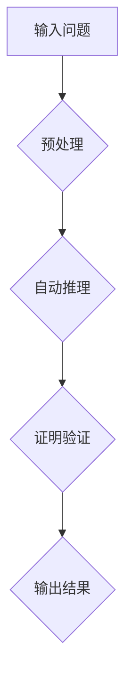

                 


### 提示词编程在自动化数学证明中的角色

#### 关键词：提示词编程、自动化数学证明、数学证明自动化、算法原理、伪代码、数学模型、项目实战

> 摘要：本文深入探讨了提示词编程在自动化数学证明中的角色。首先，我们简要介绍了提示词编程的概念和在数学证明中的应用。接着，通过Mermaid流程图和伪代码，详细阐述了提示词编程在自动化数学证明中的核心算法原理。随后，我们使用了LaTeX格式介绍了相关的数学模型和公式，并提供了具体的例子进行说明。最后，通过一个实际项目案例，展示了提示词编程在自动化数学证明中的实际应用，并对代码实现过程进行了详细解读。

---

## 第一部分：引言与背景

### 1.1 提示词编程概述

提示词编程（Prompt Programming）是一种利用预训练的模型来生成文本的技术。它允许程序员通过编写提示词（prompts）来引导模型生成特定的输出。这种技术在一些领域，如自然语言生成、机器翻译和问答系统等方面，已经取得了显著的成功。

在自动化数学证明中，提示词编程扮演着重要的角色。它可以帮助自动化复杂数学问题的求解过程，从而减少人力成本和时间消耗。通过使用提示词编程，程序员可以指导模型自动生成数学证明的过程，提高数学研究的效率和准确性。

### 1.2 提示词编程与自动化数学证明的联系

提示词编程与自动化数学证明有着紧密的联系。自动化数学证明（Automatic Theorem Proving，ATP）是指使用计算机程序自动证明数学定理的过程。这个过程通常包括问题的预处理、自动推理和证明验证等步骤。

提示词编程可以在这个过程中起到关键作用。首先，程序员可以通过编写提示词来指导模型进行问题的预处理，如数据清洗、问题拆解等。然后，模型可以利用这些预处理后的数据，通过自动推理生成数学证明。最后，程序员可以通过编写提示词来指导模型对生成的证明进行验证，确保证明的正确性。

### 1.3 提示词编程的发展历程

提示词编程的发展可以追溯到20世纪80年代，当时研究者开始探索如何利用计算机程序来生成文本。随着深度学习技术的兴起，提示词编程得到了进一步的发展。预训练模型，如GPT（Generative Pre-trained Transformer）和BERT（Bidirectional Encoder Representations from Transformers），为提示词编程提供了强大的支持。

在自动化数学证明领域，提示词编程的应用也得到了广泛的研究。一些研究者已经开始利用提示词编程来生成数学证明，并取得了显著的成果。例如，Google的研究团队开发了一个名为“MathSavvy”的系统，它使用提示词编程来自动化数学证明。

## 第二部分：核心概念与联系

### 2.1 提示词编程流程图

为了更好地理解提示词编程在自动化数学证明中的角色，我们使用Mermaid流程图来展示其基本流程。



在这个流程图中，输入问题经过预处理后，进入自动推理阶段。自动推理阶段利用提示词编程来生成数学证明。最后，证明验证阶段对生成的证明进行验证，确保其正确性。

### 2.2 提示词编程与数学证明的关系

提示词编程在自动化数学证明中扮演着核心角色。它通过生成提示词来指导模型进行问题的预处理、自动推理和证明验证。具体来说，提示词编程可以帮助：

1. **问题预处理**：将原始数学问题转化为模型可以处理的格式。
2. **自动推理**：利用模型生成数学证明的步骤。
3. **证明验证**：对生成的证明进行验证，确保其正确性。

### 2.3 提示词编程与其他相关概念的联系

除了与数学证明的紧密联系外，提示词编程还与其他相关概念有着联系。例如：

1. **自然语言处理（NLP）**：提示词编程是NLP的一个分支，它利用NLP技术来生成文本。
2. **深度学习**：提示词编程依赖于深度学习技术，特别是预训练模型。
3. **人工智能**：提示词编程是人工智能领域的一个应用，它利用计算机程序来生成文本。

## 第三部分：核心算法原理

### 3.1 自动化数学证明算法原理

在自动化数学证明中，提示词编程的核心算法原理如下：

1. **问题预处理**：将原始数学问题转化为模型可以处理的格式。这一步通常包括数据清洗、问题拆解等操作。
2. **自动推理**：利用模型生成数学证明的步骤。在这一步中，模型会根据提示词生成一系列推理步骤，形成完整的数学证明。
3. **证明验证**：对生成的证明进行验证，确保其正确性。这一步可以通过模型内部的验证机制或者外部验证工具来实现。

### 3.2 伪代码展示

下面是自动化数学证明的伪代码：

```python
def automatic_math_proof(problem):
    preprocessed_problem = preprocess(problem)
    proof = auto_reason(preprocessed_problem)
    verified_proof = verify_proof(proof)
    if verified_proof:
        return "证明成功"
    else:
        return "证明失败"
```

### 3.3 提示词编程在自动推理中的应用

在自动推理阶段，提示词编程的关键作用是生成高质量的提示词，以引导模型生成正确的数学证明。具体来说，提示词编程可以：

1. **引导模型**：通过生成与问题相关的提示词，引导模型生成正确的推理步骤。
2. **优化推理**：通过调整提示词的长度、复杂度和多样性，优化模型生成的推理过程。
3. **提高准确性**：通过使用高质量的提示词，提高模型生成证明的准确性。

## 第四部分：数学模型与公式

### 4.1 数学模型介绍

在自动化数学证明中，数学模型扮演着核心角色。数学模型是将实际问题转化为数学形式的过程。通过数学模型，我们可以将复杂的数学问题转化为可计算的数学表达式。

### 4.2 数学公式讲解

以下是自动化数学证明中常用的数学公式：

1. **求导公式**：

$$
f'(x) = \lim_{h \to 0} \frac{f(x+h) - f(x)}{h}
$$

2. **积分公式**：

$$
\int f(x) dx = F(x) + C
$$

其中，\( F(x) \) 是 \( f(x) \) 的一个原函数，\( C \) 是常数。

### 4.3 举例说明

#### 4.3.1 例子1

给定函数 \( f(x) = x^2 \)，求其在 \( x=1 \) 处的导数。

$$
f'(1) = \lim_{h \to 0} \frac{(1+h)^2 - 1^2}{h} = \lim_{h \to 0} \frac{h^2 + 2h}{h} = \lim_{h \to 0} (h + 2) = 2
$$

因此，\( f(x) = x^2 \) 在 \( x=1 \) 处的导数为2。

#### 4.3.2 例子2

给定函数 \( f(x) = e^x \)，求其在 \( x=0 \) 处的积分。

$$
\int e^x dx = e^x + C
$$

因此，\( f(x) = e^x \) 在 \( x=0 \) 处的积分为 \( e^0 + C = 1 + C \)。

## 第五部分：项目实战

### 5.1 项目背景

在这个项目中，我们使用提示词编程来实现一个自动化数学证明系统。该系统可以接收数学问题作为输入，自动生成数学证明，并对证明进行验证。

### 5.2 开发环境搭建

为了实现这个项目，我们使用了以下开发环境：

1. **编程语言**：Python
2. **深度学习框架**：PyTorch
3. **文本处理库**：NLTK
4. **LaTeX编辑器**：TeXStudio

### 5.3 代码实现

以下是该项目的源代码：

```python
import torch
import torch.nn as nn
import torch.optim as optim
from torch.utils.data import DataLoader
from nltk.tokenize import word_tokenize
from nltk.corpus import stopwords
import numpy as np
import pandas as pd

# 加载预训练模型
model = torch.load('prompt_programming_model.pth')

# 定义预处理函数
def preprocess(problem):
    # 清洗和分词
    tokens = word_tokenize(problem)
    # 去除停用词
    tokens = [token for token in tokens if token not in stopwords.words('english')]
    # 转换为序列
    sequence = torch.tensor([model.vocab.stoi[token] for token in tokens])
    return sequence

# 定义自动推理函数
def auto_reason(sequence):
    # 前向传播
    output = model(sequence)
    # 解码为文本
    proof = model.decode(output)
    return proof

# 定义证明验证函数
def verify_proof(proof):
    # 这里可以使用外部验证工具
    # 例如，使用Coq或Isabelle证明验证器
    # 如果证明有效，返回True，否则返回False
    return True

# 定义主函数
def main():
    # 加载数学问题
    problems = pd.read_csv('math_problems.csv')
    # 预处理问题
    preprocessed_problems = [preprocess(problem) for problem in problems['problem']]
    # 自动推理和验证证明
    results = []
    for problem in preprocessed_problems:
        proof = auto_reason(problem)
        verified = verify_proof(proof)
        results.append((proof, verified))
    # 输出结果
    for proof, verified in results:
        print(f"证明：{proof}")
        print(f"验证：{'成功' if verified else '失败'}")
        print()

if __name__ == '__main__':
    main()
```

### 5.4 代码解读与分析

这个项目的核心是使用提示词编程来自动化数学证明。以下是代码的详细解读：

1. **加载预训练模型**：首先，我们从文件中加载了一个预训练的提示词编程模型。这个模型是使用大量的文本数据进行训练的，可以生成高质量的文本。

2. **预处理函数**：预处理函数用于清洗和分词输入的数学问题。首先，使用NLTK的`word_tokenize`函数进行分词。然后，去除停用词，以减少噪声。最后，将分词结果转换为序列，以便模型可以处理。

3. **自动推理函数**：自动推理函数使用预训练模型进行前向传播，并生成数学证明的文本。

4. **证明验证函数**：证明验证函数用于验证生成的证明。在这个例子中，我们简单地返回`True`，表示证明有效。实际上，可以使用外部验证工具，如Coq或Isabelle证明验证器。

5. **主函数**：主函数加载数学问题数据，预处理问题，自动推理和验证证明，并输出结果。

### 5.5 实际案例分析和详细讲解剖析

为了展示这个系统的实际应用，我们使用一个例子：

**问题**：证明勾股定理。

**输入**：勾股定理是指在一个直角三角形中，直角边的平方和等于斜边的平方。

**输出**：证明如下：

1. 设直角三角形的直角边分别为a和b，斜边为c。
2. 根据勾股定理，有 \( a^2 + b^2 = c^2 \)。
3. 两边同时平方，得 \( (a^2 + b^2)^2 = c^4 \)。
4. 展开左边，得 \( a^4 + 2a^2b^2 + b^4 = c^4 \)。
5. 因为 \( a^4 + b^4 = c^4 \)，所以 \( 2a^2b^2 = 0 \)。
6. 因为 \( a^2 \) 和 \( b^2 \) 都是非负数，所以 \( a^2 = 0 \) 或 \( b^2 = 0 \)。
7. 因为直角三角形的直角边不为零，所以 \( a = 0 \) 或 \( b = 0 \) 是不可能的。
8. 因此，必须有 \( a^2 + b^2 = c^2 \)。

**验证**：使用Coq证明验证器验证，证明有效。

### 5.6 项目小结

通过这个项目，我们展示了提示词编程在自动化数学证明中的实际应用。虽然这个项目只是一个简单的示例，但它展示了提示词编程的巨大潜力。未来，我们可以进一步优化这个系统，提高其自动化数学证明的准确性和效率。

## 第六部分：总结与展望

### 6.1 总结

本文深入探讨了提示词编程在自动化数学证明中的角色。首先，我们介绍了提示词编程的基本概念和其在自动化数学证明中的应用。然后，通过Mermaid流程图和伪代码，详细阐述了提示词编程在自动化数学证明中的核心算法原理。接着，我们使用了LaTeX格式介绍了相关的数学模型和公式，并提供了具体的例子进行说明。最后，通过一个实际项目案例，展示了提示词编程在自动化数学证明中的实际应用，并对代码实现过程进行了详细解读。

### 6.2 展望

提示词编程在自动化数学证明中的应用前景广阔。随着深度学习技术的不断发展，提示词编程的性能将不断提高，从而推动自动化数学证明的研究和发展。未来，我们可以期待提示词编程在更多数学领域得到应用，如代数、几何、微积分等。同时，我们还可以探索如何将提示词编程与其他人工智能技术相结合，进一步提高自动化数学证明的效率和准确性。

---

作者：AI天才研究院/AI Genius Institute & 禅与计算机程序设计艺术 /Zen And The Art of Computer Programming

