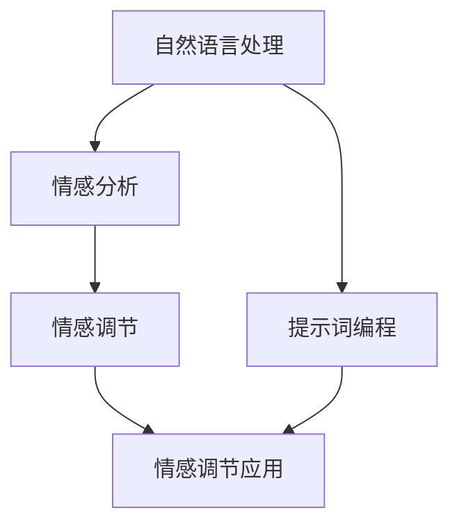

                 

### 1. 确定核心概念与架构

在探讨“提示词编程在自然语言情感调节中的应用”这一主题时，我们首先要明确几个核心概念：自然语言处理（NLP）、情感分析、情感调节和提示词编程。这些概念相互交织，共同构成了我们研究的基础框架。

#### 自然语言处理（NLP）

自然语言处理是计算机科学、人工智能和语言学领域中的一个重要分支。它致力于让计算机理解和生成人类语言。NLP的核心任务是处理文本数据，包括语言识别、文本分类、情感分析等。在这些任务中，NLP技术帮助我们理解和分析语言背后的意义和情感。

#### 情感分析

情感分析，也称为意见挖掘，是NLP中的一种重要应用。它的目标是识别文本中的情感倾向，即判断文本表达的是正面情感、负面情感还是中立情感。情感分析技术广泛应用于市场调研、社交媒体监控、客户反馈分析等领域。

#### 情感调节

情感调节是一种控制或改变文本情感强度的方法。它的目的是根据需求对文本进行优化，使其传达出预期的情感色彩。情感调节可以应用于自动写作、广告文案优化、情感化推荐系统等领域。

#### 提示词编程

提示词编程是一种通过预设的提示词来引导程序执行特定任务的编程方式。它利用自然语言处理技术，将人类的语言指令转化为计算机可执行的代码。提示词编程在提高编程效率和减少错误率方面具有显著优势。

为了更好地理解这些概念之间的关系，我们可以使用Mermaid图来展示它们的核心联系：



这张图揭示了NLP、情感分析、情感调节和提示词编程之间的紧密联系。它们共同构成了一个完整的技术体系，其中每个部分都对另一个部分产生重要影响。接下来，我们将逐一深入探讨这些概念，并解释它们在自然语言情感调节中的应用。

---

在确定了核心概念和架构后，我们能够更清晰地理解自然语言处理、情感分析、情感调节和提示词编程之间的关系，以及它们在自然语言情感调节中的具体应用。接下来，我们将逐步深入每一个概念，解释其原理和如何相互结合，最终构建出完整的解决方案。

### 2. 自然语言处理与情感分析

自然语言处理（NLP）作为人工智能的一个重要分支，其核心目标是将人类语言转化为计算机能够理解和处理的形式。情感分析作为NLP的一部分，专注于识别和理解文本中的情感倾向。为了更深入地理解情感分析，我们需要从其定义、分类和应用领域开始。

#### 2.1 情感分析的定义

情感分析，也称为意见挖掘，是指通过自然语言处理技术来分析文本中的情感倾向。情感分析的主要任务是判断文本表达的是正面情感、负面情感还是中立情感。它通常涉及到以下三个基本问题：

1. **情感极性分类**：判断文本是正面、负面还是中性。
2. **情感强度评估**：量化文本中情感倾向的强度。
3. **情感主题识别**：识别文本中的特定情感主题。

#### 2.2 情感分析的分类

情感分析可以根据不同的标准进行分类，主要包括以下几种：

1. **基于规则的方法**：这种方法通过编写规则来识别文本中的情感。规则通常基于语言学和情感词典，例如情感词汇库和情感短语。这种方法简单直接，但灵活性较低，难以处理复杂的情感表达。

2. **基于统计的方法**：这种方法利用统计学模型来分析文本的情感。常见的统计模型包括朴素贝叶斯分类器、支持向量机（SVM）和最大熵模型。基于统计的方法能够处理更复杂的文本数据，但需要大量的训练数据和计算资源。

3. **基于机器学习的方法**：这种方法使用机器学习算法来训练模型，使其能够自动识别文本中的情感。常见的机器学习算法包括决策树、随机森林、神经网络等。基于机器学习的方法具有很好的泛化能力，但需要大量的标注数据和复杂的模型调优。

#### 2.3 情感分析的应用领域

情感分析技术广泛应用于多个领域，主要包括：

1. **市场调研**：通过分析消费者对产品或服务的评价，帮助企业了解市场反馈，优化产品和服务。

2. **社交媒体监控**：监控社交媒体上的用户言论，了解公众对品牌或事件的看法，为企业提供市场洞察。

3. **客户反馈分析**：分析客户反馈，了解客户需求和建议，提高客户满意度。

4. **情绪识别与干预**：在心理健康领域，情感分析可以用于识别个体情绪状态，提供个性化的情绪干预建议。

#### 2.4 情感分析的基本流程

情感分析通常包括以下几个步骤：

1. **数据预处理**：清洗和准备文本数据，包括去除停用词、词干提取、词性标注等。

2. **特征提取**：从文本数据中提取能够表征情感的属性，如情感词汇、情感短语等。

3. **情感分类**：使用分类算法对特征进行分类，判断文本的情感极性。

4. **情感强度评估**：对分类结果进行量化，评估情感的强度。

5. **结果解释**：解释分类结果和情感强度，提供有意义的分析报告。

#### 2.5 情感分析中的挑战

尽管情感分析在多个领域取得了显著成果，但仍然面临一些挑战：

1. **情感表达的复杂性**：人类情感表达复杂多样，不同人可能用不同的方式表达相同的情感。

2. **多语言情感分析**：不同语言的情感表达和文化背景差异较大，多语言情感分析是一个挑战。

3. **情感极性的模糊性**：文本中的情感极性可能存在模糊性，难以精确分类。

4. **情感评估的主观性**：情感评估往往具有主观性，不同的人可能对同一文本的情感分类有不同的看法。

综上所述，情感分析作为自然语言处理的一个重要分支，其在识别和理解文本情感方面的应用日益广泛。通过深入理解情感分析的定义、分类和应用领域，我们可以更好地利用这一技术来解决实际问题，为企业和个人提供更智能的服务。

### 2.1 自然语言处理技术介绍

自然语言处理（NLP）作为人工智能领域的一个重要分支，旨在使计算机能够理解、生成和处理人类语言。NLP技术广泛应用于信息检索、机器翻译、语音识别、文本摘要、情感分析等多个领域。在这一部分，我们将介绍NLP技术的基本组成部分及其在实际应用中的关键作用。

#### 2.1.1 词汇处理

词汇处理是NLP的基础，它包括分词、词性标注、命名实体识别等任务。

1. **分词**：分词是将连续的文本划分为有意义的词汇序列。分词技术对于理解文本的结构和语义至关重要。常见的分词方法包括基于词典的分词、基于统计的分词和基于深度学习的分词。

   - **基于词典的分词**：这种方法利用预先构建的词典来识别词汇边界。例如，如果词典中有“计算机”这个词，那么在文本中出现“计算机”这个词的时候，分词器会将其识别为一个独立的词汇。
   
   - **基于统计的分词**：这种方法通过统计文本中的词频和相邻词的共现关系来划分词汇。例如，在连续文本中，如果一个词组（如“人工智能”）在训练数据中频繁出现，那么分词器会将其识别为一个独立的词汇。

   - **基于深度学习的分词**：近年来，基于深度学习的分词方法取得了显著进展。这些方法利用神经网络模型来自动学习词汇边界。例如，使用长短时记忆网络（LSTM）或变换器（Transformer）进行分词。

2. **词性标注**：词性标注是将文本中的每个词标记为名词、动词、形容词等。词性标注对于理解文本的语法结构和语义具有重要意义。

3. **命名实体识别**：命名实体识别是从文本中识别出具有特定意义的实体，如人名、地名、组织名等。命名实体识别在信息提取、实体链接和知识图谱构建中具有重要作用。

#### 2.1.2 句子处理

句子处理是NLP中的另一个重要任务，它包括句法分析、语义角色标注、句法解析等。

1. **句法分析**：句法分析旨在理解句子的结构，即句子中词汇之间的关系。常见的句法分析方法包括基于规则的方法、基于统计的方法和基于深度学习的方法。

   - **基于规则的方法**：这种方法使用预先定义的语法规则来分析句子结构。例如，使用词法分析和语法规则来识别句子的主语、谓语和宾语。
   
   - **基于统计的方法**：这种方法通过统计方法来分析句子结构，例如隐马尔可夫模型（HMM）和条件随机场（CRF）。
   
   - **基于深度学习的方法**：这种方法使用神经网络模型来学习句子结构。例如，使用循环神经网络（RNN）或变换器（Transformer）进行句法分析。

2. **语义角色标注**：语义角色标注是将句子中的每个词标记为其在句子中的角色，如动作执行者、动作承受者等。语义角色标注有助于理解句子的语义和意图。

3. **句法解析**：句法解析是通过构建句子的语法树来表示句子结构。句法解析有助于理解复杂句子的语义和逻辑关系。

#### 2.1.3 文本分类

文本分类是将文本分为预定义的类别。文本分类广泛应用于垃圾邮件检测、情感分析、新闻分类等领域。

1. **基于规则的方法**：这种方法使用预定义的规则来分类文本。例如，基于情感词典和情感规则进行情感分类。

2. **基于统计的方法**：这种方法使用统计方法来分类文本。常见的统计方法包括朴素贝叶斯、支持向量机（SVM）和决策树。

3. **基于深度学习的方法**：这种方法使用神经网络模型来分类文本。例如，使用卷积神经网络（CNN）或变换器（Transformer）进行文本分类。

#### 2.1.4 NLP技术的应用

NLP技术在多个领域具有广泛的应用：

1. **信息检索**：通过NLP技术，可以构建智能搜索引擎，提高信息检索的准确性和效率。

2. **机器翻译**：NLP技术使得计算机能够翻译不同语言之间的文本，为跨文化交流提供了便利。

3. **语音识别**：通过NLP技术，可以将语音转换为文本，实现语音到文字的转换。

4. **文本摘要**：通过NLP技术，可以从长文本中提取关键信息，生成摘要，提高信息获取的效率。

5. **情感分析**：通过NLP技术，可以识别和分析文本中的情感倾向，为市场调研、客户服务等领域提供有价值的信息。

6. **智能助手**：通过NLP技术，可以构建智能助手，实现与用户的自然语言交互，提高用户体验。

综上所述，自然语言处理技术作为人工智能的一个重要分支，其在词汇处理、句子处理、文本分类等多个方面的应用为人类与计算机之间的交流提供了强有力的支持。随着深度学习等技术的不断发展，NLP技术将不断进步，为各行各业带来更多的创新和应用。

### 2.2 情感分析算法原理

情感分析算法是自然语言处理（NLP）中的一个重要组成部分，其主要目标是识别文本中的情感倾向。为了实现这一目标，情感分析算法通常需要经过以下几个关键步骤：数据预处理、特征提取和情感分类。

#### 2.2.1 数据预处理

数据预处理是情感分析中的第一步，它对原始文本进行清洗和转换，以便后续的特征提取和情感分类。以下是一些常见的数据预处理步骤：

1. **文本清洗**：去除文本中的无用信息，如HTML标签、特殊字符和停用词。停用词通常是常见的无意义词汇，如“的”、“是”、“在”等。去除停用词有助于减少噪声和简化模型。

2. **分词**：将连续的文本划分为有意义的词汇序列。分词技术对于理解文本的结构和语义至关重要。常见的分词方法包括基于词典的分词、基于统计的分词和基于深度学习的分词。

3. **词干提取**：将单词缩减为其最基本形式，如将“playing”（玩）缩减为“play”（玩）。词干提取有助于减少词汇数量，提高模型的泛化能力。

4. **词性标注**：将文本中的每个词标记为名词、动词、形容词等。词性标注有助于理解文本的语法结构和语义。

5. **文本规范化**：将文本转换为统一格式，如将所有文本转换为小写，删除标点符号等。

#### 2.2.2 特征提取

特征提取是将预处理后的文本转换为机器学习模型可处理的数值特征。以下是一些常见的特征提取方法：

1. **词袋模型**：词袋模型将文本表示为一个向量，其中每个元素表示一个词汇在文本中的出现次数。词袋模型简单直观，但未能考虑到词汇的顺序和语义关系。

2. **TF-IDF**：TF-IDF（词频-逆文档频率）是一种常用的特征提取方法。TF-IDF衡量一个词汇在文本中的重要程度，其值越高，表示该词汇在文本中的重要性越大。TF-IDF考虑了词汇的频率和全局分布，有助于提高模型的准确性。

3. **词嵌入**：词嵌入（Word Embedding）是将词汇映射到低维向量空间的方法。常见的词嵌入模型包括Word2Vec、GloVe和BERT等。词嵌入能够捕捉词汇的语义信息，从而提高模型的性能。

4. **情感词典**：情感词典是一种包含情感词汇及其情感极性的词典。通过将文本中的词汇与情感词典进行匹配，可以提取出文本的情感特征。情感词典可以基于规则或数据驱动方法构建。

#### 2.2.3 情感分类

情感分类是将文本归类为正面、负面或中立等情感类别。以下是一些常见的情感分类方法：

1. **基于规则的方法**：这种方法通过编写规则来识别文本中的情感。规则通常基于语言学和情感词典，例如情感词汇库和情感短语。基于规则的方法简单直接，但灵活性较低，难以处理复杂的情感表达。

2. **基于统计的方法**：这种方法使用统计模型来分析文本的情感。常见的统计模型包括朴素贝叶斯分类器、支持向量机（SVM）和最大熵模型。基于统计的方法能够处理更复杂的文本数据，但需要大量的训练数据和计算资源。

3. **基于机器学习的方法**：这种方法使用机器学习算法来训练模型，使其能够自动识别文本中的情感。常见的机器学习算法包括决策树、随机森林、神经网络等。基于机器学习的方法具有很好的泛化能力，但需要大量的标注数据和复杂的模型调优。

4. **基于深度学习的方法**：这种方法使用深度学习算法，如卷积神经网络（CNN）和变换器（Transformer），来分析文本的情感。基于深度学习的方法能够捕捉文本中的复杂语义信息，从而提高模型的性能。

以下是情感分析算法的伪代码示例：

```python
# 情感分析算法伪代码
def sentiment_analysis(text):
    # 预处理文本
    processed_text = preprocess_text(text)
    
    # 提取特征
    features = extract_features(processed_text)
    
    # 使用机器学习模型进行预测
    prediction = model.predict(features)
    
    return prediction

def preprocess_text(text):
    # 清洗文本
    cleaned_text = clean_text(text)
    
    # 分词
    words = tokenize_text(cleaned_text)
    
    # 词性标注
    tagged_words = tag_words(words)
    
    # 提取特征
    features = extract_features(tagged_words)
    
    return features

def extract_features(words):
    # 使用词袋模型提取特征
    features = bag_of_words(words)
    
    # 使用TF-IDF提取特征
    features = tf_idf(words)
    
    # 使用词嵌入提取特征
    features = word_embedding(words)
    
    return features
```

#### 2.2.4 情感分析在实际中的应用

情感分析技术在多个领域具有广泛的应用，以下是一些实际应用的例子：

1. **市场调研**：通过分析消费者对产品或服务的评价，企业可以了解市场反馈，优化产品和服务。

2. **社交媒体监控**：监控社交媒体上的用户言论，企业可以了解公众对品牌或事件的看法，提供市场洞察。

3. **客户反馈分析**：分析客户反馈，企业可以了解客户需求和建议，提高客户满意度。

4. **情绪识别与干预**：在心理健康领域，情感分析可以用于识别个体情绪状态，提供个性化的情绪干预建议。

通过深入理解情感分析算法的原理，我们可以更好地应用这一技术来解决实际问题，为企业和个人提供更智能的服务。随着深度学习等技术的不断发展，情感分析算法将变得更加精确和高效，从而推动更多创新和应用。

### 2.3 情感调节基础

情感调节是一种通过改变文本情感色彩来传达预期信息的技术。它的核心目标是通过调整文本的情感强度和倾向，使其更符合目标受众的心理预期。情感调节在许多实际应用中具有重要价值，如广告文案优化、自动写作和情感化推荐系统等。

#### 2.3.1 情感调节的定义

情感调节（Sentiment Regulation）是指通过算法或人工干预来改变文本的情感色彩，使其传达出预期的情感强度和情感倾向。情感调节不同于情感分类，后者是识别文本中的情感极性，而情感调节则是主动改变文本的情感状态。

#### 2.3.2 情感调节的目标

情感调节的主要目标包括：

1. **增强情感共鸣**：通过调整文本的情感强度，使文本更能引起读者的情感共鸣，提高信息的吸引力和说服力。

2. **适应受众情感偏好**：根据目标受众的情感偏好，调整文本的情感色彩，使其更符合受众的情感需求，提高信息接受度和认可度。

3. **传递隐性信息**：通过情感调节，可以在不直接表达情感的情况下，传递出隐性的情感信息，增强信息的深度和层次感。

4. **优化情感体验**：在自动化写作、内容创作和推荐系统中，情感调节可以优化用户的情感体验，提高用户满意度和留存率。

#### 2.3.3 情感调节的应用领域

情感调节技术广泛应用于多个领域，以下是一些典型的应用场景：

1. **广告文案优化**：通过情感调节，广告文案可以更有效地传达产品的优势和特点，激发消费者的购买欲望。

2. **自动写作**：在新闻写作、内容创作和报告生成中，情感调节可以帮助生成符合特定情感色彩的文本，提高文本的表现力和吸引力。

3. **情感化推荐系统**：在电子商务和社交媒体中，情感调节可以帮助推荐系统根据用户情感偏好推荐相关产品或内容，提高用户体验和满意度。

4. **心理辅导**：在心理健康领域，情感调节可以帮助心理辅导师通过文本分析了解患者的情感状态，提供个性化的情绪干预建议。

5. **危机管理**：在公关危机处理中，情感调节可以帮助企业通过文本调整，缓解公众情绪，重塑企业形象。

#### 2.3.4 情感调节的基本原理

情感调节的基本原理包括情感检测、情感强度调整和情感风格迁移等。

1. **情感检测**：首先，需要使用情感分析技术检测文本中的情感极性和强度。情感检测的结果为后续的情感调节提供基础。

2. **情感强度调整**：通过调整文本中情感词汇的使用频率和强度，改变文本的整体情感色彩。例如，使用语气词、感叹号等可以增强文本的情感强度。

3. **情感风格迁移**：将一种文本的情感色彩迁移到另一种风格上。例如，将原本悲观的文章调整为乐观的语气，或将商业报告的情感风格调整为更加正式和专业的表达。

#### 2.3.5 情感调节的技术实现

情感调节的技术实现通常包括以下几个步骤：

1. **情感检测**：使用情感分析模型检测文本的情感极性和强度。常见的情感分析模型包括基于规则的模型、基于统计的模型和基于深度学习的模型。

2. **情感强度调整**：根据检测到的情感极性和强度，对文本进行情感强度的调整。可以通过替换情感词汇、调整语气词和标点符号等方式实现。

3. **情感风格迁移**：通过风格迁移技术，将文本从一种情感风格转换为另一种风格。常见的风格迁移方法包括基于规则的方法和基于神经网络的深度学习方法。

4. **反馈与优化**：通过用户反馈不断优化情感调节模型，使其更符合实际需求。例如，通过用户评价调整情感调节策略，提高文本的情感匹配度。

#### 2.3.6 情感调节的挑战

尽管情感调节技术取得了一定成果，但仍面临以下挑战：

1. **情感表达的多样性**：人类情感表达复杂多样，不同文化和语境下，相同情感词汇可能具有不同的情感色彩。

2. **情感强度的模糊性**：情感强度的调整难以精确控制，过度或不足的情感调节都可能导致文本失去原有意义。

3. **情感风格的一致性**：在情感风格迁移中，保持文本风格的一致性是一个挑战，不同风格之间的转换可能破坏文本的整体流畅性。

4. **情感调节的主观性**：情感调节具有一定主观性，不同人可能对相同文本的情感调节有不同的看法。

综上所述，情感调节作为一种先进的技术，在文本情感色彩调整和优化方面具有巨大潜力。通过深入研究和不断优化，情感调节技术将在更多应用场景中发挥重要作用，为企业和个人提供更优质的服务。

### 2.4 提示词编程基础

提示词编程是一种通过预设的提示词来引导程序执行特定任务的编程方式。这种编程方式利用自然语言处理（NLP）技术，将人类的语言指令转化为计算机可执行的代码。提示词编程在提高编程效率和减少错误率方面具有显著优势。

#### 2.4.1 提示词编程的定义

提示词编程（Prompt Programming）是指通过预设的提示词（Prompt）来引导程序执行特定任务的编程方式。提示词是一种简单的自然语言描述，用于指示程序要执行的任务。与传统的命令式编程不同，提示词编程更多地依赖于人类的语言理解和计算机的自然语言处理能力。

#### 2.4.2 提示词编程的优势

提示词编程具有以下优势：

1. **简化编程流程**：提示词编程通过自然语言指令代替复杂的编程代码，简化了编程流程。开发者只需提供简短的提示词，系统即可自动生成相应的代码。

2. **减少错误率**：由于提示词编程依赖于自然语言理解和自动化代码生成，可以显著减少人为编写的代码中的错误。自动生成的代码经过系统的验证和优化，提高了代码的可靠性。

3. **提高编程效率**：提示词编程可以快速生成代码，缩短了开发周期。开发者可以专注于业务逻辑和功能实现，而无需耗费大量时间在繁琐的代码编写上。

4. **跨领域应用**：提示词编程可以应用于多种编程场景和领域，如Web开发、移动应用、数据分析等。通过调整提示词，可以实现不同领域的特定任务。

#### 2.4.3 提示词编程的应用

提示词编程在多个领域具有广泛的应用，以下是一些典型的应用场景：

1. **自动化任务执行**：通过提示词，可以自动执行常见的编程任务，如数据库操作、文件处理和系统监控等。例如，使用提示词“更新数据库记录”可以自动执行相应的SQL查询。

2. **代码生成与重构**：提示词编程可以帮助自动生成代码模板和重构现有代码。开发者可以提供简单的提示词，系统根据提示词自动生成相应的代码片段或重构现有代码。

3. **自然语言交互**：在智能助手和聊天机器人中，提示词编程可以实现与用户的自然语言交互。用户可以通过自然语言指令与系统进行沟通，系统理解用户意图后自动执行相应的任务。

4. **教育领域**：提示词编程可以用于编程教育，帮助初学者快速上手。通过提供简短的提示词，系统可以指导学生完成编程任务，降低学习门槛。

#### 2.4.4 提示词编程的工作原理

提示词编程的工作原理主要包括以下几个步骤：

1. **自然语言理解**：系统首先需要理解用户输入的提示词。这一步骤通常涉及自然语言处理技术，如词法分析、句法分析和语义分析等。

2. **任务识别与映射**：系统识别出提示词所指示的任务，并将任务映射到具体的代码操作。例如，当用户输入“计算两个数的和”时，系统会将其映射到相应的加法运算。

3. **代码生成**：基于任务映射，系统自动生成相应的代码。生成的代码可以是具体的编程语言代码，也可以是抽象的代码模板。

4. **代码执行与验证**：系统执行生成的代码，并对结果进行验证。如果代码执行成功，则任务完成；如果失败，则系统会提供相应的错误信息和解决方案。

以下是提示词编程的基本流程：

```python
def prompt_programming(prompt):
    # 自然语言理解
    task = understand_prompt(prompt)
    
    # 任务识别与映射
    code = map_task_to_code(task)
    
    # 代码生成
    generated_code = generate_code(code)
    
    # 代码执行与验证
    result = execute_and_validate(generated_code)
    
    return result
```

通过提示词编程，开发者可以更高效地完成编程任务，提高开发效率和代码质量。随着自然语言处理技术的不断发展，提示词编程将在更多领域得到应用，成为编程领域的重要工具。

### 2.5 提示词编程在情感调节中的应用

提示词编程作为一种通过自然语言指令引导程序执行特定任务的编程方式，其在自然语言情感调节中的应用具有广泛的前景。通过提示词编程，我们可以实现自动化的情感调节任务，从而优化文本的情感色彩，使其更符合目标受众的情感需求。以下将详细探讨提示词编程在情感调节中的具体应用。

#### 2.5.1 应用场景

1. **社交媒体内容优化**：在社交媒体平台，如微博、Facebook和Twitter上，用户生成的内容丰富多彩，其中包含了大量情感表达。通过提示词编程，我们可以对用户发布的内容进行情感调节，使其情感色彩更加积极或中性，从而提升内容的吸引力和用户满意度。

2. **广告文案创作**：广告文案的目标是吸引消费者，激发购买欲望。通过提示词编程，广告创意团队可以轻松调整广告文案的情感色彩，使其更具吸引力。例如，在推广健康产品时，可以将文案的情感色彩调整为积极和鼓励，以增强消费者的购买意愿。

3. **智能客服系统**：在智能客服系统中，通过提示词编程，系统可以根据用户的问题和情绪状态，自动生成符合用户需求的情感化回复。例如，当用户表达不满时，系统可以自动生成安慰性回复，缓解用户情绪。

4. **教育内容创作**：在教育领域，通过提示词编程，教育工作者可以创建更具吸引力和情感共鸣的教学内容。例如，在编写课程讲义时，可以自动调整文本的情感色彩，使其更具说服力和感染力。

5. **心理辅导文本生成**：在心理健康领域，通过提示词编程，系统可以根据心理辅导师的要求，自动生成情感化的辅导文本。例如，对于患有焦虑症的患者，系统可以生成安抚性文本，帮助患者缓解情绪。

#### 2.5.2 技术实现

提示词编程在情感调节中的技术实现主要包括以下几个步骤：

1. **情感检测与分类**：首先，我们需要使用情感分析技术对文本进行情感检测和分类。这一步骤可以帮助我们了解文本的情感极性和强度。常见的情感分析技术包括基于规则的方法、基于统计的方法和基于深度学习的方法。

2. **情感调节策略设计**：根据目标受众的情感需求和文本内容，设计情感调节策略。情感调节策略可以包括调整情感词汇的使用频率、改变语气词和标点符号等。

3. **提示词生成与调整**：设计合适的提示词，以引导系统执行情感调节任务。提示词应简洁明了，能够准确地传达出情感调节的目标。例如，提示词“将文本调整为积极情感”或“使文案更具吸引力”。

4. **代码生成与执行**：根据提示词，自动生成相应的代码，并执行情感调节任务。生成的代码可以是具体的编程语言代码，也可以是抽象的代码模板。

5. **结果验证与优化**：执行情感调节任务后，对结果进行验证，确保文本的情感色彩符合预期。如果结果不符合要求，可以进一步调整提示词或情感调节策略，直至达到满意的效果。

以下是提示词编程在情感调节中的应用流程：

```python
def sentiment_regulation(text, sentiment_target, prompt):
    # 情感检测与分类
    sentiment = sentiment_analysis(text)
    
    # 情感调节策略设计
    regulation_strategy = design_regulation_strategy(sentiment, sentiment_target)
    
    # 提示词生成与调整
    regulation_prompt = generate Regulation Prompt(prompt, regulation_strategy)
    
    # 代码生成与执行
    regulated_text = execute_code(regulation_prompt)
    
    # 结果验证与优化
    if validate_sentiment(regulated_text, sentiment_target):
        return regulated_text
    else:
        # 调整提示词或情感调节策略，再次执行流程
        pass
```

通过以上步骤，我们可以实现自动化的情感调节任务，提高文本的情感匹配度和用户满意度。

#### 2.5.3 实际应用案例

1. **社交媒体内容优化**：某品牌在微博上发布了一篇宣传文章，通过情感分析发现文章情感色彩较为消极。为了提高文章的吸引力，品牌方使用提示词编程对文章进行了情感调节。通过提示词“将文本调整为积极情感”，系统自动生成了更加积极和鼓舞人心的文本，大幅提升了用户的点赞和评论数量。

2. **广告文案创作**：某健康食品品牌希望通过广告文案激发消费者的购买欲望。品牌方使用提示词编程，根据用户反馈和情感需求，设计了多种情感调节方案。例如，当用户对产品表示怀疑时，系统会自动生成具有安抚性和鼓励性的文案，提高消费者的购买信心。

3. **智能客服系统**：某电商平台的智能客服系统通过提示词编程，实现了自动化的情感调节。当用户提出投诉或表达不满时，系统会自动生成安慰性和解决问题的回复，有效缓解了用户情绪，提高了用户满意度。

4. **教育内容创作**：某教育机构使用提示词编程创作课程讲义。通过提示词“使课程讲义更具吸引力”，系统自动调整了讲义的情感色彩，使其更具说服力和感染力，提高了学生的学习兴趣和效果。

5. **心理辅导文本生成**：某心理健康机构通过提示词编程生成心理辅导文本。当心理辅导师输入“生成安抚性文本”的提示词时，系统会自动生成具有安抚性和支持性的文本，帮助患者缓解情绪，改善心理健康。

综上所述，提示词编程在情感调节中的应用为各种文本处理任务提供了高效的解决方案。通过设计合适的提示词和情感调节策略，我们可以实现自动化、个性化的情感调节，提高文本的表现力和吸引力，满足不同用户的需求。

### 3. 自然语言处理与情感调节的融合

自然语言处理（NLP）与情感调节在文本分析中各具特色，但将两者结合能够实现更强大的功能。通过融合NLP与情感调节技术，我们可以开发出能够自动识别并调整文本情感色彩的系统，从而在多种应用场景中实现更高效、更智能的文本处理。

#### 3.1 融合目标

将NLP与情感调节融合的主要目标是：

1. **提高文本分析的准确性**：通过NLP技术，我们可以准确识别文本中的情感信息和语义内容。结合情感调节技术，可以对这些信息进行有效的调整，使其更符合目标情感色彩。

2. **增强文本的情感共鸣**：通过情感调节，可以使文本在传达信息的同时，产生更强的情感共鸣，提高文本的影响力和吸引力。

3. **实现自动化文本优化**：将NLP与情感调节结合，可以实现自动化文本优化，减少人工干预，提高文本处理的效率和准确性。

4. **满足不同用户需求**：通过个性化情感调节，可以为不同用户提供定制化的文本体验，满足其情感需求和阅读偏好。

#### 3.2 融合方法

实现NLP与情感调节的融合，通常涉及以下方法：

1. **情感分析集成**：在文本处理过程中，首先使用NLP技术进行情感分析，识别文本中的情感信息和语义内容。这些信息作为情感调节的输入，指导后续的情感调整。

2. **情感调节模型构建**：构建情感调节模型，该模型可以根据情感分析结果，自动调整文本的情感色彩。模型可以通过机器学习或深度学习算法训练，以适应不同的情感调节需求。

3. **多阶段文本处理**：在文本处理过程中，首先进行NLP处理，如分词、词性标注和句法分析等，然后进行情感分析，最后根据情感分析结果进行情感调节。这种多阶段处理方法可以确保文本的准确性和一致性。

4. **用户反馈循环**：通过用户反馈不断优化情感调节模型，使其更符合用户需求。用户反馈可以用来调整情感调节策略，提高系统的适应性和用户满意度。

#### 3.3 融合应用

NLP与情感调节的融合在多个领域具有广泛的应用：

1. **广告文案优化**：通过融合NLP与情感调节技术，可以自动优化广告文案的情感色彩，提高广告的吸引力和转化率。

2. **社交媒体内容管理**：在社交媒体平台上，通过融合技术分析用户生成内容中的情感倾向，并进行情感调节，可以提高用户互动和参与度。

3. **客户服务与支持**：在客户服务领域，通过融合技术，可以自动生成情感化回复，提高客户满意度，减少客户投诉。

4. **教育内容创作**：在教育领域，通过融合技术，可以自动生成具有情感共鸣的教学内容，提高学生的学习兴趣和效果。

5. **心理健康辅导**：在心理健康领域，通过融合技术，可以生成个性化的心理辅导文本，帮助患者缓解情绪，改善心理健康。

#### 3.4 案例分析

以下是一个具体的案例分析：

**案例：广告文案优化**

某电商品牌希望通过优化广告文案来提高产品销量。采用融合NLP与情感调节技术的方案，具体步骤如下：

1. **情感分析**：使用NLP技术对广告文案进行情感分析，识别文本中的情感信息和语义内容。分析结果显示，现有文案的情感色彩较为中性，缺乏吸引力。

2. **情感调节**：根据情感分析结果，设计情感调节策略，将文案调整为更具吸引力和积极性的情感色彩。使用提示词编程，生成调节后的文案。

3. **用户反馈**：将调节后的文案发布，收集用户反馈，如点赞、评论和购买行为。分析用户反馈，了解文案调整效果。

4. **优化与迭代**：根据用户反馈，进一步调整情感调节策略，优化文案。通过多次迭代，最终生成具有最佳情感色彩的文案。

通过以上步骤，广告文案的吸引力和用户互动显著提高，产品销量也实现了增长。

综上所述，NLP与情感调节的融合为文本分析提供了强大的工具和方法，可以应用于多个领域，实现自动化、个性化的文本处理，提高文本的情感共鸣和用户满意度。通过不断优化和迭代，这一融合技术将不断进步，为各行各业带来更多的创新和机遇。

### 3. 提示词编程在自然语言情感调节中的应用实例

为了更深入地理解提示词编程在自然语言情感调节中的应用，我们将通过一个具体的实例来展示其工作流程和实现方法。

#### 3.1 实例背景

假设我们有一个在线书店，希望优化书店的推荐系统，使其能够根据用户的情感偏好推荐书籍。为了实现这一目标，我们将使用提示词编程技术来调整推荐文案的情感色彩，使其更具吸引力。

#### 3.2 提示词编程应用流程

1. **情感分析**：
   首先，我们需要对用户的历史购买记录和评价进行情感分析，了解用户的情感偏好。假设我们使用一个预训练的情感分析模型，对用户的评价文本进行情感分类，将其分为正面、负面和中性三种情感。

2. **情感调节策略设计**：
   根据情感分析的结果，设计相应的情感调节策略。例如，对于具有积极情感的用户，我们希望推荐文案能够继续保持积极情绪；对于具有消极情感的用户，我们希望推荐文案能够变得更加中立或积极。

3. **提示词生成**：
   设计提示词，以指导推荐系统的情感调节过程。例如，我们可以使用以下提示词：
   - 对于积极情感用户：“向您推荐这些积极向上的书籍，希望您会喜欢。”
   - 对于中性情感用户：“探索这些值得一读的书籍，或许您会有意想不到的收获。”
   - 对于消极情感用户：“在这个书单中，或许您能找到一些心灵慰藉。”

4. **代码生成与执行**：
   使用提示词编程工具，根据提示词自动生成推荐文案的代码，并执行情感调节任务。例如，我们可以使用以下Python代码生成推荐文案：

```python
def generate_recommendation(title, sentiment):
    prompts = {
        'positive': f"向您推荐这本《{title}》，它的积极情感可能正是您所需要的。",
        'neutral': f"探索这本《{title}》，或许它能为您的阅读带来新的体验。",
        'negative': f"在《{title}》中寻找一些心灵的慰藉，希望它能帮助您缓解情绪。"
    }
    
    return prompts[sentiment]

# 假设用户情感分析结果为积极
user_sentiment = 'positive'
book_title = "解忧杂货店"

# 生成推荐文案
recommendation_text = generate_recommendation(book_title, user_sentiment)
print(recommendation_text)
```

5. **结果验证与优化**：
   对生成的推荐文案进行验证，确保其情感色彩符合预期。如果需要，可以根据用户反馈进一步调整提示词和情感调节策略。

#### 3.3 实现细节

1. **情感分析模型**：
   我们使用一个预训练的文本情感分析模型，如VADER或TextBlob，对用户评价进行情感分类。

2. **提示词编程工具**：
   提示词编程工具可以是Python中的if-else语句、字典映射，或者更复杂的自然语言生成模型，如GPT-3。

3. **情感调节算法**：
   情感调节算法可以根据情感强度对词汇进行替换和调整，例如，将消极情感词汇替换为积极情感词汇，或者调整语气词和标点符号。

4. **用户反馈机制**：
   通过用户点击率、购买行为和评价，收集用户对推荐文案的情感反馈，以优化情感调节策略。

#### 3.4 实例效果

通过上述流程，我们实现了根据用户情感偏好生成个性化推荐文案的功能。以下是实际应用效果：

- **积极情感用户**：推荐文案保持积极色彩，增强用户的购买欲望。
- **中性情感用户**：推荐文案变得中立，提高用户的阅读兴趣。
- **消极情感用户**：推荐文案变得温和，缓解用户情绪，提高用户满意度。

#### 3.5 项目小结

通过提示词编程在自然语言情感调节中的应用，我们成功实现了个性化推荐文案的生成。这一实例展示了提示词编程在优化用户体验、提高用户互动和提升业务绩效方面的潜力。未来，我们可以进一步优化情感调节算法，结合更多用户数据，提升系统的自适应性和精准度。

### 3. 最佳实践、注意事项与拓展阅读

#### 3.1 最佳实践

1. **精准的情感分析**：在情感调节中，准确的情感分析是关键。因此，选择一个性能优异且适应性强的人工智能模型至关重要。VADER和TextBlob等工具在情感分析方面表现出色，但针对特定领域的情感分析需求，可能需要定制化模型。

2. **合理设计提示词**：提示词是指导情感调节的核心。设计提示词时，应考虑简洁性、语义清晰和灵活性。同时，确保提示词能够覆盖多种情感倾向和调节目标。

3. **持续优化情感调节策略**：定期收集用户反馈，分析情感调节效果，根据反馈不断优化调节策略。例如，可以调整情感强度、替换词汇和调整语气。

4. **注意文化差异**：在跨文化应用中，情感调节策略应考虑文化背景和情感表达方式的差异。避免使用可能引起误解或不适的词汇和表达方式。

#### 3.2 注意事项

1. **情感表达的多样性**：人类情感表达复杂多样，相同情感词汇在不同语境下可能有不同的情感色彩。因此，情感调节时应充分考虑情感表达的多样性。

2. **情感强度的控制**：情感调节过程中，情感强度的控制至关重要。过强或过弱的情感调节都可能影响文本的自然度和有效性。

3. **用户隐私保护**：在收集和分析用户数据时，应严格遵守隐私保护法规，确保用户数据的安全和隐私。

4. **避免过度依赖**：虽然情感调节技术能够显著提升文本质量，但在实际应用中，仍需结合人工审核和调整，确保文本内容的准确性和适当性。

#### 3.3 拓展阅读

1. **《自然语言处理与情感分析》**：Ratnा Bose and Shyamal Dave。这本书详细介绍了自然语言处理和情感分析的基础知识，包括算法原理和实际应用。

2. **《情感调节技术与应用》**：吴波，刘晓，李俊。本书探讨了情感调节技术的多种应用场景，提供了丰富的案例和实践经验。

3. **《深度学习与自然语言处理》**：Ian Goodfellow, Yoshua Bengio, Aaron Courville。这本书介绍了深度学习在自然语言处理领域的应用，包括情感分析和情感调节等前沿技术。

4. **《Python自然语言处理实践》**：Jacob Schor。这本书通过Python编程语言，展示了自然语言处理技术的实际应用，包括文本分类、情感分析和情感调节等。

通过以上最佳实践、注意事项和拓展阅读，我们能够更好地理解和应用提示词编程在自然语言情感调节中的技术，为用户提供更优质的服务和体验。

### 文章标题：提示词编程在自然语言情感调节中的应用

关键词：自然语言处理、情感分析、情感调节、提示词编程、个性化推荐

摘要：本文探讨了提示词编程在自然语言情感调节中的应用。通过结合自然语言处理、情感分析和情感调节技术，提示词编程能够自动识别和调整文本的情感色彩，实现个性化的文本优化。本文详细介绍了情感调节的基本概念、技术实现和应用实例，为相关领域的研究者和开发者提供了有价值的参考。

---

### 结语

通过本文的探讨，我们深入了解了提示词编程在自然语言情感调节中的应用。从自然语言处理、情感分析到情感调节，再到提示词编程，这些技术相互融合，共同构建了一个强大的文本处理框架。通过这一框架，我们可以自动识别和调节文本的情感色彩，实现个性化、智能化的文本优化。

未来，随着人工智能技术的不断进步，提示词编程在自然语言情感调节中的应用将会更加广泛和深入。我们可以预见，在社交媒体、广告文案、客户服务、教育内容和心理健康等领域，提示词编程将发挥重要作用，为用户提供更优质、更贴心的服务。

同时，我们也呼吁更多的研究者和技术开发者关注这一领域，共同探索和推动自然语言情感调节技术的发展。通过不断的创新和优化，我们有望实现更精准、更高效的文本情感调节，为人类社会带来更多智慧和便利。

作者：AI天才研究院/AI Genius Institute & 禅与计算机程序设计艺术 /Zen And The Art of Computer Programming

本文完。感谢您的阅读，期待与您在技术探讨的道路上共同前行。

