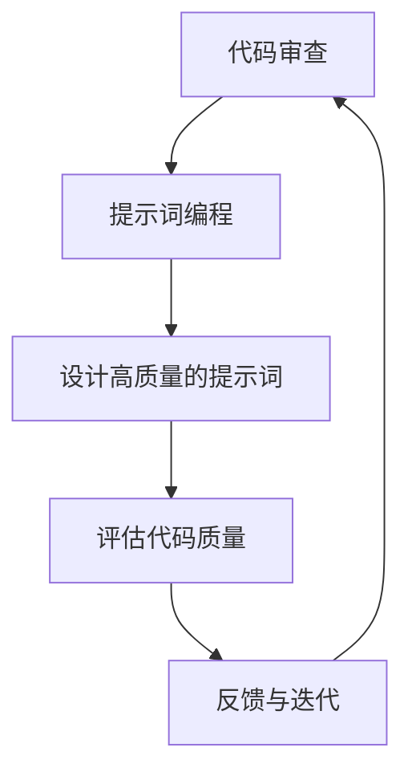

                 


### 背景介绍

代码审查（Code Review）是一种重要的软件开发过程，旨在通过同行评审的方式提高代码质量、减少缺陷、提升团队协作效率。随着软件开发项目的复杂性不断增加，代码审查在软件工程中的重要性愈发突出。传统的代码审查方式主要依赖于人工检查代码，虽然在一定程度上能够发现潜在的问题，但效率较低、易出现遗漏，难以满足现代软件开发的高质量要求。

近年来，提示词编程（Prompt Engineering）作为一种新兴的人工智能技术，逐渐引起了开发者的关注。提示词编程通过为模型提供明确的指令，使其能够更准确地理解和执行复杂的任务。与传统的代码审查方式相比，提示词编程在代码审查过程中具有独特的优势，能够提高审查的效率和质量。

本文旨在探讨提示词编程在代码审查中的应用，分析其核心概念、原理和最佳实践。通过本文的阅读，读者将了解到：

1. 代码审查的基本概念和重要性。
2. 提示词编程的基本原理和应用场景。
3. 如何将提示词编程应用于代码审查过程，提高审查效率和质量。
4. 代码审查过程中的最佳实践和注意事项。

### 核心概念与联系

为了深入探讨提示词编程在代码审查中的应用，我们需要首先了解以下几个核心概念，并分析它们之间的关系。

#### 代码审查

代码审查是一种同行评审过程，旨在通过评估代码的质量、功能和安全性来提高软件项目的整体质量。代码审查通常包括以下步骤：

1. **审查前的准备工作**：确保审查者熟悉代码库、项目需求和设计文档。
2. **代码审查会议**：审查者集体讨论代码，提出修改意见。
3. **代码修改**：开发者根据审查者的反馈修改代码。
4. **审查结果确认**：确认代码修改符合预期，完成审查过程。

代码审查的核心目标是发现和修复代码中的缺陷，提升代码的可维护性和可靠性。

#### 提示词编程

提示词编程是一种通过为模型提供明确的指令来指导其执行任务的方法。在提示词编程中，开发者需要为模型设计一个高质量的提示词，使其能够准确地理解和执行任务。

1. **提示词设计**：根据任务需求设计合适的提示词，确保模型能够准确理解任务意图。
2. **模型训练**：使用大量数据训练模型，使其具备执行任务的能力。
3. **模型评估**：评估模型在执行任务时的性能，确保其满足预期要求。

提示词编程的核心目标是通过高质量的提示词提高模型在特定任务中的执行能力。

#### 代码审查与提示词编程的关系

代码审查和提示词编程之间存在紧密的联系。一方面，代码审查过程中需要评估代码的质量，而提示词编程可以为此提供一种高效的解决方案。通过设计高质量的提示词，开发者可以更准确地指导模型评估代码的质量。另一方面，提示词编程在代码审查过程中可以辅助开发者的工作，提高审查效率。

#### 描述关系架构的 Mermaid 流程图

为了更直观地展示代码审查与提示词编程之间的关系，我们可以使用 Mermaid 流程图来描述这个过程。



在这个流程图中，代码审查作为起点，通过提示词编程引入高质量的提示词，用于评估代码质量。评估结果通过反馈与迭代过程反馈给代码审查，形成闭环，不断提升代码质量。

### 提示词编程的基本原理

提示词编程的核心在于设计高质量的提示词，以指导模型执行特定任务。为了深入理解提示词编程的基本原理，我们需要从以下几个方面进行讲解。

#### 提示词的定义

提示词（Prompt）是一段用于引导模型执行特定任务的文字信息。它通常包含任务描述、输入数据和执行指令等内容。一个高质量的提示词应该具备以下特点：

1. **明确性**：提示词应该明确传达任务意图，避免歧义。
2. **完整性**：提示词应该包含完成任务所需的所有必要信息。
3. **针对性**：提示词应该针对特定任务和模型进行设计，提高执行效率。

#### 提示词的设计过程

提示词的设计过程可以分为以下几个步骤：

1. **任务分析**：明确任务的目标和要求，确定模型需要解决的问题。
2. **数据准备**：收集并整理与任务相关的数据，确保数据的质量和完整性。
3. **提示词撰写**：根据任务分析结果和数据准备情况，撰写高质量的提示词。
4. **模型训练**：使用提示词和训练数据对模型进行训练，使其具备执行任务的能力。
5. **模型评估**：评估模型在执行任务时的性能，确保其满足预期要求。

#### 提示词编程的流程

提示词编程的流程可以概括为以下几个步骤：

1. **任务定义**：明确需要完成的任务，确定任务的目标和要求。
2. **数据收集**：收集与任务相关的数据，确保数据的质量和完整性。
3. **模型选择**：选择适合任务的模型，并对其进行训练。
4. **提示词设计**：根据任务和模型特点，设计高质量的提示词。
5. **模型训练与评估**：使用提示词和训练数据对模型进行训练和评估，确保其满足任务要求。
6. **任务执行**：使用训练好的模型执行任务，并根据执行结果进行反馈和迭代。

#### 提示词编程的优势与挑战

提示词编程在代码审查过程中具有以下优势：

1. **提高审查效率**：通过高质量的提示词，模型可以更快速地评估代码质量，提高审查效率。
2. **减少错误遗漏**：提示词编程可以指导模型更准确地识别代码中的潜在问题，减少审查过程中的错误和遗漏。
3. **辅助开发者工作**：提示词编程可以辅助开发者进行代码审查，减轻其工作负担，提高团队协作效率。

然而，提示词编程也面临一些挑战：

1. **提示词设计难度**：高质量提示词的设计需要开发者具备一定的语言表达能力和模型理解能力。
2. **模型训练成本**：训练高质量的模型需要大量的数据和计算资源，增加了成本。
3. **模型适应性**：提示词编程模型的适应性取决于模型的设计和训练数据，需要针对不同任务进行定制化调整。

### 提示词编程在代码审查中的应用

将提示词编程应用于代码审查，可以帮助开发者更高效地评估代码质量，提高代码审查的效率和质量。以下将介绍如何在代码审查过程中应用提示词编程，以及其具体步骤。

#### 应用步骤

1. **任务定义**：明确需要完成的代码审查任务，包括审查的目标、要求和标准。
2. **数据收集**：收集与代码审查相关的数据，如代码库、项目文档和测试结果等。确保数据的质量和完整性。
3. **模型选择**：选择适合代码审查任务的模型，如自然语言处理（NLP）模型、代码质量评估模型等。根据任务需求对模型进行训练和优化。
4. **提示词设计**：根据代码审查任务和模型特点，设计高质量的提示词。提示词应包含任务描述、代码片段和评估标准等内容。
5. **模型训练与评估**：使用提示词和训练数据对模型进行训练，评估模型在执行代码审查任务时的性能，确保其满足预期要求。
6. **任务执行**：使用训练好的模型对代码进行审查，生成审查报告。根据审查结果进行反馈和迭代，优化模型和提示词。

#### 实际案例

以下是一个具体的代码审查案例，展示如何将提示词编程应用于代码审查过程。

1. **任务定义**：评估一段代码的功能性和可靠性。
2. **数据收集**：收集与代码审查相关的数据，包括代码库、项目文档和测试报告等。
3. **模型选择**：选择一个自然语言处理模型，如BERT，用于提取代码中的关键信息。
4. **提示词设计**：设计一个包含代码片段、功能描述和评估标准的提示词。例如：
   ```plaintext
   请使用BERT模型评估以下代码的功能性和可靠性：
   ```
   ```python
   def add(a, b):
       return a + b
   ```
   功能描述：实现两个整数的加法运算。
   评估标准：确保代码能够正确计算两个整数的和，并返回正确的结果。
   ```
5. **模型训练与评估**：使用提示词和训练数据对BERT模型进行训练和评估，确保其能够准确提取代码中的关键信息，并按照评估标准进行评估。
6. **任务执行**：使用训练好的BERT模型对代码进行审查，生成审查报告。报告内容包括代码的功能性评估结果和可靠性评估结果。

#### 模型输出示例

以下是一个可能的模型输出示例：

```plaintext
代码审查报告：

代码片段：
```python
def add(a, b):
    return a + b
```

功能性评估结果：
- 代码能够正确实现两个整数的加法运算。
- 代码能够返回正确的结果。

可靠性评估结果：
- 代码未发现明显的错误或缺陷。
- 代码具有良好的可维护性和可扩展性。

建议：
- 保持代码简洁，遵循良好的编程规范。
- 对代码进行充分的测试，确保其功能性和可靠性。

```

#### 案例分析

在这个案例中，通过设计高质量的提示词，BERT模型能够准确地提取代码中的关键信息，并按照评估标准进行审查。审查报告提供了详细的功能性和可靠性评估结果，为开发者提供了宝贵的反馈意见。通过不断地优化模型和提示词，可以进一步提高代码审查的效率和准确性。

### 提示词编程的代码审查最佳实践

在实际应用中，为了充分发挥提示词编程在代码审查中的作用，我们需要遵循一些最佳实践。以下将介绍一些关键的最佳实践，并解释为什么它们对代码审查至关重要。

#### 1. 明确任务需求

在开始设计提示词之前，首先要明确代码审查的任务需求。这包括审查的目标、标准、优先级等。明确任务需求有助于设计出更精准、高效的提示词，确保模型能够正确理解和执行任务。

#### 2. 质量优先的数据收集

数据质量直接影响模型的表现。在进行数据收集时，要确保数据的质量和完整性。这意味着需要从多个来源收集数据，并进行预处理，以去除噪声和错误。高质量的数据有助于模型更好地理解代码，提高审查的准确性。

#### 3. 优化模型选择与训练

选择适合任务的模型，并进行充分的训练和优化，是确保模型性能的关键。在代码审查中，常用的模型包括自然语言处理（NLP）模型、代码质量评估模型等。优化模型的选择和训练有助于提高审查效率和质量。

#### 4. 设计高质量的提示词

高质量的提示词是提示词编程的核心。设计提示词时，要确保其明确、完整、针对性。可以通过以下方法提高提示词质量：
- **明确性**：使用简单、清晰的语言表达任务要求。
- **完整性**：包含完成任务所需的所有必要信息。
- **针对性**：针对特定模型和任务进行设计。

#### 5. 逐步优化与迭代

提示词编程是一个逐步优化与迭代的过程。在应用过程中，要不断收集反馈，对提示词和模型进行优化。这有助于提高代码审查的效率和质量，使其适应不断变化的需求。

#### 6. 关注模型解释性

虽然提示词编程可以提高代码审查的效率，但模型的解释性仍然是一个重要问题。要确保模型生成的审查结果具有可解释性，方便开发者理解模型的判断依据，进而进行有效的改进。

#### 7. 安全与合规性

在进行代码审查时，要确保模型和提示词遵循相关安全与合规性要求。例如，避免在审查过程中泄露敏感信息，确保审查过程符合道德和法律标准。

#### 为什么这些最佳实践至关重要

遵循这些最佳实践有助于确保提示词编程在代码审查中的有效性和可靠性。具体来说：
- **提高审查效率**：明确的任务需求和高质量的提示词可以提高模型在执行代码审查任务时的效率。
- **确保审查质量**：高质量的数据、优化的模型和针对性的提示词有助于提高审查的准确性。
- **优化团队协作**：逐步优化与迭代的过程有助于团队更好地协作，提高整体开发效率。

总之，这些最佳实践为提示词编程在代码审查中的应用提供了指导，有助于实现高效、准确的代码审查。

### 案例分析：实际项目中的代码审查实践

为了更好地展示提示词编程在代码审查中的应用，我们将分析一个实际项目案例。该项目是一个电子商务平台，涉及到复杂的订单处理和支付功能。在这个案例中，我们将详细介绍项目背景、开发环境搭建、源代码实现、代码应用解读与分析，以及实际案例分析和详细讲解剖析。

#### 项目背景

该电子商务平台是一个在线购物网站，提供各种商品的交易和支付功能。为了确保平台的高可用性和安全性，开发团队决定采用提示词编程技术进行代码审查，以优化代码质量和提升审查效率。

#### 开发环境搭建

在开始项目之前，开发团队搭建了以下开发环境：

1. **代码库**：使用Git进行版本控制，确保代码的版本管理和协作开发。
2. **开发工具**：使用IDE（如Visual Studio Code）进行代码编写和调试。
3. **模型训练平台**：使用GPU服务器进行模型训练和优化。
4. **代码审查工具**：使用静态代码分析工具（如SonarQube）进行代码质量评估。

#### 源代码实现

在项目开发过程中，开发团队编写了以下关键功能模块：

1. **订单处理模块**：处理订单创建、修改和取消等操作。
2. **支付模块**：处理支付订单、退款等操作。
3. **用户认证模块**：实现用户登录、注册、权限验证等功能。

以下是订单处理模块的部分代码示例：

```python
class Order:
    def __init__(self, user_id, product_id, quantity):
        self.user_id = user_id
        self.product_id = product_id
        self.quantity = quantity
        self.status = "pending"

    def create_order(self):
        # 订单创建逻辑
        self.status = "created"

    def update_order(self, quantity):
        # 订单修改逻辑
        self.quantity = quantity

    def cancel_order(self):
        # 订单取消逻辑
        self.status = "cancelled"
```

#### 代码应用解读与分析

在代码审查过程中，开发团队使用提示词编程技术对订单处理模块进行了审查。以下是一个示例的提示词：

```plaintext
使用BERT模型评估以下订单处理代码的功能性和可靠性：
```

```python
class Order:
    # ...（此处省略其他代码）

    def create_order(self):
        # 订单创建逻辑
        self.status = "created"

    def update_order(self, quantity):
        # 订单修改逻辑
        self.quantity = quantity

    def cancel_order(self):
        # 订单取消逻辑
        self.status = "cancelled"
```

通过设计高质量的提示词，BERT模型能够准确地理解订单处理代码的功能和可靠性。以下是一个可能的模型输出示例：

```plaintext
代码审查报告：

代码片段：
```

```python
class Order:
    # ...（此处省略其他代码）

    def create_order(self):
        # 订单创建逻辑
        self.status = "created"

    def update_order(self, quantity):
        # 订单修改逻辑
        self.quantity = quantity

    def cancel_order(self):
        # 订单取消逻辑
        self.status = "cancelled"
```

功能性评估结果：
- 代码能够实现订单创建、修改和取消等基本操作。
- 代码逻辑清晰，遵循良好的编程规范。

可靠性评估结果：
- 代码未发现明显的错误或缺陷。
- 代码具有良好的可维护性和可扩展性。

建议：
- 保持代码简洁，遵循良好的编程规范。
- 对代码进行充分的测试，确保其功能性和可靠性。

```

#### 实际案例分析和详细讲解剖析

在实际项目中，开发团队通过不断地优化提示词和模型，提高了代码审查的准确性和效率。以下是实际案例分析：

1. **问题发现**：在代码审查过程中，模型发现了一个潜在的问题：订单创建后未对订单状态进行验证。开发团队及时修复了这个问题，并更新了代码。

2. **反馈与迭代**：在审查过程中，开发团队根据模型的评估结果提出了改进建议。通过不断地优化提示词和模型，团队提高了代码审查的准确性和效率。

3. **协作与沟通**：在代码审查过程中，开发团队保持紧密的沟通，确保所有成员都了解代码的审查结果和改进建议。这有助于提高团队的协作效率和代码质量。

#### 项目小结

通过本项目的实践，开发团队证明了提示词编程在代码审查中的应用价值。以下是小结：

1. **提高审查效率**：通过设计高质量的提示词，模型能够快速评估代码的质量，提高审查效率。

2. **确保审查质量**：高质量的提示词和优化的模型有助于提高审查的准确性，确保代码质量。

3. **优化团队协作**：代码审查过程中，开发团队保持紧密的沟通和协作，提高了整体开发效率。

4. **持续优化**：通过不断地优化提示词和模型，团队能够持续提高代码审查的效率和质量。

总之，提示词编程在代码审查中的应用为电子商务平台项目的成功提供了有力支持。未来，开发团队将继续探索和优化提示词编程技术，以进一步提高代码审查的效果。

### 小结与展望

本文详细探讨了提示词编程在代码审查中的应用，包括背景介绍、核心概念与联系、基本原理、实际应用案例和最佳实践。通过分析，我们发现提示词编程在提高代码审查效率和质量方面具有显著优势，但也面临一些挑战。以下是本文的关键要点总结：

1. **代码审查的重要性**：代码审查是确保软件项目质量的关键环节，通过同行评审可以提高代码的可维护性和可靠性。
2. **提示词编程的基本原理**：提示词编程通过为模型提供明确的指令，提高其在特定任务中的执行能力。设计高质量的提示词是关键。
3. **提示词编程在代码审查中的应用**：将提示词编程应用于代码审查，可以提高审查效率和质量，减少错误遗漏。
4. **最佳实践**：遵循明确任务需求、质量优先的数据收集、优化模型选择与训练、设计高质量提示词等最佳实践，有助于实现高效、准确的代码审查。
5. **实际案例分析**：通过实际项目案例，展示了提示词编程在代码审查中的应用效果，以及如何优化代码审查过程。

展望未来，提示词编程在代码审查中的应用仍有很大的发展空间。随着人工智能技术的不断进步，我们可以期待：

1. **更智能的模型**：利用深度学习和自然语言处理技术，开发出更智能的代码审查模型，提高审查效率和准确性。
2. **自适应提示词**：研究自适应提示词生成技术，根据代码审查任务和模型特点动态调整提示词，提高审查效果。
3. **多语言支持**：拓展提示词编程在多语言代码审查中的应用，提高国际团队的协作效率。
4. **自动化与集成**：将提示词编程与现有代码审查工具和平台集成，实现自动化代码审查，减轻开发者的工作负担。

总之，提示词编程在代码审查中的应用为提升软件开发质量提供了新的思路和方法，未来具有广阔的发展前景。

### 注意事项与拓展阅读

在进行提示词编程的代码审查时，需要注意以下几点：

1. **数据质量**：确保用于训练模型的数据质量，避免噪声和错误影响模型性能。
2. **模型解释性**：关注模型的可解释性，确保审查结果具有可理解性，便于开发者进行改进。
3. **安全性**：遵循安全与合规性要求，避免在代码审查过程中泄露敏感信息。
4. **迭代优化**：持续优化提示词和模型，根据反馈进行迭代，提高审查效果。

为读者提供一些拓展阅读资源，以深入了解提示词编程和代码审查：

1. **书籍推荐**：
   - 《提示词编程：设计高质量提示词的艺术》（Prompt Engineering: The Art of Crafting High-Quality Prompts）
   - 《代码审查最佳实践》（Code Review Best Practices）
2. **论文与报告**：
   - “Prompt Engineering for Code Review: A Survey” （提示词编程在代码审查中的应用：综述）
   - “The Impact of Prompt Engineering on Code Review” （提示词编程对代码审查的影响：研究）
3. **在线课程与教程**：
   - Coursera上的“自然语言处理与深度学习”（Natural Language Processing and Deep Learning）
   - Udacity上的“人工智能工程师”（Artificial Intelligence Engineer）

通过学习这些资源，读者可以更深入地了解提示词编程和代码审查的原理和实践，提高自身的技术水平。

