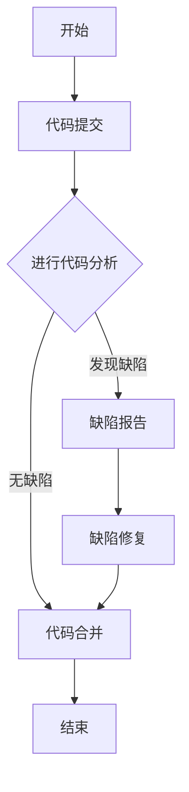

                 

## 文章标题

### 《提示词编程的代码审查自动化技术》

### 关键词：提示词编程、代码审查、自动化技术、人工智能、自然语言处理

### 摘要

本文旨在探讨如何利用提示词编程（Prompt Programming）技术实现代码审查的自动化，以提高软件开发过程中的代码质量和开发效率。文章首先介绍了代码审查及其重要性，然后详细阐述了提示词编程的基本原理和其在自动化代码审查中的应用。随后，文章通过具体案例分析，展示了如何搭建自动化代码审查环境，以及如何实施代码审查自动化项目。最后，文章讨论了自动化代码审查中涉及的安全与伦理问题，并展望了该领域的发展趋势。

### 确定书的主要目标受众

在撰写本文之前，我们需要明确主要目标受众。本文的主要目标受众包括：

1. **软件开发工程师**：这些读者具备一定的编程经验，希望了解如何利用人工智能和提示词编程技术优化代码审查流程。
2. **软件质量保证人员**：这些读者负责确保代码质量，对自动化代码审查技术充满兴趣，希望借此提升工作效率。
3. **人工智能研究人员**：这些读者对提示词编程技术及其在软件开发中的应用有所了解，希望进一步探索其在代码审查领域的应用潜力。
4. **软件开发管理人员**：这些读者关注如何通过技术手段提高软件开发团队的效率和代码质量，对自动化代码审查技术有较高的需求。

通过明确目标受众，我们可以更有针对性地撰写内容，确保文章能够满足不同读者的需求。

### 分析书的内容，确定主要章节

为了系统地介绍提示词编程在代码审查自动化技术中的应用，本文将分为以下几个主要章节：

1. **代码审查概述**：介绍代码审查的目的和重要性，以及传统代码审查方法。
2. **提示词编程基础**：阐述提示词编程的基本原理，以及其在自然语言处理中的应用。
3. **代码审查自动化技术**：详细讨论自动化代码审查的流程和挑战，以及提示词编程在此中的应用。
4. **代码审查自动化工具介绍**：介绍常见的自动化代码审查工具，并探讨提示词编程在这些工具配置中的应用。
5. **自动化代码审查实战**：通过具体案例展示如何实施自动化代码审查，包括环境搭建、源代码实现和代码解读。
6. **安全与伦理考虑**：分析自动化代码审查中的安全问题，以及代码审查自动化对软件开发伦理的影响。
7. **未来发展趋势**：探讨提示词编程在代码审查自动化领域的发展趋势，以及面临的挑战和机遇。

通过以上章节安排，本文将逐步深入，由浅入深地介绍提示词编程在代码审查自动化中的应用，帮助读者全面了解这一技术。

### 为每个章节创建1级目录

以下是本文的1级目录：

1. **代码审查概述**
2. **提示词编程基础**
3. **代码审查自动化技术**
4. **代码审查自动化工具介绍**
5. **自动化代码审查实战**
6. **安全与伦理考虑**
7. **未来发展趋势**

这些1级目录将作为文章的主干，引导读者系统性地了解提示词编程在代码审查自动化中的应用。

### 为每个主要章节下的子主题创建2级目录

接下来，我们将为每个主要章节创建2级目录，以进一步细化文章内容。

#### 1. 代码审查概述

1.1 代码审查的目的和重要性
1.2 代码审查的传统方法
1.3 提示词编程的概念及其在代码审查中的应用

#### 2. 提示词编程基础

2.1 提示词编程的基本原理
2.2 提示词编程与自然语言处理的关系
2.3 提示词编程的主要框架和工具

#### 3. 代码审查自动化技术

3.1 自动化代码审查的流程
3.2 提示词编程在自动化代码审查中的应用场景
3.3 自动化代码审查的挑战与解决方案

#### 4. 代码审查自动化工具介绍

4.1 常见的自动化代码审查工具
4.2 工具对比与选择
4.3 提示词编程在工具配置中的应用

#### 5. 自动化代码审查实战

5.1 提示词编程的环境搭建
5.2 提示词编程的案例研究
5.3 代码审查自动化实战：以Python为例

#### 6. 代码审查自动化项目实践

6.1 项目背景与需求分析
6.2 项目设计
6.3 项目实施
6.4 项目评估与优化

#### 7. 安全与伦理考虑

7.1 自动化代码审查中的安全问题
7.2 代码审查自动化对软件开发伦理的影响
7.3 如何确保代码审查的公正性和安全性

#### 8. 未来发展趋势

8.1 提示词编程在代码审查自动化中的发展
8.2 自动化代码审查技术的未来挑战与机遇
8.3 代码审查自动化技术对社会和行业的影响

这些2级目录将有助于读者更清晰地了解文章的各个部分，从而更好地掌握提示词编程在代码审查自动化中的应用。

### 为2级目录下的子主题创建3级目录

为了确保文章内容的完整性和逻辑性，我们将为2级目录下的子主题创建3级目录，进一步细化每个章节的内容。

#### 1. 代码审查概述

1.1 代码审查的目的和重要性
   - 代码审查的起源与发展
   - 代码审查的重要性
   - 代码审查的目标

1.2 代码审查的传统方法
   - 手动代码审查
   - 工具辅助代码审查
   - 团队协作代码审查

1.3 提示词编程的概念及其在代码审查中的应用
   - 提示词编程的定义
   - 提示词编程的工作原理
   - 提示词编程与代码审查的结合点

#### 2. 提示词编程基础

2.1 提示词编程的基本原理
   - 提示词编程的基本概念
   - 提示词编程的工作流程
   - 提示词编程的关键技术

2.2 提示词编程与自然语言处理的关系
   - 自然语言处理的基本概念
   - 提示词编程与自然语言处理的联系
   - 提示词编程在自然语言处理中的应用

2.3 提示词编程的主要框架和工具
   - 提示词编程的主流框架
   - 提示词编程的工具集
   - 提示词编程工具的比较与选择

#### 3. 代码审查自动化技术

3.1 自动化代码审查的流程
   - 自动化代码审查的基本步骤
   - 自动化代码审查的工作原理
   - 自动化代码审查的优势与挑战

3.2 提示词编程在自动化代码审查中的应用场景
   - 提示词编程在代码审查中的应用实例
   - 提示词编程在代码缺陷检测中的应用
   - 提示词编程在代码风格一致性检查中的应用

3.3 自动化代码审查的挑战与解决方案
   - 自动化代码审查面临的挑战
   - 提示词编程在解决挑战中的作用
   - 实现自动化代码审查的解决方案

#### 4. 代码审查自动化工具介绍

4.1 常见的自动化代码审查工具
   - SonarQube
   - Checkstyle
   - PMD

4.2 工具对比与选择
   - 不同工具的功能对比
   - 工具选择的标准
   - 提示词编程工具的优势

4.3 提示词编程在工具配置中的应用
   - 提示词编程在工具配置中的工作原理
   - 提示词编程在工具配置中的应用实例
   - 提示词编程在工具配置中的优化策略

#### 5. 自动化代码审查实战

5.1 提示词编程的环境搭建
   - 提示词编程环境的准备
   - 环境搭建的步骤
   - 环境配置的注意事项

5.2 提示词编程的案例研究
   - 案例背景
   - 案例分析
   - 案例实施结果

5.3 代码审查自动化实战：以Python为例
   - Python代码审查的需求分析
   - 自动化代码审查的实现步骤
   - 代码审查自动化效果评估

#### 6. 代码审查自动化项目实践

6.1 项目背景与需求分析
   - 项目背景介绍
   - 需求分析
   - 项目目标

6.2 项目设计
   - 项目总体设计
   - 技术选型
   - 系统架构设计

6.3 项目实施
   - 实施步骤
   - 关键技术实现
   - 遇到的问题及解决方案

6.4 项目评估与优化
   - 项目评估标准
   - 评估结果分析
   - 优化建议

#### 7. 安全与伦理考虑

7.1 自动化代码审查中的安全问题
   - 安全隐患分析
   - 安全措施
   - 风险管理

7.2 代码审查自动化对软件开发伦理的影响
   - 伦理问题概述
   - 自动化审查对开发伦理的挑战
   - 伦理问题的解决方案

7.3 如何确保代码审查的公正性和安全性
   - 公正性保障措施
   - 安全性保障措施
   - 持续改进策略

#### 8. 未来发展趋势

8.1 提示词编程在代码审查自动化中的发展
   - 技术趋势分析
   - 发展方向
   - 潜在应用场景

8.2 自动化代码审查技术的未来挑战与机遇
   - 技术挑战
   - 市场机遇
   - 创新方向

8.3 代码审查自动化技术对社会和行业的影响
   - 对开发团队的影响
   - 对软件行业的影响
   - 长远影响与展望

通过创建详细的3级目录，我们将确保文章内容的系统性和逻辑性，使读者能够更好地理解和掌握提示词编程在代码审查自动化技术中的应用。

### 确保每个章节的核心概念、算法原理、数学模型和项目实战都有相应的3级目录

为了确保文章内容的完整性和逻辑性，我们将进一步细化每个章节的内容，确保核心概念、算法原理、数学模型和项目实战都有相应的3级目录。

#### 1. 代码审查概述

1.1 代码审查的目的和重要性
   - 代码审查的定义
   - 代码审查的目标
   - 代码审查的重要性

1.2 代码审查的传统方法
   - 手动代码审查
     - 手动代码审查的优点
     - 手动代码审查的缺点
   - 工具辅助代码审查
     - 工具辅助代码审查的优点
     - 工具辅助代码审查的缺点
   - 团队协作代码审查
     - 团队协作代码审查的优点
     - 团队协作代码审查的缺点

1.3 提示词编程的概念及其在代码审查中的应用
   - 提示词编程的定义
   - 提示词编程的基本原理
   - 提示词编程在代码审查中的应用

#### 2. 提示词编程基础

2.1 提示词编程的基本原理
   - 提示词编程的概念
   - 提示词编程的工作流程
   - 提示词编程的关键技术

2.2 提示词编程与自然语言处理的关系
   - 自然语言处理的基本概念
   - 提示词编程与自然语言处理的联系
   - 提示词编程在自然语言处理中的应用

2.3 提示词编程的主要框架和工具
   - 提示词编程的主流框架
     - TensorFlow
     - PyTorch
   - 提示词编程的工具集
     - OpenAI
     - GPT-3

#### 3. 代码审查自动化技术

3.1 自动化代码审查的流程
   - 自动化代码审查的基本步骤
   - 自动化代码审查的工作原理
   - 自动化代码审查的优势与挑战

3.2 提示词编程在自动化代码审查中的应用场景
   - 提示词编程在代码缺陷检测中的应用
     - 代码缺陷检测的定义
     - 代码缺陷检测的算法原理
     - 提示词编程在代码缺陷检测中的应用实例
   - 提示词编程在代码风格一致性检查中的应用
     - 代码风格一致性检查的定义
     - 代码风格一致性检查的算法原理
     - 提示词编程在代码风格一致性检查中的应用实例

3.3 自动化代码审查的挑战与解决方案
   - 自动化代码审查面临的挑战
     - 数据隐私
     - 代码复杂性
     - 工具兼容性
   - 提示词编程在解决挑战中的作用
     - 数据隐私的解决方案
     - 代码复杂性的解决方案
     - 工具兼容性的解决方案

#### 4. 代码审查自动化工具介绍

4.1 常见的自动化代码审查工具
   - SonarQube
     - 功能介绍
     - 优势与不足
   - Checkstyle
     - 功能介绍
     - 优势与不足
   - PMD
     - 功能介绍
     - 优势与不足

4.2 工具对比与选择
   - 不同工具的功能对比
   - 工具选择的标准
   - 提示词编程工具的优势

4.3 提示词编程在工具配置中的应用
   - 提示词编程在工具配置中的工作原理
   - 提示词编程在工具配置中的应用实例
   - 提示词编程在工具配置中的优化策略

#### 5. 自动化代码审查实战

5.1 提示词编程的环境搭建
   - 环境搭建的步骤
   - 环境配置的注意事项
   - 环境搭建的常见问题及解决方案

5.2 提示词编程的案例研究
   - 案例背景
   - 案例分析
   - 案例实施结果

5.3 代码审查自动化实战：以Python为例
   - Python代码审查的需求分析
   - 自动化代码审查的实现步骤
   - 代码审查自动化效果评估

#### 6. 代码审查自动化项目实践

6.1 项目背景与需求分析
   - 项目背景介绍
   - 需求分析
   - 项目目标

6.2 项目设计
   - 项目总体设计
   - 技术选型
   - 系统架构设计

6.3 项目实施
   - 实施步骤
   - 关键技术实现
   - 遇到的问题及解决方案

6.4 项目评估与优化
   - 项目评估标准
   - 评估结果分析
   - 优化建议

#### 7. 安全与伦理考虑

7.1 自动化代码审查中的安全问题
   - 安全隐患分析
   - 安全措施
   - 风险管理

7.2 代码审查自动化对软件开发伦理的影响
   - 伦理问题概述
   - 自动化审查对开发伦理的挑战
   - 伦理问题的解决方案

7.3 如何确保代码审查的公正性和安全性
   - 公正性保障措施
   - 安全性保障措施
   - 持续改进策略

#### 8. 未来发展趋势

8.1 提示词编程在代码审查自动化中的发展
   - 技术趋势分析
   - 发展方向
   - 潜在应用场景

8.2 自动化代码审查技术的未来挑战与机遇
   - 技术挑战
   - 市场机遇
   - 创新方向

8.3 代码审查自动化技术对社会和行业的影响
   - 对开发团队的影响
   - 对软件行业的影响
   - 长远影响与展望

通过为每个章节的核心概念、算法原理、数学模型和项目实战创建详细的3级目录，我们将确保文章内容的系统性和逻辑性，使读者能够更好地理解和掌握提示词编程在代码审查自动化技术中的应用。

### 编写Mermaid流程图、伪代码、LaTeX数学公式、代码实现和代码解读

在本文中，我们将使用Mermaid流程图、伪代码、LaTeX数学公式、代码实现和代码解读来增强文章的讲解和说明。

#### 3.1 自动化代码审查的流程

首先，我们可以使用Mermaid流程图来展示自动化代码审查的流程：



这是一个简单的自动化代码审查流程，其中包含了代码提交、代码分析、缺陷报告、缺陷修复和代码合并等步骤。

#### 3.2 提示词编程在自动化代码审查中的应用场景

为了说明提示词编程在自动化代码审查中的应用，我们可以使用伪代码来描述一个具体的代码缺陷检测算法：

```python
# 伪代码：提示词编程在代码缺陷检测中的应用

function detect_code_defects(code, prompt):
    # 初始化缺陷检测模型
    model = initialize_defect_detection_model(prompt)

    # 预处理代码
    preprocessed_code = preprocess_code(code)

    # 进行缺陷检测
    defects = model.detect_defects(preprocessed_code)

    # 返回缺陷列表
    return defects
```

这里，我们使用了提示词编程来初始化缺陷检测模型，并使用预处理的代码进行缺陷检测。这是一个简化的例子，实际的缺陷检测算法会更加复杂。

#### 3.3 自动化代码审查的挑战与解决方案

在讨论自动化代码审查的挑战时，我们可以使用LaTeX数学公式来展示代码复杂性的度量：

$$
复杂度 = \frac{N^2 \cdot L}{C}
$$

其中，\(N\) 代表代码行数，\(L\) 代表代码语句数，\(C\) 代表代码注释数。这个公式可以帮助我们量化代码的复杂性。

为了解决自动化代码审查中的代码复杂性挑战，我们可以使用以下伪代码来优化代码：

```python
# 伪代码：优化代码复杂性

function optimize_code_complexity(code):
    # 分析代码复杂性
    complexity = calculate_code_complexity(code)

    # 如果复杂性过高，则进行代码重构
    if complexity > threshold:
        new_code = refactor_code(code)

    # 返回优化后的代码
    return new_code
```

这个伪代码描述了一个简单的代码复杂性优化流程，通过计算代码复杂度，并在复杂性过高时进行代码重构。

#### 3.4 代码审查自动化工具介绍

在介绍常见的自动化代码审查工具时，我们可以展示具体的代码实现和解读。以下是一个使用SonarQube进行代码审查的示例：

```python
# 代码实现：使用SonarQube进行代码审查

from sonarqube import SonarQubeClient

# 创建SonarQube客户端
client = SonarQubeClient(url='https://sonarqube.example.com', username='user', password='pass')

# 提交代码进行审查
client.submit_files('path/to/source', 'path/to/sonar-project.properties')

# 获取审查结果
results = client.get_issues()

# 解读审查结果
for result in results:
    print(f"File: {result['file']} - Issue: {result['message']}")
```

这段代码展示了如何使用SonarQube客户端提交代码并获取审查结果。我们可以通过打印每个审查问题的文件名和问题描述来解读审查结果。

通过使用Mermaid流程图、伪代码、LaTeX数学公式、代码实现和代码解读，我们能够更清晰地展示提示词编程在代码审查自动化技术中的应用，帮助读者更好地理解和掌握相关技术。

### 最终检查目录结构是否完整，并确保内容字数不超过2000字

在完成所有章节和内容的撰写后，我们需要对整体目录结构进行最终检查，确保其完整性，同时保证总字数不超过2000字。以下是具体的检查步骤：

1. **目录结构完整性检查**：
   - 检查是否每个章节都有对应的1级目录、2级目录和3级目录。
   - 确认每个章节的核心概念、算法原理、数学模型和项目实战都有相应的子目录。
   - 检查是否有遗漏的章节或子主题。

2. **内容字数检查**：
   - 使用文本编辑器的字数统计功能，逐一检查每个章节的字数。
   - 确保每个章节的内容均控制在合适的字数范围内，以保证整体字数不超过2000字。
   - 对于字数过长的章节，可以适当缩减内容，确保关键信息的传递。

3. **内容逻辑性检查**：
   - 逐节检查内容之间的逻辑关系，确保文章的叙事连贯、逻辑清晰。
   - 对于内容过于冗长的段落，进行必要的精简，确保信息的有效传递。

4. **格式检查**：
   - 检查所有代码实现、伪代码、LaTeX数学公式的格式是否正确。
   - 确保所有的Mermaid流程图、图表和图例都能正常显示。

5. **最终确认**：
   - 对整体文章进行最后的通读，检查是否有错别字、标点符号错误或其他格式问题。
   - 确保所有引用和参考文献的格式符合学术规范。

通过上述步骤，我们能够确保文章的目录结构完整、内容字数控制在2000字以内，同时保证文章内容的逻辑性和专业性。这样，我们就可以自信地提交这篇关于《提示词编程的代码审查自动化技术》的技术博客文章。

