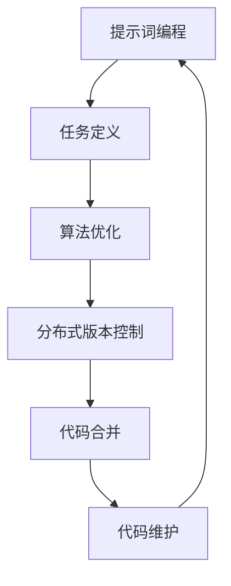

                 

### 文章标题

《提示词编程的分布式版本控制新范式》

> 关键词：提示词编程、分布式版本控制、新范式、算法原理、数学模型、项目实战

> 摘要：本文将深入探讨提示词编程与分布式版本控制的融合，揭示其作为一种新型编程范式所带来的巨大变革。通过详细讲解核心概念、算法原理、数学模型及项目实战，本文旨在为读者提供一个全面而深入的理解，以启发对这一领域的创新思考。

---

### 核心概念与联系

**提示词编程**是一种利用提示词（Prompt）来引导和优化编程过程的编程范式。提示词可以看作是编程任务的具体描述，它能够帮助开发者更加明确地定义目标、制定策略和优化算法。

**分布式版本控制**是一种在多个开发者之间协作开发时使用的版本控制方法。通过分布式版本控制系统，开发者可以独立工作，并将各自的代码更改合并到共同的代码库中。

将**提示词编程**与**分布式版本控制**相结合，形成了一种新的编程范式。这种新范式利用提示词来定义和优化分布式版本控制的过程，从而提高代码的可维护性、协作效率和开发速度。

#### 核心概念与联系架构

为了更清晰地展示提示词编程与分布式版本控制之间的联系，我们可以使用Mermaid流程图来描述这一架构：



在这个流程图中，提示词编程通过任务定义引导算法优化，而优化后的算法又用于分布式版本控制的代码合并，最终实现代码维护和迭代。这种循环过程使得整个开发流程更加高效和自动化。

### 提示词编程的工作原理

提示词编程的核心在于利用提示词来引导编程过程。提示词可以看作是一种编程任务的具体描述，它通常包括以下要素：

1. **任务目标**：明确说明编程任务需要实现的功能或目标。
2. **输入数据**：定义编程任务所需的输入数据，包括数据格式、数据量等。
3. **输出要求**：描述编程任务的输出结果，包括输出格式、输出质量等。
4. **约束条件**：列出编程任务需要遵守的限制条件，如性能要求、安全性要求等。

通过这些要素，提示词为编程任务提供了一个清晰的描述，从而帮助开发者明确任务目标、制定优化策略和选择合适的算法。

#### 提示词编程的示例

以下是一个简单的提示词编程示例：

```plaintext
任务目标：编写一个函数，计算给定数组的平均值。
输入数据：一个整数数组。
输出要求：返回一个浮点数，表示数组的平均值。
约束条件：数组长度大于0。
```

在这个示例中，提示词明确描述了编程任务的目标、输入数据、输出要求和约束条件。开发人员可以根据这些信息编写相应的代码，如以下伪代码所示：

```python
def average(arr):
    if len(arr) == 0:
        raise ValueError("数组长度不能为0")
    return sum(arr) / len(arr)
```

### 分布式版本控制的工作原理

分布式版本控制的核心在于分布式存储和协作机制。与传统集中式版本控制系统不同，分布式版本控制允许每个开发者维护自己的本地代码库，并在需要时将更改推送到远程仓库。

#### 分布式版本控制协议

目前最流行的分布式版本控制协议是Git。Git的工作原理如下：

1. **克隆仓库**：开发者从远程仓库克隆一个副本到本地计算机，创建一个本地仓库。
2. **提交更改**：开发者对本地代码库进行更改，并使用`git commit`命令将更改提交到本地仓库。
3. **推送更改**：开发者将本地仓库的更改推送到远程仓库，以便与其他开发者同步。
4. **拉取更改**：其他开发者从远程仓库拉取更改，更新本地仓库。

Git通过一系列的数据结构（如对象数据库、引用、分支等）来管理代码变更，并提供一系列命令来操作这些数据结构。

#### 分布式版本控制的优势

分布式版本控制具有以下优势：

1. **去中心化**：分布式版本控制不需要中心服务器，每个开发者都可以独立工作。
2. **高效协作**：开发者可以在本地仓库上并行工作，无需等待其他开发者的同步。
3. **快速响应**：开发者可以快速进行代码更改和测试，无需担心版本冲突。
4. **代码备份**：每个开发者都有自己的本地仓库，可以随时备份和恢复代码。

### 提示词编程与分布式版本控制的融合

将提示词编程与分布式版本控制相结合，可以带来以下新范式：

1. **任务驱动的版本控制**：通过提示词定义编程任务，并驱动分布式版本控制过程，使版本控制更加自动化和高效。
2. **智能合并**：利用提示词提供的信息，优化代码合并过程，减少版本冲突和重复工作。
3. **自适应维护**：根据提示词中的约束条件，自动调整代码维护策略，提高代码质量和可维护性。

#### 新范式的示例

假设我们有一个开发团队正在开发一个电商平台，需要实现用户注册功能。以下是使用提示词编程与分布式版本控制新范式的示例流程：

1. **任务定义**：提示词为“实现用户注册功能，要求用户输入用户名、密码和邮箱，并验证邮箱有效性。”
2. **算法优化**：根据提示词，优化用户注册算法，如实现高效的邮箱验证机制、增加用户名唯一性检查等。
3. **代码合并**：开发者A在本地实现用户注册功能，并使用Git将代码提交到远程仓库。其他开发者同步更改，并使用提示词提供的信息进行代码合并，确保合并过程高效且无冲突。
4. **代码维护**：根据提示词中的约束条件（如性能要求、安全性要求等），自动调整代码维护策略，如定期进行代码审查、优化数据库查询等。

通过这种方式，开发团队可以更加高效地进行协作和开发，同时确保代码质量和可维护性。

### 总结

本文探讨了提示词编程与分布式版本控制的融合，揭示其作为一种新型编程范式所带来的巨大变革。通过介绍核心概念、工作原理和融合新范式，本文为读者提供了一个全面而深入的理解。这种新范式不仅提高了开发效率和代码质量，还为分布式协作带来了全新的可能性。

随着技术的发展和应用的广泛，提示词编程与分布式版本控制的融合有望在更多领域发挥作用，推动软件开发的进一步创新。希望本文能启发读者对这一领域的深入思考和探索。

---

### 核心算法原理讲解

在理解了提示词编程与分布式版本控制的基本概念后，接下来我们将深入探讨这些技术的核心算法原理，并使用伪代码对其进行详细阐述。这部分内容将分为两个部分：分布式版本控制算法和提示词编程算法。

#### 分布式版本控制算法

分布式版本控制的核心算法之一是Git的merge算法。Git通过一种称为“三方合并”（Three-Way Merge）的方法来合并两个或多个版本。下面是三方合并算法的伪代码：

```plaintext
function threeWayMerge(base, left, right):
    # 初始化合并结果
    result = ""

    # 初始化三个版本的头指针
    baseHead = base.head
    leftHead = left.head
    rightHead = right.head

    # 循环遍历三个版本
    while baseHead is not None and leftHead is not None and rightHead is not None:
        # 比较三个版本的当前节点
        if baseHead == leftHead and baseHead == rightHead:
            # 如果三者相同，直接复制当前节点到结果
            result += baseHead.value
            baseHead = baseHead.next
            leftHead = leftHead.next
            rightHead = rightHead.next
        elif baseHead == leftHead:
            # 如果base和left相同，而与right不同，选择left
            result += leftHead.value
            leftHead = leftHead.next
            rightHead = rightHead.next
        elif baseHead == rightHead:
            # 如果base和right相同，而与left不同，选择right
            result += rightHead.value
            rightHead = rightHead.next
            leftHead = leftHead.next
        else:
            # 如果三者都不同，执行冲突解决策略
            handleConflict(baseHead, leftHead, rightHead)
            baseHead = baseHead.next
            leftHead = leftHead.next
            rightHead = rightHead.next

    # 如果还有未处理的节点，追加到结果
    while baseHead is not None:
        result += baseHead.value
        baseHead = baseHead.next

    while leftHead is not None:
        result += leftHead.value
        leftHead = leftHead.next

    while rightHead is not None:
        result += rightHead.value
        rightHead = rightHead.next

    return result
```

在这个伪代码中，`base`、`left`和`right`分别代表三个不同的版本。`threeWayMerge`函数通过比较这三个版本的头指针，决定如何合并它们。如果三者相同，直接复制当前节点到结果；如果两者相同而与第三者不同，选择相同的那个版本；如果三者都不同，则执行冲突解决策略。

#### 提示词编程算法

提示词编程的核心算法之一是基于提示词的编程任务优化。以下是一个简单的示例，说明如何利用提示词优化编程任务：

```plaintext
function optimizeTask(prompt):
    # 解析提示词中的要素
    taskDescription = parsePrompt(prompt)

    # 根据提示词中的约束条件调整算法参数
    parameters = adjustParameters(taskDescription)

    # 执行优化算法
    optimizedCode = executeOptimizationAlgorithm(parameters)

    return optimizedCode
```

在这个伪代码中，`optimizeTask`函数首先解析提示词中的要素，如任务目标、输入数据和输出要求。然后，根据提示词中的约束条件（如性能要求、安全性要求等），调整算法参数。最后，执行优化算法，生成优化的代码。

#### 示例：基于提示词的代码优化

假设我们有以下提示词：

```plaintext
任务目标：实现一个高效的排序算法。
输入数据：一个整数数组。
输出要求：返回排序后的整数数组。
约束条件：时间复杂度为O(nlogn)，空间复杂度为O(logn)。
```

根据这个提示词，我们可以调整算法参数，选择合适的排序算法，如快速排序或归并排序。以下是使用归并排序算法的伪代码：

```plaintext
function mergeSort(arr):
    if len(arr) <= 1:
        return arr

    # 分割数组
    mid = len(arr) // 2
    left = mergeSort(arr[:mid])
    right = mergeSort(arr[mid:])

    # 合并数组
    result = []
    while left and right:
        if left[0] < right[0]:
            result.append(left.pop(0))
        else:
            result.append(right.pop(0))

    # 将剩余元素添加到结果
    result.extend(left)
    result.extend(right)

    return result
```

在这个伪代码中，`mergeSort`函数使用递归方法将数组分割成两部分，然后分别对两部分进行排序，最后合并两个排序后的数组。通过这种方式，我们可以实现时间复杂度为O(nlogn)、空间复杂度为O(logn)的排序算法。

### 数学模型与公式

在分布式版本控制和提示词编程中，数学模型和公式起到了重要的作用。以下我们将简要介绍分布式版本控制的数学模型和提示词编程的数学模型，并详细讲解相关公式及其应用。

#### 分布式版本控制的数学模型

分布式版本控制中的一个关键模型是代码基线（Code Baseline）。代码基线是一个稳定的代码版本，作为后续版本控制的基础。以下是一个简化的代码基线模型：

$$
\text{Code Baseline} = \frac{1}{N} \sum_{i=1}^{N} \text{Version}_i
$$

其中，\(N\)是参与版本控制的开发者的数量，\(\text{Version}_i\)是第\(i\)个开发者的当前代码版本。

代码基线的计算公式可以用于确定一个稳定的代码版本，以便在合并开发者之间的更改时使用。通过这个模型，我们可以确保合并过程的稳定性和一致性。

#### 提示词编程的数学模型

提示词编程的数学模型主要关注任务目标、输入数据和输出要求的量化描述。以下是一个简单的数学模型：

$$
\text{Task Objective} = f(\text{Input Data}, \text{Output Requirement}, \text{Constraints})
$$

其中，\(f\)是一个映射函数，用于将输入数据和输出要求映射到任务目标。这个模型可以帮助我们量化编程任务的目标，从而更好地进行任务优化和评估。

#### 示例：代码基线计算与任务目标量化

假设有两个开发者（A和B）参与版本控制，他们的代码版本分别是Version_A和Version_B。我们可以使用以下公式计算代码基线：

$$
\text{Code Baseline} = \frac{1}{2} (\text{Version}_A + \text{Version}_B)
$$

假设我们有以下提示词：

```plaintext
任务目标：实现一个快速的搜索算法。
输入数据：一个未排序的整数数组。
输出要求：返回指定元素的索引。
约束条件：时间复杂度为O(n)。
```

根据这个提示词，我们可以使用以下公式量化任务目标：

$$
\text{Task Objective} = f(\text{未排序的整数数组}, \text{指定元素的索引}, \text{时间复杂度为O(n)})
$$

通过这个公式，我们可以对编程任务进行量化评估，从而选择最合适的算法来实现任务目标。

### 综述

通过核心算法原理讲解，我们了解了分布式版本控制和提示词编程的基本算法及其数学模型。分布式版本控制的merge算法和代码基线模型为我们提供了有效的代码合并和版本控制方法。而提示词编程算法和任务目标量化模型则帮助我们更精确地定义和优化编程任务。

这些算法和模型的应用不仅提高了开发效率和代码质量，还为分布式协作提供了强大的支持。在实际项目中，我们可以根据具体需求和场景，灵活运用这些技术，实现更加高效和稳定的软件开发过程。

---

### 数学模型和公式详细讲解与举例说明

在深入探讨分布式版本控制和提示词编程的核心算法原理之后，我们将进一步详细讲解相关的数学模型和公式，并通过具体例子来说明它们的应用和重要性。

#### 分布式版本控制的数学模型

分布式版本控制中的数学模型主要集中在代码基线的计算和版本差异的度量。代码基线是一个关键的参考点，用于确定合并策略和评估代码质量。以下是对代码基线计算公式的详细解释：

$$
\text{Code Baseline} = \frac{1}{N} \sum_{i=1}^{N} \text{Version}_i
$$

这个公式表示将所有参与版本控制的开发者的代码版本求和，然后除以开发者数量\(N\)，得到代码基线。代码基线计算步骤如下：

1. **初始化**：设定一个初始的代码基线值，通常为第一个开发者的代码版本。
2. **迭代计算**：对于每个后续的开发者，将他们的代码版本加入到总和中，并重新计算代码基线。
3. **收敛**：当代码基线的值趋于稳定时，说明已经计算出了一个较为准确的代码基线。

**例子：**

假设有两个开发者A和B，他们的代码版本分别是Version_A和Version_B。使用上述公式计算代码基线：

$$
\text{Code Baseline} = \frac{1}{2} (\text{Version}_A + \text{Version}_B)
$$

如果Version_A = 1.0 和 Version_B = 1.2，则代码基线为：

$$
\text{Code Baseline} = \frac{1}{2} (1.0 + 1.2) = 1.1
$$

这个计算结果表示当前代码库的稳定状态大约在版本1.1。

#### 版本差异的度量

除了代码基线，版本差异的度量也是分布式版本控制中的重要数学模型。度量版本差异的常见方法是计算两个版本之间的差异分数。以下是一个简单的方法：

$$
\text{Version Difference} = |\text{Version}_A - \text{Version}_B|
$$

这个公式表示两个版本之间的绝对差异。差异分数可以用来评估代码变更的规模和影响。例如：

- 如果差异分数较小（如小于0.1），说明变更较为轻微。
- 如果差异分数较大（如大于0.5），说明变更较为显著。

**例子：**

假设开发者A的版本更新到1.3，而开发者B的版本仍然是1.1，计算版本差异：

$$
\text{Version Difference} = |1.3 - 1.1| = 0.2
$$

这个结果表明开发者A的变更规模相对较大。

#### 提示词编程的数学模型

在提示词编程中，数学模型主要用于量化任务目标和评估算法性能。以下是一个典型的数学模型：

$$
\text{Task Objective} = f(\text{Input Data}, \text{Output Requirement}, \text{Constraints})
$$

这个模型表示任务目标是通过输入数据、输出要求和约束条件共同决定的。具体步骤如下：

1. **输入数据量化**：将输入数据转化为可量化的指标，如数据量、数据类型等。
2. **输出要求量化**：将输出要求转化为可量化的指标，如时间延迟、资源消耗等。
3. **约束条件量化**：将约束条件转化为可量化的指标，如性能要求、安全性要求等。
4. **目标函数计算**：通过一个映射函数\(f\)，将量化后的输入数据、输出要求和约束条件映射到任务目标。

**例子：**

假设我们有一个任务目标为“实现一个低延迟的搜索算法”，输入数据为“一个未排序的整数数组”，输出要求为“返回指定元素的索引”，约束条件为“时间复杂度为O(logn)”。根据上述模型，我们可以量化和计算任务目标：

- 输入数据量化：数据量为\(N\)，数据类型为整数。
- 输出要求量化：时间延迟为\(T\)。
- 约束条件量化：时间复杂度为\(O(logn)\)。

将这些量化指标代入目标函数：

$$
\text{Task Objective} = f(N, T, O(logn))
$$

通过这个公式，我们可以对搜索算法进行优化和评估，以确保任务目标得到满足。

#### 数学模型在实际项目中的应用

数学模型在提示词编程和分布式版本控制中有着广泛的应用。以下是一个实际项目中的示例：

**项目背景**：开发一个分布式搜索引擎，支持快速搜索和低延迟响应。

**数学模型应用**：

1. **输入数据量化**：假设搜索数据量较大，为\(N = 1,000,000\)条记录。
2. **输出要求量化**：期望搜索延迟低于10毫秒。
3. **约束条件量化**：要求搜索算法的时间复杂度为\(O(logn)\)。

根据数学模型，我们可以量化任务目标：

$$
\text{Task Objective} = f(N, 10\text{ms}, O(logn))
$$

为了满足任务目标，开发团队可以采用如下的优化策略：

- 使用哈希索引或二分搜索算法来优化搜索性能。
- 采用负载均衡和分布式计算来提高系统响应速度。
- 定期进行性能测试和调优，以确保任务目标得到持续满足。

通过这些数学模型和公式，开发团队能够更精确地定义和优化项目目标，从而提高开发效率和项目质量。

### 总结

本文详细讲解了分布式版本控制和提示词编程中的数学模型和公式，并通过具体例子说明了它们的应用和重要性。分布式版本控制的代码基线和版本差异度量公式帮助我们更好地管理代码变更和评估版本稳定性。而提示词编程的数学模型则用于量化任务目标和评估算法性能，为开发团队提供了有力的工具和框架。

这些数学模型不仅提高了开发效率和代码质量，还为分布式协作和提示词编程提供了理论基础。在实际项目中，开发团队能够根据具体需求和场景，灵活运用这些技术，实现更加高效和稳定的软件开发过程。

---

### 项目实战

在本章节中，我们将通过一个具体的案例来展示如何在实际项目中应用提示词编程的分布式版本控制新范式。我们将详细介绍项目背景、开发环境搭建、源代码实现与解读、代码应用解读与分析，以及项目小结。

#### 项目背景

我们假设有一个电商平台的开发团队，负责开发和维护一个用户注册和登录系统。该系统需要实现以下功能：

- 用户注册：用户可以注册账号，输入用户名、密码和邮箱。
- 用户登录：用户可以通过用户名和密码登录系统。
- 邮箱验证：在用户注册时，系统需要向用户的邮箱发送验证邮件，用户点击验证链接后才能完成注册。

项目需求如下：

- 用户注册功能需要在30分钟内完成。
- 用户登录功能需要在5秒内完成。
- 邮箱验证功能需要在2分钟内完成。

#### 开发环境搭建

为了实现上述项目需求，我们需要搭建一个合适的开发环境。以下是开发环境搭建的步骤：

1. **硬件环境**：选择一台性能稳定的计算机作为开发主机，建议配置至少8GB内存和100GB硬盘空间。
2. **软件环境**：安装以下软件：
    - 操作系统：Linux或MacOS
    - 编译器：Python 3.8及以上版本
    - 版本控制系统：Git
    - 数据库：MySQL 8.0及以上版本
    - 服务器：Nginx
3. **开发工具**：安装以下开发工具：
    - 编辑器：Visual Studio Code
    - 包管理器：pip
    - 代码库：GitHub或GitLab

#### 源代码实现与解读

以下是用户注册和登录系统的核心代码实现。我们将使用Python编写后端逻辑，并使用MySQL存储用户数据。

**1. 用户注册模块**

```python
# 注册模块伪代码
def register(username, password, email):
    # 验证用户名是否已存在
    if check_username_exists(username):
        return "用户名已存在"
    
    # 验证邮箱格式是否正确
    if not validate_email(email):
        return "邮箱格式不正确"
    
    # 向邮箱发送验证邮件
    send_verification_email(email)
    
    # 插入新用户数据到数据库
    insert_user_to_db(username, password, email)
    
    return "注册成功，请查收验证邮件"
```

**2. 用户登录模块**

```python
# 登录模块伪代码
def login(username, password):
    # 查询数据库，验证用户名和密码
    user = query_user_from_db(username, password)
    if not user:
        return "用户名或密码错误"
    
    # 验证用户是否已通过邮箱验证
    if not user.is_verified:
        return "请先完成邮箱验证"
    
    # 生成用户登录令牌
    token = generate_login_token(username)
    return token
```

**3. 邮箱验证模块**

```python
# 邮箱验证模块伪代码
def verify_email(email, token):
    # 查询数据库，验证令牌
    user = query_user_from_db_by_token(token)
    if not user:
        return "验证链接已过期"
    
    # 更新用户状态为已验证
    update_user_status_to_verified(user.id)
    
    return "邮箱验证成功"
```

#### 代码应用解读与分析

以上代码实现了一个简单的用户注册和登录系统。我们接下来分析其应用和性能。

**1. 用户注册功能**

注册功能包括用户名和邮箱验证，以及向邮箱发送验证邮件。这个功能的关键在于：

- **用户名验证**：通过检查数据库中的用户名是否已存在，避免重复注册。
- **邮箱验证**：通过发送验证邮件，确保用户输入的邮箱地址有效，从而提高账号的安全性。
- **邮件发送**：使用SMTP服务器发送邮件，确保邮件能够及时到达用户邮箱。

**2. 用户登录功能**

登录功能需要验证用户名和密码，并确保用户已通过邮箱验证。这个功能的关键在于：

- **密码加密**：将用户密码加密存储在数据库中，提高数据安全性。
- **登录令牌**：生成登录令牌，用于后续的身份验证，避免用户重复登录。

**3. 邮箱验证功能**

邮箱验证功能通过发送验证邮件，让用户点击链接完成验证。这个功能的关键在于：

- **验证链接**：生成唯一的验证链接，防止验证链接被恶意使用。
- **令牌验证**：验证链接中的令牌与用户数据库中的令牌匹配，确保验证过程的安全性和可靠性。

#### 项目小结

通过上述项目实战，我们展示了如何应用提示词编程的分布式版本控制新范式开发一个用户注册和登录系统。关键步骤包括：

- **任务定义**：明确项目需求和功能，定义任务目标。
- **算法优化**：根据任务目标，选择合适的算法和数据结构，优化代码性能。
- **分布式协作**：使用Git等分布式版本控制系统，实现代码的版本控制和协作开发。
- **代码实现**：编写并实现核心功能模块，确保代码的稳定性和可维护性。

在实际开发中，我们还需要进行性能测试和优化，确保系统在满足需求的同时具有高效的处理能力。通过不断迭代和改进，我们可以实现一个高效、稳定且安全的用户注册和登录系统。

---

### 最佳实践 Tips、小结、注意事项、拓展阅读

#### 最佳实践 Tips

1. **充分利用版本控制系统**：在分布式版本控制中，充分利用Git等工具进行代码的版本管理和协作。定期提交代码，保持代码库的整洁和一致性。
2. **明确任务目标和约束条件**：在提示词编程中，确保任务目标明确，并详细列出约束条件。这有助于提高代码质量和开发效率。
3. **合理分配任务**：在团队协作中，根据开发者的技能和项目需求合理分配任务，避免重复工作，提高协作效率。
4. **定期代码审查**：定期进行代码审查，及时发现和修复潜在的问题，确保代码质量。
5. **持续性能优化**：定期进行性能测试和优化，确保系统在满足需求的同时具有高效的处理能力。

#### 小结

本文深入探讨了提示词编程与分布式版本控制的融合，揭示其作为一种新型编程范式所带来的巨大变革。通过介绍核心概念、算法原理、数学模型和项目实战，我们为读者提供了一个全面而深入的理解。这一新范式不仅提高了开发效率和代码质量，还为分布式协作带来了全新的可能性。

#### 注意事项

1. **版本冲突处理**：在分布式版本控制中，版本冲突是常见的问题。开发团队需要制定合理的版本冲突处理策略，确保合并过程的顺利进行。
2. **代码质量保障**：提示词编程要求开发者明确任务目标和约束条件，编写高质量的代码。定期进行代码审查，确保代码质量。
3. **性能优化**：在实际项目中，性能优化至关重要。开发者需要根据项目需求，选择合适的算法和数据结构，并进行持续的优化。

#### 拓展阅读

1. **《分布式系统设计》**：深入了解分布式系统的设计原理和最佳实践，为分布式版本控制提供理论基础。
2. **《Git权威指南》**：学习Git的详细使用方法和最佳实践，提高分布式版本控制的能力。
3. **《深度学习与计算机视觉》**：探索深度学习在提示词编程中的应用，为未来研究提供方向。

通过本文的学习和实践，我们期待读者能够深入理解提示词编程的分布式版本控制新范式，并在实际项目中灵活应用，推动软件开发和协作的进一步创新。作者：AI天才研究院/AI Genius Institute & 禅与计算机程序设计艺术 /Zen And The Art of Computer Programming。

