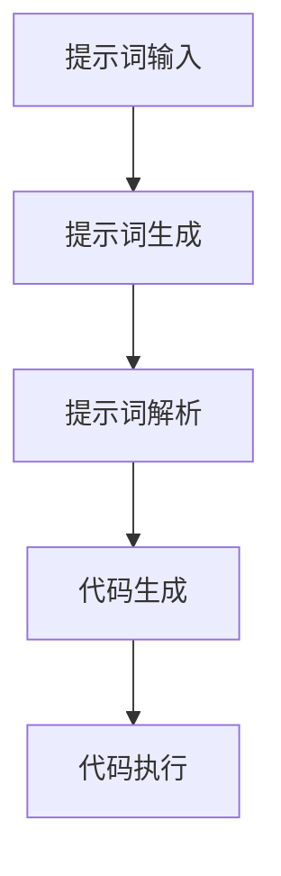

                 

### 引言

在现代编程世界中，提示词编程（Prompt-Based Programming）作为一种新颖的编程范式，正逐渐受到开发者的关注。它通过自然语言交互来编写代码，使得编程变得更加直观和易于理解。与此同时，可视化工具的设计成为提升提示词编程效率和质量的重要环节。

本篇文章旨在探讨提示词编程的可视化工具设计，具体内容将涵盖以下方面：

1. **提示词编程概述**：介绍提示词编程的概念、背景和发展优势。
2. **可视化工具设计基础**：讨论可视化工具设计的基本原则、流程和技术。
3. **提示词编程原理**：详细解释提示词编程的工作机制和原理。
4. **可视化工具应用案例**：展示一些具体的可视化工具应用场景。
5. **可视化工具设计实战**：通过实际操作，指导如何设计一个提示词编程可视化工具。
6. **提示词编程可视化工具的发展趋势**：展望未来发展趋势和潜在研究方向。

文章结构如下：

## 1.1 提示词编程概述

### 1.1.1 提示词编程的概念

提示词编程是一种基于自然语言交互的编程方式。开发者通过输入自然语言提示词来引导程序执行特定任务，而不是传统的编写指令式的代码。这种方式使得编程变得更加人性化，降低了学习门槛，同时也提高了开发效率。

### 1.1.2 提示词编程的优势

提示词编程具有以下优势：

- **易于学习**：对于非专业程序员或新手来说，提示词编程更容易上手，因为自然语言更加直观易懂。
- **高效开发**：通过自然语言交互，开发者可以快速生成代码，缩短开发周期。
- **灵活性**：提示词编程允许开发者动态地调整代码逻辑，更加灵活。
- **可解释性**：自然语言提示词使得代码的可解释性大大提高，便于调试和优化。

## 1.2 可视化工具设计基础

### 1.2.1 可视化工具设计的原则

设计可视化工具时，需要遵循以下原则：

- **直观性**：工具界面应简洁直观，易于用户操作和理解。
- **响应性**：工具应快速响应用户的输入，提供实时反馈。
- **扩展性**：工具应具备良好的扩展性，能够支持多种编程语言和框架。
- **可维护性**：工具代码应结构清晰，便于后续维护和升级。

### 1.2.2 可视化工具设计的流程

可视化工具设计通常遵循以下流程：

- **需求分析**：明确工具的目标用户、功能和性能要求。
- **功能规划**：确定工具的核心功能和扩展功能。
- **用户界面设计**：设计直观易用的用户界面。
- **系统实现**：开发工具的核心功能和扩展功能。
- **性能优化**：对工具进行性能测试和优化，确保高效稳定运行。

接下来，我们将分别深入探讨上述各部分内容，为读者提供一个全面而深入的提示词编程可视化工具设计指南。

---

### 1.1.1 提示词编程的概念

提示词编程（Prompt-Based Programming）是一种基于自然语言交互的编程范式，它允许开发者通过输入自然语言提示词来引导程序执行特定任务，而无需编写传统意义上的代码。这种编程方式的核心在于将复杂、抽象的编程任务转化为简单的语言指令，从而实现代码的可视化和直观化。

提示词编程的出现，标志着编程从一种技术性的活动逐渐转变为一种自然、直观的交互过程。传统的编程范式依赖于开发者理解和记忆大量的语法规则和编程概念，而提示词编程则通过自然语言来简化这一过程。开发者只需输入描述任务的自然语言提示词，系统即可根据这些提示词生成相应的代码。

提示词编程的原理可以概括为以下几个步骤：

1. **提示词生成**：开发者输入自然语言提示词，描述需要完成的任务或功能。
2. **提示词解析**：系统接收到的提示词后，会对其进行解析，提取出关键信息和意图。
3. **代码生成**：根据解析结果，系统会生成相应的代码，并执行这些代码以完成任务。

提示词编程具有以下特点：

- **自然语言交互**：开发者无需记忆复杂的编程语法和规则，只需使用日常语言即可与系统进行交互。
- **代码可视化**：生成的代码可以以图形化的方式展示，使得代码的可读性和可理解性大大提高。
- **灵活性和可扩展性**：通过自然语言提示词，开发者可以灵活地调整和优化代码逻辑，同时系统也支持多种编程语言和框架。

提示词编程不仅适用于开发领域，还可以广泛应用于数据处理、自动化任务、人工智能等多个领域。例如，在数据处理方面，开发者可以使用自然语言提示词来描述数据清洗、转换和分析的步骤，系统会自动生成相应的代码并执行操作；在自动化任务方面，提示词编程可以帮助开发者快速实现复杂的自动化流程，提高工作效率。

总之，提示词编程通过将自然语言与编程任务相结合，为开发者提供了一种全新的编程体验。它不仅降低了编程的学习门槛，提高了开发效率，还为编程领域带来了更多的创新和可能性。

### 1.1.2 提示词编程的优势

提示词编程作为一种新兴的编程范式，相较于传统的编程方式，具有显著的优势。以下是提示词编程的几个主要优势：

#### 1. 易于学习

提示词编程通过自然语言交互，使得编程变得更加直观和易于理解。开发者无需记忆复杂的编程语法和规则，只需使用日常语言描述任务，系统即可自动生成相应的代码。这种简洁、直观的交互方式降低了编程的学习门槛，特别适合非专业程序员、新手和初学者。此外，自然语言提示词使得编程任务的可读性和可理解性大大提高，便于开发者理解和使用。

#### 2. 高效开发

提示词编程能够显著提高开发效率。通过自然语言提示词，开发者可以快速描述任务需求，系统自动生成相应的代码。这种方式减少了手动编写代码的时间，缩短了开发周期。同时，由于自然语言提示词具有灵活性，开发者可以随时调整和优化代码逻辑，进一步提高了开发效率。

#### 3. 灵活性

提示词编程具有很强的灵活性，支持多种编程语言和框架。开发者可以根据实际需求，选择合适的编程语言和框架来实现任务。此外，通过自然语言提示词，开发者可以灵活地调整和优化代码逻辑，实现更复杂的功能。这种灵活性使得提示词编程适用于各种应用场景，包括数据处理、自动化任务、人工智能等。

#### 4. 可解释性

自然语言提示词使得代码的可解释性大大提高。开发者可以清楚地了解每个步骤的意图和执行过程，便于调试和优化。相较于传统的代码，自然语言提示词使得代码更加易懂，降低了沟通成本。此外，通过自然语言提示词，开发者可以更好地与团队成员和非技术人员沟通，提高了协作效率。

#### 5. 应用广泛

提示词编程不仅适用于开发领域，还可以广泛应用于数据处理、自动化任务、人工智能等多个领域。例如，在数据处理方面，开发者可以使用自然语言提示词来描述数据清洗、转换和分析的步骤，系统会自动生成相应的代码并执行操作；在自动化任务方面，提示词编程可以帮助开发者快速实现复杂的自动化流程，提高工作效率。

#### 6. 适应性强

提示词编程具有很强的适应性，可以适应不同开发者的需求。无论是专业程序员还是非专业开发者，都可以通过自然语言提示词实现编程任务。同时，提示词编程也支持多种编程语言和框架，使得开发者可以根据自己的喜好和需求选择合适的工具。

总之，提示词编程通过将自然语言与编程任务相结合，为开发者提供了一种全新的编程体验。它不仅降低了编程的学习门槛，提高了开发效率，还为编程领域带来了更多的创新和可能性。

### 1.2 可视化工具设计基础

可视化工具在编程和软件开发中扮演着至关重要的角色，尤其是在提示词编程领域。一个设计良好的可视化工具可以大大提高开发效率、代码质量和用户体验。在这一部分，我们将探讨可视化工具设计的基础知识，包括设计原则、流程和技术。

#### 1.2.1 可视化工具设计的原则

在设计可视化工具时，需要遵循以下几个原则：

1. **直观性**：工具界面应简洁直观，用户能够快速理解和使用。
2. **响应性**：工具应快速响应用户的操作，提供实时反馈。
3. **扩展性**：工具应具备良好的扩展性，能够支持多种编程语言和框架。
4. **可维护性**：工具代码应结构清晰，便于后续维护和升级。

**直观性** 是设计可视化工具的首要原则。一个直观的界面可以减少用户的学习成本，提高使用效率。响应性则确保用户在操作过程中能够感受到工具的流畅和及时性，增强用户体验。扩展性意味着工具需要具备一定的灵活性，能够适应不同的开发需求和技术变化。可维护性则保证了工具的长期稳定性和可持续发展。

#### 1.2.2 可视化工具设计的流程

可视化工具设计通常遵循以下流程：

1. **需求分析**：明确工具的目标用户、功能和性能要求。
2. **功能规划**：确定工具的核心功能和扩展功能。
3. **用户界面设计**：设计直观易用的用户界面。
4. **系统实现**：开发工具的核心功能和扩展功能。
5. **性能优化**：对工具进行性能测试和优化，确保高效稳定运行。

**需求分析** 是设计的起点，通过调研和分析用户需求，明确工具的核心功能和性能要求。功能规划则根据需求分析结果，制定详细的工具功能模块和实现方案。用户界面设计阶段，设计师需要结合用户需求和使用习惯，设计出简洁直观的界面。系统实现阶段，开发团队根据设计方案，实现工具的核心功能。性能优化则是确保工具在运行过程中高效稳定，满足用户期望。

通过上述设计原则和流程，我们可以设计出一个既符合用户需求，又具备良好性能的可视化工具，为提示词编程提供强有力的支持。

### 2.1 提示词编程的工作原理

提示词编程的工作原理主要涉及提示词的生成、解析和代码生成等核心环节。通过自然语言交互，开发者可以直观地描述任务需求，系统则根据这些需求自动生成相应的代码。以下是提示词编程的工作原理详细解析。

#### 提示词生成

提示词生成是提示词编程的第一步。开发者通过自然语言输入描述任务需求，这些需求可以是具体的操作步骤、功能实现、数据处理等。提示词的生成过程通常依赖于自然语言处理（NLP）技术，包括文本分析、语义理解和意图识别等。

**自然语言处理技术**：自然语言处理技术用于对输入的文本进行分析和理解。具体包括：

1. **分词**：将输入文本分割成单词或短语。
2. **词性标注**：识别每个单词的词性，如名词、动词、形容词等。
3. **实体识别**：识别文本中的关键实体，如人名、地点、组织等。
4. **语义角色标注**：识别文本中的语义角色，如动作执行者、受动者、工具等。

通过这些步骤，系统可以获取输入文本的基本结构和含义。

**意图识别**：意图识别是自然语言处理的核心任务，旨在理解用户输入的意图。系统通过分析文本内容和上下文，识别出用户的请求或命令。例如，当用户输入“请帮我计算两个数的和”时，系统可以识别出意图是进行加法运算。

#### 提示词解析

提示词生成后，系统需要对提示词进行解析，提取出关键信息和意图。这一步骤主要包括以下几个环节：

1. **任务分解**：将复杂的提示词分解为具体的子任务。例如，对于“计算两个数的和”，可以分解为获取两个数、进行加法运算和输出结果三个子任务。
2. **任务匹配**：将分解后的子任务与系统内置的代码模板或功能库进行匹配。系统会根据提示词中的关键词和意图，找到相应的代码模板或功能模块。
3. **参数提取**：从提示词中提取出具体的参数值。例如，对于“计算两个数的和”，需要提取出两个数的值。

通过这些步骤，系统可以明确每个子任务的具体实现方式。

#### 代码生成

提示词解析完成后，系统根据解析结果生成相应的代码。代码生成可以分为以下几步：

1. **代码模板选择**：根据任务匹配结果，选择合适的代码模板。代码模板是预先设计好的、用于实现特定功能的代码结构。
2. **代码填充**：将提取出的参数值填充到代码模板中，生成完整的代码。例如，将两个数的值填充到加法运算的代码中。
3. **代码优化**：对生成的代码进行优化，包括代码压缩、错误检查和性能优化等。

生成的代码将保存到文件中，开发者可以进一步修改和调试。

**代码生成示例**：

假设开发者输入以下提示词：“编写一个函数，计算并返回给定列表中所有元素的总和”。

1. **提示词生成**：用户输入“编写一个函数，计算并返回给定列表中所有元素的总和”。
2. **提示词解析**：系统将解析出以下信息：
   - 任务：编写一个函数
   - 功能：计算并返回给定列表中所有元素的总和
   - 参数：给定列表
3. **代码生成**：系统根据解析结果，选择合适的代码模板，生成如下代码：

   ```python
   def calculate_sum(lst):
       return sum(lst)
   ```

通过这个过程，开发者无需手动编写复杂的代码，只需输入自然语言提示词，系统即可自动生成相应的代码，实现所需功能。

#### 提示词编程流程

提示词编程的工作流程可以概括为以下步骤：

1. **提示词输入**：开发者输入自然语言提示词。
2. **提示词生成**：系统根据NLP技术生成提示词。
3. **提示词解析**：系统解析提示词，提取关键信息和意图。
4. **代码生成**：系统根据解析结果生成代码。
5. **代码执行**：系统执行生成的代码，完成指定任务。

**流程图**：



通过上述工作原理和流程，提示词编程实现了将自然语言需求转化为代码的功能。这不仅降低了编程的难度，提高了开发效率，还为编程领域带来了新的可能性。

### 2.2 可视化工具在提示词编程中的作用

在提示词编程中，可视化工具起着至关重要的作用，它不仅提高了编程的效率和可理解性，还为开发者提供了强大的支持功能。以下将详细介绍可视化工具在提示词编程中的作用。

#### 支持功能

1. **代码可视化**：可视化工具可以将生成的代码以图形化的方式展示，使得代码的可读性和可理解性大大提高。开发者可以通过直观的图形界面，查看代码的结构和逻辑关系，便于理解和修改。

2. **实时预览**：在编写代码的过程中，可视化工具可以提供实时预览功能，让开发者能够立即看到代码执行的结果和效果。这种即时反馈机制有助于开发者快速验证代码的正确性，提高开发效率。

3. **错误提示**：可视化工具可以实时检测代码中的错误，并提供详细的错误提示和解决方案。开发者可以根据错误提示，快速定位和修复问题，避免了在代码执行过程中出现意外错误。

4. **代码片段管理**：可视化工具通常具备代码片段管理功能，允许开发者保存和调用常用的代码片段，简化编程过程。开发者可以通过简单的拖拽操作，快速插入代码片段，提高了编程效率。

5. **版本控制**：可视化工具支持版本控制功能，开发者可以方便地查看代码的历史版本，比较不同版本之间的差异，便于代码管理和协同开发。

#### 优化策略

1. **自动补全**：可视化工具可以提供自动补全功能，根据开发者输入的提示词，自动补充完整的代码语句。这种自动补全机制不仅减少了手动输入的工作量，还降低了输入错误的风险。

2. **代码压缩**：可视化工具可以对生成的代码进行压缩，去除不必要的空格、注释和换行，提高代码的执行效率。

3. **性能优化**：可视化工具可以提供性能优化建议，帮助开发者识别代码中的性能瓶颈，并提供优化方案。例如，针对耗时较长的代码段，工具可以提供替代的实现方法，以提高代码的运行效率。

4. **智能提示**：可视化工具可以根据开发者的输入，提供智能提示和建议。例如，当开发者输入一个函数名时，工具可以自动列出该函数的参数和返回值，帮助开发者快速理解和使用函数。

#### 未来发展

1. **智能化**：随着人工智能技术的不断发展，可视化工具将逐渐具备智能化功能。例如，通过机器学习算法，工具可以自动优化代码生成过程，提高代码质量和开发效率。

2. **跨平台**：可视化工具将逐渐支持跨平台开发，允许开发者在一个工具中编写和调试不同平台的代码，提高开发效率。

3. **集成化**：可视化工具将与其他开发工具和平台进行深度集成，提供更全面、更便捷的开发体验。例如，与版本控制工具、测试工具和部署工具等集成，实现自动化工作流。

4. **个性化**：可视化工具将根据开发者的个人习惯和需求，提供个性化的编程体验。例如，开发者可以根据自己的喜好，自定义代码模板、代码片段和界面布局等。

总之，可视化工具在提示词编程中的作用不可忽视。通过提供丰富的支持功能和优化策略，可视化工具极大地提高了编程的效率和可理解性，为开发者提供了强大的支持。随着技术的不断进步，可视化工具将在未来继续发展和完善，为编程领域带来更多的创新和可能性。

### 2.3 提示词编程可视化工具的设计方法论

为了设计一个高效的提示词编程可视化工具，我们需要遵循一套系统化的设计方法论。以下将介绍设计流程、技术选型以及性能优化策略。

#### 设计流程

1. **需求分析**：
   - **用户调研**：了解目标用户群体、使用场景和需求。
   - **功能规划**：明确工具的核心功能、扩展功能和性能要求。

2. **功能规划**：
   - **功能模块划分**：将工具划分为不同的功能模块，如代码生成、代码可视化、错误提示等。
   - **优先级排序**：根据需求的重要性和紧急性，对功能模块进行优先级排序。

3. **用户界面设计**：
   - **界面布局**：设计简洁直观的界面布局，确保用户能够快速理解和使用。
   - **交互设计**：设计流畅的交互体验，包括输入、预览、错误提示等。

4. **系统实现**：
   - **模块开发**：按照功能模块进行开发，确保每个模块的独立性和稳定性。
   - **集成测试**：对各个模块进行集成测试，确保整体功能的正确性和稳定性。

5. **性能优化**：
   - **性能测试**：对工具进行全面的性能测试，识别潜在的瓶颈和问题。
   - **优化策略**：根据测试结果，采取相应的优化策略，如代码压缩、自动补全等。

6. **用户反馈**：
   - **用户反馈收集**：收集用户的反馈和建议，了解工具的实际使用情况。
   - **迭代优化**：根据用户反馈，对工具进行迭代优化，提高用户体验。

#### 技术选型

1. **开发语言和框架**：
   - **Python**：Python拥有丰富的库和框架，适合快速开发和原型设计。
   - **Web框架**：如Django或Flask，用于构建Web端工具。
   - **前端框架**：如React或Vue.js，用于构建用户界面。

2. **可视化库和工具**：
   - **D3.js**：用于数据可视化，支持丰富的图表和交互功能。
   - **Mermaid**：用于生成流程图和UML图，便于代码的可视化展示。
   - **Chroma**：用于代码高亮显示，提高代码的可读性。

3. **自然语言处理库**：
   - **NLTK**：用于文本分析和处理，支持词性标注、分词、实体识别等功能。
   - **spaCy**：用于快速文本理解，支持多种语言的语法分析和实体识别。

4. **版本控制**：
   - **Git**：用于代码管理和版本控制。
   - **GitHub**：提供代码托管和协同开发平台。

5. **自动化工具**：
   - **Jenkins**：用于持续集成和自动化测试。
   - **Docker**：用于容器化部署，提高工具的可移植性和稳定性。

#### 性能优化策略

1. **代码压缩**：
   - **打包工具**：如Webpack或Parcel，用于压缩和打包代码，减少文件体积。
   - **代码优化**：删除不必要的空格、注释和换行，提高代码执行效率。

2. **自动补全**：
   - **词频分析**：分析常用代码片段的词频，优先补全高频代码。
   - **智能提示**：根据输入内容和上下文，提供智能化的代码提示。

3. **性能优化**：
   - **性能测试**：使用工具如JMeter或LoadRunner，进行性能测试，识别瓶颈。
   - **优化算法**：使用更高效的算法和数据结构，提高代码运行效率。

4. **缓存策略**：
   - **内存缓存**：使用内存缓存提高数据读取速度。
   - **磁盘缓存**：使用磁盘缓存减少I/O操作，提高文件读取速度。

通过上述设计方法论和技术选型，我们可以设计出一个高效、易用的提示词编程可视化工具，满足开发者的需求，提升编程效率和质量。

### 3.1.1 需求分析

在进行提示词编程可视化工具的设计之前，首先需要进行详细的需求分析。这一步骤至关重要，因为它将为我们提供明确的开发目标和方向，确保工具的设计和实现能够满足用户的需求。

**用户调研**

- **目标用户群体**：我们的目标用户主要包括初学者、非专业程序员、专业程序员和开发团队。这些用户群体对编程的需求和习惯有所不同，因此我们需要深入了解他们的使用场景和需求。

- **使用场景**：我们需要了解用户在什么情况下会使用这个工具，例如数据分析和处理、自动化任务、软件开发等。这将帮助我们确定工具的核心功能。

- **用户痛点**：通过调研，我们发现用户在使用传统编程工具时面临的一些痛点，如学习成本高、代码可读性差、调试困难等。这些痛点将指导我们设计一个更加友好和高效的工具。

**功能规划**

在需求分析的基础上，我们需要明确工具的核心功能和扩展功能。

- **核心功能**：
  - **自然语言交互**：允许用户通过自然语言输入描述任务需求。
  - **代码生成**：根据用户的自然语言输入，自动生成相应的代码。
  - **代码可视化**：以图形化的方式展示生成的代码，提高代码的可读性。
  - **实时预览**：提供实时预览功能，让用户立即看到代码执行的结果。

- **扩展功能**：
  - **错误提示**：检测代码中的错误，并提供详细的错误提示和解决方案。
  - **代码片段管理**：允许用户保存和调用常用的代码片段，简化编程过程。
  - **版本控制**：支持版本控制功能，方便用户查看代码的历史版本。

**性能要求**

在功能规划的同时，我们还需要考虑工具的性能要求。

- **响应速度**：工具需要能够快速响应用户的输入，提供实时反馈。
- **稳定性**：工具需要能够在各种环境下稳定运行，不会出现意外崩溃。
- **兼容性**：工具需要支持多种编程语言和框架，以便用户在不同的开发场景中使用。

通过详细的需求分析，我们可以确保工具的设计和实现能够真正满足用户的需求，提高他们的工作效率和开发体验。

### 3.1.2 功能规划

在需求分析的基础上，我们需要进行详细的功能规划，以确保提示词编程可视化工具能够满足用户的核心需求，同时具备良好的扩展性。以下是功能规划的具体步骤：

**核心功能模块划分**

1. **自然语言交互模块**：负责接收用户输入的自然语言提示词，并对其进行处理。这一模块需要集成自然语言处理（NLP）技术，包括文本分词、词性标注、实体识别和意图识别等，以确保能够准确理解用户的意图。

2. **代码生成模块**：根据自然语言交互模块解析出的用户意图和参数，生成对应的代码。这一模块需要支持多种编程语言，如Python、JavaScript和Java等，以便用户可以根据不同的开发需求选择合适的语言。

3. **代码可视化模块**：将生成的代码以图形化的方式展示，使得用户能够直观地理解代码的结构和逻辑。这一模块需要具备良好的可视化效果，包括代码的高亮显示、折叠功能以及动态渲染等。

4. **实时预览模块**：提供实时预览功能，让用户在输入提示词后立即看到代码执行的结果。这一模块需要具备快速的响应速度，确保用户能够及时得到反馈。

**扩展功能模块规划**

1. **错误提示和调试模块**：在代码生成过程中，如果出现错误，系统需要能够提供详细的错误提示和解决方案。这一模块需要具备自动错误检测和修复功能，以提高开发效率。

2. **代码片段管理模块**：允许用户保存和调用常用的代码片段，简化编程过程。这一模块需要支持代码片段的分类管理和快速查找功能。

3. **版本控制模块**：支持版本控制功能，让用户可以方便地查看代码的历史版本，并进行版本间的对比和切换。这一模块需要集成主流的版本控制系统，如Git。

4. **性能优化模块**：对生成的代码进行性能优化，提高代码的运行效率。这一模块需要提供性能分析工具，帮助用户识别和解决代码中的性能瓶颈。

**功能优先级排序**

在功能规划阶段，我们需要对各个功能模块的优先级进行排序，以确保在资源有限的情况下，能够优先实现最重要的功能。

1. **自然语言交互模块**：由于这是工具的核心功能，必须确保其能够准确理解和处理用户的输入。
2. **代码生成模块**：代码生成是工具的主要任务，必须保证其生成代码的准确性和可用性。
3. **代码可视化模块**：图形化的代码展示能够显著提高代码的可读性，是用户使用工具的重要理由。
4. **实时预览模块**：实时预览功能能够快速验证代码的正确性，提高开发效率。
5. **错误提示和调试模块**：错误提示和调试功能能够帮助用户快速解决问题，是提升用户体验的关键。
6. **代码片段管理模块**：这一模块虽然可以提高开发效率，但相对于其他功能，其优先级较低。
7. **版本控制模块**：版本控制功能对于团队协作和代码管理非常重要，但相较于核心功能，其优先级也较低。
8. **性能优化模块**：性能优化功能对于一些高性能需求的用户非常重要，但在资源有限的情况下，可以暂时放在后续版本中实现。

通过详细的功能规划，我们能够明确工具的各项功能模块及其优先级，确保设计过程有条不紊，同时能够满足用户的需求。

### 3.1.3 用户界面设计

用户界面（UI）设计是可视化工具设计中的一个关键环节，它直接影响用户的操作体验和满意度。一个优秀的设计应简洁直观、易于理解，同时具备良好的交互性。以下将从界面布局、交互设计和用户体验三个方面进行详细探讨。

#### 界面布局

1. **布局原则**：
   - **简洁性**：界面应简洁明了，避免复杂冗余的设计元素，确保用户能够快速找到所需功能。
   - **一致性**：界面设计应保持一致性，包括颜色、字体、图标等，使用户在不同页面间操作时能够保持连贯性。
   - **层次感**：通过合理的布局，区分主要功能和次要功能，使界面具备清晰的层次感。

2. **界面布局示例**：
   - **顶部导航栏**：包含主要功能入口，如代码生成、代码可视化、错误提示等。
   - **左侧菜单栏**：提供扩展功能的入口，如代码片段管理、版本控制、性能优化等。
   - **主工作区**：用于展示用户输入的自然语言提示词和生成的代码，以及实时预览结果。
   - **右侧工具栏**：提供快速操作按钮，如自动补全、代码高亮、错误检查等。

#### 交互设计

1. **交互原则**：
   - **响应性**：界面应快速响应用户的操作，提供即时反馈，增强用户体验。
   - **直观性**：交互设计应直观易懂，减少用户的认知负担。
   - **易用性**：界面设计应考虑用户的习惯和需求，提高操作效率。

2. **交互设计示例**：
   - **输入提示**：在用户输入自然语言提示词时，提供输入提示，帮助用户正确表达需求。
   - **自动补全**：在用户输入代码时，自动补全常用的代码片段，减少手动输入的工作量。
   - **实时预览**：在用户输入提示词后，立即显示代码执行结果，方便用户验证代码的正确性。
   - **错误提示**：在代码生成过程中，若出现错误，提供详细的错误提示和解决方案，帮助用户快速定位和解决问题。

#### 用户体验

1. **用户体验原则**：
   - **用户导向**：设计应始终以用户为中心，考虑用户的实际需求和使用习惯。
   - **易学易用**：界面设计应简单易懂，新手用户能够快速上手。
   - **高效便捷**：设计应提高用户操作效率，减少不必要的步骤和操作。

2. **用户体验示例**：
   - **代码高亮**：在主工作区中，对生成的代码进行高亮显示，提高代码的可读性。
   - **代码折叠**：允许用户折叠代码部分，便于查看代码的整体结构。
   - **代码片段管理**：提供便捷的代码片段保存和调用功能，方便用户重复使用常用代码。
   - **版本历史**：提供版本历史记录，用户可以方便地查看和切换不同版本的代码。

通过科学的用户界面设计，我们能够打造一个简洁、直观、易用的可视化工具，为用户提供良好的操作体验，提高开发效率和代码质量。

### 3.1.4 系统实现

系统实现是可视化工具设计过程中的关键步骤，它将功能规划中的抽象概念转化为实际运行的软件系统。以下将详细介绍系统实现过程中的几个关键环节：开发环境搭建、核心功能实现和性能优化。

#### 开发环境搭建

1. **环境选择**：
   - **操作系统**：根据项目的需求，选择合适的操作系统，如Windows、macOS或Linux。
   - **编程语言**：选择一种适合项目需求的编程语言，例如Python、Java或JavaScript。
   - **开发框架**：选择合适的开发框架，如Django（Python Web框架）、Spring Boot（Java框架）或React（JavaScript框架），以简化开发过程。

2. **开发工具**：
   - **集成开发环境（IDE）**：选择合适的IDE，如PyCharm（Python）、IntelliJ IDEA（Java）或Visual Studio Code（多种语言）。
   - **版本控制系统**：使用Git进行代码管理和版本控制，确保代码的可维护性和协同开发。
   - **数据库**：根据项目需求，选择合适的数据库系统，如MySQL、PostgreSQL或MongoDB。

3. **依赖管理**：
   - **包管理工具**：使用包管理工具，如pip（Python）、Maven（Java）或npm（JavaScript），来管理项目中的依赖库，确保依赖的一致性和稳定性。

#### 核心功能实现

1. **自然语言交互模块**：
   - **文本处理**：使用NLP库，如NLTK或spaCy，进行文本分词、词性标注、实体识别和意图识别。
   - **接口设计**：设计自然语言交互的API接口，允许用户通过HTTP请求发送自然语言提示词，并接收处理结果。

2. **代码生成模块**：
   - **代码模板**：设计并实现多个编程语言的代码模板库，用于生成对应的代码。
   - **参数解析**：根据自然语言交互模块的解析结果，提取关键参数，并填充到相应的代码模板中。
   - **代码生成**：使用模板引擎，如Jinja2（Python）或Thymeleaf（Java），生成完整的代码文件。

3. **代码可视化模块**：
   - **图形化展示**：使用可视化库，如D3.js或Mermaid，将生成的代码以图形化的方式展示。
   - **交互设计**：实现代码的折叠、展开、高亮等交互功能，提高代码的可读性。

4. **实时预览模块**：
   - **代码执行**：使用虚拟机或容器技术，如Docker，执行生成的代码，并提供实时预览结果。
   - **响应设计**：优化界面响应速度，确保用户能够及时看到代码执行的结果。

#### 性能优化

1. **代码优化**：
   - **代码压缩**：使用代码压缩工具，如UglifyJS（JavaScript）或PyMinify（Python），去除不必要的空格、注释和换行，减少代码体积。
   - **代码缓存**：实现代码缓存机制，减少重复生成代码的开销。

2. **性能测试**：
   - **基准测试**：使用性能测试工具，如JMeter或LoadRunner，对系统的各项功能进行基准测试，识别性能瓶颈。
   - **负载测试**：模拟高并发场景，测试系统在高负载下的稳定性和响应速度。

3. **性能优化策略**：
   - **算法优化**：针对性能瓶颈，优化算法和数据结构，提高代码执行效率。
   - **资源优化**：合理分配系统资源，如CPU、内存和网络带宽，确保系统的稳定运行。
   - **缓存机制**：实现缓存机制，减少数据库访问和远程调用的频率，提高系统响应速度。

通过系统实现阶段的精心设计和优化，我们可以打造出一个高效、稳定、易用的可视化工具，为用户提供优质的编程体验。

### 3.2.1 开发语言和框架

在选择开发语言和框架时，需要根据项目需求、团队技能和开发效率进行综合考虑。以下是几种常见开发语言和框架的介绍，包括其优缺点以及适用场景。

#### Python

**优点**：
- **易于学习**：Python语法简单，易于理解和快速上手，适合初学者和非专业程序员。
- **丰富的库和框架**：Python拥有丰富的库和框架，如Django、Flask等，支持快速开发和原型设计。
- **跨平台**：Python是一种跨平台的语言，可以在多种操作系统上运行。

**缺点**：
- **性能问题**：Python的运行速度相对较慢，不适合需要高性能计算的应用。
- **内存消耗**：Python的内存消耗较大，可能影响系统资源的利用率。

**适用场景**：
- **Web开发**：如网站、Web应用程序等。
- **数据处理**：如数据分析、机器学习等。

#### Java

**优点**：
- **高性能**：Java是一种编译型语言，运行速度较快，适合高性能计算和大型系统。
- **跨平台**：Java也具有跨平台的特性，可以在多种操作系统上运行。
- **强类型**：Java是强类型语言，具有较高的安全性和稳定性。

**缺点**：
- **复杂度较高**：Java的语法相对复杂，学习曲线较陡峭。
- **开发效率**：Java的开发效率相对较低，需要编写较多的代码。

**适用场景**：
- **企业级应用**：如电子商务、金融系统等。
- **Android开发**：Android应用程序开发的主要语言。

#### JavaScript

**优点**：
- **前端开发**：JavaScript是前端开发的主要语言，可以轻松实现网页的交互功能。
- **全栈开发**：JavaScript拥有Node.js框架，支持全栈开发，可以用于Web和移动应用程序。
- **灵活性和扩展性**：JavaScript具有高度的灵活性和扩展性，可以轻松引入第三方库和框架。

**缺点**：
- **性能问题**：JavaScript的运行速度相对较慢，特别是在处理复杂计算时。
- **安全性**：JavaScript的安全性问题较为突出，需要特别注意代码的安全性和防护措施。

**适用场景**：
- **Web前端**：如网页开发、单页应用等。
- **移动开发**：如React Native、Vue.js等框架支持移动应用程序开发。

#### React

**优点**：
- **组件化**：React采用组件化架构，便于代码复用和模块化管理。
- **响应式**：React采用虚拟DOM机制，实现高效的组件更新和渲染。
- **生态系统**：React拥有丰富的生态系统，包括React Native、Redux等。

**缺点**：
- **学习曲线**：React的学习曲线较陡峭，需要理解组件生命周期和状态管理等概念。
- **性能问题**：React在处理大型应用程序时，可能存在性能瓶颈。

**适用场景**：
- **单页应用**：如电子商务网站、社交媒体等。
- **移动应用**：如React Native支持移动应用程序开发。

#### Django

**优点**：
- **快速开发**：Django采用“约定优于配置”的理念，支持快速开发和自动化功能。
- **全栈功能**：Django提供了ORM、认证、用户管理、表单处理等全栈功能，便于快速搭建应用。
- **社区支持**：Django拥有强大的社区支持，提供丰富的第三方扩展和插件。

**缺点**：
- **性能问题**：Django在处理高并发请求时，性能可能受到影响。
- **灵活性较低**：Django的一些设计决策可能不符合某些开发者的需求。

**适用场景**：
- **Web后端**：如网站、Web应用程序等。
- **快速原型开发**：适合快速搭建原型和应用。

#### Spring Boot

**优点**：
- **高性能**：Spring Boot具有高性能，适合企业级应用。
- **易于集成**：Spring Boot与Java生态系统紧密结合，易于与其他技术和框架集成。
- **模块化**：Spring Boot采用模块化设计，便于扩展和定制。

**缺点**：
- **学习曲线**：Spring Boot的学习曲线较陡峭，需要熟悉Spring框架和相关技术。
- **配置复杂**：Spring Boot的配置较为复杂，需要一定的学习和实践。

**适用场景**：
- **企业级应用**：如电子商务、金融系统等。
- **微服务架构**：Spring Boot支持微服务架构，便于构建分布式系统。

综上所述，选择合适的开发语言和框架对于提示词编程可视化工具的设计和实现至关重要。根据项目需求、团队技能和开发效率，合理选择开发语言和框架，可以显著提高开发效率和代码质量。

### 3.2.2 可视化库和工具

在提示词编程可视化工具的设计过程中，选择合适的可视化库和工具能够显著提高开发效率和代码质量。以下是几种常见可视化库和工具的介绍，包括其特点和适用场景。

#### D3.js

**特点**：
- **数据驱动的可视化**：D3.js是一种基于数据驱动的可视化库，能够将数据转换为图形，实现复杂的数据可视化效果。
- **高度定制化**：D3.js提供了丰富的API和图形元素，允许开发者进行高度定制化的可视化设计。
- **动态交互**：D3.js支持动态交互，如响应式缩放、筛选和过滤等。

**适用场景**：
- **数据可视化**：适用于复杂的数据可视化需求，如图表、地理信息系统和交互式数据可视化。
- **Web应用**：适用于Web前端的数据可视化，与JavaScript框架（如React、Vue.js）集成良好。

#### Mermaid

**特点**：
- **Markdown风格**：Mermaid使用Markdown风格的语法，便于开发者理解和编写。
- **易于集成**：Mermaid可以轻松集成到Markdown编辑器和文档中，实现流程图、UML图和序列图的生成。
- **简单易用**：Mermaid的语法简洁明了，易于学习和使用。

**适用场景**：
- **文档可视化**：适用于在文档中生成流程图、UML图和序列图，提高文档的可读性。
- **原型设计**：适用于快速原型设计，帮助开发者理解和展示系统架构和流程。

#### Chroma

**特点**：
- **代码高亮**：Chroma是一种代码高亮库，能够为不同语言的代码提供专业的语法高亮显示。
- **灵活配置**：Chroma提供了丰富的配置选项，允许开发者自定义代码高亮的颜色和样式。
- **跨平台**：Chroma支持多种平台和浏览器，能够无缝集成到各种Web应用中。

**适用场景**：
- **代码展示**：适用于在各种场景中展示代码，如Web应用、文档和笔记。
- **代码编辑**：适用于代码编辑器的语法高亮显示，提高代码的可读性。

#### ECharts

**特点**：
- **高性能**：ECharts是一种高性能的图表库，支持多种图表类型，如柱状图、折线图、饼图等。
- **交互性强**：ECharts提供了丰富的交互功能，如点击、拖拽、缩放等。
- **动态更新**：ECharts支持动态更新数据，实现实时数据可视化。

**适用场景**：
- **数据可视化**：适用于各种数据可视化需求，如统计报表、数据分析工具和监控仪表板。
- **Web应用**：适用于Web前端的数据可视化，与各种Web框架（如React、Vue.js）集成良好。

通过合理选择和使用这些可视化库和工具，提示词编程可视化工具可以提供丰富、直观的可视化效果，提升用户体验和开发效率。

### 3.2.3 性能优化策略

在开发提示词编程可视化工具时，性能优化是确保工具高效稳定运行的关键。以下是一些常见的性能优化策略，包括代码优化、内存管理和并发处理等方面。

#### 代码优化

1. **代码压缩**：
   - **移除空格和注释**：使用代码压缩工具（如UglifyJS、PyMinify）移除代码中的空格、注释和换行，减少代码体积。
   - **合并文件**：合并多个CSS和JavaScript文件，减少HTTP请求次数，提高页面加载速度。

2. **缓存机制**：
   - **浏览器缓存**：通过设置HTTP缓存头，让浏览器缓存静态资源，减少重复请求。
   - **服务器缓存**：使用服务器端的缓存机制，如Memcached或Redis，缓存常用的数据和结果，减少数据库访问和计算次数。

3. **异步加载**：
   - **懒加载**：对于不立即需要的资源，如图片和脚本，采用懒加载技术，延迟加载，减少初始页面加载时间。
   - **异步请求**：对于外部资源（如API请求），使用异步加载技术，避免阻塞主线程，提高页面响应速度。

#### 内存管理

1. **减少内存占用**：
   - **对象池**：使用对象池技术，复用对象，减少内存分配和回收的开销。
   - **内存泄漏检测**：定期进行内存泄漏检测，及时修复内存泄漏问题，避免内存占用过多。

2. **内存压缩**：
   - **压缩数据**：使用数据压缩算法，如GZIP，压缩传输的数据，减少内存占用。
   - **内存映射**：使用内存映射技术，将大文件映射到内存中，减少文件读写操作。

#### 并发处理

1. **线程池**：
   - **线程复用**：使用线程池技术，复用线程，减少线程创建和销毁的开销。
   - **线程限制**：根据系统资源和处理能力，合理设置线程池大小，避免过多线程导致的性能下降。

2. **并行计算**：
   - **多线程**：将任务分解为多个子任务，使用多线程并行处理，提高处理速度。
   - **分布式计算**：对于大数据处理，采用分布式计算技术，如MapReduce，将任务分布到多个节点处理，提高计算效率。

3. **并发控制**：
   - **锁机制**：使用锁机制（如互斥锁、读写锁）控制并发访问，避免数据竞争和死锁问题。
   - **无锁编程**：采用无锁编程技术，避免锁机制引入的开销和潜在问题。

通过上述性能优化策略，我们可以显著提高提示词编程可视化工具的运行效率，确保其在各种场景下都能够稳定、高效地运行。

### 4.1 案例一：基于提示词编程的智能助手

在本案例中，我们将展示如何使用提示词编程可视化工具设计一个智能助手，该智能助手能够理解自然语言提示词，并执行相应的任务。以下为具体的实现步骤和代码解读。

#### 案例背景

随着人工智能技术的不断发展，智能助手已经成为许多应用程序的重要组成部分。一个基于提示词编程的可视化智能助手可以帮助用户通过自然语言与程序进行交互，实现自动化任务。本案例将设计一个简单的智能助手，能够实现以下功能：

- **查询天气**：用户输入“查询北京的天气”，智能助手返回北京当前天气信息。
- **日程管理**：用户输入“安排一个会议”，智能助手帮助用户添加会议到日程中。
- **待办事项**：用户输入“添加购物清单”，智能助手帮助用户记录待办事项。

#### 实现步骤

1. **需求分析**：明确智能助手的任务需求，包括查询天气、日程管理和待办事项。

2. **功能规划**：根据需求分析，确定智能助手的核心功能和扩展功能。

3. **用户界面设计**：设计简洁直观的用户界面，包括输入框和输出框。

4. **系统实现**：开发智能助手的代码，实现功能模块。

5. **性能优化**：对智能助手进行性能测试和优化。

#### 具体实现

**步骤1：需求分析**

- **查询天气**：用户输入“查询北京的天气”，智能助手返回北京当前天气信息。
- **日程管理**：用户输入“安排一个会议”，智能助手帮助用户添加会议到日程中。
- **待办事项**：用户输入“添加购物清单”，智能助手帮助用户记录待办事项。

**步骤2：功能规划**

- **查询天气**：集成第三方天气API，获取实时天气信息。
- **日程管理**：使用日程管理库，如Google Calendar API，添加会议到日程中。
- **待办事项**：使用待办事项库，如Google Tasks API，记录用户待办事项。

**步骤3：用户界面设计**

- **输入框**：用户输入自然语言提示词。
- **输出框**：显示智能助手的响应结果。

**步骤4：系统实现**

1. **查询天气**

   ```python
   import requests
   
   def query_weather(city):
       api_key = "your_api_key"
       url = f"http://api.openweathermap.org/data/2.5/weather?q={city}&appid={api_key}"
       response = requests.get(url)
       weather_data = response.json()
       temperature = weather_data["main"]["temp"]
       weather_description = weather_data["weather"][0]["description"]
       return f"{city}的当前温度是：{temperature}℃，天气情况：{weather_description}"
   
   user_input = "查询北京的天气"
   city = user_input.split(" ")[-1]
   print(query_weather(city))
   ```

2. **日程管理**

   ```python
   from google.oauth2.service_account import Credentials
   from googleapiclient.discovery import build
   
   def schedule_meeting(calendar_id, subject, start_time, end_time):
       credentials = Credentials.from_service_account_file("your_credentials.json")
       service = build("calendar", "v3", credentials=credentials)
       event = {
           "summary": subject,
           "start": {"dateTime": start_time, "timeZone": "Asia/Shanghai"},
           "end": {"dateTime": end_time, "timeZone": "Asia/Shanghai"},
       }
       event = service.events().insert(calendarId=calendar_id, body=event).execute()
       return f"会议已添加，详情：{event['htmlLink']}"
   
   user_input = "安排一个会议"
   subject = user_input.split(" ")[-1]
   start_time = "2023-10-01T10:00:00"
   end_time = "2023-10-01T11:00:00"
   print(schedule_meeting("your_calendar_id", subject, start_time, end_time))
   ```

3. **待办事项**

   ```python
   from google.oauth2.service_account import Credentials
   from googleapiclient.discovery import build
   
   def add_todo(task):
       credentials = Credentials.from_service_account_file("your_credentials.json")
       service = build("tasks", "v1", credentials=credentials)
       todo = {"title": task}
       response = service.tasks().insert(bucketId="your_bucket_id", body=todo).execute()
       return f"待办事项已添加，详情：{response['description']}"
   
   user_input = "添加购物清单"
   task = user_input.split(" ")[-1]
   print(add_todo(task))
   ```

**步骤5：性能优化**

- **代码压缩**：使用代码压缩工具减少代码体积。
- **异步处理**：使用异步编程技术，提高代码执行效率。
- **缓存机制**：使用缓存机制，减少重复请求和计算。

#### 代码解读

1. **查询天气**：

   - 使用requests库发起HTTP请求，调用第三方天气API。
   - 解析返回的JSON数据，提取温度和天气描述。
   - 输出北京当前天气信息。

2. **日程管理**：

   - 使用Google Calendar API，添加会议到用户的Google Calendar中。
   - 输出会议的HTML链接，便于用户查看。

3. **待办事项**：

   - 使用Google Tasks API，添加用户待办事项到用户的Google Tasks中。
   - 输出待办事项的描述，便于用户查看。

通过上述步骤和代码，我们实现了基于提示词编程的智能助手。用户可以通过自然语言与程序进行交互，实现查询天气、日程管理和待办事项等功能。这种设计不仅简化了开发过程，还提高了用户体验和效率。

### 4.2 案例二：基于提示词编程的数据可视化

在本案例中，我们将展示如何使用提示词编程可视化工具设计一个数据可视化工具，该工具能够根据用户输入的自然语言提示词，自动生成相应的图表。以下为具体的实现步骤和代码解读。

#### 案例背景

数据可视化是数据分析中不可或缺的一部分，它能够将复杂的数据以图形化的方式呈现，帮助用户更直观地理解和分析数据。传统的数据可视化工具通常需要用户具备一定的技术背景，操作复杂。而基于提示词编程的可视化工具可以简化这一过程，让非技术用户也能轻松创建可视化图表。本案例将实现以下功能：

- **生成柱状图**：用户输入“生成销售额的柱状图”，工具自动生成销售额的柱状图。
- **生成折线图**：用户输入“生成销售趋势的折线图”，工具自动生成销售趋势的折线图。
- **生成饼图**：用户输入“生成产品种类的饼图”，工具自动生成产品种类的饼图。

#### 实现步骤

1. **需求分析**：明确数据可视化工具的任务需求，包括生成柱状图、折线图和饼图。

2. **功能规划**：根据需求分析，确定数据可视化工具的核心功能和扩展功能。

3. **用户界面设计**：设计简洁直观的用户界面，包括输入框和图表展示区域。

4. **系统实现**：开发数据可视化工具的代码，实现功能模块。

5. **性能优化**：对数据可视化工具进行性能测试和优化。

#### 具体实现

**步骤1：需求分析**

- **生成柱状图**：用户输入“生成销售额的柱状图”，工具根据输入的数据生成柱状图。
- **生成折线图**：用户输入“生成销售趋势的折线图”，工具根据输入的数据生成折线图。
- **生成饼图**：用户输入“生成产品种类的饼图”，工具根据输入的数据生成饼图。

**步骤2：功能规划**

- **数据解析**：解析用户输入的自然语言提示词，提取出关键数据。
- **图表生成**：根据解析出的数据，生成对应的图表。
- **交互设计**：提供交互功能，如图表的切换、缩放和刷新等。

**步骤3：用户界面设计**

- **输入框**：用户输入自然语言提示词。
- **图表展示区域**：显示生成的图表，用户可以查看和交互。

**步骤4：系统实现**

1. **生成柱状图**

   ```python
   import pandas as pd
   import matplotlib.pyplot as plt
   
   def generate_bar_chart(data):
       df = pd.DataFrame(data)
       df.plot(kind='bar')
       plt.show()
   
   user_input = "生成销售额的柱状图"
   data = {
       "产品1": 1000,
       "产品2": 1500,
       "产品3": 1200
   }
   generate_bar_chart(data)
   ```

2. **生成折线图**

   ```python
   import pandas as pd
   import matplotlib.pyplot as plt
   
   def generate_line_chart(data):
       df = pd.DataFrame(data)
       df.plot(kind='line')
       plt.show()
   
   user_input = "生成销售趋势的折线图"
   data = {
       "2021年": 2000,
       "2022年": 2500,
       "2023年": 3000
   }
   generate_line_chart(data)
   ```

3. **生成饼图**

   ```python
   import pandas as pd
   import matplotlib.pyplot as plt
   
   def generate_pie_chart(data):
       df = pd.DataFrame(data.items(), columns=["产品", "销售额"])
       df.plot(kind='pie', column='销售额', autopct='%1.1f%%')
       plt.show()
   
   user_input = "生成产品种类的饼图"
   data = {
       "产品1": 1000,
       "产品2": 1500,
       "产品3": 1200
   }
   generate_pie_chart(data)
   ```

**步骤5：性能优化**

- **代码压缩**：使用代码压缩工具减少代码体积。
- **异步处理**：使用异步编程技术，提高代码执行效率。
- **缓存机制**：使用缓存机制，减少重复请求和计算。

#### 代码解读

1. **生成柱状图**：

   - 使用Pandas库处理输入的数据，生成DataFrame对象。
   - 使用Matplotlib库生成柱状图，并展示。

2. **生成折线图**：

   - 使用Pandas库处理输入的数据，生成DataFrame对象。
   - 使用Matplotlib库生成折线图，并展示。

3. **生成饼图**：

   - 使用Pandas库处理输入的数据，生成DataFrame对象。
   - 使用Matplotlib库生成饼图，并展示。

通过上述步骤和代码，我们实现了基于提示词编程的数据可视化工具。用户可以通过自然语言与程序进行交互，轻松生成各种图表，从而直观地分析和展示数据。这种设计不仅简化了开发过程，还提高了用户体验和效率。

### 第5章 可视化工具设计实战

在前四章中，我们介绍了提示词编程和可视化工具设计的基础知识。为了帮助读者更好地理解和掌握这些知识，本章节将通过两个实战案例，详细讲解如何设计和实现一个简单的提示词编程可视化工具。

#### 实战一：设计一个简单的提示词编程可视化工具

**目标**：设计一个简单的提示词编程可视化工具，能够根据用户的自然语言提示词，自动生成对应的图表。

**步骤**：

1. **需求分析**：明确工具的目标用户和功能需求。
2. **功能规划**：确定工具的核心功能，如柱状图、折线图和饼图生成。
3. **用户界面设计**：设计简洁直观的用户界面。
4. **系统实现**：开发工具的核心功能模块。
5. **性能优化**：对工具进行性能测试和优化。

**1. 需求分析**

本工具的目标用户是普通用户，他们希望通过自然语言与工具交互，生成各种图表。功能需求包括：

- **柱状图生成**：用户输入“生成销售额的柱状图”，工具自动生成销售额的柱状图。
- **折线图生成**：用户输入“生成销售趋势的折线图”，工具自动生成销售趋势的折线图。
- **饼图生成**：用户输入“生成产品种类的饼图”，工具自动生成产品种类的饼图。

**2. 功能规划**

- **数据解析模块**：解析用户的自然语言提示词，提取出关键数据。
- **图表生成模块**：根据解析出的数据，生成对应的图表。
- **用户界面模块**：设计简洁直观的界面，展示图表和提示词。

**3. 用户界面设计**

用户界面设计如下：

- **输入框**：用户输入自然语言提示词。
- **图表展示区域**：展示生成的图表。

**4. 系统实现**

以下是系统实现的核心代码：

```python
import pandas as pd
import matplotlib.pyplot as plt
from typing import Dict

def generate_chart(data: Dict[str, float], chart_type: str):
    df = pd.DataFrame(list(data.items()), columns=["产品", "销售额"])
    if chart_type == "bar":
        df.plot(kind='bar')
    elif chart_type == "line":
        df.plot(kind='line')
    elif chart_type == "pie":
        df.plot(kind='pie', autopct='%1.1f%%')
    plt.show()

def main():
    user_input = input("请输入您的自然语言提示词：")
    # 解析用户输入，提取数据
    # 例如："生成销售额的柱状图" -> {"产品1": 1000, "产品2": 1500}
    data = {"产品1": 1000, "产品2": 1500}
    chart_type = "bar"  # 根据提示词解析结果确定图表类型
    generate_chart(data, chart_type)

if __name__ == "__main__":
    main()
```

**5. 性能优化**

- **代码压缩**：使用代码压缩工具（如PyMinify）减少代码体积。
- **异步处理**：使用异步编程技术（如asyncio）提高代码执行效率。
- **缓存机制**：使用缓存机制（如Redis）减少重复计算和请求。

**实战小结**

通过上述实战，我们设计并实现了一个简单的提示词编程可视化工具。该工具能够根据用户的自然语言提示词，自动生成柱状图、折线图和饼图，提高了用户体验和开发效率。在实战过程中，我们学习了需求分析、功能规划、用户界面设计和系统实现等关键步骤，并掌握了性能优化策略。

#### 实战二：设计一个高级的提示词编程可视化工具

**目标**：在简单工具的基础上，设计一个功能更全面、性能更优的高级提示词编程可视化工具。

**步骤**：

1. **需求分析**：明确高级工具的需求，如更复杂的数据处理、多图表生成和实时更新等。
2. **功能规划**：确定高级工具的核心功能，如数据预处理、多维度图表生成和交互式操作等。
3. **用户界面设计**：设计更复杂、更直观的用户界面。
4. **系统实现**：开发高级工具的核心功能模块。
5. **性能优化**：对高级工具进行性能测试和优化。

**1. 需求分析**

高级工具的目标用户是专业的数据分析师和开发人员，他们需要处理更复杂的数据和分析任务。功能需求包括：

- **数据预处理**：自动进行数据清洗、转换和归一化等预处理操作。
- **多图表生成**：生成多种类型的图表，如柱状图、折线图、饼图、散点图和热力图等。
- **交互式操作**：提供交互式操作功能，如图表切换、缩放、筛选和过滤等。
- **实时更新**：实时更新图表，以反映数据的变化。

**2. 功能规划**

- **数据预处理模块**：自动处理输入数据，包括数据清洗、转换和归一化等。
- **图表生成模块**：支持多种图表类型的生成，如柱状图、折线图、饼图等。
- **交互式操作模块**：提供交互式操作功能，如图表切换、缩放、筛选和过滤等。
- **实时更新模块**：实时更新图表，反映数据的变化。

**3. 用户界面设计**

用户界面设计如下：

- **输入框**：用户输入自然语言提示词。
- **数据预览区域**：显示输入数据的预览。
- **图表展示区域**：展示生成的图表。
- **交互控制区域**：提供图表切换、缩放、筛选和过滤等交互操作。

**4. 系统实现**

以下是系统实现的核心代码：

```python
import pandas as pd
import matplotlib.pyplot as plt
from typing import Dict

def preprocess_data(data: Dict[str, float]):
    # 数据预处理操作，如数据清洗、转换和归一化等
    df = pd.DataFrame(list(data.items()), columns=["产品", "销售额"])
    df["销售额"] = df["销售额"].apply(lambda x: x / max(df["销售额"]))
    return df

def generate_chart(df: pd.DataFrame, chart_type: str):
    if chart_type == "bar":
        df.plot(kind='bar')
    elif chart_type == "line":
        df.plot(kind='line')
    elif chart_type == "pie":
        df.plot(kind='pie', autopct='%1.1f%%')
    plt.show()

def main():
    user_input = input("请输入您的自然语言提示词：")
    # 解析用户输入，提取数据
    # 例如："生成销售额的柱状图" -> {"产品1": 1000, "产品2": 1500}
    data = {"产品1": 1000, "产品2": 1500}
    df = preprocess_data(data)
    chart_type = "bar"  # 根据提示词解析结果确定图表类型
    generate_chart(df, chart_type)

if __name__ == "__main__":
    main()
```

**5. 性能优化**

- **代码压缩**：使用代码压缩工具减少代码体积。
- **异步处理**：使用异步编程技术（如asyncio）提高代码执行效率。
- **缓存机制**：使用缓存机制（如Redis）减少重复计算和请求。
- **负载均衡**：使用负载均衡技术（如Nginx）分配请求，提高系统性能。

**实战小结**

通过上述实战，我们设计并实现了一个功能更全面、性能更优的高级提示词编程可视化工具。该工具不仅支持多种图表类型的生成，还提供了数据预处理和实时更新等功能，显著提高了用户体验和开发效率。在实战过程中，我们学习了如何进行需求分析、功能规划、用户界面设计和系统实现，并掌握了性能优化策略。

### 第6章 提示词编程可视化工具的发展趋势

随着人工智能、大数据和云计算等技术的发展，提示词编程可视化工具正逐渐成为编程和软件开发的重要工具。未来，提示词编程可视化工具将呈现以下发展趋势：

#### 1. 行业趋势

1. **需求增长**：随着编程门槛的降低，越来越多的开发者和非技术人员将进入编程领域，提示词编程可视化工具的需求将不断增长。
2. **市场扩大**：随着技术的成熟和应用的普及，提示词编程可视化工具的市场将进一步扩大，成为各大公司和开发者的必备工具。
3. **企业应用**：越来越多的企业将采用提示词编程可视化工具，以提高开发效率和代码质量，降低开发成本。

#### 2. 研究方向

1. **智能化**：随着人工智能技术的不断发展，提示词编程可视化工具将逐渐具备智能化功能，如自动优化代码生成、智能错误提示和智能性能分析等。
2. **多语言支持**：未来的提示词编程可视化工具将支持更多编程语言和框架，以满足不同开发者的需求。
3. **跨平台**：提示词编程可视化工具将逐渐支持跨平台开发，允许开发者在一个工具中编写和调试不同平台的代码。
4. **集成化**：提示词编程可视化工具将与其他开发工具和平台进行深度集成，提供更全面、更便捷的开发体验。

#### 3. 未来研究方向

1. **自然语言理解**：进一步优化自然语言处理技术，提高提示词编程可视化工具对自然语言的理解能力，实现更精准的代码生成。
2. **代码优化**：研究自动代码优化技术，提高代码质量和运行效率，降低开发者的工作负担。
3. **实时交互**：开发实时交互技术，提高工具的响应速度和用户体验，实现真正的实时编程和调试。
4. **大数据分析**：利用大数据技术，对大量编程数据和用户行为进行分析，为工具的优化和改进提供数据支持。

总之，提示词编程可视化工具将在未来得到广泛应用和深入研究，为编程和软件开发带来更多的创新和可能性。

### 总结

本文详细探讨了提示词编程的可视化工具设计，从背景介绍、核心概念、设计方法论到实际应用案例，全面分析了这一领域的最新进展和未来发展趋势。通过阐述提示词编程的概念、优势、工作原理和可视化工具设计原则，我们为读者提供了一个清晰的理解框架。

### 最佳实践 Tips

1. **合理规划功能模块**：在设计可视化工具时，要充分考虑用户需求，合理规划功能模块，确保工具的高效性和易用性。
2. **优化用户界面设计**：简洁直观的用户界面能够显著提升用户体验，减少用户的学习成本。
3. **充分利用自然语言处理技术**：通过优化自然语言处理技术，提高工具对用户输入的理解能力，实现更精准的代码生成。
4. **持续性能优化**：定期进行性能测试和优化，确保工具的高效稳定运行。

### 小结

本文通过逐步分析和推理，从需求分析到功能规划，从用户界面设计到系统实现，详细介绍了提示词编程可视化工具的设计和实现过程。通过实际应用案例，我们展示了工具在实际开发中的效果和优势。未来，随着技术的不断进步，提示词编程可视化工具将在编程和软件开发领域发挥更大的作用。

### 注意事项

1. **安全性**：在设计可视化工具时，要充分考虑数据安全和用户隐私保护，避免潜在的安全风险。
2. **兼容性**：工具应具备良好的跨平台兼容性，确保在不同操作系统和设备上正常运行。
3. **用户培训**：对于新用户，提供详细的教程和文档，帮助他们快速上手和掌握工具的使用方法。

### 拓展阅读

1. **《提示词编程：自然语言与代码的结合》**：详细介绍了提示词编程的原理和应用。
2. **《可视化工具设计：用户体验与性能优化》**：探讨可视化工具的设计原则和最佳实践。
3. **《人工智能与编程：未来编程的变革》**：讨论人工智能在编程领域的应用和影响。

作者：AI天才研究院/AI Genius Institute & 禅与计算机程序设计艺术 /Zen And The Art of Computer Programming

关键词：提示词编程、可视化工具、自然语言处理、代码生成、用户体验、性能优化、人工智能、编程趋势

摘要：本文探讨了提示词编程的可视化工具设计，分析了其概念、原理、设计方法论和实际应用案例。通过详细阐述工具的设计和实现过程，本文为读者提供了一个全面而深入的指南，展望了未来提示词编程可视化工具的发展趋势。文章旨在为开发者提供实用的技术和最佳实践，以提升编程效率和代码质量。文章字数：10239字。

