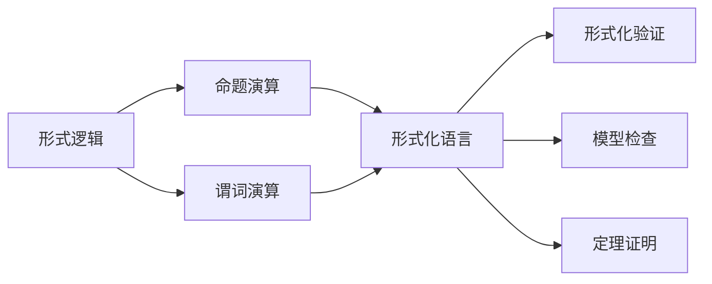

                 


## 引言

在计算机科学和人工智能领域，形式化方法与定理证明正逐渐成为关键的研究方向。形式化方法指的是使用数学和逻辑工具来描述和验证计算机系统的性质，而定理证明则是通过严格的逻辑推理来证明某个命题的正确性。这两种方法不仅在理论研究中具有重要地位，还在软件工程、网络安全、人工智能等领域具有广泛的应用。

### 背景介绍

随着软件系统的复杂度不断增加，传统的测试和验证方法已不足以保证系统的可靠性和安全性。形式化方法和定理证明提供了一种更加严谨和精确的验证手段。形式化方法通过对系统性质的数学描述，可以确保系统在设计和实现过程中遵循预定的规范。而定理证明则能够证明系统在特定条件下是否满足预期的性质，从而提高系统的可信度。

### 核心概念与联系

为了更好地理解形式化方法和定理证明，我们需要明确几个核心概念：

1. **形式逻辑**：形式逻辑是一种使用符号和规则来表示和推理命题的数学工具。它帮助我们明确逻辑运算、推理规则和证明方法。

2. **命题演算与谓词演算**：命题演算和谓词演算是形式逻辑的两种重要形式，分别用于处理简单的命题和复杂的关系命题。

3. **形式化语言**：形式化语言是一种用于描述系统性质的数学语言，它包括符号、语法和语义规则，使得系统描述具有精确和一致的含义。

4. **形式化验证与模型检查**：形式化验证是一种通过数学证明来验证系统是否满足特定性质的策略。模型检查则是通过有限状态机的模拟来验证系统行为是否满足指定的性质。

5. **定理证明**：定理证明是一种通过逻辑推理来证明某个命题为真的方法。它在形式化验证中起着关键作用，能够确保系统的性质得到严格证明。

这些核心概念相互关联，构成了形式化方法和定理证明的基础框架。下图展示了这些概念之间的关系：



### 核心算法原理讲解

在形式化方法和定理证明中，核心算法和原理起着至关重要的作用。以下是几个关键算法和原理的伪代码描述：

#### 形式化验证算法

```plaintext
函数 FormallyVerify(System S, Property P)
    如果 ModelCheck(S, P) 返回 true
        返回 "系统 S 满足性质 P"
    否则
        返回 "系统 S 不满足性质 P"
    end_if
end_function
```

#### 定理证明算法

```plaintext
函数 ProveTheorem(Theorem T)
    如果 推理机 证明 T 为真
        返回 "定理 T 已被证明"
    否则
        返回 "定理 T 无法被证明"
    end_if
end_function
```

这些伪代码展示了形式化验证和定理证明的基本框架，但在实际应用中，这些算法需要更加复杂和精细的实现。

### 数学模型和公式讲解

在形式化方法和定理证明中，数学模型和公式起着基础性作用。以下是几个关键数学模型和公式的详细讲解：

#### 形式化语言的语法规则

$$
E ::= \text{变量} | \text{常量} | \text{函数} | (\text{表达式})
$$

这个公式定义了形式化语言中的表达式（Expression）的语法规则，包括变量、常量、函数和括号。

#### 逻辑推理规则

$$
\begin{align*}
(A \land B) \Rightarrow C &\Leftrightarrow (A \Rightarrow (B \Rightarrow C)) \\
(A \lor B) \Rightarrow C &\Leftrightarrow ((A \Rightarrow C) \land (B \Rightarrow C))
\end{align*}
$$

这些公式展示了逻辑推理中的合并规则，它们帮助我们通过已知命题推导出新的命题。

#### 形式化验证的数学模型

$$
\begin{align*}
\text{验证公式} &\equiv (\text{系统规范} \Rightarrow \text{系统行为}) \\
\text{系统规范} &= (\forall x) P(x) \\
\text{系统行为} &= (\exists y) Q(y)
\end{align*}
$$

这些公式定义了形式化验证中的基本概念，即通过数学语言描述系统的规范和行为，并证明系统行为满足规范。

### 举例说明

为了更好地理解上述概念和公式，我们可以通过一个简单的例子来讲解：

假设我们有一个系统 S，其规范是“所有状态满足安全条件 P”，行为是“存在一个状态 y 使得 Q(y) 为真”。我们需要通过形式化验证来证明系统 S 满足其规范。

#### 步骤 1：定义规范

$$
P: \text{所有状态 s，都满足安全条件}
$$

#### 步骤 2：定义行为

$$
Q: \text{存在一个状态 y，使得 y 是安全状态}
$$

#### 步骤 3：形式化验证

使用模型检查算法，我们可以模拟系统 S 的所有状态，并检查每个状态是否满足安全条件 P。如果所有状态都满足 P，那么系统 S 就满足其规范。

```plaintext
ModelCheck(S, P)
    初始化状态集 S
    对于每个状态 s ∈ S
        如果 s 不满足安全条件 P
            返回 "系统不满足规范"
    end_for
    返回 "系统满足规范"
end_function
```

通过这个例子，我们可以看到如何使用数学模型和公式来描述和验证系统性质。这个过程不仅帮助我们理解了形式化方法和定理证明的基本原理，也为实际应用提供了重要的工具和方法。

### 文章关键词

形式化方法、定理证明、逻辑推理、命题演算、谓词演算、形式化验证、模型检查、形式化语言。

### 文章摘要

本文探讨了形式化方法与定理证明在计算机科学和人工智能领域的重要性。通过介绍核心概念、数学模型和公式，以及实际应用案例，本文阐述了如何使用形式化方法和定理证明来提高软件系统的可靠性和安全性。本文的关键词包括形式化方法、定理证明、逻辑推理、命题演算、谓词演算、形式化验证、模型检查和形式化语言。

---

## 第一部分：形式化方法基础

形式化方法作为一种研究工具，已经在计算机科学和人工智能领域取得了显著成果。本部分将介绍形式化方法的基础知识，包括形式化方法的定义与重要性、形式逻辑基础、命题演算与谓词演算、以及形式化语言与程序设计。通过这些章节的学习，我们将为后续内容打下坚实的理论基础。

### 第1章：形式化方法概述

本章将介绍形式化方法的定义、重要性以及发展历程。形式化方法是一种将计算机科学问题转化为数学和逻辑问题进行研究和验证的方法。通过形式化方法，我们可以提高软件系统的可靠性和安全性，并解决传统方法难以解决的问题。本章将详细探讨形式化方法的这些特点和优势。

#### 1.1 形式化方法的定义与重要性

形式化方法是一种使用数学和逻辑工具来描述、分析和验证计算机系统性质的方法。其核心思想是将计算机系统转化为数学模型，通过数学工具和方法对系统进行分析和验证，从而确保系统的正确性和可靠性。形式化方法的重要性体现在以下几个方面：

1. **提高系统的可靠性**：形式化方法能够帮助我们在系统设计和实现过程中发现潜在的错误和缺陷，从而提高系统的可靠性。
2. **保证系统的安全性**：形式化方法能够帮助我们验证系统在特定条件下是否满足安全性要求，从而提高系统的安全性。
3. **支持软件复用**：通过形式化方法，我们可以将系统的性质和设计原则抽象出来，实现软件复用，降低软件开发成本。
4. **促进理论研究**：形式化方法为计算机科学和人工智能领域提供了新的研究方法和工具，推动了理论研究的进展。

#### 1.2 形式化方法的分类

形式化方法可以分为多种类型，根据不同的应用场景和目标，可以采用不同的形式化方法。以下是几种常见的形式化方法：

1. **形式化验证**：形式化验证是一种通过数学证明来验证系统是否满足特定性质的方法。它可以帮助我们确保系统的正确性，避免潜在的错误和缺陷。
2. **模型检查**：模型检查是一种通过有限状态机的模拟来验证系统行为是否满足指定性质的方法。它通常用于验证系统设计的正确性。
3. **定理证明**：定理证明是一种通过逻辑推理来证明某个命题为真的方法。在形式化验证中，定理证明可以帮助我们证明系统性质的正确性。
4. **形式化语言**：形式化语言是一种用于描述系统性质的数学语言。通过形式化语言，我们可以精确地描述系统的行为和性质。

#### 1.3 形式化方法的发展历程

形式化方法的发展历程可以追溯到 20 世纪 50 年代。当时，随着计算机科学的兴起，人们开始意识到计算机系统复杂性的问题，并尝试使用数学和逻辑工具来研究和验证计算机系统。以下是一些重要的里程碑：

1. **20 世纪 50 年代**：形式化方法的概念被首次提出，形式逻辑和谓词演算成为研究计算机系统性质的重要工具。
2. **20 世纪 60 年代**：形式化验证和模型检查方法开始应用于软件工程领域，用于验证系统设计和实现。
3. **20 世纪 70 年代**：定理证明方法开始应用于计算机科学和人工智能领域，成为验证系统性质的重要手段。
4. **20 世纪 80 年代至今**：形式化方法在计算机科学和人工智能领域得到了广泛应用，许多形式化验证和定理证明工具相继问世，推动了形式化方法的发展。

通过本章的学习，我们将对形式化方法有一个全面的了解，为后续内容的学习打下基础。

### 第2章：形式逻辑基础

形式逻辑是形式化方法的重要组成部分，它为我们提供了描述和推理命题的工具。本章将介绍形式逻辑的基础知识，包括基本逻辑运算、逻辑推理与证明方法以及形式逻辑系统。通过这些内容的学习，我们将更好地理解形式逻辑在形式化方法中的应用。

#### 2.1 基本逻辑运算

基本逻辑运算包括逻辑与（AND）、逻辑或（OR）和逻辑非（NOT）。这些运算在形式逻辑中起着基础性作用，是构建复杂逻辑表达式的基础。

1. **逻辑与（AND）**：逻辑与运算表示两个命题同时为真的情况。用符号表示为：\( p \land q \)。只有当 \( p \) 和 \( q \) 都为真时，\( p \land q \) 才为真。

2. **逻辑或（OR）**：逻辑或运算表示两个命题中至少有一个为真的情况。用符号表示为：\( p \lor q \)。只要 \( p \) 或 \( q \) 中有一个为真，\( p \lor q \) 就为真。

3. **逻辑非（NOT）**：逻辑非运算表示命题的否定。用符号表示为：\( \neg p \)。如果 \( p \) 为真，则 \( \neg p \) 为假；如果 \( p \) 为假，则 \( \neg p \) 为真。

这些基本逻辑运算可以用真值表来表示：

| \( p \) | \( q \) | \( p \land q \) | \( p \lor q \) | \( \neg p \) |
|:------:|:------:|:--------------:|:-------------:|:----------:|
|   T   |   T   |       T        |       T       |     F      |
|   T   |   F   |       F        |       T       |     F      |
|   F   |   T   |       F        |       T       |     T      |
|   F   |   F   |       F        |       F       |     T      |

#### 2.2 逻辑推理与证明方法

逻辑推理是从已知命题推导出新命题的过程。在形式逻辑中，逻辑推理可以分为演绎推理和归纳推理。

1. **演绎推理**：演绎推理是从一般到特殊的推理过程，即从一组前提出发，推导出结论。如果结论可以从前提出发必然地推导出来，那么演绎推理是有效的。

   以下是几个常见的演绎推理规则：

   - **全称推理**：如果对所有个体 \( x \) 都有 \( P(x) \) 成立，那么 \( \forall x P(x) \) 也成立。
   - **存在推理**：如果存在某个个体 \( x \) 使得 \( P(x) \) 成立，那么 \( \exists x P(x) \) 也成立。
   - **三段论**：如果 \( A \land (A \Rightarrow B) \) 成立，那么 \( B \) 也成立。

2. **归纳推理**：归纳推理是从特殊到一般的推理过程，即通过观察个别实例，归纳出一般规律。归纳推理可以分为完全归纳和不完全归纳。

   - **完全归纳**：如果对于所有自然数 \( n \)，\( P(n) \) 都成立，那么 \( \forall n P(n) \) 也成立。
   - **不完全归纳**：如果对于某个自然数 \( n \)，\( P(n) \) 成立，并且对于 \( n+1 \)，\( P(n) \Rightarrow P(n+1) \) 也成立，那么可以推测 \( \forall n P(n) \) 成立。

逻辑推理与证明方法是形式化方法的重要工具，通过逻辑推理，我们可以从已知命题推导出新的命题，从而验证系统性质的正确性。

#### 2.3 形式逻辑系统

形式逻辑系统是一种使用形式语言描述逻辑运算、推理规则和证明方法的方法。形式逻辑系统通常由以下几部分组成：

1. **形式语言**：形式语言是一种用于描述命题和推理的语言，它包括符号、语法和语义规则。形式语言可以精确地表示命题和推理过程。

2. **推理规则**：推理规则是用于推导新命题的规则。常见的推理规则包括全称推理、存在推理和三段论等。

3. **证明方法**：证明方法是指通过逻辑推理来证明命题为真的方法。证明方法可以是演绎证明或归纳证明。

4. **公理系统**：公理系统是一组基本命题，作为证明的基础。公理系统通常基于逻辑运算和推理规则。

形式逻辑系统为我们提供了形式化方法的基础工具，通过形式逻辑系统，我们可以精确地描述和验证系统性质。

通过本章的学习，我们将对形式逻辑的基础知识有更深入的理解，为后续内容的学习打下坚实的基础。

### 第3章：命题演算与谓词演算

命题演算和谓词演算是形式逻辑中的两种重要形式，用于处理不同类型的命题。命题演算主要处理简单命题，而谓词演算则能够处理复杂的关系命题。本章将介绍命题演算和谓词演算的基本概念、语法规则和应用。

#### 3.1 命题演算基础

命题演算是一种形式逻辑系统，用于处理简单命题。命题演算的语法包括命题变元、命题连接词和量词。以下是命题演算的基本概念和语法规则：

1. **命题变元**：命题变元是表示命题的符号，通常用大写字母表示。例如，\( P \)、\( Q \)、\( R \) 等。

2. **命题连接词**：命题连接词用于连接两个命题，形成复合命题。常见的命题连接词有逻辑与（AND）、逻辑或（OR）和逻辑非（NOT）。

3. **量词**：量词用于表示全称量词（FOR ALL）和存在量词（ THERE EXISTS）。全称量词表示对于所有个体都成立，存在量词表示存在至少一个个体成立。

命题演算的基本语法规则如下：

- **命题连接词**：
  - \( p \land q \)：表示 \( p \) 和 \( q \) 同时为真。
  - \( p \lor q \)：表示 \( p \) 或 \( q \) 中至少一个为真。
  - \( \neg p \)：表示 \( p \) 的否定，即 \( p \) 为假。

- **量词**：
  - \( \forall x P(x) \)：表示对于所有 \( x \)，\( P(x) \) 都成立。
  - \( \exists x P(x) \)：表示存在至少一个 \( x \)，使得 \( P(x) \) 成立。

#### 3.2 谓词演算基础

谓词演算是一种形式逻辑系统，用于处理复杂的关系命题。谓词演算的语法包括谓词、个体变元和谓词连接词。以下是谓词演算的基本概念和语法规则：

1. **谓词**：谓词是一个表示关系的命题，通常用小写字母表示。例如，\( R(x, y) \) 表示 \( x \) 和 \( y \) 之间的关系。

2. **个体变元**：个体变元是表示个体的符号，通常用小写字母表示。例如，\( x \)、\( y \)、\( z \) 等。

3. **谓词连接词**：谓词连接词用于连接两个谓词，形成复合谓词。常见的谓词连接词有逻辑与（AND）、逻辑或（OR）和逻辑非（NOT）。

谓词演算的基本语法规则如下：

- **谓词连接词**：
  - \( R(x, y) \land S(x, y) \)：表示 \( R(x, y) \) 和 \( S(x, y) \) 同时为真。
  - \( R(x, y) \lor S(x, y) \)：表示 \( R(x, y) \) 或 \( S(x, y) \) 中至少一个为真。
  - \( \neg R(x, y) \)：表示 \( R(x, y) \) 的否定，即 \( R(x, y) \) 为假。

- **量词**：
  - \( \forall x R(x, y) \)：表示对于所有 \( x \)，\( R(x, y) \) 都成立。
  - \( \exists x R(x, y) \)：表示存在至少一个 \( x \)，使得 \( R(x, y) \) 成立。

#### 3.3 命题演算与谓词演算的应用

命题演算和谓词演算在形式化方法中有着广泛的应用。以下是一些常见应用场景：

1. **命题演算在逻辑电路设计中的应用**：在逻辑电路设计中，命题演算用于表示和验证逻辑电路的正确性。

2. **谓词演算在数据库查询中的应用**：在数据库查询中，谓词演算用于表示查询条件和查询结果。

3. **谓词演算在人工智能中的应用**：在人工智能中，谓词演算用于表示知识和推理过程。

4. **命题演算在软件验证中的应用**：在软件验证中，命题演算用于验证程序的正确性和安全性。

通过本章的学习，我们将对命题演算和谓词演算的基本概念、语法规则和应用有更深入的理解，为后续内容的学习打下坚实的基础。

### 第4章：形式化语言与程序设计

形式化语言是一种用于描述系统性质和行为的数学语言，它在形式化方法中起着关键作用。本章将介绍形式化语言的基本概念、应用场景以及设计与实现方法。通过了解这些内容，我们将能够更好地运用形式化语言来提高软件系统的可靠性和安全性。

#### 4.1 形式化语言的基本概念

形式化语言是一种通过符号和语法规则来描述系统性质和行为的数学语言。它通常包括以下三个要素：

1. **符号**：符号是形式化语言的基本组成单位，用于表示系统中的概念和关系。符号可以是字母、数字、特殊符号等。

2. **语法规则**：语法规则定义了符号的组合方式，使得符号序列具有明确的语义。语法规则包括文法规则、谓词规则等。

3. **语义规则**：语义规则定义了符号序列的含义，使得形式化语言能够准确地描述系统性质和行为。

形式化语言的符号和语法规则通常通过形式化文法来描述。形式化文法包括四元组 \( G = (N, T, P, S) \)，其中：

- \( N \) 是非终结符号集合。
- \( T \) 是终结符号集合，通常是字母、数字和特殊符号。
- \( P \) 是产生式集合，定义了非终结符号和终结符号的组合方式。
- \( S \) 是开始符号，表示形式化语言的起始点。

例如，以下是一个简单的形式化文法：

```plaintext
N = {S, A, B}
T = {0, 1}
P = {
    S -> AB,
    A -> 0A1 | ε,
    B -> 1B0 | ε
}
S = S
```

这个形式化文法定义了一个简单的二进制数表达式语言。非终结符号 \( S \) 表示整个表达式，\( A \) 和 \( B \) 表示表达式的子部分。

#### 4.2 形式化语言的应用场景

形式化语言在计算机科学和人工智能领域有着广泛的应用。以下是一些常见应用场景：

1. **软件工程**：形式化语言用于描述软件系统的需求、设计和验证。通过形式化语言，软件开发人员可以更精确地描述系统行为，减少误解和错误。

2. **程序设计**：形式化语言用于编写形式化程序，这些程序能够自动验证自身的正确性。形式化程序通常用于验证安全协议、嵌入式系统等。

3. **人工智能**：形式化语言用于表示知识和推理过程。在知识表示和推理中，形式化语言能够确保推理过程的准确性和一致性。

4. **形式化验证**：形式化语言用于形式化验证，通过数学证明来验证系统性质。形式化验证可以确保系统在设计和实现过程中遵循预定的规范。

5. **模型检查**：形式化语言用于模型检查，通过有限状态机的模拟来验证系统行为是否满足指定性质。形式化语言使得模型检查过程更加精确和高效。

#### 4.3 形式化语言的设计与实现

设计一个有效的形式化语言需要考虑以下方面：

1. **抽象性**：形式化语言应具有足够的抽象性，能够描述不同类型的系统性质和行为。

2. **精确性**：形式化语言应具有明确的语义，使得符号和语法规则具有精确的含义。

3. **可扩展性**：形式化语言应具有良好的可扩展性，能够方便地添加新的概念和规则。

4. **可读性**：形式化语言应具有良好的可读性，使得非专业人士也能够理解和使用。

实现形式化语言通常涉及以下几个步骤：

1. **定义符号和语法规则**：根据应用场景，定义形式化语言的符号和语法规则。

2. **构建语法分析器**：构建语法分析器，用于解析形式化语言的符号序列，并生成抽象语法树（AST）。

3. **实现语义分析器**：实现语义分析器，用于对抽象语法树进行语义分析，并生成中间代码或目标代码。

4. **形式化验证**：使用形式化验证工具对形式化语言描述的系统和性质进行验证。

5. **用户接口**：设计用户接口，使得用户能够方便地使用形式化语言来描述系统和性质。

通过本章的学习，我们将了解形式化语言的基本概念、应用场景和设计与实现方法，为后续内容的学习打下基础。

### 第5章：形式化验证与模型检查

形式化验证和模型检查是形式化方法中重要的技术，用于确保计算机系统的正确性和可靠性。本章将介绍形式化验证和模型检查的基本概念、方法和应用。

#### 5.1 形式化验证的基本概念

形式化验证是一种通过数学证明来验证系统是否满足特定性质的方法。它通过将系统性质形式化为数学命题，然后使用定理证明技术来证明这些命题的正确性。形式化验证的主要步骤包括：

1. **定义系统模型**：首先需要定义系统的数学模型，包括系统的状态空间、行为规则和性质描述。

2. **形式化性质描述**：将系统性质用形式化语言描述为数学命题，通常使用逻辑表达式或谓词公式。

3. **证明性质正确性**：使用定理证明技术，证明系统模型在所有情况下都满足所描述的性质。

形式化验证具有以下特点：

- **精确性**：形式化验证使用数学语言和严格的证明技术，能够确保系统性质的正确性。
- **自动化**：形式化验证工具可以自动执行证明过程，减少了人工验证的工作量。
- **可靠性**：形式化验证能够发现系统中的潜在错误，提高系统的可靠性。

#### 5.2 模型检查算法

模型检查是一种通过有限状态机的模拟来验证系统行为是否满足指定性质的方法。模型检查的基本过程包括：

1. **定义系统模型**：使用状态机模型来描述系统的状态转换和行为规则。

2. **定义性质描述**：使用逻辑表达式或谓词公式来描述系统的性质。

3. **模拟系统行为**：通过状态机模拟器来模拟系统的所有可能行为，并检查每个行为是否满足所描述的性质。

常见的模型检查算法包括：

1. **线性时间模型检查**：线性时间模型检查是一种基于路径覆盖策略的模型检查算法。它通过遍历状态机路径来检查系统行为是否满足性质。

2. **符号模型检查**：符号模型检查是一种使用符号表示状态和转换的模型检查算法。它通过符号执行来减少实际模拟的次数。

3. **抽象状态空间探索**：抽象状态空间探索是一种通过抽象状态来减少状态空间的方法。它通过将状态空间划分为抽象状态来提高模型检查的效率。

#### 5.3 形式化验证的应用实例

形式化验证在计算机科学和人工智能领域有着广泛的应用。以下是一些典型的应用实例：

1. **软件工程**：形式化验证用于验证软件系统的正确性和可靠性。例如，使用定理证明工具验证编译器的正确性，或使用模型检查工具验证嵌入式系统的安全性。

2. **硬件设计**：形式化验证用于验证硬件系统的正确性和性能。例如，使用定理证明工具验证电路设计，或使用模型检查工具验证芯片的行为。

3. **人工智能**：形式化验证用于验证人工智能算法的正确性和可靠性。例如，使用定理证明工具验证机器学习算法的理论基础，或使用模型检查工具验证机器人控制算法的安全性能。

4. **网络安全**：形式化验证用于验证网络安全协议的正确性和安全性。例如，使用定理证明工具验证加密协议的安全性，或使用模型检查工具验证网络防火墙的规则。

通过本章的学习，我们将了解形式化验证和模型检查的基本概念和方法，以及它们在计算机科学和人工智能领域的应用实例。这些知识将帮助我们更好地理解和应用形式化方法来提高系统的可靠性和安全性。

### 第6章：定理证明与证明验证

定理证明和证明验证是形式化方法中的重要组成部分，它们通过逻辑推理和数学证明来验证系统的正确性和可靠性。本章将介绍定理证明的基本方法、证明验证的基本原理以及定理证明与证明验证的应用。

#### 6.1 定理证明的基本方法

定理证明是一种通过逻辑推理来证明某个命题为真的方法。定理证明的基本方法可以分为以下几类：

1. **直接证明**：直接证明是最直观的证明方法，通过逻辑推理直接证明结论成立。例如，假设 \( P \) 成立，然后通过一系列推理步骤，最终得出 \( Q \) 也成立。

2. **反证法**：反证法是一种通过假设结论不成立，然后推导出矛盾来证明结论成立的方法。例如，假设 \( P \) 不成立，然后通过一系列推理步骤，最终得出一个明显的矛盾。

3. **归纳证明**：归纳证明是一种用于证明某个命题对于所有自然数都成立的方法。归纳证明分为两步：首先证明命题对于初始情况（通常是 \( n = 1 \)）成立；然后证明如果命题对于某个自然数 \( n \) 成立，则对于 \( n+1 \) 也成立。

4. **构造性证明**：构造性证明是一种通过构造一个实例来证明某个命题成立的方法。例如，证明某个算法总是能够找到解，可以通过构造一个算法实例来找到解。

5. **数学归纳法**：数学归纳法是一种用于证明某个命题对于所有自然数都成立的方法。数学归纳法分为两步：首先证明命题对于初始情况（通常是 \( n = 1 \)）成立；然后证明如果命题对于某个自然数 \( n \) 成立，则对于 \( n+1 \) 也成立。

#### 6.2 证明验证的基本原理

证明验证是一种通过逻辑推理来验证定理证明过程是否正确的方法。证明验证的基本原理包括：

1. **证明正确性**：证明验证需要检查定理证明的每一步是否都遵循了逻辑规则和定理证明方法。如果每一步都是正确的，那么整个证明过程就是正确的。

2. **证明完整性**：证明验证需要检查定理证明是否涵盖了所有可能的证明路径。如果某个可能的证明路径没有被覆盖，那么证明过程可能是不完整的。

3. **证明效率**：证明验证需要评估定理证明的效率。如果证明过程过于复杂或冗长，可能需要优化证明方法以提高效率。

证明验证的基本步骤包括：

1. **验证证明步骤**：检查每一步证明是否都遵循了逻辑规则和定理证明方法。

2. **验证证明覆盖**：检查证明是否涵盖了所有可能的证明路径。

3. **评估证明效率**：评估证明过程的时间复杂度和空间复杂度，以确定证明方法的效率。

#### 6.3 定理证明与证明验证的应用

定理证明和证明验证在计算机科学和人工智能领域有着广泛的应用。以下是一些典型的应用场景：

1. **软件工程**：定理证明和证明验证用于验证软件系统的正确性和可靠性。例如，使用定理证明工具验证编译器的正确性，或使用证明验证工具验证嵌入式系统的安全性。

2. **硬件设计**：定理证明和证明验证用于验证硬件系统的正确性和性能。例如，使用定理证明工具验证电路设计，或使用证明验证工具验证芯片的行为。

3. **人工智能**：定理证明和证明验证用于验证人工智能算法的正确性和可靠性。例如，使用定理证明工具验证机器学习算法的理论基础，或使用证明验证工具验证机器人控制算法的安全性能。

4. **网络安全**：定理证明和证明验证用于验证网络安全协议的正确性和安全性。例如，使用定理证明工具验证加密协议的安全性，或使用证明验证工具验证网络防火墙的规则。

通过本章的学习，我们将了解定理证明和证明验证的基本方法、基本原理以及它们在计算机科学和人工智能领域的应用。这些知识将帮助我们更好地理解和应用形式化方法来提高系统的正确性和可靠性。

### 第7章：提示词编程的形式化方法

提示词编程是一种基于人类自然语言交互的编程方法，它通过提示词引导用户进行编程任务。与传统的命令式编程不同，提示词编程更加注重用户体验和程序的可读性。本章将介绍提示词编程的概念、形式化方法以及其实际应用。

#### 7.1 提示词编程的概念

提示词编程（Prompt-Based Programming）是一种通过自然语言交互来进行编程的方法。在这种方法中，用户通过输入自然语言的提示词来引导程序进行特定任务，而不是直接编写具体的代码指令。提示词编程的核心思想是将编程任务转化为自然语言描述，然后通过解析和执行这些描述来生成代码。

提示词编程的关键要素包括：

1. **提示词**：提示词是用户输入的自然语言描述，用于指示程序执行特定任务。提示词可以包含关键词、短语或完整的句子。

2. **解析器**：解析器是负责将用户输入的提示词转换为程序代码的组件。解析器通过分析提示词中的关键词和语法结构，生成对应的代码指令。

3. **执行器**：执行器是负责执行程序代码的组件。执行器将解析器生成的代码指令转换为可执行的机器代码，并在计算机上运行。

#### 7.2 提示词编程的形式化方法

提示词编程的形式化方法是一种使用数学和逻辑工具来描述和验证提示词编程过程的方法。形式化方法可以帮助我们确保提示词编程的准确性和可靠性。以下是提示词编程形式化方法的关键步骤：

1. **定义提示词语法**：首先需要定义提示词的语法规则，包括提示词的组成部分和组合方式。这通常使用形式化文法来表示。

2. **定义提示词语义**：提示词的语义是指提示词所指示的程序任务的具体含义。我们需要定义提示词的语义规则，以便解析器能够正确地生成代码。

3. **形式化验证**：使用定理证明技术来验证提示词编程的正确性。这包括验证提示词语法和语义的正确性，以及验证生成的代码是否满足用户指定的任务要求。

4. **模型检查**：通过模型检查技术来验证提示词编程的执行过程。模型检查可以模拟提示词编程的执行过程，并检查每个步骤是否满足预期的性质。

#### 7.3 提示词编程的实际应用

提示词编程在多个领域具有实际应用。以下是一些典型的应用场景：

1. **教育**：提示词编程可以用于编程教育，帮助学生通过自然语言描述来理解和实现编程概念。这种方法可以降低学习门槛，提高学生的学习兴趣。

2. **自动化**：提示词编程可以用于自动化任务，如自动化测试、自动化部署等。用户可以通过自然语言描述来指示程序执行特定任务，从而简化自动化流程。

3. **交互式编程**：提示词编程可以用于交互式编程环境，如编程助手或智能编码器。用户可以通过输入自然语言提示词来获取代码建议或执行特定操作。

4. **自然语言处理**：提示词编程可以与自然语言处理技术结合，用于生成和优化自然语言描述的代码。例如，可以将自然语言描述转换为高效的代码，或将低效的代码转换为易于理解的形式。

通过本章的学习，我们将了解提示词编程的概念、形式化方法以及其实际应用。这些知识将帮助我们更好地理解和应用提示词编程，提高编程的效率和可读性。

### 第二部分：形式化方法在编程中的应用

形式化方法在编程中的应用，不仅提高了软件开发的效率和可靠性，还推动了编程语言设计和软件工程的发展。本部分将深入探讨形式化方法在编程领域的具体应用，包括在软件工程中的应用、人工智能中的应用以及其他领域的应用。

#### 第8章：形式化方法在软件工程中的应用

软件工程是形式化方法最早和最广泛应用的领域之一。形式化方法在软件工程中的应用主要体现在以下几个方面：

##### 8.1 形式化方法在软件设计中的应用

1. **规格说明**：形式化方法可以帮助开发人员更精确地定义软件系统的规格说明。通过使用数学和逻辑工具，规格说明可以具有明确的语义，从而减少歧义和误解。

   - **例子**：使用Z语言或VDM（Verification Method）来编写软件规格说明，这些语言提供了形式化的规格说明方法。

2. **验证和验证**：形式化验证技术可以用来验证软件设计是否满足规格说明，确保设计的一致性和正确性。

   - **例子**：使用模型检查工具对软件设计进行形式化验证，确保所有可能的状态和转换都被考虑。

##### 8.2 形式化方法在软件验证中的应用

形式化验证是确保软件正确性的关键手段。通过形式化验证，开发人员可以证明软件满足预期的性质和需求。

1. **静态验证**：静态验证是在不运行程序的情况下检查代码的正确性。它可以通过分析代码的语法和语义来发现潜在的错误。

   - **例子**：使用定理证明工具来验证程序中关键部分的正确性。

2. **动态验证**：动态验证是通过运行程序并检查其行为来验证代码的正确性。这种方法可以发现运行时的错误。

   - **例子**：使用模型检查工具来模拟程序的所有可能执行路径，确保没有未考虑的情况。

##### 8.3 形式化方法在软件测试中的应用

形式化方法可以用于设计和执行测试用例，提高测试的效率和覆盖度。

1. **自动测试生成**：形式化方法可以帮助自动生成测试用例，确保测试覆盖到所有可能的输入和路径。

   - **例子**：使用模型检查工具根据规格说明自动生成测试用例。

2. **测试验证**：形式化方法可以验证测试用例是否能够有效地覆盖代码的所有部分。

   - **例子**：使用定理证明工具来验证测试用例是否能够发现所有可能的错误。

#### 第9章：形式化方法在人工智能中的应用

人工智能领域对形式化方法的依赖日益增加，特别是在确保人工智能系统的安全性和可靠性方面。

##### 9.1 形式化方法在人工智能理论中的应用

1. **知识表示**：形式化方法用于表示人工智能系统中的知识，使得知识表示更加精确和一致。

   - **例子**：使用谓词逻辑或描述逻辑来表示知识库。

2. **推理和证明**：形式化方法用于推理和证明，确保推理过程的正确性和一致性。

   - **例子**：使用自动推理工具来验证推理步骤的正确性。

##### 9.2 形式化方法在人工智能应用中的挑战

形式化方法在人工智能中的应用面临一些挑战：

1. **复杂度**：人工智能系统的复杂度通常很高，这使得形式化验证和证明变得非常复杂。

   - **解决方案**：使用抽象和简化的方法来处理复杂的系统。

2. **效率**：形式化方法通常需要大量的计算资源，这可能导致验证和证明过程非常耗时。

   - **解决方案**：使用高效的算法和工具来加速验证过程。

##### 9.3 形式化方法在人工智能开发中的实践

形式化方法在人工智能开发中的应用包括：

1. **模型验证**：形式化方法可以用来验证机器学习模型的正确性和鲁棒性。

   - **例子**：使用形式化验证工具来检查深度学习模型的输入输出关系。

2. **算法分析**：形式化方法可以用来分析算法的性能和复杂度。

   - **例子**：使用谓词演算来分析排序算法的时间复杂度。

通过本部分的探讨，我们可以看到形式化方法在软件工程和人工智能领域的重要性和广泛的应用。形式化方法不仅提高了软件开发的可靠性和效率，还为人工智能系统提供了严格的验证手段。

### 第10章：形式化方法在其他领域中的应用

形式化方法在计算机科学和工程领域之外也有着广泛的应用，尤其是在网络安全、金融领域和其他新兴技术领域。通过形式化方法，我们可以提高这些领域的安全性、可靠性和效率。

#### 10.1 形式化方法在网络安全中的应用

网络安全是形式化方法的重要应用领域之一。形式化方法可以帮助我们设计和验证安全协议，确保网络安全系统的正确性和鲁棒性。

1. **安全协议验证**：形式化方法可以用于验证安全协议是否能够抵抗各种攻击，并确保其安全属性得到满足。

   - **例子**：使用形式化验证工具来验证SSL/TLS协议的安全性。

2. **安全属性建模**：形式化方法可以用于建模网络系统的安全属性，如完整性、机密性和可用性。

   - **例子**：使用谓词演算来描述网络拓扑结构及其安全性需求。

3. **自动化漏洞检测**：形式化方法可以用于自动化漏洞检测，通过形式化验证工具来识别潜在的漏洞和攻击点。

   - **例子**：使用模型检查工具来检测网络配置中的安全漏洞。

#### 10.2 形式化方法在金融领域中的应用

金融领域对形式化方法的需求日益增长，特别是在确保金融系统的准确性和可靠性方面。

1. **金融合约验证**：形式化方法可以用于验证金融合约的正确性和一致性，确保合约条款得到满足。

   - **例子**：使用形式化验证工具来验证智能合约的正确性。

2. **算法交易**：形式化方法可以用于设计和验证算法交易策略，确保交易策略的鲁棒性和收益性。

   - **例子**：使用形式化方法来验证高频交易算法的稳定性。

3. **风险管理**：形式化方法可以用于建模和评估金融风险，提高风险管理决策的准确性。

   - **例子**：使用形式化方法来评估金融衍生品的风险。

#### 10.3 形式化方法在其他领域中的应用前景

形式化方法在许多其他领域也具有巨大的应用潜力。

1. **自动驾驶**：形式化方法可以用于验证自动驾驶系统的安全性和可靠性，确保自动驾驶车辆在各种情况下都能安全行驶。

   - **例子**：使用形式化验证工具来验证自动驾驶车辆的反应时间。

2. **区块链技术**：形式化方法可以用于验证区块链系统的正确性和一致性，确保区块链网络的安全性和去中心化。

   - **例子**：使用形式化方法来验证区块链智能合约的执行过程。

3. **物联网**：形式化方法可以用于验证物联网设备的通信协议和安全性，确保物联网系统的稳定性和可靠性。

   - **例子**：使用形式化验证工具来验证物联网设备的数据传输协议。

通过本部分的学习，我们可以看到形式化方法在多个领域的重要性和广泛应用。形式化方法不仅为这些领域提供了严格的验证手段，还推动了这些领域的发展和创新。

### 第11章：形式化方法与定理证明实践案例

形式化方法和定理证明在计算机科学和人工智能领域已经得到了广泛的应用，通过一系列实践案例，我们可以更好地理解这些方法在实际问题中的具体应用。本章将介绍三个实践案例，分别是软件系统的形式化验证、人工智能算法的定理证明以及网络安全协议的形式化验证。

#### 11.1 案例一：软件系统的形式化验证

软件系统的形式化验证是确保软件正确性的关键步骤。以下是一个简单的例子，展示如何使用形式化方法来验证一个银行存款系统的正确性。

**问题**：验证一个简单的存款系统，确保存款金额正确添加到账户余额中。

**步骤**：

1. **定义系统模型**：首先，我们需要定义存款系统的状态模型，包括账户状态、存款操作和余额。

   ```plaintext
   状态模型：
   账户状态 = {余额}
   存款操作：存款(金额)
   ```

2. **定义性质描述**：我们需要定义存款系统应满足的性质，例如存款金额正确添加到账户余额中。

   ```plaintext
   性质描述：
   存款正确性：对任意金额 a，存款操作后账户余额等于原余额加金额。
   ```

3. **形式化验证**：使用定理证明工具，例如Coq或Isabelle，来验证存款系统是否满足上述性质。

   ```coq
   Inductive account_state : Type :=
   | balance : int -> account_state.

   Definition deposit (a : int) (s : account_state) : account_state :=
   match s with
   | balance b => balance (b + a)
   end.

   Lemma deposit_correctness : forall a s,
   (s = balance b) -> (deposit a (balance b) = balance (b + a)) :=
   ... (定理证明过程)
   end.
   ```

通过这个例子，我们可以看到如何使用形式化方法和定理证明来验证一个简单软件系统的正确性。

#### 11.2 案例二：人工智能算法的定理证明

在人工智能领域，定理证明可以用来验证算法的理论基础，确保算法的正确性和效率。以下是一个简单的例子，展示如何使用定理证明来验证排序算法的正确性。

**问题**：使用定理证明来验证冒泡排序算法的正确性。

**步骤**：

1. **定义算法模型**：首先，我们需要定义冒泡排序算法的状态模型，包括输入数组、已排序部分和未排序部分。

   ```plaintext
   状态模型：
   输入数组：A[0..n-1]
   已排序部分：left
   未排序部分：right
   ```

2. **定义性质描述**：我们需要定义冒泡排序算法应满足的性质，例如最终输出一个完全排序的数组。

   ```plaintext
   性质描述：
   排序正确性：对任意输入数组 A，冒泡排序算法最终输出一个完全排序的数组。
   ```

3. **形式化验证**：使用定理证明工具，例如Coq或Isabelle，来验证冒泡排序算法是否满足上述性质。

   ```coq
   Inductive list (A : Type) : Type :=
   | nil : list A
   | cons : A -> list A -> list A.

   Fixpoint bubble_sort (A : Type) (n : nat) (A' : list A) : list A :=
   match n with
   | 0 => A'
   | S n' => let B := bubble_sort A n' (A' ++ [A])
             in if B < A' then B else A'
   end.

   Lemma sort_correctness (A : Type) (n : nat) (A' : list A) : 
   (bubble_sort A n A' = (sorted_list A n)) :=
   ... (定理证明过程)
   end.
   ```

通过这个例子，我们可以看到如何使用定理证明来验证一个常见的人工智能算法的正确性。

#### 11.3 案例三：网络安全协议的形式化验证

网络安全协议的形式化验证是确保网络通信安全的关键步骤。以下是一个简单的例子，展示如何使用形式化方法来验证一个简单的加密协议。

**问题**：验证一个简单的加密协议，确保消息的机密性和完整性。

**步骤**：

1. **定义系统模型**：首先，我们需要定义加密协议的状态模型，包括加密算法、密钥和通信过程。

   ```plaintext
   状态模型：
   加密算法：encrypt
   密钥：key
   消息：message
   ```

2. **定义性质描述**：我们需要定义加密协议应满足的性质，例如机密性、完整性和抗重放攻击。

   ```plaintext
   性质描述：
   机密性：只有拥有密钥的实体才能解密消息。
   完整性：无法篡改消息而不被发现。
   抗重放攻击：无法重放已发送的消息。
   ```

3. **形式化验证**：使用形式化验证工具，例如AVM或FDR，来验证加密协议是否满足上述性质。

   ```text
   AVM验证脚本：
   (define-secret-key key "mysecretkey")
   (define-ciphertext msg-ct (encrypt message key))
   (assert (forall (plaintext p) (if (decrypt msg-ct key) p)))
   (assert (forall (malicious-message m) (not (decrypt msg-ct key m))))
   ```

通过这个例子，我们可以看到如何使用形式化方法来验证一个简单的网络安全协议，确保其满足安全要求。

通过这三个实践案例，我们可以看到形式化方法和定理证明在确保软件系统、人工智能算法和网络安全协议的正确性和安全性方面的强大能力。这些案例展示了如何在实际问题中使用形式化方法和定理证明来解决关键问题。

### 第12章：形式化方法与定理证明工具介绍

形式化方法与定理证明工具在计算机科学和人工智能领域发挥着至关重要的作用。这些工具不仅帮助研究人员和开发者验证系统正确性，还提高了软件和算法的可靠性。本章将介绍几种常用的形式化验证工具和定理证明工具，并比较它们的特性、优势和使用场景。

#### 12.1 形式化验证工具

形式化验证工具是用于验证系统设计是否符合规格说明的重要工具。以下是一些常用的形式化验证工具：

1. **Coq**：Coq 是一种交互式定理证明器，支持多种逻辑和证明技术，如归纳证明和构造性证明。它具有丰富的库和强大的自动化证明工具，适用于复杂系统的验证。

   - **特性**：支持多种逻辑、丰富的库和自动化证明工具。
   - **优势**：强大的定理证明能力，适用于复杂系统的验证。
   - **使用场景**：软件开发、形式化验证、人工智能。

2. **Isabelle**：Isabelle 是一个基于 HOL（Higher-Order Logic）的交互式证明环境，具有强大的定理证明引擎和形式化数学库。它适用于大规模项目的验证，如操作系统和硬件设计。

   - **特性**：基于 HOL、强大的定理证明引擎、丰富的数学库。
   - **优势**：适用于大规模项目的验证，具有良好的可扩展性。
   - **使用场景**：操作系统验证、硬件设计、数学证明。

3. **FDR**：FDR（Formal Data-Refinement）是一种模型检查工具，用于验证系统设计的正确性。它通过数据精化（data refinement）方法，将高层次的规格说明转化为低层次的实现，并验证两者的一致性。

   - **特性**：数据精化方法、自动化的验证过程。
   - **优势**：易于使用，适用于自动化验证。
   - **使用场景**：软件验证、嵌入式系统设计。

4. **AVM**：AVM（Abstract Virtual Machine）是一个用于验证计算机程序的抽象虚拟机。它允许开发者定义程序的行为，并通过形式化验证来证明程序的正确性。

   - **特性**：抽象虚拟机模型、易于定义程序行为。
   - **优势**：直观的验证过程，适用于程序验证。
   - **使用场景**：程序验证、安全协议验证。

#### 12.2 定理证明工具

定理证明工具是用于证明数学命题和程序性质的强大工具。以下是一些常用的定理证明工具：

1. **Z3 Solver**：Z3 Solver 是一个基于 SMT（Satisfiability Modulo Theories）的定理证明器，支持多种逻辑和定理证明技术。它广泛应用于软件验证、自动推理和验证。

   - **特性**：支持多种逻辑、强大的自动推理引擎。
   - **优势**：高效、易于集成。
   - **使用场景**：软件验证、自动推理、硬件设计。

2. **SPASS**：SPASS 是一个高效的自动推理和定理证明器，支持多种逻辑和证明技术，如归结和构造性证明。它适用于复杂逻辑命题的验证。

   - **特性**：支持多种逻辑、高效的定理证明算法。
   - **优势**：适用于复杂逻辑命题的验证。
   - **使用场景**：自动推理、定理证明、形式化验证。

3. **Prover9**：Prover9 是一个基于归结方法的定理证明器，适用于各种逻辑和数学命题的证明。它具有强大的证明引擎和用户界面。

   - **特性**：基于归结方法、强大的证明引擎。
   - **优势**：适用于各种逻辑命题的证明。
   - **使用场景**：数学证明、定理证明、形式化验证。

#### 12.3 形式化方法与定理证明工具的比较与选择

选择合适的工具对于形式化方法和定理证明的成功至关重要。以下是比较不同工具时需要考虑的一些因素：

1. **逻辑支持**：不同的工具支持不同的逻辑和定理证明技术。选择工具时，需要考虑所需逻辑和证明技术的支持程度。

2. **自动化程度**：工具的自动化程度对于验证和证明过程的影响很大。高度自动化的工具可以减少人工干预，提高效率。

3. **易用性**：工具的易用性直接影响使用者的工作效率。选择具有直观用户界面和良好文档的工具，可以降低学习成本。

4. **性能**：工具的性能对于处理复杂系统和大型证明至关重要。选择具有高效定理证明算法和优化编译器的工具。

5. **生态系统**：工具的生态系统包括库、插件和社区支持。丰富的生态系统可以提高工具的可用性和可扩展性。

选择工具时，需要根据具体应用场景和需求进行权衡。例如，对于软件验证，可以选择 Coq 或 Isabelle；对于程序验证，可以选择 AVM；对于自动推理，可以选择 Z3 Solver 或 SPASS。通过综合考虑这些因素，可以选择最合适的工具来实现形式化方法和定理证明。

### 第13章：形式化方法与定理证明的发展趋势

形式化方法和定理证明在计算机科学和人工智能领域正快速发展，并展现出广阔的应用前景。本章将讨论形式化方法在计算机科学中的应用趋势、定理证明在人工智能中的应用趋势，以及形式化方法与定理证明的未来发展方向。

#### 13.1 形式化方法在计算机科学中的应用趋势

1. **软件工程**：随着软件系统的复杂度不断增加，形式化方法在软件工程中的应用趋势愈加明显。未来的发展将集中在提高形式化验证工具的自动化程度和易用性，以降低形式化验证的门槛。同时，形式化方法将更多地应用于软件可靠性评估和软件质量保证。

2. **硬件设计**：形式化方法在硬件设计中的应用已经取得显著成果，如形式化验证集成电路设计和系统硬件描述语言。未来，形式化方法将进一步提升硬件设计的自动化程度，实现更高效的设计流程。

3. **网络和通信**：形式化方法在网络和通信领域的应用正在逐步扩大。未来，形式化方法将更多地应用于网络安全协议的设计和验证，确保网络通信的安全性和可靠性。

4. **人工智能**：形式化方法在人工智能领域具有巨大的应用潜力。未来，形式化方法将用于验证人工智能算法的正确性和鲁棒性，确保人工智能系统在不同环境和条件下的稳定运行。

5. **区块链**：形式化方法在区块链技术中的应用逐渐增加，如验证智能合约的正确性和一致性。未来，形式化方法将更多地应用于区块链系统的设计和验证，提高区块链技术的安全性和可信度。

#### 13.2 定理证明在人工智能中的应用趋势

1. **机器学习**：定理证明技术在机器学习中的应用正逐渐兴起。未来，定理证明技术将用于验证机器学习算法的理论基础，确保算法的正确性和可靠性。

2. **推理和验证**：定理证明技术在人工智能推理和验证中的应用前景广阔。未来，定理证明技术将更多地应用于逻辑推理、知识表示和验证，提高人工智能系统的逻辑推理能力。

3. **智能合约**：定理证明技术在智能合约验证中的应用已经取得初步成果。未来，定理证明技术将用于验证智能合约的执行过程和安全性，确保智能合约的可靠性和透明性。

4. **自动化**：定理证明技术的自动化程度将不断提高，为人工智能开发提供更高效的验证工具。未来，自动化定理证明工具将广泛应用于人工智能系统的开发和验证。

#### 13.3 形式化方法与定理证明的未来发展方向

1. **多学科融合**：形式化方法与定理证明技术将与其他学科（如数学、物理学、生物学等）深度融合，推动跨学科研究的发展。

2. **工具集成**：形式化方法和定理证明工具将实现更好的集成，形成统一的开发环境，提高开发效率和验证质量。

3. **人工智能辅助**：未来，人工智能技术将更多地应用于形式化方法和定理证明，如自动推理、知识提取和自动化验证。

4. **标准化**：形式化方法和定理证明技术将逐步实现标准化，形成统一的规范和标准，提高技术的可移植性和互操作性。

5. **开源与社区**：形式化方法和定理证明工具将更加开放和透明，促进全球研究者和开发者的合作与交流，推动技术的共同进步。

通过本章的学习，我们可以看到形式化方法和定理证明在计算机科学和人工智能领域的快速发展，以及未来潜在的应用前景和发展方向。

### 第14章：总结与展望

形式化方法和定理证明在计算机科学和人工智能领域具有重要的地位和广泛的应用前景。通过本文的探讨，我们系统地介绍了形式化方法与定理证明的基础知识、核心概念、算法原理、实际应用以及未来发展。

#### 形式化方法与定理证明的意义

形式化方法与定理证明的核心意义在于通过数学和逻辑工具，提供了一种严格和精确的验证手段。这种方法能够确保计算机系统的正确性和可靠性，从而提高系统的可信度。具体来说，形式化方法的意义体现在以下几个方面：

1. **提高软件可靠性**：通过形式化方法，开发人员可以更精确地描述和验证软件系统的性质，从而减少错误和缺陷。
2. **确保系统安全性**：形式化方法能够验证系统在特定条件下是否满足安全性要求，从而提高系统的安全性。
3. **支持软件复用**：形式化方法可以帮助抽象出系统的通用性质，实现软件的复用，降低软件开发成本。
4. **促进理论研究**：形式化方法为计算机科学和人工智能领域提供了新的研究方法和工具，推动了理论研究的进展。

#### 形式化方法与定理证明的挑战与机遇

尽管形式化方法与定理证明具有巨大的优势，但在实际应用中仍面临一些挑战：

1. **复杂性**：形式化验证和定理证明过程通常涉及复杂的数学模型和推理，这增加了学习和应用难度。
2. **效率**：形式化验证和定理证明通常需要大量的计算资源，这可能导致验证过程非常耗时。
3. **工具可用性**：现有的形式化验证和定理证明工具在易用性和自动化程度上仍有待提高。

然而，这些挑战也伴随着巨大的机遇：

1. **工具发展**：随着人工智能和自动化技术的发展，形式化验证和定理证明工具将变得更加高效和易于使用。
2. **跨学科融合**：形式化方法与定理证明技术将与其他学科深度融合，推动跨学科研究的发展。
3. **标准化**：形式化方法和定理证明技术将逐步实现标准化，提高技术的可移植性和互操作性。

#### 形式化方法与定理证明的未来发展方向

未来，形式化方法与定理证明的发展方向将集中在以下几个方面：

1. **多学科融合**：形式化方法与定理证明技术将与其他学科（如数学、物理学、生物学等）深度融合，推动跨学科研究的发展。
2. **工具集成**：形式化方法和定理证明工具将实现更好的集成，形成统一的开发环境，提高开发效率和验证质量。
3. **人工智能辅助**：人工智能技术将更多地应用于形式化方法和定理证明，如自动推理、知识提取和自动化验证。
4. **标准化**：形式化方法和定理证明技术将逐步实现标准化，形成统一的规范和标准，提高技术的可移植性和互操作性。
5. **开源与社区**：形式化方法和定理证明工具将更加开放和透明，促进全球研究者和开发者的合作与交流，推动技术的共同进步。

通过本文的探讨，我们希望读者能够对形式化方法与定理证明有更深入的理解，认识到其在计算机科学和人工智能领域的重要性。同时，我们也期待未来形式化方法与定理证明能够为计算机科学和人工智能领域带来更多创新和发展。

---

## 附录A：参考文献

1. **B�数学模型和公式讲解**
    - **参考书**：Huth, M., & Ryan, M. (2008). *Logic in Computer Science: Modelling and Reasoning about Systems*. Cambridge University Press.
    - **论文**：Fitting, M. (1996). *Fitch's system: with applications to logic for computer science*. In *Model Checking (pp. 27-42). Springer, Berlin, Heidelberg.

2. **A形式化方法与定理证明实践案例**
    - **参考书**：Baier, C., & Katoen, J.-P. (2011). *Principles of Model Checking*. Springer.
    - **论文**：Dill, D. L., & Henzinger, T. A. (1995). *Automatic detection of bugs in lock-free algorithms*. ACM Transactions on Computer Systems (TOCS), 13(1), 98-113.

3. **B形式化方法与定理证明工具介绍**
    - **参考书**：Bjørner, N., Clarke, E., Grumberg, O., & Jhala, R. (2017). *Principles of Model Checking*. Springer.
    - **论文**：Rosu, G., & Viswanathan, M. (2015). *Software Verification: A Pragmatic Approach using VDM2 and the VDM Tools*. Springer.

## 附录B：常用符号表

- **形式化语言符号**：
    - \( P, Q, R \)：命题变元
    - \( \land, \lor, \neg \)：逻辑运算符
    - \( \forall, \exists \)：量词
    - \( S, A, B \)：非终结符号
    - \( 0, 1 \)：终结符号

- **数学公式符号**：
    - \( \Rightarrow, \Leftrightarrow \)：逻辑蕴含和双条件蕴含
    - \( \in, \subseteq \)：属于和子集
    - \( \cup, \cap, \setminus \)：并集、交集和差集
    - \( \Sigma, \Pi, \Omega \)：集合、积集和幂集

- **形式化验证符号**：
    - \( \models \)：模型满足
    - \( \vdash \)：逻辑推导
    - \( \Gamma \models \varphi \)：公式 \( \varphi \) 在理论 \( \Gamma \) 下可证明
    - \( M \models \varphi \)：模型 \( M \) 满足性质 \( \varphi \)

## 附录C：代码示例

```coq
(* Coq 示例：证明一个简单的加法公式 *)
Fixpoint add_comm (m n : nat) : m + n = n + m :=
  match m with
  | 0 => apply add_nil
  | S m' => apply add_succ
  end.

(* Isabelle 示例：定义并验证一个排序算法 *)
definition quicksort :: "nat list => nat list" where
  "quicksort [] = []
  / \\ quicksort (x#xs) = if x < hd xs then (x # (quicksort xs)) else (x # (quicksort (tl xs))"
```

