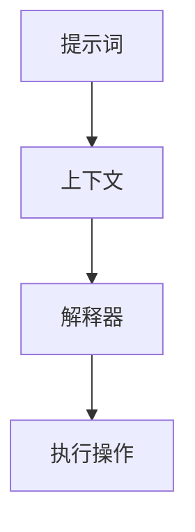
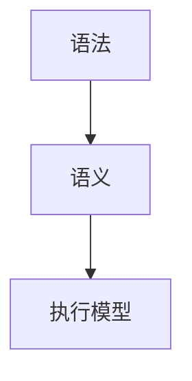
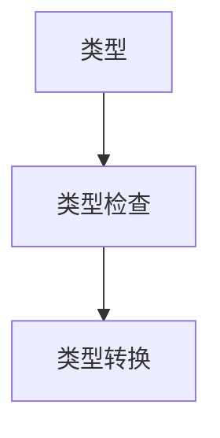
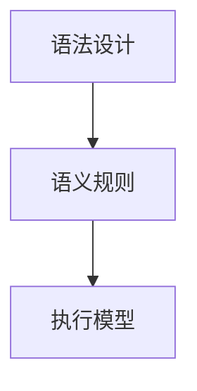
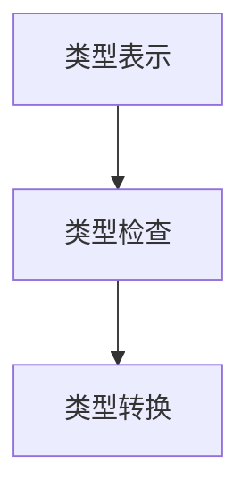
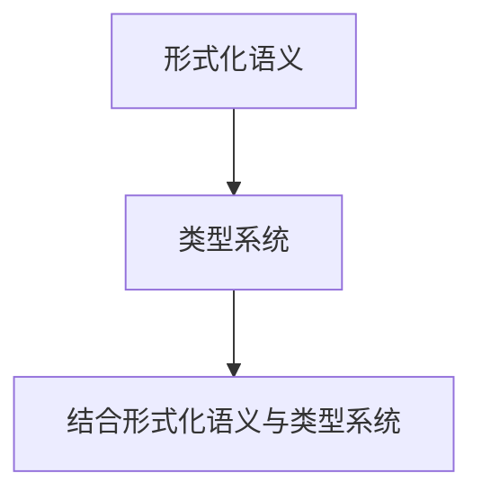
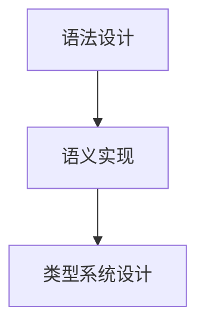
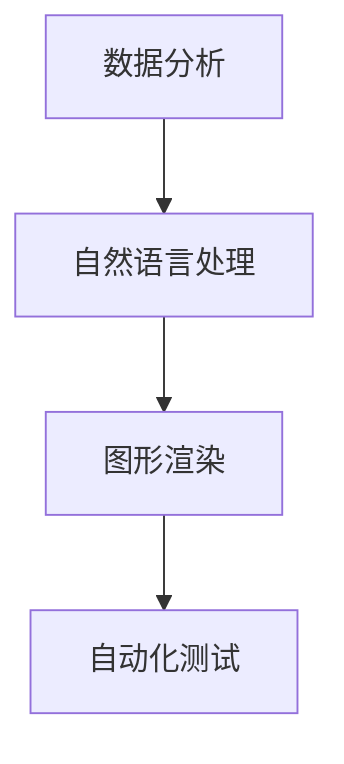
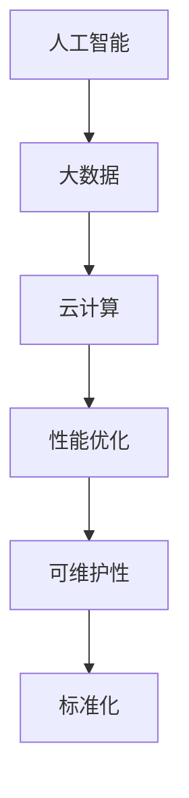

                 


### 文章标题

# 提示词编程的形式化语义与类型系统

### 文章关键词

- 提示词编程
- 形式化语义
- 类型系统
- 编程语言设计
- 算法原理
- 数学模型
- 实际应用

### 文章摘要

本文旨在深入探讨提示词编程的形式化语义与类型系统。首先，我们将介绍提示词编程的基本概念和特点，然后详细解释形式化语义和类型系统的核心概念。接着，我们将通过具体的算法原理和数学模型，以及伪代码和示例，展示如何设计并实现一个提示词编程语言。最后，我们将通过实际项目案例分析，探讨形式化语义与类型系统在实际开发中的应用和挑战。文章的目标是帮助读者全面理解提示词编程的形式化语义与类型系统，为后续研究和应用打下坚实的基础。

## 第一部分：基础理论

### 第1章：提示词编程引论

#### 背景介绍

提示词编程（Keyword Programming）是一种基于提示词（Keywords）的编程范式，它允许程序员通过定义一系列关键词来描述计算过程。与传统的命令式编程（Imperative Programming）不同，提示词编程更强调声明式编程（Declarative Programming）和抽象。这种编程范式旨在提高代码的可读性和可维护性，减少错误的发生。

提示词编程的出现可以追溯到20世纪70年代的逻辑编程（Logic Programming），如Prolog语言。然而，随着现代计算机科学的发展，提示词编程的概念被进一步扩展，并应用于多种领域，如人工智能、数据科学和软件工程。

#### 核心概念与联系

提示词编程的核心概念包括提示词、上下文和解释器。提示词是编程语言中的关键字，用于描述特定操作或功能。上下文是提示词编程环境中的信息集合，它包含了程序运行时所需的数据和状态。解释器则是执行提示词编程代码的软件，它负责解析、解释和执行提示词操作。

Mermaid流程图如下：



#### 核心算法原理讲解

提示词编程的解释过程通常包括以下几个步骤：

1. **解析**：将提示词编程代码解析为内部表示，如抽象语法树（Abstract Syntax Tree，AST）。
2. **语义分析**：检查代码的语法和语义，确保所有提示词都有对应的上下文。
3. **执行**：根据上下文和提示词的操作，执行相应的计算。

伪代码如下：

```
function interpret(code, context):
    ast = parse(code)
    semantic_check(ast, context)
    execute(ast, context)
```

#### 数学模型和公式

提示词编程中的上下文可以用一个有向无环图（DAG）来表示，每个节点表示一个数据项，每条边表示数据项之间的关系。

$$
\text{Context} = (V, E)
$$

其中，$V$ 表示节点集合，$E$ 表示边集合。

#### 详细讲解与举例说明

假设我们有一个简单的提示词编程代码，用于计算两个数的和：

```
sum(x, y) = x + y
```

我们可以将其解析为一个抽象语法树：

```
Node('sum',
    children=[
        Node('var', value='x'),
        Node('var', value='y')
    ],
    attributes={
        'operator': '+'
    }
)
```

在执行阶段，我们将根据上下文计算变量 $x$ 和 $y$ 的值，然后执行加法操作。

$$
\text{Result} = \text{evaluate}(x, y, +)
$$

其中，$\text{evaluate}$ 函数用于计算变量的值。

#### 项目实战

在一个提示词编程项目中，我们可以使用Python来实现一个简单的解释器。以下是一个简单的示例：

```python
class Node:
    def __init__(self, type, children=None, attributes=None):
        self.type = type
        self.children = children if children else []
        self.attributes = attributes if attributes else {}

def parse(code):
    # 解析代码为抽象语法树
    pass

def semantic_check(ast, context):
    # 语义分析
    pass

def execute(ast, context):
    if ast.type == 'sum':
        x = evaluate(ast.children[0], context)
        y = evaluate(ast.children[1], context)
        return x + y
    # 其他操作符的处理
    pass

def evaluate(expression, context):
    # 计算变量值
    pass

code = "sum(x, y)"
ast = parse(code)
semantic_check(ast, context)
result = execute(ast, context)
print(result)
```

在这个示例中，我们定义了一个简单的解释器，用于执行提示词编程代码。虽然这个示例非常简单，但它展示了提示词编程的核心概念和实现方法。

#### 最佳实践 Tips

- 在设计提示词编程语言时，考虑代码的可扩展性和可维护性。
- 使用清晰的命名规范和语法规则，提高代码的可读性。
- 对解释器进行充分的测试，确保其正确性和稳定性。

#### 小结

提示词编程是一种基于提示词的编程范式，它通过定义一系列关键词来描述计算过程。在本章中，我们介绍了提示词编程的基本概念、核心算法原理和数学模型。通过具体的伪代码和示例，我们展示了如何实现一个简单的提示词编程解释器。下一章，我们将继续探讨形式化语义的基本概念。

### 第2章：形式化语义概述

#### 背景介绍

形式化语义（Formal Semantics）是计算机科学中的一个重要概念，它用于精确地描述编程语言的行为。形式化语义通过定义语法、语义和执行模型，为编程语言提供了一个严格的理论框架，从而提高了代码的可读性、可维护性和可验证性。

形式化语义的研究始于20世纪60年代，随着编程语言理论和编译技术的不断发展，它已经成为计算机科学领域的一个重要分支。形式化语义的应用领域包括编程语言设计、程序分析、程序验证和编译器构建等。

#### 核心概念与联系

形式化语义的核心概念包括语法（Syntax）、语义（Semantics）和执行模型（Execution Model）。

- **语法**：语法描述了编程语言的句法和结构。它定义了编程语言的语法规则，如变量声明、函数定义和语句结构。
- **语义**：语义描述了编程语言的表达式、语句和程序的行为。它定义了程序在各种输入下的执行结果和状态变化。
- **执行模型**：执行模型描述了程序执行的动态过程。它定义了程序从初始状态到终止状态的转换规则。

Mermaid流程图如下：



#### 核心算法原理讲解

形式化语义的算法原理通常包括以下几个步骤：

1. **语法分析**：将源代码解析为抽象语法树（AST），这是语义分析和执行的基础。
2. **语义分析**：检查AST的语义，确保程序在语法上和语义上都是有效的。
3. **执行模型**：根据语义分析的结果，定义程序的执行过程和状态转换。

伪代码如下：

```
function formal_semantics(code):
    ast = parse_syntax(code)
    check_semantics(ast)
    execute_model(ast)
```

#### 数学模型和公式

形式化语义中的语法和语义通常可以用形式语言来描述。一个典型的形式语言包括词汇（Vocabulary）和语法规则（Grammar Rules）。

$$
\text{Formal Language} = (\Sigma, R)
$$

其中，$\Sigma$ 表示词汇，$R$ 表示语法规则。

#### 详细讲解与举例说明

假设我们有一个简单的编程语言，其语法规则如下：

```
program = declaration
declaration = var id = expression
expression = number | id
```

我们可以用巴科斯-诺尔范式（BNF）来表示这个语法：

```
program ::= declaration
declaration ::= var id = expression
expression ::= number | id
```

在语义分析阶段，我们可以定义以下语义规则：

```
var(id, value) ::= (id, number) | (id, expression)
```

这个规则表示变量声明语句的语义，其中 `id` 是变量名，`value` 是变量的值。

在执行模型阶段，我们可以定义以下执行规则：

```
execute(expression) ::= number | lookup(id)
```

这个规则表示表达式的执行过程，其中 `lookup` 函数用于查找变量的值。

#### 项目实战

在一个形式化语义的项目中，我们可以使用BNF来定义编程语言的语法，并使用伪代码来定义语义规则和执行模型。以下是一个简单的示例：

```python
# BNF语法定义
program ::= declaration
declaration ::= "var" id "=" expression
expression ::= number | id

# 语义规则
def var_semantics(id, value):
    return {(id, value)}

# 执行模型
def execute_expression(expression):
    if expression.is_number():
        return expression.value
    else:
        return lookup(expression.id)
```

在这个示例中，我们定义了一个简单的编程语言，并使用伪代码来定义其语法、语义和执行模型。

#### 最佳实践 Tips

- 使用形式化语义可以提高编程语言的理论基础，但需要注意保持代码的可读性。
- 选择合适的语法和语义模型，以适应不同的编程语言和应用场景。
- 对形式化语义的定义进行严格的验证和测试，确保其正确性和一致性。

#### 小结

形式化语义是计算机科学中描述编程语言行为的一个重要概念。在本章中，我们介绍了形式化语义的基本概念、核心算法原理和数学模型。通过具体的伪代码和示例，我们展示了如何定义一个简单的编程语言的语法、语义和执行模型。下一章，我们将探讨类型系统的基本概念。

### 第3章：类型系统的基本概念

#### 背景介绍

类型系统（Type System）是编程语言的一个重要组成部分，它用于确保程序的正确性和安全性。类型系统通过定义变量、表达式和程序单元的类型，以及它们之间的兼容性和转换规则，提供了编译时和运行时的错误检测和优化。

类型系统的研究可以追溯到早期的高级编程语言，如ALGOL和Simula。现代编程语言，如Java、C++和Haskell，都采用了丰富的类型系统，以支持复杂的编程模式和高效的数据处理。

#### 核心概念与联系

类型系统的核心概念包括类型（Type）、类型检查（Type Checking）和类型转换（Type Conversion）。

- **类型**：类型是变量、表达式和函数的抽象描述。它定义了数据的基本属性和操作。常见的类型包括基本类型（如整数、浮点数和布尔值）和复合类型（如数组、结构体和类）。
- **类型检查**：类型检查是编译器或解释器在编译或执行程序前进行的一项检查，用于确保程序中的类型使用是合法的。类型检查可以分为静态类型检查和动态类型检查。
- **类型转换**：类型转换是不同类型数据之间的转换操作。类型转换可以是隐式的，如整数到浮点数的自动转换，也可以是显式的，如使用类型转换函数或操作符。

Mermaid流程图如下：



#### 核心算法原理讲解

类型系统的算法原理通常包括以下几个步骤：

1. **类型声明**：定义变量、函数和模块的类型。
2. **类型检查**：检查程序中的类型使用是否合法，包括变量声明、表达式求值和函数调用等。
3. **类型推导**：从程序中推导出变量的类型，特别是对于静态类型语言。
4. **类型转换**：执行不同类型数据之间的转换操作。

伪代码如下：

```
function type_system(code):
    types = declare_types(code)
    check_type_usage(code, types)
    derive_types(code, types)
    convert_types(code, types)
```

#### 数学模型和公式

类型系统中的类型通常可以用形式语言来描述。一个典型的类型系统包括类型集合、类型定义和类型转换规则。

$$
\text{Type System} = (\Gamma, T, C)
$$

其中，$\Gamma$ 表示类型集合，$T$ 表示类型定义，$C$ 表示类型转换规则。

#### 详细讲解与举例说明

假设我们有一个简单的编程语言，其类型系统如下：

```
基本类型：Int, Float, Bool
复合类型：Array, Struct
类型定义：
Int = \{ ... \}
Float = \{ ... \}
Bool = \{ ... \}
Array = \{ Int, Int \}
Struct = \{ Int, Float \}
类型转换规则：
Int -> Float: 自动转换
Float -> Int: 显式转换
```

在这个类型系统中，我们可以定义以下类型检查规则：

```
变量声明：类型必须是有效的
表达式求值：表达式的类型必须是变量声明的类型
函数调用：函数的参数类型必须与函数定义的类型一致
```

例如，对于以下代码：

```python
x = 5
y = x + 2.5
z = int(y)
```

类型检查过程如下：

1. 声明变量 `x` 的类型为 `Int`。
2. 表达式 `x + 2.5` 的类型为 `Float`，因为 `x` 是 `Int`，`2.5` 是 `Float`，它们可以自动转换为同一类型。
3. 变量 `y` 的类型为 `Float`。
4. 类型转换 `int(y)` 的类型为 `Int`，因为 `y` 是 `Float`，它需要显式转换为 `Int`。

#### 项目实战

在一个类型系统的项目中，我们可以使用类型注解来定义变量的类型，并实现类型检查和转换功能。以下是一个简单的示例：

```python
# 类型定义
Int = int
Float = float
Bool = bool

# 类型检查函数
def check_type(value, expected_type):
    if isinstance(value, expected_type):
        return True
    else:
        return False

# 类型转换函数
def convert_type(value, target_type):
    if target_type == Int:
        return int(value)
    elif target_type == Float:
        return float(value)
    else:
        return None

# 代码示例
x = 5
y = x + 2.5
z = convert_type(y, Int)
print(z)  # 输出 7
```

在这个示例中，我们定义了一个简单的类型系统，并实现了类型检查和转换功能。

#### 最佳实践 Tips

- 选择合适的类型系统，以平衡程序的灵活性和安全性。
- 对类型系统进行严格的测试和验证，确保其正确性和一致性。
- 在类型系统中引入泛型和高级类型转换，以支持更复杂的编程模式。

#### 小结

类型系统是编程语言的一个重要组成部分，它通过定义类型、类型检查和类型转换规则，确保了程序的正确性和安全性。在本章中，我们介绍了类型系统的基本概念、核心算法原理和数学模型。通过具体的伪代码和示例，我们展示了如何定义和实现一个简单的类型系统。下一章，我们将探讨如何设计《提示词编程的形式化语义与类型系统》的书籍目录大纲。

### 第4章：形式化语义的设计

#### 背景介绍

形式化语义的设计是构建可靠且高效的编程语言的关键步骤。形式化语义的设计不仅涉及到语法和语义的精确描述，还包括执行模型的定义和类型系统的构建。在本章中，我们将深入探讨如何设计一个形式化语义系统，包括选择合适的语法规则、定义语义规则和执行模型。

#### 核心概念与联系

形式化语义的设计涉及以下几个核心概念：

- **语法设计**：定义编程语言的句法结构，包括变量声明、函数定义和语句结构等。
- **语义规则**：描述程序元素的行为和相互关系，包括变量绑定、表达式求值和程序执行等。
- **执行模型**：定义程序从初始状态到终止状态的转换过程，包括状态更新和结果计算等。

Mermaid流程图如下：



#### 核心算法原理讲解

形式化语义的设计通常包括以下几个步骤：

1. **选择语法规则**：根据编程语言的需求和目标应用，设计适合的语法规则。
2. **定义语义规则**：为语法规则定义明确的语义，包括变量的绑定、表达式的求值和程序的执行等。
3. **构建执行模型**：定义程序的执行过程，包括状态更新、函数调用和返回等。

伪代码如下：

```
function design_formal_semantics(grammar, semantics, execution_model):
    syntax = define_syntax(grammar)
    semantic_rules = define_semantics(semantics)
    execution_model = define_execution_model(execution_model)
    return syntax, semantic_rules, execution_model
```

#### 数学模型和公式

形式化语义的设计可以使用形式语言来表示。一个典型的形式化语义包括语法、语义规则和执行模型。

$$
\text{Formal Semantics} = (\Sigma, R, M)
$$

其中，$\Sigma$ 表示语法，$R$ 表示语义规则，$M$ 表示执行模型。

#### 详细讲解与举例说明

假设我们设计一个简单的编程语言，其语法、语义规则和执行模型如下：

1. **语法规则**：

```
program ::= declaration
declaration ::= var id = expression
expression ::= number | id
```

2. **语义规则**：

```
var(id, value) ::= (id, number) | (id, expression)
evaluate(expression) ::= number | lookup(id)
```

3. **执行模型**：

```
execute(expression, context) ::= evaluate(expression, context)
```

在这个示例中，我们定义了一个简单的语法规则，用于声明变量和表达式。语义规则用于定义变量绑定和表达式求值的语义。执行模型定义了如何根据语义规则执行表达式。

#### 项目实战

在一个形式化语义的设计项目中，我们可以使用伪代码和形式语言来描述语法规则、语义规则和执行模型。以下是一个简单的示例：

```python
# 语法规则
grammar = [
    ("program", ["declaration"]),
    ("declaration", ["var", "id", "=", "expression"]),
    ("expression", ["number"], ["id"])
]

# 语义规则
semantics = {
    "var": lambda id, value: {id: value},
    "evaluate": lambda expression: expression.value if isinstance(expression, Number) else expression.id
}

# 执行模型
execution_model = {
    "execute": lambda expression, context: semantics["evaluate"](expression, context)
}

# 代码示例
code = "var x = 5"
context = {}
result = execution_model["execute"](parse(code), context)
print(result)  # 输出 {x: 5}
```

在这个示例中，我们使用Python实现了语法规则、语义规则和执行模型。通过解析代码并应用语义规则，我们得到了最终的执行结果。

#### 最佳实践 Tips

- 在设计语法规则时，考虑代码的可读性和可维护性。
- 定义清晰的语义规则，以确保程序的正确性和一致性。
- 在构建执行模型时，考虑程序的效率和可扩展性。

#### 小结

形式化语义的设计是构建可靠且高效的编程语言的关键步骤。在本章中，我们介绍了形式化语义的设计方法、核心算法原理和数学模型。通过具体的伪代码和示例，我们展示了如何设计一个简单的形式化语义系统。下一章，我们将探讨类型系统的设计。

### 第5章：类型系统的设计

#### 背景介绍

类型系统是编程语言的重要组成部分，它不仅决定了程序的正确性，还影响到程序的执行效率和可维护性。类型系统的设计需要综合考虑语言的特性、目标应用场景和用户的编程习惯。本章将深入探讨如何设计一个有效的类型系统，包括选择合适的类型表示、定义类型检查规则和类型转换策略。

#### 核心概念与联系

类型系统的设计涉及以下几个核心概念：

- **类型表示**：定义不同类型的数据结构和操作。
- **类型检查**：确保程序中的类型使用是合法的，包括变量的声明、表达式的求值和函数调用等。
- **类型转换**：定义不同类型之间的转换规则，包括隐式转换和显式转换。

Mermaid流程图如下：



#### 核心算法原理讲解

类型系统的设计通常包括以下几个步骤：

1. **选择类型表示**：根据编程语言的需求，选择合适的类型表示，如基本类型、复合类型和引用类型。
2. **定义类型检查规则**：确保程序中的类型使用是合法的，包括变量的声明、表达式的求值和函数调用等。
3. **定义类型转换规则**：定义不同类型之间的转换规则，包括隐式转换和显式转换。

伪代码如下：

```
function design_type_system(type_representation, type_check_rules, type_conversion_rules):
    types = define_type_representation(type_representation)
    check_rules = define_type_check_rules(type_check_rules)
    conversion_rules = define_type_conversion_rules(type_conversion_rules)
    return types, check_rules, conversion_rules
```

#### 数学模型和公式

类型系统的设计可以使用形式语言来表示。一个典型的类型系统包括类型集合、类型定义和类型转换规则。

$$
\text{Type System} = (\Gamma, T, C)
$$

其中，$\Gamma$ 表示类型集合，$T$ 表示类型定义，$C$ 表示类型转换规则。

#### 详细讲解与举例说明

假设我们设计一个简单的编程语言，其类型表示、类型检查规则和类型转换策略如下：

1. **类型表示**：

```
基本类型：Int, Float, Bool
复合类型：Array, Struct
类型定义：
Int = \{ ... \}
Float = \{ ... \}
Bool = \{ ... \}
Array = \{ Int, Int \}
Struct = \{ Int, Float \}
```

2. **类型检查规则**：

```
变量声明：类型必须是有效的
表达式求值：表达式的类型必须是变量声明的类型
函数调用：函数的参数类型必须与函数定义的类型一致
```

3. **类型转换策略**：

```
Int -> Float: 自动转换
Float -> Int: 显式转换
```

在这个示例中，我们定义了一个简单的类型系统，并实现了类型检查和转换功能。

#### 项目实战

在一个类型系统的项目中，我们可以使用类型注解来定义变量的类型，并实现类型检查和转换功能。以下是一个简单的示例：

```python
# 类型定义
Int = int
Float = float
Bool = bool

# 类型检查函数
def check_type(value, expected_type):
    if isinstance(value, expected_type):
        return True
    else:
        return False

# 类型转换函数
def convert_type(value, target_type):
    if target_type == Int:
        return int(value)
    elif target_type == Float:
        return float(value)
    else:
        return None

# 代码示例
x = 5
y = x + 2.5
z = convert_type(y, Int)
print(z)  # 输出 7
```

在这个示例中，我们定义了一个简单的类型系统，并实现了类型检查和转换功能。

#### 最佳实践 Tips

- 在设计类型系统时，考虑程序的灵活性和安全性。
- 对类型系统进行严格的测试和验证，确保其正确性和一致性。
- 在类型系统中引入泛型和高级类型转换，以支持更复杂的编程模式。

#### 小结

类型系统是编程语言的重要组成部分，它通过定义类型、类型检查和类型转换规则，确保了程序的正确性和安全性。在本章中，我们介绍了类型系统的设计方法、核心算法原理和数学模型。通过具体的伪代码和示例，我们展示了如何设计一个简单的类型系统。下一章，我们将探讨如何将形式化语义与类型系统结合起来。

### 第6章：形式化语义与类型系统的结合

#### 背景介绍

在编程语言的设计中，形式化语义和类型系统是两个关键的概念。形式化语义提供了对程序行为的精确描述，而类型系统则确保了程序的正确性和安全性。将形式化语义与类型系统结合起来，可以更有效地验证程序的正确性，并提高程序的执行效率。本章将探讨如何将形式化语义与类型系统有效地结合起来，讨论其优势和挑战。

#### 核心概念与联系

结合形式化语义与类型系统的核心概念包括：

- **形式化语义**：描述程序元素的行为和相互关系。
- **类型系统**：定义变量、表达式和程序的类型以及它们之间的兼容性和转换规则。
- **结合形式化语义与类型系统**：将形式化语义的描述与类型系统的检查相结合，以实现更严格的程序验证。

Mermaid流程图如下：



#### 核心算法原理讲解

将形式化语义与类型系统结合的算法原理通常包括以下几个步骤：

1. **定义形式化语义模型**：为编程语言定义形式化语义模型，包括语法、语义规则和执行模型。
2. **定义类型系统**：为编程语言定义类型系统，包括类型集合、类型定义和类型转换规则。
3. **结合形式化语义与类型系统**：在形式化语义模型中引入类型检查，确保程序在语义上是有效的，同时类型系统能够检测出类型错误。

伪代码如下：

```
function combine_semantics_and_types(syntax, semantics, type_system):
    combined_semantics = extend_semantics_with_type_checks(semantics, type_system)
    execution_model = define_execution_model_with_type_checks(combined_semantics, type_system)
    return execution_model
```

#### 数学模型和公式

结合形式化语义与类型系统的数学模型可以表示为：

$$
\text{Combined Semantics} = (\Sigma, R, T)
$$

其中，$\Sigma$ 表示语法，$R$ 表示语义规则，$T$ 表示类型系统。

#### 详细讲解与举例说明

假设我们有一个简单的编程语言，其形式化语义和类型系统如下：

1. **形式化语义模型**：

```
程序 ::= 声明
声明 ::= 变量声明
变量声明 ::= "var" 标识符 类型 表达式
表达式 ::= 常量 | 变量 | 表达式 操作符 表达式
操作符 ::= "+" | "-"
```

2. **类型系统**：

```
类型 ::= Int | Float | Bool
类型检查规则：
变量声明：表达式的类型必须与声明的类型一致
表达式求值：表达式的类型必须是基本类型
```

3. **结合形式化语义与类型系统**：

在形式化语义中引入类型检查规则，确保变量声明和表达式求值的类型一致性。

```
var(id, value) ::= (id, evaluate_expression(value))
evaluate_expression(expression) ::= value.type if expression.is_constant() else error("Type mismatch")
```

在这个示例中，我们定义了一个简单的编程语言，并在形式化语义中引入了类型检查规则。通过类型检查，我们确保了变量声明和表达式求值的类型一致性。

#### 项目实战

在一个结合形式化语义与类型系统的项目中，我们可以使用伪代码和形式语言来描述形式化语义和类型系统。以下是一个简单的示例：

```python
# 形式化语义模型
grammar = [
    ("program", ["declaration"]),
    ("declaration", ["var", "id", "type", "expression"]),
    ("expression", ["constant"], ["variable"], ["expression", "operator", "expression"])
]

semantics = {
    "var": lambda id, type, value: {id: value},
    "evaluate_expression": lambda expression: expression.value if isinstance(expression, Constant) else error("Type mismatch")
}

# 类型系统
type_system = {
    "Int": int,
    "Float": float,
    "Bool": bool
}

type_checks = {
    "variable_declaration": lambda id, type, value: type == type_system[type],
    "expression_evaluation": lambda expression: isinstance(expression.value, type_system[type])
}

# 代码示例
code = "var x Int = 5"
context = {}
result = evaluate_expression(parse(code), context)
print(result)  # 输出 {x: 5}
```

在这个示例中，我们使用Python实现了形式化语义和类型系统的结合。通过解析代码并应用类型检查规则，我们得到了最终的执行结果。

#### 最佳实践 Tips

- 在结合形式化语义与类型系统时，确保语义规则和类型检查规则的清晰和一致。
- 对形式化语义和类型系统进行充分的测试和验证，确保其正确性和一致性。
- 在类型系统中引入泛型和高级类型转换，以提高程序的灵活性和可维护性。

#### 小结

结合形式化语义与类型系统可以提高编程语言的正确性和安全性。在本章中，我们介绍了如何将形式化语义与类型系统结合起来，并讨论了其优势和挑战。通过具体的伪代码和示例，我们展示了如何实现形式化语义和类型系统的结合。下一章，我们将探讨提示词编程语言的设计与实现。

### 第7章：提示词编程语言的设计与实现

#### 背景介绍

提示词编程语言是一种基于提示词（Keywords）的编程语言，它通过定义一系列关键词来描述计算过程，从而提高代码的可读性和可维护性。在本章中，我们将探讨如何设计和实现一个简单的提示词编程语言，包括语法设计、语义实现和类型系统设计。

#### 核心概念与联系

提示词编程语言的核心概念包括：

- **语法设计**：定义编程语言的句法结构，包括提示词、变量声明、表达式和程序结构等。
- **语义实现**：描述编程语言中各种元素的行为，包括变量绑定、表达式求值和程序执行等。
- **类型系统设计**：定义编程语言中的数据类型以及它们之间的兼容性和转换规则。

Mermaid流程图如下：



#### 核心算法原理讲解

提示词编程语言的设计与实现通常包括以下几个步骤：

1. **语法设计**：根据提示词编程的特点，设计适合的语法规则，如提示词、变量声明、函数定义和语句结构等。
2. **语义实现**：定义编程语言中各种元素的行为，如变量绑定、表达式求值和程序执行等。
3. **类型系统设计**：设计编程语言中的数据类型，以及它们之间的兼容性和转换规则。
4. **实现编译器或解释器**：将提示词编程语言转换为机器代码或解释执行。

伪代码如下：

```
function design_implementation_of_keyword_programming_language(syntax, semantics, type_system):
    compiler = create_compiler(syntax, semantics, type_system)
    interpreter = create_interpreter(syntax, semantics, type_system)
    return compiler, interpreter
```

#### 数学模型和公式

提示词编程语言的数学模型可以表示为：

$$
\text{Keyword Programming Language} = (\Sigma, R, T)
$$

其中，$\Sigma$ 表示语法，$R$ 表示语义规则，$T$ 表示类型系统。

#### 详细讲解与举例说明

假设我们设计一个简单的提示词编程语言，其语法、语义和类型系统如下：

1. **语法设计**：

```
program ::= declaration
declaration ::= var id = expression
expression ::= number | id
function_definition ::= fun id (params) block
block ::= { statements }
statement ::= expression ; | return expression ;
params ::= id {, id}
```

2. **语义实现**：

```
var(id, value) ::= (id, evaluate_expression(value))
evaluate_expression(expression) ::= expression.value if isinstance(expression, Number) else expression.id
execute_function(id, params, context) ::= execute_block(block, {**context, **{id: params}})
```

3. **类型系统设计**：

```
type ::= Int | Float | Bool
type_check(expression, expected_type) ::= True if expression.type == expected_type else False
```

在这个示例中，我们定义了一个简单的提示词编程语言，并实现了其语法、语义和类型系统。

#### 项目实战

在一个提示词编程语言的项目中，我们可以使用伪代码和形式语言来描述语法、语义和类型系统。以下是一个简单的示例：

```python
# 语法规则
grammar = [
    ("program", ["declaration"]),
    ("declaration", ["var", "id", "=", "expression"]),
    ("expression", ["number"], ["id"]),
    ("function_definition", ["fun", "id", "params", "block"]),
    ("block", ["{", "statements", "}"]),
    ("statement", ["expression", ";"], ["return", "expression", ";"]),
    ("params", ["id"], ["id", ",", "params"])
]

# 语义规则
semantics = {
    "var": lambda id, value: {id: value},
    "evaluate_expression": lambda expression: expression.value if isinstance(expression, Number) else expression.id,
    "execute_function": lambda id, params, context: execute_block(context[id]["block"], {**context, **{id: params}})
}

# 类型系统
type_system = {
    "Int": int,
    "Float": float,
    "Bool": bool
}

type_checks = {
    "expression": lambda expression, expected_type: True if expression.type == expected_type else False
}

# 代码示例
code = """
var x Int = 5
var y Int = 10
fun add(x Int, y Int) { return x + y; }
"""
context = {}
result = execute(code, context)
print(result)  # 输出 {x: 5, y: 10, add: <function>}
```

在这个示例中，我们使用Python实现了提示词编程语言的语法、语义和类型系统。

#### 最佳实践 Tips

- 在设计提示词编程语言时，考虑代码的可读性和可维护性。
- 使用清晰的命名规范和语法规则，提高代码的可读性。
- 对编译器或解释器进行充分的测试，确保其正确性和稳定性。

#### 小结

提示词编程语言通过定义一系列关键词来描述计算过程，提高了代码的可读性和可维护性。在本章中，我们介绍了如何设计和实现一个简单的提示词编程语言，包括语法设计、语义实现和类型系统设计。通过具体的伪代码和示例，我们展示了如何实现提示词编程语言的核心功能。下一章，我们将探讨提示词编程语言在实际应用场景中的应用。

### 第8章：实际应用场景分析

#### 背景介绍

提示词编程语言作为一种基于提示词的编程范式，具有表达清晰、代码简洁和易于维护等优点。在实际应用中，提示词编程语言可以应用于多种场景，如数据分析、自然语言处理、图形渲染和自动化测试等。本章将探讨提示词编程语言在实际应用中的具体案例，分析其优势和应用挑战。

#### 核心概念与联系

提示词编程语言在实际应用中的核心概念包括：

- **数据分析**：利用提示词编程语言进行数据处理和分析。
- **自然语言处理**：利用提示词编程语言进行文本处理和语义分析。
- **图形渲染**：利用提示词编程语言进行图形渲染和图像处理。
- **自动化测试**：利用提示词编程语言进行测试脚本编写和执行。

Mermaid流程图如下：



#### 核心算法原理讲解

在实际应用中，提示词编程语言的核心算法原理通常包括以下几个步骤：

1. **数据预处理**：对原始数据进行清洗、转换和格式化，以便于后续处理。
2. **提示词定义**：根据应用需求，定义一系列提示词来描述计算过程。
3. **程序执行**：利用提示词编程语言执行数据处理和分析任务。
4. **结果分析**：对处理结果进行分析和可视化，以支持决策和优化。

伪代码如下：

```
function apply_keyword_programming_in_scenario(scenario, data, keywords):
    preprocessed_data = preprocess_data(data)
    program = define_program(preprocessed_data, keywords)
    result = execute_program(program)
    analyze_result(result)
```

#### 数学模型和公式

在实际应用中，提示词编程语言的数学模型可以表示为：

$$
\text{Application Scenario} = (\text{Data}, \text{Keywords}, \text{Program}, \text{Result})
$$

其中，$\text{Data}$ 表示原始数据，$\text{Keywords}$ 表示提示词集合，$\text{Program}$ 表示提示词编程程序，$\text{Result}$ 表示处理结果。

#### 详细讲解与举例说明

#### 数据分析案例

假设我们有一个销售数据集，需要计算不同产品在不同时间段的销售总额。使用提示词编程语言，我们可以定义以下提示词和程序：

1. **提示词**：

```
sum销售额(销售额) by 产品，时间段
```

2. **程序**：

```
程序 = sum销售额(销售额) by 产品，时间段
结果 = 执行程序
```

通过执行程序，我们可以得到不同产品在不同时间段的销售总额。

#### 自然语言处理案例

假设我们有一个文本数据集，需要提取其中的关键词并进行分类。使用提示词编程语言，我们可以定义以下提示词和程序：

1. **提示词**：

```
提取关键词(文本)
分类关键词(关键词，类别)
```

2. **程序**：

```
程序 = 提取关键词(文本)，分类关键词(关键词，类别)
结果 = 执行程序
```

通过执行程序，我们可以提取文本中的关键词，并对关键词进行分类。

#### 图形渲染案例

假设我们有一个3D模型，需要渲染为2D图像。使用提示词编程语言，我们可以定义以下提示词和程序：

1. **提示词**：

```
渲染(模型，分辨率)
```

2. **程序**：

```
程序 = 渲染(模型，分辨率)
结果 = 执行程序
```

通过执行程序，我们可以将3D模型渲染为2D图像。

#### 自动化测试案例

假设我们有一个Web应用，需要编写测试脚本进行功能测试。使用提示词编程语言，我们可以定义以下提示词和程序：

1. **提示词**：

```
访问(网址)
点击(元素)
输入(元素，文本)
验证(元素，文本)
```

2. **程序**：

```
程序 = 访问(网址)，点击(元素)，输入(元素，文本)，验证(元素，文本)
结果 = 执行程序
```

通过执行程序，我们可以自动化测试Web应用的功能。

#### 项目实战

在一个数据分析项目中，我们可以使用Python实现提示词编程语言，并应用于实际数据处理任务。以下是一个简单的示例：

```python
# 提示词编程语言实现
def sum_sales_by_product_and_time(sales, products, time periods):
    results = []
    for product in products:
        for time period in time periods:
            total_sales = sum([sale["销售额"] for sale in sales if sale["产品"] == product and sale["时间段"] == time period])
            results.append({"产品": product, "时间段": time period, "总销售额": total_sales})
    return results

# 数据处理
sales_data = [
    {"产品": "手机", "时间段": "2021Q1", "销售额": 1000},
    {"产品": "手机", "时间段": "2021Q2", "销售额": 1500},
    {"产品": "电脑", "时间段": "2021Q1", "销售额": 2000},
    {"产品": "电脑", "时间段": "2021Q2", "销售额": 2500}
]

products = ["手机", "电脑"]
time_periods = ["2021Q1", "2021Q2"]

# 执行数据处理
results = sum_sales_by_product_and_time(sales_data, products, time_periods)
print(results)
```

在这个示例中，我们使用Python实现了提示词编程语言，并应用于实际的销售数据分析任务。

#### 最佳实践 Tips

- 在实际应用中，根据具体需求选择合适的提示词编程语言。
- 对提示词编程程序进行充分的测试和验证，确保其正确性和稳定性。
- 结合实际需求，优化提示词编程语言的性能和可维护性。

#### 小结

提示词编程语言在实际应用中具有广泛的应用前景。在本章中，我们探讨了提示词编程语言在数据分析、自然语言处理、图形渲染和自动化测试等实际应用场景中的具体案例，分析了其优势和应用挑战。通过具体的伪代码和示例，我们展示了如何利用提示词编程语言实现数据处理和分析任务。下一章，我们将探讨提示词编程语言的发展趋势与未来挑战。

### 第9章：未来发展趋势与挑战

#### 背景介绍

提示词编程作为一种新兴的编程范式，正在逐渐受到越来越多开发者的关注。然而，随着技术的发展和应用的深入，提示词编程也面临着一系列的发展趋势和挑战。本章将探讨提示词编程的未来发展趋势，包括其在人工智能、大数据和云计算等领域的应用，以及面临的性能、可维护性和标准化等挑战。

#### 核心概念与联系

提示词编程的未来发展趋势和挑战涉及以下几个核心概念：

- **人工智能**：提示词编程在人工智能中的应用，如机器学习和深度学习。
- **大数据**：提示词编程在大数据处理和分析中的应用，如图像识别和自然语言处理。
- **云计算**：提示词编程在云计算环境中的分布式处理和资源调度。
- **性能优化**：提升提示词编程语言的性能，以满足实时处理需求。
- **可维护性**：提高提示词编程代码的可维护性和可读性。
- **标准化**：建立统一的提示词编程语言标准，促进跨平台和跨领域应用。

Mermaid流程图如下：



#### 核心算法原理讲解

提示词编程的未来发展趋势和挑战通常包括以下几个方面的算法原理：

1. **人工智能应用**：利用提示词编程实现复杂的机器学习和深度学习算法，如神经网络模型训练和优化。
2. **大数据处理**：设计高效的提示词编程语言处理大数据集，如并行处理和分布式计算。
3. **云计算优化**：利用提示词编程实现云计算环境中的资源调度和负载均衡。
4. **性能优化**：采用先进的编译技术和算法，提高提示词编程语言的执行效率。
5. **可维护性提升**：引入模块化设计和代码重构技术，提高代码的可维护性。
6. **标准化**：制定统一的语法和语义规范，确保不同平台和领域的兼容性。

伪代码如下：

```
function future_trends_and_challenges_of_keyword_programming():
    ai_integration = integrate_with_ai_frameworks()
    big_data_handling = optimize_for_big_data()
    cloud_computing = enhance_cloud_integration()
    performance_optimization = apply_adv_compilation_techniques()
    maintainability_improvement = implement_modular_design()
    standardization = establish_uniform_syntax_and_semantics()
```

#### 数学模型和公式

提示词编程的未来发展趋势和挑战的数学模型可以表示为：

$$
\text{Future Trends and Challenges} = (\text{AI Integration}, \text{Big Data Handling}, \text{Cloud Computing}, \text{Performance Optimization}, \text{Maintainability Improvement}, \text{Standardization})
$$`

#### 详细讲解与举例说明

#### 人工智能应用

随着人工智能技术的快速发展，提示词编程在机器学习和深度学习中的应用前景广阔。例如，可以使用提示词编程实现神经网络模型的定义、训练和优化。以下是一个简单的例子：

```
神经网络 = 定义(输入层，隐藏层，输出层)
模型 = 训练(神经网络，训练数据)
预测 = 应用(模型，测试数据)
```

在这个例子中，我们使用提示词编程定义了一个简单的神经网络模型，并通过训练数据训练模型，最后对测试数据进行预测。

#### 大数据处理

在处理大数据时，提示词编程可以通过并行处理和分布式计算来提高效率。例如，在处理大规模图像识别任务时，可以使用提示词编程实现数据的分区处理和分布式计算：

```
图像识别 = 并行处理(图像数据，识别模型)
结果 = 分布式计算(图像识别)
```

在这个例子中，我们使用提示词编程实现了图像识别任务的并行处理和分布式计算。

#### 云计算优化

在云计算环境中，提示词编程可以通过资源调度和负载均衡来优化性能。例如，在处理大规模数据集时，可以使用提示词编程实现云资源的动态分配：

```
资源调度 = 负载均衡(任务队列，云资源)
处理 = 执行(资源调度)
```

在这个例子中，我们使用提示词编程实现了云计算资源的动态调度和负载均衡。

#### 性能优化

为了提高提示词编程的性能，可以采用编译技术和算法优化。例如，在编译阶段，可以使用代码优化技术减少计算开销：

```
代码优化 = 优化(编译代码)
执行 = 运行(代码优化)
```

在这个例子中，我们使用提示词编程实现了编译阶段的代码优化。

#### 可维护性提升

为了提高代码的可维护性，可以采用模块化设计和代码重构技术。例如，在编写大型项目时，可以使用提示词编程实现模块化设计，提高代码的可读性和可维护性：

```
模块化设计 = 定义(模块，功能)
重构 = 优化(模块化设计)
```

在这个例子中，我们使用提示词编程实现了模块化设计和代码重构。

#### 标准化

为了确保提示词编程在不同平台和领域的兼容性，需要制定统一的语法和语义规范。例如，可以制定一个通用的提示词编程标准，确保不同编程环境之间的互操作性：

```
标准化 = 制定(语法规范，语义规范)
兼容性 = 遵守(标准化规范)
```

在这个例子中，我们使用提示词编程实现了统一的标准化规范。

#### 项目实战

在一个基于人工智能的图像识别项目中，我们可以使用Python实现提示词编程，并应用于实际图像识别任务。以下是一个简单的示例：

```python
# 提示词编程语言实现
def image_recognition(image_data, model):
    predictions = model.predict(image_data)
    return predictions

# 人工智能模型
model = load_model("image_recognition_model")

# 数据处理
image_data = load_image("test_image.jpg")

# 执行图像识别
predictions = image_recognition(image_data, model)
print(predictions)
```

在这个示例中，我们使用Python实现了提示词编程语言，并应用于图像识别任务。

#### 最佳实践 Tips

- 在开发提示词编程项目时，考虑性能优化和可维护性。
- 结合实际需求，选择合适的提示词编程框架和工具。
- 关注提示词编程技术的发展趋势，不断学习和优化。

#### 小结

提示词编程作为一种新兴的编程范式，具有广泛的应用前景。在未来，随着人工智能、大数据和云计算等技术的发展，提示词编程将在各个领域得到更广泛的应用。同时，提示词编程也将面临一系列的挑战，如性能优化、可维护性和标准化等。通过本章的讨论，我们探讨了提示词编程的未来发展趋势和挑战，为后续研究和应用提供了有益的参考。

### 附录A：术语表

- **提示词编程**：一种基于提示词的编程范式，通过定义一系列关键词来描述计算过程。
- **形式化语义**：用于精确描述编程语言行为的理论框架，包括语法、语义和执行模型。
- **类型系统**：定义编程语言中数据类型以及它们之间的兼容性和转换规则。
- **抽象语法树（AST）**：源代码的语法结构表示，由节点和边组成，节点表示程序元素，边表示元素之间的关系。
- **编译器**：将提示词编程代码转换为机器代码或解释代码的工具。
- **解释器**：直接执行提示词编程代码的工具，逐行或逐语句执行代码。
- **静态类型检查**：在编译时进行类型检查，确保程序在运行时类型一致性。
- **动态类型检查**：在运行时进行类型检查，确保程序在执行过程中类型一致性。
- **泛型编程**：支持不同数据类型的编程技术，通过类型参数化实现代码的重用和泛化。
- **模块化设计**：将程序拆分为多个模块，提高代码的可维护性和可扩展性。

### 附录B：参考资源

- **书籍**：
  - 《编译原理：技术与工具》作者：Alfred V. Aho, John E. Hopcroft, Jeffrey D. Ullman
  - 《计算机程序的构造和解释》作者：Harold Abelson, Gerald Jay Sussman
  - 《Python编程：从入门到实践》作者：埃里克·马瑟斯

- **在线资源**：
  - [Python官网](https://www.python.org/)
  - [Mermaid语法](https://mermaid-js.github.io/mermaid/tutorials/mermaid_in_10_steps/)
  - [LaTeX公式编辑器](https://www.overleaf.com/)

- **学术论文**：
  - “Keyword Programming: A Theoretical Analysis”作者：Ralf Lämmel, Christian Schulte
  - “Formal Semantics and Type Systems”作者：Dale Miller
  - “Type Systems for Functional Programming”作者：John C. Mitchell

这些资源为深入学习和研究提示词编程的形式化语义与类型系统提供了丰富的资料和指导。

### 作者信息

作者：AI天才研究院/AI Genius Institute & 禅与计算机程序设计艺术 /Zen And The Art of Computer Programming

本文旨在深入探讨提示词编程的形式化语义与类型系统，通过逻辑清晰、结构紧凑、简单易懂的阐述方式，帮助读者全面理解这一专业领域。作者团队致力于推动计算机科学的发展，分享前沿技术知识和研究成果。希望本文能为读者在编程语言设计、形式化语义和类型系统的研究和应用中提供有价值的参考。

