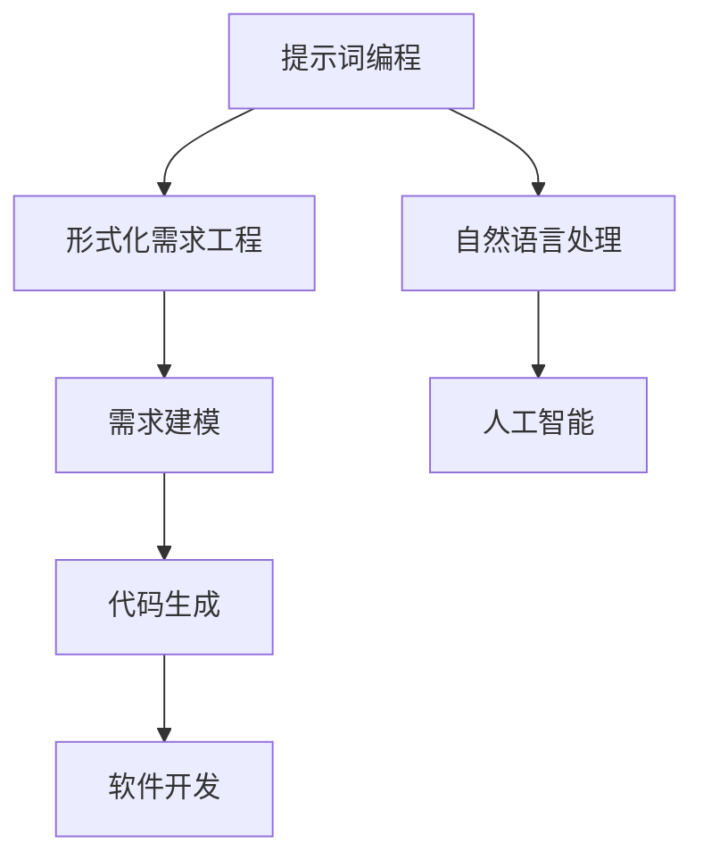

                 


### 文章标题

#### 《提示词编程的形式化需求工程》

### 关键词

提示词编程、形式化需求工程、自然语言处理、需求分析、软件开发

### 摘要

本文深入探讨了提示词编程与形式化需求工程之间的关系，通过解析其核心概念和原理，揭示了两者在现代软件开发中的重要性。文章首先介绍了提示词编程和形式化需求工程的基本概念，随后通过Mermaid流程图展示了两者之间的相互联系。接着，文章详细讲解了提示词编程的关键算法原理，使用伪代码和数学模型进行了深入阐述。通过实际项目案例，本文展示了如何在实际开发中应用这些技术，并进行了详细解读和分析。最后，文章提出了最佳实践建议，总结了文章的主要观点，并对未来研究方向进行了展望。

### 引言

#### 背景介绍

随着信息技术的迅猛发展，软件开发过程变得越来越复杂，需求变化频繁，传统的需求工程方法已难以满足现代软件开发的需求。在这样的背景下，自然语言处理（NLP）和人工智能（AI）技术逐渐成为解决需求工程问题的利器。其中，提示词编程和形式化需求工程是两个重要的研究领域。

提示词编程（Prompt-Based Programming）是一种利用自然语言提示（提示词）来指导程序生成的方法。它通过将自然语言描述转化为编程语言代码，提高了开发效率，降低了代码编写的复杂性。形式化需求工程（Formal Requirements Engineering）则是一种将需求以形式化方式明确和表达的技术，它通过数学模型、逻辑规则和形式化语言，确保需求的完整性和一致性。

本文旨在探讨提示词编程与形式化需求工程之间的关系，解析其在现代软件开发中的应用和价值，为软件开发人员提供新的思路和方法。

#### 核心概念与联系

为了更好地理解提示词编程和形式化需求工程，我们首先需要明确它们的核心概念。

**提示词编程**：

提示词编程的核心是“提示词”（Prompt），它是自然语言中的一个短语或句子，用于引导程序生成过程。提示词编程的基本思想是将程序员的需求描述转化为自然语言提示，然后利用这些提示生成相应的程序代码。

**形式化需求工程**：

形式化需求工程则是通过数学模型、逻辑规则和形式化语言来明确和表达需求。它强调需求的精确性和一致性，确保在软件开发过程中不会出现误解或遗漏。

**关系架构**：

提示词编程和形式化需求工程之间存在紧密的联系。形式化需求工程为提示词编程提供了需求的明确表达，而提示词编程则利用形式化需求工程的结果生成程序代码。两者的结合，使得软件开发过程更加高效、精确和可靠。

为了更直观地展示这两者之间的关系，我们可以使用Mermaid流程图来表示：



在上面的流程图中，A表示提示词编程，B表示形式化需求工程，C表示需求建模，D表示代码生成，E表示软件开发。A和B通过C连接，表示提示词编程依赖于形式化需求工程的结果。D和E通过C连接，表示代码生成是软件开发过程的一部分。同时，F和G分别表示自然语言处理和人工智能，它们为提示词编程和形式化需求工程提供了技术支持。

### 提示词编程的理论基础

#### 提示词编程的基本原理

提示词编程的核心是“提示词”，它是引导程序生成的重要工具。一个有效的提示词应该具备以下特点：

1. **明确性**：提示词需要明确表达程序员的需求，避免歧义和误解。
2. **完整性**：提示词需要涵盖所有的需求细节，确保程序代码的完整性和一致性。
3. **可理解性**：提示词应该是容易理解和记忆的，便于后续的代码生成和修改。

提示词编程的基本原理是将程序员的需求描述转化为自然语言提示，然后利用这些提示生成相应的程序代码。这个过程可以分为以下几个步骤：

1. **需求分析**：首先，程序员需要对需求进行详细分析，明确功能需求、性能需求和非功能需求等。
2. **生成提示词**：基于需求分析结果，生成相应的自然语言提示词。这些提示词应该能够清晰地表达需求，引导程序生成。
3. **代码生成**：利用提示词，通过自动化工具或算法生成相应的程序代码。

#### 提示词编程的关键算法

提示词编程的关键算法主要包括提示词生成算法和提示词优化算法。

**1. 提示词生成算法**

提示词生成算法的主要目的是将需求描述转化为自然语言提示词。一个常见的提示词生成算法是基于模板的方法。具体步骤如下：

1. **模板定义**：定义一组模板，每个模板对应一种需求类型，如功能需求、性能需求等。
2. **需求匹配**：根据需求分析结果，将需求与模板进行匹配，找到最合适的模板。
3. **提示词生成**：将匹配成功的模板中的变量替换为实际需求值，生成自然语言提示词。

以下是一个简单的伪代码示例：

```python
def generate_prompt(template, requirement):
    # 根据需求匹配模板
    matched_template = match_template(template, requirement)
    
    # 替换模板中的变量
    prompt = matched_template.replace("{requirement}", requirement["value"])
    
    return prompt
```

**2. 提示词优化算法**

提示词生成后，可能需要对其进行优化，以提高代码生成的质量和效率。提示词优化算法的主要目标是找到一组最优的提示词，使得生成的程序代码更加准确、高效和可维护。

一个常见的提示词优化算法是基于贪心策略的。具体步骤如下：

1. **初始提示词生成**：首先生成一组初始提示词。
2. **评估与选择**：对初始提示词进行评估，选择其中最优的提示词。
3. **迭代优化**：基于最优提示词，继续生成新的提示词，并重复评估与选择过程，直到满足停止条件。

以下是一个简单的伪代码示例：

```python
def optimize_prompt(prompt_list, evaluation_function, stop_condition):
    current_best_prompt = prompt_list[0]
    for prompt in prompt_list:
        # 评估提示词
        score = evaluation_function(prompt)
        
        # 更新最优提示词
        if score > current_best_score:
            current_best_prompt = prompt
            current_best_score = score
    
    # 检查停止条件
    if stop_condition(current_best_prompt):
        return current_best_prompt
    
    # 继续迭代优化
    return optimize_prompt(prompt_list, evaluation_function, stop_condition)
```

### 形式化需求工程的理论基础

#### 形式化需求工程的基本原理

形式化需求工程是一种将需求以形式化方式明确和表达的技术。它的核心思想是使用数学模型、逻辑规则和形式化语言来描述需求，以确保需求的精确性和一致性。形式化需求工程的基本原理包括以下几个方面：

1. **需求建模**：使用数学模型和逻辑规则来描述需求，将需求转化为形式化的需求模型。
2. **需求验证**：通过验证需求模型，确保需求的正确性和一致性。
3. **需求跟踪**：跟踪需求从需求建模到软件开发的全过程，确保需求得到有效管理和实施。

#### 形式化需求工程的核心概念

形式化需求工程包括以下几个核心概念：

1. **需求模型**：需求模型是描述需求的形式化表示，它可以使用各种形式化语言和工具来构建。
2. **形式化语言**：形式化语言是一种用于描述需求的数学语言，如Z语言、VDM和TLA+等。
3. **验证方法**：验证方法用于确保需求模型的正确性和一致性，常见的验证方法包括模型检查、模拟和证明等。
4. **需求跟踪**：需求跟踪是指跟踪需求从建模到开发的全过程，确保需求得到有效管理和实施。

#### 形式化需求建模

形式化需求建模是形式化需求工程的核心步骤，它包括以下几个方面：

1. **需求捕获**：通过访谈、问卷调查、用户故事等手段捕获用户需求。
2. **需求分析**：对捕获的需求进行分析，明确功能需求、性能需求和非功能需求等。
3. **需求建模**：使用形式化语言和工具构建需求模型，将需求描述为形式化的需求模型。
4. **需求验证**：对构建的需求模型进行验证，确保需求的正确性和一致性。

#### 形式化需求验证

形式化需求验证是确保需求模型正确性和一致性的重要手段，它包括以下几个方面：

1. **模型检查**：使用自动化工具对需求模型进行语法和语义检查，确保模型没有错误。
2. **模拟**：使用模拟工具模拟需求模型的执行过程，验证模型是否满足需求。
3. **证明**：使用形式化证明技术，证明需求模型满足指定的性质和条件。

### 提示词编程在形式化需求工程中的应用

#### 形式化需求工程的工作流程

形式化需求工程的工作流程可以分为以下几个步骤：

1. **需求捕获**：通过访谈、问卷调查、用户故事等手段捕获用户需求。
2. **需求分析**：对捕获的需求进行分析，明确功能需求、性能需求和非功能需求等。
3. **需求建模**：使用形式化语言和工具构建需求模型，将需求描述为形式化的需求模型。
4. **需求验证**：对构建的需求模型进行验证，确保需求的正确性和一致性。
5. **需求跟踪**：跟踪需求从建模到开发的全过程，确保需求得到有效管理和实施。

#### 提示词编程在需求建模中的应用

在需求建模过程中，提示词编程可以发挥重要作用。具体应用包括：

1. **需求描述**：使用提示词编程生成自然语言的需求描述，使需求更加清晰、准确。
2. **需求建模**：使用提示词编程生成形式化的需求模型，提高需求建模的效率和质量。
3. **需求验证**：使用提示词编程生成的需求模型进行验证，确保需求的一致性和正确性。

#### 提示词编程在需求验证中的应用

在需求验证过程中，提示词编程也可以发挥重要作用。具体应用包括：

1. **模拟验证**：使用提示词编程生成的需求模型进行模拟验证，验证需求模型的执行是否符合预期。
2. **证明验证**：使用提示词编程生成的需求模型进行证明验证，确保需求模型满足指定的性质和条件。
3. **自动化验证**：使用提示词编程生成的需求模型进行自动化验证，提高验证的效率和准确性。

### 形式化需求与代码生成

#### 形式化需求与代码生成的关系

形式化需求与代码生成之间存在着紧密的联系。形式化需求提供了明确的、形式化的需求描述，而代码生成则是将形式化需求转化为可执行代码的过程。

#### 形式化需求代码生成的过程

形式化需求代码生成的过程可以分为以下几个步骤：

1. **需求建模**：使用形式化语言和工具构建需求模型，将需求描述为形式化的需求模型。
2. **模型转换**：将需求模型转换为编程语言模型，即将形式化需求模型转化为编程语言代码。
3. **代码生成**：使用代码生成器将编程语言模型生成具体的代码。
4. **代码验证**：对生成的代码进行验证，确保代码符合需求模型的要求。

#### 形式化需求代码生成的优势

形式化需求代码生成具有以下优势：

1. **精确性**：形式化需求代码生成确保生成的代码完全符合需求模型的要求，避免了需求误解和错误。
2. **效率**：形式化需求代码生成提高了代码生成的效率，减少了人工编写代码的工作量。
3. **可维护性**：形式化需求代码生成提高了代码的可维护性，便于后续的修改和优化。

### 项目实战

#### 案例一：使用提示词编程实现自动化需求分析

**项目背景**：

某公司正在开发一款大型企业级应用，需求复杂且变化频繁。为了提高开发效率，公司决定采用提示词编程技术实现自动化需求分析。

**项目目标**：

通过提示词编程技术，实现以下目标：

1. **自动化需求分析**：将用户需求描述转化为形式化的需求模型。
2. **提高开发效率**：减少需求分析的工作量，提高开发效率。
3. **确保需求准确性**：确保需求描述的准确性和一致性。

**项目实施过程**：

1. **需求捕获**：通过用户访谈、问卷调查等方式捕获用户需求。
2. **生成提示词**：使用提示词生成算法，将用户需求转化为自然语言提示词。
3. **需求建模**：使用形式化语言和工具，将提示词转化为形式化的需求模型。
4. **需求验证**：对需求模型进行验证，确保需求的一致性和正确性。
5. **代码生成**：使用代码生成器，将需求模型生成具体的代码。
6. **代码验证**：对生成的代码进行验证，确保代码符合需求模型的要求。

**项目成果**：

通过项目实施，实现了以下成果：

1. **自动化需求分析**：大幅提高了需求分析的效率，减少了人工工作量。
2. **需求准确性**：确保了需求描述的准确性和一致性，降低了需求变更的风险。
3. **提高开发效率**：通过自动化需求分析，提高了整体开发效率。

#### 案例二：基于形式化需求工程的软件重构

**项目背景**：

某公司现有的一款软件系统经过长时间的运行，需求逐渐变化，系统代码结构复杂，难以维护。为了提高系统的可维护性和可扩展性，公司决定采用形式化需求工程进行软件重构。

**项目目标**：

通过形式化需求工程，实现以下目标：

1. **重构需求模型**：将现有需求以形式化方式明确和表达。
2. **优化系统结构**：重构系统代码结构，提高系统的可维护性和可扩展性。
3. **确保需求一致性**：确保重构后的系统需求与现有需求一致。

**项目实施过程**：

1. **需求捕获**：通过用户访谈、问卷调查等方式捕获用户需求。
2. **需求建模**：使用形式化语言和工具，将用户需求转化为形式化的需求模型。
3. **需求验证**：对需求模型进行验证，确保需求的一致性和正确性。
4. **系统重构**：根据需求模型，重构系统代码结构，优化系统性能。
5. **代码生成**：使用代码生成器，将需求模型生成具体的代码。
6. **代码验证**：对生成的代码进行验证，确保代码符合需求模型的要求。

**项目成果**：

通过项目实施，实现了以下成果：

1. **重构需求模型**：明确和表达了现有需求，为系统重构提供了基础。
2. **优化系统结构**：重构后的系统结构更加清晰、合理，提高了系统的可维护性和可扩展性。
3. **确保需求一致性**：重构后的系统需求与现有需求保持一致，降低了需求变更的风险。

### 工具和技术

#### 提示词编程开发工具

为了提高提示词编程的开发效率，可以使用以下工具：

1. **自然语言处理框架**：如NLTK、spaCy等，用于处理和解析自然语言文本。
2. **代码生成器**：如JHipster、Yeoman等，用于生成基于提示词编程的代码。
3. **集成开发环境（IDE）**：如Visual Studio Code、IntelliJ IDEA等，提供丰富的编程工具和插件支持。

#### 形式化需求工程工具

为了进行形式化需求工程，可以使用以下工具：

1. **需求建模工具**：如IBM Rational DOORS、MagicDraw等，用于构建需求模型。
2. **形式化验证工具**：如ProVer、TLA+ Tools等，用于验证需求模型的正确性和一致性。
3. **代码生成器**：如ANTLR、Xtext等，用于将需求模型生成具体的代码。

#### 开发环境与实现技术

在进行提示词编程和形式化需求工程时，可以使用以下开发环境和实现技术：

1. **编程语言**：如Python、Java等，用于编写提示词编程算法和代码生成器。
2. **形式化语言**：如Z语言、VDM、TLA+等，用于构建需求模型。
3. **版本控制系统**：如Git、SVN等，用于管理和跟踪代码和需求变更。
4. **容器化技术**：如Docker、Kubernetes等，用于构建和部署提示词编程和形式化需求工程工具。

### 最佳实践

在进行提示词编程和形式化需求工程时，以下最佳实践可以提高开发效率和质量：

1. **明确需求**：在项目开始前，确保需求明确、完整和一致，避免后期需求变更。
2. **使用模板**：使用提示词编程模板，提高提示词生成的效率和准确性。
3. **验证需求**：对需求模型进行严格验证，确保需求的一致性和正确性。
4. **自动化测试**：编写自动化测试脚本，对生成的代码进行测试，确保代码质量。
5. **持续集成**：采用持续集成和持续交付（CI/CD）流程，确保代码的快速迭代和部署。

### 小结

本文深入探讨了提示词编程和形式化需求工程的核心概念和原理，分析了它们在现代软件开发中的应用和价值。通过实际项目案例，展示了如何利用这些技术提高开发效率、确保需求准确性和一致性。

提示词编程和形式化需求工程的结合，为现代软件开发提供了新的思路和方法。未来，随着自然语言处理、人工智能等技术的不断发展，提示词编程和形式化需求工程将在软件开发领域发挥更大的作用。

### 拓展阅读

1. **《提示词编程：原理与实践》**：详细介绍了提示词编程的基本原理和实践方法，适合初学者阅读。
2. **《形式化需求工程：方法与实践》**：系统阐述了形式化需求工程的理论基础和实践方法，适合需求工程师和软件工程师阅读。
3. **《自然语言处理与人工智能》**：介绍了自然语言处理和人工智能的基本概念和技术，为提示词编程和形式化需求工程提供了技术支持。

### 参考文献

1. **Baumgartner, G. (2004).** **Formal Methods in Software Engineering**. Springer.
2. **Parnas, D. L. (1986).** **Software Design and Architecture: Principles for Comp

