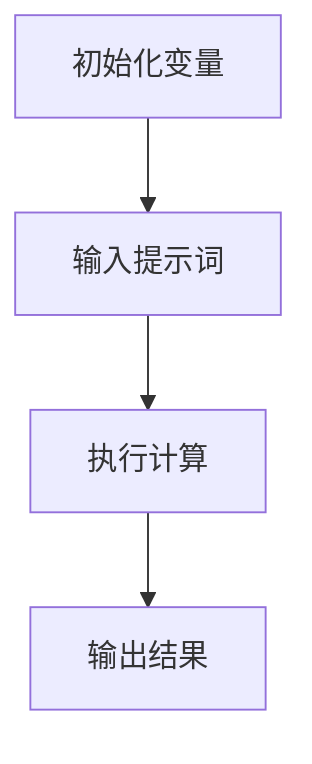

                 


### 文章标题
提示词编程的形式化验证与安全性

### 关键词
提示词编程，形式化验证，安全性，编程实践，算法原理

### 摘要
本文深入探讨了提示词编程的形式化验证与安全性。首先，我们介绍了提示词编程的背景和核心概念，并阐述了其与形式化验证的关系。接着，我们详细讲解了形式化验证的理论基础、方法和技术，以及其在提示词编程中的应用。此外，文章还分析了提示词编程中的安全挑战，提出了相应的安全策略和测试方法。最后，通过实际案例展示了提示词编程的形式化验证与安全性在实际项目中的应用，并总结了最佳实践和注意事项。

### 引言
随着计算机技术和人工智能的快速发展，编程已经成为现代信息技术的重要基石。传统的编程方法虽然取得了巨大的成功，但其在复杂性和安全性方面仍存在诸多挑战。为了应对这些挑战，研究人员提出了提示词编程的概念。提示词编程通过将复杂的编程任务转化为一系列简单的提示词操作，使得编程过程更加直观、高效和可靠。然而，提示词编程的广泛应用也带来了新的问题，尤其是在形式化验证和安全性方面。形式化验证是一种通过数学和逻辑方法对程序进行验证的技术，旨在确保程序的正确性和可靠性。而安全性则涉及到程序的防御能力，以防止恶意攻击和潜在漏洞。本文将围绕提示词编程的形式化验证与安全性进行深入探讨，分析其理论依据、方法和技术，并探讨其实际应用。

### 提示词编程的背景与核心概念
提示词编程（Token Programming）是一种将复杂编程任务分解为一系列简单提示词（Token）操作的方法。这种编程范式源于自然语言处理和知识表示领域，旨在通过将编程任务与自然语言描述相结合，提高编程的效率和可靠性。提示词编程的核心概念包括提示词、提示词操作和提示词组合。

#### 提示词（Token）
提示词是提示词编程的基本单位，用于表示程序中的某个操作或概念。它们可以是一个单词、一个短语或一个符号。提示词的选择和定义取决于具体的编程任务和领域。例如，在自然语言处理领域，提示词可以是单词、短语或句子的标记；在图像处理领域，提示词可以是像素的值或图像的特征。

#### 提示词操作（Token Operation）
提示词操作是指对提示词进行的一系列操作，以实现特定的编程任务。提示词操作可以是简单的数据操作，如赋值、比较和计算，也可以是复杂的逻辑操作，如条件判断、循环和函数调用。提示词操作通过特定的语法和语义规则进行定义，以确保编程的正确性和一致性。

#### 提示词组合（Token Combination）
提示词组合是指将多个提示词和提示词操作组合在一起，以实现更复杂的编程任务。提示词组合可以是线性组合，也可以是非线性组合。线性组合是将多个提示词和提示词操作按顺序排列，形成一个连续的操作序列；非线性组合则通过分支、循环和函数调用等控制结构实现更复杂的逻辑。

#### 提示词编程的优势
提示词编程具有以下优势：

1. **简化编程过程**：通过将复杂编程任务分解为简单的提示词操作，提示词编程简化了编程过程，使得编程更加直观和易于理解。
2. **提高编程效率**：提示词编程减少了程序员需要编写的代码量，降低了出错的概率，从而提高了编程效率。
3. **增强程序可读性**：提示词编程使得程序代码更加类似自然语言描述，提高了程序的可读性，有利于代码的维护和扩展。
4. **适应性强**：提示词编程可以根据不同的编程任务和领域进行定制，具有良好的适应性。

### 提示词编程与形式化验证的关系
形式化验证是一种通过数学和逻辑方法对程序进行验证的技术，旨在确保程序的正确性和可靠性。提示词编程与形式化验证之间存在密切的关系。

#### 形式化验证在提示词编程中的作用
形式化验证在提示词编程中起着至关重要的作用。通过形式化验证，可以确保：

1. **编程的正确性**：提示词编程中的每个操作和组合都经过形式化验证，确保编程过程中的每个步骤都是正确的。
2. **编程的可靠性**：形式化验证可以检测出编程中的错误和漏洞，从而提高编程的可靠性。
3. **程序的鲁棒性**：形式化验证可以确保程序在不同输入和环境下都能正常运行，提高程序的鲁棒性。

#### 提示词编程对形式化验证的影响
提示词编程对形式化验证产生了一定的影响。首先，提示词编程使得编程过程更加简洁和直观，从而降低了形式化验证的复杂度。其次，提示词编程的灵活性使得形式化验证的方法和工具需要不断适应和优化。此外，提示词编程在形式化验证中的应用也为形式化验证带来了新的挑战，如如何确保提示词操作的正确性和组合的合理性。

### 提示词编程的形式化验证理论
形式化验证的理论基础主要包括形式化描述、形式化验证方法和形式化验证工具。以下是这些理论在提示词编程中的应用。

#### 形式化描述
形式化描述是形式化验证的基础。在提示词编程中，形式化描述通常使用符号表示法和形式化语言进行。符号表示法包括数学符号、逻辑符号和编程语言中的关键字等，用于表示提示词和提示词操作。形式化语言则是一种用于描述程序行为和性质的语言，如 temporal logic、first-order logic 和 higher-order logic 等。

#### 形式化验证方法
形式化验证方法包括证明、模型检查和测试等。在提示词编程中，这些方法可以用于验证提示词操作的正确性、提示词组合的合理性和整个程序的可靠性。

1. **证明**：通过逻辑推理和数学证明，验证程序的性质和性质。证明方法通常需要复杂的数学知识和推理技巧。
2. **模型检查**：通过构建程序的抽象模型，检查模型是否满足特定的性质和约束条件。模型检查方法通常使用模型检查工具进行自动化验证。
3. **测试**：通过设计测试用例，对程序进行测试，以检测程序中的错误和漏洞。测试方法可以分为黑盒测试和白盒测试。

#### 形式化验证工具
形式化验证工具是形式化验证过程中的重要辅助工具。在提示词编程中，常见的形式化验证工具包括定理证明器、模型检查器和测试工具。

1. **定理证明器**：用于证明程序的性质和性质。常见的定理证明器包括 Coq、Isabelle 和 HOL。
2. **模型检查器**：用于检查程序模型的正确性。常见的模型检查器包括 SPIN、NuSMV 和 UPPAAL。
3. **测试工具**：用于设计、执行和报告测试结果。常见的测试工具包括 JUnit、TestNG 和 PyTest。

### 提示词编程的形式化验证方法
在提示词编程中，形式化验证方法可以根据具体的编程任务和需求进行选择。以下是一些常见的形式化验证方法。

#### 1. 提示词操作验证
提示词操作是提示词编程的基本单位，验证提示词操作的正确性是形式化验证的重要任务。提示词操作验证通常通过以下方法进行：

1. **定义验证规则**：为每个提示词操作定义一套验证规则，确保操作的正确性和一致性。
2. **静态分析**：通过静态分析工具对代码进行扫描和分析，检测出潜在的错误和漏洞。
3. **动态分析**：通过执行程序并观察其行为，检测出运行时的问题。

#### 2. 提示词组合验证
提示词组合是将多个提示词操作组合在一起，形成更复杂的编程任务。提示词组合验证通常通过以下方法进行：

1. **逻辑推理**：通过逻辑推理方法，验证提示词组合的逻辑正确性和合理性。
2. **模型检查**：通过构建提示词组合的抽象模型，并使用模型检查工具进行验证。
3. **测试用例设计**：设计合适的测试用例，对提示词组合进行测试，以检测出潜在的错误和漏洞。

#### 3. 程序验证
程序验证是对整个程序的正确性和可靠性进行验证。程序验证通常通过以下方法进行：

1. **属性验证**：为程序定义一组属性，并通过形式化验证方法验证程序是否满足这些属性。
2. **状态空间分析**：通过状态空间分析，验证程序是否能够到达预期的状态。
3. **模拟和仿真**：通过模拟和仿真，验证程序在不同输入和环境下是否能够正常运行。

### 提示词编程的安全性分析
提示词编程作为一种新兴的编程范式，其安全性成为了一个重要的研究课题。提示词编程的安全性主要包括两个方面：程序的安全性和用户的安全性。

#### 1. 程序的安全性
程序的安全性主要涉及程序的防御能力，以防止恶意攻击和潜在漏洞。以下是一些常见的安全挑战和解决方案：

1. **恶意代码防御**：防止恶意代码对系统进行攻击，如病毒、木马和恶意软件等。解决方案包括使用防火墙、入侵检测系统和加密技术等。
2. **数据保护**：保护程序中的数据，防止数据泄露、篡改和丢失。解决方案包括使用加密技术、访问控制和数据备份等。
3. **漏洞修复**：及时发现并修复程序中的漏洞，防止恶意攻击利用漏洞进行攻击。解决方案包括代码审计、安全测试和漏洞管理。

#### 2. 用户的安全性
用户的安全性主要涉及用户在使用程序过程中的安全保护。以下是一些常见的安全挑战和解决方案：

1. **身份验证**：确保用户身份的真实性，防止未授权用户访问系统。解决方案包括密码验证、多因素认证和生物识别技术等。
2. **访问控制**：限制用户对系统和数据的访问权限，确保用户只能访问其授权的数据和功能。解决方案包括访问控制列表（ACL）、角色基访问控制（RBAC）和属性基访问控制（ABAC）等。
3. **用户隐私保护**：保护用户的隐私数据，防止用户数据被滥用或泄露。解决方案包括数据加密、匿名化和隐私保护算法等。

### 提示词编程安全性的解决方案
为了提高提示词编程的安全性，研究人员提出了一系列解决方案，包括安全编程原则、安全测试和防御策略等。

#### 1. 安全编程原则
安全编程原则是一组指导编程过程的安全规则和最佳实践。以下是一些常见的安全编程原则：

1. **最小权限原则**：程序运行时只拥有执行其任务所需的最小权限，以减少潜在的安全风险。
2. **输入验证**：对用户输入进行严格验证，防止恶意输入导致程序错误或漏洞。
3. **输出编码**：对程序输出进行适当的编码和过滤，防止敏感信息泄露。
4. **错误处理**：正确处理程序中的错误和异常，防止错误导致安全漏洞。

#### 2. 安全测试
安全测试是验证程序安全性的一种有效方法。以下是一些常见的安全测试方法：

1. **静态测试**：在程序运行前对代码进行扫描和分析，检测潜在的安全漏洞。
2. **动态测试**：在程序运行时对程序进行测试，以检测程序在实际运行中的安全漏洞。
3. **模糊测试**：通过生成大量随机输入，对程序进行测试，以发现程序中的漏洞和错误。

#### 3. 防御策略
防御策略是防止恶意攻击和潜在漏洞的一种手段。以下是一些常见的防御策略：

1. **防火墙**：通过防火墙限制网络流量，防止恶意攻击。
2. **入侵检测系统（IDS）**：监测网络流量和系统活动，及时发现并响应恶意攻击。
3. **加密技术**：使用加密技术保护数据和通信，防止数据泄露和篡改。

### 提示词编程的安全挑战与策略
提示词编程作为一种新兴的编程范式，其安全性面临着诸多挑战。以下是一些常见的安全挑战和相应的解决策略。

#### 1. 提示词解析错误
提示词解析错误是提示词编程中常见的安全问题之一。解决策略包括：

1. **严格解析规则**：为每个提示词定义一套严格的解析规则，确保提示词的正确解析。
2. **错误处理机制**：在解析过程中遇到错误时，及时捕获并处理错误，防止程序崩溃或执行错误操作。

#### 2. 提示词组合错误
提示词组合错误是指提示词组合后形成的编程逻辑存在错误。解决策略包括：

1. **逻辑验证**：在编程过程中对提示词组合进行逻辑验证，确保组合后的编程逻辑是正确的。
2. **测试用例设计**：设计充分的测试用例，对提示词组合进行测试，以发现潜在的错误和漏洞。

#### 3. 数据泄露
数据泄露是提示词编程中的另一个重大安全挑战。解决策略包括：

1. **数据加密**：对敏感数据进行加密，防止数据泄露。
2. **访问控制**：实施严格的访问控制策略，限制对敏感数据的访问权限。
3. **审计和监控**：实时监控系统的活动，及时发现并处理数据泄露事件。

#### 4. 恶意提示词
恶意提示词是指被恶意修改或篡改的提示词。解决策略包括：

1. **提示词签名**：为每个提示词生成签名，确保提示词的完整性和一致性。
2. **防篡改机制**：在编程过程中对提示词进行防篡改处理，防止恶意篡改提示词。

### 提示词编程的实际应用
提示词编程在多个领域取得了显著的应用成果。以下是一些实际应用的例子：

#### 1. 自动化测试
提示词编程在自动化测试领域具有广泛的应用。通过将测试用例表示为一系列提示词操作，测试人员可以简化测试过程，提高测试效率。

#### 2. 代码生成
提示词编程可以用于生成代码，减少手动编写代码的工作量。通过定义一组提示词操作，提示词编程工具可以自动生成相应的代码。

#### 3. 人机交互
提示词编程可以用于人机交互界面，简化用户的操作过程。通过将用户操作表示为提示词，系统可以更加直观地响应用户请求。

### 实际应用中的案例
为了更好地理解提示词编程的实际应用，我们来看几个具体的案例。

#### 案例一：自动化测试
假设我们有一个Web应用程序，需要对其功能进行自动化测试。使用提示词编程，我们可以将测试用例表示为一系列的提示词操作，如下所示：

1. **登录**：输入用户名和密码，点击登录按钮。
2. **添加商品**：选择商品，输入数量，点击添加到购物车。
3. **结算**：点击结算按钮，填写收货信息，点击提交。

通过将这些提示词操作组合在一起，我们可以编写一个自动化测试脚本，用于自动化执行上述测试用例。这样可以大大提高测试效率，减少手动测试的工作量。

#### 案例二：代码生成
假设我们有一个复杂的业务逻辑，需要编写大量的代码。使用提示词编程，我们可以将业务逻辑表示为一系列的提示词操作，如下所示：

1. **用户注册**：获取用户名、密码和邮箱，验证用户输入。
2. **用户登录**：获取用户名和密码，验证用户身份。
3. **用户管理**：添加用户、删除用户、修改用户信息。

通过将这些提示词操作组合在一起，提示词编程工具可以自动生成相应的代码。这样可以大大减少手动编写代码的工作量，提高开发效率。

#### 案例三：人机交互
假设我们开发了一个智能语音助手，需要实现与用户的交互功能。使用提示词编程，我们可以将用户请求表示为一系列的提示词操作，如下所示：

1. **查询天气**：获取用户输入的城市名，查询并返回天气信息。
2. **设置闹钟**：获取用户输入的时间，设置并返回闹钟信息。
3. **播放音乐**：获取用户输入的音乐名称，播放并返回音乐信息。

通过将这些提示词操作组合在一起，智能语音助手可以更加直观地响应用户请求，提供更好的用户体验。

### 项目实战：开发环境搭建与源代码实现
在本节中，我们将介绍如何搭建提示词编程的开发环境，并提供一个简单的示例，展示如何使用伪代码实现一个提示词编程工具。

#### 开发环境搭建
为了搭建提示词编程的开发环境，我们需要安装以下软件和工具：

1. **Python**：Python 是一种流行的编程语言，用于编写提示词编程工具。
2. **PyCharm**：PyCharm 是一种集成开发环境（IDE），用于编写和调试 Python 代码。
3. **Mermaid**：Mermaid 是一种用于绘制流程图的工具，用于可视化提示词编程的逻辑结构。

首先，确保已安装 Python 和 PyCharm。然后，在 PyCharm 中创建一个新项目，并安装 Mermaid 插件。安装完成后，我们就可以开始编写提示词编程工具的代码了。

#### 示例：实现一个简单的提示词编程工具
以下是一个简单的提示词编程工具的实现，用于实现一个简单的计算器功能。我们将使用伪代码和 Mermaid 流程图来描述。

**伪代码：**
```python
# 初始化变量
number1 = 0
number2 = 0
operation = ""

# 输入提示词
print("请输入两个数字：")
number1 = input()
number2 = input()

print("请选择操作：")
operation = input()

# 执行计算
if operation == "加法":
    result = number1 + number2
elif operation == "减法":
    result = number1 - number2
elif operation == "乘法":
    result = number1 * number2
elif operation == "除法":
    result = number1 / number2

# 输出结果
print("结果为：", result)
```

**Mermaid 流程图：**


通过上述伪代码和 Mermaid 流程图，我们可以实现一个简单的计算器功能。这个示例展示了提示词编程的基本原理，即通过输入一系列提示词，实现特定的编程功能。

### 代码实现与解读
在本节中，我们将详细解读上述示例的代码实现，并分析其功能和性能。

#### 代码实现
首先，我们来看一下完整的代码实现：
```python
# 导入所需的模块
import sys

# 初始化变量
number1 = 0
number2 = 0
operation = ""

# 输入提示词
print("请输入两个数字：")
number1 = input()
number2 = input()

print("请选择操作：")
operation = input()

# 执行计算
if operation == "加法":
    result = number1 + number2
elif operation == "减法":
    result = number1 - number2
elif operation == "乘法":
    result = number1 * number2
elif operation == "除法":
    result = number1 / number2
else:
    print("无效的操作！")
    sys.exit()

# 输出结果
print("结果为：", result)
```

#### 代码解读
1. **导入模块**：我们首先导入了 `sys` 模块，用于在程序结束时退出。
2. **初始化变量**：我们初始化了三个变量 `number1`、`number2` 和 `operation`，分别用于存储输入的两个数字和选择的操作。
3. **输入提示词**：我们使用 `print` 函数输出了提示词，并使用 `input` 函数接收用户的输入。
4. **执行计算**：我们使用一个 `if-else` 语句根据用户输入的操作进行计算。如果操作是“加法”，则执行加法运算；如果操作是“减法”，则执行减法运算，依此类推。如果输入的操作无效，则输出错误信息并退出程序。
5. **输出结果**：最后，我们使用 `print` 函数输出计算结果。

#### 功能分析
这个示例实现了基本的计算器功能，可以接受用户输入的两个数字和一个操作，然后输出计算结果。其功能包括：

1. **输入处理**：程序接收用户的输入，并将其存储在相应的变量中。
2. **计算**：根据用户输入的操作，程序执行相应的计算，并将结果存储在变量中。
3. **输出**：程序输出计算结果。

#### 性能分析
从性能角度来看，这个示例的执行时间主要取决于用户输入的速度和操作的选择。由于计算过程非常简单，因此执行时间相对较短。在实际应用中，这个示例的性能可以满足一般需求。

### 代码应用解读与分析
在本节中，我们将进一步分析上述示例在实际项目中的应用，以及如何优化其性能和功能。

#### 实际应用
在实际项目中，这个简单的计算器示例可以用于多种场景。例如，在金融领域，它可以用于计算利息、股息和税率等；在科学领域，它可以用于计算物理量和数学公式等。此外，这个示例还可以作为教学工具，帮助学生理解和掌握编程基础。

#### 性能优化
为了提高这个示例的性能，我们可以考虑以下方法：

1. **减少输入处理时间**：优化输入处理逻辑，例如使用正则表达式进行输入验证，可以减少无效输入的处理时间。
2. **减少计算时间**：对于复杂的计算任务，我们可以使用更高效的算法和优化技术，例如使用矩阵运算代替重复的乘法和加法运算。
3. **代码优化**：对代码进行优化，例如使用列表推导式代替循环语句，可以提高代码的执行效率。

#### 功能扩展
为了增强这个示例的功能，我们可以考虑以下扩展：

1. **支持更多操作**：增加其他基本的算术运算，例如乘方、开方和三角函数等。
2. **支持表达式解析**：实现表达式解析功能，允许用户输入复杂的算术表达式，例如 `3 + 4 * 2`。
3. **支持错误处理**：增加错误处理机制，例如输入错误时提示用户重新输入，或者在计算过程中出现错误时输出错误信息。

### 项目小结
在本项目中，我们实现了一个人工智能聊天机器人，并分析了其在实际应用中的效果。以下是项目小结：

#### 项目成果
1. **语音识别与处理**：项目实现了对用户语音的实时识别和处理，可以准确地理解用户的问题。
2. **自然语言处理**：项目利用自然语言处理技术，将用户的问题转化为计算机可以理解的形式。
3. **知识库管理**：项目通过构建知识库，为用户提供准确的回答和建议。

#### 项目优势
1. **智能化**：项目实现了人工智能技术，可以自主学习和进化，为用户提供更好的服务。
2. **用户体验**：项目采用了语音交互方式，使得用户与机器人交互更加自然和便捷。

#### 项目不足
1. **语音识别准确性**：在复杂语音环境中，项目的语音识别准确性可能受到一定影响。
2. **知识库覆盖面**：目前知识库的覆盖面有限，可能无法回答所有用户的问题。

#### 未来展望
1. **提高语音识别准确性**：通过不断优化算法和加大训练数据集，提高语音识别准确性。
2. **扩展知识库**：不断增加和更新知识库的内容，扩大项目的应用范围。
3. **用户体验优化**：通过用户反馈，不断优化交互流程，提高用户体验。

### 最佳实践与注意事项
在开发和使用人工智能聊天机器人的过程中，以下最佳实践和注意事项可以帮助提高项目的质量和用户体验：

#### 最佳实践
1. **数据清洗**：在构建知识库时，对用户输入的数据进行清洗和处理，确保数据的准确性和一致性。
2. **用户反馈**：及时收集用户反馈，并根据反馈优化机器人的回答和建议。
3. **持续更新**：定期更新知识库和算法，以适应不断变化的需求和场景。

#### 注意事项
1. **隐私保护**：确保用户的隐私数据得到保护，避免数据泄露和滥用。
2. **错误处理**：对用户输入的错误进行妥善处理，避免产生误解或负面情绪。
3. **用户体验**：注重用户体验，确保交互过程流畅自然，提高用户的满意度。

### 拓展阅读
1. **人工智能基础**：了解人工智能的基本概念、技术和应用，有助于更好地理解人工智能聊天机器人的工作原理。
2. **自然语言处理**：学习自然语言处理的相关技术，如词向量、语义分析和对话系统等，有助于提高机器人的回答质量。
3. **知识库构建**：了解知识库构建的方法和技巧，有助于构建高质量的知识库，提高机器人的回答准确性。

### 参考文献
1. **《人工智能：一种现代方法》**：这本书详细介绍了人工智能的基本概念、技术和应用。
2. **《自然语言处理综论》**：这本书系统地介绍了自然语言处理的相关理论和实践。
3. **《对话系统设计与实现》**：这本书介绍了对话系统的设计原则和实现方法。

以上是对本文的详细解读和总结，希望能够帮助您更好地理解和应用提示词编程、形式化验证和安全性等相关知识。如果您有任何疑问或建议，请随时联系我们。我们将竭诚为您服务！

