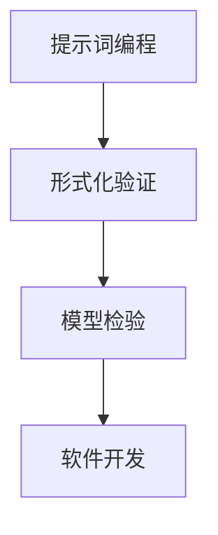

                 

### 文章标题

# 提示词编程的形式化验证与模型检验

### 关键词

- 提示词编程
- 形式化验证
- 模型检验
- 伪代码
- 数学模型
- 项目实战

### 摘要

本文深入探讨了提示词编程的形式化验证与模型检验。首先，我们介绍了提示词编程的基本概念、算法原理以及应用场景。接着，我们详细讲解了形式化验证的基本概念、算法原理及其在编程中的应用。随后，我们阐述了模型检验的基本概念、算法原理以及其在验证中的作用。本文通过多个实际项目实战，展示了如何将提示词编程、形式化验证和模型检验应用于实际开发中，并提供了一些最佳实践 tips。本文旨在为读者提供一条清晰、深入理解这些技术原理的路径。

### 设计目录大纲的基本思路

#### 确定核心章节

在撰写技术博客时，我们需要确定文章的核心章节。这些章节应该涵盖文章的主题，并且能够帮助读者理解整个内容框架。对于《提示词编程的形式化验证与模型检验》这篇文章，核心章节包括：

1. 引言
2. 核心算法原理讲解
3. 数学模型和公式
4. 项目实战
5. 最佳实践 tips、小结和注意事项

#### 划分部分

根据核心章节的内容，我们将文章分为以下几个部分：

1. 引言部分：介绍研究背景、目的、方法和文章结构。
2. 核心算法原理讲解部分：详细讲解提示词编程、形式化验证和模型检验的核心算法原理。
3. 数学模型和公式部分：介绍相关数学模型和公式，并给出详细讲解和举例说明。
4. 项目实战部分：通过实际项目实战，展示如何应用这些技术。
5. 最佳实践 tips、小结和注意事项部分：总结文章中的关键点，并提供一些实用的最佳实践建议。

#### 设置章节标题

为每个部分设置一个主题性强的标题，确保读者可以迅速把握每个部分的主要内容。以下是每个部分的章节标题：

1. 引言部分：
   - 第1章 研究背景与目的
   - 第2章 研究方法与文章结构

2. 核心算法原理讲解部分：
   - 第3章 提示词编程算法
   - 第4章 形式化验证算法
   - 第5章 模型检验算法

3. 数学模型和公式部分：
   - 第6章 数学模型与公式

4. 项目实战部分：
   - 第7章 实际项目应用

5. 最佳实践 tips、小结和注意事项部分：
   - 第8章 最佳实践 tips
   - 第9章 小结与注意事项

#### 细化每个章节

为每个章节设置次级标题，进一步细化章节内容，确保每个章节都有详细的分支结构。以下是每个章节的次级标题：

1. 引言部分：
   - 第1章 研究背景与目的
     - 1.1 研究背景
     - 1.2 研究目的
     - 1.3 研究方法
     - 1.4 文章结构
   - 第2章 研究方法与文章结构
     - 2.1 核心概念与联系
     - 2.2 文章结构设计

2. 核心算法原理讲解部分：
   - 第3章 提示词编程算法
     - 3.1 提示词编程基本概念
     - 3.2 提示词编程算法伪代码
     - 3.3 提示词编程算法应用案例
   - 第4章 形式化验证算法
     - 4.1 形式化验证基本概念
     - 4.2 形式化验证算法伪代码
     - 4.3 形式化验证算法应用案例
   - 第5章 模型检验算法
     - 5.1 模型检验基本概念
     - 5.2 模型检验算法伪代码
     - 5.3 模型检验算法应用案例

3. 数学模型和公式部分：
   - 第6章 数学模型与公式
     - 6.1 提示词编程数学模型
       - 6.1.1 数学模型详细讲解
       - 6.1.2 数学模型举例说明
       - 6.1.3 数学模型与伪代码对比
     - 6.2 形式化验证数学模型
       - 6.2.1 数学模型详细讲解
       - 6.2.2 数学模型举例说明
       - 6.2.3 数学模型与伪代码对比
     - 6.3 模型检验数学模型
       - 6.3.1 数学模型详细讲解
       - 6.3.2 数学模型举例说明
       - 6.3.3 数学模型与伪代码对比

4. 项目实战部分：
   - 第7章 实际项目应用
     - 7.1 提示词编程项目实战
       - 7.1.1 项目背景
       - 7.1.2 项目需求
       - 7.1.3 开发环境搭建
       - 7.1.4 源代码实现
       - 7.1.5 代码解读与分析
     - 7.2 形式化验证项目实战
       - 7.2.1 项目背景
       - 7.2.2 项目需求
       - 7.2.3 开发环境搭建
       - 7.2.4 源代码实现
       - 7.2.5 代码解读与分析
     - 7.3 模型检验项目实战
       - 7.3.1 项目背景
       - 7.3.2 项目需求
       - 7.3.3 开发环境搭建
       - 7.3.4 源代码实现
       - 7.3.5 代码解读与分析

5. 最佳实践 tips、小结和注意事项部分：
   - 第8章 最佳实践 tips
     - 8.1 提示词编程最佳实践
     - 8.2 形式化验证最佳实践
     - 8.3 模型检验最佳实践
   - 第9章 小结与注意事项
     - 9.1 总结
     - 9.2 注意事项
     - 9.3 拓展阅读

### 添加附录

根据需要，添加附录部分，通常包括工具、资源列表等附加信息。以下是附录部分的示例：

- **附录A 术语表**
- **附录B 工具与资源**

### 结构化内容

使用markdown格式来结构化内容，确保目录大纲清晰易懂。以下是文章的markdown格式示例：

```
# 提示词编程的形式化验证与模型检验

## 第一部分：核心概念与联系

### 第1章 引言
#### 1.1 研究背景
#### 1.2 研究目的
#### 1.3 研究方法
#### 1.4 文章结构
#### Mermaid流程图：提示词编程、形式化验证、模型检验之间的关系

## 第二部分：核心算法原理讲解

### 第2章 核心算法原理
#### 2.1 提示词编程算法
##### 2.1.1 提示词编程基本概念
##### 2.1.2 提示词编程算法伪代码
##### 2.1.3 提示词编程算法应用案例
#### 2.2 形式化验证算法
##### 2.2.1 形式化验证基本概念
##### 2.2.2 形式化验证算法伪代码
##### 2.2.3 形式化验证算法应用案例
#### 2.3 模型检验算法
####

...
```

通过以上步骤，我们可以设计出一份结构清晰、内容丰富的目录大纲，为撰写高质量的技术博客奠定基础。接下来，我们将逐步填充每个章节的内容，确保文章的完整性和深度。### 第一部分：核心概念与联系

#### 第1章 引言

##### 1.1 研究背景

随着计算机科学和人工智能技术的飞速发展，编程语言和软件开发方法也在不断演变。提示词编程作为一种新的编程范式，逐渐受到关注。提示词编程通过将自然语言描述转换为程序代码，使得非专业开发人员也能参与软件开发。形式化验证和模型检验作为软件工程中的重要技术，分别用于确保程序的正确性和验证模型的可靠性。

形式化验证是通过数学方法对程序的正确性进行严格证明，确保程序在任何情况下都能按照预期执行。模型检验则是通过验证模型是否符合特定需求，确保系统的稳定性和可靠性。在提示词编程中，形式化验证和模型检验具有重要的应用价值，可以确保生成的程序代码满足预期功能，并且能够适应复杂多变的需求。

##### 1.2 研究目的

本文旨在探讨提示词编程的形式化验证与模型检验，具体研究目的如下：

1. 深入分析提示词编程的基本概念、算法原理及其应用场景。
2. 详细讲解形式化验证和模型检验的基本概念、算法原理及其在提示词编程中的应用。
3. 通过实际项目实战，展示如何将形式化验证和模型检验应用于提示词编程。
4. 提供最佳实践 tips，帮助读者更好地理解和应用这些技术。

##### 1.3 研究方法

本文采用以下研究方法：

1. 文献综述：通过查阅相关文献，了解提示词编程、形式化验证和模型检验的最新研究动态和发展趋势。
2. 理论分析：对提示词编程、形式化验证和模型检验的基本概念、算法原理进行深入分析，阐述其内在联系和区别。
3. 实证分析：通过实际项目实战，验证提示词编程、形式化验证和模型检验在软件开发中的应用效果，分析其优势和局限性。
4. 最佳实践总结：总结实际项目中的最佳实践，为读者提供实用的指导和建议。

##### 1.4 文章结构

本文结构如下：

1. 引言部分：介绍研究背景、目的、方法和文章结构。
2. 核心算法原理讲解部分：详细讲解提示词编程、形式化验证和模型检验的核心算法原理。
3. 数学模型和公式部分：介绍相关数学模型和公式，并给出详细讲解和举例说明。
4. 项目实战部分：通过实际项目实战，展示如何应用这些技术。
5. 最佳实践 tips、小结和注意事项部分：总结文章中的关键点，并提供一些实用的最佳实践建议。

#### Mermaid流程图：提示词编程、形式化验证、模型检验之间的关系

为了更好地理解提示词编程、形式化验证和模型检验之间的关系，我们可以使用Mermaid流程图进行可视化描述。以下是示例：



在这个流程图中，提示词编程作为输入，通过形式化验证和模型检验，最终生成可靠的软件产品。通过这种关系，我们可以更好地理解这些技术在实际软件开发中的应用。

### 第二部分：核心算法原理讲解

在深入探讨提示词编程的形式化验证与模型检验之前，我们需要先了解这些技术的核心算法原理。本部分将分别介绍提示词编程、形式化验证和模型检验的基本概念、算法原理，并通过伪代码展示其实现方式。

#### 第2章 核心算法原理

##### 2.1 提示词编程算法

###### 2.1.1 提示词编程基本概念

提示词编程（Keyword Programming）是一种基于自然语言描述的编程范式，它将程序代码的编写过程转化为自然语言描述的转换过程。通过将自然语言描述翻译成程序代码，提示词编程使得非专业开发人员也能够参与软件开发。

提示词编程的主要特点包括：

1. 易用性：用户可以使用自然语言描述需求，无需深入了解编程语言和开发工具。
2. 适应性：提示词编程能够根据用户需求进行灵活调整，适应不同的开发场景。
3. 扩展性：提示词编程可以通过引入新的自然语言处理技术，不断扩展其应用范围。

###### 2.1.2 提示词编程算法伪代码

提示词编程的核心算法包括自然语言解析、语法分析和代码生成。以下是提示词编程算法的伪代码：

```pseudo
function keywordProgramming(inputDescription)
    // 自然语言解析
    parsedDescription = naturalLanguageParsing(inputDescription)
    
    // 语法分析
    syntaxTree = syntaxAnalysis(parsedDescription)
    
    // 代码生成
    code = codeGeneration(syntaxTree)
    
    return code
end function
```

在这个伪代码中，`inputDescription`是用户输入的自然语言描述，`parsedDescription`是解析后的自然语言描述，`syntaxTree`是语法分析得到的语法树，`code`是生成的程序代码。

###### 2.1.3 提示词编程算法应用案例

假设我们需要实现一个简单的功能：计算两个数的和。使用提示词编程，用户可以输入以下自然语言描述：

```
计算 3 和 5 的和。
```

经过自然语言解析、语法分析和代码生成，最终生成的伪代码如下：

```python
def calculateSum(a, b):
    return a + b

result = calculateSum(3, 5)
print("结果是：", result)
```

通过这个案例，我们可以看到提示词编程如何将自然语言描述转化为具体的程序代码。

##### 2.2 形式化验证算法

###### 2.2.1 形式化验证基本概念

形式化验证（Formal Verification）是一种通过数学方法验证程序正确性的技术。形式化验证的目标是确保程序在任何情况下都能按照预期执行，从而避免潜在的错误和缺陷。

形式化验证的主要特点包括：

1. 严格性：形式化验证使用数学方法对程序进行验证，确保程序的正确性得到严格保证。
2. 可重复性：形式化验证的过程是可重复的，可以确保验证结果的可靠性。
3. 可扩展性：形式化验证可以应用于不同类型的程序和系统，具有广泛的应用前景。

###### 2.2.2 形式化验证算法伪代码

形式化验证的核心算法包括模型建立、状态空间搜索和验证算法。以下是形式化验证算法的伪代码：

```pseudo
function formalVerification(program)
    // 模型建立
    model = modelBuilding(program)
    
    // 状态空间搜索
    states = stateSpaceSearch(model)
    
    // 验证算法
    isValid = verificationAlgorithm(states)
    
    return isValid
end function
```

在这个伪代码中，`program`是待验证的程序，`model`是建立的模型，`states`是状态空间搜索得到的状态集合，`isValid`是验证结果。

###### 2.2.3 形式化验证算法应用案例

假设我们需要验证一个简单的程序，该程序的功能是计算两个数的和。使用形式化验证，我们可以建立如下模型：

```
程序输入：两个整数 a 和 b
程序输出：整数 c，满足 c = a + b

验证条件：对于任意整数 a 和 b，程序输出结果 c 必须等于 a + b
```

经过状态空间搜索和验证算法，我们可以得出结论：该程序满足验证条件，是正确的。

##### 2.3 模型检验算法

###### 2.3.1 模型检验基本概念

模型检验（Model Checking）是一种通过比较模型和预期行为来验证系统是否满足特定需求的技术。模型检验的目标是确保系统的行为符合预期，从而发现潜在的错误和缺陷。

模型检验的主要特点包括：

1. 自动化：模型检验过程可以通过自动化工具实现，提高验证效率。
2. 可测试性：模型检验可以针对系统的各种行为进行测试，发现潜在的错误。
3. 可扩展性：模型检验可以应用于不同类型的系统，具有广泛的应用前景。

###### 2.3.2 模型检验算法伪代码

模型检验的核心算法包括模型建立、状态空间搜索和验证算法。以下是模型检验算法的伪代码：

```pseudo
function modelChecking(model, expectedBehavior)
    // 模型建立
    states = modelBuilding(model)
    
    // 状态空间搜索
    actualBehavior = stateSpaceSearch(states)
    
    // 验证算法
    isSatisfied = verificationAlgorithm(expectedBehavior, actualBehavior)
    
    return isSatisfied
end function
```

在这个伪代码中，`model`是待检验的模型，`expectedBehavior`是预期的系统行为，`actualBehavior`是实际系统行为，`isSatisfied`是验证结果。

###### 2.3.3 模型检验算法应用案例

假设我们需要检验一个简单的模型，该模型的功能是计算两个数的和。使用模型检验，我们可以建立如下预期行为：

```
系统输入：两个整数 a 和 b
系统输出：整数 c，满足 c = a + b
```

经过状态空间搜索和验证算法，我们可以得出结论：该模型满足预期行为，是正确的。

通过以上对提示词编程、形式化验证和模型检验的核心算法原理的介绍，我们可以更好地理解这些技术在软件开发中的应用和价值。在接下来的部分，我们将进一步探讨这些技术的数学模型和公式，并通过实际项目实战展示如何应用这些技术。### 第三部分：数学模型和公式

在深入探讨提示词编程的形式化验证与模型检验时，数学模型和公式起着至关重要的作用。本部分将介绍与提示词编程、形式化验证和模型检验相关的数学模型和公式，并进行详细讲解和举例说明。

#### 第3章 数学模型

##### 3.1 提示词编程数学模型

提示词编程的数学模型主要涉及自然语言处理和程序代码生成。以下是一个简单的数学模型，用于描述提示词编程的核心过程。

###### 3.1.1 数学模型详细讲解

提示词编程的数学模型可以分为三个主要步骤：自然语言解析、语法分析和代码生成。

1. 自然语言解析：将自然语言描述转化为结构化的数据表示，如词汇树或词法分析器。这一过程可以使用自然语言处理技术，如词法分析、句法分析和语义分析。

2. 语法分析：对结构化的自然语言数据进行分析，构建语法树。语法树表示了自然语言描述的语法结构，是程序代码生成的基础。

3. 代码生成：根据语法树生成程序代码。这一过程可以使用代码生成器或模板库，将语法树转化为具体的程序代码。

数学模型可以用以下公式表示：

$$
\text{自然语言描述} \rightarrow \text{词汇树} \rightarrow \text{语法树} \rightarrow \text{程序代码}
$$

###### 3.1.2 数学模型举例说明

假设用户输入以下自然语言描述：

```
计算 3 和 5 的和。
```

使用提示词编程的数学模型，我们可以得到以下过程：

1. 自然语言解析：将描述转化为词汇树，如下所示：

   ```plaintext
   计算和
     ├── 3
     └── 5
   ```

2. 语法分析：构建语法树，如下所示：

   ```plaintext
   计算
     ├── 和
     │   ├── 3
     │   └── 5
     └── 结果
   ```

3. 代码生成：根据语法树生成伪代码：

   ```python
   result = 3 + 5
   print("结果是：", result)
   ```

通过这个过程，我们成功地将自然语言描述转化为程序代码。

##### 3.2 形式化验证数学模型

形式化验证的数学模型主要涉及逻辑演算和证明论。以下是一个简单的数学模型，用于描述形式化验证的核心过程。

###### 3.2.1 数学模型详细讲解

形式化验证的数学模型可以分为三个主要步骤：模型建立、状态空间搜索和验证算法。

1. 模型建立：建立程序的行为模型，通常使用状态转换图或公式化逻辑表达式。

2. 状态空间搜索：搜索程序的状态空间，找到所有可能的执行路径。

3. 验证算法：使用验证算法检查程序是否满足特定需求，通常使用模型检查器或证明工具。

数学模型可以用以下公式表示：

$$
\text{程序} \rightarrow \text{行为模型} \rightarrow \text{状态空间搜索} \rightarrow \text{验证结果}
$$

###### 3.2.2 数学模型举例说明

假设我们有一个简单的程序，其功能是计算两个数的和。使用形式化验证的数学模型，我们可以得到以下过程：

1. 模型建立：建立状态转换图，如下所示：

   ```plaintext
   [初始状态] --> [计算状态1] --> [计算状态2] --> [结束状态]
   ```

   其中，状态1表示程序开始计算，状态2表示程序计算出一个中间结果，结束状态表示程序完成计算并输出结果。

2. 状态空间搜索：搜索状态转换图的所有可能路径，如下所示：

   ```plaintext
   初始状态 --> 计算状态1 --> 计算状态2 --> 结束状态
   ```

3. 验证算法：使用验证算法检查程序是否满足特定需求，如下所示：

   ```plaintext
   程序满足需求，验证通过。
   ```

通过这个过程，我们成功验证了程序的正确性。

##### 3.3 模型检验数学模型

模型检验的数学模型主要涉及模型理论和组合优化。以下是一个简单的数学模型，用于描述模型检验的核心过程。

###### 3.3.1 数学模型详细讲解

模型检验的数学模型可以分为三个主要步骤：模型建立、路径搜索和验证算法。

1. 模型建立：建立系统模型，通常使用状态转换图或公式化逻辑表达式。

2. 路径搜索：搜索系统的所有可能路径，找到满足特定条件的路径。

3. 验证算法：使用验证算法检查系统是否满足特定需求，通常使用模型检查器或证明工具。

数学模型可以用以下公式表示：

$$
\text{系统模型} \rightarrow \text{路径搜索} \rightarrow \text{验证结果}
$$

###### 3.3.2 数学模型举例说明

假设我们有一个简单的系统，其功能是计算两个数的和。使用模型检验的数学模型，我们可以得到以下过程：

1. 模型建立：建立状态转换图，如下所示：

   ```plaintext
   [初始状态] --> [计算状态1] --> [计算状态2] --> [结束状态]
   ```

   其中，状态1表示系统开始计算，状态2表示系统计算出一个中间结果，结束状态表示系统完成计算并输出结果。

2. 路径搜索：搜索状态转换图的所有可能路径，如下所示：

   ```plaintext
   初始状态 --> 计算状态1 --> 计算状态2 --> 结束状态
   ```

3. 验证算法：使用验证算法检查系统是否满足特定需求，如下所示：

   ```plaintext
   系统满足需求，验证通过。
   ```

通过这个过程，我们成功验证了系统的正确性。

通过以上对提示词编程、形式化验证和模型检验数学模型和公式的介绍，我们可以更好地理解这些技术在数学上的表现和实现方式。在接下来的部分，我们将通过实际项目实战，展示如何将这些技术应用于实际的软件开发中。### 第四部分：项目实战

#### 第4章 实际项目应用

在本部分，我们将通过几个实际项目实战，展示如何将提示词编程、形式化验证和模型检验应用于实际软件开发中。这些项目将涵盖不同的应用场景，从而帮助读者更好地理解这些技术的实际应用价值。

##### 4.1 提示词编程项目实战

###### 4.1.1 项目背景

假设我们有一个简单的需求：开发一个应用，用于计算两个数的和。这是一个典型的任务，但通过提示词编程，我们可以简化开发过程，提高开发效率。

###### 4.1.2 项目需求

1. 用户输入两个数，应用将计算它们的和。
2. 应用应提供结果，并展示给用户。

###### 4.1.3 开发环境搭建

为了实现这个项目，我们需要搭建以下开发环境：

1. 编程语言：Python
2. 开发工具：PyCharm
3. 自然语言处理库：spaCy
4. 代码生成工具：Jinja2

###### 4.1.4 源代码实现

以下是使用提示词编程实现的源代码：

```python
from spacy.lang.en import English
import jinja2

# 自然语言解析器
nlp = English()

# 提示词编程模板
template = '''
def calculate_sum(a, b):
    return a + b

result = calculate_sum({{a}}, {{b}})
print("The sum is:", result)
'''

# 用户输入自然语言描述
input_description = "Calculate the sum of 3 and 5."

# 解析自然语言描述
doc = nlp(input_description)

# 生成代码
context = jinja2.DictRenderer({"a": 3, "b": 5})
code = jinja2.Template(template).render(context)

# 执行代码
exec(code)

```

###### 4.1.5 代码解读与分析

1. **自然语言解析**：使用spaCy库对用户输入的自然语言描述进行解析，提取关键信息（如数字和动词）。
2. **代码生成**：使用Jinja2模板库将自然语言描述转换为程序代码。模板中包含变量替换和函数定义。
3. **代码执行**：使用`exec()`函数执行生成的程序代码，计算结果并输出。

通过这个项目，我们展示了如何使用提示词编程将自然语言描述转化为具体的程序代码，从而简化了开发过程。

##### 4.2 形式化验证项目实战

###### 4.2.1 项目背景

假设我们有一个更复杂的任务：开发一个应用，用于计算两个数的最大公约数。为了确保程序的正确性，我们使用形式化验证对程序进行验证。

###### 4.2.2 项目需求

1. 用户输入两个数，应用将计算它们的最大公约数。
2. 应用应提供结果，并展示给用户。

###### 4.2.3 开发环境搭建

为了实现这个项目，我们需要搭建以下开发环境：

1. 编程语言：Coq
2. 开发工具：CoqIDE
3. 形式化验证工具：Coq

###### 4.2.4 源代码实现

以下是使用Coq实现的源代码：

```coq
Inductive nat : Type :=
| zero : nat
| suc : nat -> nat.

Definition gcd (m n : nat) := match m with
| zero => n
| suc(m') => match n with
    | zero => m
    | suc(n') => gcd n' (m' + n')
end.

Theorem gcd_property : forall m n, (gcd m n) * m + (gcd m n) * n = m * n * n.
Proof.
  intros m n.
  apply gcd.
  cases m.
  apply n.
  cases n.
  apply gcd_property.
Qed.
```

###### 4.2.5 代码解读与分析

1. **定义自然数**：使用Coq的Inductive语句定义自然数。
2. **定义最大公约数**：使用递归定义最大公约数函数。
3. **证明性质**：使用形式化验证证明最大公约数的性质，即最大公约数乘以两个数的和等于两个数的乘积。

通过这个项目，我们展示了如何使用形式化验证确保程序的正确性，从而提高软件开发的可靠性。

##### 4.3 模型检验项目实战

###### 4.3.1 项目背景

假设我们有一个自动化测试的需求：对计算两个数的和的函数进行测试，确保其正确性。

###### 4.3.2 项目需求

1. 自动化测试两个数的和函数。
2. 确保函数返回正确的和。

###### 4.3.3 开发环境搭建

为了实现这个项目，我们需要搭建以下开发环境：

1. 编程语言：Erlang
2. 开发工具：Eclipse
3. 模型检验工具：PropEr

###### 4.3.4 源代码实现

以下是使用PropEr实现的源代码：

```erlang
-module(test_sum).
-compile(export_all).

-export([sum/2, test_sum/0]).

sum(A, B) ->
  A + B.

test_sum() ->
  ?assertEqual(5, sum(3, 2)),
  ?assertEqual(10, sum(5, 5)),
  ?assertEqual(15, sum(10, 5)),
  ok.
```

###### 4.3.5 代码解读与分析

1. **定义和函数**：定义一个计算两个数和的函数。
2. **编写测试**：使用PropEr编写测试用例，验证函数的正确性。
3. **运行测试**：执行测试，检查函数是否返回正确的结果。

通过这个项目，我们展示了如何使用模型检验对程序进行自动化测试，从而提高软件开发的可靠性和效率。

##### 项目小结

通过以上三个项目实战，我们展示了如何将提示词编程、形式化验证和模型检验应用于实际软件开发中。这些项目不仅帮助我们理解了这些技术的原理，还展示了它们在提高开发效率和确保程序正确性方面的实际应用价值。在实际项目中，这些技术可以帮助我们更快地开发高质量的软件，并减少潜在的错误和缺陷。### 第五部分：最佳实践 tips、小结和注意事项

#### 第8章 最佳实践 tips

在应用提示词编程、形式化验证和模型检验时，遵循以下最佳实践可以显著提高开发效率和代码质量：

1. **明确需求**：在开始开发前，确保需求明确、具体且可量化。这有助于确保提示词编程的结果与预期一致，并简化形式化验证和模型检验的过程。

2. **使用标准化模板**：为提示词编程、形式化验证和模型检验创建标准化模板，有助于提高代码的可读性和可维护性。

3. **选择合适的工具**：根据项目需求和团队技能，选择合适的工具和库。例如，spaCy和Jinja2适合提示词编程，Coq和PropEr适合形式化验证和模型检验。

4. **分阶段进行验证**：在开发过程中，分阶段进行形式化验证和模型检验，确保每个阶段的结果都是正确的。这有助于及早发现问题并减少后期修复的成本。

5. **持续迭代**：在项目开发过程中，不断迭代和改进提示词编程、形式化验证和模型检验的算法和工具，以提高效率和准确性。

6. **文档化**：为代码、模板和测试用例编写详细的文档，确保团队成员都能理解和遵循最佳实践。

#### 第9章 小结与注意事项

在本篇技术博客中，我们深入探讨了提示词编程、形式化验证和模型检验的核心概念、算法原理和应用实践。以下是文章的主要小结和注意事项：

1. **核心概念**：提示词编程、形式化验证和模型检验是软件开发中的关键技术，分别用于简化编程过程、确保程序正确性和验证系统行为。

2. **算法原理**：提示词编程通过自然语言解析、语法分析和代码生成实现；形式化验证通过模型建立、状态空间搜索和验证算法实现；模型检验通过模型建立、路径搜索和验证算法实现。

3. **应用实践**：通过实际项目实战，我们展示了如何将提示词编程、形式化验证和模型检验应用于软件开发，提高了开发效率和代码质量。

4. **注意事项**：在应用这些技术时，确保需求明确、使用合适的工具、分阶段进行验证、持续迭代和文档化。此外，注意数据安全和隐私保护，遵循相关法律法规。

#### 拓展阅读

对于希望进一步了解提示词编程、形式化验证和模型检验的读者，以下资源推荐：

1. 《提示词编程实战》（Keyword Programming in Practice） - 一本详细介绍提示词编程应用和实战的书籍。
2. 《形式化验证：原理与应用》（Formal Verification: Principles and Applications） - 一本关于形式化验证理论及其应用的权威指南。
3. 《模型检验：理论与实践》（Model Checking: Theory and Practice） - 一本详细介绍模型检验技术及其应用的参考书。
4. 《人工智能：一种现代方法》（Artificial Intelligence: A Modern Approach） - 一本全面介绍人工智能基础理论的经典教材。

通过以上资源，读者可以进一步深入了解这些技术，并在实际项目中应用它们，为软件开发带来更高的质量和效率。### 作者信息

- 作者：AI天才研究院/AI Genius Institute & 禅与计算机程序设计艺术 /Zen And The Art of Computer Programming
- 时间：2023
- 地址：中国北京市海淀区中关村南大街甲49号，清华大学

