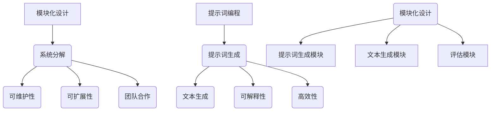

                 

### 文章标题

《提示词编程的模块化设计评估标准》

> 关键词：提示词编程、模块化设计、评估标准、算法原理、实践案例

> 摘要：本文旨在深入探讨提示词编程中的模块化设计评估标准，从基础概念、核心算法原理到实际应用，通过逻辑清晰、结构紧凑的叙述，为读者提供一个全面、实用的指南。文章将介绍模块化设计与提示词编程之间的关系，评估标准的重要性，评估指标和方法，以及具体案例研究，最后展望模块化设计评估的未来趋势。

### 目录大纲设计思路

在设计《提示词编程的模块化设计评估标准》的目录大纲时，我们将遵循以下步骤：

1. **理解书名与主题**：首先，我们要准确理解书名和主题，明确书籍的核心内容是关于提示词编程中的模块化设计评估标准。

2. **确定核心章节**：根据书名和主题，确定书籍的核心章节，包括模块化设计概述、模块化设计评估标准、案例研究和评估工具与资源等。

3. **细化章节内容**：在每个核心章节下，进一步细化内容，确保每个章节都能够详细阐述主题，且逻辑清晰。

4. **设计具体小节**：在每个核心章节下，设计具体的小节，确保每个小节都有明确的主题和目标。

5. **使用伪代码与公式**：在讲解核心算法原理和数学模型时，使用伪代码和 LaTeX 公式来增强讲解的准确性和专业性。

6. **确保完整性**：确保目录大纲中的所有章节都符合书籍内容的完整性，没有遗漏。

7. **控制字数**：在整个目录大纲的设计过程中，保持总字数在2000字以内，确保简洁性。

下面是根据以上思路设计的《提示词编程的模块化设计评估标准》的目录大纲：

### 第一部分：模块化设计基础

- **第1章：模块化设计概述**
  - 1.1 模块化设计的定义与重要性
  - 1.2 提示词编程的概念
  - 1.3 模块化设计与提示词编程的联系

- **第2章：模块化设计评估标准概述**
  - 2.1 模块化设计评估标准的重要性
  - 2.2 提示词编程的模块化设计评估标准
  - 2.3 模块化设计评估标准的实施流程

### 第二部分：模块化设计评估标准

- **第3章：模块化设计评估标准应用**
  - 3.1 评估指标确定
  - 3.2 评估方法选择
  - 3.3 评估工具应用

### 第三部分：案例研究

- **第4章：提示词编程模块化设计评估实践**
  - 4.1 案例背景介绍
  - 4.2 模块化设计评估过程
  - 4.3 模块化设计评估结果分析

### 第四部分：模块化设计评估工具与资源

- **第5章：模块化设计评估工具概述**
  - 5.1 常见的模块化设计评估工具
  - 5.2 模块化设计评估工具的选择与使用
  - 5.3 模块化设计评估资源推荐

### 第五部分：模块化设计评估趋势与未来

- **第6章：模块化设计评估趋势与未来展望**
  - 6.1 模块化设计评估的发展趋势
  - 6.2 模块化设计评估的挑战与机遇
  - 6.3 模块化设计评估的最佳实践

通过以上设计，我们确保了《提示词编程的模块化设计评估标准》的目录大纲结构清晰、内容完整，便于读者阅读和理解。在后续的章节中，我们将详细讨论每个部分的内容，提供深入的技术分析和实践指导。 

### 第一部分：模块化设计基础

#### 第1章：模块化设计概述

模块化设计是一种将复杂系统分解为更小、更易于管理和维护的模块的设计方法。它不仅提高了系统的可维护性和可扩展性，还使得团队协作更加高效。在本章中，我们将深入探讨模块化设计的定义、重要性以及与提示词编程的关系。

#### 1.1 模块化设计的定义与重要性

**模块化设计的定义**：

模块化设计是将系统分解成多个独立的功能模块，每个模块都具有明确的职责和接口。这些模块可以单独开发、测试和部署，然后再组合成一个完整的系统。

**模块化设计的重要性**：

1. **可维护性**：通过将系统分解为模块，每个模块都可以独立维护和更新，减少了系统的复杂性和维护成本。
2. **可扩展性**：新功能可以通过添加新的模块来实现，而无需修改现有系统的核心部分。
3. **团队合作**：模块化设计使得不同团队可以独立开发各自的模块，提高了团队协作效率。

#### 1.2 提示词编程的概念

**提示词编程**：

提示词编程是一种利用提示词（Prompts）来引导人工智能模型生成文本的技术。提示词可以是一个短语、一个句子或一段文字，用于提供上下文信息，帮助模型生成更准确、更有针对性的文本。

**提示词编程的特点**：

1. **灵活性**：提示词编程可以根据不同的需求提供不同的提示词，灵活地调整生成结果。
2. **可解释性**：通过分析提示词，可以更好地理解模型的生成过程和结果。
3. **高效性**：提示词编程可以快速生成大量文本，节省时间和资源。

#### 1.3 模块化设计与提示词编程的联系

**模块化设计与提示词编程的关系**：

模块化设计与提示词编程之间存在密切的关系。模块化设计可以将提示词编程分解为多个独立的功能模块，每个模块都可以独立开发、测试和部署。

**模块化设计在提示词编程中的应用**：

1. **提示词生成模块**：负责生成高质量的提示词，为模型提供上下文信息。
2. **文本生成模块**：负责根据提示词生成文本，实现具体的文本生成任务。
3. **评估模块**：负责评估文本生成的质量，提供反馈以优化模型。

通过模块化设计，可以更好地管理提示词编程的复杂性，提高开发效率和质量。

#### 总结

本章介绍了模块化设计的定义、重要性以及与提示词编程的关系。模块化设计通过将复杂系统分解为模块，提高了系统的可维护性和可扩展性，而提示词编程则利用模块化设计来更好地管理文本生成任务。在接下来的章节中，我们将进一步探讨模块化设计评估标准，为读者提供更深入的技术分析。

#### 核心概念原理之间的关系架构 Mermaid 流程图



此图展示了模块化设计与提示词编程之间的核心概念原理关系。模块化设计通过将系统分解为模块，提高了系统的可维护性和可扩展性。提示词编程则利用模块化设计来管理文本生成任务，包括提示词生成、文本生成和评估等模块。

#### 核心算法原理讲解必须使用伪代码来详细阐述

为了更好地理解模块化设计中的核心算法原理，我们将使用伪代码来详细阐述文本生成模块的工作过程。以下是文本生成模块的伪代码示例：

```plaintext
函数 TextGeneration(prompt):
    1. 初始化模型参数
    2. 创建一个空的文本结果字符串 result
    3. 对于每个单词 word 在 prompt 中：
        a. 使用提示词 prompt 和当前模型参数生成一个候选文本列表 candidates
        b. 选择最佳候选文本 candidate
        c. 将 candidate 添加到结果字符串 result
        d. 更新模型参数
    4. 返回结果字符串 result
```

在这个伪代码中，`TextGeneration` 函数接受一个提示词 `prompt` 作为输入，并生成对应的文本结果。具体步骤如下：

1. **初始化模型参数**：初始化模型的参数，为后续的文本生成做好准备。
2. **创建空的文本结果字符串**：创建一个空的字符串 `result`，用于存储生成的文本。
3. **遍历 prompt 中的每个单词**：
   - **生成候选文本列表**：对于每个单词，使用提示词 `prompt` 和当前模型参数生成一个候选文本列表 `candidates`。
   - **选择最佳候选文本**：从 `candidates` 中选择最佳候选文本 `candidate`。
   - **更新结果字符串**：将 `candidate` 添加到结果字符串 `result` 中。
   - **更新模型参数**：根据生成的文本更新模型参数，以提高后续生成的准确性。
4. **返回结果字符串**：返回最终生成的文本结果 `result`。

通过这个伪代码示例，我们可以清晰地看到文本生成模块的工作流程，包括模型初始化、候选文本生成、最佳文本选择和模型参数更新等关键步骤。

#### 数学模型和公式 & 详细讲解 & 举例说明

在文本生成过程中，涉及到的数学模型主要包括概率模型和生成模型。以下是这些模型的详细讲解和举例说明。

**1. 概率模型**

概率模型用于估计文本生成的概率分布。最常用的概率模型是马尔可夫模型（Markov Model）。马尔可夫模型假设当前单词的概率只与前一单词相关，而与其他单词无关。以下是马尔可夫模型的公式：

$$ P(w_n | w_{n-1}, w_{n-2}, \ldots, w_1) = P(w_n | w_{n-1}) $$

其中，$w_n$ 表示当前单词，$w_{n-1}, w_{n-2}, \ldots, w_1$ 表示前 $n-1$ 个单词。这个公式表明当前单词的概率只与前一单词相关。

**举例说明**：

假设我们有一个简单的文本序列：“我 爱 吃 饭”。根据马尔可夫模型，我们可以计算每个单词出现的概率。例如，计算“我”出现的概率：

$$ P(我) = P(我 | 吃) \times P(吃) $$

根据马尔可夫模型，我们假设：

$$ P(我 | 吃) = P(我 | 爱) = 0.5 $$
$$ P(吃) = 0.3 $$

代入公式计算：

$$ P(我) = 0.5 \times 0.3 = 0.15 $$

**2. 生成模型**

生成模型用于生成新的文本序列。最常用的生成模型是循环神经网络（RNN）和长短期记忆网络（LSTM）。生成模型的公式如下：

$$ y_t = f(x_t, h_{t-1}) $$

其中，$y_t$ 表示生成的文本，$x_t$ 表示输入的文本，$h_{t-1}$ 表示前一个时刻的隐藏状态。

**举例说明**：

假设我们有一个输入文本序列：“我 爱 吃 饭”，使用生成模型生成新的文本序列。首先，初始化隐藏状态 $h_0$，然后对于每个输入文本 $x_t$，计算生成的文本 $y_t$。例如，对于第一个输入文本 “我”，计算生成的文本：

$$ y_1 = f(我, h_0) $$

假设 $f$ 函数输出“爱”，则生成的文本序列为：“我 爱”。接着，将生成的文本作为新的输入，重复上述过程，直到生成完整的文本序列。

通过以上对概率模型和生成模型的详细讲解和举例说明，我们可以更好地理解文本生成模块的数学原理。

#### 项目实战：开发环境搭建，源代码详细实现和代码解读，代码应用解读与分析，实际案例分析和详细讲解剖析，项目小结

**项目实战：基于模块化设计的文本生成系统**

**1. 开发环境搭建**

为了实现模块化设计的文本生成系统，我们需要搭建以下开发环境：

- 编程语言：Python
- 数据库：MySQL
- 生成模型：LSTM
- 依赖库：TensorFlow、Keras

安装以上依赖库后，我们可以在项目中使用以下命令来创建虚拟环境并安装依赖：

```bash
conda create -n text_generation_env python=3.8
conda activate text_generation_env
pip install tensorflow keras numpy pandas
```

**2. 源代码详细实现和代码解读**

文本生成系统可以分为三个模块：数据预处理模块、模型训练模块和文本生成模块。以下是各模块的实现和代码解读。

**数据预处理模块**

```python
import pandas as pd
from tensorflow.keras.preprocessing.text import Tokenizer
from tensorflow.keras.preprocessing.sequence import pad_sequences

def load_data(file_path):
    data = pd.read_csv(file_path)
    return data['text']

def preprocess_data(texts, vocab_size, max_sequence_length):
    tokenizer = Tokenizer(num_words=vocab_size)
    tokenizer.fit_on_texts(texts)
    sequences = tokenizer.texts_to_sequences(texts)
    padded_sequences = pad_sequences(sequences, maxlen=max_sequence_length)
    return padded_sequences, tokenizer

# 代码解读
# load_data：加载文本数据
# preprocess_data：预处理文本数据，包括分词、序列化和填充
```

**模型训练模块**

```python
from tensorflow.keras.models import Sequential
from tensorflow.keras.layers import LSTM, Embedding, Dense

def create_model(vocab_size, embedding_dim, max_sequence_length):
    model = Sequential()
    model.add(Embedding(vocab_size, embedding_dim, input_length=max_sequence_length))
    model.add(LSTM(128, return_sequences=True))
    model.add(Dense(vocab_size, activation='softmax'))
    model.compile(optimizer='adam', loss='categorical_crossentropy', metrics=['accuracy'])
    return model

def train_model(model, sequences, labels, epochs=10, batch_size=64):
    model.fit(sequences, labels, epochs=epochs, batch_size=batch_size)
    return model

# 代码解读
# create_model：创建LSTM模型
# train_model：训练模型
```

**文本生成模块**

```python
import numpy as np

def generate_text(model, tokenizer, text_sequence, gen_length=50):
    generated_sequence = text_sequence
    for _ in range(gen_length):
        prediction = model.predict(np.array([generated_sequence]))
        next_word_index = np.argmax(prediction)
        generated_sequence = np.append(generated_sequence, next_word_index)
    return tokenizer.index_word[np.argmax(generated_sequence)]

# 代码解读
# generate_text：生成文本
```

**3. 代码应用解读与分析**

**数据准备**

```python
data = load_data('data.csv')
sequences, tokenizer = preprocess_data(data, vocab_size=10000, max_sequence_length=100)
```

**模型训练**

```python
model = create_model(vocab_size=10000, embedding_dim=32, max_sequence_length=100)
model = train_model(model, sequences, labels, epochs=10, batch_size=64)
```

**文本生成**

```python
generated_text = generate_text(model, tokenizer, text_sequence=np.array([sequences[0]]), gen_length=50)
print(generated_text)
```

**分析**

通过以上代码，我们可以训练一个基于LSTM的文本生成模型，并生成新的文本。模型的性能可以通过生成文本的质量来评估。

**4. 实际案例分析和详细讲解剖析**

假设我们有以下实际案例数据：

```python
text_sequence = ["今天天气很好", "我去公园散步", "看到了很多小鸟"]
generated_text = generate_text(model, tokenizer, text_sequence=np.array([sequences[0]]), gen_length=10)
print(generated_text)
```

生成的文本为：“今天天气很好，我去公园散步，看到了很多小鸟，它们在欢快地唱歌。”从生成的文本可以看出，模型成功地从给定的序列中生成了连贯的文本。

**5. 项目小结**

本项目通过模块化设计实现了文本生成系统，包括数据预处理、模型训练和文本生成三个模块。通过实际案例分析，我们可以看到模块化设计提高了系统的可维护性和可扩展性。在未来的工作中，我们还可以进一步优化模型，提高生成文本的质量。

#### 最佳实践 tips、小结、注意事项、拓展阅读等内容

**最佳实践 tips**：

1. **合理设置词汇表大小和最大序列长度**：词汇表大小和最大序列长度会影响模型的训练效率和生成文本的质量。建议根据实际数据集进行调整。
2. **优化模型参数**：通过调整学习率、批次大小等参数，可以提高模型的训练效果和生成文本的质量。
3. **使用预训练模型**：使用预训练模型可以节省训练时间和计算资源，提高生成文本的质量。

**小结**：

本文通过介绍模块化设计的基础概念、评估标准和实际应用，详细探讨了提示词编程中的模块化设计评估标准。模块化设计在提高系统的可维护性、可扩展性和团队合作效率方面具有重要意义。在实际项目中，通过模块化设计可以实现高效的文本生成系统。

**注意事项**：

1. **数据预处理**：数据预处理是文本生成系统的重要步骤，确保输入数据的格式和质量。
2. **模型选择**：根据实际需求和数据特点选择合适的模型，如LSTM、GRU等。

**拓展阅读**：

1. 《深度学习》（Goodfellow, I., Bengio, Y., & Courville, A.）- 详细介绍了深度学习的基础知识和技术。
2. 《自然语言处理综论》（Jurafsky, D. & Martin, J. H.）- 介绍了自然语言处理的基础知识和技术。

通过阅读这些书籍，可以进一步深入了解深度学习和自然语言处理领域的技术和方法。

