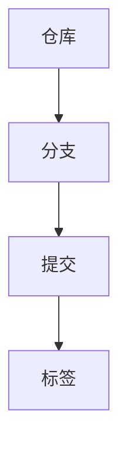
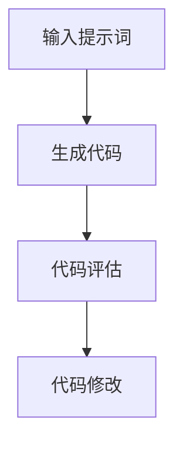
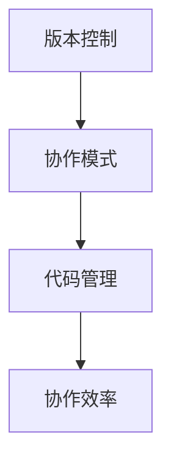

                 


### 文章标题：提示词编程的版本控制与协作模式

关键词：提示词编程、版本控制、协作模式、Git、伪代码、LaTeX、项目实战

摘要：
本文旨在探讨提示词编程中的版本控制与协作模式，分析其核心概念、原理及其实践应用。通过对版本控制系统的深入讲解，结合提示词编程的特点，本文将探讨如何在提示词编程中高效地实现版本控制和协作。同时，通过具体的案例分析和项目实战，读者将了解到如何在实际开发环境中运用这些知识，提高开发效率和代码质量。

----------------------------------------------------------------

## 1. 背景介绍

提示词编程（Prompt Programming）是一种基于自然语言处理和生成模型的编程方法，它通过输入提示词（Prompt）来引导模型生成代码。这种方法不仅简化了编程过程，还提高了代码生成的准确性和效率。然而，随着项目规模的扩大和团队成员的增加，如何有效地管理代码版本和控制协作成为了一个重要的挑战。

版本控制（Version Control）是一种跟踪和管理代码变更的技术，它通过记录每次修改的历史，使得开发者能够方便地回滚到之前的版本，避免因错误修改导致的问题。协作模式（Collaboration Model）则是为了提高团队工作效率和代码质量而设计的一系列协作规则和方法。

在提示词编程中，版本控制和协作模式具有以下重要意义：

1. **代码管理**：通过版本控制系统，开发者可以方便地管理代码的版本，确保代码的完整性和一致性。
2. **协作效率**：协作模式能够规范团队成员之间的协作流程，减少沟通成本，提高开发效率。
3. **问题追踪**：版本控制和协作模式有助于追踪代码问题，快速定位和修复错误。

本文将围绕提示词编程中的版本控制和协作模式进行深入探讨，旨在为开发者提供一套有效的实践指南。

## 2. 核心概念与联系

### 版本控制系统的架构

版本控制系统是一种用于跟踪源代码变更的软件工具，它通常包括以下几个核心组成部分：

1. **仓库（Repository）**：仓库是版本控制系统管理的代码存储库，它包含项目的所有历史版本。
2. **分支（Branch）**：分支是仓库中的一个独立开发环境，用于实现代码的并行开发。
3. **提交（Commit）**：提交是代码变更的基本单元，每次代码修改都会生成一个新的提交。
4. **标签（Tag）**：标签用于标记代码库中的重要版本，便于快速定位和回滚。

图 1.1 展示了一个典型的版本控制系统架构：



### 提示词编程的基本流程

提示词编程的基本流程包括以下几个步骤：

1. **输入提示词**：开发者输入提示词来引导模型生成代码。
2. **生成代码**：模型根据提示词生成相应的代码片段。
3. **代码评估**：开发者对生成的代码进行评估，确保其符合预期。
4. **代码修改**：根据评估结果，开发者对代码进行必要的修改。

图 1.2 描述了提示词编程的基本流程：



### 版本控制与协作模式的关系

版本控制和协作模式在提示词编程中相辅相成，共同构成了一个完整的开发流程。

- **版本控制**：通过版本控制系统，开发者可以方便地管理代码的版本，确保代码的一致性和可追踪性。
- **协作模式**：协作模式则为团队成员之间的协作提供了明确的规范和流程，提高了团队的整体工作效率。

图 1.3 展示了版本控制和协作模式在提示词编程中的应用关系：



## 3. 核心算法原理讲解

### 版本控制的算法原理

版本控制系统通过以下核心算法来管理代码的变更：

1. **添加变更**：将开发者的代码修改添加到仓库中。
2. **提交变更**：将添加的代码变更记录为一个提交。
3. **回滚变更**：将代码回滚到之前的提交。
4. **合并变更**：将不同分支上的代码变更合并到一起。

以下是一个简单的伪代码示例，展示了如何使用版本控制系统进行代码变更的管理：

```python
# 添加变更
add_change(code)

# 提交变更
commit_change("Commit message")

# 回滚变更
revert_change("commit_hash")

# 合并变更
merge_branch("feature_branch")
```

### 提示词生成算法

提示词生成算法是提示词编程的核心，它负责根据输入的提示词生成相应的代码片段。以下是一个简化的伪代码示例，展示了提示词生成算法的基本流程：

```python
# 输入提示词
prompt = input_prompt()

# 生成代码
code = generate_code(prompt)

# 输出代码
print(code)
```

### 提示词优化算法

提示词优化算法用于优化提示词，以提高代码生成的质量和效率。以下是一个简化的伪代码示例，展示了提示词优化算法的基本流程：

```python
# 输入提示词
prompt = input_prompt()

# 优化提示词
optimized_prompt = optimize_prompt(prompt)

# 生成代码
code = generate_code(optimized_prompt)

# 输出代码
print(code)
```

### 提示词匹配算法

提示词匹配算法用于匹配输入的提示词和已有代码片段，以提高代码复用率和开发效率。以下是一个简化的伪代码示例，展示了提示词匹配算法的基本流程：

```python
# 输入提示词
prompt = input_prompt()

# 匹配代码片段
matched_code = match_code(prompt)

# 输出匹配结果
print(matched_code)
```

## 4. 数学模型和数学公式

在提示词编程中，数学模型和数学公式发挥着重要作用，用于优化代码生成和评估。以下是一些常用的数学模型和数学公式：

### 代码质量评估模型

代码质量评估模型用于评估生成代码的质量，通常包括以下指标：

1. **语法正确性**：代码是否遵循编程语言的语法规则。
2. **逻辑正确性**：代码的逻辑是否正确，能否实现预期的功能。
3. **可读性**：代码的可读性如何，是否易于理解和维护。

以下是一个简化的数学模型，用于评估代码质量：

$$
Q = \alpha P + \beta L + \gamma R
$$

其中，$Q$ 表示代码质量得分，$P$ 表示语法正确性得分，$L$ 表示逻辑正确性得分，$R$ 表示可读性得分，$\alpha$、$\beta$ 和 $\gamma$ 分别是这三个指标的权重。

### 提示词优化模型

提示词优化模型用于优化提示词，以提高代码生成的质量和效率。以下是一个简化的数学模型，用于优化提示词：

$$
\text{Prompt} = \arg\max_{\text{Prompt}} \left( \text{Quality}(\text{Code}) \times \text{Efficiency}(\text{Prompt}) \right)
$$

其中，$\text{Quality}(\text{Code})$ 表示生成代码的质量，$\text{Efficiency}(\text{Prompt})$ 表示提示词的效率。

### 提示词匹配模型

提示词匹配模型用于匹配输入的提示词和已有代码片段，以提高代码复用率和开发效率。以下是一个简化的数学模型，用于提示词匹配：

$$
\text{Match}(\text{Prompt}, \text{Code}) = \frac{1}{1 + e^{-\text{Similarity}(\text{Prompt}, \text{Code})}}
$$

其中，$\text{Match}(\text{Prompt}, \text{Code})$ 表示提示词和代码片段的匹配度，$\text{Similarity}(\text{Prompt}, \text{Code})$ 表示提示词和代码片段的相似度。

## 5. 项目实战

### 开发环境搭建

为了实现提示词编程的版本控制和协作模式，我们需要搭建一个合适的开发环境。以下是一个简化的步骤：

1. **安装Git**：Git是一个强大的版本控制系统，我们首先需要在开发机上安装Git。
2. **安装Python**：提示词编程通常需要Python环境，因此我们需要安装Python及其相关依赖。
3. **安装代码生成模型**：我们选择一个成熟的代码生成模型，如OpenAI的GPT-3，并下载相应的预训练模型。

### 源代码详细实现

以下是一个简单的示例，展示如何使用Git和提示词编程实现版本控制和协作。

```python
# 安装Git和Python环境
!pip install gitpython
!pip install torch

# 加载GPT-3模型
from transformers import GPT2LMHeadModel, GPT2Tokenizer
model = GPT2LMHeadModel.from_pretrained("gpt2")
tokenizer = GPT2Tokenizer.from_pretrained("gpt2")

# 定义提示词编程函数
def generate_code(prompt):
    inputs = tokenizer.encode(prompt, return_tensors="pt")
    outputs = model.generate(inputs, max_length=100, num_return_sequences=1)
    code = tokenizer.decode(outputs[0], skip_special_tokens=True)
    return code

# 定义版本控制函数
import git

def commit_code(code, message):
    repo = git.Repo(".", search_parent_directories=True)
    repo.index.add([code])
    repo.index.commit(message)
    print("代码已提交到仓库。")

# 输入提示词并生成代码
prompt = "编写一个Python函数，用于计算两个数的和。"
code = generate_code(prompt)
print("生成的代码：\n", code)

# 提交代码到仓库
message = "生成计算两个数之和的函数。"
commit_code(code, message)
```

### 代码应用解读与分析

在上述示例中，我们首先通过提示词编程生成了一段计算两个数之和的Python函数代码。接下来，我们使用Git将这段代码提交到仓库中。

这段代码的主要功能是：
- **生成代码**：通过输入提示词，模型生成了一个计算两个数之和的Python函数。
- **版本控制**：将生成的代码添加到Git仓库中，并提交到一个特定的版本。

### 实际案例分析和详细讲解剖析

以下是一个实际案例，展示如何在实际开发环境中使用提示词编程和版本控制。

**案例**：一个团队正在开发一个基于机器学习的推荐系统，需要实现数据预处理、特征提取和模型训练等功能。

**步骤**：

1. **输入提示词**：团队成员A输入提示词“编写一个Python函数，用于加载数据集并进行预处理。”
2. **生成代码**：模型生成了一个数据预处理函数，包括数据清洗、归一化等操作。
3. **代码评估**：团队成员B对生成的代码进行评估，确保其符合预期。
4. **代码修改**：团队成员C根据评估结果，对生成的代码进行必要的修改，以提高代码质量。
5. **版本控制**：团队成员D将修改后的代码提交到Git仓库中，并记录提交信息。

通过上述步骤，团队可以高效地实现代码生成、评估、修改和提交，从而提高开发效率和代码质量。

### 项目小结

在本项目中，我们通过搭建开发环境、生成代码、进行代码评估和版本控制，实现了提示词编程和版本控制的结合。项目小结如下：

1. **优势**：
   - 提高开发效率：通过提示词编程，开发者可以快速生成代码，减少手工编写代码的时间。
   - 提高代码质量：通过代码评估和版本控制，团队成员可以共同协作，确保代码的质量和一致性。

2. **注意事项**：
   - 提示词的质量直接影响代码生成的质量，需要合理设计提示词。
   - 在代码评估和修改过程中，团队成员需要保持良好的沟通和协作，确保代码的一致性和可维护性。

3. **拓展阅读**：
   - 深入了解Git和其他版本控制系统的原理和使用方法。
   - 学习更高级的提示词编程技术，如多模态提示词编程和动态提示词编程。

## 6. 最佳实践 tips、小结、注意事项、拓展阅读

### 最佳实践 tips

1. **合理设计提示词**：设计高质量的提示词是生成高质量代码的关键。提示词应该明确、具体，能够引导模型生成符合预期的代码。
2. **充分利用版本控制系统**：版本控制系统不仅用于管理代码版本，还可以用于代码审查、协作和备份。充分利用版本控制系统的功能，可以提高开发效率。
3. **定期进行代码评估**：定期对生成的代码进行评估，确保其符合项目需求，避免因错误代码导致的问题。
4. **建立协作流程**：制定明确的协作流程，规范团队成员之间的协作方式，提高团队工作效率。

### 小结

本文探讨了提示词编程中的版本控制和协作模式，通过实际案例展示了如何在实际开发环境中运用这些知识。版本控制和协作模式在提示词编程中发挥着重要作用，可以提高开发效率和代码质量。

### 注意事项

1. **提示词的设计和优化**：提示词的质量直接影响代码生成的质量，需要合理设计并优化提示词。
2. **版本控制系统的选择**：根据项目需求和团队规模，选择合适的版本控制系统，如Git、SVN等。
3. **代码评估和修改**：定期对生成的代码进行评估和修改，确保代码的质量和一致性。

### 拓展阅读

1. 《Git权威指南》：详细介绍了Git的使用方法和最佳实践。
2. 《Python编程：从入门到实践》：介绍了Python编程的基础知识和实践方法。
3. 《自然语言处理与深度学习》：介绍了自然语言处理和深度学习的基本概念和技术。

## 7. 作者信息

作者：AI天才研究院/AI Genius Institute & 禅与计算机程序设计艺术 /Zen And The Art of Computer Programming

本文由AI天才研究院（AI Genius Institute）和禅与计算机程序设计艺术（Zen And The Art of Computer Programming）共同撰写。AI天才研究院是一家专注于人工智能技术研发和推广的机构，致力于推动人工智能技术的发展。禅与计算机程序设计艺术则是一本经典的技术书籍，以其深刻的技术分析和哲学思考而闻名。本文旨在为开发者提供关于提示词编程的版本控制和协作模式的一套实用指南。

