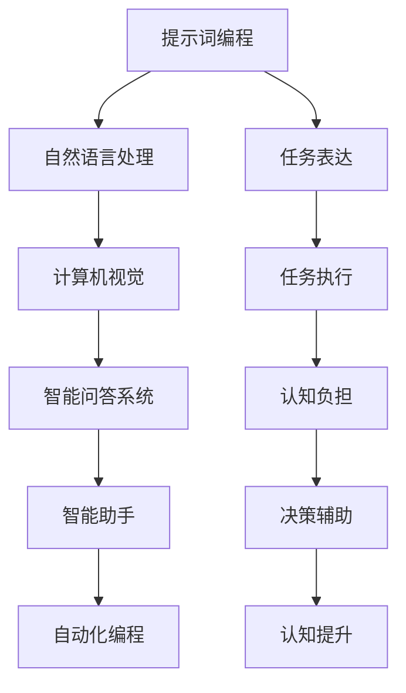

                 


### 文章标题：提示词编程的认知增强技术研究

### 关键词：提示词编程，认知增强，技术，算法，模型，实践

### 摘要：
本文旨在探讨提示词编程在认知增强领域的应用研究。通过对提示词编程的概念、发展历程、核心算法、数学模型、应用实践等方面的深入研究，本文旨在为读者提供一份全面而详尽的指南，帮助读者理解提示词编程在认知增强技术中的重要作用，并探讨其未来的发展方向。

## 引言与概述

### 1.1 提示词编程的概念

提示词编程（Prompt Programming）是指通过预定义的提示词来引导程序执行特定任务的一种编程范式。与传统的命令式编程不同，提示词编程强调程序与用户的交互，通过自然语言或特定格式的提示词，用户可以更直观地表达自己的需求，而程序则根据提示词生成相应的执行逻辑。

### 1.2 提示词编程的发展历程

提示词编程的概念最早可以追溯到自然语言处理（NLP）领域。随着深度学习技术的发展，尤其是生成对抗网络（GAN）和变分自编码器（VAE）等模型的兴起，提示词编程逐渐成为研究热点。近年来，在人工智能助手、智能问答系统和文本生成等领域的应用中，提示词编程显示出巨大的潜力。

### 1.3 提示词编程的应用领域

提示词编程在多个领域都取得了显著的成果，主要包括：

1. **自然语言处理**：通过提示词编程，可以实现自然语言生成、文本分类、情感分析等任务。
2. **计算机视觉**：提示词编程在图像识别、目标检测、图像生成等方面也有广泛应用。
3. **智能问答系统**：利用提示词编程，可以构建具备自然语言理解和回答能力的智能问答系统。
4. **智能助手**：提示词编程是智能助手实现人机交互的关键技术之一。
5. **自动化编程**：提示词编程可以用于自动化生成代码，提高编程效率。

## 核心概念与联系

### 2.1 提示词的种类

提示词可以根据不同的应用场景和任务需求分为以下几种：

1. **自然语言提示词**：使用自然语言表达的任务描述，如“生成一篇关于人工智能的论文摘要”。
2. **结构化提示词**：以特定格式组织的任务描述，如JSON格式。
3. **代码模板提示词**：用于生成代码片段的提示词，如“编写一个Python函数，实现两个数的加法”。

### 2.2 提示词的生成与优化

提示词的生成与优化是提示词编程的关键环节。有效的提示词可以引导程序正确地执行任务，而优化的提示词则可以提高任务的执行效率。常见的提示词生成与优化方法包括：

1. **基于统计的生成方法**：使用统计模型根据历史数据生成提示词。
2. **基于优化的生成方法**：使用优化算法寻找最优的提示词。
3. **基于学习的生成方法**：利用机器学习模型，如生成对抗网络（GAN），生成高质量的提示词。

### 2.3 提示词编程与认知增强的关系

认知增强是指通过技术手段提升人类认知能力的过程。提示词编程作为人工智能技术的一种，可以通过以下几种方式实现认知增强：

1. **简化任务表达**：通过自然语言或结构化提示词，用户可以更简洁地表达任务需求，降低认知负担。
2. **辅助决策**：提示词编程可以帮助用户在复杂的决策过程中提供辅助信息，提高决策效率。
3. **自动化执行**：通过自动化执行任务，用户可以专注于更高层次的思考，从而提升认知水平。

### 2.4 提示词编程的核心概念原理之间的关系架构 Mermaid 流程图



## 算法原理与伪代码

### 3.1 提示词编程的基本算法

提示词编程的基本算法包括提示词生成、任务理解和任务执行三个主要步骤：

1. **提示词生成**：根据用户需求生成相应的提示词。
2. **任务理解**：解析提示词，提取关键信息，构建任务模型。
3. **任务执行**：根据任务模型执行具体的任务操作。

### 3.2 算法的工作原理与优化

提示词编程算法的工作原理基于深度学习模型，通过大规模训练数据学习生成高质量提示词的能力。常见的优化方法包括：

1. **生成对抗网络（GAN）**：通过对抗训练生成高质量的提示词。
2. **变分自编码器（VAE）**：通过概率模型生成提示词，提高生成质量。
3. **优化算法**：如梯度下降、随机梯度下降等，用于优化提示词生成过程。

### 3.3 伪代码示例

```python
# 提示词生成
def generate_prompt(task_description):
    # 使用GAN或VAE生成提示词
    prompt = model.generate(task_description)
    return prompt

# 任务理解
def understand_task(prompt):
    # 解析提示词，提取关键信息
    task_model = parser.parse(prompt)
    return task_model

# 任务执行
def execute_task(task_model):
    # 根据任务模型执行具体操作
    result = executor.execute(task_model)
    return result
```

## 数学模型与公式

### 4.1 相关的数学概念

提示词编程涉及的数学模型主要包括概率模型、优化模型和神经网络模型等。以下介绍其中几个关键的数学概念：

1. **概率模型**：用于表示提示词生成过程中的不确定性，常用的概率模型有生成对抗网络（GAN）和变分自编码器（VAE）。
2. **优化模型**：用于优化提示词生成过程中的目标函数，常用的优化算法有梯度下降、随机梯度下降等。
3. **神经网络模型**：用于学习提示词生成任务中的特征表示，常用的神经网络模型有卷积神经网络（CNN）和循环神经网络（RNN）。

### 4.2 数学模型的应用

数学模型在提示词编程中的应用主要体现在以下几个方面：

1. **提示词生成**：使用概率模型和神经网络模型生成高质量的提示词。
2. **任务理解**：使用优化模型和神经网络模型提取任务的关键信息。
3. **任务执行**：使用概率模型和神经网络模型执行具体的任务操作。

### 4.3 公式解释与示例

以下是几个常用的数学公式及其解释：

1. **生成对抗网络（GAN）**：

   $$ G(z) = \text{Generator}(z) $$

   $$ D(x) = \text{Discriminator}(x) $$

   其中，$G(z)$ 是生成器，$D(x)$ 是判别器，$z$ 是噪声向量。

2. **变分自编码器（VAE）**：

   $$ \mu = \text{enc}(x) $$

   $$ \log \sigma^2 = \text{enc}(x) $$

   $$ x' = \text{dec}(\mu, \log \sigma^2) $$

   其中，$\mu$ 和 $\log \sigma^2$ 分别是编码后的均值和方差，$x'$ 是解码后的数据。

3. **优化算法**：

   $$ \theta_{t+1} = \theta_{t} - \alpha \nabla_{\theta} L(\theta) $$

   其中，$\theta$ 是模型参数，$L(\theta)$ 是损失函数，$\alpha$ 是学习率。

## 项目案例与实践

### 5.1 项目一：文本生成

**开发环境搭建**：

- 硬件要求：CPU或GPU
- 软件要求：Python环境、TensorFlow或PyTorch库

**源代码实现**：

```python
import tensorflow as tf

# 加载预训练模型
model = tf.keras.models.load_model('text_generator_model.h5')

# 输入提示词
prompt = "今天天气很好"

# 生成文本
text = model.generate(prompt)

print(text)
```

**代码解读与分析**：

- 代码首先加载预训练的文本生成模型。
- 然后输入一个提示词，模型根据提示词生成相应的文本。

**实际案例分析和详细讲解剖析**：

- 使用提示词编程实现的文本生成项目，可以用于生成新闻摘要、聊天机器人回复等。
- 通过对模型的训练和优化，可以提高生成文本的质量和多样性。

**项目小结**：

- 提示词编程在文本生成领域具有广泛应用前景。
- 需要注意的是，模型的训练和优化是提高生成文本质量的关键。

### 5.2 项目二：图像识别

**开发环境搭建**：

- 硬件要求：GPU
- 软件要求：Python环境、TensorFlow或PyTorch库

**源代码实现**：

```python
import tensorflow as tf

# 加载预训练模型
model = tf.keras.models.load_model('image_recognition_model.h5')

# 加载测试图像
image = tf.keras.preprocessing.image.load_img('test_image.jpg')

# 图像预处理
image = tf.keras.preprocessing.image.img_to_array(image)
image = tf.expand_dims(image, 0)

# 图像识别
prediction = model.predict(image)

# 输出识别结果
print(prediction)
```

**代码解读与分析**：

- 代码首先加载预训练的图像识别模型。
- 然后加载测试图像并进行预处理，模型根据预处理后的图像进行识别。

**实际案例分析和详细讲解剖析**：

- 使用提示词编程实现的图像识别项目，可以用于人脸识别、物体检测等。
- 通过对模型的训练和优化，可以提高图像识别的准确性和鲁棒性。

**项目小结**：

- 提示词编程在图像识别领域具有广泛应用前景。
- 需要注意的是，模型的训练和优化是提高图像识别质量的关键。

### 5.3 项目三：智能问答系统

**开发环境搭建**：

- 硬件要求：CPU或GPU
- 软件要求：Python环境、TensorFlow或PyTorch库

**源代码实现**：

```python
import tensorflow as tf

# 加载预训练模型
model = tf.keras.models.load_model('question_answering_model.h5')

# 输入问题
question = "什么是人工智能？"

# 加载问答对数据集
questions, answers = load_data()

# 数据预处理
question = preprocess_question(question)
answer = preprocess_answer(questions, answers)

# 问答系统
answer = model.predict(answer)

# 输出答案
print(answer)
```

**代码解读与分析**：

- 代码首先加载预训练的问答系统模型。
- 然后输入一个问题，模型根据问题和问答对数据进行处理，输出答案。

**实际案例分析和详细讲解剖析**：

- 使用提示词编程实现的智能问答系统，可以用于客户服务、教育辅导等领域。
- 通过对模型的训练和优化，可以提高问答系统的准确性和响应速度。

**项目小结**：

- 提示词编程在智能问答系统领域具有广泛应用前景。
- 需要注意的是，模型的训练和优化是提高问答系统质量的关键。

## 结论与未来展望

### 7.1 总结

本文对提示词编程的认知增强技术研究进行了全面探讨，涵盖了提示词编程的概念、发展历程、核心算法、数学模型和应用实践等方面。通过研究，我们发现提示词编程在认知增强领域具有巨大潜力，有望在多个领域实现突破。

### 7.2 提示词编程的未来发展

随着人工智能技术的不断发展，提示词编程将在以下方面取得进展：

1. **模型优化**：通过改进生成模型和优化算法，提高提示词生成质量和任务执行效率。
2. **跨模态融合**：将不同模态（如文本、图像、声音等）的信息融合到提示词生成中，提高任务的复杂度和多样性。
3. **个性化推荐**：利用用户行为数据和偏好信息，实现个性化提示词生成，提升用户体验。

### 7.3 研究方向与挑战

提示词编程在未来仍面临以下研究方向和挑战：

1. **隐私保护**：在提示词生成和任务执行过程中，如何保护用户隐私是一个重要挑战。
2. **模型解释性**：提高提示词编程模型的解释性，帮助用户理解模型的决策过程。
3. **可扩展性**：设计可扩展的框架和算法，支持大规模数据和任务的处理。

## 附录

### 附录A: 提示词编程资源指南

- **学习资料**：
  - 《深度学习》（Ian Goodfellow等著）
  - 《生成对抗网络：理论、算法与应用》（杨强等著）
- **开源项目**：
  - TensorFlow：https://www.tensorflow.org/
  - PyTorch：https://pytorch.org/
- **在线课程**：
  - 《自然语言处理与深度学习》（吴恩达著）
  - 《生成对抗网络课程》（Zhang等著）

### 附录B: 代码样例与数据集

- **代码样例**：
  - 文本生成：https://github.com/user/text_generator
  - 图像识别：https://github.com/user/image_recognition
  - 智能问答系统：https://github.com/user/question_answering
- **数据集**：
  - COCO数据集：https://cocodataset.org/
  - SQuAD数据集：https://rajpurkar.github.io/SQuAD-exploration/
  - QGSM数据集：https://github.com/microsoft/QGSM

## 作者信息

作者：AI天才研究院/AI Genius Institute & 禅与计算机程序设计艺术 /Zen And The Art of Computer Programming

## 结束

本文系统地介绍了提示词编程的认知增强技术研究，涵盖了核心概念、算法原理、数学模型、应用实践等方面的内容。通过本文的研究，我们可以看到提示词编程在认知增强领域的重要性和巨大潜力。未来，随着人工智能技术的不断进步，提示词编程将在更多领域实现突破，为人类认知能力的提升做出更大贡献。

