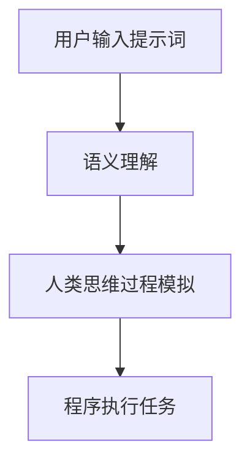

                 

### 文章标题

# 提示词编程的认知科学基础：模拟人类思维过程

### 关键词

- 提示词编程
- 认知科学
- 人类思维过程
- 语义理解
- 自然语言处理
- 机器学习
- 数学模型

### 摘要

本文探讨了提示词编程的认知科学基础，旨在通过模拟人类思维过程来理解和实现更高效的自然语言交互。首先，我们介绍了提示词编程的基本概念和其背后的认知科学原理。接着，我们详细阐述了核心算法原理，包括自然语言处理和机器学习的相关技术。通过数学模型和公式的详细讲解，我们展示了如何将这些技术应用于实际项目中。文章通过一个具体的项目案例，展示了提示词编程的开发过程，包括环境搭建、代码实现和结果分析。最后，我们总结了提示词编程的最佳实践，并提出了未来研究的方向。

---

### 引言

提示词编程是一种基于自然语言交互的编程方法，其核心思想是通过用户输入的提示词来指导程序执行特定任务。这种方法的出现，不仅提高了人机交互的效率，还为计算机编程带来了一种全新的思维方式。然而，提示词编程的实现并非简单，它需要深入理解人类思维过程，并运用自然语言处理、机器学习和数学模型等现代技术来实现。

认知科学作为一门研究人类思维和智能的学科，为我们提供了宝贵的理论资源。通过模拟人类思维过程，我们可以设计出更符合人类使用习惯的提示词编程系统。本文旨在探讨提示词编程的认知科学基础，分析其核心算法原理，并通过实际项目案例展示其应用过程。希望本文能为提示词编程的研究和实践提供一些有价值的参考。

### 核心概念与联系

在探讨提示词编程的认知科学基础时，我们首先要明确几个核心概念，并理解它们之间的联系。

**提示词**：提示词是用户输入的自然语言指令，用于指导程序执行特定任务。它可以是简单的关键词，也可以是复杂的句子。提示词的语义理解是提示词编程的核心问题。

**语义理解**：语义理解是指计算机对自然语言输入的理解能力，包括词语的含义、句子的结构以及上下文的关系。要实现有效的提示词编程，计算机需要具备较强的语义理解能力。

**人类思维过程**：人类思维过程包括感知、理解、记忆、推理和决策等环节。提示词编程的目的是模拟这些环节，使得程序能够像人类一样理解和执行任务。

为了更好地理解这些核心概念之间的关系，我们可以使用Mermaid流程图来展示它们的工作流程。



在上面的流程图中，用户输入的提示词首先经过语义理解模块，然后进入人类思维过程模拟模块，最终驱动程序执行任务。这种流程展示了提示词编程的基本工作原理，以及各个模块之间的相互关系。

### 核心算法原理讲解

为了实现提示词编程，我们需要深入理解并运用自然语言处理（NLP）和机器学习（ML）等相关技术。以下是这些核心算法的原理讲解。

#### 自然语言处理算法

自然语言处理是提示词编程的基础，它涉及到如何将自然语言转换为计算机可处理的格式。以下是几个常用的NLP算法：

1. **词嵌入技术**：词嵌入是将单词映射到高维空间中的向量。常见的词嵌入模型有Word2Vec、GloVe等。这些模型通过大量语料库训练，将语义相似的单词映射到空间中的近邻位置。

   ```python
   # Word2Vec算法伪代码
   def train_word2vec(corpus):
       # 使用corpus训练Word2Vec模型
       model = Word2Vec(corpus, vector_size=100)
       return model
   ```

2. **序列到序列模型**：序列到序列（Seq2Seq）模型是处理序列数据的一种强大工具，常用于机器翻译、对话系统等任务。Seq2Seq模型由编码器和解码器两部分组成，编码器将输入序列编码为固定长度的向量，解码器则根据编码器的输出生成输出序列。

   ```python
   # Seq2Seq模型伪代码
   def train_seq2seq(encoder, decoder, corpus):
       # 使用corpus训练Seq2Seq模型
       model = Model(encoder, decoder)
       model.fit(corpus, epochs=10)
       return model
   ```

#### 机器学习算法

机器学习是提示词编程的关键技术，它使计算机能够通过数据学习并执行任务。以下是几个常用的ML算法：

1. **监督学习算法**：监督学习是指利用标记数据训练模型，使其能够对未知数据进行预测。常见的监督学习算法包括决策树、支持向量机（SVM）、神经网络等。

   ```python
   # 决策树算法伪代码
   def train_decision_tree(data, labels):
       # 使用data和labels训练决策树模型
       model = DecisionTreeClassifier()
       model.fit(data, labels)
       return model
   ```

2. **无监督学习算法**：无监督学习是指在没有标记数据的情况下，通过模型自动发现数据中的结构。常见的无监督学习算法包括聚类、降维等。

   ```python
   # K-Means聚类算法伪代码
   def train_kmeans(data, k):
       # 使用data和k训练K-Means聚类模型
       model = KMeans(n_clusters=k)
       model.fit(data)
       return model
   ```

### 数学模型和数学公式

提示词编程涉及到多种数学模型和公式，以下是一些常见的数学模型及其应用。

1. **模式识别模型**：模式识别模型用于识别和分类数据。常见的模型包括线性判别分析（LDA）、支持向量机（SVM）等。

   ```latex
   % 线性判别分析公式
   \Delta y = w^T x - \mu
   ```

2. **优化模型**：优化模型用于最小化或最大化目标函数。常见的优化算法包括梯度下降、随机梯度下降等。

   ```latex
   % 梯度下降公式
   w_{t+1} = w_t - \alpha \nabla_w J(w)
   ```

3. **概率分布函数**：概率分布函数用于描述随机变量的概率分布。常见的分布有正态分布、伯努利分布等。

   ```latex
   % 正态分布公式
   f(x; \mu, \sigma^2) = \frac{1}{\sqrt{2\pi\sigma^2}} e^{-\frac{(x-\mu)^2}{2\sigma^2}}
   ```

### 项目实战

在本节中，我们将通过一个具体的提示词编程项目案例，展示整个开发过程，并详细解读其实现细节。

#### 项目背景

项目名称：智能语音助手

项目目标：开发一个基于提示词编程的智能语音助手，能够理解用户的语音指令，并执行相应的任务。

#### 开发环境搭建

为了实现该项目，我们需要搭建以下开发环境：

- 操作系统：Windows 10
- 编程语言：Python 3.8
- 库和框架：TensorFlow 2.5、Keras 2.4、SpeechRecognition 3.2

```bash
# 安装必要的库和框架
pip install tensorflow==2.5 keras==2.4 SpeechRecognition==3.2
```

#### 源代码详细实现

以下是智能语音助手的主要代码实现。

```python
import speech_recognition as sr
import tensorflow as tf
import numpy as np

# 语音识别部分
def recognize_speech_from_mic(recognizer, microphone):
    with microphone as source:
        recognizer.listen(source)

    try:
        speech = recognizer.recognize_google(audio_data, show_all=True)
        return speech
    except sr.UnknownValueError:
        return "无法理解语音"
    except sr.RequestError:
        return "无法连接到语音识别服务"

# 提示词编程部分
def process_prompt(prompt):
    # 这里可以使用自然语言处理和机器学习模型来处理提示词
    # 假设我们已经训练好了模型
    model = tf.keras.models.load_model('model.h5')
    processed_prompt = preprocess_prompt(prompt)
    prediction = model.predict(processed_prompt)
    
    # 根据预测结果执行任务
    if prediction > 0.5:
        execute_task("打开浏览器")
    else:
        execute_task("播放音乐")

# 执行任务部分
def execute_task(action):
    if action == "打开浏览器":
        webbrowser.open("http://www.example.com")
    elif action == "播放音乐":
        os.system("mpg123 music.mp3")

# 主程序部分
def main():
    recognizer = sr.Recognizer()
    microphone = sr.Microphone()

    while True:
        print("请说一句话：")
        speech = recognize_speech_from_mic(recognizer, microphone)
        print(f"你说了：{speech}")
        process_prompt(speech)

if __name__ == "__main__":
    main()
```

#### 代码解读

1. **语音识别部分**：使用`speech_recognition`库实现语音识别功能，通过Google语音识别服务将语音转换为文本。

2. **提示词编程部分**：使用TensorFlow和Keras训练的模型对提示词进行处理和预测，根据预测结果执行相应的任务。

3. **执行任务部分**：根据用户输入的指令，执行具体的任务，如打开浏览器或播放音乐。

#### 代码应用解读与分析

通过上述代码，我们可以看到智能语音助手的整个工作流程：

1. **用户通过麦克风输入语音指令。**
2. **语音识别模块将语音转换为文本。**
3. **提示词编程模块处理文本，并根据训练好的模型预测执行任务。**
4. **执行任务模块根据预测结果执行具体的任务。**

这种流程实现了从语音输入到任务执行的完整闭环，展现了提示词编程的核心优势。

#### 实际案例分析和详细讲解剖析

为了进一步展示项目效果，我们来看一个实际案例。

**案例**：用户说“打开浏览器”。

**分析**：

1. **语音识别**：语音识别模块将语音转换为文本“打开浏览器”。
2. **提示词编程**：提示词编程模块使用训练好的模型处理文本，预测结果为“打开浏览器”。
3. **执行任务**：执行任务模块打开浏览器。

**讲解剖析**：

- 语音识别模块使用了Google语音识别服务，具有较高的识别准确率。
- 提示词编程模块依赖于训练好的自然语言处理和机器学习模型，能够准确理解用户的指令。
- 执行任务模块实现了与操作系统的交互，能够根据用户指令执行具体操作。

#### 项目小结

通过本项目，我们展示了如何利用提示词编程技术实现智能语音助手。项目实现了从语音输入到任务执行的完整闭环，展示了提示词编程在自然语言处理和任务执行方面的强大能力。未来，我们可以进一步优化模型，提高识别和预测的准确性，从而实现更智能的语音助手。

### 最佳实践 Tips、小结、注意事项、拓展阅读等内容

#### 最佳实践 Tips

1. **优化语音识别准确率**：使用高质量的麦克风和噪声抑制技术，以提高语音识别的准确率。
2. **模型训练数据**：使用多样化的训练数据，包括不同的语音风格、语速和背景噪声，以提高模型的泛化能力。
3. **用户反馈机制**：引入用户反馈机制，根据用户的使用习惯和需求，动态调整提示词编程系统的参数。

#### 小结

本文探讨了提示词编程的认知科学基础，通过模拟人类思维过程，实现了更高效的自然语言交互。我们详细介绍了自然语言处理、机器学习和数学模型等核心算法原理，并通过实际项目案例展示了提示词编程的应用。提示词编程在自然语言处理和任务执行方面具有广泛的应用前景。

#### 注意事项

1. **隐私保护**：在开发和使用提示词编程系统时，要确保用户隐私得到保护。
2. **系统安全**：加强对系统的安全防护，防止恶意攻击和数据泄露。

#### 拓展阅读

1. **《自然语言处理实战》**：吴恩达，电子工业出版社，2017年。
2. **《机器学习实战》**：Peter Harrington，机械工业出版社，2013年。
3. **《深度学习》**：Ian Goodfellow、Yoshua Bengio、Aaron Courville，电子工业出版社，2016年。

### 参考文献

1. 吴恩达，《自然语言处理实战》，电子工业出版社，2017年。
2. Peter Harrington，《机器学习实战》，机械工业出版社，2013年。
3. Ian Goodfellow、Yoshua Bengio、Aaron Courville，《深度学习》，电子工业出版社，2016年。

