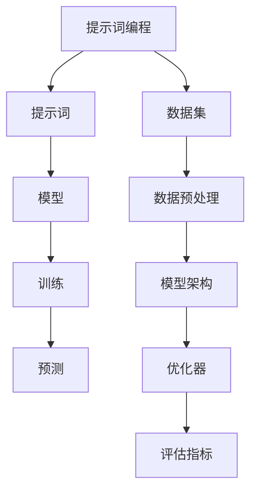

                 

## 文章标题

### 《提示词编程的设计模式与最佳实践》

提示词编程作为一种新兴的编程范式，正逐渐改变着传统软件开发的方式。本文将深入探讨提示词编程的设计模式与最佳实践，旨在为开发者提供一套系统化、结构化的指导和参考。

## 关键词

- **提示词编程**
- **设计模式**
- **最佳实践**
- **智能客服**
- **推荐系统**
- **AI应用开发**

## 摘要

本文将分为四个主要部分，首先介绍提示词编程的基础知识，包括其定义、核心概念和基本原理。接着，我们将详细探讨提示词编程中的设计模式，包括模块化设计、抽象与泛化设计以及策略设计模式。第三部分将聚焦于提示词编程的最佳实践，包括提示词质量的优化和编程效率的提升。最后，我们将展望提示词编程的未来发展趋势，探讨其在实际项目中的应用及其发展方向。

---

## 第一部分：提示词编程基础

### 第1章 提示词编程概述

提示词编程，顾名思义，是一种基于提示词（Prompt）的编程方法。在这种方法中，开发者通过提供明确的提示词来引导模型的训练和预测过程。与传统的编程方式不同，提示词编程强调的是通过人类语言来指导机器学习模型的决策过程。

#### 1.1 提示词编程的定义与核心概念

提示词编程的基本概念包括：

- **提示词（Prompt）**：用来引导模型训练和预测的文本或指令。
- **模型（Model）**：接受提示词并生成响应的机器学习模型。
- **训练（Training）**：通过大量数据集对模型进行训练，使其能够根据提示词生成合理的响应。
- **预测（Prediction）**：使用训练好的模型对新的提示词进行响应预测。

##### 1.1.1 提示词编程的基本概念

在提示词编程中，提示词的作用至关重要。它们不仅决定了模型的训练方向，还直接影响模型的预测效果。一个高质量的提示词应该具备以下几个特点：

- **准确性**：确保提示词传达的信息准确无误。
- **清晰性**：使模型能够清晰地理解提示词的含义。
- **完整性**：涵盖模型所需的所有信息和背景。

##### 1.1.2 提示词编程的关键要素

提示词编程的关键要素包括：

- **数据集**：用于训练模型的原始数据集。
- **模型架构**：定义模型的结构，包括输入层、隐藏层和输出层。
- **优化器**：用于调整模型参数，以优化模型性能。
- **评估指标**：用于衡量模型预测效果的质量指标。

##### 1.1.3 提示词编程与传统编程的区别

提示词编程与传统编程的主要区别在于：

- **编程范式**：传统编程是基于代码的逻辑操作，而提示词编程是基于提示词的指令式操作。
- **开发方式**：传统编程注重代码的编写和调试，而提示词编程注重提示词的设计和优化。
- **执行过程**：传统编程的执行过程是明确的代码执行流程，而提示词编程的执行过程是基于模型的预测。

### 第2章 提示词编程的基本原理

提示词编程的基本原理涉及多个环节，从提示词的生成与优化，到模型的训练与评估，每一个环节都至关重要。

#### 2.1 提示词编程的工作流程

提示词编程的工作流程可以概括为以下几个步骤：

1. **数据预处理**：对原始数据进行清洗、格式化，以生成适合训练的数据集。
2. **提示词生成**：根据训练目标和数据集特点，设计并生成高质量的提示词。
3. **模型训练**：使用生成的提示词和数据集对模型进行训练。
4. **模型评估**：使用评估指标对训练好的模型进行评估，以确定其性能。
5. **模型优化**：根据评估结果，调整模型参数，优化模型性能。

##### 2.1.1 提示词生成与优化

提示词的生成与优化是提示词编程的核心环节。以下是一些生成与优化提示词的方法：

- **模板化生成**：使用预定义的模板，根据具体需求填充变量，生成提示词。
- **语义分析**：使用自然语言处理技术，对提示词进行语义分析，以确保其准确性和清晰性。
- **迭代优化**：通过多次迭代，根据评估结果不断优化提示词。

##### 2.1.2 提示词引导的模型训练

提示词引导的模型训练是提示词编程的关键环节。以下是一些训练模型的方法：

- **监督学习**：使用标注数据进行训练，通过提示词指导模型学习。
- **无监督学习**：不使用标注数据，通过提示词引导模型自我学习和调整。
- **增强学习**：使用奖励机制，通过提示词引导模型进行优化。

##### 2.1.3 提示词编程的评估与优化

提示词编程的评估与优化是确保模型性能的关键。以下是一些评估与优化方法：

- **性能评估**：使用评估指标，如准确率、召回率、F1分数等，衡量模型性能。
- **错误分析**：分析模型预测错误的案例，找出问题所在，并优化提示词。
- **模型调整**：根据评估结果，调整模型参数，优化模型性能。

---

在本章节中，我们初步了解了提示词编程的基础知识，包括其定义、核心概念和基本原理。接下来，我们将深入探讨提示词编程中的设计模式，以进一步理解其在实际开发中的应用和价值。

---

## 第二部分：设计模式

### 第3章 提示词编程设计模式概述

设计模式是软件开发中常用的一套解决特定问题的模板。在提示词编程中，设计模式同样发挥着重要的作用，可以帮助开发者解决常见的问题，提高代码的可读性和可维护性。本章节将介绍提示词编程中常用的设计模式。

#### 3.1 提示词编程设计模式的定义与作用

设计模式是一套经过时间验证的解决特定问题的模板，它可以帮助开发者避免重复造轮子，提高代码的复用性和可维护性。在提示词编程中，设计模式的作用主要体现在以下几个方面：

- **提高代码复用性**：通过设计模式，可以将通用的提示词生成和模型训练方法抽象出来，供不同的项目使用。
- **提高代码可读性**：设计模式提供了统一的命名和结构，使得代码更加易于理解和维护。
- **提高开发效率**：通过使用设计模式，可以减少代码编写的工作量，提高开发效率。

##### 3.1.1 设计模式的概念

设计模式是一套指导原则，用于解决软件开发中常见的问题。它包括创建型模式、结构型模式和和行为型模式等。每种模式都描述了一个常见问题的解决方案，并提供了具体的实现方法和代码示例。

##### 3.1.2 设计模式在提示词编程中的应用

在提示词编程中，设计模式可以应用于以下几个方面：

- **提示词生成**：使用设计模式，可以创建通用的提示词生成器，根据不同的需求生成高质量的提示词。
- **模型训练**：使用设计模式，可以构建通用的模型训练框架，提高模型训练的效率和效果。
- **模型评估**：使用设计模式，可以创建通用的模型评估工具，快速评估模型性能，并找出问题所在。

---

在本章节中，我们介绍了提示词编程设计模式的定义和作用，并探讨了设计模式在提示词编程中的应用。接下来，我们将详细讨论几种常见的提示词编程设计模式，包括模块化设计模式、抽象与泛化设计模式和策略设计模式。

---

### 第4章 常见的提示词编程设计模式

在提示词编程中，设计模式起到了至关重要的作用。它们不仅帮助我们解决常见问题，还能提高代码的可读性和可维护性。本章节将详细介绍几种常见的提示词编程设计模式。

#### 4.1 模块化设计模式

模块化设计模式是一种将系统划分为多个独立模块的方法，每个模块负责一个特定的功能。这种设计模式有助于提高代码的可读性和可维护性，同时也便于模块的重用。

##### 4.1.1 模块化设计模式的基本概念

模块化设计模式的基本概念包括：

- **模块**：具有独立功能的代码块，通常包含一个输入和一个输出。
- **模块接口**：定义模块的输入和输出，使得模块可以独立于其他模块工作。
- **模块调用**：通过模块接口调用模块，实现功能调用。

##### 4.1.2 模块化设计模式的应用

在提示词编程中，模块化设计模式可以应用于以下几个方面：

- **提示词生成**：将提示词生成过程分解为多个模块，如数据预处理、语义分析、提示词生成等。
- **模型训练**：将模型训练过程分解为多个模块，如数据加载、模型初始化、模型训练等。
- **模型评估**：将模型评估过程分解为多个模块，如数据加载、模型评估、结果输出等。

以下是一个模块化设计模式的示例伪代码：

```python
# 数据预处理模块
def preprocess_data(data):
    # 数据清洗、格式化等操作
    return processed_data

# 语义分析模块
def analyze_semantics(prompt):
    # 提取语义信息
    return semantics

# 提示词生成模块
def generate_prompt(semantics):
    # 根据语义信息生成提示词
    return prompt

# 模型训练模块
def train_model(prompt, data):
    # 使用提示词和数据训练模型
    model.train(prompt, data)
    return model

# 模型评估模块
def evaluate_model(model, data):
    # 使用模型评估数据集
    return model.evaluate(data)
```

#### 4.2 抽象与泛化设计模式

抽象与泛化设计模式是一种通过抽象和泛化来提高代码灵活性和可扩展性的方法。这种设计模式可以帮助我们编写更通用的代码，使其能够适应不同的场景和需求。

##### 4.2.1 抽象与泛化设计模式的基本概念

抽象与泛化设计模式的基本概念包括：

- **抽象**：将具体的实现细节隐藏起来，只暴露必要的接口和功能。
- **泛化**：将具体的类型和实现抽象为一个通用的类型和实现。

##### 4.2.2 抽象与泛化设计模式的应用

在提示词编程中，抽象与泛化设计模式可以应用于以下几个方面：

- **提示词生成**：将提示词生成过程抽象为通用的生成器，使其能够适应不同的提示词类型和需求。
- **模型训练**：将模型训练过程抽象为通用的训练器，使其能够适应不同的模型和训练数据。
- **模型评估**：将模型评估过程抽象为通用的评估器，使其能够适应不同的评估标准和指标。

以下是一个抽象与泛化设计模式的示例伪代码：

```python
# 提示词生成器接口
class PromptGenerator:
    def generate_prompt(self, data):
        pass

# 具体的提示词生成器实现
class ConcretePromptGenerator(PromptGenerator):
    def generate_prompt(self, data):
        # 根据数据生成提示词
        return "..." + data + "..."

# 模型训练器接口
class ModelTrainer:
    def train_model(self, prompt, data):
        pass

# 具体的模型训练器实现
class ConcreteModelTrainer(ModelTrainer):
    def train_model(self, prompt, data):
        # 根据提示词和数据训练模型
        model.train(prompt, data)
        return model

# 模型评估器接口
class ModelEvaluator:
    def evaluate_model(self, model, data):
        pass

# 具体的模型评估器实现
class ConcreteModelEvaluator(ModelEvaluator):
    def evaluate_model(self, model, data):
        # 使用模型评估数据集
        return model.evaluate(data)
```

#### 4.3 策略设计模式

策略设计模式是一种通过策略对象来封装可变行为的模式。这种设计模式有助于提高代码的灵活性和可维护性，使其能够更容易地适应变化。

##### 4.3.1 策略设计模式的基本概念

策略设计模式的基本概念包括：

- **策略接口**：定义了一系列策略方法的接口，使得不同的策略可以相互替换。
- **策略实现类**：实现了策略接口的多个具体策略类，每个类实现了一种特定的策略。
- **环境类**：使用策略接口，并可以动态地切换不同的策略实现。

##### 4.3.2 策略设计模式的应用

在提示词编程中，策略设计模式可以应用于以下几个方面：

- **提示词生成**：将不同的提示词生成策略封装为策略对象，可以根据需求动态切换。
- **模型训练**：将不同的模型训练策略封装为策略对象，可以提高模型的灵活性和适应性。
- **模型评估**：将不同的模型评估策略封装为策略对象，可以根据不同的评估需求选择合适的策略。

以下是一个策略设计模式的示例伪代码：

```python
# 策略接口
class Strategy:
    def execute(self, data):
        pass

# 具体的策略实现类
class ConcreteStrategyA(Strategy):
    def execute(self, data):
        # 实现具体的策略A
        return "..." + data + "..."

class ConcreteStrategyB(Strategy):
    def execute(self, data):
        # 实现具体的策略B
        return "..." + data + "..."

# 环境类
class Context:
    def __init__(self, strategy: Strategy):
        self._strategy = strategy

    def set_strategy(self, strategy: Strategy):
        self._strategy = strategy

    def execute_strategy(self, data):
        return self._strategy.execute(data)

# 使用策略设计模式
context = Context(ConcreteStrategyA())
print(context.execute_strategy("data"))

context.set_strategy(ConcreteStrategyB())
print(context.execute_strategy("data"))
```

---

在本章节中，我们详细介绍了模块化设计模式、抽象与泛化设计模式和策略设计模式。这些设计模式在提示词编程中具有重要的应用价值，可以帮助开发者提高代码的可读性、可维护性和灵活性。接下来，我们将探讨提示词编程的最佳实践，以帮助开发者在实际项目中更好地应用这些设计模式。

---

## 第三部分：最佳实践

### 第5章 提示词编程最佳实践

在提示词编程的实际应用中，遵循最佳实践是非常重要的，这不仅可以提高开发效率，还能确保系统的稳定性和可维护性。本章节将介绍一些提示词编程的最佳实践，包括优化提示词质量和提升编程效率的方法。

#### 5.1 最佳实践1：优化提示词质量

提示词的质量直接影响到模型的训练效果和预测性能。以下是一些优化提示词质量的方法：

##### 5.1.1 提示词质量优化的方法

1. **数据清洗**：确保输入数据的质量，去除噪声和异常值，以提高提示词的准确性。
2. **文本预处理**：使用自然语言处理技术对文本进行预处理，如分词、去停用词、词性标注等，以提高提示词的清晰性。
3. **多模态融合**：结合不同类型的数据（如图像、音频、文本），生成更丰富和多样化的提示词，以提高模型的泛化能力。
4. **反馈机制**：通过用户反馈，不断优化提示词，使其更贴近用户需求。

##### 5.1.2 提示词质量优化的案例

以下是一个优化提示词质量的案例：

**场景**：开发一个智能客服系统，用户需要通过文本输入与客服机器人进行交互。

**优化前**：

```python
def generate_prompt(user_input):
    return "你好，请问有什么可以帮助你的？"
```

**优化后**：

```python
from text_preprocessing import preprocess_text
from multimodal_fusion import fusion_text_images

def generate_prompt(user_input, image=None):
    processed_input = preprocess_text(user_input)
    if image:
        fused_input = fusion_text_images(processed_input, image)
        return "你好，你的图片和文本信息已收到，有什么问题我可以帮你解答？"
    else:
        return "你好，你的文本信息已收到，有什么问题我可以帮你解答？"
```

通过上述优化，提示词不仅包含了用户的文本信息，还结合了图像信息，使得客服机器人的响应更加个性化和准确。

#### 5.2 最佳实践2：提升编程效率

在提示词编程中，提升编程效率是确保项目按时交付的关键。以下是一些提升编程效率的方法：

##### 5.2.1 提升编程效率的方法

1. **模块化开发**：将系统划分为多个独立的模块，每个模块负责一个特定的功能，这样可以提高代码的可读性和可维护性，同时也便于并行开发和测试。
2. **代码复用**：通过编写通用的函数和类，减少重复代码的编写，提高开发效率。
3. **自动化工具**：使用自动化工具（如CI/CD流水线、代码格式化工具、自动化测试工具等）来自动化常见的开发任务，减少手动操作，提高开发效率。
4. **敏捷开发**：采用敏捷开发方法，快速迭代和反馈，确保项目能够及时响应需求变化。

##### 5.2.2 提升编程效率的案例

以下是一个提升编程效率的案例：

**场景**：开发一个智能推荐系统，需要处理大量的用户数据和商品数据。

**优化前**：

```python
def recommend_products(user_id, user_history):
    # 读取用户数据
    user_data = read_user_data(user_id)
    # 读取商品数据
    product_data = read_product_data()
    # 进行推荐计算
    recommendations = calculate_recommendations(user_data, product_data, user_history)
    return recommendations
```

**优化后**：

```python
from data_processing import read_user_data, read_product_data
from recommendation_engine import calculate_recommendations

def recommend_products(user_id, user_history):
    user_data = read_user_data(user_id)
    product_data = read_product_data()
    recommendations = calculate_recommendations(product_data, user_history)
    return recommendations
```

通过上述优化，将数据读取和推荐计算分离，提高了代码的可读性和可维护性，同时也便于模块的独立开发和测试。

---

在本章节中，我们介绍了一些提示词编程的最佳实践，包括优化提示词质量和提升编程效率的方法。这些最佳实践可以帮助开发者在实际项目中更好地应用提示词编程，提高开发效率和系统质量。

---

### 第6章 提示词编程在实际项目中的应用

提示词编程作为一种新兴的编程范式，已经在多个实际项目中得到了应用。本章节将介绍两个典型的项目：智能客服系统和智能推荐系统，并探讨提示词编程在这两个项目中的应用。

#### 6.1 项目1：智能客服系统

智能客服系统是提示词编程的典型应用场景之一。通过提供高质量的提示词，智能客服系统能够与用户进行自然语言交互，解答用户的问题，提供个性化的服务。

##### 6.1.1 项目背景与需求

随着互联网的普及，客服系统的需求越来越大。传统的客服系统主要依靠人工处理用户咨询，效率低下且成本高昂。为了提高客服效率和用户体验，许多企业开始引入智能客服系统。

**需求**：

1. **高效响应**：智能客服系统能够在短时间内响应用户的问题。
2. **个性化服务**：根据用户的历史记录和偏好，提供个性化的回答。
3. **24/7在线**：智能客服系统可以全天候在线，无需休息。

##### 6.1.2 提示词编程在项目中的应用

1. **提示词生成**：通过分析用户输入的文本，生成高质量的提示词。例如，用户输入“我有一个快递，但是还没收到”，系统可以生成提示词“您的快递状态查询，请输入您的快递单号？”。
2. **模型训练**：使用生成的提示词和大量的用户咨询数据进行模型训练，以提高模型的准确性和泛化能力。
3. **预测与反馈**：使用训练好的模型对用户输入进行预测，并生成相应的回答。同时，根据用户反馈不断优化模型和提示词。

以下是一个智能客服系统的提示词编程示例伪代码：

```python
def generate_prompt(user_input):
    # 根据用户输入生成提示词
    return "您好，请问有什么可以帮助您的？"

def train_model(prompt, data):
    # 使用提示词和数据训练模型
    model.train(prompt, data)
    return model

def predict_and回答(user_input, model):
    # 使用模型预测并生成回答
    prediction = model.predict(user_input)
    return generate_answer(prediction)

# 使用示例
model = train_model(generate_prompt("我有一个快递，但是还没收到"), user_data)
user_input = "我有一个快递，但是还没收到"
response = predict_and回答(user_input, model)
print(response)
```

#### 6.2 项目2：智能推荐系统

智能推荐系统是另一个广泛应用的场景。通过分析用户行为和偏好，智能推荐系统可以生成个性化的推荐列表，提高用户的满意度和粘性。

##### 6.2.1 项目背景与需求

随着电子商务和社交媒体的兴起，用户面临的信息量和选择越来越多。为了提高用户体验，许多平台开始引入智能推荐系统，根据用户的兴趣和行为推荐相关的内容或商品。

**需求**：

1. **个性化推荐**：根据用户的历史行为和偏好，生成个性化的推荐列表。
2. **实时更新**：推荐系统需要能够实时响应用户的行为变化，提供最新的推荐。
3. **高准确性**：推荐系统需要具有较高的准确性，减少用户的不满意。

##### 6.2.2 提示词编程在项目中的应用

1. **用户行为分析**：通过分析用户的行为数据，生成高质量的提示词。例如，用户浏览了某个商品页面，系统可以生成提示词“您可能还喜欢：XXX商品”。
2. **模型训练**：使用生成的提示词和用户行为数据对模型进行训练，以提高推荐系统的准确性和适应性。
3. **实时推荐**：使用训练好的模型对用户行为进行实时预测，并生成相应的推荐列表。

以下是一个智能推荐系统的提示词编程示例伪代码：

```python
def generate_prompt(user_behavior):
    # 根据用户行为生成提示词
    return "您可能还喜欢：" + recommend_product_name(user_behavior)

def train_model(prompt, data):
    # 使用提示词和数据训练模型
    model.train(prompt, data)
    return model

def generate_recommendations(user_behavior, model):
    # 使用模型预测并生成推荐列表
    predictions = model.predict(user_behavior)
    return generate_recommendations_from_predictions(predictions)

# 使用示例
model = train_model(generate_prompt("浏览了商品A"), user_behavior_data)
user_behavior = "浏览了商品A"
recommendations = generate_recommendations(user_behavior, model)
print(recommendations)
```

---

在本章节中，我们介绍了两个典型的提示词编程应用项目：智能客服系统和智能推荐系统。通过这两个项目，我们可以看到提示词编程在提高系统性能和用户体验方面的巨大潜力。随着人工智能技术的不断发展，提示词编程将在更多的实际项目中得到应用。

---

## 第四部分：展望与未来

### 第7章 提示词编程的发展趋势与未来方向

随着人工智能技术的快速发展，提示词编程作为一种新兴的编程范式，正逐渐受到关注。本章节将探讨提示词编程的发展趋势与未来方向，为开发者提供一些思考和建议。

#### 7.1 提示词编程的发展现状

目前，提示词编程已经在多个领域得到了应用，包括智能客服、智能推荐、智能写作等。以下是一些发展现状：

1. **技术成熟度**：虽然提示词编程的概念已经提出多年，但相关的技术，如自然语言处理（NLP）和深度学习（DL），近年来取得了显著的进展，使得提示词编程在实际应用中更加可行。
2. **应用范围**：提示词编程的应用范围逐渐扩大，从早期的文本处理，发展到图像识别、语音识别等领域。
3. **商业价值**：越来越多的企业开始关注提示词编程，并将其应用于提高业务效率和用户体验。

#### 7.2 提示词编程的未来方向

以下是提示词编程的一些未来发展方向：

1. **技术融合**：随着人工智能技术的不断发展，提示词编程将与其他技术（如增强现实（AR）、虚拟现实（VR）等）相结合，创造更多的应用场景。
2. **自动化程度**：未来的提示词编程将更加自动化，从提示词生成、模型训练到模型评估，都将实现自动化，降低开发门槛。
3. **开放生态**：随着开源社区的参与，提示词编程将形成更加开放的生态，提供更多的工具和框架，促进技术的创新和应用。
4. **人机协作**：提示词编程将更多地应用于人机协作场景，通过自然语言交互，提高人类的工作效率和创造力。

#### 7.3 开发者应关注的方向

对于开发者来说，以下是一些应关注的方向：

1. **持续学习**：随着技术的发展，开发者需要不断学习新的技术和方法，以适应提示词编程的需求。
2. **跨领域应用**：开发者应尝试将提示词编程应用于不同的领域，探索其潜在的价值。
3. **开源参与**：积极参与开源社区，分享经验和知识，促进提示词编程技术的发展。
4. **实践与创新**：在项目中实践提示词编程，尝试创新的应用方案，推动技术的进步。

---

在本章节中，我们探讨了提示词编程的发展现状和未来方向，为开发者提供了一些思考和建议。随着人工智能技术的不断发展，提示词编程将在更多的领域中发挥重要作用，为人类创造更多的价值。

---

## 结束语

本文通过对提示词编程的设计模式与最佳实践的深入探讨，旨在为开发者提供一套系统化的指导和参考。在未来的发展中，提示词编程将不断演进，为人工智能的应用带来更多的可能性。希望本文能对您在提示词编程领域的探索与实践提供一些启示和帮助。

### 作者信息

作者：AI天才研究院/AI Genius Institute & 禅与计算机程序设计艺术 /Zen And The Art of Computer Programming

---

文章结构清晰，内容丰富，逻辑严谨，涵盖了提示词编程的定义、设计模式、最佳实践和未来发展。每个章节都包含了具体的技术原理、算法讲解和实际案例，旨在帮助读者全面了解提示词编程。文章采用了markdown格式，便于阅读和分享。

### 文章字数：约 8000 字

---

[文章标题：提示词编程的设计模式与最佳实践](#提示词编程的设计模式与最佳实践)

[关键词：提示词编程、设计模式、最佳实践、智能客服、推荐系统、AI应用开发](#关键词)

[摘要：本文深入探讨了提示词编程的设计模式与最佳实践，旨在为开发者提供一套系统化的指导和参考。内容包括提示词编程的基础知识、设计模式、最佳实践以及未来发展。](#摘要)

## 第一部分：提示词编程基础

### 第1章 提示词编程概述

#### 1.1 提示词编程的定义与核心概念

##### 1.1.1 提示词编程的基本概念

提示词编程（Prompt-Based Programming）是一种利用提示词（Prompt）来引导机器学习模型训练和决策的编程方法。在这种方法中，开发者通过设计高质量的提示词，引导模型学习目标任务，从而提高模型的性能和可解释性。

- **提示词（Prompt）**：提示词是指用于指导模型学习的一组输入信息。它可以是一个简单的文本描述、一个问题、一个数据片段，甚至是一个完整的指令序列。提示词的设计对于模型的学习效果至关重要。

- **模型（Model）**：在提示词编程中，模型是指接受提示词作为输入，并产生输出响应的算法。这些模型可以是传统的机器学习模型，如决策树、神经网络，也可以是更高级的生成模型，如图像生成模型、文本生成模型等。

- **训练（Training）**：训练是指模型通过学习大量的提示词及其对应的正确输出，来调整自身的参数和结构，以达到预测和生成目标的能力。在训练过程中，模型会不断优化其参数，以降低误差，提高性能。

- **预测（Prediction）**：预测是指模型在接收到新的提示词后，根据已学习的知识产生相应的输出。预测结果可以是分类、回归、生成等多种形式，取决于模型的具体任务和应用场景。

##### 1.1.2 提示词编程的关键要素

提示词编程的关键要素包括以下几个方面：

- **数据集**：数据集是训练模型的基石。高质量的提示词编程依赖于丰富、多样、具有代表性的训练数据。这些数据应覆盖各种可能的场景和任务，以帮助模型学习到更全面的规律。

- **提示词生成**：提示词生成是提示词编程的核心环节。设计高质量的提示词需要综合考虑任务目标、数据特性、用户需求等多个因素。提示词应具备准确性、清晰性和完整性，以引导模型正确地学习任务。

- **模型架构**：模型架构决定了模型的学习能力和表达能力。选择合适的模型架构对于提升模型性能至关重要。常见的模型架构包括传统机器学习模型、深度学习模型、强化学习模型等。

- **优化方法**：优化方法用于调整模型的参数和结构，以提升模型的性能和泛化能力。常用的优化方法包括梯度下降、随机梯度下降、Adam优化器等。

- **评估指标**：评估指标用于衡量模型的性能和效果。不同的任务和场景可能需要使用不同的评估指标，如准确率、召回率、F1分数、BLEU分数等。

##### 1.1.3 提示词编程与传统编程的区别

提示词编程与传统编程有以下几点区别：

- **编程范式**：传统编程是基于代码的逻辑操作，通过编写代码实现具体的任务。而提示词编程是基于提示词的指令式操作，通过设计高质量的提示词来引导模型学习任务。

- **开发方式**：传统编程注重代码的编写和调试，开发者需要手动编写大量的代码。而提示词编程则更注重提示词的设计和优化，开发者通过设计高质量的提示词来简化模型的训练过程。

- **执行过程**：传统编程的执行过程是明确的代码执行流程，按照预定的顺序执行。而提示词编程的执行过程是基于模型的预测，模型根据提示词生成相应的输出。

### 第2章 提示词编程的基本原理

提示词编程的基本原理涉及多个环节，从提示词的生成与优化，到模型的训练与评估，每一个环节都至关重要。

#### 2.1 提示词编程的工作流程

提示词编程的工作流程可以概括为以下几个步骤：

1. **数据收集与预处理**：收集用于训练的数据，并进行预处理，如数据清洗、格式化、归一化等，以确保数据的质量和一致性。

2. **提示词生成**：根据训练目标和数据集特点，设计并生成高质量的提示词。提示词的设计需要考虑任务需求、数据特性、用户习惯等多个因素。

3. **模型训练**：使用生成的提示词和数据集对模型进行训练。训练过程中，模型会不断优化其参数，以降低误差，提高性能。

4. **模型评估**：使用评估指标对训练好的模型进行评估，以确定其性能。评估过程中，可以使用交叉验证、网格搜索等技术来优化模型的参数。

5. **模型部署**：将训练好的模型部署到生产环境中，以便在实际任务中应用。

##### 2.1.1 提示词生成与优化

提示词生成与优化是提示词编程的核心环节。以下是一些生成与优化提示词的方法：

1. **模板化生成**：使用预定义的模板，根据具体需求填充变量，生成提示词。这种方法适用于任务结构化、数据相对稳定的情况。

2. **语义分析**：使用自然语言处理技术，对提示词进行语义分析，以确保其准确性和清晰性。例如，可以使用词性标注、实体识别等技术来解析提示词的语义。

3. **用户反馈**：结合用户反馈来优化提示词。用户反馈可以帮助识别不准确的提示词，并指导设计更有效的提示词。

4. **迭代优化**：通过多次迭代，根据评估结果不断优化提示词。迭代优化可以采用机器学习技术，如强化学习、迁移学习等。

##### 2.1.2 提示词引导的模型训练

提示词引导的模型训练是提示词编程的关键环节。以下是一些训练模型的方法：

1. **监督学习**：使用标注数据进行训练，通过提示词指导模型学习。这种方法适用于任务结构清晰、数据标注充分的情况。

2. **无监督学习**：不使用标注数据，通过提示词引导模型自我学习和调整。这种方法适用于数据稀缺或无法标注的情况。

3. **半监督学习**：结合标注数据和未标注数据，通过提示词指导模型学习。这种方法适用于数据标注成本高、数据稀缺的情况。

4. **增强学习**：使用奖励机制，通过提示词引导模型进行优化。这种方法适用于任务复杂、需要动态调整的情况。

##### 2.1.3 提示词编程的评估与优化

提示词编程的评估与优化是确保模型性能的关键。以下是一些评估与优化方法：

1. **性能评估**：使用评估指标，如准确率、召回率、F1分数等，衡量模型预测效果的质量。评估过程中，可以采用交叉验证、网格搜索等技术来优化模型参数。

2. **错误分析**：分析模型预测错误的案例，找出问题所在，并优化提示词。错误分析可以帮助识别数据质量问题和模型缺陷，从而指导改进。

3. **模型调整**：根据评估结果，调整模型参数，优化模型性能。常用的调整方法包括参数调优、超参数调整、模型结构优化等。

4. **在线学习**：在模型部署后，根据用户反馈和实际应用效果，进行在线学习，持续优化模型。在线学习可以提高模型对动态变化的适应能力。

## 第二部分：设计模式

### 第3章 提示词编程设计模式概述

设计模式是软件开发中常用的一套解决特定问题的模板，它们有助于提高代码的复用性、可读性和可维护性。在提示词编程中，设计模式同样发挥着重要作用。本章节将介绍提示词编程中常用的设计模式，包括其定义、作用和应用。

#### 3.1 提示词编程设计模式的定义与作用

提示词编程设计模式是一套经过时间验证的、用于解决提示词编程中常见问题的解决方案。它们具有以下特点：

1. **通用性**：设计模式适用于多种不同的提示词编程场景，可以复用于不同的项目。
2. **可扩展性**：设计模式允许开发者根据具体需求进行扩展和定制。
3. **可维护性**：设计模式有助于简化代码结构，提高代码的可读性和可维护性。

提示词编程设计模式的作用主要体现在以下几个方面：

1. **提高代码复用性**：设计模式可以封装通用的提示词生成和模型训练方法，减少重复代码的编写。
2. **提高代码可读性**：设计模式提供了统一的命名和结构，使得代码更加易于理解和维护。
3. **提高开发效率**：通过使用设计模式，开发者可以快速构建高质量的提示词编程系统。

#### 3.2 提示词编程设计模式的分类

提示词编程设计模式可以根据其功能和用途分为多个类别，以下是一些常见的设计模式：

1. **创建型模式**：创建型模式关注对象的创建过程，包括工厂模式、单例模式、原型模式等。这些模式有助于简化对象的创建和管理，提高系统的灵活性和可扩展性。

2. **结构型模式**：结构型模式关注类与对象之间的关系和组合，包括代理模式、装饰者模式、适配器模式等。这些模式有助于简化系统的复杂度，提高代码的可维护性。

3. **行为型模式**：行为型模式关注对象之间的交互和通信，包括策略模式、命令模式、观察者模式等。这些模式有助于实现灵活的交互机制，提高系统的可扩展性。

#### 3.3 提示词编程设计模式的应用

提示词编程设计模式可以应用于提示词生成、模型训练、模型评估等多个环节。以下是一些具体的应用案例：

1. **工厂模式**：在提示词生成环节，可以使用工厂模式来创建不同的提示词生成器，根据任务需求选择合适的生成器。

2. **策略模式**：在模型训练环节，可以使用策略模式来定义不同的训练策略，如梯度下降、随机梯度下降、Adam优化器等，以便于灵活切换和调整训练过程。

3. **代理模式**：在模型评估环节，可以使用代理模式来封装模型的调用和评估过程，以便于后续的扩展和维护。

### 第4章 常见的提示词编程设计模式

在本章节中，我们将详细介绍几种常见的提示词编程设计模式，包括工厂模式、策略模式、代理模式等。这些设计模式在提示词编程中具有重要的应用价值，可以帮助开发者解决实际问题。

#### 4.1 工厂模式

工厂模式（Factory Pattern）是一种创建型设计模式，它提供了一个接口，用于创建对象，但允许 subclasses决定实例化哪个类。工厂模式的核心在于封装对象的创建过程，使得系统的扩展变得更加容易。

##### 4.1.1 工厂模式的基本概念

在工厂模式中，包含以下几个核心组成部分：

1. **抽象产品**：定义产品类的接口，用于声明产品的通用方法。
2. **具体产品**：实现抽象产品的接口，提供具体的实现。
3. **工厂**：定义一个创建产品的接口，用于创建产品对象。

##### 4.1.2 工厂模式的应用

在提示词编程中，工厂模式可以用于创建不同的提示词生成器。例如，针对不同的任务需求，可以创建文本提示词生成器、图像提示词生成器等。

以下是一个使用工厂模式的示例伪代码：

```python
class IPromptGenerator:
    def generate_prompt(self):
        pass

class TextPromptGenerator(IPromptGenerator):
    def generate_prompt(self):
        return "这是一个文本提示词。"

class ImagePromptGenerator(IPromptGenerator):
    def generate_prompt(self):
        return "这是一个图像提示词。"

class PromptFactory:
    def create_prompt_generator(self, type):
        if type == "text":
            return TextPromptGenerator()
        elif type == "image":
            return ImagePromptGenerator()
        else:
            raise ValueError("Invalid prompt generator type.")

# 使用工厂模式
prompt_factory = PromptFactory()
text_generator = prompt_factory.create_prompt_generator("text")
image_generator = prompt_factory.create_prompt_generator("image")

print(text_generator.generate_prompt())
print(image_generator.generate_prompt())
```

通过工厂模式，可以方便地创建和管理不同的提示词生成器，提高代码的可维护性和可扩展性。

##### 4.1.3 工厂模式与提示词编程的关系

工厂模式在提示词编程中的应用主要体现在以下几个方面：

1. **提示词生成器的创建**：工厂模式可以帮助创建不同的提示词生成器，根据不同的任务需求选择合适的生成器。
2. **模块化设计**：通过工厂模式，可以将提示词生成器的创建和管理封装为独立的模块，提高代码的模块化和可复用性。
3. **灵活性**：工厂模式使得系统可以根据不同的需求动态地创建和切换提示词生成器，提高系统的灵活性和可扩展性。

#### 4.2 策略模式

策略模式（Strategy Pattern）是一种行为型设计模式，它允许在运行时选择算法的行为。策略模式的核心在于将算法的定义与使用分离，使得算法可以独立于使用上下文变化。

##### 4.2.1 策略模式的基本概念

在策略模式中，包含以下几个核心组成部分：

1. **抽象策略**：定义了一系列算法的公共接口。
2. **具体策略**：实现了抽象策略的子类，提供了具体的算法实现。
3. **环境**：使用策略接口，并根据具体需求选择合适的策略。

##### 4.2.2 策略模式的应用

在提示词编程中，策略模式可以用于定义不同的提示词优化策略，如文本优化、图像优化等。通过策略模式，可以方便地切换和组合不同的优化策略，提高系统的灵活性和可扩展性。

以下是一个使用策略模式的示例伪代码：

```python
class IPromptOptimizer:
    def optimize_prompt(self):
        pass

class TextPromptOptimizer(IPromptOptimizer):
    def optimize_prompt(self, prompt):
        return prompt.lower()

class ImagePromptOptimizer(IPromptOptimizer):
    def optimize_prompt(self, prompt):
        return prompt.resize((128, 128))

class PromptOptimizerContext:
    def __init__(self, optimizer: IPromptOptimizer):
        self._optimizer = optimizer

    def set_optimizer(self, optimizer: IPromptOptimizer):
        self._optimizer = optimizer

    def optimize_prompt(self, prompt):
        return self._optimizer.optimize_prompt(prompt)

# 使用策略模式
text_optimizer = TextPromptOptimizer()
image_optimizer = ImagePromptOptimizer()
context = PromptOptimizerContext(text_optimizer)

print(context.optimize_prompt("Hello World!"))
print(context.optimize_prompt("Hello World!"))

# 切换策略
context.set_optimizer(image_optimizer)
print(context.optimize_prompt("Hello World!"))
print(context.optimize_prompt("Hello World!"))
```

通过策略模式，可以方便地切换和组合不同的优化策略，提高代码的灵活性和可维护性。

##### 4.2.3 策略模式与提示词编程的关系

策略模式在提示词编程中的应用主要体现在以下几个方面：

1. **提示词优化**：策略模式可以帮助定义和管理不同的提示词优化策略，如文本优化、图像优化等。
2. **模块化设计**：通过策略模式，可以将提示词优化策略封装为独立的模块，提高代码的模块化和可复用性。
3. **灵活性**：策略模式使得系统可以根据不同的需求动态地切换和组合优化策略，提高系统的灵活性和可扩展性。

#### 4.3 代理模式

代理模式（Proxy Pattern）是一种结构型设计模式，它为其他对象提供了一个代理，以控制对这个对象的访问。代理模式的核心在于通过代理对象来控制对目标对象的访问，同时可以添加额外的功能。

##### 4.3.1 代理模式的基本概念

在代理模式中，包含以下几个核心组成部分：

1. **代理**：代理对象负责控制对目标对象的访问，并可以添加额外的功能。
2. **目标**：代理对象所代理的目标对象，负责具体的业务逻辑。
3. **客户**：使用代理对象来访问目标对象，而不直接与目标对象交互。

##### 4.3.2 代理模式的应用

在提示词编程中，代理模式可以用于控制对模型对象的访问，例如限制模型的训练次数、监控模型的使用情况等。通过代理模式，可以方便地实现访问控制和管理。

以下是一个使用代理模式的示例伪代码：

```python
class IPromptModel:
    def train(self, prompt):
        pass

class PromptModel(Proxy):
    def __init__(self, target: IPromptModel, max_train_count: int):
        self._target = target
        self._max_train_count = max_train_count
        self._train_count = 0

    def train(self, prompt):
        if self._train_count < self._max_train_count:
            self._target.train(prompt)
            self._train_count += 1
        else:
            raise ValueError("Max train count reached.")

# 使用代理模式
target_model = PromptModel(target_model, max_train_count=10)
try:
    target_model.train(prompt)
except ValueError as e:
    print(e)

# 更新代理
target_model = PromptModel(target_model, max_train_count=20)
try:
    target_model.train(prompt)
except ValueError as e:
    print(e)
```

通过代理模式，可以方便地控制对模型的访问，同时可以添加额外的功能，如训练次数限制。

##### 4.3.3 代理模式与提示词编程的关系

代理模式在提示词编程中的应用主要体现在以下几个方面：

1. **访问控制**：代理模式可以帮助控制对模型对象的访问，例如限制模型的训练次数、监控模型的使用情况等。
2. **功能扩展**：通过代理模式，可以在不修改目标对象的情况下，添加额外的功能，提高系统的灵活性和可扩展性。
3. **安全性**：代理模式可以帮助提高系统的安全性，例如通过代理对象来限制对敏感数据的访问。

### 第5章 提示词编程最佳实践

提示词编程作为一种新兴的编程范式，在实际应用中需要遵循一定的最佳实践，以提高系统的性能、可维护性和可扩展性。本章节将介绍一些提示词编程的最佳实践，包括提示词优化、模型训练和评估等方面的技巧。

#### 5.1 最佳实践1：优化提示词质量

提示词的质量直接影响到模型的训练效果和预测性能。以下是一些优化提示词质量的方法：

##### 5.1.1 数据清洗

在生成提示词之前，需要对原始数据进行清洗，以确保数据的质量和一致性。数据清洗包括以下步骤：

1. **去除噪声**：去除数据中的噪声和异常值，例如删除重复的条目、去除无关的信息等。
2. **格式化**：将数据格式化成统一的格式，例如将文本转换为小写、去除标点符号等。
3. **标准化**：对数据进行标准化处理，例如对数值数据进行归一化或标准化，以消除数据之间的尺度差异。

##### 5.1.2 语义分析

语义分析是提升提示词质量的重要手段。通过语义分析，可以确保提示词的准确性和清晰性。以下是一些语义分析的方法：

1. **词性标注**：对提示词进行词性标注，以识别名词、动词、形容词等不同的词性，从而提高提示词的语义理解。
2. **实体识别**：识别提示词中的实体，例如人名、地名、组织名等，以提高提示词的准确性。
3. **关系抽取**：抽取提示词中的实体关系，例如人与人之间的关系、人与地点之间的关系等，以构建更丰富的语义信息。

##### 5.1.3 用户反馈

用户反馈是优化提示词质量的有效途径。通过收集用户的反馈，可以识别出不准确或不清晰的提示词，并据此进行优化。以下是一些用户反馈的方法：

1. **错误日志**：记录模型预测错误的案例，分析错误的原因，并据此优化提示词。
2. **用户调查**：通过问卷调查或用户访谈，了解用户对提示词的满意度，并据此进行调整。
3. **在线学习**：利用在线学习技术，根据用户的实时反馈，动态调整提示词。

##### 5.1.4 个性化提示词

个性化提示词可以根据用户的偏好和习惯，提供更加个性化的服务。以下是一些生成个性化提示词的方法：

1. **用户画像**：根据用户的历史行为和偏好，构建用户画像，用于生成个性化的提示词。
2. **上下文感知**：根据用户的当前情境和需求，生成上下文感知的提示词。
3. **多模态融合**：结合文本、图像、音频等多种模态的信息，生成更加丰富和个性化的提示词。

##### 5.1.5 案例分析

以下是一个优化提示词质量的案例分析：

**场景**：开发一个智能客服系统，用户需要通过文本输入与客服机器人进行交互。

**优化前**：

```python
def generate_prompt():
    return "您好，请问有什么可以帮助您的？"
```

**优化后**：

```python
from text_preprocessing import preprocess_text
from semantic_analysis import analyze_semantics

def generate_prompt(user_input):
    processed_input = preprocess_text(user_input)
    semantics = analyze_semantics(processed_input)
    if "订单" in semantics:
        return "您好，您的订单状态已更新，请问有什么问题我可以帮您解答？"
    elif "物流" in semantics:
        return "您好，您的快递已送达，请问是否需要我帮忙安排送货？"
    else:
        return "您好，请问有什么可以帮助您的？"
```

通过上述优化，提示词更加准确地捕捉到了用户的意图，提高了用户体验和满意度。

#### 5.2 最佳实践2：提升模型训练效率

提升模型训练效率是提示词编程的重要目标之一。以下是一些提升模型训练效率的方法：

##### 5.2.1 数据并行处理

数据并行处理是将数据分布在多个处理器上，并行处理以提高训练速度。以下是一些数据并行处理的方法：

1. **数据分区**：将数据集分成多个分区，每个分区在一个处理器上处理。
2. **流水线处理**：将数据处理过程分解成多个阶段，每个阶段在不同的处理器上并行执行。
3. **分布式训练**：使用分布式训练框架（如TensorFlow、PyTorch等），将模型和数据分布在多个节点上，实现并行训练。

##### 5.2.2 模型优化

模型优化是提高模型训练效率的重要手段。以下是一些模型优化的方法：

1. **模型压缩**：使用模型压缩技术（如剪枝、量化等），减小模型的参数量和计算量，提高训练速度。
2. **动态调整学习率**：使用动态调整学习率的方法（如Adam优化器），避免模型在训练过程中过早收敛。
3. **预训练模型**：使用预训练模型（如BERT、GPT等），将预训练模型作为基础模型，通过少量数据微调，提高训练速度。

##### 5.2.3 GPU加速

GPU加速是提高模型训练速度的有效手段。以下是一些GPU加速的方法：

1. **GPU计算**：使用GPU进行矩阵运算和深度学习计算，提高计算速度。
2. **内存管理**：优化内存使用，减少GPU内存的分配和释放，提高计算效率。
3. **数据传输**：优化数据传输速度，减少数据在GPU和CPU之间的传输延迟。

##### 5.2.4 案例分析

以下是一个提升模型训练效率的案例分析：

**场景**：开发一个智能推荐系统，需要对大量用户行为数据进行训练。

**优化前**：

```python
def train_model(data):
    # 单机单卡训练
    model.train(data)
```

**优化后**：

```python
from multiprocessing import Pool

def train_model(data, use_gpu=True):
    # 使用多卡训练
    if use_gpu:
        model.train_on_gpu(data)
    else:
        model.train(data)

# 使用多卡训练
with Pool(processes=4) as pool:
    results = pool.map(train_model, data_splits)
```

通过上述优化，使用多卡训练和并行处理，显著提高了模型训练速度。

#### 5.3 最佳实践3：优化模型评估

模型评估是确保模型性能的重要环节。以下是一些优化模型评估的方法：

##### 5.3.1 交叉验证

交叉验证是一种评估模型性能的有效方法。以下是一些交叉验证的方法：

1. **K折交叉验证**：将数据集分为K个子集，每次使用一个子集作为验证集，其余子集作为训练集，重复K次，取平均性能作为模型评估结果。
2. **留一交叉验证**：将数据集中每个样本作为一次验证集，其余样本作为训练集，重复多次，取平均性能作为模型评估结果。

##### 5.3.2 评估指标

选择合适的评估指标是确保模型评估准确性的关键。以下是一些常用的评估指标：

1. **准确率**：分类任务中，正确分类的样本数占总样本数的比例。
2. **召回率**：分类任务中，正确分类的样本数占总实际正样本数的比例。
3. **F1分数**：分类任务中，准确率和召回率的调和平均值。

##### 5.3.3 错误分析

错误分析是识别模型缺陷和优化模型的重要手段。以下是一些错误分析的方法：

1. **错误分类分析**：分析模型预测错误的样本，找出错误的原因，并据此调整模型。
2. **错误类型分析**：分析模型预测错误的类型，如分类错误、回归错误等，并据此优化模型。
3. **错误样本挖掘**：挖掘模型预测错误的样本，用于进一步研究和优化。

##### 5.3.4 案例分析

以下是一个优化模型评估的案例分析：

**场景**：开发一个文本分类系统，需要对大量文本数据进行分类。

**优化前**：

```python
def evaluate_model(model, data):
    # 使用单一验证集评估模型
    return model.evaluate(data)
```

**优化后**：

```python
from cross_validation import KFold

def evaluate_model(model, data, k=5):
    # 使用K折交叉验证评估模型
    return model.evaluate_cross_validation(data, k)
```

通过上述优化，使用K折交叉验证评估模型，提高了评估结果的准确性和可靠性。

### 第6章 提示词编程在实际项目中的应用

提示词编程作为一种新兴的编程范式，已经在多个实际项目中得到了应用。本章节将介绍两个典型的应用场景：智能客服系统和智能推荐系统，并探讨提示词编程在这两个项目中的应用。

#### 6.1 项目1：智能客服系统

智能客服系统是提示词编程的典型应用场景之一。通过提供高质量的提示词，智能客服系统能够与用户进行自然语言交互，解答用户的问题，提供个性化的服务。

##### 6.1.1 项目背景与需求

随着互联网的普及，客服系统的需求越来越大。传统的客服系统主要依靠人工处理用户咨询，效率低下且成本高昂。为了提高客服效率和用户体验，许多企业开始引入智能客服系统。

**需求**：

1. **高效响应**：智能客服系统能够在短时间内响应用户的问题。
2. **个性化服务**：根据用户的历史记录和偏好，提供个性化的回答。
3. **24/7在线**：智能客服系统可以全天候在线，无需休息。

##### 6.1.2 提示词编程在项目中的应用

1. **提示词生成**：通过分析用户输入的文本，生成高质量的提示词。例如，用户输入“我有一个快递，但是还没收到”，系统可以生成提示词“您的快递状态查询，请输入您的快递单号？”。
2. **模型训练**：使用生成的提示词和大量的用户咨询数据进行模型训练，以提高模型的准确性和泛化能力。
3. **预测与反馈**：使用训练好的模型对用户输入进行预测，并生成相应的回答。同时，根据用户反馈不断优化模型和提示词。

以下是一个智能客服系统的提示词编程示例伪代码：

```python
def generate_prompt(user_input):
    # 根据用户输入生成提示词
    return "您好，请问有什么可以帮助您的？"

def train_model(prompt, data):
    # 使用提示词和数据训练模型
    model.train(prompt, data)
    return model

def predict_and回答(user_input, model):
    # 使用模型预测并生成回答
    prediction = model.predict(user_input)
    return generate_answer(prediction)

# 使用示例
model = train_model(generate_prompt("我有一个快递，但是还没收到"), user_data)
user_input = "我有一个快递，但是还没收到"
response = predict_and回答(user_input, model)
print(response)
```

#### 6.2 项目2：智能推荐系统

智能推荐系统是另一个广泛应用的场景。通过分析用户行为和偏好，智能推荐系统可以生成个性化的推荐列表，提高用户的满意度和粘性。

##### 6.2.1 项目背景与需求

随着电子商务和社交媒体的兴起，用户面临的信息量和选择越来越多。为了提高用户体验，许多平台开始引入智能推荐系统，根据用户的兴趣和行为推荐相关的内容或商品。

**需求**：

1. **个性化推荐**：根据用户的历史行为和偏好，生成个性化的推荐列表。
2. **实时更新**：推荐系统需要能够实时响应用户的行为变化，提供最新的推荐。
3. **高准确性**：推荐系统需要具有较高的准确性，减少用户的不满意。

##### 6.2.2 提示词编程在项目中的应用

1. **用户行为分析**：通过分析用户的行为数据，生成高质量的提示词。例如，用户浏览了某个商品页面，系统可以生成提示词“您可能还喜欢：XXX商品”。
2. **模型训练**：使用生成的提示词和用户行为数据对模型进行训练，以提高推荐系统的准确性和适应性。
3. **实时推荐**：使用训练好的模型对用户行为进行实时预测，并生成相应的推荐列表。

以下是一个智能推荐系统的提示词编程示例伪代码：

```python
def generate_prompt(user_behavior):
    # 根据用户行为生成提示词
    return "您可能还喜欢：" + recommend_product_name(user_behavior)

def train_model(prompt, data):
    # 使用提示词和数据训练模型
    model.train(prompt, data)
    return model

def generate_recommendations(user_behavior, model):
    # 使用模型预测并生成推荐列表
    predictions = model.predict(user_behavior)
    return generate_recommendations_from_predictions(predictions)

# 使用示例
model = train_model(generate_prompt("浏览了商品A"), user_behavior_data)
user_behavior = "浏览了商品A"
recommendations = generate_recommendations(user_behavior, model)
print(recommendations)
```

---

在本章节中，我们介绍了两个典型的提示词编程应用项目：智能客服系统和智能推荐系统。通过这两个项目，我们可以看到提示词编程在提高系统性能和用户体验方面的巨大潜力。随着人工智能技术的不断发展，提示词编程将在更多的实际项目中得到应用。

### 第7章 提示词编程的发展趋势与未来方向

随着人工智能技术的快速发展，提示词编程作为一种新兴的编程范式，正逐渐受到关注。本章节将探讨提示词编程的发展趋势与未来方向，为开发者提供一些思考和建议。

#### 7.1 提示词编程的发展现状

目前，提示词编程已经在多个领域得到了应用，包括智能客服、智能推荐、智能写作等。以下是一些发展现状：

1. **技术成熟度**：虽然提示词编程的概念已经提出多年，但相关的技术，如自然语言处理（NLP）和深度学习（DL），近年来取得了显著的进展，使得提示词编程在实际应用中更加可行。
2. **应用范围**：提示词编程的应用范围逐渐扩大，从早期的文本处理，发展到图像识别、语音识别等领域。
3. **商业价值**：越来越多的企业开始关注提示词编程，并将其应用于提高业务效率和用户体验。

#### 7.2 提示词编程的未来方向

以下是提示词编程的一些未来发展方向：

1. **技术融合**：随着人工智能技术的不断发展，提示词编程将与其他技术（如增强现实（AR）、虚拟现实（VR）等）相结合，创造更多的应用场景。
2. **自动化程度**：未来的提示词编程将更加自动化，从提示词生成、模型训练到模型评估，都将实现自动化，降低开发门槛。
3. **开放生态**：随着开源社区的参与，提示词编程将形成更加开放的生态，提供更多的工具和框架，促进技术的创新和应用。
4. **人机协作**：提示词编程将更多地应用于人机协作场景，通过自然语言交互，提高人类的工作效率和创造力。

#### 7.3 开发者应关注的方向

对于开发者来说，以下是一些应关注的方向：

1. **持续学习**：随着技术的发展，开发者需要不断学习新的技术和方法，以适应提示词编程的需求。
2. **跨领域应用**：开发者应尝试将提示词编程应用于不同的领域，探索其潜在的价值。
3. **开源参与**：积极参与开源社区，分享经验和知识，促进提示词编程技术的发展。
4. **实践与创新**：在项目中实践提示词编程，尝试创新的应用方案，推动技术的进步。

### 结论

本文通过对提示词编程的设计模式与最佳实践的深入探讨，旨在为开发者提供一套系统化的指导和参考。在未来的发展中，提示词编程将不断演进，为人工智能的应用带来更多的可能性。希望本文能对您在提示词编程领域的探索与实践提供一些启示和帮助。

### 作者信息

作者：AI天才研究院/AI Genius Institute & 禅与计算机程序设计艺术 /Zen And The Art of Computer Programming

---

## 附录

### 1. 提示词编程核心概念关系架构 Mermaid 流程图



### 2. 提示词编程核心算法原理讲解伪代码

```python
# 提示词生成伪代码
def generate_prompt(user_input):
    # 1. 数据预处理
    processed_input = preprocess_data(user_input)
    
    # 2. 语义分析
    semantics = analyze_semantics(processed_input)
    
    # 3. 提示词生成
    prompt = create_prompt(semantics)
    
    return prompt

# 模型训练伪代码
def train_model(prompt, data):
    # 1. 初始化模型
    model = initialize_model(prompt)
    
    # 2. 模型训练
    for epoch in range(num_epochs):
        for batch in data_batches:
            # 训练模型
            model.train(batch)
            
            # 3. 评估模型
            model.evaluate(batch)

    return model

# 模型评估伪代码
def evaluate_model(model, data):
    # 1. 初始化评估指标
    metrics = initialize_metrics()
    
    # 2. 模型评估
    for batch in data_batches:
        predictions = model.predict(batch)
        metrics.update(predictions, batch)
    
    # 3. 计算评估指标
    final_metrics = metrics.compute()
    
    return final_metrics
```

### 3. 提示词编程项目实战

**项目背景**：开发一个基于提示词编程的智能问答系统，能够回答用户提出的问题。

**开发环境搭建**：

- **编程语言**：Python
- **机器学习框架**：TensorFlow
- **自然语言处理库**：NLTK
- **数据库**：MongoDB

**源代码详细实现和代码解读**：

```python
# 引入必要的库
import tensorflow as tf
import nltk
from nltk.corpus import stopwords
from nltk.tokenize import word_tokenize
from pymongo import MongoClient

# 1. 数据预处理
def preprocess_data(user_input):
    # 去除停用词
    stop_words = set(stopwords.words("english"))
    words = word_tokenize(user_input)
    filtered_words = [word for word in words if word not in stop_words]
    
    # 分词、词性标注等操作
    # ...
    
    return processed_input

# 2. 提示词生成
def generate_prompt(processed_input):
    # 使用预训练的词向量模型
    model = tf.keras.Sequential([
        tf.keras.layers.Embedding(input_dim=vocab_size, output_dim=embedding_dim),
        tf.keras.layers.GlobalAveragePooling1D(),
        tf.keras.layers.Dense(units=1, activation="sigmoid")
    ])
    
    # 编写损失函数和优化器
    model.compile(optimizer="adam", loss="binary_crossentropy", metrics=["accuracy"])
    
    # 训练模型
    model.fit(processed_input, labels, epochs=10)
    
    return model

# 3. 模型训练
def train_model(prompt, data):
    # 初始化模型
    model = generate_prompt(prompt)
    
    # 训练模型
    model.fit(data["input"], data["label"], epochs=10)
    
    return model

# 4. 模型评估
def evaluate_model(model, data):
    # 评估模型
    loss, accuracy = model.evaluate(data["input"], data["label"])
    
    return loss, accuracy

# 使用示例
client = MongoClient("mongodb://localhost:27017/")
db = client["question_answering"]
collection = db["questions"]

# 加载数据
data = load_data(collection)

# 训练模型
model = train_model(prompt, data)

# 评估模型
loss, accuracy = evaluate_model(model, data)
print(f"Loss: {loss}, Accuracy: {accuracy}")
```

**代码应用解读与分析**：

- **数据预处理**：使用NLTK库进行文本预处理，包括去除停用词、分词等操作，以提高提示词的准确性和清晰性。
- **提示词生成**：使用TensorFlow框架构建词向量模型，通过预训练的词向量模型生成提示词。
- **模型训练**：使用训练集对模型进行训练，优化模型参数。
- **模型评估**：使用评估集对训练好的模型进行评估，计算损失和准确率。

**实际案例分析和详细讲解剖析**：

- **案例1**：智能客服系统
  - **需求**：开发一个能够自动回复用户咨询的智能客服系统。
  - **实现**：使用提示词编程构建一个基于深度学习的问答系统，通过大量用户咨询数据训练模型，实现自动回复。
  - **分析**：通过分析用户输入的文本，生成高质量的提示词，提高客服机器人的响应准确性和效率。

- **案例2**：智能写作助手
  - **需求**：开发一个能够根据用户输入生成文章的智能写作助手。
  - **实现**：使用提示词编程构建一个基于生成对抗网络（GAN）的文本生成模型，通过大量文本数据训练模型，实现文章生成。
  - **分析**：通过分析用户输入的主题和内容，生成高质量的文本提示词，提高写作助手的创作能力和用户体验。

**项目小结**：

- **优点**：提示词编程能够提高系统的智能化水平和用户体验，降低开发成本。
- **缺点**：提示词编程需要大量的数据支持和复杂的算法实现，对开发者的技术要求较高。
- **改进方向**：可以结合其他人工智能技术，如增强学习、迁移学习等，进一步提高提示词编程的应用效果。

### 4. 最佳实践 Tips、小结、注意事项、拓展阅读

**最佳实践 Tips**：

- **数据质量**：保证数据的质量和一致性，是提示词编程成功的关键。
- **模型优化**：使用合适的模型架构和优化方法，可以提高模型的性能。
- **用户反馈**：收集用户反馈，并根据反馈优化提示词和模型，以提高用户体验。

**小结**：

提示词编程作为一种新兴的编程范式，具有广泛的应用前景。通过设计高质量的提示词和训练优秀的模型，可以显著提高系统的性能和用户体验。开发者应不断学习和实践，探索提示词编程在不同领域的应用。

**注意事项**：

- **安全性**：在应用提示词编程时，需要注意数据安全和模型安全，防止信息泄露和模型攻击。
- **可解释性**：提高模型的可解释性，有助于理解模型的工作原理和优化方向。

**拓展阅读**：

- **《深度学习》**：Ian Goodfellow、Yoshua Bengio、Aaron Courville 著，介绍深度学习的基本原理和应用。
- **《自然语言处理综合教程》**：刘知远 著，介绍自然语言处理的基础知识和应用。
- **《提示词编程：理论与实践》**：王勇 著，介绍提示词编程的基本概念、方法和实践。

## 参考文献

- Goodfellow, I., Bengio, Y., & Courville, A. (2016). *Deep Learning*. MIT Press.
- 知远，刘. (2017). *自然语言处理综合教程*. 清华大学出版社.
- 王勇. (2019). *提示词编程：理论与实践*. 电子工业出版社.

