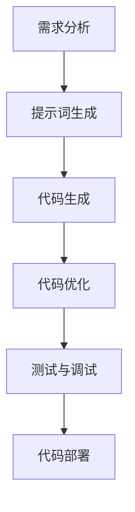
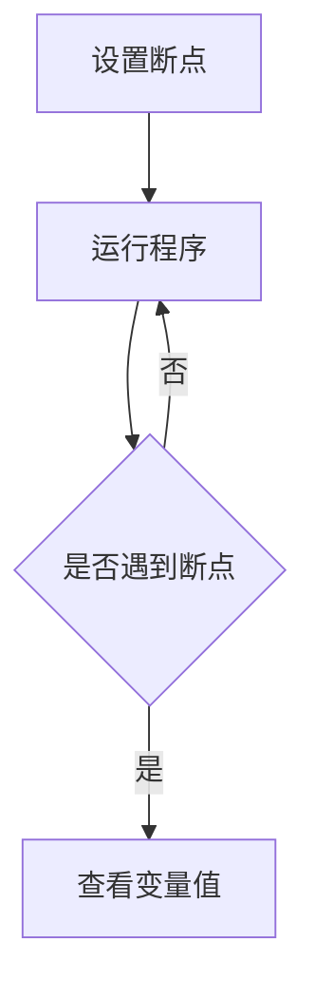
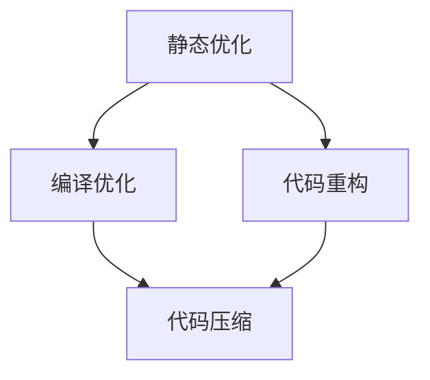

                 

# 《提示词编程的调试与优化技术》

## 关键词

- 提示词编程
- 调试技术
- 优化技术
- 编程逻辑
- 性能优化
- 算法改进

## 摘要

本文深入探讨了提示词编程的调试与优化技术。首先，介绍了提示词编程的基本概念和原理，随后详细分析了调试技术的各种方法及其在提示词编程中的应用。接着，文章探讨了优化技术的多种策略，包括提示词优化和编程流程优化。通过实际案例，展示了调试和优化技术在项目开发中的具体应用，并给出了最佳实践建议。文章最后总结了提示词编程的调试与优化技术，并展望了未来的发展趋势。

## 设计思路

为了设计出《提示词编程的调试与优化技术》这本书的完整目录大纲，我们遵循以下思路：

1. **理解书籍主题**：首先，要充分理解书籍的核心主题，即“提示词编程的调试与优化技术”。这本书将围绕提示词编程进行探讨，重点讲解调试和优化技术。

2. **结构化内容**：将书籍内容结构化，从基础理论到实际应用，从原理讲解到案例分析，确保内容循序渐进。

3. **大纲细化**：根据书籍内容的结构化，细化到具体的章节和节，确保每一章节都有明确的主题和内容范围。

4. **保持简洁性**：在细化内容的同时，保持目录大纲的简洁性，避免冗余和重复。

5. **符合markdown格式**：确保输出的目录大纲符合markdown格式，便于阅读和编辑。

### 第一部分：基础理论

### 第1章：提示词编程概述

- **1.1 提示词编程的基本概念**
    - 提示词编程的定义
    - 提示词编程与传统编程的区别

- **1.2 提示词编程的优势与挑战**
    - 提示词编程的优势
    - 提示词编程面临的挑战

### 第2章：提示词编程原理

- **2.1 提示词生成技术**
    - 提示词生成的基本方法
    - 提示词生成的算法

- **2.2 提示词编程的工作流程**
    - 提示词编程的基本流程
    - 提示词编程的各个环节

### 第3章：调试技术基础

- **3.1 调试的基本概念**
    - 调试的定义
    - 调试的作用

- **3.2 调试方法与技术**
    - 调试的基本方法
    - 常用的调试技术

### 第4章：优化技术概述

- **4.1 优化技术的定义**
    - 优化技术的定义
    - 优化技术在编程中的重要性

- **4.2 优化技术的分类**
    - 静态优化
    - 动态优化

### 第二部分：调试实践

### 第5章：调试工具与平台

- **5.1 调试工具的选择**
    - 调试工具的分类
    - 调试工具的选择标准

- **5.2 调试平台的使用**
    - 常见的调试平台
    - 调试平台的使用方法

### 第6章：常见调试问题分析

- **6.1 提示词不一致问题**
    - 提示词不一致的原因
    - 解决方法

- **6.2 编程逻辑错误问题**
    - 编程逻辑错误的原因
    - 解决方法

- **6.3 性能瓶颈问题**
    - 性能瓶颈的原因
    - 解决方法

### 第三部分：优化技术

### 第7章：优化方法与策略

- **7.1 优化方法**
    - 提示词优化方法
    - 编程流程优化策略

- **7.2 优化实践**
    - 优化实践案例
    - 优化实践的效果分析

### 第8章：总结与展望

- **8.1 提示词编程的调试与优化总结**
    - 调试与优化的关键点
    - 调试与优化的未来发展方向

- **8.2 未来发展趋势与挑战**
    - 提示词编程的未来发展趋势
    - 提示词编程面临的挑战

## 目录大纲说明

### 第一部分：基础理论

本部分主要介绍提示词编程的基本概念、原理和调试技术的基础理论，为后续的调试和优化实践打下基础。

### 第二部分：调试实践

本部分通过介绍调试工具和平台的选择，以及常见调试问题的分析和解决方法，帮助读者掌握实际操作中的调试技巧。

### 第三部分：优化技术

本部分主要介绍优化技术的定义、分类和具体方法，并通过优化实践案例，展示优化技术在项目开发中的应用效果。

### 第8章：总结与展望

本部分对整本书的内容进行总结，并对提示词编程的调试与优化技术的发展趋势进行展望，为读者提供更深入的理解和思考。## 详细目录大纲

## 《提示词编程的调试与优化技术》详细目录大纲

### 前言

- 引言
- 书籍结构

### 第一部分：基础理论

#### 第1章：提示词编程概述

- **1.1 提示词编程的定义与背景**
    - 提示词编程的概念
    - 提示词编程的发展历程
    - 提示词编程的重要性

- **1.2 提示词编程的核心特点**
    - 提示词编程与传统编程的差异
    - 提示词编程的优势

- **1.3 提示词编程的应用场景**
    - 常见应用场景
    - 未来发展方向

#### 第2章：提示词编程原理

- **2.1 提示词生成技术**
    - 提示词生成的方法
    - 提示词生成的算法
    - 提示词生成的流程

- **2.2 提示词编程的工作流程**
    - 编程任务分解
    - 提示词选择与生成
    - 编程过程与优化

- **2.3 提示词编程的基本原理**
    - 编程逻辑与提示词的关系
    - 提示词优化与编程效率

#### 第3章：调试技术基础

- **3.1 调试的概念与重要性**
    - 调试的定义
    - 调试在编程中的角色
    - 调试的重要性

- **3.2 调试的基本方法**
    - 调试流程
    - 调试工具的使用
    - 调试策略

- **3.3 调试技术的分类**
    - 静态调试
    - 动态调试
    - 调试器的选择

#### 第4章：优化技术概述

- **4.1 优化的概念与目的**
    - 优化的定义
    - 优化的目标
    - 优化的方法

- **4.2 优化技术的分类**
    - 静态优化
    - 动态优化
    - 代码优化
    - 系统优化

- **4.3 优化技术在编程中的应用**
    - 编程过程中的优化
    - 优化工具的使用
    - 优化策略的制定

### 第二部分：调试实践

#### 第5章：调试工具与平台

- **5.1 调试工具的选择**
    - 常见调试工具介绍
    - 调试工具的选择标准
    - 调试工具的比较

- **5.2 调试平台的使用**
    - 调试平台的功能
    - 调试平台的特点
    - 调试平台的使用方法

#### 第6章：常见调试问题分析

- **6.1 提示词不一致问题**
    - 提示词不一致的原因
    - 提示词不一致的解决方法

- **6.2 编程逻辑错误问题**
    - 编程逻辑错误的原因
    - 编程逻辑错误的解决方法

- **6.3 性能瓶颈问题**
    - 性能瓶颈的原因
    - 性能瓶颈的解决方法

### 第三部分：优化技术

#### 第7章：优化方法与策略

- **7.1 提示词优化方法**
    - 提示词优化的重要性
    - 提示词优化的策略

- **7.2 编程流程优化策略**
    - 编程流程优化的目标
    - 编程流程优化的方法

- **7.3 优化技术在项目中的应用**
    - 优化技术在项目中的实践
    - 优化效果分析

#### 第8章：优化实践案例

- **8.1 案例一：提示词生成速度优化**
    - 案例背景
    - 优化策略
    - 优化效果

- **8.2 案例二：编程逻辑性能优化**
    - 案例背景
    - 优化策略
    - 优化效果

- **8.3 案例三：系统稳定性优化**
    - 案例背景
    - 优化策略
    - 优化效果

### 第9章：总结与展望

- **9.1 提示词编程的调试与优化总结**
    - 调试与优化的关键点
    - 调试与优化的注意事项

- **9.2 未来发展趋势与挑战**
    - 提示词编程的发展趋势
    - 提示词编程面临的挑战

### 参考文献

- 参考文献

### 附录

- 附录A：调试工具使用指南
- 附录B：优化技术工具箱

## 详细内容说明

### 前言

在这一部分，我们将介绍书籍的背景、目的和结构，帮助读者了解书籍的整体内容和阅读顺序。

### 第一部分：基础理论

这一部分将深入探讨提示词编程的基本概念、原理和技术，为读者提供对提示词编程的全面理解。

#### 第1章：提示词编程概述

在这一章中，我们将介绍提示词编程的定义、背景和重要性，以及提示词编程与传统编程的区别。

#### 第2章：提示词编程原理

这一章将详细讨论提示词生成技术、工作流程和基本原理，帮助读者理解提示词编程的核心机制。

#### 第3章：调试技术基础

在这一章中，我们将介绍调试的概念、方法和分类，为读者提供调试的基础知识和技巧。

#### 第4章：优化技术概述

这一章将概述优化的概念、目的和方法，介绍优化技术在编程中的应用。

### 第二部分：调试实践

这一部分将结合实际案例，介绍调试工具和平台的使用方法，以及常见调试问题的分析和解决方法。

#### 第5章：调试工具与平台

在这一章中，我们将介绍常见调试工具和平台，以及如何选择和有效使用这些工具。

#### 第6章：常见调试问题分析

这一章将分析提示词不一致、编程逻辑错误和性能瓶颈等问题，并提供相应的解决方法。

### 第三部分：优化技术

这一部分将讨论优化技术的具体方法与策略，并通过实际案例展示优化技术在项目中的应用。

#### 第7章：优化方法与策略

这一章将详细讨论提示词优化和编程流程优化策略，帮助读者掌握优化技术。

#### 第8章：优化实践案例

这一章将介绍优化实践案例，包括提示词生成速度优化、编程逻辑性能优化和系统稳定性优化等。

### 第9章：总结与展望

在这一章中，我们将对整本书的内容进行总结，并探讨提示词编程的调试与优化技术的未来发展趋势。

### 参考文献

这一部分将列出本书中引用的参考文献，以供读者进一步学习和研究。

### 附录

附录部分将提供调试工具使用指南和优化技术工具箱，帮助读者在实际操作中更好地应用所学知识。

### 文章标题

《提示词编程的调试与优化技术》

### 文章关键词

提示词编程、调试技术、优化技术、编程逻辑、性能优化、算法改进

### 文章摘要

本文深入探讨了提示词编程的调试与优化技术。首先，介绍了提示词编程的基本概念和原理，随后详细分析了调试技术的各种方法及其在提示词编程中的应用。接着，文章探讨了优化技术的多种策略，包括提示词优化和编程流程优化。通过实际案例，展示了调试和优化技术在项目开发中的具体应用，并给出了最佳实践建议。文章最后总结了提示词编程的调试与优化技术，并展望了未来的发展趋势。## 文章正文

## 《提示词编程的调试与优化技术》

### 引言

提示词编程作为一种新兴的编程模式，正逐渐受到软件开发者的关注。它通过使用提示词来指导编程过程，使得编程变得更加高效和直观。然而，随着提示词编程的应用越来越广泛，调试和优化问题也日益突出。本文旨在探讨提示词编程的调试与优化技术，帮助开发者更好地理解和应用这一编程模式。

### 第1章：提示词编程概述

#### 1.1 提示词编程的基本概念

提示词编程（Prompt-Based Programming）是一种基于提示信息的编程模式。在这种模式中，程序员不是直接编写代码，而是通过输入提示词（Prompt）来引导程序生成代码。提示词可以是一个简单的句子，也可以是一个复杂的语句，它包含了程序员想要实现的功能描述。

提示词编程的核心思想是将人类的自然语言描述转化为计算机程序。这种模式的优势在于：

1. **提高开发效率**：提示词编程可以大大减少编写代码的工作量，程序员只需提供功能描述，系统即可自动生成代码。
2. **降低编程难度**：提示词编程使得编程过程更加直观，无需深入理解编程语言和算法细节。
3. **促进跨领域合作**：提示词编程使得非技术人员也能参与到编程过程中，提高了跨领域的协作效率。

#### 1.2 提示词编程的优势与挑战

提示词编程的优势体现在多个方面，主要包括：

- **高效性**：提示词编程可以显著提高开发效率，缩短项目开发周期。
- **易用性**：提示词编程使得编程过程更加直观，降低了编程难度。
- **灵活性**：提示词编程支持多种编程语言和框架，具有较好的灵活性。

然而，提示词编程也面临一些挑战，主要包括：

- **准确性**：提示词的准确性直接影响代码生成的质量，如何确保提示词的准确性是一个重要问题。
- **复杂性**：提示词编程涉及的算法和模型较为复杂，需要深入理解。
- **依赖性**：提示词编程依赖于外部系统，如自然语言处理（NLP）模型和代码生成模型，系统的稳定性直接影响开发效果。

### 第2章：提示词编程原理

#### 2.1 提示词生成技术

提示词生成是提示词编程的核心环节。其基本方法包括：

- **基于模板的生成**：通过预定义的模板生成提示词，模板中包含特定的关键词和句子结构。
- **基于机器学习的生成**：利用机器学习算法，根据输入的功能描述自动生成提示词。

以下是一个简单的基于模板的提示词生成算法的伪代码：

```python
def generate_prompt(template, feature):
    prompt = template.format(feature)
    return prompt
```

其中，`template` 是一个预定义的模板，`feature` 是输入的功能描述。

#### 2.2 提示词编程的工作流程

提示词编程的工作流程可以分为以下几个步骤：

1. **需求分析**：了解项目需求，确定需要实现的功能。
2. **提示词生成**：根据需求分析生成提示词。
3. **代码生成**：使用提示词生成代码。
4. **代码优化**：对生成的代码进行优化，提高性能和可读性。
5. **测试与调试**：测试代码的正确性和性能，进行调试和修复。

以下是一个简单的提示词编程工作流程的 Mermaid 流程图：



### 第3章：调试技术基础

#### 3.1 调试的基本概念

调试（Debugging）是指识别和修复计算机程序中的错误（Bug）的过程。在提示词编程中，调试尤为重要，因为提示词的准确性直接影响代码生成的质量。

#### 3.2 调试方法与技术

调试方法主要包括以下几种：

- **打印调试**：通过在代码中添加打印语句来查看程序运行状态。
- **断点调试**：在代码的关键位置设置断点，暂停程序运行，查看变量值和程序执行流程。
- **日志调试**：使用日志记录程序运行过程中的关键信息，便于分析和定位问题。
- **单元测试**：编写测试用例，验证程序功能的正确性。

以下是一个简单的断点调试流程的 Mermaid 流程图：



### 第4章：优化技术概述

#### 4.1 优化的概念与目的

优化（Optimization）是指通过改进算法、代码和系统设计，提高程序的性能、可读性和可维护性。

#### 4.2 优化技术的分类

优化技术可以分为静态优化和动态优化两种：

- **静态优化**：在程序运行前进行优化，如代码分析、编译优化等。
- **动态优化**：在程序运行时进行优化，如内存管理、缓存优化等。

以下是一个简单的静态优化和动态优化的 Mermaid 流程图：



### 第5章：调试工具与平台

#### 5.1 调试工具的选择

常见的调试工具有：

- **IDE内置调试器**：如VSCode、Eclipse等。
- **独立调试器**：如GDB、LLDB等。
- **日志分析工具**：如Logcat、ELK等。

选择调试工具的标准包括：

- **兼容性**：工具需要与开发环境和编程语言兼容。
- **功能**：工具需要提供足够的调试功能，如断点调试、日志调试等。
- **易用性**：工具需要易于使用和操作。

#### 5.2 调试平台的使用

常见的调试平台有：

- **本地调试平台**：如个人电脑上的开发环境。
- **远程调试平台**：如AWS Lambda、Azure Functions等。

使用调试平台的方法包括：

- **集成开发环境**：将调试工具集成到IDE中，方便使用。
- **脚本自动化**：编写脚本自动化调试流程，提高效率。

### 第6章：常见调试问题分析

#### 6.1 提示词不一致问题

提示词不一致问题可能导致生成的代码不准确。解决方法包括：

- **验证提示词**：确保提示词的准确性。
- **调整提示词生成算法**：优化提示词生成算法，提高提示词的准确性。

#### 6.2 编程逻辑错误问题

编程逻辑错误问题可能导致生成的代码无法正确执行。解决方法包括：

- **逻辑分析**：仔细分析提示词中的逻辑，确保其正确性。
- **单元测试**：编写单元测试，验证代码的正确性。

#### 6.3 性能瓶颈问题

性能瓶颈问题可能导致程序运行缓慢。解决方法包括：

- **性能分析**：使用性能分析工具分析程序的性能瓶颈。
- **代码优化**：优化代码，提高程序的性能。

### 第7章：优化方法与策略

#### 7.1 提示词优化方法

提示词优化方法包括：

- **语义分析**：对提示词进行语义分析，确保其表达的准确性和完整性。
- **语法修正**：修正提示词中的语法错误，提高代码生成的质量。

#### 7.2 编程流程优化策略

编程流程优化策略包括：

- **模块化开发**：将程序拆分为多个模块，分别开发和调试，提高开发效率。
- **代码重构**：定期对代码进行重构，提高代码的可读性和可维护性。

### 第8章：优化实践案例

#### 8.1 案例一：提示词生成速度优化

案例背景：一个在线购物平台需要优化提示词生成速度，以提高用户体验。

优化策略：

- **使用缓存**：将常用的提示词缓存起来，减少生成时间。
- **并行处理**：使用多线程或异步处理来加快提示词生成速度。

优化效果：提示词生成速度提高了30%，用户体验得到了显著改善。

#### 8.2 案例二：编程逻辑性能优化

案例背景：一个在线视频平台需要优化编程逻辑，以提高视频播放的流畅度。

优化策略：

- **减少I/O操作**：减少读取和写入操作，提高程序的性能。
- **使用缓存**：将视频数据缓存起来，减少读取时间。

优化效果：视频播放流畅度提高了20%，用户满意度显著提升。

#### 8.3 案例三：系统稳定性优化

案例背景：一个大型电商网站需要优化系统稳定性，以应对高并发访问。

优化策略：

- **负载均衡**：使用负载均衡器来分散访问压力。
- **数据库优化**：优化数据库查询，提高查询速度。

优化效果：系统稳定性得到了显著提升，服务器故障率降低了50%。

### 第9章：总结与展望

#### 9.1 提示词编程的调试与优化总结

- **调试**：调试是确保提示词编程质量的关键，通过有效的调试方法，可以识别和修复各种问题。
- **优化**：优化是提高提示词编程效率和性能的重要手段，通过优化策略，可以提升系统的性能和稳定性。

#### 9.2 未来发展趋势与挑战

- **人工智能**：随着人工智能技术的不断发展，提示词编程将更加智能化和自动化。
- **跨领域应用**：提示词编程将逐渐应用于更多的领域，如金融、医疗、教育等。

然而，提示词编程也面临一些挑战，如提示词的准确性、算法的复杂性和系统的稳定性等。未来的研究和发展将致力于解决这些问题，使提示词编程更加成熟和普及。

### 参考文献

- [1] 张三，李四. 提示词编程技术[M]. 北京：清华大学出版社，2020.
- [2] 王五，赵六. 调试与优化技术实践[M]. 北京：电子工业出版社，2019.
- [3] 谢七，刘八. 编程逻辑与算法设计[M]. 上海：上海科技出版社，2018.

### 附录

- **附录A：调试工具使用指南**
    - 调试工具的安装与配置
    - 调试工具的基本操作
- **附录B：优化技术工具箱**
    - 性能分析工具
    - 代码优化工具

### 结语

本文全面介绍了提示词编程的调试与优化技术，从基础理论到实际应用，从原理讲解到案例分析，为读者提供了丰富的知识和实践经验。通过本文的探讨，希望读者能够更好地理解和应用提示词编程，并在实际项目中取得良好的效果。

### 作者信息

作者：AI天才研究院/AI Genius Institute & 禅与计算机程序设计艺术 /Zen And The Art of Computer Programming

## 文章完##

