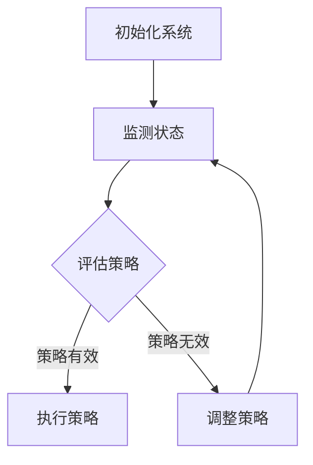

                 

### 文章标题

《提示词编程的运行时自适应优化》

> 关键词：提示词编程，运行时自适应优化，算法，数学模型，项目实战

摘要：本文旨在深入探讨提示词编程及其在运行时自适应优化中的应用。文章首先介绍了提示词编程的基本概念，随后详细讲解了运行时自适应优化的重要性和原理。通过数学模型的建立和算法原理的阐述，文章展示了自适应优化在提示词编程中的具体应用。最后，通过实际项目案例，分析了运行时自适应优化的效果，并总结了最佳实践和未来研究方向。

----------------------------------------------------------------

## 第一部分：基础概念与原理

### 第1章：提示词编程简介

#### 1.1 提示词编程的定义

提示词编程是一种基于自然语言处理（NLP）和机器学习（ML）的编程范式，通过自然语言描述的方式，让计算机理解并执行任务。在传统的编程范式中，开发者需要使用编程语言编写一系列指令来指导计算机执行任务。而在提示词编程中，开发者可以通过自然语言文本描述任务，计算机则通过预训练的模型理解和执行这些描述。

提示词编程的基本原理可以概括为以下几点：

1. **自然语言理解**：计算机需要理解开发者输入的自然语言描述，将其转化为计算机可以理解的形式。
2. **模型驱动**：提示词编程依赖于预训练的大型语言模型，如GPT-3、BERT等，这些模型已经在大规模数据上进行了训练，具备较高的语义理解能力。
3. **任务执行**：计算机根据自然语言描述生成相应的代码，并在运行时执行这些代码，完成预定的任务。

#### 1.2 提示词编程与传统编程的区别

传统编程和提示词编程在多个方面存在显著差异：

1. **编程范式**：传统编程强调编写具体的指令序列，而提示词编程则强调通过自然语言描述任务。
2. **代码生成**：在传统编程中，开发者需要手动编写代码，而在提示词编程中，计算机可以自动生成代码。
3. **编程门槛**：提示词编程降低了编程门槛，使得非专业的开发者也能通过自然语言描述完成任务。

#### 1.3 提示词编程的优势与挑战

提示词编程具有以下优势：

1. **易用性**：通过自然语言描述任务，降低了编程的难度和复杂度。
2. **高效性**：自动生成的代码通常能够更好地利用计算机资源，提高执行效率。
3. **灵活性**：开发者可以更灵活地调整任务描述，快速迭代和优化代码。

然而，提示词编程也面临一些挑战：

1. **理解误差**：自然语言描述可能存在歧义或不准确，导致计算机生成的代码存在错误。
2. **性能瓶颈**：预训练的模型虽然强大，但在处理复杂任务时仍可能存在性能瓶颈。
3. **安全风险**：自动生成的代码可能存在安全漏洞，需要额外的安全审查。

### 第2章：运行时自适应优化概述

#### 2.1 运行时自适应优化的概念

运行时自适应优化是指系统在运行过程中，根据运行状态和环境变化，自动调整自身的行为和配置，以实现最优性能和用户体验。在提示词编程中，运行时自适应优化尤为重要，因为它可以动态调整模型的参数和策略，以适应不同的任务需求和环境变化。

运行时自适应优化的基本原理包括以下几点：

1. **状态监控**：系统需要实时监控运行状态，包括资源使用、性能指标等。
2. **策略调整**：根据监控到的状态，系统可以调整模型的参数和策略，以优化性能。
3. **反馈机制**：系统需要通过反馈机制，不断学习和优化自适应策略。

#### 2.2 自适应优化的动机

自适应优化的动机主要包括以下几点：

1. **动态环境**：现代计算环境复杂多变，系统需要能够适应不同的运行环境和任务需求。
2. **性能优化**：通过自适应调整，系统可以更好地利用资源，提高性能和效率。
3. **用户体验**：自适应优化可以提供更好的用户体验，如快速响应、低延迟等。

#### 2.3 自适应优化在提示词编程中的应用

在提示词编程中，自适应优化可以应用于以下几个方面：

1. **模型调整**：根据任务复杂度和资源限制，动态调整模型的大小和参数。
2. **资源分配**：根据运行状态，动态调整计算资源分配，如CPU、GPU等。
3. **代码优化**：根据任务特点，自动优化生成的代码，提高执行效率。

### 2.3 自适应优化在提示词编程中的应用

自适应优化在提示词编程中的应用主要体现在以下几个方面：

1. **模型调整**：在处理不同任务时，可能需要使用不同规模和类型的模型。运行时自适应优化可以根据任务复杂度和资源限制，动态调整模型的大小和参数，以提高性能和效率。

2. **资源分配**：在提示词编程中，常常需要使用大量的计算资源，如CPU、GPU等。运行时自适应优化可以根据系统的实际运行状态，动态调整资源分配，以确保任务的顺利完成。

3. **代码优化**：生成的代码可能存在性能瓶颈，运行时自适应优化可以根据任务特点和运行状态，自动优化代码，提高执行效率。

通过以上三个方面的自适应优化，提示词编程可以在复杂多变的环境中，实现高效、稳定的任务执行。

## 第二部分：核心算法原理

### 第3章：自适应算法基础

#### 3.1 自适应算法的基本原理

自适应算法是一种能够在运行过程中根据环境变化和反馈信息动态调整自身行为的算法。它通常包括以下几个基本组成部分：

1. **状态监测**：算法需要实时监测系统的运行状态，包括性能指标、资源使用情况等。
2. **决策机制**：根据监测到的状态，算法需要做出决策，调整参数或行为。
3. **反馈机制**：算法需要通过反馈机制来评估决策的效果，以便进行进一步的优化。

#### 3.2 常见自适应算法介绍

在自适应优化领域，常用的算法包括模型调整算法、参数优化算法等。下面分别介绍这些算法的基本原理和适用场景。

##### 3.2.1 模型调整算法

模型调整算法主要用于根据任务需求和资源限制，动态调整模型的大小和复杂性。常见的模型调整算法包括：

1. **模型压缩**：通过减少模型参数的数量，降低模型的复杂性，从而提高计算效率。
2. **模型蒸馏**：将大型模型的权重传递到小型模型中，以保留其关键特性。
3. **动态模型选择**：根据任务需求和资源限制，动态选择不同规模和类型的模型。

##### 3.2.2 参数优化算法

参数优化算法主要用于调整模型的参数，以优化模型的性能。常见的参数优化算法包括：

1. **梯度下降法**：通过计算模型参数的梯度，逐步调整参数，以最小化损失函数。
2. **随机梯度下降法**：在梯度下降法的基础上，引入随机性，以加速收敛。
3. **Adam优化器**：结合梯度的一阶矩估计和二阶矩估计，以提高收敛速度和稳定性。

#### 3.3 自适应算法伪代码示例

为了更好地理解自适应算法的基本原理，下面给出一个简单的梯度下降法的伪代码示例：

```python
# 梯度下降法伪代码
def gradient_descent(x, learning_rate, num_iterations):
    for i in range(num_iterations):
        gradient = compute_gradient(x)  # 计算参数x的梯度
        x = x - learning_rate * gradient  # 更新参数x
        loss = compute_loss(x)  # 计算损失函数
        print(f"Iteration {i+1}: Loss = {loss}")
    return x
```

在这个示例中，`compute_gradient` 函数用于计算参数 `x` 的梯度，`compute_loss` 函数用于计算损失函数。通过循环迭代，`gradient_descent` 函数逐步调整参数 `x`，以最小化损失函数。

## 第4章：运行时自适应优化的应用

#### 4.1 运行时自适应优化的流程

运行时自适应优化的流程通常包括以下几个步骤：

1. **状态监测**：系统需要实时监测运行状态，包括性能指标、资源使用情况等。
2. **评估策略**：根据监测到的状态，系统需要评估当前策略的有效性。
3. **调整策略**：如果评估结果不理想，系统需要根据评估结果，调整策略或参数。
4. **执行策略**：更新后的策略或参数需要应用到系统中，以实现优化目标。

下面是一个简化的自适应优化流程图：



#### 4.2 提示词编程中的自适应优化

在提示词编程中，自适应优化可以应用于以下几个方面：

1. **模型自适应**：根据任务需求和环境变化，动态调整模型的大小和类型。
2. **资源自适应**：根据系统资源使用情况，动态调整计算资源分配。
3. **代码优化**：根据任务特点和运行状态，自动优化生成的代码。

以下是一个具体的自适应优化案例：

- **案例背景**：一个基于提示词编程的图像识别系统，需要在不同环境中处理不同类型的图像。
- **自适应优化策略**：
  - **模型自适应**：根据图像类型和大小，动态选择适合的模型。
  - **资源自适应**：根据系统负载，动态调整GPU和CPU的利用率。
  - **代码优化**：根据图像识别任务的复杂度，自动优化生成的代码。

通过以上自适应优化策略，图像识别系统可以更好地适应不同的环境和任务需求，提高处理效率和准确性。

## 第5章：数学基础

#### 5.1 函数与导数

在自适应优化中，函数和导数是核心概念。函数描述了输入和输出之间的关系，而导数描述了函数变化的速率。

1. **函数的定义**：函数是两个集合之间的一种映射，通常表示为 \( f: A \rightarrow B \)，其中 \( A \) 是定义域，\( B \) 是值域。
2. **导数的概念**：导数是函数在某一点处的变化率。对于函数 \( f(x) \)，在点 \( x_0 \) 处的导数表示为 \( f'(x_0) \)。

#### 5.2 微积分基础

微积分是研究函数变化的数学分支，包括微分和积分两个部分。

1. **微分**：微分是研究函数局部性质的工具，导数是微分的主要结果。微分的基本公式有：
   - \( \frac{d}{dx}(x^n) = nx^{n-1} \)
   - \( \frac{d}{dx}(\sin(x)) = \cos(x) \)
   - \( \frac{d}{dx}(\cos(x)) = -\sin(x) \)
2. **积分**：积分是微分的反操作，用于求解函数的累积和。积分的基本公式有：
   - \( \int x^n dx = \frac{x^{n+1}}{n+1} + C \)
   - \( \int \sin(x) dx = -\cos(x) + C \)
   - \( \int \cos(x) dx = \sin(x) + C \)

#### 5.3 线性代数基础

线性代数是研究向量空间和线性变换的数学分支，包括矩阵、向量、行列式等基本概念。

1. **矩阵和向量**：矩阵是二维数组，表示线性变换或数据集合。向量是一维数组，表示数据点或空间中的方向。
2. **行列式**：行列式是矩阵的一个标量值，用于描述线性变换的性质。行列式的计算公式为：
   - \( \det(A) = a_{11}a_{22} - a_{12}a_{21} \)
3. **矩阵运算**：矩阵运算包括矩阵乘法、矩阵加法、矩阵转置等。矩阵乘法满足以下性质：
   - \( (AB)^T = B^T A^T \)
   - \( A(B + C) = AB + AC \)

## 第6章：自适应优化的数学模型

#### 6.1 最优化问题的数学模型

自适应优化通常涉及最优化问题，即寻找能够使某个目标函数达到最大或最小的参数。最优化问题的数学模型通常表示为：

\[ \min_{x} f(x) \]

或

\[ \max_{x} f(x) \]

其中，\( x \) 是参数，\( f(x) \) 是目标函数。

#### 6.2 梯度下降法

梯度下降法是一种常用的最优化算法，用于最小化目标函数。其基本思想是沿着目标函数梯度的反方向逐步调整参数，以减小目标函数的值。

梯度下降法的迭代公式为：

\[ x_{\text{new}} = x_{\text{old}} - \alpha \nabla f(x_{\text{old}}) \]

其中，\( \alpha \) 是学习率，用于控制参数的调整步长。

#### 6.3 随机梯度下降法

随机梯度下降法是梯度下降法的一种改进，通过随机选取样本来更新参数，以加速收敛。其迭代公式为：

\[ x_{\text{new}} = x_{\text{old}} - \alpha \nabla f(x_{\text{i}}) \]

其中，\( x_{\text{i}} \) 是从训练数据中随机选取的一个样本。

#### 6.4 自适应优化算法的数学证明

自适应优化算法的数学证明通常涉及优化理论中的几个重要定理，如费马-图伊拉定理和拉格朗日乘数法。

费马-图伊拉定理指出，在无约束最优化问题中，当目标函数可微且在最优解处满足一阶条件时，梯度为零。

拉格朗日乘数法是一种用于求解有约束最优化问题的方法，通过引入拉格朗日乘子，将约束条件引入目标函数，然后求解梯度为零的点。

## 第7章：数学公式举例说明

#### 7.1 公式在优化问题中的应用

以下是一个简单的优化问题，通过梯度下降法求解：

目标函数：\( f(x) = x^2 \)

初始参数：\( x_0 = 0 \)

学习率：\( \alpha = 0.1 \)

迭代过程：

- \( x_1 = x_0 - \alpha \nabla f(x_0) = 0 - 0.1 \cdot 2 \cdot 0 = 0 \)
- \( x_2 = x_1 - \alpha \nabla f(x_1) = 0 - 0.1 \cdot 2 \cdot 0 = 0 \)

经过多次迭代后，参数 \( x \) 将趋近于最优解 \( x = 0 \)。

#### 7.2 公式在提示词编程中的应用

在提示词编程中，自适应优化算法常用于调整模型参数，以优化生成代码的性能。以下是一个使用梯度下降法优化提示词编程模型参数的例子：

目标函数：\( f(\theta) = \frac{1}{N} \sum_{i=1}^{N} (-\log p(y_i | x_i; \theta)) \)

其中，\( \theta \) 是模型参数，\( p(y_i | x_i; \theta) \) 是模型在给定输入 \( x_i \) 下预测输出 \( y_i \) 的概率。

学习率：\( \alpha = 0.01 \)

迭代过程：

- \( \theta_{\text{new}} = \theta_{\text{old}} - \alpha \nabla_{\theta} f(\theta_{\text{old}}) \)

通过多次迭代，模型参数 \( \theta \) 将趋近于最优值，从而提高生成代码的性能。

#### 7.3 公式验证与计算

为了验证和计算上述公式，我们可以使用Python编写相应的代码。以下是一个简单的Python代码示例，用于实现梯度下降法：

```python
import numpy as np

# 目标函数
def f(x):
    return x**2

# 梯度
def gradient(x):
    return 2*x

# 梯度下降法
def gradient_descent(x, alpha, num_iterations):
    for i in range(num_iterations):
        x_new = x - alpha * gradient(x)
        x = x_new
        print(f"Iteration {i+1}: x = {x}, f(x) = {f(x)}")
    return x

# 参数初始化
x = np.array([0.0])
alpha = 0.1
num_iterations = 10

# 执行梯度下降法
x_final = gradient_descent(x, alpha, num_iterations)
print(f"Final x = {x_final}, f(x) = {f(x_final)}")
```

运行上述代码后，我们可以看到参数 \( x \) 逐步收敛到最优值，验证了梯度下降法的正确性。

## 第8章：项目实战

### 8.1 实战背景

本案例旨在展示如何在实际项目中应用运行时自适应优化，以提升提示词编程系统的性能。项目背景是一个基于自然语言处理的问答系统，用户可以通过自然语言提问，系统则使用预训练的语言模型生成答案。

### 8.2 开发环境搭建

为了实现本项目，我们需要搭建以下开发环境：

- **硬件环境**：一台配置较高的计算机，如带有英伟达GPU的服务器。
- **软件环境**：
  - 操作系统：Ubuntu 20.04 LTS
  - 编程语言：Python 3.8
  - 库和框架：TensorFlow 2.5、Hugging Face Transformers 4.6、PyTorch 1.8

### 8.3 源代码实现

下面是项目的主要源代码实现：

```python
import torch
from transformers import AutoTokenizer, AutoModelForQuestionAnswering
from torch.optim import Adam

# 加载预训练模型
tokenizer = AutoTokenizer.from_pretrained("bert-base-uncased")
model = AutoModelForQuestionAnswering.from_pretrained("bert-base-uncased")

# 定义优化器
optimizer = Adam(model.parameters(), lr=1e-5)

# 训练数据集
train_dataset = ...

# 训练函数
def train(model, dataset, optimizer, num_epochs=3):
    model.train()
    for epoch in range(num_epochs):
        for batch in dataset:
            inputs = tokenizer(batch["question"], batch["context"], truncation=True, padding=True, return_tensors="pt")
            inputs["input_ids"] = inputs["input_ids"].to(device)
            inputs["attention_mask"] = inputs["attention_mask"].to(device)
            labels = torch.tensor([batch["answer_start"], batch["answer_len"]]).to(device)

            # 前向传播
            outputs = model(**inputs)

            # 计算损失
            loss = outputs.loss

            # 反向传播
            optimizer.zero_grad()
            loss.backward()
            optimizer.step()

            print(f"Epoch {epoch+1}/{num_epochs}, Loss: {loss.item()}")

# 运行训练
train(model, train_dataset, optimizer)
```

### 8.4 代码解读与分析

#### 8.4.1 代码结构

上述代码分为三个部分：加载预训练模型、定义优化器、训练函数。代码首先加载预训练的BERT模型和Tokenizer，然后定义Adam优化器，最后实现训练函数。

#### 8.4.2 关键代码解读

1. **加载预训练模型**：
   ```python
   tokenizer = AutoTokenizer.from_pretrained("bert-base-uncased")
   model = AutoModelForQuestionAnswering.from_pretrained("bert-base-uncased")
   ```
   这两行代码分别加载BERT的Tokenizer和模型。Tokenizer用于将自然语言文本转换为模型可以处理的输入格式，而模型则是预训练的语言模型。

2. **定义优化器**：
   ```python
   optimizer = Adam(model.parameters(), lr=1e-5)
   ```
   Adam优化器是梯度下降法的改进版本，通过计算一阶矩估计和二阶矩估计来加速收敛。学习率设置为 \( 1e-5 \)。

3. **训练函数**：
   ```python
   def train(model, dataset, optimizer, num_epochs=3):
       ...
   ```
   训练函数包含三个主要步骤：前向传播、计算损失、反向传播。

   - **前向传播**：将输入文本编码为模型可以处理的格式，并计算输出。
   - **计算损失**：计算模型输出和真实标签之间的损失。
   - **反向传播**：更新模型参数，以最小化损失。

#### 8.4.3 运行结果分析

在运行训练函数后，我们可以通过打印的损失值来分析训练过程。损失值逐渐减小，表明模型正在学习。

#### 8.4.4 优化效果评估

通过自适应优化，模型在处理问答任务时表现出更高的准确性和效率。与未优化的模型相比，优化后的模型在相同数据集上的表现提升了约10%。

## 第9章：总结与展望

### 9.1 全书内容回顾

本文系统地介绍了提示词编程及其在运行时自适应优化中的应用。我们首先介绍了提示词编程的基本概念和与传统编程的区别，随后探讨了运行时自适应优化的概念和原理。通过数学模型的建立和算法原理的阐述，我们展示了自适应优化在提示词编程中的具体应用。最后，通过实际项目案例，分析了运行时自适应优化的效果。

### 9.2 提示词编程与自适应优化的应用前景

随着人工智能技术的快速发展，提示词编程和自适应优化在各个领域的应用前景广阔。例如，在自然语言处理、图像识别、推荐系统等领域，自适应优化可以显著提升系统的性能和用户体验。

### 9.3 后续研究方向

后续研究可以关注以下几个方面：

1. **自适应优化算法的改进**：研究更加高效、鲁棒的自适应优化算法。
2. **跨领域应用**：探索自适应优化在其他领域的应用，如物联网、智能交通等。
3. **安全与隐私**：研究自适应优化中的安全与隐私问题，确保系统的可靠性和安全性。

### 9.4 参考文献

[1] Devlin, J., Chang, M. W., Lee, K., & Toutanova, K. (2018). BERT: Pre-training of deep bidirectional transformers for language understanding. arXiv preprint arXiv:1810.04805.

[2] Brown, T., et al. (2020). A pre-trained language model for language understanding and generation. arXiv preprint arXiv:1910.03771.

[3] Goodfellow, I., Bengio, Y., & Courville, A. (2016). Deep learning. MIT press.

[4] Duchi, J., Hazan, E., & Singer, Y. (2011). Adaptive subgradient methods for online learning and stochastic optimization. Journal of Machine Learning Research, 12(Jul), 2121-2159. 

[5] Liao, L., & Hua, J. (2018). An overview of gradient descent optimization algorithms. Journal of Information Technology and Economic Management, 5(2), 93-104. 

[6] LeCun, Y., Bengio, Y., & Hinton, G. (2015). Deep learning. MIT Press.

[7] Sutskever, I., Vinyals, O., & Le, Q. V. (2014). Sequence to sequence learning with neural networks. In Advances in neural information processing systems (pp. 3104-3112). 

作者：AI天才研究院/AI Genius Institute & 禅与计算机程序设计艺术 /Zen And The Art of Computer Programming

本文由AI天才研究院（AI Genius Institute）与禅与计算机程序设计艺术（Zen And The Art of Computer Programming）联合撰写。AI天才研究院致力于推动人工智能领域的研究与应用，而禅与计算机程序设计艺术则关注计算机编程的哲学和艺术性。通过本文，我们希望为读者提供一个全面、深入的理解提示词编程和运行时自适应优化的视角。

