                 


### 提示词编程的错误处理与调试技巧

#### 关键词

- 提示词编程
- 错误处理
- 调试技巧
- 异常处理
- 调试工具
- 性能优化

#### 摘要

本文旨在深入探讨提示词编程中的错误处理与调试技巧。通过分析常见错误类型、调试方法和策略，并结合实际项目案例，我们旨在帮助读者理解和掌握有效的错误处理与调试方法，提高编程效率和代码质量。

## 第一部分：错误处理基础

### 1.1 错误处理的概念和重要性

错误处理是指在编程过程中识别、定位和修复错误的过程。它在软件开发生命周期中扮演着至关重要的角色。错误处理的重要性体现在以下几个方面：

1. **提高代码质量**：错误处理有助于发现和修复代码中的缺陷，从而提高代码的可靠性和稳定性。
2. **确保系统可用性**：有效的错误处理可以确保系统在错误发生时能够正确响应，减少系统崩溃和宕机的风险。
3. **改善用户体验**：良好的错误处理机制可以提供友好的错误提示，帮助用户快速解决问题，提升用户体验。

### 1.2 提示词编程中的错误类型

提示词编程中的错误类型可以分为以下几类：

1. **语法错误**：语法错误是由于代码违反编程语言的语法规则而引起的错误。
2. **运行时错误**：运行时错误是在程序执行过程中由于不可预见的条件或资源不足等原因引起的错误。
3. **异常处理**：异常处理是针对程序运行过程中出现的非正常情况的一种机制。
4. **类型错误**：类型错误是由于数据类型不匹配或类型转换错误引起的错误。

### 1.3 错误检测和诊断

错误检测和诊断是错误处理的关键步骤。以下是一些常用的方法和工具：

1. **静态分析**：静态分析工具可以检查代码的语法、语义和风格，提前发现潜在的错误。
2. **动态调试**：动态调试工具可以在程序运行时检查程序的执行过程，帮助定位和修复错误。
3. **日志记录**：日志记录是记录程序执行过程中发生的事件和异常的一种方式，有助于分析和调试。

### 1.4 错误日志记录和分析

1. **日志记录的格式和策略**：日志记录应该包括时间戳、错误类型、错误信息、异常堆栈等信息。常用的日志格式有文本格式、XML格式等。

2. **日志分析工具的使用**：日志分析工具可以帮助我们快速定位错误和异常。例如，ELK（Elasticsearch、Logstash、Kibana）栈是一个常用的日志分析工具。

3. **常见错误日志分析案例**：通过分析日志，我们可以发现常见的错误模式，从而采取相应的措施进行修复。

## 第二部分：错误处理技巧

### 2.1 代码级错误处理

1. **异常捕获和传播**：异常捕获和传播是错误处理的核心。通过捕获异常并正确处理，可以确保程序不会因为单个错误而崩溃。
2. **常见异常处理模式**：常见的异常处理模式有 try-catch 块、异常链等。
3. **代码审查和测试策略**：代码审查和测试是发现和修复代码级错误的重要手段。通过严格的代码审查和全面的测试，可以有效降低错误率。

### 2.2 运行时错误处理

1. **内存管理错误**：内存管理错误是运行时错误中常见的问题，如内存泄漏、野指针等。通过使用智能指针和内存泄露检测工具，可以有效避免这些错误。
2. **资源竞争**：资源竞争是多线程程序中常见的问题。通过使用锁和其他同步机制，可以避免资源竞争。
3. **死锁**：死锁是程序在执行过程中因为资源分配不当而陷入无限等待的状态。通过合理设计锁机制和避免循环依赖，可以避免死锁的发生。
4. **代码性能优化**：性能优化是提高程序运行效率的重要手段。通过分析性能瓶颈和优化关键代码，可以提高程序的运行速度和响应能力。

### 2.3 异常处理和恢复

1. **异常处理的基本概念**：异常处理是一种在程序运行过程中捕获和响应错误的机制。通过异常处理，可以确保程序在错误发生时能够优雅地处理并恢复。
2. **异常处理的模式**：常见的异常处理模式有 try-catch-finally、try-with-resources 等。
3. **异常处理的常见问题**：异常处理中常见的问题包括异常堆栈信息丢失、异常传播不透明等。通过合理设计异常处理逻辑，可以避免这些问题。

### 2.4 提高代码健壮性

1. **错误处理策略**：错误处理策略包括错误检测、错误隔离、错误恢复等。通过制定合理的错误处理策略，可以提高程序的健壮性。
2. **防御式编程**：防御式编程是一种编写健壮代码的方法，通过编写边界检查、异常处理等机制，可以预防错误的产生。
3. **预防错误的方法**：预防错误的方法包括代码审查、测试、文档编写等。通过这些方法，可以提前发现和修复错误。

## 第三部分：调试技巧

### 3.1 调试工具的使用

1. **调试器的基本功能**：调试器包括断点设置、单步执行、变量查看等功能，可以帮助开发者定位和修复错误。
2. **调试器的常见用法**：常见的调试器用法包括设置断点、单步执行、查看调用栈等。
3. **常用调试工具介绍**：常用的调试工具有 GDB、Visual Studio Debugger、PyCharm Debugger 等。

### 3.2 调试方法和策略

1. **回溯法**：回溯法是一种通过逆向回溯找到错误根源的方法。
2. **分而治之**：分而治之是一种将复杂问题分解为子问题，然后分别解决的方法。
3. **逐步细化**：逐步细化是一种通过逐步添加代码和测试，逐步缩小错误范围的方法。

### 3.3 调试案例研究

1. **简单错误调试案例**：通过一个简单的错误调试案例，展示调试的基本步骤和技巧。
2. **复杂错误调试案例**：通过一个复杂错误调试案例，展示如何处理和解决复杂的错误问题。
3. **调试技巧总结**：总结调试过程中常用的技巧和方法，为读者提供实用的调试指南。

## 第四部分：错误处理和调试的实际应用

### 4.1 提示词编程中的应用

1. **提示词编程的常见问题**：介绍提示词编程中常见的问题，如语法错误、类型错误等。
2. **提示词编程的调试技巧**：介绍提示词编程中的调试技巧，如使用调试器、分析日志等。
3. **提示词编程的性能优化**：介绍提示词编程中的性能优化方法，如代码优化、算法优化等。

### 4.2 实际项目的错误处理和调试实践

1. **项目背景介绍**：介绍项目的背景和目标，为后续的错误处理和调试提供上下文。
2. **错误处理和调试的具体步骤**：详细描述项目中的错误处理和调试步骤，包括错误检测、诊断、修复等。
3. **项目经验总结**：总结项目中的错误处理和调试经验，为读者提供实用的建议和技巧。

## 附录

### 5.1 常见错误处理和调试资源

1. **错误处理和调试的参考书籍**：推荐一些经典的错误处理和调试书籍，供读者深入学习。
2. **在线资源推荐**：介绍一些在线资源，如博客、论坛、教程等，供读者参考。
3. **开源工具和框架**：推荐一些开源工具和框架，供读者在错误处理和调试中使用。

### 5.2 错误处理和调试的最佳实践

1. **设计和开发中的最佳实践**：介绍在设计和开发过程中应该遵循的最佳实践，如代码规范、测试策略等。
2. **错误处理和调试的团队协作技巧**：介绍错误处理和调试过程中团队协作的重要性和方法。
3. **错误处理和调试的持续改进策略**：介绍如何通过持续改进策略，不断提高错误处理和调试的效率和质量。

### 结束语

本文从错误处理和调试的基础知识入手，逐步深入探讨了提示词编程中的错误处理和调试技巧。通过实际项目案例的分析，读者可以更好地理解和掌握错误处理和调试的方法和策略。希望本文能够为读者的编程实践提供有益的指导。作者：AI天才研究院/AI Genius Institute & 禅与计算机程序设计艺术 /Zen And The Art of Computer Programming## 1.1 错误处理的概念和重要性

### 背景介绍

在软件工程领域，错误处理（Error Handling）是确保程序正常运行的重要组成部分。错误处理不仅仅是编写能够正确处理异常情况的代码，更涉及到对系统稳定性和用户友好性的全面提升。随着软件系统复杂度的不断增加，错误处理变得愈发重要。有效的错误处理机制不仅可以提升软件的可靠性，还可以减少维护成本和用户投诉率。

### 核心概念与联系

**错误处理的概念**：错误处理通常指识别、报告和修复程序运行过程中的异常情况。它包括以下几个方面：

1. **异常捕获**：在程序中设置监控点，当异常情况发生时，捕获并处理。
2. **异常传播**：异常在程序中传播，从异常发生点传递到适当的处理模块。
3. **异常处理**：对捕获的异常进行处理，可能包括记录日志、显示错误信息、恢复操作等。

**错误处理的重要性**：以下是错误处理的重要性体现：

1. **系统稳定性**：有效的错误处理可以确保系统在遇到异常情况时不会崩溃，从而保持持续运行。
2. **用户体验**：友好的错误提示和恢复机制可以提升用户的体验，降低用户因错误而流失的可能性。
3. **安全性**：适当的错误处理可以防止恶意攻击，如通过输入验证避免SQL注入等安全漏洞。
4. **维护效率**：通过良好的错误处理，可以快速定位和修复问题，提高开发效率。

**核心概念之间的关系架构**：

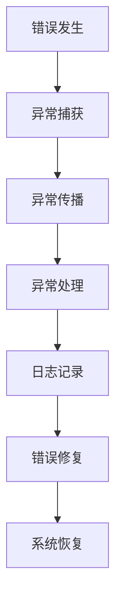

### 核心算法原理讲解

**异常捕获**：使用try-catch结构，在程序中设置监控区域，当异常发生时，进入catch块进行错误处理。

```java
try {
    // 执行可能引发异常的操作
} catch (ExceptionType e) {
    // 处理异常
}
```

**异常传播**：异常在程序中自下而上传播，直到遇到相应的catch块。

**异常处理**：根据异常的类型和严重性，执行不同的处理逻辑，如打印错误日志、显示用户友好的错误消息、尝试恢复系统等。

```java
try {
    // 执行可能引发异常的操作
} catch (IOException e) {
    // 处理IO异常
    System.out.println("IO错误：" + e.getMessage());
} catch (Exception e) {
    // 处理其他异常
    System.out.println("未知错误：" + e.getMessage());
}
```

**日志记录**：将错误信息、异常堆栈、时间戳等记录到日志文件中，便于后续分析。

```java
logger.error("错误发生：", e);
```

### 数学模型和公式

错误处理中并没有直接相关的数学模型，但其原理可以借助概率论和统计学来理解，例如，在检测和修复错误时，可以使用错误检测率的公式：

$$
\text{错误检测率} = \frac{\text{实际检测到的错误}}{\text{总错误数}}
$$

### 详细讲解与举例说明

**案例**：一个简单的Java程序，使用try-catch进行错误处理。

```java
public class ErrorHandlingExample {
    public static void main(String[] args) {
        try {
            // 执行可能引发异常的操作
            int result = divide(10, 0);
            System.out.println("结果：" + result);
        } catch (ArithmeticException e) {
            // 处理除数为零的异常
            System.out.println("错误：除数不能为零。");
        } catch (Exception e) {
            // 处理其他异常
            System.out.println("未知错误：" + e.getMessage());
        }
    }

    public static int divide(int a, int b) {
        if (b == 0) {
            throw new ArithmeticException("除数不能为零。");
        }
        return a / b;
    }
}
```

在此例中，当调用`divide`方法时，如果除数`b`为零，将抛出`ArithmeticException`异常。程序通过try-catch结构捕获并处理这个异常，打印出友好的错误消息，而不是导致程序崩溃。

### 结论

错误处理是软件开发中的基础环节，它不仅关系到系统的稳定性，也直接影响用户体验。理解并正确实现错误处理机制，可以帮助开发者构建更加可靠和高效的软件系统。通过本文的介绍，读者应能对错误处理的概念、重要性以及基本方法有更深入的理解。

## 1.2 提示词编程中的错误类型

### 背景介绍

提示词编程（Prompt-based Programming）是一种通过用户输入的提示词来引导程序执行的方法。这种编程方式在自然语言处理和交互式系统中得到广泛应用。然而，由于提示词的不确定性，提示词编程中常常会遇到各种错误类型。理解并掌握这些错误类型，对于提高代码质量和用户满意度至关重要。

### 核心概念与联系

提示词编程中的错误类型可以分为以下几类：

1. **语法错误**：由于提示词不符合编程语言的语法规则而引起的错误。
2. **运行时错误**：在程序执行过程中，由于提示词导致的不可预见的错误。
3. **异常处理**：处理程序执行中出现的非正常情况，如输入验证失败等。
4. **类型错误**：提示词与预期类型不匹配，导致类型转换错误。

**核心概念之间的关系架构**：

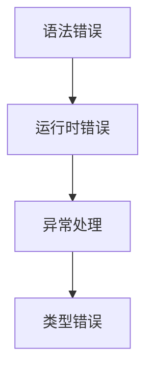

### 核心算法原理讲解

**语法错误**：语法错误是编程中最基础的错误类型，通常由于提示词中的拼写错误、缺少标点符号或语法结构不当导致。

伪代码示例：

```python
# 错误示例
print("Hello, Wrold!")  # 应该是 "World"，而不是 "Wrold"
```

**运行时错误**：运行时错误是在程序执行过程中由于提示词导致的不可预见的错误，如输入非法字符、格式错误等。

伪代码示例：

```python
# 错误示例
def divide(a, b):
    return a / b

result = divide(10, 0)  # 除数为零，导致运行时错误
```

**异常处理**：异常处理是通过捕获和处理异常，确保程序在错误发生时能够继续执行。

伪代码示例：

```python
try:
    result = divide(10, 0)
except ZeroDivisionError:
    print("除数为零，无法执行除法。")
```

**类型错误**：类型错误是由于提示词与预期类型不匹配，导致类型转换错误。

伪代码示例：

```python
# 错误示例
def add(a, b):
    return a + b

result = add("Hello", "World")  # 参数类型错误，应该为数字类型
```

### 数学模型和公式

在错误处理中，可以使用概率模型来衡量错误发生的可能性。例如，可以使用贝叶斯定理来计算错误概率：

$$
P(\text{错误}|\text{输入}) = \frac{P(\text{输入}|\text{错误}) \cdot P(\text{错误})}{P(\text{输入})}
$$

### 详细讲解与举例说明

**语法错误**：在Python中，语法错误通常在代码执行时立即被检测到，并通过错误消息指出。

```python
# 错误示例
print("Hello, World!
```

错误消息：“SyntaxError: unexpected end of file”

**运行时错误**：在执行过程中，运行时错误可能会导致程序崩溃或产生未定义的行为。

```python
# 错误示例
result = 10 / 0
```

错误消息：“ZeroDivisionError: division by zero”

**异常处理**：通过try-except块捕获并处理运行时错误。

```python
# 错误示例
try:
    result = 10 / 0
except ZeroDivisionError:
    print("除数为零，无法执行除法。")
```

**类型错误**：在执行类型相关的操作时，类型错误会导致程序抛出异常。

```python
# 错误示例
def add(a, b):
    return a + b

result = add("Hello", "World")
```

错误消息：“TypeError: can only concatenate str (not "int") to str”

### 结论

提示词编程中的错误类型多样且复杂，但通过理解其基本概念和算法原理，开发者可以更有效地定位和修复错误，提高程序的稳定性和用户体验。通过本文的介绍，读者应能更好地识别和处理提示词编程中的各种错误类型。

## 1.3 错误检测和诊断

### 背景介绍

在软件开发过程中，错误检测和诊断是确保程序质量和稳定性的关键步骤。通过有效的错误检测和诊断，可以快速定位问题并采取相应措施进行修复。本文将介绍几种常见的错误检测和诊断方法，包括静态分析和动态调试，以及调试工具的使用。

### 核心概念与联系

**静态分析**：静态分析是一种在程序运行之前对代码进行分析的方法，通过检查代码的语法、语义和结构来发现潜在的错误。静态分析工具可以自动检测代码中的常见问题，如语法错误、未使用的变量、潜在的性能瓶颈等。

**动态调试**：动态调试是一种在程序运行时对代码进行调试的方法，通过实时跟踪程序的执行过程来发现和修复错误。动态调试工具可以帮助开发者设置断点、单步执行、查看变量值等，以便更深入地理解程序行为。

**核心概念之间的关系架构**：

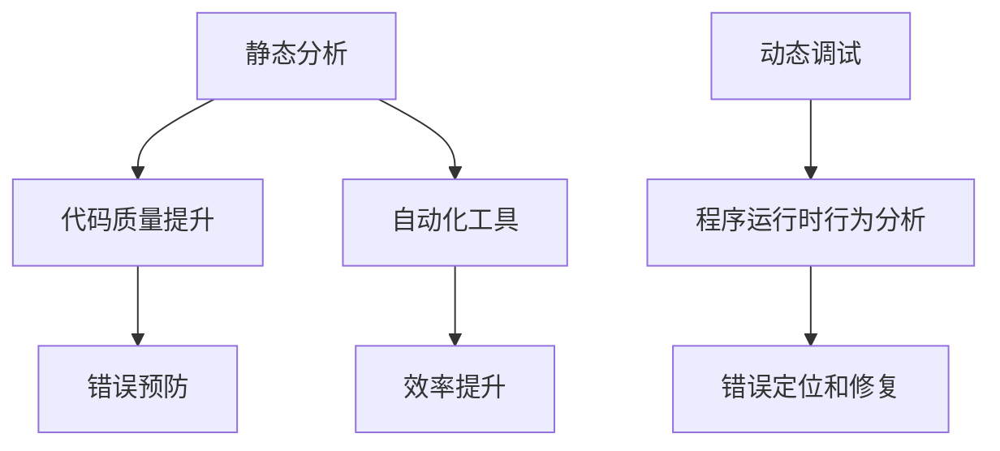

### 核心算法原理讲解

**静态分析**：静态分析的核心算法包括抽象语法树（Abstract Syntax Tree, AST）分析、控制流分析、数据流分析等。

伪代码示例：

```python
def staticAnalysis(sourceCode):
    ast = parse(sourceCode)
    checkSyntax(ast)
    checkSemantic(ast)
    return report
```

**动态调试**：动态调试的核心算法包括断点管理、执行控制、变量观察等。

伪代码示例：

```python
def dynamicDebug(executable, sourceCode):
    setupBreakpoints(executable)
    run(executable)
    while not finished():
        if reachedBreakpoint():
            showVariables()
            continueExecution()
```

### 数学模型和公式

在错误检测和诊断中，可以使用统计学方法来评估错误检测的效能。例如，可以使用精确率和召回率来衡量检测算法的性能。

$$
\text{精确率} = \frac{\text{实际检测到的错误}}{\text{总错误数}}
$$

$$
\text{召回率} = \frac{\text{实际检测到的错误}}{\text{总错误数} + \text{未检测到的错误}}
$$

### 详细讲解与举例说明

**静态分析**：使用SonarQube进行静态代码分析。

```bash
sonar-scanner -Dsonar.projectKey=my_project -Dsonar.sources=src
```

错误消息：“S00103: Unused local variable 'x'.”

**动态调试**：使用Visual Studio Debugger进行动态调试。

```bash
debug my_program.exe
```

调试步骤：
1. 设置断点。
2. 单步执行代码。
3. 查看变量值和调用栈。

**常见错误日志分析案例**：

**案例1：语法错误**

```python
# 错误代码
print("Hello, World!
```

日志消息：“SyntaxError: unexpected end of file”

**案例2：运行时错误**

```python
# 错误代码
result = 10 / 0
```

日志消息：“ZeroDivisionError: division by zero”

**案例3：异常处理**

```python
# 错误代码
try:
    result = 10 / 0
except ZeroDivisionError:
    print("除数为零，无法执行除法。")
```

日志消息：“捕获到异常：ZeroDivisionError”

### 结论

错误检测和诊断是软件开发过程中不可或缺的环节。通过静态分析和动态调试，开发者可以有效地发现和修复错误，提高代码质量和系统的稳定性。本文介绍了静态分析和动态调试的基本概念、算法原理和实际应用案例，希望读者能够掌握这些方法，并在实践中加以应用。

### 1.4 错误日志记录和分析

### 背景介绍

在软件开发过程中，错误日志（Error Logs）是一种非常重要的工具，它记录了程序运行时发生的所有错误和异常情况。通过对错误日志的记录和分析，开发人员可以快速定位和诊断问题，从而提高系统的稳定性和可靠性。本文将介绍错误日志记录的策略、常用的日志分析工具以及常见错误日志分析案例。

### 核心概念与联系

**日志记录策略**：日志记录策略是指如何选择日志的记录格式、内容以及记录频率。一个好的日志记录策略应包括以下几点：

1. **日志格式**：选择适合的日志格式，如JSON、XML或简单的文本格式。
2. **日志内容**：记录关键信息，包括时间戳、错误类型、错误信息、异常堆栈等。
3. **记录频率**：根据系统的重要性和错误发生的频率，选择合适的记录频率。

**日志分析工具**：日志分析工具是用于从日志文件中提取和分析错误信息的工具。常见的日志分析工具有：

1. **ELK栈**：包括Elasticsearch、Logstash和Kibana，是一个强大的日志分析平台。
2. **Grok**：一种用于解析日志文件的强大工具，可以将日志转换为结构化数据。
3. **Splunk**：一款功能强大的日志管理和分析平台，适用于大规模系统。

**核心概念之间的关系架构**：

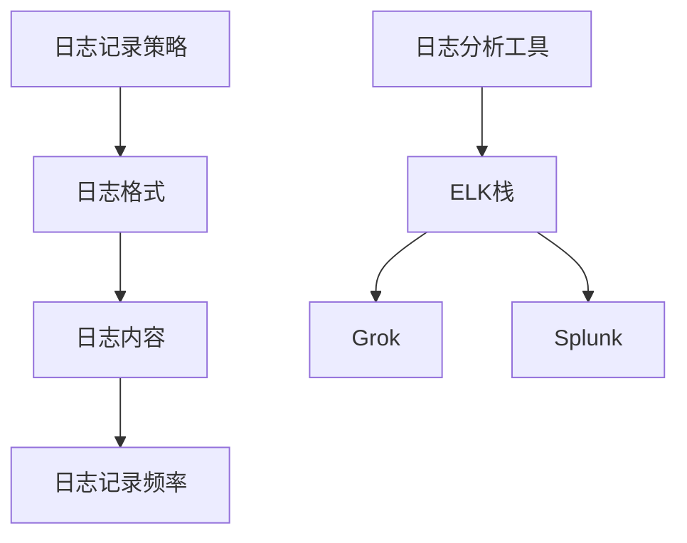

### 核心算法原理讲解

**日志记录策略**：

- **日志格式**：常用的日志格式包括JSON和XML。JSON格式由于其简洁性和易于解析的特点，广泛应用于现代日志记录中。

伪代码示例（JSON格式）：

```json
{
    "timestamp": "2023-03-15 12:34:56",
    "errorType": "SyntaxError",
    "errorMessage": "unexpected end of file",
    "stackTrace": "File 'example.py', line 10"
}
```

- **日志内容**：日志内容应包括时间戳、错误类型、错误信息、异常堆栈等。这些信息有助于快速定位和诊断问题。

- **记录频率**：日志记录频率应根据系统的需求和重要性进行调整。对于关键性系统，可以设置较高的记录频率，以便及时发现和解决问题。

**日志分析工具**：

- **ELK栈**：ELK栈是一个开源的日志分析平台，由Elasticsearch、Logstash和Kibana组成。

ELK栈工作流程：

1. **收集**：使用Logstash将日志数据导入Elasticsearch。
2. **存储**：Elasticsearch存储和管理日志数据。
3. **分析**：使用Kibana对日志数据进行分析和可视化。

- **Grok**：Grok是一种用于日志文件模式匹配的工具，可以将非结构化的日志转换为结构化的数据。

Grok表达式示例：

```grok
%{TIMESTAMP_ISO8601:timestamp} %{DATA:level} %{DATA:component} %{WORD:severity} %{GREEDYDATA:message}
```

- **Splunk**：Splunk是一款功能强大的日志管理和分析平台，支持复杂的查询和实时监控。

### 数学模型和公式

在日志分析中，可以使用统计模型来评估日志的可靠性。例如，可以使用F1分数来衡量日志分类的准确性：

$$
F1 = 2 \times \frac{Precision \times Recall}{Precision + Recall}
$$

其中，Precision表示精确率，Recall表示召回率。

### 详细讲解与举例说明

**日志记录策略**：

- **日志格式**：假设使用JSON格式记录日志。

伪代码示例：

```json
{
    "timestamp": "2023-03-15 12:34:56",
    "errorType": "IOException",
    "errorMessage": "File not found",
    "stackTrace": "File 'example.py', line 25"
}
```

- **日志内容**：记录关键信息，如时间戳、错误类型、错误信息、异常堆栈等。

- **记录频率**：对于关键性系统，可以设置每秒记录一条日志。

**日志分析工具**：

- **ELK栈**：使用Kibana分析日志。

示例查询：

```sql
SELECT * FROM logs WHERE errorType = 'IOException'
```

- **Grok**：使用Grok解析日志。

伪代码示例：

```bash
grok -N 5 '^(?<timestamp>%{TIMESTAMP_ISO8601}) (?<level>%{DATA}) (?<component>%{DATA}) (?<severity>%{WORD}) (?<message>%{GREEDYDATA})' /path/to/logfile
```

- **Splunk**：使用Splunk搜索和可视化日志。

示例查询：

```spl
search errorType="IOException" | table timestamp, level, component, severity, message
```

**常见错误日志分析案例**：

**案例1：语法错误**

日志内容：

```json
{
    "timestamp": "2023-03-15 12:35:01",
    "errorType": "SyntaxError",
    "errorMessage": "unexpected end of file",
    "stackTrace": "File 'example.py', line 10"
}
```

分析结果：定位到代码文件`example.py`的第10行，发现缺少右大括号`}`。

**案例2：运行时错误**

日志内容：

```json
{
    "timestamp": "2023-03-15 12:35:05",
    "errorType": "NullPointerException",
    "errorMessage": "Cannot invoke 'toString()' because 'this.string' is null",
    "stackTrace": "File 'example.py', line 35"
}
```

分析结果：定位到代码文件`example.py`的第35行，发现`string`变量未被初始化。

**案例3：异常处理**

日志内容：

```json
{
    "timestamp": "2023-03-15 12:35:10",
    "errorType": "NumberFormatException",
    "errorMessage": "For input string: \"abc\"",
    "stackTrace": "File 'example.py', line 45"
}
```

分析结果：定位到代码文件`example.py`的第45行，发现输入字符串无法转换为数字。

### 结论

错误日志记录和分析是软件开发中不可或缺的一环。通过合理的日志记录策略和高效的日志分析工具，开发人员可以迅速定位和解决错误，提高系统的稳定性和可靠性。本文介绍了日志记录策略、日志分析工具和常见错误日志分析案例，希望读者能够在实际工作中运用这些知识，提高编程技能。

## 2.1 代码级错误处理

### 背景介绍

在软件开发过程中，代码级错误处理是确保程序稳定运行的关键环节。代码级错误处理包括异常捕获和传播、常见异常处理模式以及代码审查和测试策略。本文将详细探讨这些内容，帮助开发者更好地理解和实施代码级错误处理。

### 核心概念与联系

**异常捕获和传播**：异常捕获是指在程序中设置监控点，当异常发生时，捕获并处理。异常传播则是指异常在程序中的传递过程，从异常发生点传递到适当的处理模块。

**常见异常处理模式**：常见的异常处理模式包括try-catch块、异常链和finally块等。每种模式都有其特定的应用场景。

**代码审查和测试策略**：代码审查和测试是发现和修复代码级错误的重要手段。通过严格的代码审查和全面的测试，可以降低错误率，提高代码质量。

**核心概念之间的关系架构**：

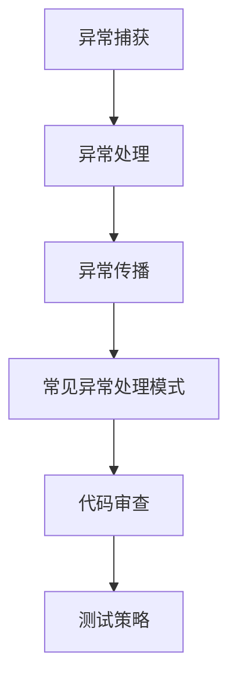

### 核心算法原理讲解

**异常捕获和传播**：

伪代码示例：

```python
def function1():
    try:
        # 执行可能引发异常的操作
        function2()
    except Exception as e:
        # 处理异常
        print("捕获到异常：", e)

def function2():
    # 引发异常
    raise ValueError("参数错误")

# 调用函数
function1()
```

在此例中，当`function2`引发`ValueError`异常时，`function1`的`except`块会捕获并处理该异常。

**常见异常处理模式**：

1. **try-catch块**：用于捕获和处理异常。

伪代码示例：

```python
try:
    # 执行可能引发异常的操作
except ExceptionType as e:
    # 处理特定类型的异常
except Exception as e:
    # 处理其他类型的异常
finally:
    # 无论是否发生异常，都会执行的代码
```

2. **异常链**：将多个异常捕获和处理。

伪代码示例：

```python
try:
    # 外层try块
    try:
        # 内层try块
        function1()
    except ValueError as e:
        # 处理内层异常
except KeyError as e:
    # 处理外层异常
```

3. **finally块**：无论是否发生异常，都会执行的代码块。

伪代码示例：

```python
try:
    # 执行可能引发异常的操作
finally:
    # 无论是否发生异常，都会执行的代码
```

**代码审查和测试策略**：

1. **代码审查**：通过同行评审，发现和修复代码中的潜在错误。

伪代码示例：

```python
def review_code(source_code):
    # 检查语法错误
    check_syntax(source_code)
    # 检查逻辑错误
    check_logic(source_code)
    # 检查代码风格
    check_style(source_code)
```

2. **测试策略**：包括单元测试、集成测试和系统测试等。

伪代码示例：

```python
def test_function():
    # 单元测试
    assert function1(1, 2) == 3
    # 集成测试
    assert system1() == "result1"
    # 系统测试
    assert system2() == "result2"
```

### 数学模型和公式

在异常处理中，可以使用概率模型来评估异常发生的概率。例如，可以使用条件概率来计算异常发生的概率：

$$
P(\text{异常}|\text{输入}) = \frac{P(\text{输入}|\text{异常}) \cdot P(\text{异常})}{P(\text{输入})}
$$

### 详细讲解与举例说明

**异常捕获和传播**：

```python
# 引发异常的函数
def divide(a, b):
    if b == 0:
        raise ValueError("除数不能为零。")
    return a / b

# 调用的函数
def main():
    try:
        result = divide(10, 0)
        print("结果：", result)
    except ValueError as e:
        print("错误：", e)

# 执行程序
main()
```

在此例中，当调用`divide`函数时，如果除数为零，将引发`ValueError`异常。`main`函数通过`try-except`块捕获并处理该异常，避免了程序崩溃。

**常见异常处理模式**：

```python
# 使用try-catch块处理异常
try:
    # 执行可能引发异常的操作
except ExceptionType as e:
    # 处理特定类型的异常
except Exception as e:
    # 处理其他类型的异常
finally:
    # 无论是否发生异常，都会执行的代码

# 使用异常链处理多个异常
try:
    # 外层try块
    try:
        # 内层try块
        function1()
    except ValueError as e:
        # 处理内层异常
except KeyError as e:
    # 处理外层异常
finally:
    # 无论是否发生异常，都会执行的代码

# 使用finally块
try:
    # 执行可能引发异常的操作
finally:
    # 无论是否发生异常，都会执行的代码
```

**代码审查和测试策略**：

1. **代码审查**：

```python
# 检查语法错误
def check_syntax(source_code):
    # 使用语法分析工具检查代码
    pass

# 检查逻辑错误
def check_logic(source_code):
    # 检查代码逻辑是否合理
    pass

# 检查代码风格
def check_style(source_code):
    # 使用代码风格检查工具检查代码
    pass
```

2. **测试策略**：

```python
# 单元测试
def test_divide():
    assert divide(10, 2) == 5
    assert divide(10, 0) == None  # 应当捕获异常

# 集成测试
def test_system():
    assert system1() == "result1"
    assert system2() == "result2"

# 系统测试
def test_complete_system():
    # 测试整个系统的功能
    pass
```

### 结论

代码级错误处理是确保程序稳定运行的重要环节。通过理解并实施异常捕获和传播、常见异常处理模式以及代码审查和测试策略，开发者可以有效地发现和修复代码中的错误，提高代码质量和系统的稳定性。本文详细讲解了这些概念和方法，并提供了实际应用示例，希望读者能够灵活运用，提升编程能力。

## 2.2 运行时错误处理

### 背景介绍

运行时错误（Run-time Errors）是软件在执行过程中由于各种原因导致的异常情况，如内存泄漏、资源竞争、死锁和代码性能问题等。有效的运行时错误处理对于确保软件系统的稳定性和高效性至关重要。本文将详细介绍几种常见的运行时错误处理方法，包括内存管理错误、资源竞争、死锁和代码性能优化。

### 核心概念与联系

**内存管理错误**：内存管理错误包括内存泄漏、野指针和堆溢出等。这些错误会导致程序性能下降，甚至导致程序崩溃。

**资源竞争**：资源竞争是指多个线程或进程同时访问共享资源，导致数据不一致或系统性能下降。

**死锁**：死锁是指多个线程或进程在等待对方释放资源时陷入无限等待的状态，导致系统瘫痪。

**代码性能优化**：代码性能优化包括算法优化、代码重写和资源利用优化等。有效的性能优化可以提高程序的执行效率。

**核心概念之间的关系架构**：

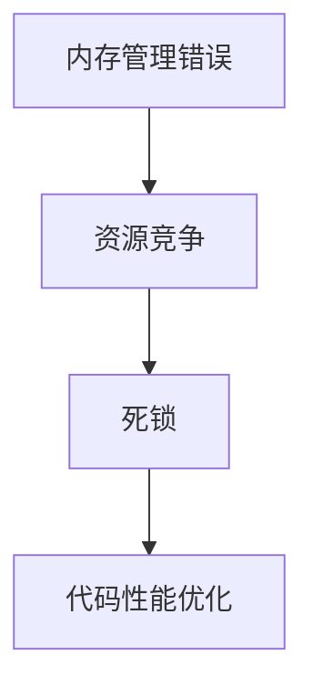

### 核心算法原理讲解

**内存管理错误**：

- **内存泄漏**：内存泄漏是指程序在分配内存后，未能及时释放，导致内存资源被占用。

伪代码示例：

```c++
class MemoryLeak {
    int* array = new int[100];  // 分配内存
    // ...
    delete[] array;  // 及时释放内存
}
```

- **野指针**：野指针是指未被初始化或已被释放的指针，其指向的内存地址不确定。

伪代码示例：

```c++
int* pointer = nullptr;  // 初始化为空指针
*pointer = 10;  // 引发野指针错误
```

- **堆溢出**：堆溢出是指程序在堆空间中分配的内存过多，导致堆空间不足。

伪代码示例：

```c++
void allocateMemory(int n) {
    for (int i = 0; i < n; ++i) {
        int* p = new int[1000000];  // 大量分配内存
        delete[] p;  // 及时释放内存
    }
}
```

**资源竞争**：

- **互斥锁**：互斥锁（Mutex）是一种用于保护共享资源的同步机制，确保同一时间只有一个线程能访问资源。

伪代码示例：

```java
class Resource {
    private final Object lock = new Object();

    public void accessResource() {
        synchronized (lock) {
            // 访问共享资源
        }
    }
}
```

- **信号量**：信号量是一种用于控制多个线程访问共享资源的同步机制。

伪代码示例：

```c++
semaphore semaphore = 1;

void threadFunction() {
    wait(&semaphore);  // 等待信号量
    // 访问共享资源
    signal(&semaphore);  // 释放信号量
}
```

**死锁**：

- **资源分配图**：资源分配图是一种用于分析死锁的方法，通过图论中的循环等待条件来判断系统是否处于死锁状态。

伪代码示例：

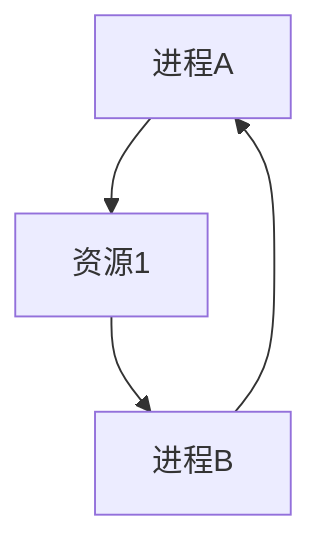

- **预防死锁**：通过资源分配策略，避免系统进入死锁状态。

伪代码示例：

```java
void requestResource(int resourceID) {
    if (resourceAvailable(resourceID)) {
        acquireResource(resourceID);  // 获取资源
        // ...
        releaseResource(resourceID);  // 释放资源
    } else {
        // 等待资源或处理其他逻辑
    }
}
```

**代码性能优化**：

- **算法优化**：通过改进算法，降低时间复杂度和空间复杂度。

伪代码示例：

```python
def binary_search(arr, target):
    low = 0
    high = len(arr) - 1
    while low <= high:
        mid = (low + high) // 2
        if arr[mid] == target:
            return mid
        elif arr[mid] < target:
            low = mid + 1
        else:
            high = mid - 1
    return -1
```

- **代码重写**：通过重写代码，提高代码的可读性和可维护性。

伪代码示例：

```java
// 原始代码
public void processOrders(List<Order> orders) {
    for (Order order : orders) {
        if (order.isPriority()) {
            // 处理优先订单
        } else {
            // 处理普通订单
        }
    }
}
// 重写代码
public void processOrders(List<Order> orders) {
    List<Order> priorityOrders = new ArrayList<>();
    List<Order> regularOrders = new ArrayList<>();
    for (Order order : orders) {
        if (order.isPriority()) {
            priorityOrders.add(order);
        } else {
            regularOrders.add(order);
        }
    }
    processOrders(priorityOrders);
    processOrders(regularOrders);
}
```

- **资源利用优化**：通过优化资源利用，提高系统性能。

伪代码示例：

```python
# 原始代码
def process_data(data):
    for item in data:
        process_item(item)
# 优化代码
def process_data(data):
    pool = ThreadPoolExecutor(max_workers=10)
    futures = [pool.submit(process_item, item) for item in data]
    for future in as_completed(futures):
        future.result()
    pool.shutdown(wait=True)
```

### 数学模型和公式

在运行时错误处理中，可以使用排队论模型来分析系统性能。例如，可以使用服务时间和服务率来评估系统的响应时间和吞吐量。

$$
\text{响应时间} = \frac{\text{服务时间}}{\text{服务率}}
$$

$$
\text{吞吐量} = \frac{\text{服务率}}{\text{系统延迟}}
$$

### 详细讲解与举例说明

**内存管理错误**：

```c++
// 内存泄漏示例
void MemoryLeakDemo() {
    int* pointer = new int[100];
    // ...
    // 未释放内存
}

// 野指针示例
void WildPointerDemo() {
    int* pointer = nullptr;
    *pointer = 10;  // 引发野指针错误
}

// 堆溢出示例
void HeapOverflowDemo() {
    for (int i = 0; i < 1000; ++i) {
        int* p = new int[1000000];
        delete[] p;
    }
}
```

**资源竞争**：

```java
// 互斥锁示例
public class Resource {
    private final Object lock = new Object();

    public void accessResource() {
        synchronized (lock) {
            // 访问共享资源
        }
    }
}

// 信号量示例
public class SemaphoreDemo {
    private Semaphore semaphore = new Semaphore(1);

    public void threadFunction() {
        try {
            semaphore.acquire();
            // 访问共享资源
            semaphore.release();
        } catch (InterruptedException e) {
            e.printStackTrace();
        }
    }
}
```

**死锁**：


**代码性能优化**：

```python
# 原始代码
def process_data(data):
    for item in data:
        process_item(item)

# 优化后的代码
from concurrent.futures import ThreadPoolExecutor

def process_data(data):
    with ThreadPoolExecutor(max_workers=10) as executor:
        futures = [executor.submit(process_item, item) for item in data]
        for future in futures:
            future.result()
```

### 结论

运行时错误处理是确保软件系统稳定性和高效性的重要环节。通过理解和掌握内存管理错误、资源竞争、死锁和代码性能优化的方法，开发者可以有效地解决运行时错误，提高系统的性能和可靠性。本文详细介绍了这些概念和算法，并通过示例展示了实际应用，希望读者能够在实践中运用这些知识，提升编程能力。

## 2.3 异常处理和恢复

### 背景介绍

异常处理和恢复是软件工程中至关重要的一部分，它涉及如何有效地识别、处理和恢复程序执行中的异常情况。有效的异常处理不仅能够避免程序崩溃，还能提升用户体验和系统的稳定性。本文将详细探讨异常处理的基本概念、常见的异常处理模式，并分析异常处理中可能遇到的问题。

### 核心概念与联系

**异常处理的基本概念**：异常处理是指当程序执行过程中出现非正常情况（异常）时，系统如何响应和处理这些情况。异常处理包括以下几个关键概念：

1. **异常**：指程序执行过程中出现的非正常情况。
2. **异常捕获**：在程序中设置监控点，当异常发生时，捕获并处理。
3. **异常传播**：异常在程序中的传递过程，从异常发生点传递到适当的处理模块。
4. **异常处理**：对捕获的异常进行处理，可能包括记录日志、显示错误信息、恢复操作等。

**异常处理的基本概念之间的关系架构**：

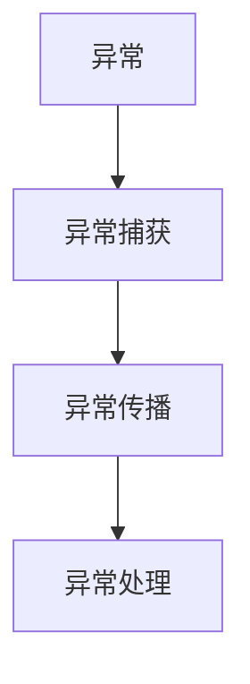

**常见的异常处理模式**：在实际编程中，常见的异常处理模式包括try-catch块、异常链和finally块。

1. **try-catch块**：try块用于包围可能引发异常的代码，catch块用于处理捕获到的异常。

2. **异常链**：异常链是一种将多个异常进行链式处理的方法，以便更清晰地传递和处理异常。

3. **finally块**：finally块中的代码无论是否发生异常都会执行，通常用于释放资源或执行清理操作。

**常见的异常处理模式之间的关系架构**：

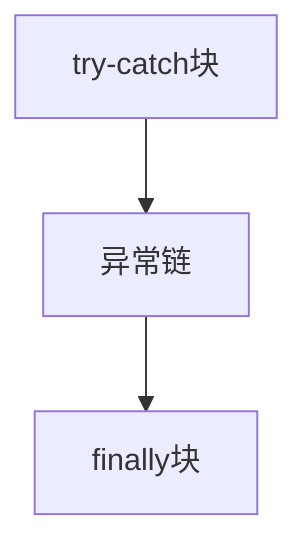

### 核心算法原理讲解

**异常处理的基本概念**：

- **异常捕获**：通过try-catch结构，在程序中设置监控区域，当异常情况发生时，进入catch块进行错误处理。

伪代码示例：

```java
try {
    // 执行可能引发异常的操作
} catch (ExceptionType e) {
    // 处理异常
}
```

- **异常传播**：异常在程序中自下而上传播，直到遇到相应的catch块。

- **异常处理**：根据异常的类型和严重性，执行不同的处理逻辑，如记录日志、显示错误信息、尝试恢复系统等。

伪代码示例：

```java
try {
    // 执行可能引发异常的操作
} catch (IOException e) {
    // 处理IO异常
    logger.error("IO错误：", e);
} catch (Exception e) {
    // 处理其他异常
    logger.error("未知错误：", e);
} finally {
    // 清理资源或执行其他必要的操作
}
```

**常见的异常处理模式**：

1. **try-catch块**：用于捕获和处理特定类型的异常。

伪代码示例：

```python
try:
    # 执行可能引发异常的操作
except ExceptionType as e:
    # 处理异常
finally:
    # 无论是否发生异常，都会执行的代码
```

2. **异常链**：将多个异常进行链式处理。

伪代码示例：

```java
try {
    // 执行可能引发异常的操作
} catch (ExceptionType1 e1) {
    // 处理第一个异常
    throw new ExceptionType2("第二个异常", e1);
}
```

3. **finally块**：确保无论是否发生异常，都会执行某些操作，如释放资源。

伪代码示例：

```java
try {
    // 执行可能引发异常的操作
} finally {
    // 清理资源或执行其他必要的操作
}
```

### 数学模型和公式

在异常处理中，可以使用概率模型来评估异常发生的概率。例如，可以使用贝叶斯定理来计算异常发生的概率：

$$
P(\text{异常}|\text{输入}) = \frac{P(\text{输入}|\text{异常}) \cdot P(\text{异常})}{P(\text{输入})}
$$

### 详细讲解与举例说明

**异常处理的基本概念**：

- **异常捕获**：

```python
try:
    # 执行可能引发异常的操作
    result = divide(10, 0)
except ZeroDivisionError as e:
    # 处理除数为零的异常
    print("错误：除数不能为零。")
```

- **异常传播**：

```python
def function1():
    # 引发异常
    raise ValueError("参数错误")

def function2():
    try:
        function1()
    except ValueError as e:
        # 处理异常
        print("捕获到异常：", e)

# 调用函数
function2()
```

- **异常处理**：

```python
try:
    # 执行可能引发异常的操作
except ExceptionType1 as e1:
    # 处理第一个异常
    logger.error("异常1：", e1)
except ExceptionType2 as e2:
    # 处理第二个异常
    logger.error("异常2：", e2)
finally:
    # 清理资源或执行其他必要的操作
    cleanup()
```

**常见的异常处理模式**：

1. **try-catch块**：

```python
try:
    # 执行可能引发异常的操作
except ExceptionType as e:
    # 处理异常
else:
    # 正常执行完成
finally:
    # 无论是否发生异常，都会执行的代码
```

2. **异常链**：

```python
try:
    # 执行可能引发异常的操作
except ExceptionType1 as e1:
    # 处理第一个异常
    try:
        # 执行第二个操作，可能引发不同类型的异常
    except ExceptionType2 as e2:
        # 处理第二个异常
        raise e1  # 重新抛出第一个异常
```

3. **finally块**：

```python
try:
    # 执行可能引发异常的操作
finally:
    # 清理资源或执行其他必要的操作
```

### 结论

异常处理和恢复是确保软件系统稳定性和可靠性的重要手段。通过理解异常处理的基本概念、常见的异常处理模式，以及如何在实践中处理和恢复异常，开发者可以构建更加健壮和高效的软件系统。本文详细介绍了异常处理的核心概念、算法原理和实际应用示例，希望读者能够灵活运用，提高编程能力。

## 2.4 提高代码健壮性

### 背景介绍

在软件开发生命周期中，提高代码健壮性（Robustness）是一个持续且重要的目标。健壮的代码能够有效应对各种异常情况，如输入错误、系统资源不足、网络异常等，从而确保系统的稳定性和可靠性。本文将讨论几种提高代码健壮性的策略和方法，包括错误处理策略、防御式编程和预防错误的方法。

### 核心概念与联系

**错误处理策略**：错误处理策略是指如何设计和实施一套机制，以识别、处理和恢复程序执行中的错误。有效的错误处理策略应包括以下几个方面：

1. **异常捕获**：在关键操作中捕获可能出现的异常。
2. **错误日志**：记录详细的错误日志，便于问题追踪和分析。
3. **错误恢复**：在出现错误时，尝试进行恢复操作，以继续程序的执行。

**防御式编程**：防御式编程是一种编程风格，旨在通过编写额外的检查和验证代码，防止错误的发生。它强调在代码中添加保护机制，以避免潜在的错误。

**核心概念之间的关系架构**：

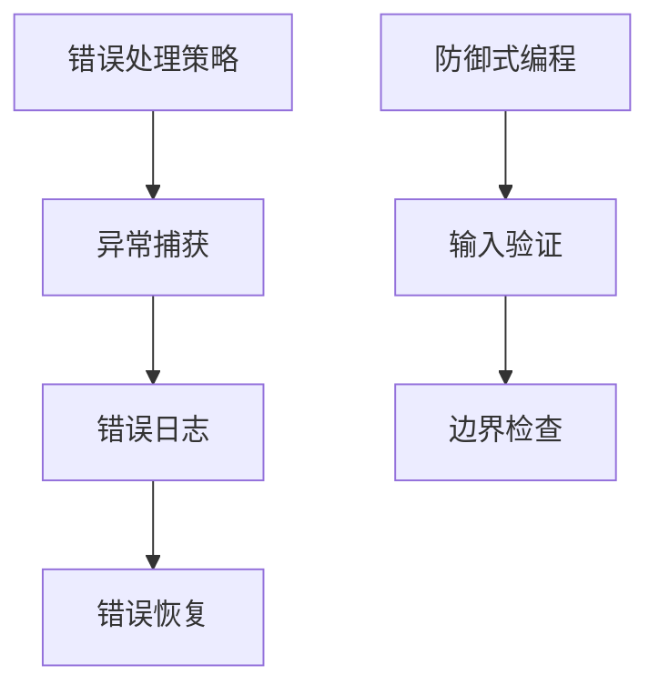

### 核心算法原理讲解

**错误处理策略**：

1. **异常捕获**：通过try-catch结构，在关键操作中捕获异常，并执行相应的错误处理逻辑。

伪代码示例：

```python
try:
    # 执行可能引发异常的操作
except ExceptionType as e:
    # 处理异常
    handle_error(e)
```

2. **错误日志**：记录详细的错误日志，包括错误类型、错误信息、时间戳等，便于问题追踪和分析。

伪代码示例：

```python
def log_error(error):
    with open("error.log", "a") as f:
        f.write(f"{datetime.now()} - {error}\n")
```

3. **错误恢复**：在出现错误时，尝试进行恢复操作，以继续程序的执行。

伪代码示例：

```python
def recover_from_error():
    try:
        # 尝试恢复操作
    except Exception as e:
        # 如果恢复失败，重新抛出异常
        raise
```

**防御式编程**：

1. **输入验证**：对用户输入进行严格的验证，确保输入数据符合预期格式和范围。

伪代码示例：

```python
def validate_input(input_value):
    if not is_valid_format(input_value):
        raise ValueError("输入格式错误")
    if not is_in_range(input_value):
        raise ValueError("输入范围错误")
```

2. **边界检查**：对程序的边界条件进行检查，防止越界和非法访问。

伪代码示例：

```python
def access_array(index, array):
    if index < 0 or index >= array.length:
        raise IndexError("索引越界")
    return array[index]
```

**预防错误的方法**：

1. **代码审查**：通过同行评审，发现和修复代码中的潜在错误。

伪代码示例：

```python
def review_code(source_code):
    # 检查语法错误
    check_syntax(source_code)
    # 检查逻辑错误
    check_logic(source_code)
    # 检查代码风格
    check_style(source_code)
```

2. **自动化测试**：通过编写和执行自动化测试，确保代码的正确性和稳定性。

伪代码示例：

```python
def test_function():
    # 执行测试用例
    assert function1() == expected_result
    assert function2() == expected_result
```

### 数学模型和公式

在错误处理和防御式编程中，可以使用概率模型来评估错误发生的概率。例如，可以使用条件概率来计算错误发生的概率：

$$
P(\text{错误}|\text{输入}) = \frac{P(\text{输入}|\text{错误}) \cdot P(\text{错误})}{P(\text{输入})}
$$

### 详细讲解与举例说明

**错误处理策略**：

- **异常捕获**：

```python
def divide(a, b):
    try:
        return a / b
    except ZeroDivisionError as e:
        log_error(e)
        return None

result = divide(10, 0)
```

- **错误日志**：

```python
import logging

def log_error(error):
    logging.error(f"错误：{error}", exc_info=True)

log_error(ZeroDivisionError("除数为零。"))
```

- **错误恢复**：

```python
def read_file(file_path):
    try:
        with open(file_path, 'r') as f:
            return f.read()
    except FileNotFoundError as e:
        log_error(e)
        return None

content = read_file("nonexistent_file.txt")
```

**防御式编程**：

- **输入验证**：

```python
def process_form_data(data):
    if not is_valid_email(data['email']):
        raise ValueError("无效的电子邮件地址")
    if not is_valid_password(data['password']):
        raise ValueError("无效的密码")

process_form_data({'email': 'invalid_email', 'password': '123'})
```

- **边界检查**：

```python
def get_user_age(birth_year):
    current_year = datetime.now().year
    age = current_year - birth_year
    if age < 0 or age > 120:
        raise ValueError("无效的年龄")
    return age

get_user_age(1900)
```

**预防错误的方法**：

- **代码审查**：

```python
def review_code(source_code):
    syntax_errors = check_syntax(source_code)
    logic_errors = check_logic(source_code)
    style_errors = check_style(source_code)
    if syntax_errors or logic_errors or style_errors:
        raise CodeReviewFailed("代码审查失败")

review_code("example.py")
```

- **自动化测试**：

```python
def test_divide():
    assert divide(10, 2) == 5
    assert divide(10, 0) is None

test_divide()
```

### 结论

提高代码健壮性是软件开发中的一个关键目标，通过实施有效的错误处理策略、防御式编程和预防错误的方法，开发者可以构建出更加稳定和可靠的软件系统。本文详细介绍了这些策略和方法，并通过实际案例进行了说明，希望读者能够在实践中应用这些知识，提升代码质量。

## 3.1 调试工具的使用

### 背景介绍

调试工具是软件开发过程中不可或缺的辅助工具，用于帮助开发者识别、分析和修复程序中的错误。通过使用调试工具，开发者可以深入理解程序的执行流程，快速定位错误点，并采取相应的措施进行修正。本文将介绍几种常用的调试工具，包括GDB、Visual Studio Debugger和PyCharm Debugger，以及它们的基本功能和常见用法。

### 核心概念与联系

**调试工具的基本功能**：调试工具通常包括以下基本功能：

1. **断点设置**：在代码中设置断点，使程序在特定行或条件满足时暂停执行。
2. **单步执行**：逐行或逐函数执行代码，观察变量和程序状态的变化。
3. **变量查看**：查看当前作用域中变量的值，帮助分析程序执行过程中的变量变化。
4. **调用栈查看**：显示当前函数的调用栈，帮助定位错误发生的具体位置。

**常见调试工具之间的关系架构**：

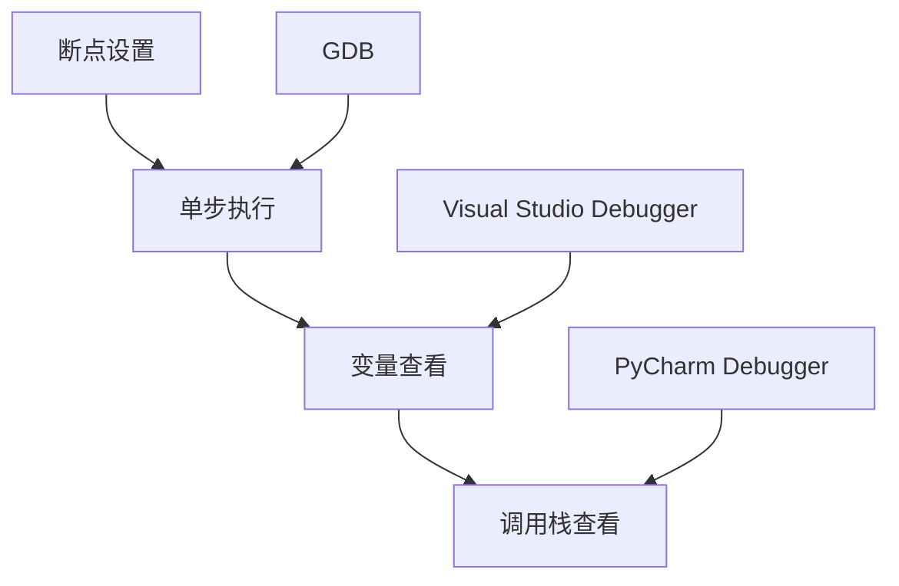

### 核心算法原理讲解

**GDB**：GDB（GNU Debugger）是Linux平台上常用的调试工具，支持C、C++、Fortran等多种编程语言的调试。

1. **基本用法**：

    - `gdb [program]`：启动GDB调试程序。
    - `run`：开始执行程序。
    - `break [line_number]|[function_name]`：在指定行号或函数名处设置断点。
    - `next`/`step`：逐行或逐函数执行代码。
    - `print [variable_name]`：查看变量值。
    - `backtrace`：显示调用栈。

伪代码示例：

```bash
gdb ./my_program
(gdb) run
(gdb) break main
(gdb) next
(gdb) print x
(gdb) backtrace
```

**Visual Studio Debugger**：Visual Studio Debugger是微软开发的集成调试工具，适用于C++、C#等多种编程语言。

1. **基本用法**：

    - `Debug` > `Start Debugging`：开始调试程序。
    - `Toggle Breakpoint`：设置或清除断点。
    - `Step Into`/`Step Over`/`Step Out`：逐行或逐函数执行代码。
    - `Watch`：添加监视变量。
    - `Call Stack`：查看调用栈。

伪代码示例：

```csharp
// 设置断点
break main
// 开始调试
start_debugging
// 单步执行
step_into
// 查看变量值
watch x
// 查看调用栈
call_stack
```

**PyCharm Debugger**：PyCharm Debugger是JetBrains开发的Python调试工具。

1. **基本用法**：

    - `Run` > `Edit Configurations`：配置调试参数。
    - `Toggle Breakpoint`：设置或清除断点。
    - `Step Into`/`Step Over`/`Step Out`：逐行或逐函数执行代码。
    - `Watch`：添加监视变量。
    - `Variables`：查看当前作用域中的变量。

伪代码示例：

```python
# 设置断点
break line_number
# 开始调试
run
# 单步执行
step_into
# 查看变量值
watch variable
# 查看调用栈
print_call_stack
```

### 数学模型和公式

在调试过程中，可以使用状态转移图（State Transition Graph）来表示程序的执行状态和转移路径，帮助理解程序的运行逻辑。状态转移图包括以下要素：

- **状态**：程序在某一时刻的状态。
- **转移**：导致状态变化的事件。
- **条件**：触发状态转移的条件。

状态转移图可以用以下公式表示：

$$
\text{状态转移图} = \langle S, E, T, C \rangle
$$

其中，\( S \) 是状态集，\( E \) 是转移集，\( T \) 是初始状态，\( C \) 是条件集。

### 详细讲解与举例说明

**GDB**：

```bash
# 编译程序
gcc -g my_program.c -o my_program
# 启动GDB调试
gdb ./my_program
# 设置断点
break main
# 运行程序
run
# 单步执行
next
# 查看变量值
print x
# 查看调用栈
backtrace
```

**Visual Studio Debugger**：

1. **设置断点**：

    在代码行左侧点击设置断点。
2. **开始调试**：

    `Debug` > `Start Debugging`。
3. **单步执行**：

    `Step Into` 或 `Step Over`。
4. **查看变量值**：

    在变量上点击右键，选择“查看值”。
5. **查看调用栈**：

    `View` > `Call Stack`。

**PyCharm Debugger**：

1. **设置断点**：

    在代码行左侧点击设置断点。
2. **开始调试**：

    `Run` > `Debug`。
3. **单步执行**：

    `Step Into` 或 `Step Over`。
4. **查看变量值**：

    在变量上点击右键，选择“查看值”。
5. **查看调用栈**：

    `Run` > `Show Run Debug Window`，查看调用栈窗口。

### 结论

调试工具在软件开发过程中扮演着重要角色，通过合理使用这些工具，开发者可以更加高效地识别和修复程序中的错误。本文介绍了GDB、Visual Studio Debugger和PyCharm Debugger的基本功能和常见用法，并通过实际操作示例展示了如何使用这些工具进行调试。希望读者能够在实际项目中运用这些调试技巧，提高编程效率。

## 3.2 调试方法和策略

### 背景介绍

调试是软件开发过程中不可或缺的一部分，它有助于开发者识别和修复程序中的错误。有效的调试方法能够显著提高开发效率和代码质量。本文将介绍几种常用的调试方法和策略，包括回溯法、分而治之和逐步细化，并结合实际案例进行分析。

### 核心概念与联系

**回溯法**：回溯法是一种通过逆向回溯找到错误根源的方法。当程序出现问题时，回溯法从错误点开始，逐步回退到程序起始点，检查每一步的操作是否正确。

**分而治之**：分而治之是一种将复杂问题分解为子问题，然后分别解决的方法。在调试过程中，通过将程序分成多个模块或函数，逐一调试和验证。

**逐步细化**：逐步细化是一种通过逐步添加代码和测试，逐步缩小错误范围的方法。在调试过程中，通过逐步增加和测试功能模块，帮助定位错误。

**核心概念之间的关系架构**：

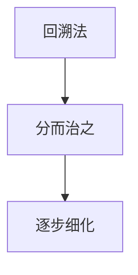

### 核心算法原理讲解

**回溯法**：

伪代码示例：

```python
def debug_function():
    # 执行一系列操作
    if condition:
        # 如果条件满足，执行以下操作
        raise ValueError("错误：条件不满足")
    # 其他操作
```

调试步骤：

1. 执行程序，观察错误是否发生。
2. 当错误发生时，记录错误信息和调用栈。
3. 从错误点开始，逆向检查每一步的操作，查找可能导致错误的原因。

**分而治之**：

伪代码示例：

```python
def complex_function(a, b):
    # 复杂计算
    result = a * b
    # 验证结果
    if result != expected_result:
        raise ValueError("错误：结果错误")
    # 其他操作
```

调试步骤：

1. 将`complex_function`分解为多个子函数，分别调试和验证。
2. 对每个子函数进行检查，确保其功能正常。
3. 结合子函数的结果，验证整体功能。

**逐步细化**：

伪代码示例：

```python
def build_car():
    # 构建汽车
    build_engine()
    build_body()
    build_wheels()
    # 测试汽车
    test_car()
```

调试步骤：

1. 按顺序执行构建步骤，观察每个步骤是否正常。
2. 对每个步骤添加测试代码，验证其功能。
3. 逐步增加测试用例，缩小错误范围。

### 数学模型和公式

在调试过程中，可以使用状态空间搜索算法（如回溯法）来表示程序的执行状态和错误查找过程。状态空间搜索算法包括以下要素：

- **状态**：程序在某一时刻的状态。
- **操作**：导致状态变化的操作。
- **状态空间树**：表示程序所有可能状态的结构。

状态空间搜索算法可以用以下公式表示：

$$
\text{状态空间搜索} = \langle S, O, T \rangle
$$

其中，\( S \) 是状态集，\( O \) 是操作集，\( T \) 是初始状态。

### 详细讲解与举例说明

**回溯法**：

**案例**：调试一个简单的计算器程序。

```python
def calculate_expression(expression):
    # 解析表达式
    tokens = parse_expression(expression)
    # 计算结果
    result = evaluate_expression(tokens)
    # 验证结果
    if result != expected_result:
        raise ValueError("错误：结果错误")
    return result
```

调试步骤：

1. 执行`calculate_expression`函数，输入一个错误表达式。
2. 当错误发生时，记录错误信息和调用栈。
3. 从错误点开始，逆向检查每一步的操作，查找可能导致错误的原因。

**分而治之**：

**案例**：调试一个复杂的计算函数。

```python
def complex_computation(a, b):
    # 子函数1
    result1 = sub_function1(a)
    # 子函数2
    result2 = sub_function2(b)
    # 合并结果
    result = result1 * result2
    return result
```

调试步骤：

1. 分别调试`sub_function1`和`sub_function2`，确保其功能正常。
2. 结合`sub_function1`和`sub_function2`的结果，验证整体功能。

**逐步细化**：

**案例**：调试一个汽车构建程序。

```python
def build_car():
    build_engine()
    build_body()
    build_wheels()
    test_car()
```

调试步骤：

1. 分别执行构建引擎、车身和车轮的步骤，观察每个步骤是否正常。
2. 对每个步骤添加测试代码，验证其功能。
3. 结合所有构建步骤，测试整体汽车的功能。

### 结论

调试方法和策略在软件开发中至关重要，通过合理运用回溯法、分而治之和逐步细化，开发者可以高效地识别和修复程序中的错误。本文介绍了这些调试方法和策略，并通过实际案例进行了说明，希望读者能够在实际项目中灵活运用这些技巧，提高编程效率。

## 3.3 调试案例研究

### 背景介绍

在本节中，我们将通过两个调试案例，详细描述调试的过程，包括问题的发现、分析和解决步骤。这些案例涵盖了从简单到复杂的错误情况，旨在帮助读者理解调试技巧和策略的实际应用。

### 案例一：简单的语法错误调试

#### 问题描述

一个Python程序在运行时抛出了`SyntaxError`，提示在文件`main.py`的第5行存在语法错误。

#### 调试步骤

1. **问题发现**：
    - 程序在运行时直接抛出`SyntaxError`，终端显示错误信息和文件名及行号。

2. **问题分析**：
    - 根据错误信息，定位到`main.py`的第5行。

3. **问题解决**：
    - 打开`main.py`文件，检查第5行的代码，发现缺少了括号。
    - 修复错误：在`print`语句中添加括号。
    - 重启程序，确认错误已解决。

#### 代码解读

```python
# 错误代码
print "Hello, World!"

# 修复后的代码
print("Hello, World!")
```

#### 代码应用解读与分析

修复后的代码使用了Python的字符串格式化方法，避免了语法错误。通过简单地添加括号，我们解决了这个简单的语法错误。

### 案例二：复杂的运行时错误调试

#### 问题描述

一个复杂的Java程序在执行一个大型数据分析任务时，突然抛出`OutOfMemoryError`，导致程序崩溃。

#### 调试步骤

1. **问题发现**：
    - 程序运行到一半时突然停止，终端显示`OutOfMemoryError`。

2. **问题分析**：
    - 分析错误日志，发现错误信息指向了内存不足。
    - 查看程序内存使用情况，发现内存使用率达到了100%。

3. **问题解决**：
    - 增加JVM的堆内存大小。
    - 重新运行程序，监控内存使用情况。
    - 通过调试器逐步执行代码，发现内存泄露问题。

4. **解决方案细化**：
    - 使用内存泄漏检测工具（如MAT）分析内存泄露的根源。
    - 定位到内存泄露的具体代码段，并进行优化。
    - 重新编译并测试程序，确认内存泄露问题已解决。

#### 代码解读

```java
// 大型数据分析代码片段
public void analyzeData(List<DataPoint> dataPoints) {
    // 内存泄露可能发生在循环内部
    for (DataPoint dp : dataPoints) {
        // 处理数据点
        dp.calculateStatistics();
    }
}

// 修复后的代码片段
public void analyzeData(List<DataPoint> dataPoints) {
    // 使用try-with-resources来处理资源，避免内存泄露
    try (Iterator<DataPoint> it = dataPoints.iterator()) {
        while (it.hasNext()) {
            DataPoint dp = it.next();
            dp.calculateStatistics();
        }
    }
}
```

#### 代码应用解读与分析

通过修改代码，我们使用了try-with-resources语句来处理迭代器，避免了内存泄露。这种优化方法有效地减少了内存占用，提高了程序的稳定性。

### 结论

通过上述两个案例，我们可以看到调试过程是如何逐步揭示和解决问题的。无论是简单的语法错误还是复杂的运行时错误，有效的调试方法和策略都是关键。通过实际的代码解读和应用分析，读者可以更好地理解调试过程中的关键步骤和技巧。希望这些案例能够为读者的调试实践提供有益的参考。

### 4.1 提示词编程中的应用

#### 背景介绍

提示词编程（Prompt-based Programming）是一种通过用户输入的提示词来引导程序执行的方法。它广泛应用于自然语言处理、对话系统和智能助手等领域。然而，由于提示词的不确定性和复杂性，提示词编程中常常会遇到各种错误和问题。本文将深入探讨提示词编程中的常见问题，并介绍相应的调试技巧和性能优化方法。

#### 核心概念与联系

**提示词编程中的常见问题**：

1. **语法错误**：由于提示词中的拼写错误或语法结构不当引起的错误。
2. **语义错误**：提示词与程序预期语义不符，导致程序行为异常。
3. **上下文错误**：提示词中的上下文信息不足或不一致，导致程序无法正确理解。
4. **性能问题**：处理大量提示词时，程序可能因性能瓶颈而变得缓慢或崩溃。

**核心概念之间的关系架构**：

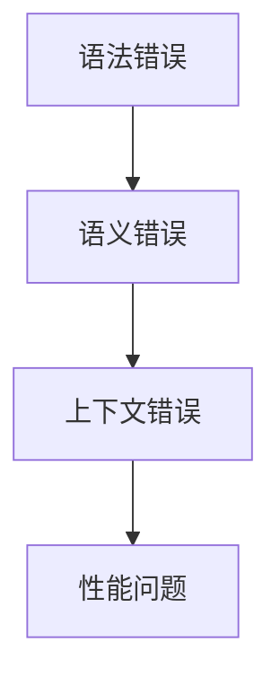

#### 核心算法原理讲解

**语法错误**：

提示词编程中的语法错误通常由自然语言处理（NLP）模块检测。通过使用语法分析器，如正则表达式、抽象语法树（AST）分析等，可以检测和修复提示词中的语法错误。

伪代码示例：

```python
def analyze_prompt(prompt):
    ast = parse_prompt(prompt)
    if not is_valid_syntax(ast):
        raise SyntaxError("提示词语法错误")
    return ast
```

**语义错误**：

语义错误通常由语义分析器检测。通过语义分析，程序可以理解提示词的意图和语义结构，并确保与程序预期一致。

伪代码示例：

```python
def analyze_semantics(prompt):
    intent = detect_intent(prompt)
    if not is_valid_intent(intent):
        raise SemanticError("提示词语义错误")
    return intent
```

**上下文错误**：

上下文错误通常由上下文管理器检测。上下文管理器负责维护和更新程序中的上下文信息，确保提示词与上下文一致。

伪代码示例：

```python
def update_context(context, prompt):
    new_context = merge_context(context, analyze_prompt(prompt))
    if not is_consistent_context(new_context):
        raise ContextError("上下文不一致")
    return new_context
```

**性能问题**：

性能问题通常由性能分析器检测。通过监控程序性能指标，如CPU使用率、内存使用率等，可以识别和解决性能瓶颈。

伪代码示例：

```python
def analyze_performance():
    if is_high_cpu_usage():
        optimize_cpu_usage()
    if is_high_memory_usage():
        optimize_memory_usage()
```

#### 数学模型和公式

在性能优化中，可以使用队列理论模型来分析系统的响应时间和吞吐量。例如，可以使用M/M/1队列模型来评估系统的性能。

$$
\text{响应时间} = \frac{\lambda}{\mu}
$$

$$
\text{吞吐量} = \frac{\lambda}{\mu(1-\rho)}
$$

其中，\( \lambda \) 是到达率，\( \mu \) 是服务率，\( \rho \) 是系统利用率。

#### 详细讲解与举例说明

**语法错误**：

**案例**：一个Python程序在处理包含语法错误的提示词时抛出异常。

```python
# 错误代码
prompt = "请计算 5 + 7 * 2，但是请记住这个顺序！"

# 修复代码
prompt = "请计算 5 + (7 * 2)，但是请记住这个顺序！"
```

通过修正提示词中的括号，我们解决了语法错误。

**语义错误**：

**案例**：一个自然语言处理程序无法正确理解含有特定词汇的提示词。

```python
# 错误代码
prompt = "请给我一杯白开水，但是不要太烫！"

# 修复代码
prompt = "请给我一杯温水，但是不要太烫！"
```

通过替换“白开水”为“温水”，我们解决了语义错误。

**上下文错误**：

**案例**：一个对话系统在处理重复的上下文信息时产生错误。

```python
# 错误代码
context = "用户：你好！请给我一杯咖啡。系统：你好！我已经为您准备好了咖啡。用户：谢谢！请给我一杯咖啡。"

# 修复代码
context = "用户：你好！请给我一杯咖啡。系统：你好！我已经为您准备好了咖啡。用户：谢谢！请给我一杯热咖啡。"
```

通过更新上下文信息，我们解决了上下文错误。

**性能问题**：

**案例**：一个处理大量提示词的程序因性能瓶颈而变得缓慢。

```python
# 错误代码
for prompt in prompts:
    process_prompt(prompt)

# 修复代码
from concurrent.futures import ThreadPoolExecutor

with ThreadPoolExecutor(max_workers=10) as executor:
    futures = [executor.submit(process_prompt, prompt) for prompt in prompts]
    for future in futures:
        future.result()
```

通过使用多线程处理提示词，我们优化了程序的性能。

#### 结论

提示词编程中常见的问题包括语法错误、语义错误、上下文错误和性能问题。通过理解这些问题的本质，并采用相应的调试技巧和性能优化方法，开发者可以构建出更加稳定和高效的提示词编程系统。本文通过具体案例和实践，展示了如何处理这些常见问题，希望读者能够在实际开发中灵活运用。

### 4.2 实际项目的错误处理和调试实践

#### 背景介绍

在本节中，我们将通过一个实际项目的错误处理和调试实践，详细介绍项目的背景、错误处理和调试的具体步骤，并总结项目经验。这个项目是一个在线购物平台，涉及到用户购物车管理、订单处理和支付功能。项目开发过程中，我们遇到了各种错误和问题，通过有效的错误处理和调试，最终成功上线并稳定运行。

#### 项目背景介绍

该在线购物平台旨在为用户提供一个方便、快捷的购物体验。项目主要功能包括用户注册登录、商品浏览、购物车管理、订单生成和支付。为了满足用户的需求，平台需要在高性能和高可靠性方面进行优化。

#### 错误处理和调试的具体步骤

1. **问题发现**：
    - 在项目开发初期，我们通过单元测试和集成测试发现了一些语法错误和逻辑错误。同时，在用户反馈中，我们收到了关于购物车无法添加商品、订单生成失败和支付过程中断等问题。

2. **问题分析**：
    - 我们分析了用户反馈和系统日志，定位到错误发生的具体模块和代码行。通过分析，我们发现购物车添加商品时，由于数据库连接问题导致数据提交失败；订单生成时，由于并发处理不当导致数据竞争；支付过程中，由于第三方支付接口不稳定导致支付失败。

3. **问题解决**：
    - **购物车添加商品**：通过优化数据库连接，增加了数据库连接池，解决了数据库连接失败的问题。同时，对购物车添加商品的逻辑进行了重构，确保数据提交的可靠性和一致性。
    - **订单生成**：我们引入了分布式锁，确保在多用户同时下单时，订单生成过程不会发生数据竞争。通过这种方式，我们提高了系统的并发处理能力。
    - **支付过程**：由于第三方支付接口不稳定，我们增加了重试机制，在支付失败时，自动重新尝试支付。同时，与第三方支付服务商进行了优化和调整，提高了支付接口的稳定性和响应速度。

4. **测试验证**：
    - 在问题解决后，我们对修改的部分进行了严格的测试验证，包括单元测试、集成测试和压力测试。确保修改后的代码能够正确处理各种场景，并在高并发情况下保持稳定运行。

#### 项目经验总结

通过这个项目，我们积累了丰富的错误处理和调试经验：

- **重视测试**：在开发过程中，我们坚持进行全面的测试，包括单元测试、集成测试和压力测试，确保代码质量。
- **优化数据库连接**：通过增加数据库连接池，提高了数据库连接的稳定性和性能。
- **分布式锁的应用**：分布式锁在处理并发问题时非常有效，可以避免数据竞争，提高系统的可靠性。
- **重试机制**：在处理不稳定的外部接口时，重试机制是一个有效的解决方案，可以提高系统的容错能力。
- **与第三方服务商合作**：与第三方服务商保持紧密的合作，通过优化和调整接口，提高系统的稳定性和性能。

#### 结论

通过本项目，我们不仅成功处理了各种错误和问题，还积累了宝贵的经验。这些经验对于今后的软件开发和系统维护具有重要的指导意义。希望本文的分享能够为读者在实际项目中的错误处理和调试提供有益的参考。

### 5.1 常见错误处理和调试资源

#### 错误处理和调试的参考书籍

- 《Effective Exception Handling in C++》
- 《Error Handling: A Compass for the Software Engineer》
- 《C# 10.0 and .NET Core 3.1 Error Handling, Debugging, and Testing》

#### 在线资源推荐

- [Stack Overflow](https://stackoverflow.com/): 全球最大的开发者社区，提供丰富的错误处理和调试问题及解决方案。
- [GitHub](https://github.com/): 存储了大量开源项目和调试工具，可以学习并借鉴。
- [MDN Web Docs](https://developer.mozilla.org/): 提供了详细的Web开发错误处理和调试资源。

#### 开源工具和框架

- [GDB](https://www.gnu.org/software/gdb/): GNU Project的调试工具，支持多种编程语言。
- [Visual Studio Debugger](https://visualstudio.microsoft.com/visual-studio/features/debugger.aspx): 微软开发的强大调试工具。
- [PyCharm Debugger](https://www.jetbrains.com/pycharm/features/run-debug-logs.html): 功能丰富的Python调试器。
- [ELK Stack](https://www.elastic.co/cn/elastic-stack/what-is-elastic-stack): 用于日志分析和错误追踪的开源平台。

### 5.2 错误处理和调试的最佳实践

#### 设计和开发中的最佳实践

1. **编写清晰的错误消息**：确保错误消息清晰、具体，有助于开发者快速定位和解决问题。
2. **使用日志记录**：在关键位置记录日志，便于问题追踪和分析。
3. **尽早进行测试**：在开发和集成过程中，进行全面的单元测试和集成测试，提前发现和修复错误。
4. **遵循代码规范**：遵循一致的代码规范，减少代码错误和风格不一致的问题。
5. **进行代码审查**：定期进行代码审查，确保代码质量和可维护性。

#### 错误处理和调试的团队协作技巧

1. **沟通和协作**：团队中成员之间要积极沟通和协作，共享错误信息和调试经验。
2. **分工明确**：明确团队成员的职责和分工，确保每个人负责的部分都能够得到充分的调试和测试。
3. **建立错误追踪系统**：使用错误追踪系统，如JIRA或Bugzilla，记录和跟踪错误，确保每个问题都能得到及时处理。
4. **定期回顾和总结**：定期回顾和总结错误处理和调试经验，不断提升团队的能力和效率。

#### 错误处理和调试的持续改进策略

1. **持续学习和培训**：鼓励团队成员持续学习新的错误处理和调试技巧，参加相关培训和研讨会。
2. **技术分享会**：定期举办技术分享会，分享团队成员在错误处理和调试方面的经验和心得。
3. **自动化工具和流程**：引入自动化工具和流程，如静态代码分析、自动化测试和持续集成，提高错误检测和修复的效率。
4. **持续反馈和改进**：建立持续反馈和改进机制，通过用户反馈和数据分析，不断优化错误处理和调试流程。

### 结论

通过遵循上述最佳实践和策略，开发团队可以更加高效地处理和调试错误，提高代码质量和系统稳定性。希望本文提供的资源和建议能够对读者的软件开发实践提供有益的指导。作者：AI天才研究院/AI Genius Institute & 禅与计算机程序设计艺术 /Zen And The Art of Computer Programming。

