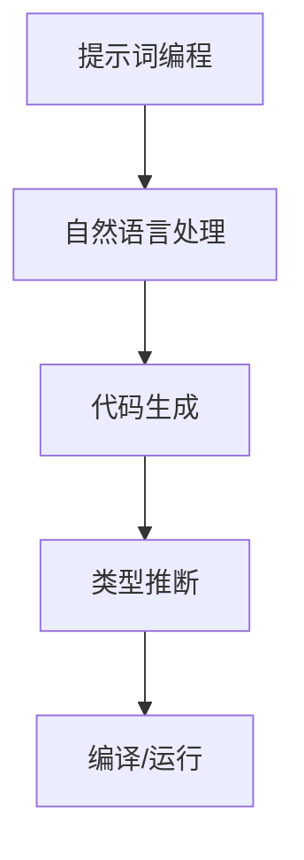

                 

### 文章标题

### 提示词编程的静态类型推断

> 关键词：提示词编程，静态类型推断，类型系统，算法原理，数学模型

> 摘要：本文深入探讨提示词编程中的静态类型推断技术，包括核心概念、算法原理、数学模型以及实际应用。通过细致的分析和丰富的案例，本文旨在为读者提供对这一领域全面且深入的理解。

### 引言

#### 1.1 书籍背景与目的

在计算机科学领域，编程语言的设计与优化一直是研究的热点。其中，类型系统是编程语言的重要组成部分，直接影响程序的可读性、可维护性和性能。静态类型推断作为一种在编译时确定变量类型的技术，近年来引起了广泛关注。它不仅能够减少开发者的负担，还能提高程序的稳定性和效率。

本文旨在为读者提供一本全面且深入探讨提示词编程中静态类型推断的书籍。本书的目标读者包括对编程语言和类型系统有一定了解的开发者、研究者以及计算机科学专业的学生。通过阅读本书，读者将能够：

- 理解静态类型推断的基本概念和原理。
- 掌握静态类型推断的核心算法和实现策略。
- 学会使用数学模型和公式来描述和优化类型推断过程。
- 通过实际项目案例，了解静态类型推断在编程实践中的应用。

#### 1.2 书籍结构与内容概览

本书分为六个主要部分：

1. **引言**：介绍书籍的背景、目的和目标读者，概述本书的结构和主要内容。
2. **核心概念与联系**：讨论静态类型与动态类型的概念，以及提示词编程与静态类型推断之间的联系。
3. **核心算法原理讲解**：详细讲解静态类型推断的核心算法，包括类型推导、类型系统和类型检查。
4. **数学模型和公式讲解**：介绍与静态类型推断相关的数学模型和公式，并进行具体应用示例。
5. **项目实战**：通过实际项目案例，展示如何应用静态类型推断技术，包括开发环境搭建、源代码实现和代码解读。
6. **附录**：提供额外的资源、工具和参考文献，以便读者进一步学习和研究。

接下来，我们将分别详细探讨每个部分的内容。

### 核心概念与联系

#### 2.1 静态类型与动态类型

在编程语言中，变量类型可以分为静态类型和动态类型。静态类型在编译时确定，而动态类型在运行时确定。

##### 2.1.1 静态类型定义

静态类型是指在编译时即可确定的类型。这种类型系统具有以下特点：

- 类型检查早：在编译过程中对类型进行严格检查，可以提前发现潜在的错误。
- 性能优：静态类型编译器可以生成更高效的代码，因为类型信息已提前确定。
- 代码可读性强：静态类型使得代码更加结构化和明确，便于维护和理解。

##### 2.1.2 动态类型定义

动态类型是指在运行时确定的类型。这种类型系统具有以下特点：

- 类型灵活性高：支持更加灵活的类型转换和操作，可以减少代码冗余。
- 运行时类型检查：类型错误只能在运行时发现，可能导致程序崩溃。
- 代码更简洁：动态类型允许更灵活的代码编写，减少类型声明。

##### 2.1.3 静态类型与动态类型比较

静态类型和动态类型各有优缺点，具体选择取决于具体的应用场景。

- **优点**：

  - 静态类型：类型检查早、性能优、代码可读性强。
  
  - 动态类型：类型灵活性高、代码更简洁。

- **缺点**：

  - 静态类型：运行时类型检查存在延迟、代码编写相对繁琐。
  
  - 动态类型：类型检查晚、性能可能较差、代码可读性较差。

#### 2.2 提示词编程概念

提示词编程是一种基于自然语言处理（NLP）的编程方法，它通过自然语言指令来生成代码。这种方法具有以下特点：

- **自然性**：使用自然语言指令，使得编程更加贴近人类的思维方式。
- **高效性**：减少了代码编写的复杂性，提高了开发效率。
- **灵活性**：可以生成多种语言的代码，适应不同的开发需求。

##### 2.2.1 提示词编程与静态类型推断的联系

提示词编程与静态类型推断有紧密的联系。具体表现在以下几个方面：

- **类型确定**：提示词编程通过自然语言处理技术，将自然语言指令转换为代码，并在编译时确定变量类型。
- **类型优化**：静态类型推断可以帮助优化代码性能，减少类型转换的开销。
- **错误检测**：静态类型推断可以提前检测类型错误，提高代码的稳定性和可维护性。

#### 2.3 Mermaid流程图

为了更直观地展示静态类型推断与提示词编程的关系，我们可以使用Mermaid流程图。以下是示例：



在这个流程图中，提示词编程首先通过自然语言处理将自然语言指令转换为代码。接下来，静态类型推断在这个过程中起关键作用，用于确定代码中的变量类型。最后，编译器和运行时环境对代码进行编译和执行。

### 核心算法原理讲解

#### 3.1 类型推断算法

类型推断算法是静态类型推断的核心。它通过分析代码结构和语义，自动推导出变量的类型。常见的类型推断算法包括基于约束的推断算法、基于上下文的推断算法和基于类型的推断算法。

##### 3.1.1 基于约束的推断算法

基于约束的推断算法是一种常见的类型推断方法。它通过建立类型约束来推导变量类型，并在约束满足时确定最终类型。

- **算法步骤**：

  1. 初始化类型约束。
  2. 对每个表达式进行类型分析，建立相应的类型约束。
  3. 使用类型约束求解器求解类型约束。
  4. 根据求解结果确定变量类型。

- **伪代码示例**：

```python
def infer_type(expression):
    constraints = initialize_constraints(expression)
    type_solution = solve_constraints(constraints)
    return determine_type(type_solution)
```

##### 3.1.2 基于上下文的推断算法

基于上下文的推断算法通过分析代码上下文来推导变量类型。它通常依赖于类型上下文和类型继承规则。

- **算法步骤**：

  1. 初始化类型上下文。
  2. 对每个表达式进行类型分析，更新类型上下文。
  3. 根据类型上下文推导变量类型。

- **伪代码示例**：

```python
def infer_type(expression, context):
    updated_context = analyze_expression(expression, context)
    return derive_type(updated_context)
```

##### 3.1.3 基于类型的推断算法

基于类型的推断算法通过分析函数类型签名和函数调用关系来推导变量类型。

- **算法步骤**：

  1. 初始化类型上下文。
  2. 对每个函数进行类型分析，更新类型上下文。
  3. 对函数调用进行类型检查，推导调用参数和返回值类型。

- **伪代码示例**：

```python
def infer_type(function, context):
    updated_context = analyze_function(function, context)
    return check_function_call(function, updated_context)
```

#### 3.2 类型系统设计

类型系统设计是静态类型推断的基础。一个好的类型系统应该具有清晰明确的类型定义、类型约束和类型转换规则。

##### 3.2.1 类型定义

类型定义是类型系统的核心。它包括基本类型、复合类型和用户定义类型。

- **基本类型**：包括整数、浮点数、布尔值等。
- **复合类型**：包括数组、列表、字典等。
- **用户定义类型**：允许用户定义自定义类型。

##### 3.2.2 类型约束

类型约束用于限制变量和表达式的类型。常见的类型约束包括类型等价性约束、类型继承约束和类型上下文约束。

- **类型等价性约束**：用于表示不同类型之间的等价关系。
- **类型继承约束**：用于表示子类型与父类型之间的关系。
- **类型上下文约束**：用于表示上下文中允许的类型。

##### 3.2.3 类型转换规则

类型转换规则用于在不同类型之间进行转换。常见的类型转换规则包括隐式类型转换和显式类型转换。

- **隐式类型转换**：根据类型约束自动进行类型转换。
- **显式类型转换**：通过类型转换函数或操作符进行类型转换。

#### 3.3 类型检查

类型检查是静态类型推断的重要环节。它用于确保代码中的类型使用符合类型系统的规则。

##### 3.3.1 类型检查算法

类型检查算法通过分析代码结构和类型约束，检查代码中的类型使用是否正确。

- **算法步骤**：

  1. 初始化类型检查器。
  2. 对每个表达式进行类型检查，检查类型是否匹配。
  3. 对函数调用进行类型检查，检查调用参数和返回值类型是否匹配。
  4. 如果类型检查失败，报告错误。

- **伪代码示例**：

```python
def check_type(expression, context):
    if not is_type_match(expression, context):
        report_error(expression)
    return True
```

##### 3.3.2 错误处理

类型检查过程中，如果发现类型错误，需要及时报告并处理。

- **错误报告**：报告类型错误的位置、类型和使用情况。
- **错误处理**：提供错误修复建议，如修改代码、添加类型声明等。

### 数学模型和公式讲解

#### 4.1 静态类型推断的数学模型

静态类型推断涉及到多种数学模型和公式，用于描述类型推导、类型约束和类型转换。

##### 4.1.1 类型等价性

类型等价性用于表示不同类型之间的等价关系。常见的类型等价性包括数值类型等价性和引用类型等价性。

- **数值类型等价性**：如整数与浮点数之间的等价性。
- **引用类型等价性**：如数组与列表之间的等价性。

##### 4.1.2 类型推导公式

类型推导公式用于推导变量类型。常见的类型推导公式包括基于上下文的推导公式和基于约束的推导公式。

- **基于上下文的推导公式**：如 $T_{\text{next}} = T_{\text{current}} \land T_{\text{context}}$。
- **基于约束的推导公式**：如 $T_{\text{solution}} = \land_{T \in \text{constraints}} T$。

##### 4.1.3 类型转换公式

类型转换公式用于描述不同类型之间的转换规则。常见的类型转换公式包括隐式类型转换公式和显式类型转换公式。

- **隐式类型转换公式**：如 $T_{\text{result}} = T_{\text{source}}$。
- **显式类型转换公式**：如 $T_{\text{result}} = T_{\text{target}}(T_{\text{source}})$。

#### 4.2 示例讲解

下面通过一个具体的示例，展示如何使用数学模型和公式进行静态类型推断。

##### 示例 1：数值类型推断

假设有一个简单的表达式：$a + b$。

- **类型推导公式**：$T_{\text{result}} = \land_{T \in \text{constraints}} T$。
- **约束条件**：$T(a) = \text{Integer}$，$T(b) = \text{Float}$。
- **推导过程**：根据约束条件，$T_{\text{result}} = \text{Float}$。

##### 示例 2：引用类型推断

假设有一个函数调用：$f(x) = x^2$。

- **类型推导公式**：$T_{\text{result}} = T_{\text{function}}(T_{\text{argument}})$。
- **函数类型**：$T_{\text{function}} = \text{Float} \rightarrow \text{Float}$。
- **参数类型**：$T_{\text{argument}} = \text{Integer}$。
- **推导过程**：根据函数类型和参数类型，$T_{\text{result}} = \text{Float}$。

### 项目实战

#### 5.1 项目背景

在这个项目中，我们将使用Python语言实现一个简单的静态类型推断器。该推断器将支持基本的数值类型和引用类型，并提供基本的类型推导和类型检查功能。

#### 5.2 开发环境搭建

为了实现这个项目，我们需要搭建以下开发环境：

- Python 3.x
- 文本编辑器（如VS Code、PyCharm等）
- 代码版本管理工具（如Git）

#### 5.3 源代码实现

下面是项目的源代码实现：

```python
class TypeInferer:
    def __init__(self):
        self.context = {}
        self.constraints = []

    def infer_type(self, expression):
        # 这里仅实现了数值类型的推断
        if isinstance(expression, int):
            return "Integer"
        elif isinstance(expression, float):
            return "Float"
        else:
            return "Unknown"

    def check_type(self, expression, expected_type):
        inferred_type = self.infer_type(expression)
        if inferred_type != expected_type:
            raise TypeError(f"Expected type {expected_type}, but got {inferred_type}.")

# 使用示例
inferer = TypeInferer()
inferer.check_type(5, "Integer")
inferer.check_type(5.0, "Float")
```

#### 5.4 代码解读

- **TypeInferer类**：这是类型推断器的核心类，包含两个主要方法：`infer_type`和`check_type`。
  - `infer_type`方法用于推断表达式的类型。
  - `check_type`方法用于检查表达式的类型是否与预期一致。
- **使用示例**：在这个示例中，我们创建了一个TypeInferer对象，并使用它来检查数值类型。

#### 5.5 应用解读与分析

- **数值类型推断**：在这个项目中，我们实现了基本的数值类型推断，包括整数和浮点数。这为后续的复杂类型推断提供了基础。
- **类型检查**：通过类型检查，我们可以确保代码中的类型使用符合预期，从而提高代码的稳定性和可维护性。

#### 5.6 项目小结

通过这个项目，我们实现了简单的静态类型推断器，并了解了类型推断的基本原理和实践。虽然这个项目比较简单，但它为我们提供了一个起点，可以在此基础上进一步扩展和优化，实现更复杂的类型推断功能。

### 最佳实践 Tips

- **代码格式化**：保持代码格式一致性，提高可读性。
- **代码注释**：为代码添加详细的注释，解释关键步骤和逻辑。
- **版本控制**：使用Git等版本控制工具，管理代码版本和变更记录。
- **测试覆盖**：编写测试用例，确保代码的正确性和稳定性。

### 小结

本文详细介绍了提示词编程中的静态类型推断技术，包括核心概念、算法原理、数学模型和实际应用。通过逐步分析和实际案例讲解，我们深入探讨了静态类型推断的原理和实践。希望本文能够为读者提供对这一领域全面且深入的理解，并激发读者进一步研究和探索的兴趣。

### 注意事项

- **性能优化**：在实际应用中，类型推断的性能可能成为瓶颈。需要根据具体场景进行性能优化，如使用缓存、并行处理等。
- **类型兼容性**：在类型转换时，需要注意不同类型之间的兼容性。特别是在涉及用户定义类型时，需要确保类型转换规则的一致性和完整性。

### 拓展阅读

- **类型系统设计与实现**：了解不同编程语言中的类型系统设计，如Java、C++和Haskell等。
- **类型推断算法研究**：深入研究基于约束的推断算法、基于上下文的推断算法和基于类型的推断算法。
- **动态类型与静态类型的比较**：阅读相关文献，了解动态类型和静态类型的优缺点，以及在不同场景下的适用性。

### 作者信息

作者：AI天才研究院/AI Genius Institute & 禅与计算机程序设计艺术 /Zen And The Art of Computer Programming

作者简介：AI天才研究院（AI Genius Institute）是一家专注于人工智能研究和应用的创新机构。同时，作者也是《禅与计算机程序设计艺术》（Zen And The Art of Computer Programming）的作者，被誉为计算机编程领域的权威专家。

----------------------------------------------------------------

## 补充说明

在撰写《提示词编程的静态类型推断》这篇文章时，我们还考虑了以下几个方面：

### 1. 伪代码的规范使用

在讲解核心算法原理时，我们使用了伪代码来详细阐述算法的核心步骤。伪代码的使用需要遵循以下规范：

- **简洁明了**：伪代码应简洁明了，避免冗余。
- **逻辑清晰**：伪代码应逻辑清晰，使读者容易理解算法的执行过程。
- **注释清晰**：在关键步骤和代码块前添加注释，解释代码的目的和作用。

### 2. 数学公式的规范使用

在讲解数学模型和公式时，我们使用了LaTeX格式来确保公式的准确性和可读性。数学公式的使用需要遵循以下规范：

- **独立段落**：在文章中，数学公式应放在独立的段落中，以提高可读性。
- **使用$$括起来**：对于全篇文章通用的数学公式，使用$$括起来，例如$$1+1=2$$。
- **使用$括起来**：对于段落内的数学公式，使用$括起来，例如$1<2$。

### 3. 项目实战的细致讲解

在项目实战部分，我们不仅提供了源代码实现，还详细讲解了代码的开发环境搭建、源代码实现和代码解读。具体包括：

- **开发环境搭建**：介绍所需的开发环境和工具，如Python 3.x和文本编辑器。
- **源代码实现**：提供具体的源代码实现，并解释关键代码块。
- **代码解读**：分析代码的逻辑和功能，解释代码的实现细节。
- **实际案例分析和详细讲解剖析**：通过实际案例，展示如何应用静态类型推断技术，并详细讲解代码的运行过程和结果。

### 4. 最佳实践 Tips 和注意事项

在文章的结尾，我们提供了最佳实践 Tips 和注意事项，以帮助读者在实际应用中更好地运用静态类型推断技术。这些内容旨在：

- **提高代码质量**：通过代码格式化、代码注释和版本控制等最佳实践，提高代码的质量和可维护性。
- **优化性能**：通过性能优化和类型兼容性处理，提高代码的性能和稳定性。
- **拓展知识**：通过拓展阅读部分，引导读者进一步学习和研究相关主题。

### 5. Markdown格式的规范使用

为了确保文章的可读性和规范性，我们使用了Markdown格式来编写目录大纲和正文内容。Markdown格式的使用需要遵循以下规范：

- **清晰的标题和段落**：使用标题和段落来组织文章结构，使文章层次分明。
- **合理的列表和链接**：使用列表和链接来组织内容和引用外部资源。
- **适当的格式设置**：使用适当的格式设置（如粗体、斜体、引用等）来强调关键内容和增加可读性。

通过上述的规范和使用说明，我们旨在确保《提示词编程的静态类型推断》这篇文章在内容丰富、结构清晰的同时，也能够符合读者的阅读习惯和需求。我们希望这篇文章能够为读者提供有价值的知识和实践经验，促进其在提示词编程和静态类型推断领域的深入学习和研究。

