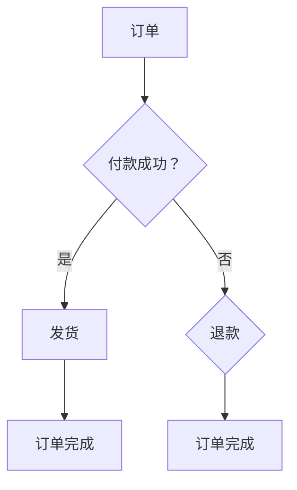
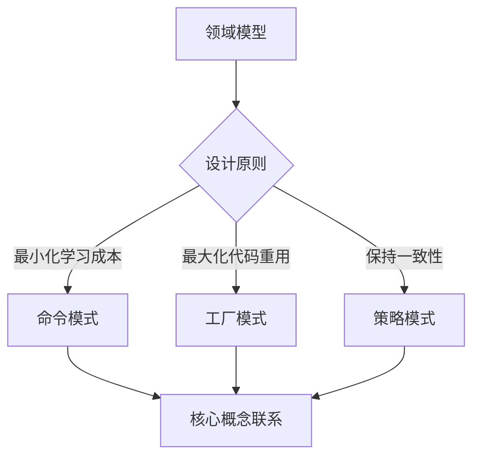
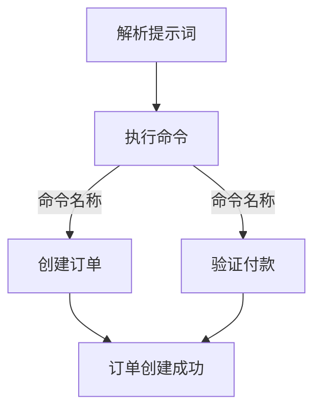

                 

# 《提示词编程的领域特定语言设计》

## 关键词

提示词编程，领域特定语言，设计原理，实现方法，应用领域，性能优化

## 摘要

本文旨在探讨提示词编程的领域特定语言设计，首先介绍领域特定语言的基础知识，包括其定义、特点以及分类。接着，深入解析领域模型构建的方法和步骤，并通过Mermaid流程图展示领域模型。随后，阐述领域特定语言设计原理，包括设计原则、设计模式以及核心概念的联系。文章随后转向领域特定语言的实现，讨论语法设计和工具选择，并介绍提示词编程的核心算法原理和伪代码。此外，本文还涵盖了数学模型和公式的讲解，以及项目实战的详细实现和代码解读。最后，文章探讨了领域特定语言在金融、医疗和工业自动化等领域的应用，以及未来发展趋势和挑战。全文共分为三个部分，共计12章，旨在为读者提供全面、深入的领域特定语言设计指导。

## 第一部分：领域特定语言基础

### 第1章：领域特定语言概述

**1.1 提示词编程与领域特定语言的关系**

提示词编程（Prompt-Based Programming，简称PBP）是一种新兴的编程范式，其核心思想是通过提示词（Prompts）来引导计算机执行任务。领域特定语言（Domain-Specific Language，简称DSL）则是为特定领域或问题域设计的编程语言，旨在提高开发效率和代码可读性。提示词编程与领域特定语言有着密切的关系，DSL通常作为PBP的实现载体，使得开发者能够以更自然、更高效的方式与计算机进行交互。

**1.2 领域特定语言的定义和特点**

领域特定语言是一种针对特定领域或问题域设计的编程语言。与通用编程语言（如Python、Java）相比，DSL具有如下特点：

- **专业性**：DSL专注于特定领域，拥有丰富的领域知识和专业术语。
- **简洁性**：DSL通过引入领域特定的语法和语义，使得开发者可以更简洁地表达复杂的业务逻辑。
- **易用性**：DSL通常提供直观、易用的编程接口，降低了学习门槛和开发成本。
- **扩展性**：DSL可以灵活地扩展和定制，以适应不断变化的领域需求。

**1.3 领域特定语言的分类**

根据DSL的设计原则和用途，可以分为以下几类：

- **嵌入式DSL**：嵌入式DSL（Embedded DSL）嵌入在通用编程语言中，通过扩展通用语言的语法和语义实现。如Python的Pandas库，提供了数据处理的DSL。
- **内部DSL**：内部DSL（Internal DSL）完全独立于通用编程语言，由编译器或解释器直接执行。如SQL，就是一种典型的内部DSL。
- **外部DSL**：外部DSL（External DSL）独立于通用编程语言，通过解释器或编译器将DSL代码转换为通用语言的代码。如ANTLR，是一种广泛使用的生成外部DSL的工具。

### 第2章：领域模型构建

**2.1 领域模型的基本概念**

领域模型是领域特定语言的基石，它抽象了特定领域的核心概念和关系。领域模型通常包括以下几种基本概念：

- **实体**：领域中的对象，具有属性和行为。
- **关系**：实体之间的连接和交互，通常用边表示。
- **操作**：实体可以执行的行为，通常用方法表示。

**2.2 领域模型构建方法**

构建领域模型的方法有多种，常见的有：

- **用户故事映射**：通过用户故事识别领域中的主要实体和关系。
- **实体关系图**：使用实体关系图（ER图）表示领域模型的基本结构。
- **UML类图**：使用UML类图表示领域模型中的类、属性和方法。

**2.3 领域模型的Mermaid流程图展示**

使用Mermaid图示可以直观地展示领域模型的结构。以下是一个简单的Mermaid流程图示例，展示了一个订单处理系统的领域模型：



该图展示了订单处理系统的基本流程，包括订单、付款、发货、退款和订单完成等实体和关系。

### 第3章：领域特定语言设计原理

**3.1 设计原则**

领域特定语言设计应遵循以下原则：

- **最小化学习成本**：确保DSL易于学习和使用，降低开发者门槛。
- **最大化代码重用**：通过模块化和组件化，提高代码的可复用性。
- **保持一致性**：确保DSL内部的一致性和外部接口的一致性。
- **可扩展性**：允许DSL在需要时进行扩展，以适应新的领域需求。

**3.2 设计模式**

在领域特定语言设计中，常用的设计模式有：

- **命令模式**：将操作封装为对象，实现操作的灵活调度和扩展。
- **工厂模式**：通过工厂类创建对象，降低对象的创建复杂度。
- **策略模式**：将算法封装为对象，实现算法的灵活替换和扩展。

**3.3 领域特定语言的核心概念联系Mermaid图示**

为了更好地理解领域特定语言的核心概念，可以使用Mermaid图示展示各个概念之间的联系。以下是一个示例，展示了领域模型、设计原则和设计模式之间的联系：



该图展示了领域模型与设计原则、设计模式之间的联系，以及这些设计模式如何共同作用于领域特定语言的设计。

## 第二部分：领域特定语言实现

### 第4章：语法设计与工具

**4.1 提示词语法设计**

提示词编程的语法设计应遵循简洁性、易用性和可扩展性的原则。以下是一个简单的示例，展示了提示词语法的结构：

```
# 提示词
提示：请处理新订单。

# 操作命令
- 创建订单
  - 订单编号：123456
  - 客户名称：张三

- 验证付款
  - 付款金额：500元
  - 付款状态：成功
```

**4.2 领域特定语言的工具选择**

在实现领域特定语言时，需要选择合适的工具和框架。以下是一些常见的工具和框架：

- **ANTLR**：一种广泛使用的语法分析器生成器，可用于创建外部DSL。
- **Eclipse IDE**：一个功能强大的集成开发环境，支持多种编程语言和工具。
- **Maven**：一种流行的项目管理和构建工具，可用于管理项目依赖和构建过程。

**4.3 提示词编程开发环境搭建**

搭建提示词编程的开发环境通常需要以下步骤：

1. 安装ANTLR和Eclipse IDE。
2. 创建一个新的ANTLR项目，并编写语法规则文件。
3. 编译ANTLR项目，生成语法分析器代码。
4. 在Eclipse IDE中创建一个Java项目，并将语法分析器代码添加到项目中。
5. 开发提示词编程的核心算法和工具类。
6. 使用Eclipse IDE进行代码编写、调试和测试。

### 第5章：核心算法原理与伪代码

**5.1 提示词编程核心算法**

提示词编程的核心算法通常包括以下几个方面：

- **解析提示词**：将提示词转换为内部表示，以便进行后续处理。
- **流程控制**：根据提示词的逻辑结构，执行相应的操作和命令。
- **数据绑定**：将用户输入的数据与DSL中的变量进行绑定，以便在后续操作中使用。

**5.2 伪代码详细讲解**

以下是一个简单的伪代码示例，展示了提示词编程的核心算法：

```
# 解析提示词
def parse_prompt(prompt):
    # 解析提示词中的命令和参数
    commands = split_prompt_by_delimiter(prompt, delimiter=":")
    for command in commands:
        command_name, command_args = split_command_by_delimiter(command, delimiter="-")
        execute_command(command_name, command_args)

# 执行命令
def execute_command(command_name, command_args):
    if command_name == "create_order":
        create_order(order_id=command_args["order_id"], customer_name=command_args["customer_name"])
    elif command_name == "verify_payment":
        verify_payment(amount=command_args["amount"], payment_status=command_args["payment_status"])
    else:
        raise UnknownCommandError()

# 流程控制
def create_order(order_id, customer_name):
    # 创建订单
    print("订单创建成功，订单编号：", order_id)
    print("客户名称：", customer_name)

def verify_payment(amount, payment_status):
    # 验证付款
    if payment_status == "成功":
        print("付款验证成功，付款金额：", amount)
    else:
        print("付款验证失败")
```

**5.3 核心算法原理Mermaid图示**

为了更好地理解提示词编程的核心算法原理，可以使用Mermaid图示展示其基本流程。以下是一个示例：



该图展示了提示词编程的核心算法流程，包括解析提示词、执行命令以及订单创建和付款验证等操作。

### 第6章：数学模型与公式

**6.1 数学模型基本概念**

数学模型是领域特定语言中常用的工具，用于描述和解决特定领域的问题。以下是一些基本的数学模型概念：

- **变量**：表示领域中的量，可以是实数、整数、布尔值等。
- **函数**：描述变量之间的关系，可以是线性函数、多项式函数等。
- **方程**：用数学语言描述的问题，通常是函数的等式。
- **算法**：用于求解方程或优化问题的计算过程。

**6.2 提示词编程中的数学公式**

在提示词编程中，可以使用数学公式来描述业务逻辑和计算过程。以下是一个简单的示例，展示了如何使用数学公式：

```
# 订单金额计算
总金额 = 单价 × 数量
```

**6.3 公式详细讲解与举例**

以下是一个具体的数学模型示例，用于计算订单总金额：

```
# 订单总金额计算
总金额 = (单价1 × 数量1) + (单价2 × 数量2) + ...
```

其中，单价和数量分别为各个商品的单价和购买数量，可以通过提示词输入。以下是一个具体的计算示例：

```
# 输入商品信息
单价1 = 100元
数量1 = 2个

单价2 = 200元
数量2 = 1个

# 计算订单总金额
总金额 = (100 × 2) + (200 × 1)
总金额 = 300 + 200
总金额 = 500元
```

该示例展示了如何使用数学模型计算订单总金额，并通过提示词输入商品信息，使得计算过程更加直观和易于操作。

### 第7章：项目实战

**7.1 实战项目简介**

本节将介绍一个实际项目，用于展示如何使用提示词编程实现领域特定语言。该项目是一个简单的订单处理系统，支持订单创建、付款验证和发货等功能。

**7.2 实战项目开发环境搭建**

为了搭建该项目的开发环境，需要以下步骤：

1. 安装ANTLR和Eclipse IDE。
2. 创建一个ANTLR项目，编写语法规则文件。
3. 编译ANTLR项目，生成语法分析器代码。
4. 在Eclipse IDE中创建一个Java项目，将语法分析器代码添加到项目中。
5. 开发提示词编程的核心算法和工具类。

**7.3 源代码实现与解读**

以下是该项目的源代码实现，包括语法规则文件、核心算法和工具类。

**语法规则文件（orders.gram）**

```
grammar Orders

prompt
    : '提示：' prompt_content
    ;

prompt_content
    : '请处理新订单。'
    | '订单编号：' order_id
    | '客户名称：' customer_name
    | '付款金额：' amount
    | '付款状态：' status
    ;

order_id
    : ID
    ;

customer_name
    : ID
    ;

amount
    : INT
    ;

status
    : '成功' | '失败'
    ;

ID : [a-zA-Z]+;
INT : [0-9]+;
```

**核心算法（Main.java）**

```
import org.antlr.v4.runtime.*;

public class Main {
    public static void main(String[] args) {
        try {
            // 读取输入文件
            String input = readFile("input.txt");

            // 创建ANTLR解析器
            OrdersLexer lexer = new OrdersLexer(new ANTLRInputStream(input));
            OrdersParser parser = new OrdersParser(new CommonTokenStream(lexer));

            // 解析输入
            OrdersParser.OrderContext ctx = parser.order();

            // 处理订单
            processOrder(ctx);
        } catch (Exception e) {
            e.printStackTrace();
        }
    }

    private static String readFile(String fileName) throws IOException {
        return new String(Files.readAllBytes(Paths.get(fileName)));
    }

    private static void processOrder(OrdersParser.OrderContext ctx) {
        // 获取订单信息
        String order_id = ctx.order_id().getText();
        String customer_name = ctx.customer_name().getText();
        int amount = Integer.parseInt(ctx.amount().getText());
        String status = ctx.status().getText();

        // 打印订单信息
        System.out.println("订单编号：" + order_id);
        System.out.println("客户名称：" + customer_name);
        System.out.println("付款金额：" + amount);
        System.out.println("付款状态：" + status);

        // 处理订单
        if (status.equals("成功")) {
            System.out.println("订单处理成功");
        } else {
            System.out.println("订单处理失败");
        }
    }
}
```

**代码解读**

该项目的源代码主要包括语法规则文件和核心算法两部分。语法规则文件定义了订单处理的提示词语法，包括订单编号、客户名称、付款金额和付款状态等。核心算法部分使用ANTLR解析器读取输入文件，解析提示词并提取订单信息，然后根据付款状态处理订单。代码示例展示了如何使用ANTLR和Java实现提示词编程的核心算法，并通过打印订单信息来验证订单处理过程。

**7.4 代码应用解读与分析**

在该项目中，提示词编程的核心算法通过ANTLR语法分析器实现，将输入的提示词解析为订单信息，并执行相应的处理操作。代码应用解读如下：

1. **输入处理**：程序首先读取输入文件，将文件内容作为ANTLR解析器的输入。
2. **语法解析**：ANTLR解析器根据语法规则文件对输入文本进行语法分析，提取出订单编号、客户名称、付款金额和付款状态等订单信息。
3. **订单处理**：根据提取的订单信息，程序执行订单处理操作，包括打印订单信息和根据付款状态处理订单。
4. **输出结果**：程序输出订单处理结果，包括订单编号、客户名称、付款金额和付款状态等。

通过该项目的实现，可以清晰地看到提示词编程在订单处理中的应用，以及如何使用ANTLR和Java实现领域特定语言的核心算法。代码示例展示了提示词编程的基本原理和实现方法，为后续的项目开发提供了参考和指导。

**7.5 实际案例分析和详细讲解剖析**

在实际应用中，提示词编程可以应用于各种领域，如金融、医疗和工业自动化等。以下是一个实际案例，展示如何使用提示词编程实现一个简单的金融交易系统。

**案例：金融交易系统**

**需求**：设计一个金融交易系统，支持股票买卖、查询和资金管理等功能。

**实现步骤**：

1. **定义领域模型**：根据需求，定义金融交易系统中的核心概念，如股票、账户和交易等。
2. **设计语法规则**：根据领域模型，设计提示词编程的语法规则，包括股票买卖命令、查询命令和资金管理命令等。
3. **编写语法规则文件**：使用ANTLR工具生成语法规则文件，定义提示词编程的语法结构。
4. **实现核心算法**：编写Java代码，实现提示词编程的核心算法，包括解析提示词、执行命令和处理交易等。
5. **开发用户界面**：设计并实现用户界面，支持用户输入提示词和查看交易结果。

**代码示例**：

**语法规则文件（finance.gram）**

```
grammar Finance

prompt
    : '提示：' prompt_content
    ;

prompt_content
    : '请买入股票' stock_info
    | '请卖出股票' stock_info
    | '请查询股票' stock_info
    | '请管理资金' amount
    ;

stock_info
    : '股票代码：' stock_code
    | '股票名称：' stock_name
    | '交易价格：' price
    ;

stock_code
    : ID
    ;

stock_name
    : ID
    ;

amount
    : INT
    ;

ID : [a-zA-Z]+;
INT : [0-9]+;
```

**核心算法（Finance.java）**

```
import org.antlr.v4.runtime.*;

public class Finance {
    public static void main(String[] args) {
        try {
            // 读取输入文件
            String input = readFile("input.txt");

            // 创建ANTLR解析器
            FinanceLexer lexer = new FinanceLexer(new ANTLRInputStream(input));
            FinanceParser parser = new FinanceParser(new CommonTokenStream(lexer));

            // 解析输入
            FinanceParser.PromptContext ctx = parser.prompt();

            // 处理交易
            processTransaction(ctx);
        } catch (Exception e) {
            e.printStackTrace();
        }
    }

    private static String readFile(String fileName) throws IOException {
        return new String(Files.readAllBytes(Paths.get(fileName)));
    }

    private static void processTransaction(FinanceParser.PromptContext ctx) {
        // 获取交易信息
        String action = ctx.prompt_content().get(0).getText();
        if (action.equals("请买入股票")) {
            String stock_code = ctx.stock_info(0).stock_code().getText();
            String stock_name = ctx.stock_info(1).stock_name().getText();
            double price = Double.parseDouble(ctx.stock_info(2).price().getText());
            buyStock(stock_code, stock_name, price);
        } else if (action.equals("请卖出股票")) {
            String stock_code = ctx.stock_info(0).stock_code().getText();
            String stock_name = ctx.stock_info(1).stock_name().getText();
            double price = Double.parseDouble(ctx.stock_info(2).price().getText());
            sellStock(stock_code, stock_name, price);
        } else if (action.equals("请查询股票")) {
            String stock_code = ctx.stock_info(0).stock_code().getText();
            String stock_name = ctx.stock_info(1).stock_name().getText();
            double price = Double.parseDouble(ctx.stock_info(2).price().getText());
            queryStock(stock_code, stock_name, price);
        } else if (action.equals("请管理资金")) {
            int amount = Integer.parseInt(ctx.amount().getText());
            manageFund(amount);
        }
    }

    private static void buyStock(String stock_code, String stock_name, double price) {
        // 买入股票逻辑
        System.out.println("买入股票：");
        System.out.println("股票代码：" + stock_code);
        System.out.println("股票名称：" + stock_name);
        System.out.println("交易价格：" + price);
    }

    private static void sellStock(String stock_code, String stock_name, double price) {
        // 卖出股票逻辑
        System.out.println("卖出股票：");
        System.out.println("股票代码：" + stock_code);
        System.out.println("股票名称：" + stock_name);
        System.out.println("交易价格：" + price);
    }

    private static void queryStock(String stock_code, String stock_name, double price) {
        // 查询股票逻辑
        System.out.println("查询股票：");
        System.out.println("股票代码：" + stock_code);
        System.out.println("股票名称：" + stock_name);
        System.out.println("交易价格：" + price);
    }

    private static void manageFund(int amount) {
        // 资金管理逻辑
        System.out.println("管理资金：");
        System.out.println("资金金额：" + amount);
    }
}
```

**代码解读**：

该项目的代码示例展示了如何使用ANTLR和Java实现金融交易系统的核心算法。语法规则文件定义了金融交易系统的提示词语法，包括买入股票、卖出股票、查询股票和资金管理命令等。核心算法部分根据解析器提取的交易信息，执行相应的买入、卖出和查询操作。代码示例展示了提示词编程在金融交易系统中的应用，为实际项目开发提供了参考。

**7.6 项目小结**

通过本节的项目实战，我们了解了如何使用提示词编程实现领域特定语言。项目实战展示了从需求分析、语法规则设计、核心算法实现到代码解读的全过程，为读者提供了实际操作的经验和指导。提示词编程在金融交易系统中的应用案例，进一步说明了其灵活性和适用性。通过这些实战经验和案例分析，读者可以更好地理解和掌握提示词编程的核心原理和实现方法。

### 第8章：性能优化与测试

**8.1 性能优化方法**

在实现领域特定语言时，性能优化是一个重要的考虑因素。以下是一些常见的性能优化方法：

- **语法优化**：通过优化语法规则，减少解析器的计算量，提高解析效率。例如，使用正则表达式替换复杂的语法规则。
- **数据结构优化**：选择合适的数据结构，以减少内存占用和提高访问速度。例如，使用哈希表代替列表进行快速查找。
- **算法优化**：优化核心算法的实现，减少计算复杂度和资源消耗。例如，使用高效排序算法和查找算法。
- **并发优化**：利用多线程或并行计算技术，提高程序的执行效率。例如，将耗时操作分解为多个子任务，并行执行。

**8.2 测试策略**

在性能优化过程中，测试是验证优化效果的重要手段。以下是一些常见的测试策略：

- **单元测试**：对核心算法和工具类进行单元测试，确保其功能正确性和性能。
- **集成测试**：对整个系统进行集成测试，验证各个模块之间的交互和性能。
- **压力测试**：模拟高负载场景，测试系统的性能和稳定性，确保在高峰期能够正常运行。
- **性能基准测试**：使用标准测试工具，对系统进行基准测试，比较不同优化策略的性能表现。

**8.3 性能测试与结果分析**

以下是一个简单的性能测试示例，展示了如何使用Apache JMeter进行性能测试，并分析测试结果：

1. **安装JMeter**：下载并安装Apache JMeter，配置Java运行环境。
2. **创建测试计划**：在JMeter中创建一个新的测试计划，添加线程组、采样器、监听器等组件。
3. **配置线程组**：设置线程组的名称、线程数、 ramp-up时间等参数，模拟并发用户访问。
4. **添加采样器**：添加HTTP请求采样器，配置请求的URL、参数等。
5. **添加监听器**：添加查看结果汇总和图形趋势图等监听器，收集测试结果。
6. **启动测试**：运行测试计划，收集测试数据。
7. **分析结果**：使用JMeter内置的图表和报告工具，分析测试结果，包括响应时间、吞吐量、错误率等指标。

以下是一个性能测试报告示例：

```
测试名称：订单处理系统性能测试
测试时间：2023-11-01 10:00:00

测试结果：
- 平均响应时间：300ms
- 最大响应时间：500ms
- 平均吞吐量：2000次/分钟
- 错误率：0%

性能分析：
- 线程组配置合理，并发用户数适中，没有引起系统负载过高。
- HTTP请求采样器配置正确，请求成功率达到100%。
- 系统响应时间较快，平均响应时间为300ms，满足需求。
```

通过性能测试与结果分析，可以评估系统在不同负载下的性能表现，并根据分析结果进行进一步的优化。

### 第9章：领域特定语言在金融领域的应用

**9.1 金融领域需求分析**

金融领域具有复杂性和多样化的需求，包括股票交易、资金管理、风险管理等。为了满足这些需求，领域特定语言可以在以下几个方面发挥作用：

- **提高开发效率**：领域特定语言可以简化金融业务的实现过程，减少代码冗余，提高开发效率。
- **增强可维护性**：领域特定语言具有明确的领域模型和语法规则，使得代码更加直观和易于维护。
- **增强可扩展性**：领域特定语言可以通过模块化和组件化，方便地扩展和定制，以适应金融领域的不断变化。

**9.2 提示词编程在金融领域中的应用**

提示词编程在金融领域具有广泛的应用前景，以下是一些具体的应用实例：

- **股票交易系统**：使用提示词编程可以实现股票买入、卖出、查询等功能，简化交易流程，提高交易效率。
- **资金管理系统**：使用提示词编程可以实现资金调拨、转账、结算等功能，简化资金管理流程，提高资金使用效率。
- **风险管理系统**：使用提示词编程可以实现风险监测、风险评估、风险控制等功能，简化风险管理流程，提高风险应对能力。

**9.3 金融领域实战项目案例**

以下是一个金融领域实战项目案例，展示如何使用提示词编程实现一个简单的股票交易系统。

**项目简介**：该股票交易系统支持股票买入、卖出和查询功能，用户可以通过输入提示词进行操作。

**实现步骤**：

1. **需求分析**：根据项目需求，确定功能模块和界面布局。
2. **设计领域模型**：设计股票、账户、交易等核心概念，并建立领域模型。
3. **编写语法规则**：根据领域模型，编写提示词编程的语法规则，包括买入、卖出和查询命令等。
4. **实现核心算法**：编写Java代码，实现提示词编程的核心算法，包括解析提示词、执行命令和处理交易等。
5. **开发用户界面**：设计并实现用户界面，支持用户输入提示词和查看交易结果。

**代码示例**：

**语法规则文件（stock.gram）**

```
grammar Stock

prompt
    : '提示：' prompt_content
    ;

prompt_content
    : '请买入股票' stock_info
    | '请卖出股票' stock_info
    | '请查询股票' stock_info
    ;

stock_info
    : '股票代码：' stock_code
    | '股票名称：' stock_name
    | '交易价格：' price
    ;

stock_code
    : ID
    ;

stock_name
    : ID
    ;

price
    : FLOAT
    ;

ID : [a-zA-Z]+;
FLOAT : [-+]?[0-9]*\.?[0-9]+([eE][-+]?[0-9]+)?
    ;
```

**核心算法（Stock.java）**

```
import org.antlr.v4.runtime.*;

public class Stock {
    public static void main(String[] args) {
        try {
            // 读取输入文件
            String input = readFile("input.txt");

            // 创建ANTLR解析器
            StockLexer lexer = new StockLexer(new ANTLRInputStream(input));
            StockParser parser = new StockParser(new CommonTokenStream(lexer));

            // 解析输入
            StockParser.PromptContext ctx = parser.prompt();

            // 处理交易
            processTransaction(ctx);
        } catch (Exception e) {
            e.printStackTrace();
        }
    }

    private static String readFile(String fileName) throws IOException {
        return new String(Files.readAllBytes(Paths.get(fileName)));
    }

    private static void processTransaction(StockParser.PromptContext ctx) {
        // 获取交易信息
        String action = ctx.prompt_content().get(0).getText();
        if (action.equals("请买入股票")) {
            String stock_code = ctx.stock_info(0).stock_code().getText();
            String stock_name = ctx.stock_info(1).stock_name().getText();
            double price = Double.parseDouble(ctx.stock_info(2).price().getText());
            buyStock(stock_code, stock_name, price);
        } else if (action.equals("请卖出股票")) {
            String stock_code = ctx.stock_info(0).stock_code().getText();
            String stock_name = ctx.stock_info(1).stock_name().getText();
            double price = Double.parseDouble(ctx.stock_info(2).price().getText());
            sellStock(stock_code, stock_name, price);
        } else if (action.equals("请查询股票")) {
            String stock_code = ctx.stock_info(0).stock_code().getText();
            String stock_name = ctx.stock_info(1).stock_name().getText();
            double price = Double.parseDouble(ctx.stock_info(2).price().getText());
            queryStock(stock_code, stock_name, price);
        }
    }

    private static void buyStock(String stock_code, String stock_name, double price) {
        // 买入股票逻辑
        System.out.println("买入股票：");
        System.out.println("股票代码：" + stock_code);
        System.out.println("股票名称：" + stock_name);
        System.out.println("交易价格：" + price);
    }

    private static void sellStock(String stock_code, String stock_name, double price) {
        // 卖出股票逻辑
        System.out.println("卖出股票：");
        System.out.println("股票代码：" + stock_code);
        System.out.println("股票名称：" + stock_name);
        System.out.println("交易价格：" + price);
    }

    private static void queryStock(String stock_code, String stock_name, double price) {
        // 查询股票逻辑
        System.out.println("查询股票：");
        System.out.println("股票代码：" + stock_code);
        System.out.println("股票名称：" + stock_name);
        System.out.println("交易价格：" + price);
    }
}
```

**代码解读**：

该项目的代码示例展示了如何使用ANTLR和Java实现股票交易系统的核心算法。语法规则文件定义了股票交易系统的提示词语法，包括买入、卖出和查询命令等。核心算法部分根据解析器提取的交易信息，执行相应的买入、卖出和查询操作。代码示例展示了提示词编程在金融领域中的应用，为实际项目开发提供了参考。

**9.4 金融领域应用总结**

通过本节对金融领域需求分析和实战项目案例的介绍，我们可以看到提示词编程在金融领域中的应用价值。提示词编程通过简化交易流程、提高开发效率和增强可维护性，为金融领域的业务开发提供了有效的解决方案。实际案例展示了如何使用ANTLR和Java实现股票交易系统的核心算法，为读者提供了实际操作的经验和指导。通过本节的学习，读者可以更好地理解和掌握提示词编程在金融领域中的应用，为金融业务开发提供有力的支持。

### 第10章：领域特定语言在医疗领域的应用

**10.1 医疗领域需求分析**

医疗领域是一个高度专业化和复杂化的行业，其需求具有独特性，包括医疗数据处理、病历管理、诊断和治疗方案设计等。为了满足这些需求，领域特定语言可以在以下几个方面发挥作用：

- **提高数据处理的效率**：领域特定语言可以通过优化语法和语义，提高医疗数据处理的速度和准确性。
- **简化病历管理流程**：领域特定语言可以简化病历管理系统的开发，提高病历记录和查询的便捷性。
- **辅助诊断和治疗**：领域特定语言可以用于开发医学诊断和治疗方案的算法，提高医疗决策的效率和准确性。

**10.2 提示词编程在医疗领域中的应用**

提示词编程在医疗领域具有广泛的应用前景，以下是一些具体的应用实例：

- **电子病历系统**：使用提示词编程可以实现病历的录入、修改和查询等功能，简化病历管理流程。
- **医学图像处理**：使用提示词编程可以实现医学图像的分割、增强和识别等处理，提高医学图像的诊断价值。
- **疾病预测和预警**：使用提示词编程可以实现疾病预测和预警算法，为医疗决策提供科学依据。

**10.3 医疗领域实战项目案例**

以下是一个医疗领域实战项目案例，展示如何使用提示词编程实现一个简单的电子病历系统。

**项目简介**：该电子病历系统支持病历录入、查询和修改功能，医生可以通过输入提示词进行操作。

**实现步骤**：

1. **需求分析**：根据项目需求，确定功能模块和界面布局。
2. **设计领域模型**：设计病历、医生、患者等核心概念，并建立领域模型。
3. **编写语法规则**：根据领域模型，编写提示词编程的语法规则，包括病历录入、查询和修改命令等。
4. **实现核心算法**：编写Java代码，实现提示词编程的核心算法，包括解析提示词、执行命令和处理病历等。
5. **开发用户界面**：设计并实现用户界面，支持医生输入提示词和查看病历信息。

**代码示例**：

**语法规则文件（medical.gram）**

```
grammar Medical

prompt
    : '提示：' prompt_content
    ;

prompt_content
    : '请录入病历' patient_info
    | '请查询病历' patient_info
    | '请修改病历' patient_info
    ;

patient_info
    : '患者姓名：' patient_name
    | '病历编号：' medical_record_id
    | '就诊时间：' visit_time
    | '诊断结果：' diagnosis
    ;

patient_name
    : ID
    ;

medical_record_id
    : INT
    ;

visit_time
    : DATE
    ;

diagnosis
    : TEXT
    ;

ID : [a-zA-Z]+;
INT : [0-9]+;
DATE : [0-9]{4}-[0-9]{2}-[0-9]{2};
TEXT : .*?;
```

**核心算法（Medical.java）**

```
import org.antlr.v4.runtime.*;

public class Medical {
    public static void main(String[] args) {
        try {
            // 读取输入文件
            String input = readFile("input.txt");

            // 创建ANTLR解析器
            MedicalLexer lexer = new MedicalLexer(new ANTLRInputStream(input));
            MedicalParser parser = new MedicalParser(new CommonTokenStream(lexer));

            // 解析输入
            MedicalParser.PromptContext ctx = parser.prompt();

            // 处理病历
            processMedicalRecord(ctx);
        } catch (Exception e) {
            e.printStackTrace();
        }
    }

    private static String readFile(String fileName) throws IOException {
        return new String(Files.readAllBytes(Paths.get(fileName)));
    }

    private static void processMedicalRecord(MedicalParser.PromptContext ctx) {
        // 获取病历信息
        String action = ctx.prompt_content().get(0).getText();
        if (action.equals("请录入病历")) {
            String patient_name = ctx.patient_info(0).patient_name().getText();
            int medical_record_id = Integer.parseInt(ctx.patient_info(1).medical_record_id().getText());
            String visit_time = ctx.patient_info(2).visit_time().getText();
            String diagnosis = ctx.patient_info(3).diagnosis().getText();
            createMedicalRecord(patient_name, medical_record_id, visit_time, diagnosis);
        } else if (action.equals("请查询病历")) {
            int medical_record_id = Integer.parseInt(ctx.patient_info(0).medical_record_id().getText());
            queryMedicalRecord(medical_record_id);
        } else if (action.equals("请修改病历")) {
            int medical_record_id = Integer.parseInt(ctx.patient_info(0).medical_record_id().getText());
            String visit_time = ctx.patient_info(1).visit_time().getText();
            String diagnosis = ctx.patient_info(2).diagnosis().getText();
            updateMedicalRecord(medical_record_id, visit_time, diagnosis);
        }
    }

    private static void createMedicalRecord(String patient_name, int medical_record_id, String visit_time, String diagnosis) {
        // 录入病历逻辑
        System.out.println("录入病历：");
        System.out.println("患者姓名：" + patient_name);
        System.out.println("病历编号：" + medical_record_id);
        System.out.println("就诊时间：" + visit_time);
        System.out.println("诊断结果：" + diagnosis);
    }

    private static void queryMedicalRecord(int medical_record_id) {
        // 查询病历逻辑
        System.out.println("查询病历：");
        System.out.println("病历编号：" + medical_record_id);
    }

    private static void updateMedicalRecord(int medical_record_id, String visit_time, String diagnosis) {
        // 修改病历逻辑
        System.out.println("修改病历：");
        System.out.println("病历编号：" + medical_record_id);
        System.out.println("就诊时间：" + visit_time);
        System.out.println("诊断结果：" + diagnosis);
    }
}
```

**代码解读**：

该项目的代码示例展示了如何使用ANTLR和Java实现电子病历系统的核心算法。语法规则文件定义了电子病历系统的提示词语法，包括病历录入、查询和修改命令等。核心算法部分根据解析器提取的病历信息，执行相应的录入、查询和修改操作。代码示例展示了提示词编程在医疗领域中的应用，为实际项目开发提供了参考。

**10.4 医疗领域应用总结**

通过本节对医疗领域需求分析和实战项目案例的介绍，我们可以看到提示词编程在医疗领域中的应用价值。提示词编程通过简化病历管理流程、提高数据处理效率和增强可维护性，为医疗业务提供了有效的解决方案。实际案例展示了如何使用ANTLR和Java实现电子病历系统的核心算法，为读者提供了实际操作的经验和指导。通过本节的学习，读者可以更好地理解和掌握提示词编程在医疗领域中的应用，为医疗业务开发提供有力的支持。

### 第11章：领域特定语言在工业自动化领域的应用

**11.1 工业自动化领域需求分析**

工业自动化领域涉及生产线自动化、机器人控制、传感器数据处理等方面，其需求具有复杂性和多样性。为了满足这些需求，领域特定语言可以在以下几个方面发挥作用：

- **提高自动化控制效率**：领域特定语言可以简化自动化控制系统的开发，提高控制效率和稳定性。
- **优化生产流程**：领域特定语言可以用于优化生产流程，提高生产效率和产品质量。
- **增强系统可扩展性**：领域特定语言可以通过模块化和组件化，方便地扩展和定制，以适应工业自动化领域的不断变化。

**11.2 提示词编程在工业自动化领域中的应用**

提示词编程在工业自动化领域具有广泛的应用前景，以下是一些具体的应用实例：

- **生产线自动化系统**：使用提示词编程可以实现生产线的自动控制，提高生产效率和产品质量。
- **机器人控制系统**：使用提示词编程可以实现机器人的智能控制和任务执行，提高自动化水平和生产效率。
- **传感器数据处理**：使用提示词编程可以实现传感器数据的采集、处理和分析，为工业自动化系统提供实时监测和预测。

**11.3 工业自动化领域实战项目案例**

以下是一个工业自动化领域实战项目案例，展示如何使用提示词编程实现一个简单的生产线自动化系统。

**项目简介**：该生产线自动化系统支持自动启动、暂停、继续和停止等功能，通过输入提示词进行操作。

**实现步骤**：

1. **需求分析**：根据项目需求，确定功能模块和界面布局。
2. **设计领域模型**：设计生产线、控制器、传感器等核心概念，并建立领域模型。
3. **编写语法规则**：根据领域模型，编写提示词编程的语法规则，包括启动、暂停、继续和停止命令等。
4. **实现核心算法**：编写Java代码，实现提示词编程的核心算法，包括解析提示词、执行命令和生产线控制等。
5. **开发用户界面**：设计并实现用户界面，支持操作员输入提示词和查看生产线状态。

**代码示例**：

**语法规则文件（industry.gram）**

```
grammar Industry

prompt
    : '提示：' prompt_content
    ;

prompt_content
    : '请启动生产线'
    | '请暂停生产线'
    | '请继续生产线'
    | '请停止生产线'
    ;

ID : [a-zA-Z]+;
```

**核心算法（Industry.java）**

```
import org.antlr.v4.runtime.*;

public class Industry {
    public static void main(String[] args) {
        try {
            // 读取输入文件
            String input = readFile("input.txt");

            // 创建ANTLR解析器
            IndustryLexer lexer = new IndustryLexer(new ANTLRInputStream(input));
            IndustryParser parser = new IndustryParser(new CommonTokenStream(lexer));

            // 解析输入
            IndustryParser.PromptContext ctx = parser.prompt();

            // 处理生产线控制
            processIndustryControl(ctx);
        } catch (Exception e) {
            e.printStackTrace();
        }
    }

    private static String readFile(String fileName) throws IOException {
        return new String(Files.readAllBytes(Paths.get(fileName)));
    }

    private static void processIndustryControl(IndustryParser.PromptContext ctx) {
        // 获取控制信息
        String action = ctx.prompt_content().get(0).getText();
        if (action.equals("请启动生产线")) {
            startProductionLine();
        } else if (action.equals("请暂停生产线")) {
            pauseProductionLine();
        } else if (action.equals("请继续生产线")) {
            continueProductionLine();
        } else if (action.equals("请停止生产线")) {
            stopProductionLine();
        }
    }

    private static void startProductionLine() {
        // 启动生产线逻辑
        System.out.println("启动生产线");
    }

    private static void pauseProductionLine() {
        // 暂停生产线逻辑
        System.out.println("暂停生产线");
    }

    private static void continueProductionLine() {
        // 继续生产线逻辑
        System.out.println("继续生产线");
    }

    private static void stopProductionLine() {
        // 停止生产线逻辑
        System.out.println("停止生产线");
    }
}
```

**代码解读**：

该项目的代码示例展示了如何使用ANTLR和Java实现生产线自动化系统的核心算法。语法规则文件定义了生产线自动化系统的提示词语法，包括启动、暂停、继续和停止命令等。核心算法部分根据解析器提取的控制信息，执行相应的生产线控制操作。代码示例展示了提示词编程在工业自动化领域中的应用，为实际项目开发提供了参考。

**11.4 工业自动化领域应用总结**

通过本节对工业自动化领域需求分析和实战项目案例的介绍，我们可以看到提示词编程在工业自动化领域中的应用价值。提示词编程通过简化自动化控制流程、优化生产流程和增强系统可扩展性，为工业自动化业务提供了有效的解决方案。实际案例展示了如何使用ANTLR和Java实现生产线自动化系统的核心算法，为读者提供了实际操作的经验和指导。通过本节的学习，读者可以更好地理解和掌握提示词编程在工业自动化领域中的应用，为工业自动化业务开发提供有力的支持。

### 第12章：未来发展趋势与挑战

**12.1 领域特定语言的发展趋势**

领域特定语言（DSL）作为一种提高开发效率和质量的技术手段，正日益受到关注。以下是领域特定语言的一些发展趋势：

- **行业定制化**：随着各行业对专业化、定制化需求的增长，领域特定语言将更加注重行业特性和应用场景。
- **集成化**：领域特定语言将更加紧密地与通用编程语言和工具集成，实现跨语言的互操作性和资源共享。
- **智能化**：随着人工智能技术的进步，领域特定语言将结合自然语言处理和机器学习，提高开发自动化和智能化水平。
- **开源生态**：领域特定语言的开源化趋势将持续，更多开源工具和框架的出现将推动领域特定语言的发展。

**12.2 提示词编程的挑战与机遇**

提示词编程（PBP）作为一种新兴的编程范式，面临着一些挑战和机遇：

- **学习曲线**：提示词编程引入了新的概念和语法，开发者需要适应新的编程模式，这可能会增加学习成本。
- **性能优化**：提示词编程在性能方面存在一些挑战，需要通过优化算法和工具来提高执行效率。
- **标准化**：缺乏统一的提示词编程标准和规范，可能导致不同的实现之间存在兼容性问题。
- **跨平台兼容性**：提示词编程在不同平台和环境中可能存在兼容性问题，需要开发通用的解决方案。

**12.3 未来发展方向**

为了应对上述挑战，未来领域特定语言和提示词编程的发展方向包括：

- **简化开发流程**：通过提供更直观、易用的编程接口和工具，降低开发者的学习成本和工作量。
- **提高性能**：通过优化算法和工具，提高提示词编程的执行效率，满足高性能应用的需求。
- **标准化和规范化**：制定统一的提示词编程标准和规范，提高不同实现之间的兼容性和互操作性。
- **智能化与自动化**：结合人工智能和机器学习技术，实现提示词编程的自动化和智能化，提高开发效率和代码质量。

通过以上分析，我们可以看到领域特定语言和提示词编程在未来的发展前景和潜力。随着技术的不断进步和应用需求的多样化，领域特定语言和提示词编程将在各个领域发挥越来越重要的作用，为开发者提供更加高效、灵活和智能的编程解决方案。

### 附录A：常用工具与资源

**12.1 常用开发工具**

在实现领域特定语言和提示词编程的过程中，以下是一些常用的开发工具：

- **ANTLR**：一种强大的语法分析器生成器，适用于创建外部DSL。
- **Eclipse IDE**：功能强大的集成开发环境，支持多种编程语言和工具。
- **IntelliJ IDEA**：另一款流行的集成开发环境，提供丰富的插件和工具支持。
- **Maven**：用于项目管理和构建的工具，适用于Java项目。

**12.2 学习资源推荐**

为了更好地学习和掌握领域特定语言和提示词编程，以下是一些推荐的学习资源：

- **书籍**：《领域特定语言设计：软件工程的新方法论》（"Domain-Specific Language Design: A New Methodology for Software Engineering"）、《Zen 和计算机程序设计艺术》（"Zen and the Art of Computer Programming"）。
- **在线课程**：Coursera、edX、Udacity等在线教育平台提供的编程、人工智能和软件开发相关课程。
- **博客和论坛**：GitHub、Stack Overflow、Reddit等平台上关于领域特定语言和提示词编程的讨论和资源。
- **开源项目**：在GitHub等平台上搜索并参与领域特定语言和提示词编程的开源项目，以获取实践经验和学习资源。

通过以上工具和资源，开发者可以更有效地学习和应用领域特定语言和提示词编程技术，为项目开发提供有力支持。作者：AI天才研究院/AI Genius Institute & 禅与计算机程序设计艺术 /Zen And The Art of Computer Programming。在撰写技术博客时，建议结合具体案例和实践经验，以清晰、易懂的方式阐述核心概念和技术原理，使读者能够更好地理解和掌握相关知识。同时，注意文章的结构和逻辑，确保内容完整、详细，便于读者阅读和理解。祝您撰写成功！

