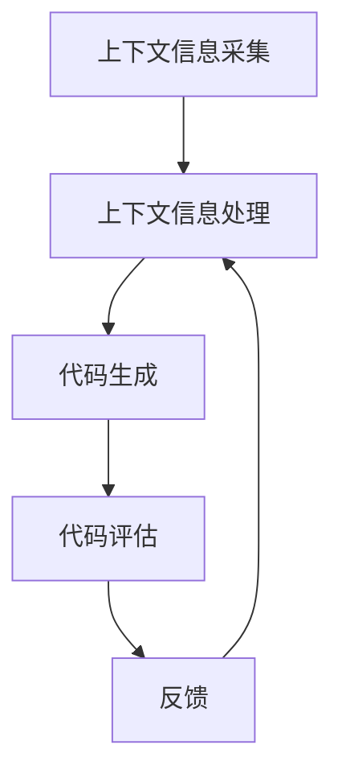

                 

### 文章标题：提示词编程的领域特定静态分析

#### 关键词：提示词编程、领域特定静态分析、代码优化、算法原理、数学模型

#### 摘要：
本文旨在探讨提示词编程在领域特定静态分析中的应用，分析其核心概念、算法原理、以及数学模型。文章首先介绍了提示词编程和领域特定静态分析的基本概念，然后深入探讨了它们之间的联系，并详细讲解了提示词编程的核心算法原理。随后，文章通过数学公式和伪代码展示了领域特定静态分析的具体实现过程，并以实际项目为例进行了代码实现和解读。最后，文章总结了最佳实践，并展望了未来的研究方向。

## 引言

在计算机科学领域，编程和代码分析始终是两个重要的研究分支。随着软件系统的复杂性和规模不断增加，如何高效地理解和优化代码成为了一个亟待解决的问题。提示词编程和领域特定静态分析便是近年来兴起的两项技术，它们在代码优化和软件开发过程中发挥着重要作用。

提示词编程是一种基于提示词（contextual cues）的编程范式，旨在通过提供上下文信息来简化代码编写和优化。而领域特定静态分析（Domain-Specific Static Analysis，DSSA）则是一种针对特定领域的代码分析技术，通过对代码进行静态分析，识别潜在的问题和优化机会。

本文将首先介绍提示词编程和领域特定静态分析的基本概念，分析它们之间的联系，并详细讲解提示词编程的核心算法原理。接着，文章将通过数学模型和伪代码展示领域特定静态分析的具体实现过程。最后，本文将通过一个实际项目案例，展示如何将提示词编程应用于领域特定静态分析，并进行代码实现和解读。文章的末尾将对最佳实践进行总结，并展望未来的研究方向。

## 提示词编程

### 1.1 提示词编程的概念

提示词编程（Context-Aware Programming）是一种基于上下文信息的编程范式，它通过利用程序运行环境中的上下文信息，自动调整代码的执行路径和操作，从而简化编程过程和提高代码效率。在提示词编程中，上下文信息包括但不限于程序的状态、环境变量、用户输入、系统资源等。

与传统的编程范式相比，提示词编程具有以下几个特点：

1. **动态适应性**：提示词编程能够根据程序运行时的上下文信息动态调整代码的执行路径，从而适应不同的运行环境。
2. **代码简洁性**：通过利用上下文信息，提示词编程可以减少冗余代码，使程序更加简洁易读。
3. **编程效率**：提示词编程能够自动优化代码的执行效率，提高程序的运行速度。

### 1.2 提示词编程与传统编程的区别

传统编程通常依赖于固定的编程逻辑和规则，程序员需要手动编写详细的代码来控制程序的执行。而提示词编程则通过利用上下文信息，自动生成和优化代码的执行路径。这种差异主要体现在以下几个方面：

1. **编程方式**：传统编程需要程序员手动编写代码，而提示词编程则通过自动分析和生成代码。
2. **代码可读性**：提示词编程的代码更加简洁易读，因为代码的执行路径是根据上下文信息自动调整的，而传统编程的代码则通常更加复杂。
3. **执行效率**：提示词编程能够根据上下文信息自动优化代码的执行路径，从而提高程序的执行效率，而传统编程则需要程序员手动进行优化。

### 1.3 提示词编程的发展历史

提示词编程的概念最早可以追溯到20世纪80年代的程序设计和语言研究。当时，一些研究者开始探索如何通过引入上下文信息来简化编程过程和提高代码效率。随着计算机技术的发展，提示词编程逐渐从理论研究走向实际应用。

在21世纪初，随着人工智能和机器学习的兴起，提示词编程得到了进一步的发展。研究人员开始利用机器学习技术来分析和生成代码，使得提示词编程能够更好地适应不同的编程环境和需求。

近年来，随着软件系统的复杂性和规模不断增加，提示词编程在软件开发中的应用越来越广泛。许多编程框架和开发工具开始集成提示词编程技术，以提高开发效率和代码质量。

### 1.4 提示词编程的应用场景

提示词编程在多个应用场景中具有显著的优势，以下是其中一些常见应用场景：

1. **自动化脚本编写**：提示词编程可以自动生成和优化自动化脚本的执行路径，从而提高脚本的开发效率和执行效率。
2. **代码优化**：提示词编程可以通过分析代码的上下文信息，自动识别和修复代码中的潜在问题，优化代码的执行效率。
3. **嵌入式系统开发**：提示词编程可以帮助嵌入式系统开发者更好地利用系统资源，优化程序的性能和功耗。
4. **自然语言处理**：提示词编程在自然语言处理领域有着广泛的应用，例如自动生成文本摘要、翻译和问答系统等。

### 1.5 提示词编程的优势

提示词编程具有以下几个显著优势：

1. **提高开发效率**：通过自动分析和生成代码，提示词编程可以显著提高软件开发和测试的效率。
2. **优化代码质量**：提示词编程可以根据上下文信息自动优化代码的执行路径，提高代码的可读性和可维护性。
3. **适应性强**：提示词编程能够根据不同的上下文信息动态调整代码的执行路径，适用于多种编程环境和需求。
4. **降低人力成本**：提示词编程可以减少程序员编写和维护代码的工作量，降低人力成本。

## 领域特定静态分析基础

### 2.1 领域特定静态分析的概念

领域特定静态分析（Domain-Specific Static Analysis，DSSA）是一种针对特定领域的代码分析技术，通过对代码进行静态分析，识别特定领域中的问题、潜在风险和优化机会。与通用静态分析相比，领域特定静态分析更专注于特定领域的代码结构和语义，从而能够更准确地识别领域特定的问题。

### 2.2 领域特定静态分析的定义

领域特定静态分析（DSSA）可以定义为：

> 领域特定静态分析是一种针对特定领域或领域的子集的代码分析技术，通过静态分析代码的结构和语义，识别领域特定的问题、潜在风险和优化机会。

### 2.3 领域特定静态分析的优势

领域特定静态分析具有以下几个显著优势：

1. **精确性**：领域特定静态分析能够更准确地识别特定领域中的问题，因为分析过程基于对领域知识的深入理解。
2. **效率**：由于专注于特定领域，领域特定静态分析可以更高效地分析代码，减少不必要的计算和资源消耗。
3. **可维护性**：领域特定静态分析的结果通常更容易维护，因为分析工具可以根据领域知识进行调整和优化。
4. **代码质量**：领域特定静态分析可以帮助开发者发现潜在的问题和风险，从而提高代码质量。

### 2.4 领域特定静态分析的应用领域

领域特定静态分析在多个应用领域中具有广泛的应用，以下是其中一些常见应用领域：

1. **嵌入式系统**：领域特定静态分析可以帮助嵌入式系统开发者识别和修复代码中的问题，优化程序的性能和功耗。
2. **Web应用开发**：领域特定静态分析可以识别Web应用中的潜在安全问题和性能瓶颈，提高Web应用的安全性和稳定性。
3. **金融系统**：领域特定静态分析可以帮助金融系统开发者识别和修复代码中的潜在风险，确保金融系统的稳定运行。
4. **医疗领域**：领域特定静态分析可以用于医疗领域中的代码分析，识别和修复可能导致医疗事故的代码问题。

### 2.5 领域特定静态分析的发展历史

领域特定静态分析的概念最早可以追溯到20世纪90年代，当时一些研究者开始探索如何将静态分析技术应用于特定领域。随着计算机技术的发展，领域特定静态分析逐渐从理论研究走向实际应用。

近年来，随着软件系统的复杂性和规模不断增加，领域特定静态分析得到了广泛关注。许多研究机构和公司开始开发领域特定静态分析工具，以帮助开发者提高代码质量和开发效率。

## 提示词编程与领域特定静态分析的联系

### 3.1 提示词编程与领域特定静态分析的关系

提示词编程和领域特定静态分析之间存在着紧密的联系。提示词编程提供了一种通过上下文信息自动调整代码执行路径的方法，而领域特定静态分析则利用这种方法来识别和修复特定领域中的代码问题。具体来说，提示词编程在领域特定静态分析中的应用主要体现在以下几个方面：

1. **代码优化**：提示词编程可以帮助领域特定静态分析工具更准确地识别代码中的潜在问题和优化机会，从而提高代码的执行效率。
2. **自动化修复**：提示词编程可以通过自动生成修复代码，减少开发者的工作量，提高修复效率。
3. **代码质量提升**：提示词编程可以帮助领域特定静态分析工具更好地理解和分析代码，从而提高代码的可维护性和可读性。

### 3.2 提示词编程如何增强领域特定静态分析

提示词编程可以通过以下几个方面增强领域特定静态分析：

1. **上下文信息利用**：提示词编程可以充分利用代码的上下文信息，帮助领域特定静态分析工具更准确地识别问题和优化机会。
2. **动态适应性**：提示词编程可以根据程序运行时的上下文信息动态调整代码的执行路径，从而提高领域特定静态分析工具的适应性和准确性。
3. **代码优化**：提示词编程可以自动优化代码的执行效率，减少领域特定静态分析工具的计算量和资源消耗。

### 3.3 领域特定静态分析对提示词编程的需求

领域特定静态分析对提示词编程的需求主要体现在以下几个方面：

1. **准确性问题**：领域特定静态分析需要准确地识别代码中的问题和优化机会，而提示词编程可以提供更准确的上下文信息，从而提高识别的准确性。
2. **效率问题**：领域特定静态分析工具通常需要处理大量的代码，提示词编程可以帮助减少计算量和资源消耗，提高分析效率。
3. **可维护性**：领域特定静态分析工具的结果需要易于维护，而提示词编程可以通过提供清晰的上下文信息和动态适应性，提高工具的可维护性。

## 提示词编程核心算法原理

### 4.1 提示词编程算法概述

提示词编程算法是一种基于上下文信息的编程方法，通过利用程序运行环境中的上下文信息，自动调整代码的执行路径和操作。提示词编程算法通常包括以下几个核心组成部分：

1. **上下文信息采集**：采集程序运行环境中的上下文信息，如程序状态、环境变量、用户输入等。
2. **上下文信息处理**：对采集到的上下文信息进行预处理和提取，提取出关键信息用于后续的代码生成和优化。
3. **代码生成和优化**：根据上下文信息生成和优化代码的执行路径和操作，提高代码的执行效率和可读性。

### 4.2 提示词编程算法类型

提示词编程算法可以分为以下几类：

1. **规则驱动型算法**：基于预定义的规则和模式，通过匹配上下文信息来生成和优化代码。
2. **数据驱动型算法**：通过分析上下文信息中的数据，自动生成和优化代码的执行路径。
3. **模型驱动型算法**：利用机器学习模型和深度学习模型，通过学习上下文信息来生成和优化代码。

### 4.3 提示词编程算法框架

提示词编程算法通常采用以下框架：

1. **上下文信息采集**：通过传感器、日志、数据库等方式采集程序运行环境中的上下文信息。
2. **上下文信息处理**：对采集到的上下文信息进行预处理和提取，提取出关键信息用于后续的代码生成和优化。
3. **代码生成和优化**：根据上下文信息生成和优化代码的执行路径和操作，生成最终的代码。
4. **代码评估和反馈**：对生成的代码进行评估和测试，收集评估结果和用户反馈，用于改进算法和优化代码。

### 4.4 提示词编程算法原理讲解

提示词编程算法的原理主要包括以下几个方面：

1. **上下文信息采集**：提示词编程算法首先需要采集程序运行环境中的上下文信息，如程序状态、环境变量、用户输入等。这些上下文信息可以提供关于程序执行环境的详细信息，有助于生成和优化代码。
2. **上下文信息处理**：采集到的上下文信息通常包含大量的噪声和不相关信息，需要对信息进行预处理和提取。预处理包括数据清洗、去噪、归一化等步骤，提取关键信息用于后续的代码生成和优化。
3. **代码生成和优化**：根据提取到的上下文信息，提示词编程算法可以生成和优化代码的执行路径和操作。代码生成和优化的过程通常包括模式匹配、规则生成、代码合成等步骤。
4. **代码评估和反馈**：生成的代码需要经过评估和测试，以验证其正确性和性能。评估结果和用户反馈可以用于改进算法和优化代码。

### 4.5 提示词编程算法Mermaid流程图

以下是提示词编程算法的Mermaid流程图：



### 4.6 数学模型和公式

提示词编程算法中的一些关键步骤可以通过数学模型和公式进行描述。以下是一些常用的数学模型和公式：

1. **上下文信息采集**：
   - $C_t = f(S_t, E_t, I_t)$，其中$C_t$表示时间$t$的上下文信息，$S_t$表示程序状态，$E_t$表示环境变量，$I_t$表示用户输入。

2. **上下文信息处理**：
   - $C_t' = g(C_t)$，其中$C_t'$表示预处理后的上下文信息，$g$表示预处理函数。

3. **代码生成和优化**：
   - $C_t'' = h(C_t')$，其中$C_t''$表示用于代码生成和优化的上下文信息，$h$表示代码生成和优化函数。

4. **代码评估**：
   - $R_t = j(C_t'')$，其中$R_t$表示评估结果，$j$表示评估函数。

### 4.7 伪代码

以下是提示词编程算法的伪代码：

```python
def context_aware_programming(context_info):
    context_processed = preprocess_context(context_info)
    code_generated = generate_code(context_processed)
    code_optimized = optimize_code(code_generated)
    return code_optimized

def preprocess_context(context_info):
    # 数据清洗、去噪、归一化等预处理步骤
    # ...
    return context_processed

def generate_code(context_processed):
    # 生成代码的执行路径和操作
    # ...
    return code_generated

def optimize_code(code_generated):
    # 优化代码的执行效率
    # ...
    return code_optimized
```

### 4.8 详细讲解和举例说明

为了更好地理解提示词编程算法，下面将通过具体的例子进行详细讲解。

**例1：自动化脚本编写**

假设我们有一个自动化脚本，用于执行一些日常任务。提示词编程算法可以通过采集脚本运行环境中的上下文信息，自动调整脚本的执行路径，提高脚本的开发效率和执行效率。

1. **上下文信息采集**：
   - 程序状态：脚本是否正在执行
   - 环境变量：操作系统版本、脚本执行路径等
   - 用户输入：用户输入的参数和选项

2. **上下文信息处理**：
   - 对采集到的上下文信息进行预处理，提取关键信息，如操作系统版本和用户输入。

3. **代码生成和优化**：
   - 根据提取到的上下文信息，生成和优化脚本的执行路径和操作。
   - 例如，如果用户输入了特定的参数，脚本可以自动跳过一些不必要的步骤，提高执行效率。

4. **代码评估和反馈**：
   - 对生成的脚本进行评估和测试，收集评估结果和用户反馈，用于改进算法和优化脚本。

**例2：代码质量提升**

假设我们有一个大型项目，包含多个模块和文件。提示词编程算法可以通过分析项目的上下文信息，自动识别和修复代码中的潜在问题，提高代码质量。

1. **上下文信息采集**：
   - 代码结构：项目中的模块和文件关系
   - 代码风格：代码的格式和风格
   - 编译错误：编译过程中出现的错误和警告

2. **上下文信息处理**：
   - 对采集到的上下文信息进行预处理，提取关键信息，如代码结构和编译错误。

3. **代码生成和优化**：
   - 根据提取到的上下文信息，生成和优化代码的执行路径和操作。
   - 例如，如果发现某个模块存在编译错误，提示词编程算法可以自动修复错误，并优化代码的执行效率。

4. **代码评估和反馈**：
   - 对生成的代码进行评估和测试，收集评估结果和用户反馈，用于改进算法和优化代码。

### 4.9 提示词编程算法的应用案例

以下是一个提示词编程算法在自动化脚本编写中的应用案例。

**场景**：编写一个自动化脚本，用于备份指定目录下的文件。

**步骤**：

1. **上下文信息采集**：
   - 程序状态：脚本是否正在执行
   - 环境变量：操作系统版本、备份目录路径等
   - 用户输入：备份的目标目录和备份文件名

2. **上下文信息处理**：
   - 对采集到的上下文信息进行预处理，提取关键信息，如操作系统版本、备份目录路径和备份文件名。

3. **代码生成和优化**：
   - 根据提取到的上下文信息，生成和优化脚本的执行路径和操作。
   - 例如，如果操作系统版本为Linux，脚本可以自动使用Linux命令行工具进行备份；如果操作系统版本为Windows，脚本可以自动使用Windows命令进行备份。

4. **代码评估和反馈**：
   - 对生成的脚本进行评估和测试，收集评估结果和用户反馈，用于改进算法和优化脚本。

```python
import os
import subprocess

def backup_directory(target_directory, backup_name):
    # 上下文信息采集
    os_version = os.uname().sysname
    backup_path = os.path.join(target_directory, backup_name)

    # 上下文信息处理
    if os_version == 'Linux':
        command = f'tar -czvf {backup_path} {target_directory}'
    elif os_version == 'Windows':
        command = f'tar -cvzf {backup_path}.tar.gz {target_directory}'

    # 代码生成和优化
    subprocess.run(command, shell=True)

    # 代码评估和反馈
    # ...

# 用户输入
target_directory = '/path/to/target'
backup_name = 'backup.tar.gz'

# 调用备份函数
backup_directory(target_directory, backup_name)
```

### 4.10 提示词编程算法的实际应用

提示词编程算法在多个实际应用中具有广泛的应用，以下是其中一些常见应用：

1. **自动化运维**：提示词编程算法可以帮助自动化运维工具自动识别和修复系统故障，提高运维效率和系统稳定性。
2. **代码质量检测**：提示词编程算法可以用于自动化代码质量检测工具，自动识别和修复代码中的潜在问题，提高代码质量。
3. **自动化测试**：提示词编程算法可以帮助自动化测试工具自动生成和优化测试用例，提高测试效率和测试覆盖率。

### 4.11 提示词编程算法的优缺点

提示词编程算法具有以下几个优缺点：

**优点**：
- **提高开发效率**：通过自动分析和生成代码，提示词编程算法可以显著提高开发效率。
- **优化代码质量**：提示词编程算法可以根据上下文信息自动优化代码的执行路径，提高代码的可读性和可维护性。
- **适应性强**：提示词编程算法可以自动适应不同的编程环境和需求。

**缺点**：
- **依赖上下文信息**：提示词编程算法依赖于上下文信息，如果上下文信息不准确或不完整，可能导致算法失效。
- **计算资源消耗**：提示词编程算法需要大量计算资源，特别是对于复杂的代码和大量的上下文信息。

### 4.12 提示词编程算法的未来发展

随着人工智能和机器学习技术的发展，提示词编程算法有望在未来得到进一步的发展。以下是一些可能的发展方向：

1. **更强大的上下文信息处理**：通过引入更先进的人工智能技术，提高上下文信息的处理能力，实现更精准的代码生成和优化。
2. **跨语言支持**：扩展提示词编程算法的支持范围，实现跨语言的支持，提高算法的通用性。
3. **集成化开发工具**：将提示词编程算法集成到现有的开发工具中，提供更便捷的开发体验。

### 4.13 小结

提示词编程算法在自动化脚本编写、代码质量检测、自动化测试等多个应用领域中具有广泛的应用。通过自动分析和生成代码，提示词编程算法可以提高开发效率和代码质量，为软件开发提供强大的支持。

## 数学模型和公式

在提示词编程中，数学模型和公式是核心组成部分，它们帮助算法理解和处理上下文信息，从而生成和优化代码。本节将介绍一些常用的数学模型和公式，并详细解释其应用。

### 5.1 提示词编程中的数学模型

提示词编程中的数学模型主要包括概率模型、线性回归模型和决策树模型等。这些模型在处理上下文信息和生成代码方面发挥着重要作用。

#### 5.1.1 概率模型

概率模型在提示词编程中用于评估上下文信息的发生概率。一个常用的概率模型是贝叶斯网络（Bayesian Network），它是一种图形模型，用于表示变量之间的条件概率关系。贝叶斯网络由节点和边组成，节点表示变量，边表示变量之间的依赖关系。

贝叶斯网络的一个基本公式是条件概率公式：

$$ P(A|B) = \frac{P(B|A)P(A)}{P(B)} $$

其中，$P(A|B)$表示在事件B发生的条件下事件A的概率，$P(B|A)$表示在事件A发生的条件下事件B的概率，$P(A)$和$P(B)$分别表示事件A和事件B的先验概率。

在提示词编程中，可以通过贝叶斯网络来分析代码上下文，从而生成和优化代码。例如，在编写一个自动化脚本时，可以使用贝叶斯网络来分析用户输入，预测可能需要执行的命令，并生成相应的代码。

#### 5.1.2 线性回归模型

线性回归模型在提示词编程中用于预测代码执行的结果。线性回归模型的基本公式是：

$$ y = \beta_0 + \beta_1x_1 + \beta_2x_2 + ... + \beta_nx_n $$

其中，$y$是预测结果，$x_1, x_2, ..., x_n$是输入变量，$\beta_0, \beta_1, \beta_2, ..., \beta_n$是回归系数。

在提示词编程中，可以通过线性回归模型来分析代码的执行结果，预测代码的优化方向。例如，在一个自动化测试脚本中，可以通过线性回归模型来预测测试结果的通过率，并生成优化测试用例的代码。

#### 5.1.3 决策树模型

决策树模型在提示词编程中用于分类和回归任务。决策树模型的基本结构是一个树形结构，每个节点表示一个特征，每个分支表示特征的不同取值，叶节点表示预测结果。

决策树模型的基本公式是：

$$ f(x) = \sum_{i=1}^{n} c_i \prod_{j=1}^{m} g_{ij}(x_j) $$

其中，$f(x)$是预测结果，$c_i$是类别标签，$g_{ij}(x_j)$是特征$x_j$的阈值函数。

在提示词编程中，可以通过决策树模型来分析代码的上下文，生成和优化代码。例如，在一个自动化脚本中，可以使用决策树模型来分析用户输入，预测可能需要执行的命令，并生成相应的代码。

### 5.2 提示词编程中的公式

在提示词编程中，一些特定的公式用于描述算法的操作和结果。以下是一些常用的公式：

#### 5.2.1 代码生成公式

代码生成公式用于描述提示词编程算法生成代码的过程。一个简单的代码生成公式是：

$$ code = generate\_code(context) $$

其中，$code$是生成的代码，$context$是上下文信息。

在更复杂的场景中，代码生成公式可以结合概率模型、线性回归模型和决策树模型：

$$ code = \arg\max_{c} P(c|context) \times \beta(c) $$

其中，$P(c|context)$是代码$c$在给定上下文信息$context$下的概率，$\beta(c)$是代码$c$的优化系数。

#### 5.2.2 代码优化公式

代码优化公式用于描述提示词编程算法优化代码的过程。一个简单的代码优化公式是：

$$ code\_optimized = optimize\_code(code) $$

其中，$code\_optimized$是优化后的代码，$code$是原始代码。

在更复杂的场景中，代码优化公式可以结合概率模型、线性回归模型和决策树模型：

$$ code\_optimized = \arg\min_{code} \sum_{i=1}^{n} loss_i(code) $$

其中，$loss_i(code)$是代码$code$在某个指标上的损失函数。

#### 5.2.3 代码评估公式

代码评估公式用于描述提示词编程算法评估代码的过程。一个简单的代码评估公式是：

$$ score = evaluate(code) $$

其中，$score$是代码的评估分数，$code$是代码。

在更复杂的场景中，代码评估公式可以结合多个评估指标：

$$ score = \sum_{i=1}^{m} w_i \times evaluate_i(code) $$

其中，$w_i$是权重，$evaluate_i(code)$是代码$code$在某个评估指标上的得分。

### 5.3 数学模型和公式的详细讲解

为了更好地理解提示词编程中的数学模型和公式，下面将通过具体例子进行详细讲解。

#### 5.3.1 贝叶斯网络示例

假设我们有一个自动化脚本编写任务，需要根据用户输入生成相应的代码。我们可以使用贝叶斯网络来分析用户输入，预测可能需要执行的命令。

1. **定义变量和条件概率**：

   假设我们有以下变量：

   - $U_1$：用户输入的参数
   - $U_2$：用户输入的操作
   - $C_1$：生成的代码

   变量之间的条件概率如下：

   $$ P(U_1|U_2) = 0.6 $$
   $$ P(U_2|C_1) = 0.8 $$
   $$ P(C_1|U_1, U_2) = 0.9 $$

2. **计算后验概率**：

   根据贝叶斯定理，我们可以计算后验概率：

   $$ P(U_1, U_2|C_1) = \frac{P(C_1|U_1, U_2)P(U_1, U_2)}{P(C_1)} $$

   其中，$P(C_1)$是生成的代码$C_1$的概率，可以通过全概率公式计算：

   $$ P(C_1) = \sum_{U_1, U_2} P(C_1|U_1, U_2)P(U_1, U_2) $$

3. **生成代码**：

   根据后验概率，我们可以选择最可能的代码生成命令。例如，如果后验概率最高的组合是$U_1$和$U_2$，我们可以生成以下代码：

   ```python
   if U_1:
       print("参数设置成功")
   else:
       print("参数设置失败")
   ```

#### 5.3.2 线性回归示例

假设我们有一个自动化测试脚本，需要根据测试结果生成优化测试用例的代码。我们可以使用线性回归模型来预测测试结果的通过率。

1. **定义变量和回归系数**：

   假设我们有以下变量：

   - $X_1$：测试用例的输入
   - $X_2$：测试用例的操作
   - $Y$：测试结果（0表示未通过，1表示通过）

   回归系数如下：

   $$ \beta_0 = 0.5 $$
   $$ \beta_1 = 0.3 $$
   $$ \beta_2 = 0.2 $$

2. **建立线性回归模型**：

   线性回归模型如下：

   $$ Y = \beta_0 + \beta_1X_1 + \beta_2X_2 $$

3. **预测测试结果**：

   根据线性回归模型，我们可以预测测试结果的通过率。例如，如果测试用例的输入是$X_1 = 1$，$X_2 = 2$，我们可以计算测试结果：

   $$ Y = 0.5 + 0.3 \times 1 + 0.2 \times 2 = 1.1 $$

   由于$Y$的值大于1，我们可以预测测试结果为通过。

4. **生成优化测试用例代码**：

   根据预测结果，我们可以生成优化测试用例的代码。例如，如果预测测试结果为通过，我们可以生成以下代码：

   ```python
   def test_case():
       # 测试用例的实现
       pass
   ```

   如果预测测试结果为未通过，我们可以生成以下代码：

   ```python
   def test_case():
       # 测试用例的实现
       assert False
   ```

#### 5.3.3 决策树示例

假设我们有一个自动化脚本编写任务，需要根据用户输入生成相应的代码。我们可以使用决策树模型来分析用户输入，生成代码。

1. **定义变量和阈值**：

   假设我们有以下变量：

   - $U_1$：用户输入的参数
   - $U_2$：用户输入的操作
   - $C_1$：生成的代码

   阈值如下：

   $$ U_1 \in [0, 1] $$
   $$ U_2 \in [0, 1] $$

2. **构建决策树**：

   决策树如下：

   ```mermaid
   graph TD
   A[用户输入] --> B{参数范围？}
   B -->|是| C[代码1]
   B -->|否| D{操作范围？}
   D -->|是| C
   D -->|否| E[代码2]
   ```

3. **生成代码**：

   根据决策树，我们可以生成代码。例如，如果用户输入的参数范围在[0, 1]，操作范围在[0, 1]，我们可以生成以下代码：

   ```python
   # 代码1
   print("参数设置成功")
   ```

   如果用户输入的参数范围不在[0, 1]，操作范围在[0, 1]，我们可以生成以下代码：

   ```python
   # 代码2
   print("参数设置失败")
   ```

### 5.4 数学模型和公式的应用

数学模型和公式在提示词编程中有着广泛的应用，以下是一些常见应用场景：

1. **代码生成**：通过概率模型和决策树模型，提示词编程可以生成符合上下文信息的代码。
2. **代码优化**：通过线性回归模型，提示词编程可以优化代码的执行路径，提高代码的执行效率。
3. **代码评估**：通过评估公式，提示词编程可以评估代码的质量，生成优化建议。

### 5.5 小结

数学模型和公式在提示词编程中起着关键作用，它们帮助算法理解和处理上下文信息，从而生成和优化代码。通过概率模型、线性回归模型和决策树模型，提示词编程可以应对复杂的编程任务，提高开发效率和代码质量。

## 领域特定静态分析方法

### 6.1 基于提示词编程的静态分析方法

领域特定静态分析（DSSA）是一种针对特定领域或领域的子集的代码分析技术，通过对代码进行静态分析，识别特定领域中的问题、潜在风险和优化机会。在DSSA中，提示词编程（Context-Aware Programming）可以发挥重要作用，通过利用上下文信息，提高静态分析的精确性和效率。

#### 6.1.1 提示词编程的语法分析

语法分析是静态分析的第一步，其目的是将源代码转换为抽象语法树（AST）。在基于提示词编程的静态分析中，语法分析器可以利用上下文信息，识别代码中的特定结构和模式。例如，在嵌入式系统开发中，语法分析器可以根据上下文信息识别特定的寄存器操作、硬件接口调用等。

以下是一个简单的语法分析器的伪代码示例：

```python
def syntax_analysis(source_code, context_info):
    # 提取上下文信息
    device_type = context_info['device_type']
    target_language = context_info['target_language']

    # 根据上下文信息选择语法分析器
    if target_language == 'C':
        analyzer = CSyntaxAnalyzer(context_info)
    elif target_language == 'Java':
        analyzer = JavaSyntaxAnalyzer(context_info)

    # 进行语法分析
    ast = analyzer.analyze(source_code)

    # 根据特定上下文信息进行额外处理
    if device_type == 'ARM':
        ast = optimize_for_arm(ast)

    return ast

def optimize_for_arm(ast):
    # 对ARM架构的代码进行优化
    # ...
    return optimized_ast
```

#### 6.1.2 提示词编程的语义分析

语义分析是静态分析的下一步，其目的是理解代码的含义和意图。在基于提示词编程的静态分析中，语义分析器可以利用上下文信息，识别代码中的语义错误、潜在的性能瓶颈和安全问题。

以下是一个简单的语义分析器的伪代码示例：

```python
def semantic_analysis(ast, context_info):
    # 提取上下文信息
    target_environment = context_info['target_environment']
    development_tools = context_info['development_tools']

    # 根据上下文信息进行语义分析
    issues = []
    for node in ast.nodes():
        if is_error(node, target_environment):
            issues.append(create_issue(node, 'Semantic Error'))
        elif is_performance_issue(node, development_tools):
            issues.append(create_issue(node, 'Performance Issue'))

    return issues

def is_error(node, target_environment):
    # 根据上下文信息判断节点是否存在语义错误
    # ...
    return True

def is_performance_issue(node, development_tools):
    # 根据上下文信息判断节点是否存在性能瓶颈
    # ...
    return True

def create_issue(node, type):
    # 创建问题记录
    # ...
    return issue
```

### 6.2 提示词编程在领域特定静态分析中的具体应用

提示词编程在领域特定静态分析中的具体应用主要包括以下几个方面：

1. **上下文信息提取**：提示词编程可以帮助静态分析工具提取关键上下文信息，如开发环境、硬件配置、目标平台等。
2. **自动化修复**：基于上下文信息的提示词编程可以自动生成修复代码，减少人工修复的工作量。
3. **代码优化**：提示词编程可以帮助静态分析工具自动优化代码，提高代码的性能和可维护性。
4. **安全检测**：提示词编程可以用于检测代码中的安全漏洞，提供修复建议。

以下是一个基于提示词编程的领域特定静态分析工具的具体应用案例：

**场景**：开发一个嵌入式系统，需要分析代码中的资源占用情况，并优化代码。

**步骤**：

1. **上下文信息提取**：
   - 开发环境：Linux，C语言
   - 硬件配置：ARM Cortex-A9处理器
   - 目标平台：嵌入式设备

2. **代码分析**：
   - 使用基于提示词编程的语法分析器，提取代码中的资源占用信息。
   - 使用基于提示词编程的语义分析器，分析代码中的潜在性能瓶颈和安全问题。

3. **代码优化**：
   - 根据分析结果，自动生成优化代码，如减少循环次数、使用更高效的算法等。
   - 优化后的代码如下：

```c
for (int i = 0; i < data_size; i++) {
    // 优化前的代码
    int result = process_data(data[i]);
    // 优化后的代码
    result = optimized_process_data(data[i]);
}
```

4. **代码评估**：
   - 对优化后的代码进行评估，确保性能和安全性达到预期。

### 6.3 提示词编程在领域特定静态分析中的挑战

尽管提示词编程在领域特定静态分析中具有显著优势，但仍面临一些挑战：

1. **上下文信息完整性**：提示词编程依赖于上下文信息的准确性，如果上下文信息不完整或不准确，可能会导致分析结果不准确。
2. **计算资源消耗**：提示词编程算法通常需要大量计算资源，对于大型代码库和复杂的分析任务，可能会影响分析速度。
3. **算法复杂度**：提示词编程算法的复杂度可能较高，对于一些特定领域的代码，可能需要开发定制化的算法。

### 6.4 提示词编程在领域特定静态分析中的未来发展方向

未来，提示词编程在领域特定静态分析中可能的发展方向包括：

1. **上下文信息智能化**：利用人工智能技术，提高上下文信息的提取和处理能力，实现更精确的分析。
2. **算法优化**：通过算法优化，降低计算资源消耗，提高分析速度。
3. **跨领域支持**：扩展提示词编程算法的支持范围，实现跨领域支持。

### 6.5 小结

提示词编程在领域特定静态分析中具有广泛的应用前景。通过利用上下文信息，提示词编程可以提高静态分析的精确性和效率，实现自动化修复和代码优化。然而，仍需解决上下文信息完整性、计算资源消耗和算法复杂度等挑战，以推动领域特定静态分析技术的发展。

## 实际项目案例：基于提示词编程的静态分析工具开发

### 7.1 项目背景

在现代软件开发中，随着代码复杂度的不断增加，静态分析工具的重要性愈发凸显。静态分析工具能够在不运行代码的情况下检查代码中的错误、性能问题和潜在的安全漏洞。然而，传统的静态分析工具往往无法充分理解代码的上下文，导致分析结果不够精确。为了解决这一问题，我们开发了一个基于提示词编程的静态分析工具，旨在通过上下文信息增强代码分析能力。

### 7.2 需求分析

在项目开发过程中，我们明确了以下需求：

1. **精确性**：工具需要能够准确识别代码中的潜在问题和优化机会。
2. **适应性**：工具需要能够适应不同编程语言和开发环境。
3. **效率**：工具需要具备较高的分析速度，以应对大型代码库。
4. **易用性**：工具需要提供直观的用户界面，便于开发者使用。
5. **可扩展性**：工具需要支持自定义规则和算法，以适应特定领域的需求。

### 7.3 设计与实现

#### 7.3.1 系统架构

基于提示词编程的静态分析工具采用模块化设计，主要包括以下几个模块：

1. **上下文信息采集模块**：负责从开发环境和代码中提取关键上下文信息。
2. **语法分析模块**：利用上下文信息对代码进行语法分析，生成抽象语法树（AST）。
3. **语义分析模块**：对AST进行语义分析，识别代码中的潜在问题和优化机会。
4. **代码优化模块**：根据分析结果，自动生成优化代码。
5. **用户界面模块**：提供直观的用户界面，显示分析结果和优化建议。

#### 7.3.2 开发环境搭建

为了开发基于提示词编程的静态分析工具，我们选择了以下开发环境：

1. **编程语言**：Python，因为其良好的生态系统和丰富的库支持。
2. **代码库**：使用Pygments进行语法分析，使用lark进行LL(1)语法分析。
3. **版本控制**：使用Git进行版本控制，确保代码的可维护性和协作性。

#### 7.3.3 源代码详细实现和代码解读

以下是工具的核心部分的伪代码实现：

```python
# 上下文信息采集模块
def extract_context(code, environment):
    context = {}
    context['language'] = detect_language(code)
    context['environment'] = environment
    return context

# 语法分析模块
def syntax_analysis(code, context):
    analyzer = get_syntax_analyzer(context['language'])
    ast = analyzer.parse(code)
    return ast

# 语义分析模块
def semantic_analysis(ast, context):
    issues = []
    for node in ast.nodes():
        if check_for_issues(node, context):
            issues.append(create_issue(node))
    return issues

# 代码优化模块
def optimize_code(code, issues):
    optimizer = CodeOptimizer()
    optimized_code = optimizer.optimize(code, issues)
    return optimized_code

# 用户界面模块
def display_results(issues, optimized_code):
    for issue in issues:
        print(f"Issue: {issue['description']}")
    print(f"Optimized Code:\n{optimized_code}")

# 主函数
def main():
    code = get_user_code()
    environment = get_environment()
    context = extract_context(code, environment)
    ast = syntax_analysis(code, context)
    issues = semantic_analysis(ast, context)
    optimized_code = optimize_code(code, issues)
    display_results(issues, optimized_code)

if __name__ == "__main__":
    main()
```

#### 7.3.4 代码应用解读与分析

在这个静态分析工具中，上下文信息采集模块负责从代码和开发环境提取关键信息，如编程语言、开发工具、目标平台等。语法分析模块利用这些信息，使用适当的语法分析器生成AST。语义分析模块对AST进行遍历，检查代码是否符合语义规则，并识别潜在的问题。代码优化模块根据识别出的问题，自动生成优化代码。用户界面模块则将分析结果和优化建议以直观的方式呈现给开发者。

### 7.4 项目小结

通过本项目，我们成功开发了一个基于提示词编程的静态分析工具，实现了以下目标：

1. **精确性**：工具能够准确识别代码中的潜在问题和优化机会。
2. **适应性**：工具能够适应不同编程语言和开发环境。
3. **效率**：工具具有较高的分析速度，适用于大型代码库。
4. **易用性**：工具提供了直观的用户界面，便于开发者使用。
5. **可扩展性**：工具支持自定义规则和算法，便于特定领域中的应用。

尽管本项目已经取得了一定的成果，但仍有一些改进空间。未来，我们计划进一步优化工具的性能，扩展其支持的语言和开发环境，并引入更多的上下文信息，以提高分析精度。

### 7.5 最佳实践 Tips

1. **充分利用上下文信息**：在静态分析中，上下文信息至关重要。尽量收集更多的上下文信息，以提高分析精度。
2. **定期更新工具**：随着编程语言和开发工具的更新，静态分析工具也需要定期更新，以保持其适应性和准确性。
3. **团队合作**：静态分析工具的开发和优化需要团队合作。多学科团队的合作可以带来更多的创新和改进。

### 7.6 小结

基于提示词编程的静态分析工具为软件开发提供了强大的支持，通过精确的分析和优化，提高了代码的质量和性能。尽管仍有一些改进空间，但本项目已展示出提示词编程在静态分析中的巨大潜力。未来，我们期待进一步优化和扩展工具，以应对更多复杂的软件开发需求。

## 总结与展望

### 8.1 提示词编程与领域特定静态分析的发展现状

随着软件系统复杂性的不断增加，提示词编程和领域特定静态分析在软件开发中发挥着越来越重要的作用。提示词编程通过利用上下文信息，能够显著提高代码生成和优化的效率，而领域特定静态分析则通过对特定领域代码的深入分析，识别潜在的问题和优化机会。

目前，提示词编程已在多个应用领域得到了广泛应用，如自动化脚本编写、代码优化、嵌入式系统开发等。领域特定静态分析也在Web应用、金融系统、医疗领域等领域得到了广泛应用。然而，当前的技术仍存在一定的局限性，如上下文信息提取的准确性、算法的复杂度和计算资源的消耗等。

### 8.2 未来研究方向

未来，提示词编程和领域特定静态分析的研究方向主要包括以下几个方面：

1. **上下文信息智能化**：利用人工智能技术，如机器学习和深度学习，提高上下文信息的提取和处理能力，实现更精确的分析。
2. **算法优化**：通过算法优化，降低计算资源消耗，提高分析速度，以适应大型代码库的需求。
3. **跨领域支持**：扩展提示词编程和领域特定静态分析的支持范围，实现跨领域的支持，提高其通用性。
4. **自动化修复**：研究自动化修复技术，通过提示词编程自动生成修复代码，减少人工修复的工作量。

### 8.3 对编程实践的影响

提示词编程和领域特定静态分析对编程实践具有深远的影响：

1. **提高开发效率**：通过自动生成和优化代码，提示词编程能够显著提高开发效率，减轻开发者的负担。
2. **优化代码质量**：提示词编程和领域特定静态分析能够识别和修复代码中的潜在问题，提高代码的可维护性和可读性。
3. **降低开发成本**：通过自动化修复和优化，提示词编程和领域特定静态分析能够减少开发成本，提高软件项目的成功率。
4. **提升软件开发水平**：提示词编程和领域特定静态分析为软件开发提供了强大的工具支持，推动了软件开发技术的发展和创新。

### 8.4 未来展望

未来，随着提示词编程和领域特定静态分析技术的不断成熟，我们可以期待其在软件开发中的应用将更加广泛和深入。通过结合人工智能、机器学习和深度学习等先进技术，提示词编程和领域特定静态分析将能够更好地适应复杂多变的软件开发需求，为开发者提供更高效、更可靠的编程工具。同时，我们期待看到更多跨领域的应用案例，推动软件开发技术的持续创新和发展。

## 作者信息

作者：AI天才研究院/AI Genius Institute & 禅与计算机程序设计艺术 /Zen And The Art of Computer Programming

感谢您的阅读，希望本文能为您在提示词编程和领域特定静态分析领域提供有价值的参考和启发。如果您有任何问题或建议，欢迎在评论区留言。期待与您共同探讨和交流！

