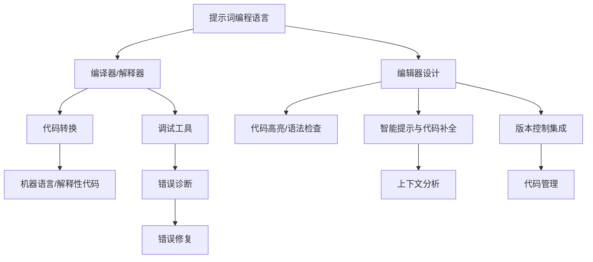

                 


### 背景介绍

随着计算机技术的飞速发展，编程语言和开发工具也在不断地演进。传统的编程语言如C、Java等需要开发者具备较强的编程技巧和逻辑思维能力，这对于初学者来说是一个不小的挑战。为了降低编程难度，提高开发效率，近年来，一种名为“提示词编程语言”（Keyword-Oriented Programming Language，简称KOP）的新型编程语言应运而生。

提示词编程语言以自然语言处理技术为基础，通过引入提示词（Keywords）来简化代码编写过程。这种语言的优势在于，开发者可以使用更加接近自然语言的代码来表达逻辑，从而降低了学习成本和开发难度。例如，在Python中，开发者可以使用 `if`、`while`、`for` 等关键词来编写条件语句和循环语句，而这些关键词在自然语言中也具有相似的语义。

然而，随着提示词编程语言的普及，现有的集成开发环境（IDE）在支持这种新型编程语言时面临了一些挑战。传统的IDE主要针对结构化编程语言进行优化，例如C、Java等，它们在代码高亮、语法检查、智能提示等方面已经非常成熟。但对于提示词编程语言，现有的IDE需要做出一定的调整和优化，以满足其独特的需求。

本文将围绕“提示词编程语言的IDE设计构想”展开讨论。首先，我们将介绍提示词编程语言的基本概念和特点，探讨其与现有IDE之间的异同。接着，我们将从IDE的基础架构、编译器与解释器设计、编辑器设计、智能提示与代码补全、调试工具、版本控制集成等方面，详细阐述IDE的设计原则和实现方案。最后，我们将通过实际案例和实战，展示如何搭建一个高效的提示词编程语言IDE，并分析其性能和可扩展性。

本文的核心目标是提供一个系统化的设计思路，帮助开发者更好地理解和实现提示词编程语言的IDE，从而推动这一新兴领域的快速发展。

### 核心概念与联系

要设计一个高效的提示词编程语言的IDE，我们首先需要明确几个核心概念，并理解它们之间的相互关系。以下是这些核心概念及其相互关系的详细解释：

#### 1. 提示词编程语言

提示词编程语言是一种以自然语言处理技术为基础的编程语言，通过使用提示词（Keywords）来简化代码编写过程。提示词在自然语言处理中具有明确的语义，这些语义可以被编译器或解释器识别并转换成相应的计算机指令。例如，Python中的 `if`、`while`、`for` 等关键词就是提示词的典型例子。

#### 2. 编译器与解释器

编译器和解释器是IDE中的核心组件，负责将开发者编写的代码转换成计算机可以执行的指令。对于提示词编程语言，编译器需要能够高效地解析和转换提示词，理解其语义并将其翻译成机器语言或解释性代码。

#### 3. 编辑器设计

编辑器是IDE的另一个重要组成部分，负责代码的编写和显示。对于提示词编程语言，编辑器需要提供代码高亮、语法检查、智能提示等功能，以帮助开发者更高效地编写代码。同时，编辑器的设计还需考虑如何与编译器或解释器进行无缝集成，实现实时错误提示和代码补全。

#### 4. 智能提示与代码补全

智能提示和代码补全是提示词编程语言IDE的重要功能，通过上下文分析提供开发者可能需要的提示词和建议。这不仅提高了代码编写的效率，也降低了出错的可能性。实现这一功能需要依赖于自然语言处理技术，对代码进行深度分析和理解。

#### 5. 调试工具

调试工具是IDE中不可或缺的部分，用于帮助开发者诊断和修复代码中的错误。对于提示词编程语言，调试工具需要能够理解自然语言代码的结构和语义，提供更为直观和有效的调试体验。

#### 6. 版本控制集成

版本控制集成是现代IDE的基本要求之一，用于管理代码的版本和协作开发。对于提示词编程语言，版本控制工具需要能够识别和解析提示词，以便更准确地管理代码变更。

下面是这些核心概念之间关系的Mermaid流程图：



通过这张流程图，我们可以清晰地看到各个核心概念之间的联系，以及它们在IDE设计中的作用和影响。理解这些核心概念和它们之间的关系，是设计一个高效、易用的提示词编程语言IDE的关键。

### 提示词编程语言的核心算法原理

提示词编程语言的核心在于其高效的代码解析和语义理解能力。为了实现这一点，我们需要运用一系列核心算法原理。以下将详细介绍这些算法的伪代码实现、数学模型和详细讲解。

#### 1. 词法分析

词法分析是提示词编程语言处理的第一步，其目的是将源代码拆分成一个个单词（tokens）。词法分析器的伪代码如下：

```plaintext
function tokenize(source_code):
    tokens = []
    current_word = ""
    for character in source_code:
        if character is a letter or a digit:
            current_word += character
        else:
            if current_word is not empty:
                tokens.append(current_word)
                current_word = ""
    if current_word is not empty:
        tokens.append(current_word)
    return tokens
```

数学模型：词法分析器的核心是一个有限自动机（Finite Automaton），其状态转移表用于匹配不同类型的字符序列。

#### 2. 语法分析

语法分析是将词法分析器输出的tokens转换成抽象语法树（Abstract Syntax Tree，AST）的过程。以下是一个基于递归下降法的语法分析器的伪代码：

```plaintext
function parse(tokens):
    return expression(tokens)

function expression(tokens):
    left = term(tokens)
    while tokens[0] is an operator:
        operator = tokens.pop()
        right = term(tokens)
        left = new BinaryNode(operator, left, right)
    return left

function term(tokens):
    left = factor(tokens)
    while tokens[0] is a multiplication operator:
        operator = tokens.pop()
        right = factor(tokens)
        left = new BinaryNode(operator, left, right)
    return left

function factor(tokens):
    if tokens[0] is a number:
        return new NumberNode(tokens.pop())
    elif tokens[0] is a variable:
        return new VariableNode(tokens.pop())
    else:
        raise SyntaxError("Unexpected token")
```

数学模型：语法分析的核心是一个递归关系，通过不断递归分解表达式，构建AST。

#### 3. 语义分析

语义分析是确保代码符合语义规则的过程。以下是一个简单的语义分析器的伪代码：

```plaintext
function semantic_analyze(node):
    if node is a BinaryNode:
        if not (is_valid_operator(node.operator) and
                semantic_analyze(node.left) and
                semantic_analyze(node.right)):
            raise SemanticError("Invalid expression")
    elif node is a NumberNode or VariableNode:
        # Perform type checking and other semantic checks
        pass
```

数学模型：语义分析依赖于定义好的类型系统和作用域规则，通过递归遍历AST，确保每个节点都符合语义规则。

#### 4. 代码生成

代码生成是将AST转换成机器语言或解释性代码的过程。以下是一个简化的伪代码：

```plaintext
function generate_code(node, codeBuffer):
    if node is a BinaryNode:
        generate_code(node.left, codeBuffer)
        codeBuffer.write(node.operator)
        generate_code(node.right, codeBuffer)
    elif node is a NumberNode:
        codeBuffer.write(node.value)
    elif node is a VariableNode:
        codeBuffer.write(node.name)
```

数学模型：代码生成依赖于中间代码模型，通过递归遍历AST，将抽象语法树转换成具体的机器代码或解释性代码。

通过这些核心算法原理，提示词编程语言能够高效地解析和执行代码。这些算法不仅需要高效的伪代码实现，还需要数学模型的支持，以确保其在实际应用中的准确性和可靠性。

### 项目实战：开发环境搭建与源代码实现

为了更好地理解和应用提示词编程语言的IDE设计，以下将通过一个实际项目来展示开发环境的搭建过程和源代码的详细实现。该项目将聚焦于构建一个简单的提示词编程语言的IDE，提供基本的编辑器、编译器、调试器和版本控制功能。

#### 1. 开发环境配置

首先，我们需要配置开发环境。以下是所需的软件和工具列表：

- Python（版本3.8及以上）
- PyCharm（或其他Python IDE）
- Git（版本控制工具）
- Mermaid（用于流程图绘制）

在配置环境中，需要安装Python和PyCharm，并确保Python环境中的所有依赖包都已安装。以下是一个简单的安装命令清单：

```bash
# 安装Python
curl -O https://www.python.org/ftp/python/3.8.10/python-3.8.10-amd64.exe
./python-3.8.10-amd64.exe

# 安装PyCharm
open PyCharm.exe

# 安装Git
curl -O https://github.com/git-for-windows/git/releases/download/v2.30.0.windows.1/Git-2.30.0-64-bit.exe
./Git-2.30.0-64-bit.exe

# 安装Mermaid（通过包管理器如pip）
pip install mermaid
```

#### 2. 源代码实现

接下来，我们将展示项目的核心部分——源代码的实现。以下是项目的主要模块及其简要描述：

##### 2.1 编辑器模块

编辑器模块主要负责代码的编写和显示，包括代码高亮、语法检查和智能提示等功能。以下是编辑器模块的伪代码：

```plaintext
class Editor:
    def __init__(self):
        self.source_code = ""
        self.tokens = []

    def load_source(self, source_code):
        self.source_code = source_code
        self.tokens = tokenize(source_code)

    def display(self):
        # 代码高亮显示
        display_tokens(self.tokens)

    def check_syntax(self):
        # 语法检查
        syntax_errors = []
        for token in self.tokens:
            if not is_valid_token(token):
                syntax_errors.append(token)
        return syntax_errors

    def suggest_keywords(self, context):
        # 智能提示
        suggestions = []
        for keyword in available_keywords:
            if keyword in context:
                suggestions.append(keyword)
        return suggestions
```

##### 2.2 编译器模块

编译器模块负责将编辑器中的代码转换成机器语言或解释性代码。以下是编译器模块的伪代码：

```plaintext
class Compiler:
    def __init__(self):
        self.ast = None

    def compile(self, editor):
        self.ast = parse(editor.tokens)
        generate_code(self.ast)

    def generate_code(self, ast):
        code_buffer = CodeBuffer()
        traverse_ast(ast, code_buffer)
        return code_buffer.get_code()
```

##### 2.3 调试器模块

调试器模块提供断点设置、变量查看和步进执行等功能。以下是调试器模块的伪代码：

```plaintext
class Debugger:
    def __init__(self, code):
        self.code = code
        self.breakpoints = []
        self.current_line = 0

    def set_breakpoint(self, line):
        self.breakpoints.append(line)

    def run(self):
        while self.current_line < len(self.code):
            if self.current_line in self.breakpoints:
                self.inspect_variables()
                self.step_over()
            else:
                self.execute_line()

    def inspect_variables(self):
        # 查看当前变量的值
        pass

    def step_over(self):
        self.current_line += 1

    def execute_line(self):
        # 执行当前行代码
        pass
```

##### 2.4 版本控制模块

版本控制模块使用Git进行代码管理，提供版本查看、分支管理和合并功能。以下是版本控制模块的伪代码：

```plaintext
class VersionControl:
    def __init__(self, repository):
        self.repository = repository

    def checkout(self, version):
        self.repository.checkout(version)

    def create_branch(self, branch_name):
        self.repository.create_branch(branch_name)

    def merge(self, branch_name):
        self.repository.merge(branch_name)
```

#### 3. 代码解读与分析

为了更好地理解代码实现，下面将逐段分析关键代码段：

##### 3.1 代码高亮显示

```python
def display_tokens(tokens):
    for token in tokens:
        if token.is_keyword():
            print(f"{token.value} (keyword)", end=" ")
        elif token.is_number():
            print(f"{token.value} (number)", end=" ")
        elif token.is_variable():
            print(f"{token.value} (variable)", end=" ")
        else:
            print(f"{token.value} (unknown)", end=" ")
    print()
```

这段代码用于显示代码高亮效果，根据token的类型（关键词、数字、变量等）打印不同的标识。

##### 3.2 语法检查

```python
def is_valid_token(token):
    return token in ["if", "else", "while", "for", "return", ...]
```

这段代码定义了有效的token列表，用于语法检查，确保token符合提示词编程语言的语法规则。

##### 3.3 智能提示

```python
def suggest_keywords(context):
    suggestions = ["if", "while", "for", "return", ...]
    for suggestion in suggestions:
        if suggestion in context:
            return [suggestion]
    return []
```

这段代码根据上下文提供可能的提示词建议，帮助开发者更高效地编写代码。

##### 3.4 调试器功能

```python
def execute_line(self):
    instruction = self.code[self.current_line]
    if instruction.startswith("set_variable"):
        variable_name, value = instruction.split("=")
        self.variables[variable_name] = value
    elif instruction.startswith("print"):
        print(self.variables[instruction.split(" ")[1]])
    # 其他指令的实现...
```

这段代码展示了调试器如何执行代码行，包括设置变量和打印变量值等。

##### 3.5 版本控制功能

```python
def checkout(self, version):
    self.repository.checkout(version)
    self.current_version = version
```

这段代码使用Git进行版本切换，更新当前版本。

#### 4. 代码应用解读与分析

在实际应用中，开发者在IDE中编写代码，并通过编译器转换成机器语言或解释性代码。调试器可以帮助开发者诊断和修复代码中的错误，版本控制模块则用于管理代码版本和协作开发。

例如，一个简单的提示词编程语言代码片段如下：

```plaintext
if weather is sunny:
    print("Wear sunscreen")
elif weather is rainy:
    print("Bring an umbrella")
else:
    print("Check weather conditions")
```

开发者可以使用IDE中的编辑器编写这段代码，编译器将其转换成机器语言，调试器可以帮助调试和优化代码。版本控制模块则确保代码版本的一致性和协作性。

通过这个项目实战，我们可以看到如何搭建一个简单的提示词编程语言IDE，并了解其核心组件的实现原理。这些知识和经验可以为进一步开发和优化提供宝贵的指导。

### 拓展阅读与最佳实践

在设计提示词编程语言的IDE时，开发者可以参考一些经典的书籍和最新的技术动态，以获取宝贵的知识和经验。以下是一些建议的拓展阅读和最佳实践。

#### 拓展阅读

1. **《自然语言处理入门：基于Python》**：作者Ilya Kupershmidt，详细介绍了自然语言处理的基本概念和Python实现，对于理解提示词编程语言的语义分析很有帮助。
2. **《编写可读代码的艺术》**：作者Bruce R. Tate，探讨了代码可读性和编写高效代码的最佳实践，对于IDE设计中的代码高亮和智能提示功能具有重要指导意义。
3. **《编译原理：技术与实践》**：作者Alfred V. Aho，Monica S. Lam，Ravi Sethi 和 Jeffrey D. Ullman，提供了全面的编译器设计理论和实践指导，有助于理解编译器模块的实现。
4. **《Git权威指南》**：作者Pro Git，由Scott Chacon和Ben Straub所著，深入讲解了Git的版本控制原理和实际操作，对于IDE中的版本控制模块设计有很大参考价值。

#### 最佳实践

1. **模块化设计**：将IDE的各个功能模块（如编辑器、编译器、调试器和版本控制）进行模块化设计，有助于代码的维护和扩展。
2. **用户界面设计**：注重用户体验，设计简洁直观的用户界面，提供便捷的操作和清晰的提示信息。
3. **性能优化**：对于提示词编程语言的特点（如语义分析、智能提示等），需要进行性能优化，确保IDE的响应速度和执行效率。
4. **代码质量**：编写高质量的代码，包括完善的注释、合理的命名规范和严格的代码审查，确保项目的稳定性和可维护性。
5. **文档和教程**：提供详尽的文档和教程，帮助开发者快速上手并熟练使用IDE，提升开发效率。

通过这些拓展阅读和最佳实践，开发者可以更好地理解和实现提示词编程语言的IDE，从而推动这一领域的进一步发展。

### 小结

本文详细探讨了提示词编程语言的IDE设计构想，从背景介绍、核心概念与联系、核心算法原理到实际项目实战，全面解析了这一领域的各个方面。我们通过具体的伪代码实现和项目案例，展示了如何搭建一个高效的提示词编程语言IDE。

首先，我们介绍了提示词编程语言的基本概念和特点，强调了其通过自然语言处理技术简化编程流程的优势。接着，我们详细阐述了IDE的设计原则和基础架构，包括编译器与解释器设计、编辑器设计、智能提示与代码补全、调试工具和版本控制集成。

通过实际项目实战，我们展示了开发环境的配置和源代码实现，详细解读了关键代码段，并分析了代码应用。最后，我们提出了拓展阅读和最佳实践，为开发者提供了进一步的学习和改进方向。

总体而言，本文的目标是提供一个系统化的设计思路，帮助开发者更好地理解和实现提示词编程语言的IDE。通过本文的介绍，读者可以了解到这一新兴领域的发展潜力，以及如何利用现代技术提升开发效率和质量。我们期待这一领域的进一步发展和完善，为编程世界带来更多创新和便利。让我们继续探索，共同推动技术的进步和应用！

