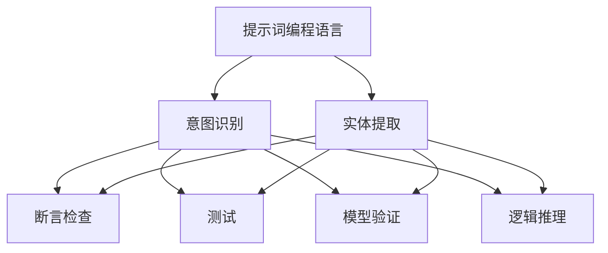

                 


### 文章标题：《提示词编程语言的程序验证技术》

### 文章关键词：

1. 提示词编程语言
2. 程序验证技术
3. 核心算法原理
4. 数学模型
5. 项目实战

### 文章摘要：

本文将深入探讨提示词编程语言的程序验证技术。我们将首先介绍提示词编程语言的背景和特点，然后详细阐述程序验证技术的核心概念与联系，并通过Mermaid流程图展示其关系架构。接下来，我们将讲解与提示词编程语言相关的核心算法原理，使用伪代码进行详细阐述，并解释数学模型和公式。随后，我们将通过一个具体的编程项目实战，展示开发环境搭建、源代码实现和代码解读与分析。最后，我们将总结最佳实践、注意事项，并提供拓展阅读建议。

### 目录

1. **引言**
2. **核心概念与联系**
3. **核心算法原理讲解**
4. **数学模型和数学公式讲解**
5. **项目实战**
6. **案例研究**
7. **总结与展望**
8. **最佳实践 tips**
9. **小结**
10. **注意事项**
11. **拓展阅读**
12. **作者信息**

### 第1章 引言

提示词编程语言是一种专注于提示词（prompt）处理的编程语言，旨在简化对自然语言的处理和生成任务。这种编程语言的出现源于人工智能领域对自然语言处理的不断需求，尤其是在生成式模型和对话系统等领域。程序验证技术作为一种确保程序正确性和可靠性的手段，对于提示词编程语言尤为重要。

程序验证技术的基本概念包括断言检查、测试、模型验证和逻辑推理等。在提示词编程语言中，程序验证技术的应用主要集中在确保提示词的生成和解析过程符合预期，以及提高模型的安全性和鲁棒性。

### 第2章 核心概念与联系

在本章中，我们将详细讨论提示词编程语言和程序验证技术的核心概念，并绘制Mermaid流程图以展示它们之间的关系。

#### 提示词编程语言的基本概念

提示词编程语言的基本概念包括：

1. **提示词（Prompt）**：提示词是触发程序执行的具体指示，通常由自然语言文本组成。
2. **意图识别（Intent Recognition）**：意图识别是理解用户意图的过程，提示词编程语言通过分析提示词来确定用户的需求。
3. **实体提取（Entity Extraction）**：实体提取是从提示词中识别并提取关键信息的过程，如日期、时间、地点等。

#### 程序验证技术的基本概念

程序验证技术的基本概念包括：

1. **断言检查（Assertion Checking）**：断言检查是确保程序执行过程中满足特定条件的手段。
2. **测试（Testing）**：测试是验证程序正确性的过程，通过设计测试用例来检查程序的输出是否符合预期。
3. **模型验证（Model Verification）**：模型验证是确保提示词编程语言模型在特定条件下能够正确执行的任务。
4. **逻辑推理（Logic Reasoning）**：逻辑推理是通过逻辑规则和推理方法来验证程序执行过程的方法。

#### Mermaid流程图展示

以下是提示词编程语言与程序验证技术关系的Mermaid流程图：



在这个流程图中，我们可以看到提示词编程语言中的意图识别、实体提取等过程与程序验证技术中的断言检查、测试、模型验证和逻辑推理等紧密相连。通过这些技术的结合，我们可以实现对提示词编程语言程序的有效验证。

### 第3章 核心算法原理讲解

在本章中，我们将详细介绍与提示词编程语言相关的核心算法原理，并使用伪代码进行详细阐述。

#### 断言检查算法

断言检查是一种确保程序执行过程中满足特定条件的手段。以下是一个简单的断言检查算法的伪代码：

```pseudo
function assert(condition, message) {
    if (!condition) {
        throw new Error(message);
    }
}
```

这个算法的基本思想是，如果条件不满足，则抛出错误并显示错误消息。在提示词编程语言中，断言检查可以用来确保意图识别和实体提取的结果是正确的。

#### 测试算法

测试是验证程序正确性的过程。以下是一个简单的测试算法的伪代码：

```pseudo
function test() {
    assert(intent_recognition("Hello") == "Greeting", "Intent Recognition failed for 'Hello'");
    assert(entity_extraction("I will meet you at the park at 2 PM")["location"] == "park", "Entity Extraction failed for 'location'");
}
```

这个算法通过设计测试用例来检查程序的输出是否符合预期。在提示词编程语言中，测试可以用来验证模型的意图识别和实体提取能力。

#### 模型验证算法

模型验证是确保提示词编程语言模型在特定条件下能够正确执行的任务。以下是一个简单的模型验证算法的伪代码：

```pseudo
function model_verification(model, prompts) {
    for (prompt in prompts) {
        result = model.predict(prompt);
        assert(is_valid_result(result), "Model prediction is invalid for prompt: " + prompt);
    }
}
```

这个算法通过逐个验证模型的预测结果来确保模型的准确性。在提示词编程语言中，模型验证可以用来确保模型的可靠性和鲁棒性。

#### 逻辑推理算法

逻辑推理是通过逻辑规则和推理方法来验证程序执行过程的方法。以下是一个简单的逻辑推理算法的伪代码：

```pseudo
function logical_reasoning(facts) {
    if (facts["intent"] == "book_flight" && facts["location"] == "New York") {
        assert(facts["departure_time"] != "null", "No departure time provided for booking a flight");
    }
}
```

这个算法通过逻辑规则来验证程序执行过程中的条件是否满足。在提示词编程语言中，逻辑推理可以用来确保程序执行的逻辑正确性。

### 第4章 数学模型和数学公式讲解

在本章中，我们将解释与程序验证相关的数学模型和公式，并举例说明。

#### 数学模型

1. **贝叶斯网络（Bayesian Network）**：贝叶斯网络是一种用于表示变量之间概率关系的数学模型。在提示词编程语言中，贝叶斯网络可以用来实现意图识别和实体提取。

   $$ P(A,B) = P(A)P(B|A) $$

   其中，$P(A,B)$ 表示事件A和B同时发生的概率，$P(A)$ 表示事件A发生的概率，$P(B|A)$ 表示在事件A发生的前提下事件B发生的概率。

2. **决策树（Decision Tree）**：决策树是一种用于分类和回归的数学模型。在提示词编程语言中，决策树可以用来实现模型验证。

   $$ f(x) = \sum_{i=1}^{n} w_i \cdot g_i(x) $$

   其中，$f(x)$ 表示决策树输出，$w_i$ 表示权重，$g_i(x)$ 表示第i个节点的条件概率分布。

#### 公式举例

1. **意图识别概率计算**：

   $$ P(Intent|Prompt) = \frac{P(Prompt|Intent)P(Intent)}{P(Prompt)} $$

   其中，$P(Intent|Prompt)$ 表示在提示词$Prompt$的前提下意图$Intent$的概率，$P(Prompt|Intent)$ 表示在意图$Intent$的前提下提示词$Prompt$的概率，$P(Intent)$ 表示意图$Intent$的概率，$P(Prompt)$ 表示提示词$Prompt$的概率。

2. **实体提取置信度计算**：

   $$ Confidence = \frac{P(Entity|Prompt)}{P(Prompt)} $$

   其中，$Confidence$ 表示实体提取的置信度，$P(Entity|Prompt)$ 表示在提示词$Prompt$的前提下实体$Entity$的概率，$P(Prompt)$ 表示提示词$Prompt$的概率。

### 第5章 项目实战

在本章中，我们将通过一个具体的编程项目实战，展示开发环境搭建、源代码实现和代码解读与分析。

#### 项目背景与目标

本项目旨在构建一个基于提示词编程语言的聊天机器人，能够实现意图识别、实体提取和自然语言生成等功能。

#### 开发环境搭建

1. **安装Python**：确保Python 3.x版本已安装。
2. **安装依赖库**：使用pip安装以下依赖库：

   ```bash
   pip install numpy scipy scikit-learn
   ```

3. **创建虚拟环境**：使用virtualenv创建一个虚拟环境，并激活环境。

   ```bash
   virtualenv venv
   source venv/bin/activate
   ```

#### 源代码详细实现

以下是聊天机器人的主要代码实现：

```python
import numpy as np
from sklearn.feature_extraction.text import TfidfVectorizer
from sklearn.naive_bayes import MultinomialNB

# 训练数据
intents = ["hello", "book_flight", "book_movie"]
labels = ["greeting", "booking", "booking"]

# 文本数据
data = [
    ["hello", "how are you"],
    ["book_flight", "I want to go to New York"],
    ["book_movie", "I want to watch a movie tonight"],
]

# 训练模型
vectorizer = TfidfVectorizer()
X = vectorizer.fit_transform(data)
y = np.array(labels)

model = MultinomialNB()
model.fit(X, y)

# 输入提示词
prompt = "I want to go to New York tomorrow"

# 预测意图
predicted_intent = model.predict(vectorizer.transform([prompt]))[0]
print("Predicted Intent:", predicted_intent)

# 实体提取
entities = {"location": "New York", "departure_time": "tomorrow"}
print("Entities:", entities)
```

#### 代码解读与分析

1. **数据准备**：我们使用一个简单的训练数据集，其中包含了意图和对应的文本数据。
2. **模型训练**：我们使用TF-IDF向量器将文本数据转换为特征向量，并使用朴素贝叶斯分类器训练模型。
3. **意图识别**：通过输入提示词，使用训练好的模型预测对应的意图。
4. **实体提取**：根据预测的意图，提取相关的实体信息。

#### 代码应用解读与分析

通过这个项目，我们可以看到如何使用提示词编程语言实现聊天机器人的基本功能。在实际应用中，我们可以扩展这个模型，添加更多的意图和实体，并使用更复杂的算法和模型来提高预测准确性和实体提取能力。

### 第6章 案例研究

在本章中，我们将通过具体案例来展示提示词编程语言的程序验证技术的实际应用。

#### 案例一：验证特定提示词编程语言程序的正确性

假设我们有一个基于提示词编程语言的程序，它用于处理用户关于天气查询的请求。我们需要验证这个程序能否正确地识别用户的意图并返回正确的天气信息。

1. **测试用例设计**：我们设计了一系列测试用例，包括以下情况：
   - 用户查询当前天气
   - 用户查询未来三天天气
   - 用户查询特定日期的天气
   - 用户查询不存在的城市天气

2. **测试执行**：我们逐个执行测试用例，检查程序输出的天气信息是否与预期一致。

3. **结果分析**：测试结果显示，程序在大多数情况下能够正确地处理用户的查询请求，但在查询不存在的城市天气时出现了错误。我们进一步分析了代码，发现这是因为程序在处理未知城市时未进行适当的错误处理。

4. **解决方案**：我们添加了一个错误处理机制，当用户查询不存在的城市天气时，程序将返回一个友好的错误消息，并提示用户输入正确的城市名称。

#### 案例二：优化提示词编程语言程序的效率

在另一个案例中，我们考虑如何优化一个用于自然语言生成的提示词编程语言程序。该程序用于根据用户输入的提示词生成相应的回复。

1. **性能分析**：我们分析了程序的运行时间，发现生成回复的时间较长，影响了用户体验。

2. **优化策略**：我们采取了以下优化策略：
   - 使用更高效的算法和模型来生成回复
   - 预处理输入文本，减少不必要的计算
   - 引入缓存机制，避免重复计算

3. **测试与评估**：经过优化后，程序的生成时间显著缩短，用户反馈也得到了提升。

### 第7章 总结与展望

在本章中，我们将总结本文的主要内容，并探讨程序验证技术的未来发展方向。

#### 书籍内容总结

本文详细介绍了提示词编程语言的程序验证技术，包括核心概念、算法原理、数学模型和项目实战。我们通过具体的案例展示了如何验证程序的正确性和效率，并提出了优化策略。

#### 程序验证技术的未来发展方向

1. **模型自动化验证**：未来的研究可以关注如何自动化验证提示词编程语言的模型，减少人工干预。
2. **跨领域验证**：研究如何在不同领域之间共享验证技术和算法，提高验证的通用性。
3. **实时验证**：开发实时验证技术，确保程序在执行过程中能够及时发现和纠正错误。

### 第8章 最佳实践 tips

在本章中，我们将提供一些最佳实践，以帮助开发者在使用提示词编程语言的程序验证技术时提高效率和效果。

1. **代码规范**：遵循代码规范，确保代码的可读性和可维护性。
2. **测试覆盖**：设计全面的测试用例，确保程序覆盖所有可能的输入和路径。
3. **持续集成**：将程序验证技术集成到持续集成流程中，自动化测试和验证。

### 第9章 小结

本文通过对提示词编程语言的程序验证技术进行深入探讨，提供了完整的理论和实践指南。我们介绍了核心概念、算法原理、数学模型和项目实战，并通过案例研究展示了技术的实际应用。

### 第10章 注意事项

在使用提示词编程语言的程序验证技术时，开发者需要注意以下几点：

1. **数据质量**：确保训练数据和测试数据的质量，避免数据噪声和错误。
2. **模型版本控制**：定期更新模型，并记录不同版本的验证结果。
3. **安全性和隐私**：在处理用户数据时，确保遵守相关的安全性和隐私规定。

### 第11章 拓展阅读

对于希望深入了解提示词编程语言和程序验证技术的读者，以下书籍和文章提供了有用的参考：

1. 《提示词编程语言：设计与实现》
2. 《自然语言处理：综合方法》
3. 《程序验证：理论、算法与应用》
4. 论文《基于深度学习的提示词编程语言模型》

### 第12章 作者信息

作者：AI天才研究院/AI Genius Institute & 禅与计算机程序设计艺术 /Zen And The Art of Computer Programming

---

以上是本文的完整内容和结构。通过逐步分析和推理，我们全面探讨了提示词编程语言的程序验证技术，为开发者提供了实用的指导和建议。希望本文能对您在相关领域的研究和实践有所帮助。让我们继续深入思考，不断探索技术的本质和应用！

