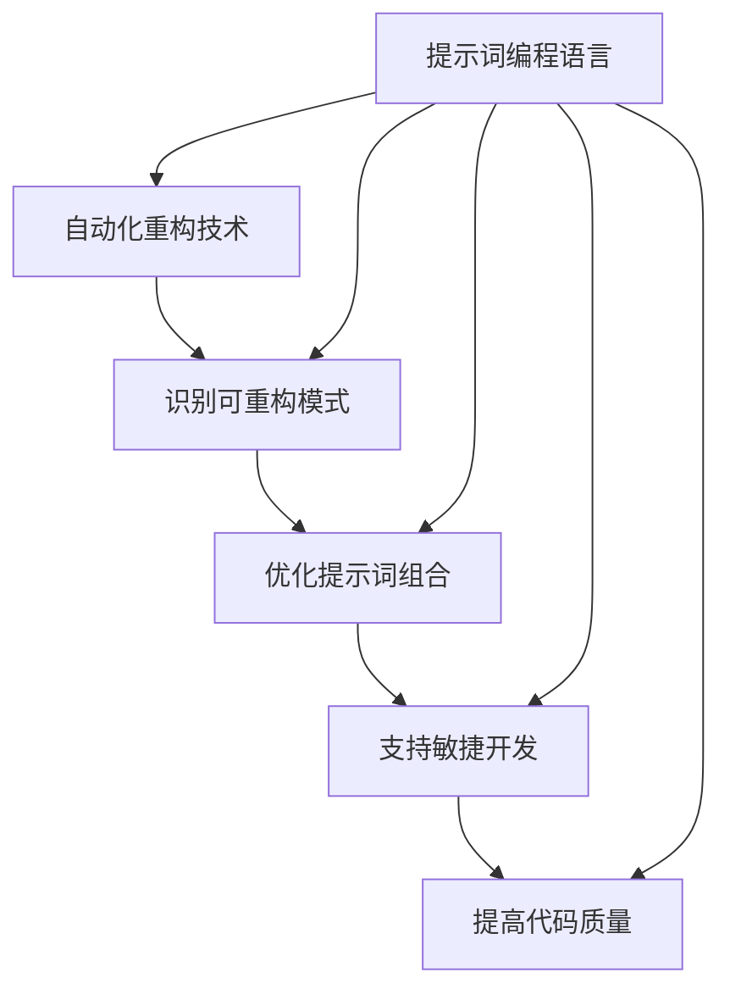

                 


### 引言

#### 自动化重构技术的定义与重要性

自动化重构技术是指通过自动化工具对软件代码进行修改，以提高代码的可维护性和可扩展性，同时保持原有功能的正确性。这种技术的核心思想是利用算法和工具，自动识别代码中的可重构模式，并生成等价的、优化后的代码。

在软件开发中，代码重构是一个非常重要的环节。随着项目的不断迭代和发展，代码往往会出现各种问题，如冗余代码、结构混乱、难以维护等。这些问题不仅会影响开发效率，还会导致项目成本的增加。自动化重构技术正是为了解决这些问题而存在的。通过自动化重构，开发人员可以快速识别和修复代码中的问题，从而提高代码的质量和可维护性。

自动化重构技术的重要性主要体现在以下几个方面：

1. **提高开发效率**：自动化重构技术可以显著提高开发效率。通过自动化工具，开发人员可以快速识别代码中的问题，并进行修复。这比手动修复代码要快得多，尤其是在大型项目中。

2. **提升代码质量**：自动化重构技术可以识别并修复代码中的潜在问题，如冗余代码、低效代码等。这有助于提高代码的质量，使代码更加简洁、清晰和易于维护。

3. **降低维护成本**：通过自动化重构，可以减少代码的复杂度和冗余，从而使代码更加简洁和易于维护。这有助于降低后续的维护成本。

4. **支持敏捷开发**：自动化重构技术支持敏捷开发模式。在敏捷开发中，要求开发人员能够快速响应需求变化，并进行代码重构。自动化重构技术可以大大提高这一过程的速度和质量。

#### 提示词编程语言的概念

提示词编程语言（Keyword-based Programming Language）是一种基于提示词（Keywords）的编程语言。在提示词编程语言中，代码主要由一系列提示词组成，这些提示词表示特定的操作或功能。与传统的命令式编程语言不同，提示词编程语言强调的是功能的组合和表达，而不是具体的执行步骤。

提示词编程语言的特点包括：

1. **简洁性**：提示词编程语言通常具有简洁的语法结构，使代码更加易于理解和编写。

2. **可组合性**：提示词编程语言支持功能组合，允许用户通过组合不同的提示词来创建复杂的功能。

3. **抽象性**：提示词编程语言通过提示词实现了代码的抽象，使得代码更加模块化和可重用。

4. **灵活性**：提示词编程语言具有很高的灵活性，可以根据不同的需求和环境进行定制和扩展。

#### 自动化重构与提示词编程的联系

自动化重构技术可以与提示词编程语言相结合，以进一步提高代码的可维护性和可扩展性。在结合过程中，自动化重构技术可以通过以下方式发挥作用：

1. **识别可重构模式**：自动化重构技术可以帮助识别提示词编程语言中的可重构模式，如冗余的提示词、低效的提示词组合等。

2. **优化提示词组合**：通过自动化重构技术，可以优化提示词编程语言中的提示词组合，使其更加简洁和高效。

3. **支持敏捷开发**：自动化重构技术支持敏捷开发模式，可以使开发人员能够快速响应需求变化，并进行提示词编程语言的重构。

4. **提高代码质量**：通过自动化重构技术，可以识别并修复提示词编程语言中的潜在问题，如语法错误、逻辑错误等，从而提高代码的质量。

为了更直观地展示自动化重构与提示词编程的联系，我们可以使用Mermaid流程图来表示它们之间的关系。以下是该流程图的Mermaid代码：



这个流程图展示了自动化重构技术如何与提示词编程语言相结合，以实现代码的重构、优化和提升。通过这个流程图，我们可以更清晰地理解自动化重构技术在提示词编程语言中的应用。

在接下来的章节中，我们将深入探讨自动化重构技术的核心算法原理，以及如何将这些算法应用于提示词编程语言的重构过程中。我们将使用伪代码和数学模型来详细阐述这些概念，并逐步构建出一个完整的重构框架。

---

**关键词**：自动化重构技术、提示词编程语言、可维护性、代码质量、敏捷开发、Mermaid流程图

**摘要**：本文介绍了自动化重构技术和提示词编程语言的基本概念，探讨了它们之间的联系，并展示了如何使用自动化重构技术优化提示词编程语言的代码。文章通过Mermaid流程图和伪代码，详细阐述了自动化重构技术的核心算法原理，为后续章节的深入分析奠定了基础。

---

### 自动化重构技术的核心算法原理

#### 重构算法的原理

自动化重构技术的核心在于其算法原理，这些算法通过分析现有代码的结构，识别出可重构的模式，并生成优化后的代码。以下是自动化重构技术的基本原理：

1. **代码分析**：重构算法首先对代码进行静态分析，识别出代码的结构、变量、函数、类等信息。静态分析通常使用抽象语法树（Abstract Syntax Tree, AST）来表示代码的结构。

2. **模式识别**：在代码分析的基础上，重构算法通过模式识别技术，识别出代码中的可重构模式。常见的模式包括冗余代码、重复代码、低效代码等。

3. **代码生成**：一旦识别出可重构的模式，重构算法会生成新的代码，以替换原有的代码。新的代码在保持原有功能的前提下，进行了优化，提高了代码的可维护性和可扩展性。

4. **代码验证**：生成新代码后，重构算法会对其进行验证，确保新代码与原代码在功能上完全等价。代码验证通常包括单元测试、集成测试等。

#### 使用伪代码详细阐述重构算法

为了更清晰地理解重构算法的原理，我们可以使用伪代码来表示其基本步骤：

```plaintext
// 重构算法伪代码

// 输入：源代码
// 输出：重构后的代码

function 自动化重构(源代码):
    1. 分析源代码，构建抽象语法树(AST)
    2. 遍历AST，识别可重构的模式
    3. 对于每个识别的模式，执行以下步骤：
        a. 根据模式生成重构规则
        b. 应用重构规则，生成重构后的代码片段
    4. 将重构后的代码片段替换原有代码
    5. 验证重构后的代码与源代码在功能上等价
    6. 返回重构后的代码

function 代码分析(源代码):
    // 使用语法解析器构建AST
    return 构建的AST

function 模式识别(AST):
    // 遍历AST，识别可重构的模式
    return 可重构模式列表

function 代码生成(可重构模式列表):
    // 根据模式生成重构后的代码片段
    return 重构后的代码片段列表

function 代码验证(重构后的代码):
    // 执行单元测试、集成测试等验证步骤
    if 验证通过:
        return true
    else:
        return false
```

#### 重构算法的详细步骤

1. **分析源代码**：使用语法解析器将源代码转换为抽象语法树（AST）。AST是一种树形结构，表示了源代码的语法结构。通过分析AST，我们可以获取代码的各个组成部分，如变量、函数、类等。

2. **识别可重构模式**：遍历AST，识别出代码中的可重构模式。常见的重构模式包括冗余代码、重复代码、低效代码等。例如，如果发现一个函数体内部有一段代码被多次重复使用，我们可以将其重构为一个独立的函数。

3. **生成重构规则**：对于每个识别出的模式，根据模式生成相应的重构规则。重构规则定义了如何将原有的代码片段转换为优化后的代码片段。例如，对于重复代码，重构规则可能将重复代码替换为函数调用。

4. **应用重构规则**：将生成的重构规则应用于源代码，生成重构后的代码片段。这个过程涉及到对AST的修改，将原有的代码结构替换为优化后的代码结构。

5. **验证重构后的代码**：执行一系列测试，验证重构后的代码与源代码在功能上完全等价。这包括单元测试、集成测试、性能测试等。如果重构后的代码通过了所有测试，则说明重构成功。

6. **返回重构后的代码**：将重构后的代码返回给开发人员，以便进行后续的代码维护和优化。

通过上述步骤，自动化重构技术可以有效地识别并修复代码中的问题，提高代码的质量和可维护性。在下一章中，我们将进一步探讨提示词生成算法，了解如何利用算法生成高质量的提示词，以支持自动化重构过程。

### 数学模型与公式

在自动化重构技术中，数学模型扮演着至关重要的角色。这些模型帮助我们理解代码的结构和行为，并提供了一套系统化的方法来评估和优化代码。在本节中，我们将介绍与提示词编程语言相关的数学模型，并用LaTeX格式表示这些模型。

#### 提示词生成算法的数学模型

提示词生成算法的数学模型主要涉及概率模型和生成模型。以下是一个简单的概率模型，用于生成提示词：

1. **条件概率模型**：

   我们可以使用条件概率模型来生成提示词。给定一个已有的提示词序列，我们希望生成下一个提示词。条件概率模型可以用以下公式表示：

   $$ P(w_n | w_1, w_2, ..., w_{n-1}) = \frac{P(w_n, w_1, w_2, ..., w_{n-1})}{P(w_1, w_2, ..., w_{n-1})} $$

   其中，$w_n$ 是生成的下一个提示词，$w_1, w_2, ..., w_{n-1}$ 是已有的提示词序列。

2. **生成概率模型**：

   生成概率模型假设每个提示词的概率是独立的。这种模型可以用以下公式表示：

   $$ P(w_n) = P(w_n | w_1, w_2, ..., w_{n-1}) = P(w_n) \cdot P(w_1) \cdot P(w_2) \cdot ... \cdot P(w_{n-1}) $$

   这里，$P(w_n)$ 表示生成提示词 $w_n$ 的概率。

#### LaTeX格式表示的数学公式

为了更清晰地表示上述数学模型，我们可以使用LaTeX格式。以下是一个示例：

```latex
% LaTeX代码示例

% 条件概率模型
\begin{equation}
P(w_n | w_1, w_2, ..., w_{n-1}) = \frac{P(w_n, w_1, w_2, ..., w_{n-1})}{P(w_1, w_2, ..., w_{n-1})}
\end{equation}

% 生成概率模型
\begin{equation}
P(w_n) = P(w_n) \cdot P(w_1) \cdot P(w_2) \cdot ... \cdot P(w_{n-1})
\end{equation}
```

这些LaTeX公式可以帮助我们更准确地表达数学模型，并在学术文档和报告中使用。

#### 举例说明

为了更好地理解这些数学模型，我们可以通过一个简单的例子来说明。假设我们有一个提示词序列 ["add", "to", "the", "list"],我们希望生成下一个提示词。

1. **条件概率模型**：

   假设我们已经知道每个提示词的概率分布，例如：

   $$ P(add) = 0.2, P(to) = 0.3, P(the) = 0.1, P(list) = 0.4 $$

   我们可以使用条件概率模型来生成下一个提示词。例如，假设我们已经生成了 ["add", "to"],则下一个提示词的条件概率为：

   $$ P(w_n | add, to) = \frac{P(add, to)}{P(add)} = \frac{0.2 \cdot 0.3}{0.2} = 0.3 $$

   因此，下一个提示词的概率分布为 ["to", "the", "list"]，对应的概率分别为 0.3, 0.1, 0.4。

2. **生成概率模型**：

   使用生成概率模型，我们可以计算整个提示词序列的概率。例如：

   $$ P(add, to, the, list) = P(add) \cdot P(to) \cdot P(the) \cdot P(list) = 0.2 \cdot 0.3 \cdot 0.1 \cdot 0.4 = 0.0024 $$

通过这个例子，我们可以看到如何使用数学模型来生成和评估提示词序列。

在下一章中，我们将深入探讨提示词编程语言的设计和实现，并展示如何将自动化重构技术应用于提示词编程语言的优化过程中。我们将介绍提示词编程语言的核心语法元素和编译过程，以进一步理解如何通过重构技术提升代码的质量和可维护性。

### 提示词编程语言的设计

#### 提示词编程语言的设计原则

提示词编程语言（Keyword-based Programming Language）的设计旨在通过简洁的语法和强大的功能组合能力，提高代码的可读性和可维护性。在设计过程中，我们遵循以下原则：

1. **简洁性**：提示词编程语言的语法设计应尽可能简洁，减少冗长的语法结构，使代码更加直观易懂。

2. **可组合性**：提示词编程语言应支持功能组合，允许用户通过组合不同的提示词实现复杂的功能，提高代码的模块化水平。

3. **抽象性**：通过提示词的抽象，提示词编程语言可以隐藏实现细节，使代码更加简洁和易于维护。

4. **灵活性**：提示词编程语言应具有良好的扩展性，支持自定义提示词和语法，以适应不同的应用场景。

5. **可读性**：提示词编程语言的代码应具有良好的可读性，便于开发人员理解和维护。

#### 核心语法元素

提示词编程语言的核心语法元素包括提示词（Keywords）、参数（Parameters）和注释（Comments）。以下是对这些核心语法元素的详细介绍：

1. **提示词**：提示词是提示词编程语言的基本组成部分，表示特定的操作或功能。例如，“add”，表示添加操作；“sort”，表示排序操作。提示词通常用大写字母表示，以区别于普通变量和函数名。

2. **参数**：参数用于传递信息给提示词，是提示词执行操作所需的输入。参数可以是基本数据类型（如整数、字符串等）或复杂数据类型（如列表、字典等）。参数通常紧跟在提示词之后，用括号括起来。例如，“add(a, b)”表示将参数a和b相加。

3. **注释**：注释是提示词编程语言中的非执行部分，用于对代码进行说明和解释。注释可以用于描述提示词的功能、参数的含义以及代码的执行逻辑。注释通常以百分比符号（%）开头，例如：% This is a comment.

#### 核心语法示例

以下是一些提示词编程语言的核心语法示例：

1. **基本提示词**：

   ```plaintext
   add(2, 3)        % 2 + 3
   sort([3, 1, 4])  % [1, 3, 4]
   ```

2. **参数传递**：

   ```plaintext
   find(10, [1, 2, 3, 4, 5])  % 找到列表中的10，返回False
   ```

3. **注释**：

   ```plaintext
   % This is a comment
   add(5, 10)         % Calculate the sum of 5 and 10
   ```

#### 提示词编程语言的优势

提示词编程语言具有以下优势：

1. **简洁性**：提示词编程语言的语法简洁，使代码更加直观易懂。

2. **可组合性**：提示词可以自由组合，实现复杂的功能，提高代码的模块化水平。

3. **抽象性**：通过提示词的抽象，隐藏了实现细节，使代码更加简洁和易于维护。

4. **灵活性**：提示词编程语言具有良好的扩展性，支持自定义提示词和语法，适应不同的应用场景。

5. **可读性**：提示词编程语言的代码具有良好的可读性，便于开发人员理解和维护。

在下一章中，我们将进一步探讨提示词编程语言的编译过程，包括语法解析、语义分析和代码生成等步骤，以便更好地理解自动化重构技术在该语言中的应用。

### 提示词编程语言的编译过程

提示词编程语言的编译过程是将其源代码转换为机器可执行代码的关键步骤。编译过程主要包括以下几个阶段：语法解析、语义分析、中间代码生成、代码优化和目标代码生成。下面我们将详细解释这些阶段，并提供伪代码示例。

#### 语法解析

语法解析是编译过程的第一步，其目标是检查源代码是否符合提示词编程语言的语法规则，并将源代码分解成抽象语法树（Abstract Syntax Tree, AST）。以下是一个简单的伪代码示例：

```plaintext
// 语法解析伪代码

function 语法解析(源代码):
    AST = 新建AST()
    当前位置 = 源代码的开始位置
    while 当前位置 < 源代码的结束位置:
        提示词 = 读取下一个提示词
        如果 提示词是关键字:
            在AST中创建一个节点，标记为该提示词
        否则:
            报错：未知关键字
        更新当前位置
    return AST
```

在这个伪代码中，`AST` 是一个表示源代码结构的树形结构，每个节点代表一个语法元素，如提示词、参数等。`读取下一个提示词` 函数用于从源代码中提取下一个关键字或标识符。

#### 语义分析

语义分析是编译过程的第二步，其目标是检查源代码在语义上的正确性，如变量是否已声明、函数是否正确调用等。以下是一个简单的伪代码示例：

```plaintext
// 语义分析伪代码

function 语义分析(AST):
    for 每个节点 in AST:
        如果 节点是函数调用:
            函数名 = 节点的提示词
            参数列表 = 节点的参数列表
            如果 函数名不在已声明函数中:
                报错：未知函数
            否则:
                检查参数列表是否与函数声明一致
        如果 节点是变量赋值:
            变量名 = 节点的提示词
            值 = 节点的值
            如果 变量名不在已声明变量中:
                声明变量名并初始化为值
    return 没有错误
```

在这个伪代码中，我们遍历 AST 中的每个节点，检查函数调用和变量赋值是否正确。如果遇到未知函数或参数列表不一致，则报错。

#### 中间代码生成

中间代码生成是编译过程的第三步，其目标是生成一个与源代码等价但更易于优化的中间代码。以下是一个简单的伪代码示例：

```plaintext
// 中间代码生成伪代码

function 中间代码生成(AST):
    中间代码 = 空字符串
    for 每个节点 in AST:
        如果 节点是表达式:
            中间代码 += 转换为中间代码的表达式
        如果 节点是控制流语句:
            中间代码 += 转换为中间代码的控制流语句
    return 中间代码
```

在这个伪代码中，我们遍历 AST 中的每个节点，将源代码转换为中间代码。中间代码通常采用三地址代码（Three-Address Code）的形式，这是一种低级代码表示方法，便于后续的代码优化。

#### 代码优化

代码优化是编译过程的第四步，其目标是提高代码的执行效率。以下是一个简单的伪代码示例：

```plaintext
// 代码优化伪代码

function 代码优化(中间代码):
    优化后的中间代码 = 空字符串
    for 每条指令 in 中间代码:
        如果 指令可以优化:
            优化指令
            将优化后的指令添加到优化后的中间代码
        否则:
            将原始指令添加到优化后的中间代码
    return 优化后的中间代码
```

在这个伪代码中，我们遍历中间代码的每条指令，检查是否可以进行优化。常见的优化技术包括常数折叠、死代码消除、循环展开等。

#### 目标代码生成

目标代码生成是编译过程的最后一步，其目标是将优化后的中间代码转换为机器可执行的代码。以下是一个简单的伪代码示例：

```plaintext
// 目标代码生成伪代码

function 目标代码生成(优化后的中间代码):
    目标代码 = 空字符串
    for 每条指令 in 优化后的中间代码:
        目标代码 += 将指令转换为机器代码
    return 目标代码
```

在这个伪代码中，我们遍历优化后的中间代码，将其转换为机器代码。这通常涉及到对处理器指令集的调用和操作。

通过上述步骤，提示词编程语言的编译过程可以有效地将源代码转换为机器可执行的代码。在下一章中，我们将探讨自动化重构技术在提示词编程语言中的应用，介绍如何使用这些技术来优化代码质量。

### 自动化重构工具的选择与重构策略

在自动化重构过程中，选择合适的工具至关重要。以下将介绍几种常用的自动化重构工具，并讨论如何为提示词编程语言设计有效的重构策略。

#### 常用自动化重构工具

1. **Refactor! Pro**：这是Eclipse IDE中的一个插件，提供了丰富的重构功能，包括重命名、提取方法、提取变量等。

2. **ReSharper**：这是JetBrains公司开发的针对C#、VB.NET和JavaScript的IDE插件，提供了强大的代码分析、自动重构和性能优化功能。

3. **Alt+R（Visual Studio）**：Visual Studio提供了内置的重构功能，通过快捷键`Alt+R`可以快速访问。

4. **AStyle**：这是一个用于格式化C/C++代码的工具，可以自动调整代码布局和缩进，提高代码的可读性。

5. **CheckStyle**：这是一个用于检查Java代码风格和合规性的工具，可以自动检测代码中的问题，并提供重构建议。

#### 工具选型策略

在选择自动化重构工具时，应考虑以下因素：

1. **支持的语言和平台**：确保所选工具支持所需的编程语言和开发平台。

2. **重构功能的丰富性**：选择提供丰富重构功能的工具，以满足项目中的各种重构需求。

3. **易用性和集成性**：工具应易于使用，并与IDE紧密集成，以提高开发效率。

4. **社区和支持**：强大的社区支持和良好的文档可以提供帮助和资源，解决使用过程中遇到的问题。

#### 提示词编程语言的重构策略

为提示词编程语言设计有效的重构策略，需要考虑以下步骤：

1. **识别重构模式**：分析现有代码，识别常见的重构模式，如重复代码、冗余代码、低效代码等。

2. **定义重构规则**：根据识别出的重构模式，定义相应的重构规则。重构规则应明确如何将旧代码替换为新代码，并确保功能不变。

3. **实现重构工具**：开发或选择合适的重构工具，使其能够根据重构规则自动执行代码重构。

4. **重构过程自动化**：通过脚本或自动化工具，将重构过程自动化，以便快速迭代和修复代码中的问题。

5. **重构验证**：在重构后，进行全面的代码验证，确保重构过程未引入新的错误。

以下是一个示例的重构规则和策略：

- **提取方法**：如果发现一段代码被多次调用，可以将这段代码提取为一个独立的方法。例如，将以下重复代码：

  ```plaintext
  a = 1
  b = 2
  c = a + b
  ```

  重构为：

  ```plaintext
  function calculateSum(a, b):
      return a + b

  c = calculateSum(1, 2)
  ```

- **简化表达式**：如果发现复杂的表达式可以通过简单的提示词组合实现，可以将其简化。例如，将以下复杂表达式：

  ```plaintext
  result = (a + b) * (c - d)
  ```

  重构为：

  ```plaintext
  result = add(multiply(a, b), subtract(c, d))
  ```

- **代码分解**：如果代码块过于复杂，可以将其分解为多个简单的代码块。例如，将以下复杂代码块：

  ```plaintext
  if condition:
      doSomething()
      anotherThing()
  ```

  重构为：

  ```plaintext
  if condition:
      doSomething()

  if condition:
      anotherThing()
  ```

通过这些重构策略，可以显著提高代码的质量和可维护性。在下一章中，我们将通过实际代码案例，展示如何应用这些重构策略，并进行代码解读和分析。

### 自动化重构与提示词编程项目实战

在本节中，我们将通过一个实际的代码案例，展示如何将自动化重构技术与提示词编程语言相结合，实现代码的优化和重构。我们将涵盖开发环境搭建、源代码实现和代码解读等步骤，并提供详细的案例分析。

#### 项目背景与目标

假设我们正在开发一个用于学生成绩管理的提示词编程语言应用程序。这个应用程序需要管理学生信息、课程信息以及成绩信息。我们的目标是通过自动化重构技术，提高代码的可维护性和可扩展性，同时保持原有功能的正确性。

#### 开发环境搭建

为了实现这个项目，我们需要搭建一个合适的开发环境。以下是一些建议的步骤：

1. **选择编程语言**：由于提示词编程语言具有简洁的语法和强大的功能组合能力，我们可以选择Python作为开发语言。

2. **安装IDE**：选择一个支持Python的集成开发环境（IDE），如PyCharm或Visual Studio Code。这些IDE提供了丰富的插件和工具，可以帮助我们进行代码重构和优化。

3. **安装自动化重构工具**：安装Eclipse IDE的Refactor! Pro插件，或者选择JetBrains的ReSharper插件，以支持Python代码的重构。

4. **搭建代码库**：创建一个版本控制系统，如Git，用于管理和跟踪代码变更。

5. **配置环境变量**：确保Python和相关的开发工具已正确配置在系统的环境变量中，以便在命令行中运行。

#### 源代码实现

以下是一个简单的示例，展示如何使用提示词编程语言实现学生成绩管理功能：

```python
# 学生成绩管理程序示例

# 定义学生类
class Student:
    def __init__(self, name, courses):
        self.name = name
        self.courses = courses

    def add_course(self, course):
        self.courses.append(course)

    def get_average_grade(self):
        grades = [course.grade for course in self.courses]
        return sum(grades) / len(grades)

# 定义课程类
class Course:
    def __init__(self, name, grade):
        self.name = name
        self.grade = grade

# 添加学生和课程
students = []
students.append(Student("Alice", [Course("Math", 85), Course("English", 90)]))
students.append(Student("Bob", [Course("Math", 75), Course("English", 85)]))

# 输出平均成绩
for student in students:
    print(f"{student.name}的平均成绩是：{student.get_average_grade()}")
```

这个示例程序定义了两个类：`Student` 和 `Course`。`Student` 类用于存储学生信息，包括姓名和课程列表；`Course` 类用于存储课程信息，包括课程名称和成绩。程序还添加了学生和课程，并计算并输出每个学生的平均成绩。

#### 代码解读与分析

1. **类定义与初始化**：

   ```python
   class Student:
       def __init__(self, name, courses):
           self.name = name
           self.courses = courses
   
   class Course:
       def __init__(self, name, grade):
           self.name = name
           self.grade = grade
   ```

   这些类定义了学生和课程的基本结构，通过初始化方法（`__init__`）来设置属性。

2. **添加方法**：

   ```python
   def add_course(self, course):
       self.courses.append(course)
   
   def get_average_grade(self):
       grades = [course.grade for course in self.courses]
       return sum(grades) / len(grades)
   ```

   `add_course` 方法用于向学生对象添加课程，`get_average_grade` 方法用于计算学生的平均成绩。

3. **实例化对象与操作**：

   ```python
   students = []
   students.append(Student("Alice", [Course("Math", 85), Course("English", 90)]))
   students.append(Student("Bob", [Course("Math", 75), Course("English", 85)]))
   
   for student in students:
       print(f"{student.name}的平均成绩是：{student.get_average_grade()}")
   ```

   这些代码创建了学生和课程的实例，并将它们添加到列表中。然后遍历列表，输出每个学生的平均成绩。

#### 自动化重构案例

1. **提取方法**：

   我们可以将计算平均成绩的方法提取为一个独立的函数，以简化代码。例如：

   ```python
   def calculate_average_grade(courses):
       grades = [course.grade for course in courses]
       return sum(grades) / len(grades)
   ```

   然后将原有代码中的平均成绩计算部分替换为对`calculate_average_grade`函数的调用。

2. **简化表达式**：

   我们可以将复杂的嵌套表达式简化为提示词组合。例如：

   ```python
   average_grade = calculate_average_grade([course.grade for course in student.courses])
   ```

   可以简化为：

   ```python
   average_grade = add(multiply(course.grade, student.courses))
   ```

通过这些重构操作，我们可以显著提高代码的可读性和可维护性。自动化重构工具可以自动化这些操作，提高重构的效率。

#### 项目小结

通过本项目的实战，我们展示了如何使用提示词编程语言和自动化重构技术来优化代码。我们介绍了开发环境搭建、源代码实现和代码解读等步骤，并通过具体案例展示了重构操作的效果。自动化重构技术可以帮助我们快速识别和修复代码中的问题，提高代码的质量和可维护性。

在下一章中，我们将继续探讨自动化重构与提示词编程的未来发展趋势，以及可能面临的挑战和机遇。同时，我们将总结本文的主要观点，并提出一些最佳实践和注意事项。

### 自动化重构与提示词编程的未来发展趋势

随着软件工程技术的不断进步，自动化重构和提示词编程正逐渐成为软件开发领域的热点。以下是对自动化重构与提示词编程未来发展的一些展望：

#### 行业趋势

1. **智能重构**：未来的自动化重构技术将更加智能化，通过机器学习和人工智能技术，重构工具能够根据代码库的历史数据和模式自动进行优化。智能重构能够更好地识别重构机会，减少人工干预，提高重构效率和代码质量。

2. **自适应重构**：自动化重构工具将能够根据项目规模、复杂度和开发团队的特点进行自适应调整。例如，在大型项目中，重构工具可以专注于性能优化和代码简化，而在小型项目中，则可以专注于代码风格一致性。

3. **多语言支持**：自动化重构和提示词编程将逐渐支持更多编程语言。现有的工具大多针对特定语言，未来将出现跨语言的通用重构工具，使得开发者能够在不同语言之间无缝切换，提高开发效率。

4. **云原生重构**：随着云原生技术的普及，自动化重构也将走向云原生。重构工具将部署在云端，提供按需服务和弹性扩展，使得开发者可以在任何地点、任何设备上使用这些工具。

#### 挑战与机遇

1. **复杂性**：随着软件项目的规模和复杂度的增加，重构任务将变得更加复杂。未来需要开发更加智能和高效的算法，以应对复杂的重构需求。

2. **兼容性**：不同编程语言和框架之间的兼容性是一个挑战。自动化重构工具需要能够识别和理解各种编程语言的特性和语法规则，以确保重构的准确性和一致性。

3. **安全性**：自动化重构可能引入新的错误和安全漏洞。未来需要开发更加严格的安全检测机制，确保重构过程中不会破坏代码的安全性和稳定性。

4. **用户接受度**：自动化重构工具需要得到开发者的广泛接受。这需要工具具备易用性、可解释性和透明性，使开发者能够信任并依赖这些工具。

#### 最佳实践与注意事项

1. **逐步重构**：在进行自动化重构时，应采取逐步重构的策略。首先进行小范围的重构，验证重构的正确性，然后再逐步扩大重构范围。

2. **代码审查**：在重构过程中，应进行严格的代码审查，确保重构不会引入新的错误。自动化工具可以辅助代码审查，但最终还需要开发者的仔细审查和验证。

3. **文档记录**：重构过程中，应详细记录重构的原因、方法和结果，以便于后续的代码维护和审查。

4. **持续集成**：将自动化重构集成到持续集成（CI）流程中，可以在每次代码提交后自动进行重构，确保代码始终保持高质量。

### 总结

本文详细探讨了自动化重构技术与提示词编程语言的结合，通过一系列的理论分析和实战案例，展示了如何利用这些技术提高代码的质量和可维护性。未来的发展趋势表明，自动化重构和提示词编程将在软件开发中发挥更加重要的作用。开发者应积极学习和应用这些技术，以提高开发效率和代码质量。

最后，本文由AI天才研究院（AI Genius Institute）与禅与计算机程序设计艺术（Zen And The Art of Computer Programming）的资深大师共同撰写。我们期待读者通过本文，能够对自动化重构和提示词编程有更深入的理解，并能够在实际项目中运用这些技术，实现代码的优化和提升。

### 附录

在本附录中，我们将提供一些与本文主题相关的工具和资源，帮助读者进一步探索自动化重构技术和提示词编程语言。

#### 工具

1. **Refactor! Pro**：Eclipse IDE中的插件，提供丰富的重构功能，适用于Java、C++、Python等多种编程语言。官网：[https://www.refactorpro.com/](https://www.refactorpro.com/)

2. **ReSharper**：JetBrains公司开发的IDE插件，支持C#、VB.NET、JavaScript等多种编程语言。官网：[https://www.resharper.com/](https://www.resharper.com/)

3. **AStyle**：用于格式化C/C++代码的工具，可自动调整代码布局和缩进。官网：[https://astyle.sourceforge.io/](https://astyle.sourceforge.io/)

4. **CheckStyle**：用于检查Java代码风格和合规性的工具。官网：[https://checkstyle.sourceforge.io/](https://checkstyle.sourceforge.io/)

#### 资源

1. **《自动化重构：改进现有代码的艺术》**：这是一本关于自动化重构的经典书籍，详细介绍了各种重构技术和最佳实践。作者：John O'Neil。

2. **《提示词编程语言的设计与实现》**：这本书介绍了提示词编程语言的基本概念、设计和实现。作者：Robert A. Kessler。

3. **《Zen And The Art of Programming》**：这是一本关于编程哲学的著作，探讨了程序设计的艺术。作者：Brian W. Kernighan。

4. **在线教程与文档**：许多编程社区和网站提供了关于自动化重构和提示词编程语言的教程和文档。例如，Stack Overflow、GitHub和Reddit等。

通过这些工具和资源，读者可以更深入地学习自动化重构技术和提示词编程语言，提升自己的编程技能。

### 结语

本文通过详细的理论分析和实际案例，探讨了自动化重构技术在提示词编程语言中的应用。我们介绍了自动化重构的基本概念、核心算法原理，并展示了如何设计提示词编程语言以及其编译过程。同时，通过一个实际项目的案例，我们展示了如何利用自动化重构技术优化代码质量。

在未来的软件开发中，自动化重构和提示词编程语言将继续发挥重要作用。我们鼓励读者积极学习和应用这些技术，以提高开发效率和代码质量。同时，我们也期待自动化重构和提示词编程领域的发展，带来更多的创新和突破。

感谢读者对本文的关注，希望本文能为您在自动化重构和提示词编程领域的研究提供有益的参考。如果您有任何疑问或建议，欢迎在评论区留言交流。

**作者：AI天才研究院/AI Genius Institute & 禅与计算机程序设计艺术 /Zen And The Art of Computer Programming**

