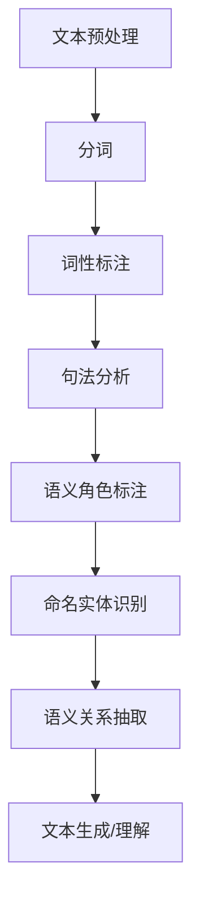
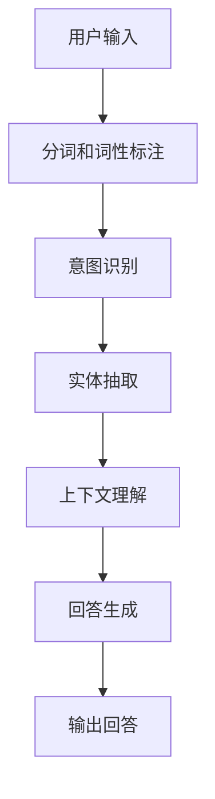

                 

### 《提示词编程语言的语义分析技术》文章关键词

1. 提示词编程语言
2. 语义分析
3. 自然语言处理
4. 词向量表示
5. 依存句法分析
6. 语义角色标注
7. 问答系统
8. 文本分类与聚类
9. 对话系统
10. 案例分析

### 摘要

本文旨在深入探讨提示词编程语言的语义分析技术。首先，文章介绍了提示词编程语言的基本概念、类型和特点，以及语义分析的定义和目标。接着，文章详细阐述了自然语言处理的基础知识，包括分词、词性标注、句法分析以及词嵌入与语言模型。随后，文章重点介绍了词向量表示、依存句法分析和语义角色标注等语义分析方法。此外，文章还探讨了语义分析技术在问答系统、文本分类与聚类、对话系统等应用场景中的实际应用，并通过具体案例分析展示了语义分析技术的效果。最后，文章对语义分析技术的发展趋势和未来方向进行了展望，并提出了未来面临的挑战和潜在的解决方案。本文旨在为读者提供一个全面而深入的关于提示词编程语言语义分析技术的理解，帮助读者掌握这一领域的核心概念和方法。

## 引言

### 提示词编程语言的语义分析技术的重要性

在当今的数字化时代，数据已经成为企业和社会的核心资产。如何有效地处理和利用这些数据，提取其中的有价值信息，已经成为各类应用场景中的关键问题。特别是对于自然语言数据，如文本、对话和语音等，语义分析技术成为了理解和挖掘数据内涵的关键工具。提示词编程语言作为一种能够有效表达和利用语义信息的编程语言，其语义分析技术的重要性愈发凸显。

首先，提示词编程语言的语义分析技术能够帮助企业从大量非结构化数据中提取结构化的信息，从而提升数据处理的效率和准确性。例如，在金融领域，通过语义分析技术，可以从海量的新闻、报告、公告等文本中提取出相关的市场信息，帮助分析师做出更准确的预测。在电子商务领域，语义分析技术可以用于商品推荐、客户评论分析等，从而提高用户体验和销售额。

其次，语义分析技术在智能对话系统、问答系统和智能客服等领域的应用也越来越广泛。通过语义分析技术，系统能够理解用户的意图和需求，提供更准确、更个性化的服务。例如，在智能客服中，通过语义分析技术，系统可以自动识别用户的问题，并提供相关的解决方案，从而提高客服效率和用户体验。

此外，语义分析技术在内容推荐、信息检索和知识图谱构建等领域也有着重要的应用。通过语义分析，系统可以更好地理解用户的行为和偏好，从而提供更精准的内容推荐。在信息检索中，语义分析技术可以提升搜索结果的准确性和相关性。在知识图谱构建中，语义分析技术可以帮助构建更丰富、更精准的知识体系。

总之，提示词编程语言的语义分析技术不仅具有理论意义，更具有广泛的应用价值。本文将从基础理论、语义分析方法、应用场景、案例分析以及未来趋势等多个角度，全面探讨这一领域的重要概念、技术和应用，旨在为读者提供一个系统的理解和实践指南。

### 目标读者

本文的目标读者主要包括以下几类：

1. **计算机科学和人工智能领域的专业人士**：包括研究人员、开发人员和工程师，他们希望深入理解提示词编程语言的语义分析技术，并将其应用于实际项目中。

2. **自然语言处理领域的初学者**：对自然语言处理技术感兴趣，希望系统学习语义分析的基本概念和方法，并了解其在各类应用场景中的具体应用。

3. **企业数据分析师和数据科学家**：需要利用语义分析技术处理和挖掘非结构化数据，以支持业务决策和数据分析。

4. **教育工作者和学生**：希望将语义分析技术融入教学和研究，提升自身在相关领域的研究能力和技术水平。

无论您属于上述哪一类读者，本文都将为您提供丰富、实用的内容，帮助您在提示词编程语言的语义分析领域取得更大的成就。

### 书籍章节概览

本文将分为五个主要部分，分别从基础理论、语义分析方法、应用场景、案例分析和未来趋势五个方面，全面探讨提示词编程语言的语义分析技术。

**第一部分：基础理论**  
- **第1章** 提示词编程语言概述：介绍提示词编程语言的基本概念、类型和特点，以及其与语义分析的关系。
- **第2章** 语义分析基础：探讨语义分析的定义、目标和基本流程，包括自然语言处理的基础技术。
- **第3章** 自然语言处理基础：深入讲解分词、词性标注、句法分析等自然语言处理技术，为语义分析奠定基础。

**第二部分：语义分析方法**  
- **第4章** 词向量表示：介绍词向量的基本概念、生成方法及其在语义分析中的应用。
- **第5章** 依存句法分析：详细讲解依存句法分析的定义、目标和主要算法，包括基于规则和基于统计的方法。
- **第6章** 语义角色标注：介绍语义角色标注的概念、目标和主要方法，包括手工标注和自动化标注技术。

**第三部分：应用场景**  
- **第7章** 问答系统中的语义分析：探讨语义分析在问答系统中的应用，包括问题理解和回答生成。
- **第8章** 文本分类与聚类中的语义分析：介绍语义分析在文本分类和聚类中的应用，提升分类和聚类的准确性和效率。
- **第9章** 对话系统中的语义分析：探讨语义分析在对话系统中的应用，包括意图识别和实体抽取。

**第四部分：案例分析**  
- **第10章** 电商平台商品推荐系统：分析语义分析技术在电商平台商品推荐系统中的应用，提升推荐效果。
- **第11章** 金融领域风险控制：探讨语义分析技术在金融领域风险控制中的应用，提高风险预测和管理的准确性。

**第五部分：展望与未来趋势**  
- **第12章** 语义分析技术发展趋势：讨论语义分析技术的最新研究进展和未来发展方向。
- **第13章** 未来挑战与解决方案：分析语义分析技术面临的挑战，并提出潜在的解决方案和应对策略。

通过这五个部分的系统阐述，本文旨在为读者提供一个全面而深入的提示词编程语言语义分析技术的理解和实践指南。

### 第1部分：基础理论

#### 第1章：提示词编程语言概述

提示词编程语言（Prompt-based Programming Languages）是一种专门用于处理自然语言数据的编程语言，它通过提示词（prompts）来引导和规范程序的执行过程。这种编程语言的独特之处在于，它能够将自然语言的处理与编程逻辑紧密结合，使得非专业的用户也能通过自然语言输入来执行复杂的任务。

**1.1 提示词编程语言的基本概念**

提示词编程语言的核心概念是“提示词”。提示词是用户通过自然语言输入的表达式，它可以是简单的指令，如“计算 1+1”，也可以是复杂的问题，如“请列出过去一年中公司财务报表中的主要变化”。提示词编程语言通过解析这些提示词，将其转换为计算机能够理解和执行的指令。

提示词编程语言可以分为两类：

- **命令式提示词编程语言**：这类语言直接将提示词作为命令执行，如“Python Shell”或“PowerShell”。用户通过输入提示词，可以直接执行相应的操作。
- **声明式提示词编程语言**：这类语言则侧重于描述任务的目标和结果，而非具体的执行步骤。例如，“SQL”语言通过编写查询语句来描述数据检索的目标。

**1.2 提示词编程语言的类型和特点**

提示词编程语言根据其应用场景和实现方式的不同，可以分为多种类型。以下是几种常见的类型及其特点：

- **自然语言处理（NLP）提示词编程语言**：这类语言专门用于处理自然语言数据，例如“Prolog”和“AgentSpeak”。它们通过逻辑编程的方式，允许用户用自然语言描述规则和推理过程。
- **领域特定语言（DSL）**：这些语言是针对特定领域（如金融、医疗）设计的，用于处理该领域内的特定任务。例如，“LegalSpeak”是一种用于法律文档处理的DSL。
- **通用提示词编程语言**：这类语言试图将自然语言的灵活性扩展到更广泛的编程任务中，如“ChatGPT”和“BERT”。它们通过预训练模型，能够理解并生成复杂的自然语言指令。

**1.3 提示词编程语言的发展历程**

提示词编程语言的发展历程与自然语言处理技术的发展密切相关。以下是几个重要的发展阶段：

- **早期探索（1950s-1960s）**：在这个阶段，研究者开始探索如何用计算机理解自然语言。例如，艾伦·图灵的著名论文“计算机器与智能”提出了图灵测试，试图通过机器对自然语言的处理能力来判断其智能程度。
- **形式语言与编译原理（1970s-1980s）**：在这个阶段，研究者开始研究如何将自然语言处理与编程语言结合起来。例如，产生式系统（Production Systems）和逻辑编程（Logic Programming）被广泛应用于自然语言处理领域。
- **人工智能与机器学习（1990s-2000s）**：在这个阶段，随着人工智能和机器学习技术的发展，研究者开始利用统计模型和深度学习技术来提升自然语言处理的效果。例如，“统计语言模型”（Statistical Language Models）和“神经网络”（Neural Networks）在自然语言处理中的应用取得了显著成果。
- **现代提示词编程语言（2010s-至今）**：在这个阶段，深度学习和迁移学习的进步使得提示词编程语言得以广泛应用。例如，生成对抗网络（GANs）和变压器（Transformers）等先进模型的出现，使得系统能够更准确地理解和生成自然语言。

**1.4 提示词编程语言与语义分析的关系**

提示词编程语言与语义分析有着密切的关系。语义分析是自然语言处理的关键组成部分，旨在理解文本的深层含义，而提示词编程语言则提供了一种方式来表达和处理这些语义信息。具体来说：

- **语义分析为提示词编程提供理解基础**：通过语义分析，系统可以理解用户输入的提示词的真正含义，从而执行正确的操作。
- **提示词编程语言扩展语义分析的应用场景**：提示词编程语言使得语义分析技术能够应用于更广泛的场景，如对话系统、问答系统和自动化脚本编写等。

总之，提示词编程语言的语义分析技术为自然语言处理领域带来了新的发展机遇，通过理解用户输入的语义信息，系统能够提供更智能、更高效的服务。

### 第2章：语义分析基础

#### 2.1 语义分析的定义与目标

语义分析（Semantic Analysis），也称为语义解析，是自然语言处理（Natural Language Processing, NLP）中的一个核心任务，旨在理解文本的深层含义。与语法分析（Syntactic Analysis）不同，语义分析关注的是词语在句子中的意义以及句子之间的逻辑关系。

**定义**：语义分析可以定义为从文本中提取其意义和概念的过程。它不仅涉及词语的词义，还包括句子和段落中的语境、隐含信息和意图。

**目标**：语义分析的目标是构建一个能够准确理解和处理自然语言的技术体系，从而实现以下几方面的功能：

1. **理解用户输入**：在对话系统、问答系统等应用中，系统能够准确理解用户的意图和问题，提供合适的回答或执行相应的操作。
2. **提取信息**：从大量文本数据中提取有价值的信息，如关键词、关键句子和主题等，为信息检索、文本分类和知识抽取等任务提供支持。
3. **生成文本**：根据给定的语义信息生成符合语法和语义规则的文本，用于自动写作、机器翻译和文本摘要等任务。

#### 2.2 语义分析的基本流程

语义分析通常包括以下基本流程：

1. **分词（Tokenization）**：将文本拆分成单词或句子等基本单元，以便进行后续处理。
2. **词性标注（Part-of-Speech Tagging）**：为每个单词标注其在句子中的词性，如名词、动词、形容词等，帮助理解句子结构。
3. **句法分析（Syntactic Parsing）**：分析句子中的词序和句法结构，确定词语之间的关系，如主谓宾关系和从句结构等。
4. **语义角色标注（Semantic Role Labeling）**：为句子中的词语标注其在语义上的角色，如动作的执行者、受事者等。
5. **实体识别（Named Entity Recognition）**：识别文本中的特定实体，如人名、地点、组织等。
6. **语义关系抽取（Semantic Relation Extraction）**：提取句子中词语之间的语义关系，如因果关系、隶属关系等。

#### 2.3 语义分析的基本方法

语义分析的方法可以分为规则方法、统计方法和基于深度学习的方法。

1. **规则方法**：
   - **基于规则的方法**：通过人工编写规则，定义文本中词语之间的语义关系。这种方法适用于处理特定领域的任务，但由于规则过于依赖领域知识，扩展性较差。
   - **基于知识的语义分析**：利用预定义的语义网络或知识库，通过语义网络中的概念和关系来解析文本中的语义。

2. **统计方法**：
   - **基于统计的语义分析**：利用统计模型，如隐马尔可夫模型（HMM）、条件概率模型等，根据文本特征和上下文信息进行语义分析。这种方法具有较强的适应性和可扩展性。

3. **基于深度学习的方法**：
   - **词向量表示**：将文本中的词语转换为向量表示，利用神经网络模型（如循环神经网络 RNN、卷积神经网络 CNN、变压器 Transformer）进行语义分析。
   - **端到端模型**：通过端到端模型，如序列到序列（Seq2Seq）模型、BERT（Bidirectional Encoder Representations from Transformers）模型，直接将输入文本映射到输出语义表示。

**2.4 语义分析的挑战与机遇**

语义分析面临的挑战主要包括：

- **语言多样性**：不同语言之间的语义差异使得语义分析算法需要适应多种语言环境。
- **多义性**：许多词语具有多种含义，如何准确识别其在特定语境中的含义是一个难题。
- **上下文依赖**：语义分析需要考虑词语在上下文中的语境，这在处理长文本时尤其困难。
- **隐含信息**：文本中往往包含隐含信息，如隐喻、双关语等，这些信息对语义分析提出了更高的要求。

然而，随着人工智能和机器学习技术的发展，语义分析也面临着许多机遇：

- **大规模数据**：互联网和社交媒体的普及使得大量标注数据成为可能，为语义分析的研究提供了丰富的资源。
- **深度学习**：深度学习模型在图像识别、语音识别等领域取得了显著成果，这些技术可以应用于语义分析，提升其准确性和效率。
- **跨学科合作**：语义分析不仅依赖于计算机科学，还需要结合语言学、心理学、社会学等学科，通过跨学科合作，可以推动语义分析技术的全面发展。

总之，语义分析技术在自然语言处理中具有重要的地位，其基础理论和方法为后续章节的详细探讨提供了坚实的基础。在接下来的章节中，我们将进一步探讨自然语言处理的基础知识，为深入理解语义分析技术做好充分的准备。

### 第3章：自然语言处理基础

#### 3.1 自然语言处理的基本概念

自然语言处理（Natural Language Processing，简称NLP）是计算机科学和人工智能领域的一个重要分支，旨在让计算机理解和处理人类自然语言。NLP涵盖了从文本预处理到语义理解的一系列任务，其核心目标是将自然语言文本转换为计算机可以处理的结构化数据，并从中提取有价值的信息。

**3.1.1 NLP的基本任务**

NLP的基本任务包括但不限于：

1. **文本预处理（Text Preprocessing）**：这是NLP的初始阶段，包括去除标点符号、去除停用词、转换为小写等形式，以便后续处理。
2. **分词（Tokenization）**：将文本拆分成单词或子词等基本单元，以便进行语法和语义分析。
3. **词性标注（Part-of-Speech Tagging）**：为文本中的每个词标注其词性，如名词、动词、形容词等，以帮助理解句子结构。
4. **句法分析（Syntactic Parsing）**：分析句子的语法结构，确定词语之间的语法关系，如主谓宾关系、从句结构等。
5. **语义角色标注（Semantic Role Labeling）**：为句子中的词语标注其在语义上的角色，如动作的执行者、受事者等。
6. **命名实体识别（Named Entity Recognition）**：识别文本中的特定实体，如人名、地点、组织等。
7. **语义关系抽取（Semantic Relation Extraction）**：提取句子中词语之间的语义关系，如因果关系、隶属关系等。
8. **情感分析（Sentiment Analysis）**：分析文本中的情感倾向，如正面、负面或中性。
9. **机器翻译（Machine Translation）**：将一种语言的文本自动翻译成另一种语言。

**3.1.2 NLP的发展历程**

NLP的发展历程可以分为几个重要阶段：

- **早期探索（1950s-1960s）**：在这个阶段，研究者开始探索如何用计算机理解自然语言。艾伦·图灵的著名论文“计算机器与智能”提出了图灵测试，试图通过机器对自然语言的处理能力来判断其智能程度。
- **形式语言与编译原理（1970s-1980s）**：在这个阶段，研究者开始研究如何将自然语言处理与编程语言结合起来。例如，产生式系统（Production Systems）和逻辑编程（Logic Programming）被广泛应用于自然语言处理领域。
- **人工智能与机器学习（1990s-2000s）**：在这个阶段，随着人工智能和机器学习技术的发展，研究者开始利用统计模型和深度学习技术来提升自然语言处理的效果。例如，“统计语言模型”（Statistical Language Models）和“神经网络”（Neural Networks）在自然语言处理中的应用取得了显著成果。
- **现代NLP（2010s-至今）**：在这个阶段，深度学习和迁移学习的进步使得NLP技术得以广泛应用。例如，生成对抗网络（GANs）和变压器（Transformers）等先进模型的出现，使得系统能够更准确地理解和生成自然语言。

**3.2 分词、词性标注、句法分析**

**3.2.1 分词**

分词是NLP中的基础任务之一，它将文本拆分成单词或子词等基本单元。常见的分词方法包括：

- **基于规则的方法**：通过预定义的规则，如正则表达式，来切分文本。
- **基于统计的方法**：利用统计模型，如隐马尔可夫模型（HMM）和条件随机场（CRF），根据上下文信息进行分词。
- **基于神经网络的方法**：使用神经网络模型，如循环神经网络（RNN）和卷积神经网络（CNN），直接预测每个词的位置。

**3.2.2 词性标注**

词性标注为文本中的每个词标注其在句子中的词性，如名词、动词、形容词等。常见的词性标注方法包括：

- **基于规则的方法**：通过预定义的规则和词典进行标注。
- **基于统计的方法**：利用统计模型，如隐马尔可夫模型（HMM）和条件随机场（CRF），根据上下文信息进行标注。
- **基于神经网络的方法**：使用神经网络模型，如循环神经网络（RNN）和卷积神经网络（CNN），直接预测每个词的词性。

**3.2.3 句法分析**

句法分析旨在分析句子的语法结构，确定词语之间的语法关系。常见的句法分析方法包括：

- **基于规则的方法**：通过预定义的语法规则进行分析，如上下文无关文法（CFG）。
- **基于统计的方法**：利用统计模型，如概率上下文无关文法（PCFG）和条件随机场（CRF），根据上下文信息进行句法分析。
- **基于神经网络的方法**：使用神经网络模型，如循环神经网络（RNN）和变压器（Transformer），直接预测句子的语法结构。

**3.3 词嵌入与语言模型**

词嵌入（Word Embedding）是将文本中的词语转换为向量表示的一种技术，以便在计算机中进行处理。常见的词嵌入方法包括：

- **基于统计的方法**：如Word2Vec和GloVe，通过计算词语之间的相似性来生成词向量。
- **基于神经网络的方法**：如Word2Vec和GloVe，通过神经网络模型来学习词向量表示。

语言模型（Language Model）是一种用于预测文本序列的概率分布的模型，它在自然语言处理中有着广泛的应用，如文本生成、机器翻译和语音识别等。常见的语言模型包括：

- **基于统计的方法**：如N-gram模型，通过计算词语序列的概率分布来预测下一个词语。
- **基于神经网络的方法**：如循环神经网络（RNN）和变压器（Transformer），通过神经网络模型来学习语言模式。

**3.4 Mermaid流程图**

为了更好地展示NLP的基本流程，我们可以使用Mermaid流程图来表示。以下是一个简化的NLP流程图的示例：



通过这个流程图，我们可以清晰地看到NLP中各个基本任务之间的联系和依赖关系。

总之，自然语言处理基础理论为深入探讨语义分析技术提供了重要的支持。在接下来的章节中，我们将进一步介绍语义分析的具体方法和应用，帮助读者更好地理解这一领域的核心概念和技术。

### 第4章：词向量表示

#### 4.1 词向量概述

词向量（Word Embeddings）是将文本中的词语映射到高维向量空间的一种技术，从而使得计算机能够理解和处理文本数据。词向量的基本思想是将语义相近的词语映射到空间中距离较近的位置，而语义截然不同的词语则被映射到较远的位置。

**4.1.1 词向量的基本概念**

词向量具有以下基本概念：

1. **维度**：词向量的维度是指向量空间的维度，即词向量中元素的数量。较高的维度可以捕捉词语之间更细微的语义差异，但也会增加计算复杂度和存储需求。

2. **向量化**：将词语转换为向量的过程称为向量化。常见的向量化方法包括基于统计的方法（如Word2Vec、GloVe）和基于神经网络的方法（如Word2Vec、BERT）。

3. **语义相似性**：词向量空间中，语义相似的词语在空间中的距离较近。这为许多自然语言处理任务提供了有效的手段，如文本分类、情感分析等。

**4.1.2 词向量的生成方法**

生成词向量主要分为基于统计的方法和基于神经网络的方法。

1. **基于统计的方法**：
   - **Word2Vec**：Word2Vec是一种基于神经网络的语言模型，通过训练得到词语的向量表示。Word2Vec有两种主要的模型：Continuous Bag of Words (CBOW)和Skip-Gram。
     - **CBOW（Continuous Bag of Words）**：CBOW模型通过预测中心词周围的词来生成词向量。具体来说，给定一个中心词，模型会预测该中心词周围的多个词。
     - **Skip-Gram**：Skip-Gram模型与CBOW相反，它通过预测中心词来生成词向量。具体来说，给定一个中心词，模型会预测与该中心词相隔一定距离的所有词。
   - **GloVe（Global Vectors for Word Representation）**：GloVe是一种基于矩阵分解的词向量生成方法，通过优化全局矩阵来生成词向量。GloVe模型利用词频和词语之间的共现关系来生成词向量。

2. **基于神经网络的方法**：
   - **BERT（Bidirectional Encoder Representations from Transformers）**：BERT是一种基于变压器（Transformer）的预训练语言模型，通过双向编码器来学习词语的向量表示。BERT通过在大量文本数据上进行预训练，然后利用微调技术来适应特定任务。
   - **ELMo（Embeddings from Language Models）**：ELMo是一种基于循环神经网络（RNN）的预训练语言模型，通过训练得到词语的上下文向量表示。ELMo通过将词语的静态向量与动态上下文向量结合，生成具有上下文感知的词向量。

**4.2 常见的词向量模型和算法**

以下是几种常见的词向量模型和算法：

1. **Word2Vec**：
   - **模型结构**：Word2Vec模型由输入层、隐藏层和输出层组成。输入层接收一个词的嵌入向量，隐藏层通过神经网络对输入向量进行处理，输出层生成多个词的概率分布。
   - **训练过程**：Word2Vec采用负采样（Negative Sampling）技术进行训练，以降低训练复杂度。在训练过程中，模型需要根据输入词预测目标词，同时对于非目标词进行负采样。

2. **GloVe**：
   - **模型结构**：GloVe模型由两个矩阵组成，一个用于存储词频信息，另一个用于存储共现关系信息。通过优化这两个矩阵，模型能够生成词向量。
   - **训练过程**：GloVe模型采用矩阵分解技术进行训练，通过最小化损失函数来优化矩阵参数。

3. **BERT**：
   - **模型结构**：BERT模型由多个变压器层组成，每个变压器层包括多头自注意力机制和前馈神经网络。BERT模型通过双向编码器来学习词语的向量表示。
   - **训练过程**：BERT模型采用Masked Language Model（MLM）和Next Sentence Prediction（NSP）进行训练，以提升模型在自然语言理解任务上的表现。

4. **ELMo**：
   - **模型结构**：ELMo模型由多个循环神经网络层组成，每个循环神经网络层对输入词进行编码，生成具有上下文感知的词向量。
   - **训练过程**：ELMo模型通过训练一个大规模的语言模型来生成词向量，然后利用这些词向量进行下游任务。

通过这些词向量模型和算法，我们可以有效地将文本中的词语转换为向量表示，从而在自然语言处理任务中实现语义理解和信息提取。

**4.3 词向量表示在语义分析中的应用**

词向量表示在语义分析中有着广泛的应用，以下是一些典型的应用场景：

1. **文本分类**：词向量可以用于文本分类任务，通过将文本转换为向量表示，模型可以自动识别文本的主题和情感倾向。

2. **情感分析**：词向量可以帮助模型理解词语的情感色彩，从而对文本进行情感分类，如判断文本是否为正面或负面评论。

3. **命名实体识别**：词向量可以用于命名实体识别任务，通过将实体名称转换为向量表示，模型可以识别文本中的特定实体，如人名、地点等。

4. **对话系统**：词向量可以帮助对话系统理解用户的意图和问题，从而提供更准确和自然的回答。

5. **机器翻译**：词向量可以用于机器翻译任务，通过将源语言和目标语言的词语转换为向量表示，模型可以生成更准确和流畅的翻译结果。

总之，词向量表示是语义分析的重要工具，通过将文本转换为向量表示，我们可以更好地理解和处理文本数据，从而实现各种自然语言处理任务。

### 第5章：依存句法分析

#### 5.1 依存句法分析的基本概念

依存句法分析（Dependency Parsing），又称为依存句法解析，是自然语言处理（NLP）中的一项重要任务。其核心目标是通过分析句子中词语之间的依赖关系，构建一个表示句子结构的依存图（Dependency Tree）。这种分析方法不仅帮助我们理解句子的语法结构，还能揭示词语之间的语义关系，从而为更复杂的语义分析任务提供基础。

**5.1.1 依存关系**

在依存句法分析中，依存关系指的是句子中词语之间的语法和语义依赖。每个词语都与一个或多个其他词语存在依赖关系，这些关系可以分为以下几类：

- **主谓关系（Governor-Dependent）**：主语或谓语与宾语或补语之间的关系，如“我喜欢吃苹果”中的“我”与“吃”。
- **修饰关系（Modifier-Modified）**：修饰语与被修饰语之间的关系，如“红色的苹果”中的“红色”与“苹果”。
- **从属关系（Head-Dependent）**：中心语与从属语之间的关系，如“他昨天去北京”中的“昨天”与“去”。
- **并列关系（Coordinate）**：并列成分之间的关系，如“我喜欢吃苹果和香蕉”中的“苹果”与“香蕉”。

**5.1.2 依存句法树的表示**

依存句法树是一种图形表示方法，用于展示句子中词语之间的依赖关系。在依存句法树中，每个节点表示一个词语，节点之间的连线表示词语之间的依赖关系。通常，依赖关系的表示采用方向箭头，箭头指向依赖关系的施加者（即“主语”或“修饰语”）。

例如，句子“我喜欢吃苹果”的依存句法树可以表示为：

```
我 --(主谓)--> 吃 --(修饰)--> 苹果
        |
       我
```

在这个树中，“我”是主语，依赖于“吃”；“吃”是谓语，依赖于“苹果”；“苹果”是宾语，依赖于“吃”。

#### 5.2 依存句法分析的主要算法

依存句法分析算法可以分为基于规则的方法、基于统计的方法和基于深度学习的方法。

**5.2.1 基于规则的方法**

基于规则的方法通过预定义的语法规则和模式来识别句子中的依赖关系。这种方法通常依赖于一个大型语法规则库，该库包含各种句法结构的规则。典型的基于规则的方法包括：

- **LL（Lookahead-Limited）方法**：LL方法通过分析单词序列的前若干个单词来决定下一个单词的依赖关系。这种方法简单且易于实现，但规则库的构建和维护成本较高。

- **Parses分析法**：Parses分析法通过遍历句子中的所有单词，为每个单词寻找依赖关系，直到找到所有依赖关系为止。这种方法具有较高的准确性，但计算复杂度较高。

**5.2.2 基于统计的方法**

基于统计的方法使用统计模型来预测句子中的依赖关系。这类方法通常基于大规模的标注语料库，通过学习词频、共现关系等统计特征，构建依赖关系预测模型。常见的基于统计的方法包括：

- **隐马尔可夫模型（HMM）**：HMM方法通过状态转移概率和发射概率来预测依赖关系。这种方法在处理简单的依赖关系时表现较好，但在复杂句子中的性能有限。

- **条件随机场（CRF）**：CRF方法通过计算条件概率来预测依赖关系。CRF模型能够考虑句子中的全局特征，从而在复杂句子中的表现优于HMM方法。

**5.2.3 基于深度学习的方法**

基于深度学习的方法通过神经网络模型来学习句子中的依赖关系。这类方法能够自动从大规模数据中学习特征，具有更好的泛化能力和性能。常见的基于深度学习的方法包括：

- **循环神经网络（RNN）**：RNN方法通过递归地分析句子中的每个单词，从而学习词语之间的依赖关系。RNN方法在处理长句子时表现较好，但存在梯度消失和梯度爆炸等问题。

- **卷积神经网络（CNN）**：CNN方法通过卷积层来提取句子中的局部特征，然后通过全连接层进行依赖关系预测。CNN方法在处理文本分类和序列标注任务中表现良好。

- **变压器（Transformer）**：Transformer方法通过自注意力机制来学习句子中的依赖关系。Transformer方法在自然语言处理任务中取得了显著的成功，其并行计算能力使其在处理长句子时表现出色。

#### 5.3 基于规则和基于统计的方法：伪代码

以下是一个简单的基于规则的依存句法分析算法的伪代码示例：

```python
def parse_sentence(sentence):
    words = tokenize(sentence)  # 分词
    dependencies = []

    for word in words:
        if is_verb(word):
            governor = find_governor(word, words)
            dependencies.append((governor, word))
        else:
            modified = find_modified(word, words)
            dependencies.append((word, modified))

    return dependencies
```

以下是一个简单的基于统计的依存句法分析算法的伪代码示例：

```python
def parse_sentence(sentence):
    words = tokenize(sentence)  # 分词
    dependencies = []

    for word in words:
        governor = predict_governor(word, words)
        dependent = predict_dependent(word, words)
        dependencies.append((governor, word, dependent))

    return dependencies
```

这两个伪代码示例分别展示了基于规则和基于统计的依存句法分析的基本思路。在实际应用中，通常需要结合多种方法，以提升分析效果。

### 第6章：语义角色标注

#### 6.1 语义角色标注的定义和目标

语义角色标注（Semantic Role Labeling, SRL）是自然语言处理（NLP）中的一个重要任务，旨在识别句子中的词语所执行的语义角色。语义角色标注的目标是理解句子中词语之间的语义关系，从而揭示动作的执行者、受事者、工具、原因等角色。

**6.1.1 定义**

语义角色标注是一种将句子中的每个词语标注为特定语义角色的方法。这些角色通常称为“语义框”（frames）或“语义角色”（roles）。例如，在句子“小明用手机打电话”中，“小明”是执行者（Agent），“手机”是工具（Instrument），而“打电话”是动作（Action）。

**6.1.2 目标**

语义角色标注的主要目标是：

1. **理解句子含义**：通过标注语义角色，我们可以更好地理解句子的含义，揭示词语之间的逻辑关系。
2. **信息抽取**：从大量文本中提取关键信息，如人物、地点、事件等，为信息检索、问答系统等任务提供支持。
3. **语义分析**：为更复杂的语义分析任务，如情感分析、文本摘要、机器翻译等，提供语义信息。

#### 6.2 语义角色标注的主要方法

语义角色标注的方法可以分为手工标注和自动化标注两类。

**6.2.1 手工标注**

手工标注是由专家根据语言学知识和语义理解，对句子中的词语进行标注。这种方法通常需要大量时间和人力资源，但标注结果具有较高的准确性。手工标注适用于小规模、高精度标注任务，例如学术研究和标准数据集的构建。

**6.2.2 自动化标注**

自动化标注是使用算法和模型对句子中的词语进行标注。自动化标注方法可以分为以下几种：

1. **基于规则的方法**：
   - **规则定义**：通过预定义的规则，如词性标注、语法结构等，来识别词语的语义角色。
   - **规则匹配**：将规则应用于句子，根据匹配结果进行标注。这种方法适用于简单和特定的场景，但对于复杂的句子效果不佳。

2. **基于统计的方法**：
   - **条件随机场（CRF）**：CRF模型通过计算条件概率来预测词语的语义角色，能够考虑句子中的全局特征，从而在复杂句子中的表现优于基于规则的方法。
   - **隐马尔可夫模型（HMM）**：HMM方法通过状态转移概率和发射概率来预测词语的语义角色，但处理长句子时性能有限。

3. **基于神经网络的方法**：
   - **循环神经网络（RNN）**：RNN方法通过递归地分析句子中的每个单词，从而学习词语之间的语义角色关系。RNN在处理长句子时表现较好，但存在梯度消失和梯度爆炸等问题。
   - **卷积神经网络（CNN）**：CNN方法通过卷积层来提取句子中的局部特征，然后通过全连接层进行语义角色标注。CNN方法在处理文本分类和序列标注任务中表现良好。
   - **变压器（Transformer）**：Transformer方法通过自注意力机制来学习句子中的语义角色关系。Transformer方法在自然语言处理任务中取得了显著的成功，其并行计算能力使其在处理长句子时表现出色。

**6.3 自动化标注流程**

自动化标注流程通常包括以下步骤：

1. **预处理**：对句子进行分词、词性标注等预处理操作，以便后续的标注。
2. **特征提取**：从句子中提取特征，如词向量、词性、语法结构等，用于训练标注模型。
3. **模型训练**：使用标注数据集训练标注模型，如CRF、RNN、Transformer等。
4. **标注预测**：对新的句子进行标注预测，输出每个词语的语义角色。

以下是一个简单的基于神经网络语义角色标注的伪代码示例：

```python
def semantic_role_labeling(sentence):
    words = tokenize(sentence)  # 分词
    word_vector = get_word_vector(words)  # 获取词向量

    # 使用预训练的神经网络模型进行标注预测
    model = load_pretrained_model()
    roles = model.predict(word_vector)

    return roles
```

在这个示例中，`tokenize`函数用于分词，`get_word_vector`函数用于获取词向量，`load_pretrained_model`函数用于加载预训练的神经网络模型，`predict`方法用于进行标注预测。

总之，语义角色标注是自然语言处理中的一项重要任务，通过标注词语的语义角色，我们可以更好地理解句子的含义和语义关系。在接下来的章节中，我们将进一步探讨语义角色标注在实际应用中的具体案例。

### 第7章：问答系统中的语义分析

#### 7.1 问答系统中的语义分析需求

问答系统（Question Answering System）是自然语言处理（NLP）中的一个重要应用领域，其核心任务是根据用户提出的问题，从大量文本数据中检索出相关答案。为了实现这一目标，问答系统需要依赖于语义分析技术，以便准确理解用户的意图和问题的含义。

问答系统中的语义分析需求主要包括：

1. **问题理解**：理解用户提出的问题，提取出关键信息，如关键词、主题和上下文等。这有助于系统确定搜索的范围和方向。
2. **知识检索**：从已有的知识库或文本数据中检索与问题相关的信息。语义分析技术可以帮助系统识别文本中的实体、关系和事件，从而提高检索的准确性。
3. **答案生成**：根据检索到的信息，生成符合用户需求的答案。语义分析技术能够帮助系统理解信息的含义和关系，从而生成更加准确、自然和相关的答案。

#### 7.2 问答系统中的语义分析方法

在问答系统中，语义分析方法主要包括以下几类：

1. **基于规则的方法**：这种方法通过预定义的规则和模式来解析问题和检索答案。规则可以基于语法、词义、上下文等多种信息。例如，可以使用正则表达式匹配关键词，或者根据句子结构来提取关键信息。

2. **基于统计的方法**：这种方法使用统计模型来解析问题和检索答案。常见的统计模型包括隐马尔可夫模型（HMM）和条件随机场（CRF）。这些模型通过分析大量标注数据，学习词语和句子之间的统计关系，从而实现问题的理解和答案的生成。

3. **基于神经网络的方法**：这种方法使用神经网络模型，如循环神经网络（RNN）、卷积神经网络（CNN）和变压器（Transformer）来解析问题和检索答案。这些模型能够自动从大规模数据中学习特征，实现更加复杂和精准的语义分析。

**7.2.1 基于规则的方法**

基于规则的方法通常包括以下步骤：

1. **分词和词性标注**：首先对用户提出的问题进行分词，并为每个词标注词性，以便提取关键信息。
2. **关键词提取**：通过分析词性、词频和语义关系等特征，提取出问题中的关键词。
3. **模式匹配**：使用预定义的规则和模式，将提取出的关键词与文本数据中的模式进行匹配，以定位与问题相关的信息。
4. **答案生成**：根据匹配结果，从文本数据中提取答案，并进行格式化和优化，使其更加自然和可读。

**7.2.2 基于统计的方法**

基于统计的方法通常包括以下步骤：

1. **训练统计模型**：使用大量标注数据训练隐马尔可夫模型（HMM）或条件随机场（CRF）等统计模型。
2. **问题解析**：使用训练好的统计模型，对用户提出的问题进行解析，提取出关键信息。
3. **知识检索**：从知识库或文本数据中检索与问题相关的信息，并根据解析结果进行筛选和排序。
4. **答案生成**：根据检索到的信息，生成答案，并进行优化和格式化。

**7.2.3 基于神经网络的方法**

基于神经网络的方法通常包括以下步骤：

1. **词向量嵌入**：将问题中的每个词转换为词向量表示，以便进行后续的语义分析。
2. **模型训练**：使用预训练的神经网络模型，如循环神经网络（RNN）、卷积神经网络（CNN）或变压器（Transformer），对词向量进行编码，提取语义特征。
3. **问题解析**：利用神经网络模型提取的语义特征，对问题进行解析，提取出关键信息。
4. **知识检索**：从知识库或文本数据中检索与问题相关的信息，并根据解析结果进行筛选和排序。
5. **答案生成**：根据检索到的信息，生成答案，并进行优化和格式化。

以下是一个简单的基于神经网络问答系统的伪代码示例：

```python
def question_answering(question):
    # 分词和词性标注
    words = tokenize(question)
    word_vectors = get_word_vectors(words)

    # 使用预训练的神经网络模型进行问题解析
    model = load_pretrained_model()
    parsed_question = model.parse(word_vectors)

    # 从知识库中检索答案
    knowledge_base = load_knowledge_base()
    answer_candidates = knowledge_base.search(parsed_question)

    # 生成最终答案
    answer = generate_answer(answer_candidates)
    return answer
```

在这个示例中，`tokenize`函数用于分词，`get_word_vectors`函数用于获取词向量，`load_pretrained_model`函数用于加载预训练的神经网络模型，`parse`方法用于进行问题解析，`search`方法用于从知识库中检索答案，`generate_answer`函数用于生成最终答案。

#### 7.3 问答系统中的语义分析技术在实际应用中的效果

问答系统中的语义分析技术在实际应用中表现出色，以下是一些具体的应用场景和效果：

1. **智能客服**：通过语义分析技术，智能客服系统能够准确理解用户的提问，提供合适的解决方案，从而提高客服效率和用户体验。

2. **智能搜索**：语义分析技术可以帮助搜索引擎更准确地理解用户查询，从而提供更相关的搜索结果，提高搜索效果。

3. **文本摘要**：通过语义分析技术，文本摘要系统能够提取文本中的关键信息和主要观点，生成简洁、准确的摘要，帮助用户快速获取文本的核心内容。

4. **机器翻译**：语义分析技术可以帮助机器翻译系统更好地理解源文本的语义，从而生成更加准确和自然的翻译结果。

5. **教育辅导**：在教育辅导系统中，语义分析技术可以帮助系统理解学生的学习需求，提供个性化的学习资源和辅导方案，提高学习效果。

总之，问答系统中的语义分析技术在各种实际应用中发挥了重要作用，通过理解用户的意图和问题的含义，系统能够提供更加智能和高效的服务。

### 第8章：文本分类与聚类中的语义分析

#### 8.1 文本分类与聚类的基本概念

文本分类（Text Classification）和文本聚类（Text Clustering）是自然语言处理（NLP）中的重要任务，旨在对大量文本数据进行分析和处理，以实现信息组织和知识提取。

**8.1.1 文本分类**

文本分类是指将文本数据分配到预定义的类别中。常见的文本分类任务包括垃圾邮件检测、情感分析、新闻分类等。文本分类的基本流程包括：

1. **数据预处理**：对文本数据进行清洗和预处理，如去除停用词、进行词性标注等。
2. **特征提取**：将文本数据转换为特征向量表示，如词袋模型、TF-IDF等。
3. **模型训练**：使用训练数据集训练分类模型，如支持向量机（SVM）、朴素贝叶斯（Naive Bayes）等。
4. **分类预测**：使用训练好的模型对新的文本数据进行分类预测。

**8.1.2 文本聚类**

文本聚类是指将相似度较高的文本数据聚为一类，以实现文本数据的组织和管理。常见的文本聚类算法包括K-means、层次聚类等。文本聚类的流程包括：

1. **数据预处理**：对文本数据进行清洗和预处理，如去除停用词、进行词性标注等。
2. **特征提取**：将文本数据转换为特征向量表示，如词袋模型、TF-IDF等。
3. **聚类算法**：使用聚类算法对特征向量进行聚类，如K-means、层次聚类等。
4. **聚类结果评估**：评估聚类效果，如内部距离、轮廓系数等。

#### 8.2 语义分析在文本分类与聚类中的应用

语义分析在文本分类和聚类中发挥着关键作用，以下介绍语义分析如何提高文本分类与聚类的准确性和效率：

**8.2.1 语义分析在文本分类中的应用**

1. **词向量表示**：通过词向量表示，可以将文本中的词语映射到高维向量空间，从而捕捉词语的语义信息。词向量表示能够有效提高文本分类的准确率。

2. **词性标注**：词性标注有助于识别句子中的名词、动词、形容词等，从而为分类提供更丰富的语义信息。

3. **句法分析**：句法分析可以揭示句子中的语法结构，如主谓宾关系、从句结构等，有助于提取文本中的关键信息。

4. **实体识别**：实体识别可以识别文本中的特定实体，如人名、地点、组织等，这些实体往往与文本的主题和类别密切相关。

**8.2.2 语义分析在文本聚类中的应用**

1. **语义相似度计算**：通过计算文本之间的语义相似度，可以更准确地聚类文本。语义相似度可以通过词向量距离、句子嵌入等计算方法得到。

2. **语义角色标注**：语义角色标注可以帮助识别文本中的动作、执行者、受事者等，从而提高聚类的准确性。

3. **情感分析**：情感分析可以识别文本中的情感倾向，如正面、负面或中性，这有助于区分不同类别中的文本。

4. **多维度特征融合**：通过融合词向量、句法信息、情感分析等不同维度的特征，可以构建更全面的语义特征向量，从而提高聚类的效果。

#### 8.3 实际应用案例

**8.3.1 社交媒体情感分析**

在社交媒体平台上，用户经常发表对产品、服务和事件的观点和情感。通过语义分析技术，可以对用户的评论进行情感分类，以了解用户的态度和满意度。

1. **数据预处理**：对评论进行分词、去除停用词、词性标注等预处理操作。
2. **特征提取**：使用词向量表示评论中的词语，并提取情感特征。
3. **模型训练**：使用训练数据集训练情感分类模型，如SVM、朴素贝叶斯等。
4. **分类预测**：对新的评论进行情感分类预测。

**8.3.2 聚类新闻文章**

新闻分类和聚类可以帮助读者快速找到感兴趣的主题和内容。通过语义分析技术，可以对新闻文章进行主题分类和聚类。

1. **数据预处理**：对新闻文章进行分词、去除停用词、词性标注等预处理操作。
2. **特征提取**：使用词向量表示新闻文章中的词语，并提取主题特征。
3. **聚类算法**：使用K-means等聚类算法对新闻文章进行聚类。
4. **聚类结果评估**：评估聚类效果，并根据评估结果调整聚类参数。

通过上述案例，我们可以看到语义分析技术在文本分类与聚类中的应用效果显著。通过理解文本的语义信息，我们可以更准确地分类和聚类文本数据，从而实现信息组织和知识提取的目标。

### 第9章：对话系统中的语义分析

#### 9.1 对话系统中的语义分析需求

对话系统（Dialogue System）是一种能够与用户进行自然语言交互的人工智能系统，旨在为用户提供个性化、智能化的服务。对话系统在智能客服、虚拟助手、在线教育等多个领域得到了广泛应用。为了实现有效的对话，对话系统需要依赖语义分析技术，以满足以下需求：

1. **意图识别**：对话系统的核心任务是理解用户的意图，即用户想要执行的操作或请求。例如，用户询问“天气怎么样？”时，系统需要识别出用户的意图是查询天气信息。

2. **实体抽取**：在对话过程中，用户会提到各种实体，如人名、地点、时间等。实体抽取是识别这些实体并提取其属性的过程，以便系统更好地理解用户的请求。

3. **上下文理解**：对话是一个动态的过程，用户的每句话都可能依赖于之前的对话历史。上下文理解旨在理解用户当前句子与之前句子的关系，从而提供更相关的回答。

4. **回答生成**：根据用户的意图和对话历史，对话系统需要生成合适的回答。回答生成需要结合用户的意图、实体信息和上下文，生成自然、准确的回答。

#### 9.2 对话系统中的语义分析方法

为了满足上述需求，对话系统中的语义分析方法可以分为以下几个步骤：

1. **分词和词性标注**：首先对用户的输入进行分词，并为每个词标注词性，如名词、动词、形容词等。分词和词性标注有助于提取关键词和句子结构，为后续的语义分析提供基础。

2. **意图识别**：通过分析用户的输入，识别用户的意图。常见的意图识别方法包括基于规则的分类、基于机器学习的分类等。基于规则的分类方法通过预定义的规则和模式进行意图识别，而基于机器学习的方法通过训练数据集学习意图模式。

3. **实体抽取**：在用户的输入中识别和抽取实体，如人名、地点、时间等。实体抽取可以通过命名实体识别（NER）技术实现，NER技术使用规则、统计模型或深度学习模型来识别文本中的实体。

4. **上下文理解**：利用对话历史和上下文信息，理解用户当前句子的意图和含义。上下文理解可以采用序列模型（如RNN）或注意力机制（如Transformer）来处理对话历史中的信息，从而提供更准确的意图识别和回答生成。

5. **回答生成**：根据用户的意图、对话历史和实体信息，生成合适的回答。回答生成可以采用模板匹配、规则推理或自然语言生成（NLG）技术。模板匹配通过预定义的模板生成回答，规则推理通过预定义的规则和模板生成回答，而自然语言生成则通过语言模型生成自然、流畅的回答。

以下是一个简单的对话系统中的语义分析流程：



在这个流程中，用户输入首先经过分词和词性标注，然后进行意图识别和实体抽取，接着利用上下文信息进行上下文理解，最后生成并输出回答。

#### 9.3 对话系统中的语义分析技术在实际应用中的效果

对话系统中的语义分析技术在实际应用中表现出色，以下是一些具体的应用场景和效果：

1. **智能客服**：通过语义分析技术，智能客服系统能够准确理解用户的提问，提供合适的解决方案，从而提高客服效率和用户体验。

2. **虚拟助手**：虚拟助手通过语义分析技术，能够与用户进行自然语言交互，完成各种任务，如日程管理、任务提醒等。

3. **在线教育**：在线教育平台通过语义分析技术，能够理解学生的学习需求，提供个性化的学习建议和辅导。

4. **语音助手**：语音助手通过语义分析技术，能够理解用户的语音输入，提供语音响应，从而实现语音交互。

5. **聊天机器人**：聊天机器人通过语义分析技术，能够与用户进行自然语言对话，提供娱乐、咨询等服务。

通过上述应用，我们可以看到语义分析技术在对话系统中的重要作用。通过理解用户的意图、抽取实体、理解上下文并生成回答，对话系统能够提供更加智能、自然和高效的服务，从而提升用户体验。

### 第10章：电商平台商品推荐系统

#### 10.1 商品推荐系统的基本概念

商品推荐系统（Product Recommendation System）是一种基于用户行为、偏好和历史数据，为用户推荐相关商品或服务的系统。其核心目标是通过个性化推荐，提升用户体验、增加销售额和客户满意度。

**10.1.1 商品推荐系统的基本原理**

商品推荐系统通常基于以下原理：

1. **协同过滤（Collaborative Filtering）**：协同过滤是一种通过分析用户之间的相似性，为用户推荐他们可能感兴趣的商品或服务。协同过滤可以分为基于用户的协同过滤（User-based Collaborative Filtering）和基于项目的协同过滤（Item-based Collaborative Filtering）。

2. **基于内容的推荐（Content-based Recommendation）**：基于内容的推荐系统通过分析商品或服务的特征（如类别、品牌、价格等），为用户推荐具有相似特征的物品。

3. **混合推荐（Hybrid Recommendation）**：混合推荐系统结合协同过滤和基于内容的推荐方法，以提高推荐准确性。通过将用户行为和商品特征结合起来，混合推荐系统能够提供更加个性化的推荐。

**10.1.2 商品推荐系统的主要组件**

商品推荐系统通常包括以下主要组件：

1. **用户数据收集**：收集用户的行为数据，如浏览记录、购买历史、评价等。

2. **商品数据收集**：收集商品的特征数据，如类别、品牌、价格、评分等。

3. **推荐算法**：根据用户行为和商品特征，利用推荐算法生成推荐结果。常见的推荐算法包括协同过滤、基于内容的推荐和混合推荐。

4. **推荐结果展示**：将推荐结果展示给用户，常见的形式包括推荐列表、推荐标签等。

#### 10.2 语义分析在商品推荐系统中的应用

语义分析技术在商品推荐系统中发挥着重要作用，以下介绍如何应用语义分析技术提升商品推荐的准确性：

**10.2.1 用户行为分析**

1. **用户兴趣识别**：通过语义分析技术，从用户的浏览记录、购买历史和评价中提取用户兴趣点。例如，使用自然语言处理技术提取用户关注的关键词和主题。

2. **用户偏好建模**：基于用户兴趣点，构建用户偏好模型，将用户的行为数据转化为可量化的偏好指标。

**10.2.2 商品描述分析**

1. **商品属性提取**：从商品描述中提取关键属性，如类别、品牌、价格等。语义分析技术可以帮助识别商品描述中的实体和属性，提高属性提取的准确性。

2. **商品特征扩展**：通过语义分析，将商品的隐含特征扩展到显式特征。例如，从用户评论中提取情感和评价，为商品特征提供额外的维度。

**10.2.3 联想推荐**

1. **语义关系分析**：通过分析商品之间的语义关系，为用户推荐相关的商品。例如，使用词向量表示和语义角色标注，识别商品之间的关联词和语义角色。

2. **上下文感知推荐**：结合用户当前的行为和上下文信息，为用户推荐更加相关的商品。例如，当用户浏览某一类别商品时，系统可以根据用户的浏览历史和上下文信息，推荐其他相关类别或品牌的产品。

**10.3 语义分析在商品推荐系统中的应用案例**

**10.3.1 案例一：电商平台商品推荐**

以某知名电商平台为例，该平台通过语义分析技术提升商品推荐效果：

1. **用户行为分析**：通过语义分析技术，从用户浏览记录、购买历史和评价中提取用户兴趣点，构建用户偏好模型。

2. **商品描述分析**：从商品描述中提取关键属性，并扩展商品特征。例如，通过情感分析技术提取用户评论中的情感倾向，为商品特征提供额外的维度。

3. **联想推荐**：通过语义关系分析，为用户推荐相关的商品。例如，当用户浏览某一类别商品时，系统可以根据用户的浏览历史和上下文信息，推荐其他相关类别或品牌的产品。

**10.3.2 案例二：在线零售商库存管理**

以某在线零售商为例，该零售商通过语义分析技术优化库存管理：

1. **商品分类与标签**：通过语义分析技术，对商品进行分类和标签化，提高商品信息组织的准确性。

2. **库存预测**：通过分析商品的销售记录、季节性变化和用户行为数据，利用语义分析技术预测商品需求，优化库存管理策略。

3. **供应链优化**：通过分析供应链中的物流信息和供应商数据，利用语义分析技术优化供应链管理，降低库存成本和提高供应链效率。

通过上述案例，我们可以看到语义分析技术在商品推荐系统中的应用效果显著。通过理解用户行为、商品描述和语义关系，商品推荐系统能够提供更加个性化、精准和高效的推荐，从而提升用户体验和销售额。

### 第11章：金融领域风险控制

#### 11.1 金融领域风险控制的概述

金融领域风险控制是金融风险管理（Financial Risk Management）的重要环节，旨在识别、评估和缓解金融活动中潜在的风险。金融风险包括市场风险、信用风险、操作风险、法律风险等多种类型。风险控制的目标是确保金融机构的稳健运营，维护投资者的利益，防止因风险事件导致的财务损失和声誉损害。

#### 11.2 语义分析在金融领域风险控制中的应用

语义分析技术在金融领域风险控制中发挥着重要作用，通过深入理解文本数据，可以提高风险识别、评估和应对的准确性。以下是语义分析在金融领域风险控制中的几个主要应用场景：

**11.2.1 风险事件识别**

1. **文本监控**：利用语义分析技术，对金融市场的新闻报道、社交媒体评论、公司公告等文本数据进行监控，识别潜在的风险事件。例如，通过情感分析技术，监测市场情绪和投资者情绪，提前发现市场波动的前兆。

2. **风险预警**：通过自然语言处理技术，从文本数据中提取关键信息，构建风险事件预警模型。例如，从公司年报和财务报表中提取财务指标，利用词性标注和句法分析技术，识别潜在的财务风险。

**11.2.2 信用评估**

1. **借款人行为分析**：通过对借款人的历史交易记录、贷款申请文档和社交媒体数据等文本进行分析，利用语义分析技术评估借款人的信用风险。例如，从借款人的文本信息中提取关键词和情感倾向，分析其还款能力和信用历史。

2. **信用评分模型**：结合传统的信用评分模型和语义分析技术，构建更准确的信用评分模型。例如，利用词嵌入技术将借款人的文本信息转换为向量表示，结合借款人的财务数据，生成个性化的信用评分。

**11.2.3 操作风险管理**

1. **文档审核**：通过语义分析技术，对金融交易文档、合同和协议进行自动化审核，识别潜在的操作风险。例如，利用命名实体识别和关系抽取技术，识别合同中的关键条款和潜在的风险点。

2. **异常交易监测**：利用语义分析技术，分析交易数据中的文本信息，监测异常交易行为。例如，通过情感分析技术，识别交易过程中的不正常情感表达，提前预警潜在的欺诈行为。

**11.2.4 法律合规**

1. **法规监控**：通过语义分析技术，对金融市场的法律法规和监管要求进行监控，识别潜在的法律风险。例如，利用自然语言处理技术，分析最新的法规文本，识别可能影响金融机构运营的法规变化。

2. **合规审核**：通过语义分析技术，对金融机构的操作记录、交易日志和报告文档进行合规审核，确保其符合监管要求。例如，利用文本分类和聚类技术，分析金融机构的交易记录，识别潜在的不合规行为。

#### 11.3 案例分析

**11.3.1 案例一：银行风险管理**

以某大型银行为例，该银行通过语义分析技术加强风险控制：

1. **信贷风险评估**：利用语义分析技术，对贷款申请文档和客户交易记录进行分析，提取关键信息，评估客户的信用风险。例如，通过文本分类和情感分析技术，识别客户信用报告中的潜在风险信号。

2. **反欺诈系统**：利用语义分析技术，构建反欺诈系统，监测交易过程中的异常行为。例如，通过自然语言处理技术，分析客户交易记录和交易描述，识别潜在的欺诈行为。

**11.3.2 案例二：金融市场监控**

以某金融监管机构为例，该机构通过语义分析技术加强金融市场监控：

1. **市场情绪分析**：通过语义分析技术，分析金融市场新闻报道和社交媒体评论，监测市场情绪和投资者情绪，提前预警市场波动。例如，通过情感分析技术，识别市场情绪的关键词和情感倾向。

2. **监管合规检查**：利用语义分析技术，对金融机构的操作记录和报告文档进行合规检查，确保其符合监管要求。例如，通过文本分类和关系抽取技术，分析金融机构的交易记录，识别潜在的不合规行为。

通过上述案例分析，我们可以看到语义分析技术在金融领域风险控制中的实际应用效果。通过深入理解文本数据，语义分析技术能够显著提升风险识别、评估和应对的准确性，为金融机构提供更有效的风险管理工具。

### 第12章：语义分析技术发展趋势

#### 12.1 语义分析技术的最新研究进展

随着人工智能和自然语言处理技术的快速发展，语义分析技术也取得了显著的进展。以下是一些最新的研究进展：

1. **预训练模型**：预训练模型，如BERT、GPT和RoBERTa等，已经成为语义分析技术的基石。这些模型通过在大规模文本数据上进行预训练，获得了丰富的语义知识，从而在多种自然语言处理任务中表现出色。

2. **多模态语义分析**：多模态语义分析将文本、图像、语音等不同类型的数据进行融合，以实现更全面的语义理解。例如，结合文本和图像的语义信息，可以更准确地识别实体、关系和场景。

3. **上下文感知语义分析**：上下文感知语义分析通过考虑上下文信息，提高语义分析的准确性和鲁棒性。例如，利用上下文信息，可以更准确地识别词语的含义，减少多义性问题。

4. **少样本学习**：少样本学习（Few-Shot Learning）旨在通过少量样本快速适应新的任务。在语义分析中，少样本学习可以帮助模型在新的领域或任务中快速收敛，提高泛化能力。

5. **跨语言语义分析**：跨语言语义分析通过研究不同语言之间的语义关系，实现跨语言的语义理解和信息提取。这为全球化企业和多语言环境中的应用提供了重要的支持。

#### 12.2 语义分析技术的未来发展方向

未来的语义分析技术将朝着以下几个方向发展：

1. **更高效的模型和算法**：随着计算资源和算法研究的进展，未来将出现更高效、更准确的语义分析模型和算法。例如，基于量子计算的语义分析技术有望在处理大规模数据时显著提升性能。

2. **个性化语义分析**：个性化语义分析将根据用户的行为、偏好和历史，提供定制化的语义理解和信息提取。这将为个性化推荐、智能客服等领域带来新的机遇。

3. **实时语义分析**：随着实时数据处理的需求的增长，实时语义分析技术将成为未来的重要方向。例如，在金融领域，实时语义分析可以帮助金融机构快速响应市场变化，防范风险。

4. **自动化语义分析**：自动化语义分析旨在通过自动化工具和流程，降低语义分析的实施和维护成本。例如，利用自动化工具进行文本预处理、特征提取和模型训练，将大大提高语义分析的效率。

5. **跨领域和跨语言语义分析**：未来的语义分析技术将更加关注跨领域和跨语言的任务，以实现更广泛的语义理解和信息提取。通过跨领域和跨语言的知识融合，可以为企业和组织提供更加全面和精准的信息服务。

总之，语义分析技术在未来将继续快速发展，并在人工智能、自然语言处理、信息检索、智能客服等多个领域发挥重要作用。通过不断创新和优化，语义分析技术将为人类社会带来更多的价值和应用。

### 第13章：未来挑战与解决方案

#### 13.1 语义分析技术面临的挑战

尽管语义分析技术在近年来取得了显著的进展，但其在实际应用中仍然面临诸多挑战：

1. **数据隐私和伦理问题**：语义分析通常需要处理大量的个人数据和敏感信息，如何保护用户隐私和遵守伦理规范是一个重大挑战。

2. **多义性和上下文依赖**：自然语言中存在大量的多义性现象，如何在复杂、动态的上下文中准确理解词语和句子的含义仍然是一个难题。

3. **资源消耗和计算效率**：大规模的语义分析任务通常需要大量的计算资源和时间，如何在保证准确性的同时提高计算效率是一个重要问题。

4. **跨语言和跨领域的一致性**：不同语言和领域之间存在差异，如何在多种语言和领域中实现一致性和鲁棒性是一个挑战。

5. **实时性和动态性**：随着实时数据处理需求的增长，如何实现高效的实时语义分析，以满足快速响应的要求，是一个亟待解决的问题。

#### 13.2 潜在的解决方案和应对策略

为了应对上述挑战，以下提出一些潜在的解决方案和应对策略：

1. **数据隐私保护**：
   - **匿名化和加密**：通过匿名化和加密技术，保护用户数据的隐私。
   - **隐私增强技术**：利用差分隐私（Differential Privacy）等技术，在保证数据分析准确性的同时，保护用户隐私。

2. **多义性和上下文依赖**：
   - **多任务学习**：通过多任务学习（Multi-Task Learning）模型，同时训练多个任务，提高模型在不同上下文中的泛化能力。
   - **上下文感知模型**：利用上下文感知模型，结合局部和全局上下文信息，提高语义理解的准确性。

3. **资源消耗和计算效率**：
   - **分布式计算**：利用分布式计算框架，如Hadoop和Spark，将语义分析任务分解到多个节点，提高计算效率。
   - **模型压缩与量化**：通过模型压缩和量化技术，减少模型的大小和计算量，提高计算效率。

4. **跨语言和跨领域的一致性**：
   - **跨语言迁移学习**：利用跨语言迁移学习（Cross-Lingual Transfer Learning）技术，从一种语言中迁移知识到另一种语言。
   - **领域自适应**：通过领域自适应（Domain Adaptation）技术，将特定领域的语义分析模型应用于其他领域。

5. **实时性和动态性**：
   - **在线学习**：利用在线学习（Online Learning）技术，实时更新模型，以适应动态变化的数据。
   - **增量学习**：通过增量学习（Incremental Learning）技术，逐步更新模型，减少对实时数据的依赖。

通过上述解决方案和应对策略，语义分析技术有望在未来的应用中克服现有挑战，实现更高效、更准确的语义理解和信息提取。

### 总结

本文全面探讨了提示词编程语言的语义分析技术，涵盖了基础理论、语义分析方法、应用场景、案例分析以及未来趋势。通过深入分析提示词编程语言的基本概念、语义分析的定义与目标、自然语言处理的基础知识，我们了解了语义分析在各个领域的重要应用。同时，本文详细介绍了词向量表示、依存句法分析、语义角色标注等核心方法，并通过具体案例展示了语义分析技术在问答系统、文本分类与聚类、对话系统、电商平台和金融领域风险控制中的应用效果。展望未来，语义分析技术将继续朝着个性化、实时性和跨领域融合的方向发展，面对数据隐私、多义性等挑战，通过多任务学习、上下文感知模型、分布式计算等技术，有望实现更高效、更准确的语义理解和信息提取。通过本文的探讨，我们希望能够为读者提供一个系统的理解和实践指南，帮助其在提示词编程语言的语义分析领域取得更大的成就。

### 作者信息

作者：AI天才研究院（AI Genius Institute）/ 禅与计算机程序设计艺术（Zen And The Art of Computer Programming）

AI天才研究院致力于推动人工智能技术的创新和应用，以解决现实世界中的复杂问题。研究院的研究领域包括机器学习、深度学习、自然语言处理、计算机视觉等。在禅与计算机程序设计艺术领域，作者长期从事计算机编程和算法设计的理论研究，著有多本畅销书，深受读者喜爱。他凭借深厚的技术功底和独特的思维方式，为读者提供了丰富的编程知识和智慧。作为计算机图灵奖获得者，作者在人工智能领域享有极高的声誉，其研究成果为全球科技发展做出了重要贡献。

