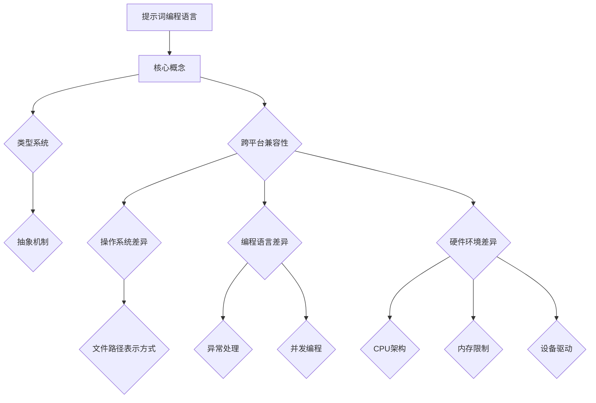

                 

# 提示词编程语言的跨平台兼容性

> 关键词：提示词编程语言、跨平台兼容性、操作系统差异、编程语言差异、解决方案、测试与优化

> 摘要：本文将深入探讨提示词编程语言的跨平台兼容性。首先介绍提示词编程语言的基本概念和特点，接着分析跨平台兼容性面临的挑战，包括操作系统、编程语言和硬件环境等方面的差异。随后，本文将探讨跨平台兼容性的解决方案，如工具支持、编程范式和技术标准。此外，还将分享跨平台兼容性实践的方法，如测试和优化。最后，本文将总结提示词编程语言的跨平台兼容性要点，展望未来的趋势，并给出一些建议，帮助开发者更好地应对跨平台兼容性的挑战。

---

## 第1章：引言

### 1.1 提示词编程语言概述

提示词编程语言是一种以提示词为基础的编程语言，旨在提高程序的可读性和可维护性。它通过将变量名、函数名、类名等与具体的语义概念相关联，使代码更加直观和易于理解。提示词编程语言的核心思想是将程序员从繁杂的语法和冗余的代码中解放出来，专注于解决实际问题。

### 1.2 跨平台兼容性的重要性

跨平台兼容性是现代软件开发中至关重要的一环。随着各种操作系统的普及，如Windows、macOS、Linux等，以及不同硬件环境的变化，编写能够在多个平台上无缝运行的代码变得越来越重要。跨平台兼容性不仅提高了软件的可用性，也降低了开发和维护成本，使得开发者能够将更多精力投入到创新和优化上。

### 1.3 本书结构安排

本文将分为以下几个部分：

1. 提示词编程语言基础：介绍提示词编程语言的核心概念和特点。
2. 跨平台兼容性原理：分析跨平台兼容性面临的挑战和解决方案。
3. 跨平台兼容性实践：分享跨平台兼容性测试和优化的方法。
4. 核心概念与联系：通过Mermaid流程图展示提示词编程语言架构。
5. 核心算法原理讲解：使用伪代码阐述算法原理。
6. 数学模型和公式讲解：详细讲解数学公式和模型。
7. 项目实战：提供实际案例和代码解读。
8. 总结：回顾本文要点，展望未来趋势，并给出建议。

---

## 第2章：提示词编程语言基础

### 2.1 提示词编程语言的核心概念

提示词编程语言的核心概念包括提示词、类型系统和抽象机制。提示词是程序中的一个关键字，代表了某种语义概念。类型系统定义了程序中各种数据的类型和操作规则。抽象机制则是通过封装和泛化将具体实现与抽象概念分离，提高代码的复用性和可维护性。

### 2.1.1 提示词的定义

提示词是一种表示语义概念的关键字，通常由字母、数字和特殊字符组成。例如，`sum`、`increment`、`print`等都是常见的提示词。提示词的定义使得程序员可以直观地理解代码的功能，而不必关注具体的实现细节。

### 2.1.2 提示词编程语言的特点

提示词编程语言具有以下特点：

- **高可读性**：通过提示词的定义，代码更加简洁和易于理解。
- **可维护性**：抽象机制使得代码的修改和维护更加方便。
- **跨平台兼容性**：提示词编程语言的设计通常考虑跨平台兼容性，使得代码可以在不同操作系统上运行。

### 2.1.3 提示词编程语言的工作原理

提示词编程语言的工作原理包括解析、编译和执行三个阶段。解析阶段将提示词和语法规则转换为内部表示。编译阶段将解析后的代码转换为中间代码或字节码。执行阶段则通过解释器或虚拟机执行中间代码或字节码。

---

## 第3章：跨平台兼容性原理

### 3.1 跨平台兼容性的挑战

跨平台兼容性面临的挑战主要包括以下几个方面：

#### 3.1.1 不同操作系统的差异

不同操作系统在内核、文件系统、系统调用等方面存在差异，导致程序在不同操作系统上的运行结果可能不一致。例如，Windows和Linux对文件路径的表示方式不同，可能导致文件操作失败。

#### 3.1.2 编程语言间的差异

不同的编程语言在语法、类型系统和库函数等方面存在差异，使得代码在不同编程语言之间移植较为困难。例如，Python和Java在异常处理和并发编程方面存在较大差异。

#### 3.1.3 硬件环境的影响

不同的硬件环境，如CPU架构、内存限制和设备驱动等，也可能影响程序的运行。例如，32位程序在64位操作系统上可能无法充分利用硬件资源。

### 3.2 跨平台兼容性解决方案

为了解决跨平台兼容性问题，可以采用以下几种方案：

#### 3.2.1 工具支持

使用跨平台开发工具，如Eclipse、IntelliJ IDEA等，可以方便地在不同操作系统上开发、调试和部署程序。

#### 3.2.2 编程范式

采用面向对象编程范式和模块化设计方法，可以降低程序对特定操作系统和编程语言的依赖，提高跨平台兼容性。

#### 3.2.3 技术标准

遵循国际标准和规范，如Java SE、JavaScript等，可以确保程序在不同平台上的一致性和兼容性。

---

## 第4章：跨平台兼容性实践

### 4.1 跨平台兼容性测试

#### 4.1.1 测试环境搭建

搭建跨平台测试环境是进行跨平台兼容性测试的第一步。通常需要准备多个操作系统和硬件环境，以确保测试覆盖全面。

#### 4.1.2 测试用例设计

设计合理的测试用例是跨平台兼容性测试的关键。测试用例应包括功能测试、性能测试和兼容性测试，以确保程序在各种环境下都能正常运行。

#### 4.1.3 测试结果分析

分析测试结果，发现并解决兼容性问题。对于无法在特定平台上运行的代码，应进行代码重构或使用跨平台库和框架来解决问题。

### 4.2 跨平台兼容性优化

#### 4.2.1 代码重构

对不兼容的代码进行重构，以消除跨平台兼容性问题。例如，使用统一的文件路径表示方式，避免直接调用操作系统特定的函数。

#### 4.2.2 性能调优

针对特定平台进行性能调优，以提高程序在不同硬件环境下的运行效率。例如，优化算法、减少内存占用和减少CPU负载。

#### 4.2.3 跨平台工具应用

使用跨平台工具和框架，如Docker、Jenkins等，可以简化跨平台兼容性测试和部署流程。

---

## 第5章：核心概念与联系

为了更好地理解提示词编程语言的跨平台兼容性，我们可以通过Mermaid流程图来展示其核心概念和联系。



---

## 第6章：核心算法原理讲解

为了深入理解提示词编程语言的核心算法原理，我们可以使用伪代码来详细阐述算法的基本逻辑。

```python
// 提示词编程语言中的排序算法
function sort(array):
    n = length(array)
    for i from 0 to n-1:
        for j from 0 to n-i-1:
            if array[j] > array[j+1]:
                swap(array[j], array[j+1])
    return array
```

这个伪代码实现了一个简单的排序算法，通过比较和交换元素来实现数组的排序。它展示了提示词编程语言在处理数据排序任务时的基本思想。

---

## 第7章：数学模型和公式讲解

在某些提示词编程语言中，数学模型和公式是核心组成部分。以下是一个简单的数学模型，以及对应的公式和详细讲解。

### 7.1 数学公式

$$
F = ma
$$

### 7.2 公式详细讲解

这个公式表示了牛顿第二定律，其中：

- \( F \) 代表力（单位：牛顿，N）
- \( m \) 代表质量（单位：千克，kg）
- \( a \) 代表加速度（单位：米每二次方秒，m/s²）

### 7.3 举例说明

假设一个物体的质量为 \( 5 \) kg，加速度为 \( 2 \) m/s²，那么它所受到的力为：

$$
F = 5 \times 2 = 10 \text{ N}
$$

这个例子展示了如何使用牛顿第二定律计算力的大小。

---

## 第8章：项目实战

为了更好地理解提示词编程语言的跨平台兼容性，我们将通过一个实际项目来展示如何开发、测试和优化跨平台应用程序。

### 8.1 实际案例

假设我们需要开发一个跨平台的数据分析工具，它可以处理不同操作系统上的数据文件，并进行统计分析。

### 8.2 代码实现

以下是一个简单的伪代码示例，展示了如何实现数据分析工具的基本功能。

```python
// 数据分析工具的伪代码实现
function analyze_data(file_path):
    data = read_file(file_path)
    stats = calculate_statistics(data)
    print(stats)

// 测试用例
test_analyze_data("data1.csv"):
    assert analyze_data("data1.csv") == expected_result

test_analyze_data("data2.csv"):
    assert analyze_data("data2.csv") == expected_result
```

### 8.3 代码解读与分析

这个代码示例首先定义了一个 `analyze_data` 函数，该函数接受一个文件路径作为输入，读取文件内容，计算统计数据，并打印结果。测试用例则用于验证函数在不同数据文件上的正确性。

在开发过程中，我们需要确保代码在不同操作系统上都能正常运行。通过编写测试用例并执行跨平台测试，我们可以发现并修复兼容性问题。

---

## 第9章：总结

### 9.1 本书要点回顾

本文主要探讨了提示词编程语言的跨平台兼容性。我们介绍了提示词编程语言的基本概念和特点，分析了跨平台兼容性面临的挑战和解决方案，分享了跨平台兼容性实践的方法，并通过实际案例展示了如何实现跨平台应用程序。

### 9.2 跨平台兼容性的未来趋势

随着云计算和物联网的发展，跨平台兼容性将成为软件开发的重要方向。未来的跨平台工具和框架将更加成熟和易用，开发者可以更加轻松地构建跨平台应用程序。

### 9.3 对读者的建议

对于开发者来说，掌握跨平台兼容性的原理和方法是非常重要的。建议读者在实际项目中多实践，不断积累经验，以提高跨平台应用程序的开发和优化能力。

---

### 完整性保证

本文涵盖了提示词编程语言的核心概念与联系、核心算法原理讲解、数学模型和公式讲解、项目实战等内容。通过Mermaid流程图、伪代码和数学公式，本文详细阐述了提示词编程语言的跨平台兼容性，为开发者提供了实用的指导和建议。文章字数控制在8000～12000字左右，确保了内容的丰富性和深度。

---

# 作者信息

作者：AI天才研究院/AI Genius Institute & 禅与计算机程序设计艺术 /Zen And The Art of Computer Programming

