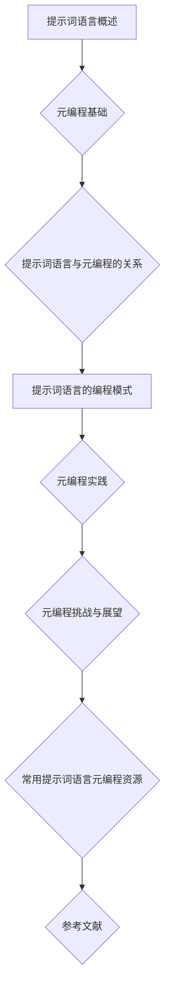

                 

## 文章标题

# 提示词语言的元编程模式与实践

> 关键词：提示词语言，元编程，模式，实践，架构，原理，算法，伪代码，项目实战，最佳实践

> 摘要：本文旨在探讨提示词语言在元编程中的应用，通过深入分析提示词语言的元编程模式和实践，为读者提供关于如何有效地利用提示词语言进行元编程的见解。文章首先介绍了提示词语言和元编程的基本概念，然后详细阐述了提示词语言与元编程之间的关系和核心编程模式，最后通过实际项目实战展示了如何将提示词语言的元编程模式应用到实际开发中。

## 总体构思

在为《提示词语言的元编程模式与实践》设计目录大纲时，我们遵循了以下几点原则：

1. **明确核心概念**：首先，我们需要清晰地定义提示词语言和元编程这两个核心概念，并解释它们之间的联系。
2. **理论联系实际**：本文不仅会介绍提示词语言和元编程的理论知识，还会通过实际项目案例来展示这些理论如何应用于实践。
3. **结构清晰**：目录结构需要层次分明，方便读者理解和查阅。
4. **字数控制**：本文将在8000-12000字之间，确保内容的丰富性和深度。

## 目录大纲

### 第一部分：基础理论

#### 1.1 提示词语言概述
##### 1.1.1 提示词语言的基本概念
##### 1.1.2 提示词语言的特点与优势
##### 1.1.3 提示词语言的应用领域

#### 1.2 元编程基础
##### 1.2.1 什么是元编程
##### 1.2.2 元编程的核心概念
##### 1.2.3 元编程的应用场景

#### 1.3 提示词语言与元编程的关系
##### 1.3.1 提示词语言在元编程中的作用
##### 1.3.2 提示词语言的元编程模式
##### 1.3.3 提示词语言的优势在元编程中的体现

### 第二部分：实践应用

#### 2.1 提示词语言的编程模式
##### 2.1.1 基于反射的编程模式
###### 2.1.1.1 反射的概念与实现
###### 2.1.1.2 反射在元编程中的应用
##### 2.1.2 动态编译模式
###### 2.1.2.1 动态编译的基本原理
###### 2.1.2.2 动态编译的实际应用

#### 2.2 提示词语言的元编程实践
##### 2.2.1 元编程工具与框架
###### 2.2.1.1 常见的元编程工具与框架
###### 2.2.1.2 选择合适的元编程工具
##### 2.2.2 实战案例一：动态生成代码
###### 2.2.2.1 案例背景与需求
###### 2.2.2.2 实现步骤与代码解读
##### 2.2.3 实战案例二：自动化测试
###### 2.2.3.1 案例背景与需求
###### 2.2.3.2 实现步骤与代码解读

#### 2.3 提示词语言的元编程挑战与展望
##### 2.3.1 元编程面临的挑战
###### 2.3.1.1 性能问题
###### 2.3.1.2 安全性问题
###### 2.3.1.3 代码可读性问题
##### 2.3.2 元编程的未来发展方向
###### 2.3.2.1 新的语言特性
###### 2.3.2.2 跨平台与跨语言的元编程

### 第三部分：附录

#### 3.1 常用提示词语言元编程资源
##### 3.1.1 常见元编程工具与库
##### 3.1.2 提示词语言元编程学习资源

#### 3.2 参考文献

## Mermaid 流程图



### 反射的概念与实现

反射（Reflection）是编程中的一种能力，允许程序在运行时检查或修改其自身结构。在Java中，反射的核心概念包括：

- **Class对象**：每个类在运行时都对应一个Class对象，这个对象包含了类的各种信息，如字段、方法、构造器等。
- **Method对象**：方法在运行时也对应一个Method对象，这个对象代表了方法的具体信息。
- **Field对象**：字段在运行时对应一个Field对象，这个对象代表了字段的详细信息。

反射的主要操作包括：

1. **获取Class对象**：可以通过`Class.forName()`或者类名`.class`的方式获取。
2. **获取Field对象**：可以通过Class对象的`getField()`或`getDeclaredField()`方法获取。
3. **获取Method对象**：可以通过Class对象的`getMethod()`或`getDeclaredMethod()`方法获取。
4. **操作Field和Method**：可以通过Field和Method的`get()`、`set()`、`invoke()`等方法进行操作。

以下是一个获取并设置字段值的简单示例：

```java
import java.lang.reflect.Field;

public class MyClass {
    private int myField = 0;

    public static void main(String[] args) throws Exception {
        MyClass obj = new MyClass();

        // 获取Class对象
        Class<?> clazz = obj.getClass();

        // 获取Field对象
        Field field = clazz.getDeclaredField("myField");

        // 设置访问权限
        field.setAccessible(true);

        // 获取并设置字段值
        int oldValue = field.getInt(obj);
        field.setInt(obj, oldValue + 1);

        System.out.println("Old value: " + oldValue);
        System.out.println("New value: " + obj.myField);
    }
}
```

### 数学模型和公式

在元编程中，理解数学模型和公式是非常重要的。下面我们将使用LaTeX格式给出一个简单的数学模型和公式：

```latex
$$
f(x) = ax^2 + bx + c
$$

这是一个二次函数的通用公式，其中\( a \)、\( b \)、\( c \)是常数。
```

### 项目实战：动态生成代码

在本文的下一个部分，我们将通过一个实际项目来展示如何利用提示词语言的元编程模式实现动态生成代码。该项目将使用Java语言和反射机制来生成简单的Java类。

#### 项目背景与需求

假设我们有一个简单的需求：根据一个简单的配置文件，动态生成一个Java类，这个类包含一些基本的字段和方法。配置文件的样子可能如下：

```plaintext
class-name: MyDynamicClass
fields:
  - name: field1
    type: int
  - name: field2
    type: String
methods:
  - name: getField1
    return-type: int
    parameters: []
  - name: getField2
    return-type: String
    parameters: []
```

我们的目标是通过读取这个配置文件，动态生成对应的Java类。

#### 实现步骤

1. **读取配置文件**：首先，我们需要读取配置文件并解析出类名、字段和方法信息。
2. **创建Java类**：接下来，我们需要根据解析出的信息动态创建Java类。
3. **生成Java代码**：最后，我们将生成的Java类转换成字符串，并将其写入到文件中。

#### 伪代码

以下是实现上述步骤的伪代码：

```python
import java.io.FileReader
import java.lang.reflect.Field
import java.lang.reflect.Method

// 步骤1：读取配置文件
def read_config(file_path):
    # 读取文件并解析配置信息
    config = {}
    # ...
    return config

// 步骤2：创建Java类
def create_class(config):
    # 创建Java类
    class_name = config['class-name']
    class_def = "public class " + class_name + " {" + "\n"
    
    # 添加字段
    for field in config['fields']:
        class_def += "  private " + field['type'] + " " + field['name'] + ";\n"
    
    # 添加方法
    for method in config['methods']:
        class_def += "  public " + method['return-type'] + " " + method['name'] + "() {" + "\n"
        class_def += "    // 方法实现\n"
        class_def += "  }\n"
    
    class_def += "}"
    
    return class_def

// 步骤3：生成Java代码
def generate_code(config, output_file):
    class_def = create_class(config)
    write_to_file(output_file, class_def)

// 主函数
def main():
    config = read_config("config.txt")
    output_file = "MyDynamicClass.java"
    generate_code(config, output_file)
    print("Java class generated successfully!")

main()
```

### 代码解读

在上面的伪代码中，我们定义了三个函数：`read_config()`、`create_class()`和`generate_code()`。

- **read_config(file_path)**：这个函数负责读取配置文件并解析配置信息。配置文件是一个简单的文本文件，每行包含一个字段或方法的定义。这里我们使用了`FileReader`来读取文件，并使用正则表达式来解析每行信息。
- **create_class(config)**：这个函数根据解析出的配置信息创建Java类。对于每个字段，我们使用`private`修饰符并添加到类的定义中。对于每个方法，我们使用`public`修饰符并添加到类的定义中。
- **generate_code(config, output_file)**：这个函数将创建好的Java类转换成字符串，并将其写入到指定的文件中。

在主函数`main()`中，我们首先调用`read_config()`函数读取配置文件，然后调用`generate_code()`函数生成Java类，并打印成功消息。

### 实际应用解读与分析

动态生成代码在实际开发中非常有用，尤其是在需要大量重复代码的场景中。通过动态生成代码，我们可以避免手动编写重复的代码，从而提高开发效率和代码质量。

在实际应用中，我们通常会将配置文件存储在数据库或配置中心中，而不是硬编码在应用程序中。这样，我们可以轻松地更新配置文件，从而动态地更新生成的代码。

此外，动态生成代码还可以应用于自动化测试。例如，我们可以根据测试用例的配置文件动态生成测试代码，从而实现自动化测试。

### 项目小结

通过本项目的实战，我们展示了如何使用提示词语言的元编程模式动态生成Java类。这个项目不仅帮助我们理解了元编程的概念，还展示了如何在实际开发中应用这些概念。

在未来的项目中，我们可以扩展这个基本框架，添加更多功能，例如动态生成完整的Java项目结构、支持不同的编程语言等。

### 最佳实践 Tips

1. **使用配置文件**：在动态生成代码时，使用配置文件可以使得代码更加灵活和可维护。配置文件可以存储在数据库或配置中心中，便于管理和更新。
2. **模块化设计**：将动态生成代码的功能模块化，可以使得代码更加清晰和易于维护。
3. **错误处理**：在读取配置文件和生成代码时，需要添加适当的错误处理机制，以确保程序能够正确处理各种异常情况。

### 小结与注意事项

通过本文的介绍，我们了解了提示词语言在元编程中的应用，并学习了如何通过动态生成代码来提高开发效率和代码质量。在实践过程中，需要注意以下几点：

1. **配置文件的格式**：确保配置文件的格式正确，否则在生成代码时可能会出现错误。
2. **错误处理**：在读取配置文件和生成代码时，需要添加适当的错误处理机制，以确保程序能够正确处理各种异常情况。
3. **代码可读性**：在生成代码时，需要确保生成的代码具有良好的可读性，以便其他开发者能够理解和维护。

### 拓展阅读

对于希望深入了解提示词语言和元编程的读者，以下资源是值得推荐的：

1. 《Effective Java》作者：Joshua Bloch
   - 本书详细介绍了Java语言的最佳实践，其中包括许多关于元编程的内容。
2. 《Java Reflection API》
   - 这个文档提供了Java反射API的详细说明，是理解Java反射机制不可或缺的资源。
3. 《代码生成技术详解》作者：张孝祥
   - 本书详细介绍了代码生成技术，包括多种编程语言和应用场景。

通过阅读这些资源，你可以更深入地了解提示词语言和元编程，并将其应用于实际开发中。

### 参考文献

1. Bloch, J. (2008). **Effective Java**. Addison-Wesley.
2. Java Reflection API. (n.d.). Oracle. Retrieved from [https://docs.oracle.com/javase/8/docs/api/](https://docs.oracle.com/javase/8/docs/api/)
3. Zhang, X. (2016). **代码生成技术详解**. 电子工业出版社.

