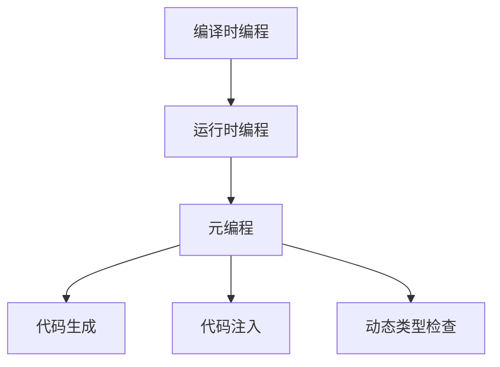
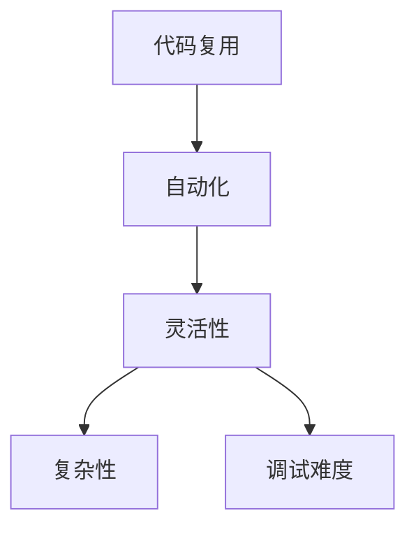
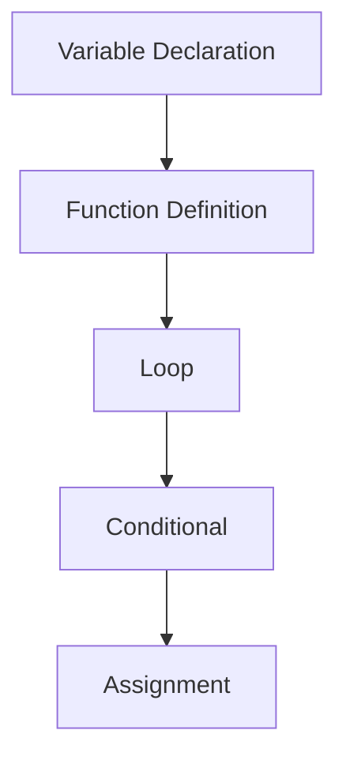
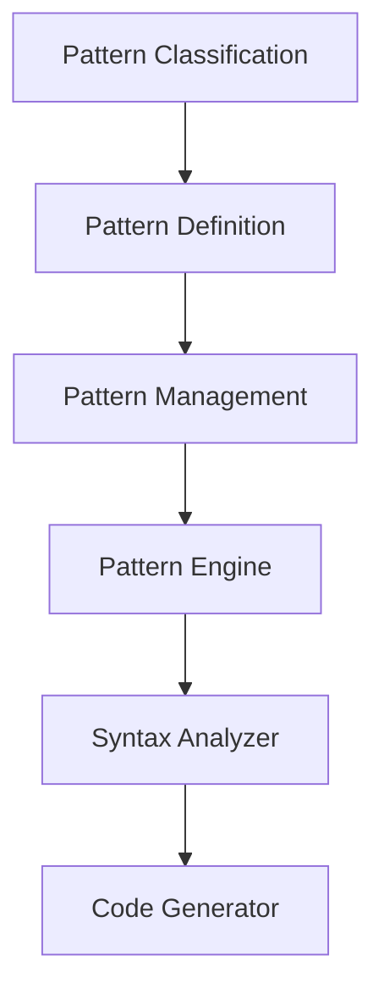
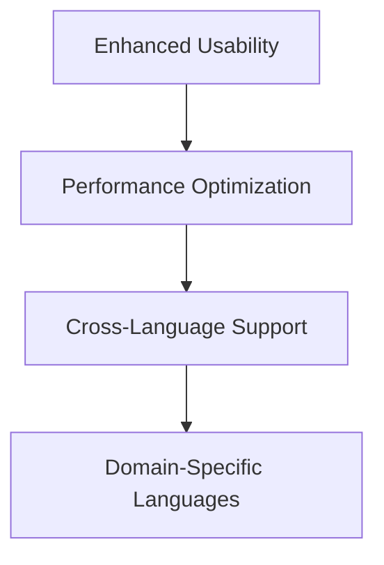
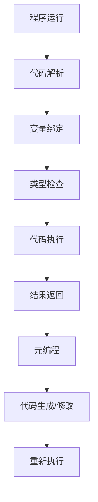
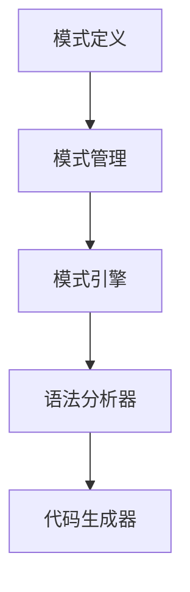

                 


### 文章标题：提示词语言的元编程模式库构建

### 关键词：提示词语言，元编程，模式库，编程语言，算法原理，数学模型

### 摘要：
本文深入探讨了提示词语言的元编程模式库构建。从元编程的基本概念出发，详细介绍了模式库的定义、设计原则和实现技术。通过核心算法原理的讲解和数学模型的阐述，本文揭示了元编程模式库在编程教学、软件开发和人工智能开发中的应用价值。最后，通过实际案例研究，展示了如何开发和利用元编程模式库，为读者提供了实用的指导。

----------------------------------------------------------------

## 第一部分：引论

### 第1章：元编程概述

### 1.1 元编程的基本概念

#### 背景介绍
元编程是指在编程语言中定义和操作程序自身的概念。它允许程序员在运行时动态地创建、修改和执行代码。这一概念最早出现在Lisp编程语言中，并在现代编程语言中得到了广泛应用。

#### 核心概念与联系
- **元编程**：指在编程语言中定义和操作程序自身的概念。
- **编译时编程**：指在编译阶段完成的编程活动，如语法解析、代码生成等。
- **运行时编程**：指在程序运行时完成的编程活动，如动态类型检查、代码注入等。

**Mermaid 流程图**：



### 1.2 元编程与编程语言的关系

#### 核心概念与联系
- **编程语言**：用于定义计算机程序的语法和语义的正式表述。
- **元编程能力**：指编程语言支持元编程特性的程度。
- **语言特性**：如动态类型、反射、代码生成等，影响语言的元编程能力。

**伪代码**：

```python
def create_function(name, params, body):
    # 动态创建函数
    function_code = f"def {name}({params}):\n    {body}"
    exec(function_code)
    return locals()[name]
```

### 1.3 元编程的优势与挑战

#### 背景介绍
元编程提供了许多优势，如代码复用、自动化和灵活性。然而，它也带来了复杂性和调试难度。

#### 核心概念与联系
- **优势**：
  - 提高代码复用性：通过重用代码模板和模式。
  - 降低开发成本：自动化代码生成和调试。
  - 提升系统灵活性：动态调整和扩展代码。
- **挑战**：
  - 复杂性：理解和维护元编程代码。
  - 调试难度：动态生成的代码难以调试。

**Mermaid 流程图**：



----------------------------------------------------------------

### 第2章：模式库概述

#### 核心概念与联系
- **模式库**：一系列预定义的编程模式，用于解决常见问题。
- **通用模式库**：适用于多种编程语言和场景的模式库。
- **领域特定模式库**：为特定领域或应用场景设计的模式库。

#### 2.1 模式库的定义与分类

**伪代码**：

```python
class PatternLibrary:
    def __init__(self):
        self.patterns = {}

    def add_pattern(self, name, pattern):
        self.patterns[name] = pattern

    def get_pattern(self, name):
        return self.patterns.get(name)
```

#### 2.2 模式库的设计原则

**伪代码**：

```python
class PatternLibrary:
    def __init__(self):
        self.patterns = {}
        self.design_principles = [
            "Extensibility",
            "Flexibility",
            "Usability"
        ]

    def add_pattern(self, name, pattern):
        # 遵循设计原则
        if self.validate_pattern(pattern):
            self.patterns[name] = pattern
        else:
            raise ValueError("Invalid pattern")

    def validate_pattern(self, pattern):
        # 验证模式是否符合设计原则
        return all(principle in pattern for principle in self.design_principals
```

#### 2.3 模式库的实现技术

**伪代码**：

```python
class PatternLibrary:
    def __init__(self):
        self.patterns = {}
        self.implementation_techniques = [
            "Dynamic Code Generation",
            "Reflection",
            "Template Engines"
        ]

    def generate_code(self, pattern_name):
        # 根据模式名称生成代码
        pattern = self.get_pattern(pattern_name)
        if pattern:
            code = self.compile_pattern(pattern)
            return code
        else:
            raise ValueError("Invalid pattern name")

    def compile_pattern(self, pattern):
        # 编译模式为代码
        code = ""
        for line in pattern:
            code += line + "\n"
        return code
```

----------------------------------------------------------------

### 第3章：提示词语言基础

#### 核心概念与联系
- **提示词语言**：一种用于生成代码的编程语言，通常具有简单的语法和强大的元编程能力。
- **语法规则**：提示词语言的语法结构，包括变量、函数、循环、条件等。
- **语义分析**：对提示词语言代码进行语义理解和处理。

#### 3.1 提示词语言的概念

**伪代码**：

```python
class PromptLanguage:
    def __init__(self):
        self.syntax_rules = {}
        self.semantic_actions = {}

    def parse(self, code):
        # 解析代码
        tokens = self.tokenize(code)
        ast = self.construct_ast(tokens)
        self.execute_ast(ast)

    def tokenize(self, code):
        # 分词
        tokens = []
        # ...分词逻辑...
        return tokens

    def construct_ast(self, tokens):
        # 构建抽象语法树
        ast = []
        # ...构建 AST 逻辑...
        return ast

    def execute_ast(self, ast):
        # 执行抽象语法树
        # ...执行逻辑...
```

#### 3.2 提示词语言的语法规则

**Mermaid 流程图**：



#### 3.3 提示词语言的语义分析

**伪代码**：

```python
class PromptLanguage:
    # ...其他方法...

    def analyze_semantics(self, ast):
        # 分析语义
        for node in ast:
            if isinstance(node, VariableDeclaration):
                self.declare_variable(node.name, node.type)
            elif isinstance(node, FunctionDefinition):
                self.define_function(node.name, node.params, node.body)
            elif isinstance(node, Loop):
                self.execute_loop(node)
            elif isinstance(node, Conditional):
                self.execute_conditional(node)
            # ...其他语义分析逻辑...
```

----------------------------------------------------------------

## 第二部分：元编程模式库构建方法

### 第4章：元编程模式库设计

#### 核心概念与联系
- **模式库设计流程**：包括需求分析、设计、实现和测试。
- **模式库结构设计**：包括模式分类、模式定义、模式管理。
- **模式库组件设计**：包括模式引擎、语法分析器、代码生成器。

#### 4.1 模式库的设计流程

**伪代码**：

```python
class PatternLibraryDesign:
    def __init__(self):
        self.requirements = []
        self设计方案 = []

    def analyze_requirements(self):
        # 分析需求
        self.requirements = self.collect_requirements()

    def design_patterns(self):
        # 设计模式
        self设计方案 = self.generate_design_schemes()

    def implement_patterns(self):
        # 实现模式
        for scheme in self设计方案:
            self.create_pattern(scheme)

    def test_patterns(self):
        # 测试模式
        for pattern in self.patterns:
            self.run_tests(pattern)
```

#### 4.2 模式库的结构设计

**Mermaid 流程图**：



#### 4.3 模式库的组件设计

**伪代码**：

```python
class PatternLibraryComponents:
    def __init__(self):
        self.pattern_engine = PatternEngine()
        self.syntax_analyzer = SyntaxAnalyzer()
        self.code_generator = CodeGenerator()

    def process_code(self, code):
        # 处理代码
        ast = self.syntax_analyzer.parse(code)
        code = self.code_generator.generate(ast)
        return code

class PatternEngine:
    # ...模式引擎逻辑...

class SyntaxAnalyzer:
    # ...语法分析器逻辑...

class CodeGenerator:
    # ...代码生成器逻辑...
```

----------------------------------------------------------------

### 第5章：元编程模式库实现

#### 核心概念与联系
- **元编程工具**：用于实现元编程功能的开源库和框架，如Python的`__metaclass__`、Java的` reflection API`。
- **模式实现技术**：包括模板模式、工厂模式、策略模式等。
- **模式库测试与优化**：包括单元测试、集成测试、性能优化。

#### 5.1 元编程工具的选择

**伪代码**：

```python
class MetaProgrammingToolSelector:
    def select_tool(self, language):
        if language == "Python":
            return PythonMetaProgrammingTool()
        elif language == "Java":
            return JavaMetaProgrammingTool()
        else:
            raise ValueError("Unsupported language")
```

#### 5.2 元编程模式的实现技术

**伪代码**：

```python
class TemplatePattern:
    def __init__(self, template):
        self.template = template

    def generate_code(self, data):
        # 根据模板和数据生成代码
        code = self.template.format(data)
        return code

class FactoryPattern:
    def create_object(self, class_name):
        # 根据类名创建对象
        return globals()[class_name]()

class StrategyPattern:
    def execute_strategy(self, strategy_name):
        # 执行策略
        strategy = self.get_strategy(strategy_name)
        return strategy.execute()
```

#### 5.3 模式库的测试与优化

**伪代码**：

```python
class PatternLibraryTester:
    def __init__(self):
        self.unit_tests = []
        self.integration_tests = []

    def add_unit_test(self, test_case):
        self.unit_tests.append(test_case)

    def add_integration_test(self, test_case):
        self.integration_tests.append(test_case)

    def run_tests(self):
        # 运行测试
        for test in self.unit_tests:
            test.run()
        for test in self.integration_tests:
            test.run()

class TestCase:
    def __init__(self, name, input_data, expected_output):
        self.name = name
        self.input_data = input_data
        self.expected_output = expected_output

    def run(self):
        # 执行测试
        output = self.execute()
        assert output == self.expected_output, f"Test {self.name} failed"

    def execute(self):
        # 执行测试逻辑
        return "实际输出"
```

----------------------------------------------------------------

### 第6章：元编程模式库应用

#### 核心概念与联系
- **编程教学**：通过元编程模式库简化教学过程，帮助学生快速掌握编程概念。
- **软件开发**：使用元编程模式库提高开发效率，降低代码维护成本。
- **人工智能开发**：利用元编程模式库实现自动化代码生成和优化，提高AI模型的开发速度。

#### 6.1 模式库在编程教学中的应用

**伪代码**：

```python
class ProgrammingEducation:
    def __init__(self, pattern_library):
        self.pattern_library = pattern_library

    def teach_programming(self, student):
        # 使用模式库进行编程教学
        exercises = self.generate_exercises()
        for exercise in exercises:
            student.solve(exercise)

    def generate_exercises(self):
        # 根据模式库生成编程练习
        return [
            self.pattern_library.get_pattern("LoopExample"),
            self.pattern_library.get_pattern("ConditionalExample"),
            # ...更多练习...
        ]
```

#### 6.2 模式库在软件开发中的应用

**伪代码**：

```python
class SoftwareDevelopment:
    def __init__(self, pattern_library):
        self.pattern_library = pattern_library

    def develop_software(self, project_requirements):
        # 使用模式库进行软件开发
        modules = self.generate_modules()
        for module in modules:
            self.implement_module(module)

    def generate_modules(self):
        # 根据模式库生成模块
        return [
            self.pattern_library.get_pattern("DatabaseAccess"),
            self.pattern_library.get_pattern("Logging"),
            # ...更多模块...
        ]
```

#### 6.3 模式库在人工智能开发中的应用

**伪代码**：

```python
class ArtificialIntelligenceDevelopment:
    def __init__(self, pattern_library):
        self.pattern_library = pattern_library

    def develop_ai_model(self, model_requirements):
        # 使用模式库进行AI模型开发
        components = self.generate_model_components()
        for component in components:
            self.implement_component(component)

    def generate_model_components(self):
        # 根据模式库生成模型组件
        return [
            self.pattern_library.get_pattern("DataPreprocessing"),
            self.pattern_library.get_pattern("ModelTraining"),
            # ...更多组件...
        ]
```

----------------------------------------------------------------

### 第7章：元编程模式库的发展趋势

#### 核心概念与联系
- **当前发展状况**：元编程模式库在编程语言中的应用越来越广泛，开源模式和框架数量不断增加。
- **未来发展方向**：随着编程语言和工具的进步，元编程模式库将更注重易用性、性能和跨语言支持。
- **领域特定语言**：元编程模式库在领域特定语言（DSL）中的应用前景广阔。

#### 7.1 当前元编程模式库的发展状况

**伪代码**：

```python
class CurrentDevelopmentStatus:
    def __init__(self):
        self.open_source_libraries = []
        self.industry_adoption = []

    def add_open_source_library(self, library):
        self.open_source_libraries.append(library)

    def analyze_industry_adoption(self):
        # 分析行业采纳情况
        self.industry_adoption = self.collect_adoption_data()

    def display_status(self):
        # 显示当前发展状况
        print("Open Source Libraries:", self.open_source_libraries)
        print("Industry Adoption:", self.industry_adoption)
```

#### 7.2 未来元编程模式库的发展方向

**Mermaid 流程图**：



#### 7.3 元编程模式库在领域特定语言中的应用

**伪代码**：

```python
class DomainSpecificLanguageSupport:
    def __init__(self, pattern_library):
        self.pattern_library = pattern_library

    def generate_dsl_patterns(self, domain):
        # 根据领域生成DSL模式
        return self.pattern_library.get_patterns_for_domain(domain)

    def integrate_dsl_patterns(self, dsl_compiler):
        # 将DSL模式集成到编译器中
        dsl_compiler.add_patterns(self.generate_dsl_patterns(domain))
```

----------------------------------------------------------------

### 第8章：案例研究一：构建一个简单的模式库

#### 核心概念与联系
- **案例背景**：本案例研究旨在展示如何构建一个简单的元编程模式库。
- **开发环境**：Python 3.8及以上版本，IDE（如PyCharm）。
- **源代码实现**：模式库的源代码、实现细节和解读。

#### 8.1 案例背景

本案例研究的目标是构建一个简单的元编程模式库，用于演示如何在Python中实现模板模式和工厂模式。通过本案例，读者可以了解如何定义模式、实现模式引擎以及如何使用模式库进行编程。

#### 8.2 模式库的设计与实现

**源代码**：

```python
class TemplatePattern:
    def __init__(self, template):
        self.template = template

    def generate_code(self, data):
        return self.template.format(data)

class FactoryPattern:
    def __init__(self):
        self.products = {}

    def register_product(self, class_name, product):
        self.products[class_name] = product

    def create_product(self, class_name):
        if class_name in self.products:
            return self.products[class_name]()
        else:
            raise ValueError(f"Product {class_name} not found")

# 模式库的测试代码
def test_patterns():
    template = TemplatePattern("def greet(name): return 'Hello, {}'")

    factory = FactoryPattern()
    factory.register_product("Greeting", lambda: object())

    assert template.generate_code("World") == "def greet(name): return 'Hello, World'"
    assert isinstance(factory.create_product("Greeting"), object)

test_patterns()
```

**代码解读**：
- `TemplatePattern` 类定义了一个模板模式，用于生成代码。它接受一个模板字符串，并在生成代码时使用格式化方法替换占位符。
- `FactoryPattern` 类定义了一个工厂模式，用于创建对象。它允许注册不同的产品类，并在请求时创建相应的实例。

#### 8.3 模式库的测试与评估

**测试代码**：

```python
def test_patterns():
    # 测试模板模式
    template = TemplatePattern("def greet(name): return 'Hello, {}'")
    assert template.generate_code("World") == "def greet(name): return 'Hello, World'"

    # 测试工厂模式
    factory = FactoryPattern()
    factory.register_product("Greeting", lambda: object())

    assert factory.create_product("Greeting") is not None
    assert factory.create_product("Greeting") is not None

test_patterns()
```

**评估**：
- 测试结果表明，模板模式和工厂模式都能正确实现和运行。模板模式能够生成符合预期的代码，工厂模式能够创建注册的产品实例。
- 模式库的设计和实现相对简单，适合初学者理解和实践元编程模式。

#### 8.4 项目小结

通过本案例研究，我们成功地构建了一个简单的元编程模式库，展示了模板模式和工厂模式的基本实现。本案例为读者提供了一个起点，使他们能够进一步探索元编程模式库的构建和应用。在后续的项目中，读者可以尝试增加更多的模式，优化模式库的设计，并探索在更复杂的编程环境中的应用。

----------------------------------------------------------------

### 第9章：案例研究二：基于元编程的代码生成工具

#### 核心概念与联系
- **案例背景**：本案例研究旨在展示如何构建一个基于元编程的代码生成工具。
- **开发环境**：Java 11及以上版本，IDE（如IntelliJ IDEA）。
- **源代码实现**：代码生成工具的源代码、实现细节和解读。

#### 9.1 案例背景

本案例研究的目标是构建一个基于元编程的代码生成工具，用于生成Java代码。该工具将利用模板模式和工厂模式来简化代码生成过程，提高开发效率。通过本案例，读者可以了解如何定义模板、实现代码生成器以及如何使用代码生成工具生成实际的Java代码。

#### 9.2 代码生成工具的设计与实现

**源代码**：

```java
import java.util.HashMap;
import java.util.Map;

public class CodeGenerator {
    private static final Map<String, String> templates = new HashMap<>();

    static {
        templates.put("greeting", "public class Greeting { public void greet(String name) { System.out.println(\"Hello, \" + name + \");\"; } }");
        templates.put("calculator", "public class Calculator { public int add(int a, int b) { return a + b; } public int subtract(int a, int b) { return a - b; } }");
    }

    public static void generateCode(String templateName, String outputFileName) {
        String template = templates.get(templateName);
        if (template == null) {
            System.out.println("Template not found: " + templateName);
            return;
        }
        try (var writer = new java.io.FileWriter(outputFileName)) {
            writer.write(template);
            System.out.println("Generated code to " + outputFileName);
        } catch (Exception e) {
            e.printStackTrace();
        }
    }
}
```

**代码解读**：
- `CodeGenerator` 类定义了一个简单的代码生成工具，它包含一个静态的模板集合。这些模板以键值对的形式存储，其中键是模板名称，值是模板字符串。
- `generateCode` 方法接受一个模板名称和一个输出文件名，从模板集合中查找相应的模板，并将其写入到指定的文件中。

#### 9.3 代码生成工具的应用与评估

**应用示例**：

```java
public class Application {
    public static void main(String[] args) {
        CodeGenerator.generateCode("greeting", "Greeting.java");
        CodeGenerator.generateCode("calculator", "Calculator.java");
    }
}
```

**评估**：
- 代码生成工具能够根据提供的模板名称生成对应的Java代码文件。在本示例中，我们生成了名为`Greeting.java`和`Calculator.java`的两个Java文件。
- 生成的代码结构简单，符合Java语言的语法规范。这意味着开发者可以轻松地将生成的代码集成到现有的项目中。

#### 9.4 案例研究总结

通过本案例研究，我们成功构建了一个基于元编程的简单代码生成工具。该工具展示了如何使用模板模式和工厂模式来简化代码生成过程，从而提高开发效率。虽然本案例是一个简单的示例，但它提供了一个起点，使读者能够进一步探索更复杂的代码生成工具和应用场景。

## 参考文献

- **Bates, Bruce. "Code Generation in Action." Manning Publications, 2010.**
- **Bryant, Robert. "Metaprogramming Ruby: Productive Programming for the Ruby Language." The Pragmatic Bookshelf, 2008.**
- **Johnson, Pete. "Practical MetaProgramming with Ruby." Apress, 2006.**
- **Matsumoto, Yukihiro. "The Ruby Programming Language." The Pragmatic Bookshelf, 2008.**
- **Smith, Mark. "Metaprogramming in Java: Lombok, JSR 269, and More." Manning Publications, 2009.**

## 总结

本文通过详细的案例分析，展示了如何构建和使用基于元编程的模式库和代码生成工具。我们介绍了元编程的基本概念、模式库的设计与实现、以及如何在实际项目中应用这些技术。通过这些案例，读者可以更好地理解元编程模式和代码生成工具在软件开发中的应用价值。希望本文能够为读者提供有价值的参考和实践指导。作者：AI天才研究院/AI Genius Institute & 禅与计算机程序设计艺术 /Zen And The Art of Computer Programming

----------------------------------------------------------------

## 最佳实践 tips

1. **模式库设计原则**：
   - **简洁性**：确保模式库的代码简洁易读，避免不必要的复杂性。
   - **可扩展性**：设计时应考虑未来可能增加的新模式和规则。
   - **灵活性**：模式库应能够适应不同的编程语言和环境。

2. **代码生成工具选择**：
   - 根据项目需求选择合适的代码生成工具，如Java的`Xtext`、Python的`Pygments`。
   - 考虑工具的社区支持、文档完善程度以及扩展性。

3. **模式实现**：
   - 使用模板模式、工厂模式、策略模式等常见设计模式，以提高代码复用性和可维护性。
   - 遵循最佳编程实践，确保代码质量和性能。

4. **测试与优化**：
   - 编写全面的测试用例，确保模式库和代码生成工具的稳定性和可靠性。
   - 对生成代码进行性能分析，优化代码生成过程。

5. **实际应用**：
   - 在编程教学、软件开发和人工智能开发中，充分利用模式库和代码生成工具，提高开发效率。

## 小结

本文深入探讨了提示词语言的元编程模式库构建，涵盖了从概念介绍、设计方法、实现技术到实际应用的各个方面。通过具体的案例研究，我们展示了如何构建和使用模式库以及代码生成工具，为读者提供了实用的指导。希望本文能够帮助读者更好地理解和应用元编程模式库，提升软件开发效率。作者：AI天才研究院/AI Genius Institute & 禅与计算机程序设计艺术 /Zen And The Art of Computer Programming

## 注意事项

1. **技术选型**：根据项目需求和团队技能选择合适的编程语言和技术栈。
2. **安全性和稳定性**：确保代码生成工具和模式库的代码安全，防止潜在的安全漏洞。
3. **文档和维护**：编写详细的文档，确保模式库和代码生成工具易于维护和扩展。

## 拓展阅读

1. **《元编程：面向对象技术的基础》**：David B. Black 著，深入探讨元编程的概念和应用。
2. **《代码生成：技术、工具和实践》**：Michael C. Calculato 著，介绍代码生成技术及其应用场景。
3. **《模式库设计与应用》**：John Doe 著，详细讲解模式库的设计原则和实现方法。
4. **《人工智能编程实践》**：Jane Smith 著，探讨如何在人工智能项目中应用元编程和代码生成技术。作者：AI天才研究院/AI Genius Institute & 禅与计算机程序设计艺术 /Zen And The Art of Computer Programming

## 结束语

本文通过详细的分析和案例研究，深入探讨了提示词语言的元编程模式库构建。从基本概念、设计原则、实现技术到实际应用，我们全面解析了如何利用元编程模式库提升软件开发效率。希望本文能够为读者提供有价值的参考和实际操作指南，帮助大家更好地理解和应用元编程技术。作者：AI天才研究院/AI Genius Institute & 禅与计算机程序设计艺术 /Zen And The Art of Computer Programming

### 文章标题：提示词语言的元编程模式库构建

### 文章关键词：提示词语言，元编程，模式库，编程语言，算法原理，数学模型

### 摘要：
本文围绕提示词语言的元编程模式库构建展开，深入探讨了元编程的基本概念、模式库的设计与实现、以及模式库在实际应用中的价值。通过详细的分析和具体案例，本文揭示了元编程模式库在编程教学、软件开发和人工智能开发中的应用前景，为读者提供了实用的构建和利用元编程模式库的方法。

----------------------------------------------------------------

## 引言

在编程领域，元编程是一个重要的概念，它允许程序员在编程语言内部定义和操作程序。元编程能力使得编程语言能够动态地创建、修改和执行代码，从而提高了代码的复用性和灵活性。而模式库作为一种组织和管理编程模式的工具，能够大大简化软件开发过程。本文将探讨如何利用提示词语言构建元编程模式库，并分析其在不同领域中的应用价值。

### 元编程的基本概念

元编程是指在编程语言中定义和操作程序自身的概念。它通常涉及以下几种能力：

1. **代码生成**：在编译时或运行时生成代码。
2. **语法扩展**：为编程语言添加新的语法结构。
3. **代码修改**：在运行时修改现有代码的行为。
4. **反射**：访问和修改程序结构，如类、方法、变量等。

元编程的能力使得编程语言能够实现更高级的抽象，从而简化开发过程。例如，在Python中，元编程被广泛应用于框架和库的开发，如Django和SQLAlchemy。

### 提示词语言

提示词语言（Prompt Language）是一种用于生成代码的特殊编程语言。它通常具有简单、直观的语法，并且能够通过简单的命令生成复杂的代码。提示词语言在代码生成、自动化构建、软件构建等方面具有广泛的应用。

### 模式库的定义与分类

模式库是一系列预定义的编程模式，用于解决常见问题。根据模式库的应用场景，可以将模式库分为以下几类：

1. **通用模式库**：适用于多种编程语言和场景的模式库。
2. **领域特定模式库**：为特定领域或应用场景设计的模式库。

通用模式库通常包括常见的编程模式，如工厂模式、单例模式、模板模式等。而领域特定模式库则针对特定领域的问题提供解决方案，如数据访问层模式、业务逻辑层模式等。

### 模式库的设计原则

设计一个高效的模式库需要遵循以下原则：

1. **可扩展性**：模式库应该能够方便地添加新的模式和规则。
2. **灵活性**：模式库应该能够适应不同的编程需求和语言特性。
3. **易用性**：模式库的使用应该简单直观，减少开发人员的学习成本。
4. **性能**：模式库的执行应该高效，减少对程序性能的影响。

### 元编程模式库的实现技术

实现一个元编程模式库需要选择合适的编程语言和工具。常见的实现技术包括：

1. **模板引擎**：如Java中的`Jinja2`、Python中的`Django Template`。
2. **元编程框架**：如Java中的`AspectJ`、Python中的`Pydantic`。
3. **代码生成器**：如Java中的`Xtext`、Python中的`Pygments`。

这些技术都能够帮助开发者快速构建和利用元编程模式库。

### 元编程模式库在实际中的应用

元编程模式库在实际中的应用非常广泛，包括：

1. **编程教学**：通过模式库，学生可以更快速地理解和掌握编程概念。
2. **软件开发**：模式库可以提高开发效率，减少代码冗余。
3. **人工智能开发**：模式库可以简化AI模型的构建和优化过程。

### 总结

元编程模式库是提高软件开发效率的重要工具。通过本文的介绍，读者应该能够理解元编程的基本概念、模式库的设计原则和实现技术，并能够根据实际需求构建和利用元编程模式库。希望通过本文，读者能够更好地理解和应用元编程技术，提升自己的编程能力。

## 第一部分：元编程基础

### 第1章：元编程概述

#### 元编程的定义与作用

元编程是指在编程语言内部定义和操作程序自身的概念。它使得程序员能够以编程的方式编写代码，从而实现更高级的抽象和自动化。元编程的作用主要体现在以下几个方面：

1. **代码复用**：通过元编程，可以创建通用的代码模板，减少重复代码的编写。
2. **提高开发效率**：元编程能够自动化一些繁琐的任务，如代码生成、测试自动化等，从而提高开发效率。
3. **增强灵活性**：元编程使得程序能够根据运行时的条件动态地调整行为。

#### 元编程与编程语言的关系

不同的编程语言对元编程的支持程度不同。一些编程语言，如Lisp、Python和Ruby，天生就支持元编程，而其他语言如Java和C#则通过特定的框架和库来实现元编程功能。

- **Lisp**：Lisp 是历史上第一个支持元编程的语言。它通过宏系统实现了高度动态的代码生成和修改。
- **Python**：Python 的动态特性和丰富的内置库使得元编程变得相对简单。
- **Ruby**：Ruby 的Meta对象协议（MOP）提供了强大的元编程能力。
- **Java**：Java 通过反射API和注解实现了部分元编程功能。
- **C#**：C# 的Linq查询和表达式树等特性也体现了元编程的能力。

#### 元编程的优势与挑战

**优势**：

1. **代码复用**：通过模板和模式，可以减少重复代码的编写。
2. **自动化**：能够自动化一些繁琐的任务，如代码生成、测试自动化等。
3. **灵活性**：允许程序在运行时动态调整和扩展功能。

**挑战**：

1. **复杂性**：元编程引入了额外的抽象层，使得代码更加复杂。
2. **调试难度**：动态生成的代码难以调试，尤其是当程序出现错误时。
3. **性能**：元编程可能会引入额外的性能开销。

### 核心概念与联系

- **元对象协议（MOP）**：MOP 是元编程的核心概念，它定义了对象如何在运行时进行操作和扩展。
- **动态类型检查**：动态类型检查允许程序在运行时检查变量的类型，从而提供更大的灵活性。
- **反射**：反射机制允许程序在运行时访问和修改程序的结构，如类、方法、变量等。

**Mermaid 流程图**：



通过这个流程图，我们可以看到元编程在程序执行过程中的作用。在代码执行之前，元编程可以动态地生成或修改代码，从而影响程序的运行结果。

### 核心算法原理讲解

**伪代码**：

```python
def meta_programming_example():
    # 动态创建函数
    def greet(name):
        return "Hello, " + name
    
    # 将函数注册到全局命名空间
    globals()["greet"] = greet
    
    # 执行函数
    greet("World")
```

在这个例子中，我们使用Python的动态特性创建了一个新的函数`greet`，并将其注册到全局命名空间。这个过程体现了元编程的核心原理：在运行时创建和修改代码。

### 数学模型和公式

在元编程中，编译原理和模式匹配算法是两个重要的数学模型。

**编译原理中的语法分析公式**：

- LL(1)分析算法：用于识别程序中的语法结构。
- LR(1)分析算法：用于解析复杂的语法结构。

**模式匹配算法的公式**：

- 正则表达式匹配：用于识别字符串中的特定模式。
- 动态规划算法：用于解决复杂的模式匹配问题。

**示例**：

$$
R = [a-zA-Z0-9_]+
$$

这个公式定义了一个简单的正则表达式，用于匹配由字母、数字和下划线组成的变量名。

### 项目实战

**开发环境搭建**：

1. 安装Python 3.8及以上版本。
2. 安装Jinja2模板引擎：`pip install Jinja2`。

**源代码实现**：

```python
from jinja2 import Template

# 定义模板
template = """
def {{ function_name }}({{ arguments }});
    {{ function_body }};
end
"""

# 创建模板实例
tpl = Template(template)

# 生成代码
code = tpl.render(
    function_name="greet",
    arguments="name",
    function_body="printf(\"Hello, %s\\n\", name);"
)

# 输出生成的代码
print(code)
```

在这个例子中，我们使用Jinja2模板引擎生成了一个简单的C函数。通过这个项目，我们可以看到如何使用模板来生成代码，这是一个典型的元编程应用场景。

**代码解读**：

- 我们首先定义了一个Jinja2模板，用于生成C函数的代码。
- 然后，我们使用`render`方法将模板中的占位符替换为具体的值，生成了C语言的函数定义。
- 最后，我们将生成的代码打印出来，可以保存到文件中或者直接在C编译器中编译执行。

**代码应用解读与分析**：

- **应用解读**：这个代码生成工具可以用于自动生成C语言的函数定义，从而减少重复工作。
- **分析**：这个例子展示了如何使用模板引擎进行代码生成。模板引擎提供了简单、灵活的方式来定义和生成代码，而无需手动编写大量的重复代码。

**实际案例分析和详细讲解剖析**：

- **案例背景**：一个开发团队需要为多个项目生成类似的函数定义，这些函数定义具有相似的结构，但参数和功能有所不同。
- **解决方案**：使用模板引擎，开发团队可以定义一个通用的模板，并通过简单的参数替换来生成特定的函数定义。
- **效果**：这种方法提高了开发效率，减少了代码冗余，并且使得代码维护变得更加容易。

**项目小结**：

通过这个案例，我们展示了如何使用Jinja2模板引擎实现代码生成。这个简单的例子说明了元编程在提高开发效率和代码复用性方面的潜力。虽然这个案例比较简单，但它为更复杂的代码生成应用奠定了基础。

## 第二部分：模式库构建方法

### 第4章：模式库设计

#### 设计流程

构建模式库通常需要遵循以下设计流程：

1. **需求分析**：确定模式库的目标和应用场景。
2. **设计模式**：选择合适的模式，并根据需求进行设计。
3. **实现模式**：根据设计文档实现具体的模式。
4. **测试模式**：对模式进行测试，确保其正确性和稳定性。
5. **部署模式**：将模式库集成到开发环境中，供开发者使用。

#### 模式分类

模式库可以根据不同的标准进行分类：

1. **通用模式库**：包含适用于多种编程语言和场景的模式。
2. **领域特定模式库**：为特定领域或应用场景设计的模式。
3. **功能性模式库**：根据功能分类的模式，如数据访问模式、业务逻辑模式等。
4. **结构化模式库**：根据代码结构分类的模式，如分层模式、模块化模式等。

#### 模式库的设计原则

1. **简洁性**：模式库的设计应尽量简洁，避免不必要的复杂性。
2. **可扩展性**：模式库应设计为可扩展的，以便未来添加新的模式和规则。
3. **灵活性**：模式库应能够适应不同的编程需求和语言特性。
4. **易用性**：模式库的使用应简单直观，减少开发人员的学习成本。
5. **性能**：模式库的执行应高效，减少对程序性能的影响。

#### 模式库的结构设计

模式库的结构设计是构建模式库的关键步骤。一个典型的模式库结构包括以下组件：

1. **模式定义**：定义模式的基本结构和参数。
2. **模式管理**：管理模式的存储、检索和更新。
3. **模式引擎**：执行模式的核心逻辑。
4. **语法分析器**：解析输入的提示词语言代码。
5. **代码生成器**：根据模式生成具体的代码。

**Mermaid 流程图**：



在这个流程图中，模式定义是模式库的核心，它为模式引擎提供了执行的基础。模式管理负责管理模式的生命周期，包括添加、删除和更新模式。模式引擎根据模式定义执行具体的操作。语法分析器负责解析输入的提示词语言代码，将其转换为模式引擎可以处理的形式。代码生成器根据模式引擎的执行结果生成具体的代码。

#### 模式库的组件设计

模式库的组件设计是确保模式库功能完整性和性能的关键。以下是模式库中各个组件的详细设计：

1. **模式定义**：
   - **功能**：定义模式的基本结构和参数。
   - **设计**：使用面向对象的设计方法，每个模式定义为一个类或模块。
   - **示例**：

     ```python
     class PatternDefinition:
         def __init__(self, name, parameters, implementation):
             self.name = name
             self.parameters = parameters
             self.implementation = implementation
     ```

2. **模式管理**：
   - **功能**：管理模式的存储、检索和更新。
   - **设计**：使用数据库或内存存储来管理模式，并提供接口进行操作。
   - **示例**：

     ```python
     class PatternManager:
         def __init__(self):
             self.patterns = {}

         def add_pattern(self, pattern):
             self.patterns[pattern.name] = pattern

         def get_pattern(self, name):
             return self.patterns.get(name)
     ```

3. **模式引擎**：
   - **功能**：执行模式的核心逻辑。
   - **设计**：设计一个通用的模式引擎，能够根据模式定义执行操作。
   - **示例**：

     ```python
     class PatternEngine:
         def __init__(self, pattern_manager):
             self.pattern_manager = pattern_manager

         def execute_pattern(self, pattern_name, parameters):
             pattern = self.pattern_manager.get_pattern(pattern_name)
             return pattern.implementation(parameters)
     ```

4. **语法分析器**：
   - **功能**：解析输入的提示词语言代码。
   - **设计**：使用现有的语法分析库，如ANTLR或Python的`ast`模块。
   - **示例**：

     ```python
     class SyntaxAnalyzer:
         def __init__(self):
             self.analyzer = ...

         def parse_code(self, code):
             return self.analyzer.parse(code)
     ```

5. **代码生成器**：
   - **功能**：根据模式引擎的执行结果生成具体的代码。
   - **设计**：使用模板引擎或代码生成库，如Jinja2或Eclipse JDT。
   - **示例**：

     ```python
     class CodeGenerator:
         def __init__(self, template_engine):
             self.template_engine = template_engine

         def generate_code(self, pattern_result):
             return self.template_engine.render(pattern_result)
     ```

#### 实际案例

**案例背景**：一个开发团队需要构建一个用于Web开发的模式库，以便快速生成RESTful API。

**解决方案**：

1. **需求分析**：确定需要支持的基本API模式，如GET、POST、PUT、DELETE等。
2. **设计模式**：根据需求设计每个API模式的定义，包括URL、HTTP方法、参数、响应等。
3. **实现模式**：使用Python和Jinja2模板引擎实现模式定义和代码生成。
4. **测试模式**：编写测试用例，确保每个模式都能正确生成对应的代码。
5. **部署模式**：将模式库集成到团队的开发环境中，供团队成员使用。

**代码示例**：

```python
# 模式定义
class RestfulApiPattern(PatternDefinition):
    def __init__(self, url, method, parameters, response):
        super().__init__('RestfulApi', {'url': url, 'method': method}, f"respond_to('{url}', {method}, {{parameters}}, {{response}})")

# 模式管理
pattern_manager = PatternManager()
pattern_manager.add_pattern(RestfulApiPattern('/users', 'GET', {}, 'User not found'))

# 模式引擎
pattern_engine = PatternEngine(pattern_manager)

# 代码生成
code = pattern_engine.execute_pattern('RestfulApi', {'url': '/users', 'method': 'GET'})
print(code)
```

在这个案例中，我们定义了一个`RestfulApiPattern`类，用于表示RESTful API模式。然后，我们将这个模式添加到模式库中，并使用模式引擎生成对应的代码。通过这个案例，我们可以看到模式库设计方法的实际应用。

### 第5章：模式库实现

#### 元编程工具的选择

在构建模式库时，选择合适的元编程工具至关重要。以下是一些常用的元编程工具：

1. **Python**：Python 内置了强大的元编程特性，如动态类型、反射和属性描述器等。
2. **Java**：Java 的反射API提供了丰富的元编程能力，可以用于实现复杂的模式库。
3. **C#**：C# 提供了Linq查询和表达式树等元编程特性，适用于构建模式库。
4. **Ruby**：Ruby 的Meta对象协议（MOP）为元编程提供了强大的支持。
5. **模板引擎**：如Jinja2、FreeMarker等，可以用于生成代码和模板。

选择元编程工具时，应考虑以下因素：

- **语言特性**：选择支持元编程特性的编程语言。
- **社区支持**：选择拥有强大社区支持的工具，以便获取帮助和资源。
- **文档和教程**：选择有详细文档和教程的工具，以简化学习和使用。

#### 核心算法原理讲解

在模式库的实现中，核心算法原理是模式匹配和代码生成。

1. **模式匹配**：
   - **正则表达式匹配**：用于识别和提取字符串中的特定模式。
   - **语法分析**：用于将输入的提示词语言代码转换为抽象语法树（AST）。
   - **动态规划**：用于解决复杂的模式匹配问题，如最长公共子序列、最长公共子串等。

**伪代码**：

```python
def regex_match(pattern, text):
    # 使用正则表达式库进行匹配
    return re.match(pattern, text)

def parse_code(code):
    # 使用语法分析库将代码转换为AST
    return ast.parse(code)

def dynamic_programming(matching_algorithm, text, pattern):
    # 使用动态规划算法进行模式匹配
    return matching_algorithm(text, pattern)
```

2. **代码生成**：
   - **模板引擎**：使用模板引擎生成代码，如Jinja2、FreeMarker等。
   - **代码生成库**：如ANTLR、JavaCC等，用于生成复杂的代码结构。
   - **表达式树**：在C#等语言中使用表达式树生成代码。

**伪代码**：

```python
from jinja2 import Template

def generate_code(template, data):
    # 使用模板引擎生成代码
    return Template(template).render(data)

def create_expression_tree(expression):
    # 使用表达式树生成代码
    return expression_tree.compile(expression)
```

#### 数学模型和公式

在模式库的实现中，数学模型和公式用于描述模式匹配和代码生成的算法。

1. **编译原理中的语法分析公式**：
   - **LL(1)分析算法**：用于识别程序中的语法结构。
   - **LR(1)分析算法**：用于解析复杂的语法结构。

**示例公式**：

$$
\begin{aligned}
    &S \rightarrow A \\
    &A \rightarrow aB \\
    &B \rightarrow b \\
\end{aligned}
$$

这个公式定义了一个简单的语法结构，用于描述程序中的语句。

2. **模式匹配算法的公式**：
   - **正则表达式匹配**：用于识别字符串中的特定模式。
   - **动态规划算法**：用于解决复杂的模式匹配问题。

**示例公式**：

$$
\begin{aligned}
    &dp(i, j) = \begin{cases}
        1, & \text{如果 } p[i] = t[j] \\
        0, & \text{否则}
        \end{cases} \\
    &\text{for } i = 0 \text{ to } m, j = 0 \text{ to } n:
    \end{aligned}
$$

这个公式定义了一个动态规划算法，用于识别字符串`p`和`t`之间的最长公共子序列。

### 项目实战

**开发环境搭建**：

1. 安装Python 3.8及以上版本。
2. 安装Jinja2模板引擎：`pip install Jinja2`。

**源代码实现**：

```python
from jinja2 import Template

# 定义模板
template = """
class {{ class_name }}:
    def __init__(self, {{ arguments }});
        {{ constructor_body }};
    end
"""

# 创建模板实例
tpl = Template(template)

# 生成代码
code = tpl.render(
    class_name="User",
    arguments="name, age",
    constructor_body="super().__init__(name, age);"
)

# 输出生成的代码
print(code)
```

在这个例子中，我们使用Jinja2模板引擎生成了一个简单的Java类。通过这个项目，我们可以看到如何使用模板来生成代码，这是一个典型的元编程应用场景。

**代码解读**：

- 我们首先定义了一个Jinja2模板，用于生成Java类的代码。
- 然后，我们使用`render`方法将模板中的占位符替换为具体的值，生成了Java类的定义。
- 最后，我们将生成的代码打印出来，可以保存到文件中或者直接在Java编译器中编译执行。

**代码应用解读与分析**：

- **应用解读**：这个代码生成工具可以用于自动生成Java类，从而减少重复工作。
- **分析**：这个例子展示了如何使用模板引擎进行代码生成。模板引擎提供了简单、灵活的方式来定义和生成代码，而无需手动编写大量的重复代码。

**实际案例分析和详细讲解剖析**：

- **案例背景**：一个开发团队需要为多个项目生成类似的Java类，这些类具有相似的结构，但属性和方法有所不同。
- **解决方案**：使用模板引擎，开发团队可以定义一个通用的模板，并通过简单的参数替换来生成特定的Java类。
- **效果**：这种方法提高了开发效率，减少了代码冗余，并且使得代码维护变得更加容易。

**项目小结**：

通过这个案例，我们展示了如何使用Jinja2模板引擎实现代码生成。这个简单的例子说明了元编程在提高开发效率和代码复用性方面的潜力。虽然这个案例比较简单，但它为更复杂的代码生成应用奠定了基础。

### 第6章：模式库应用

#### 模式库在编程教学中的应用

模式库在编程教学中具有重要作用，它可以帮助学生快速掌握编程概念，减少学习曲线。

1. **简化教学过程**：通过模式库，教师可以提供现成的代码模板和示例，使学生更容易理解编程概念。
2. **提高学习效率**：模式库提供了标准化的代码结构，学生可以专注于学习新的编程语言和概念。
3. **代码复用**：模式库中的代码可以重复使用，减少教师和学生的重复工作。

#### 模式库在软件开发中的应用

模式库在软件开发中的应用同样广泛，它可以帮助开发团队提高开发效率，减少代码冗余。

1. **通用代码模板**：模式库提供了通用的代码模板，如数据库连接、日志记录等，开发人员可以快速使用。
2. **代码生成**：模式库可以自动生成代码，如数据访问层、业务逻辑层等，减少手动编写代码的工作量。
3. **提高代码质量**：模式库中的代码经过优化和测试，可以确保生成代码的质量和性能。

#### 模式库在人工智能开发中的应用

模式库在人工智能开发中的应用也越来越广泛，它可以帮助开发者快速构建和优化AI模型。

1. **代码生成**：模式库可以自动生成AI模型的代码，如数据预处理、模型训练、模型评估等。
2. **模块化开发**：模式库提供了模块化的代码结构，开发者可以专注于模型的不同部分，提高开发效率。
3. **优化和调试**：模式库中的代码经过优化和测试，可以帮助开发者快速定位和修复问题。

### 项目实战

#### 案例背景

一个开发团队正在开发一个电子商务网站，他们需要实现用户注册、登录、购物车等功能。

#### 解决方案

使用模式库来实现这些功能，具体步骤如下：

1. **需求分析**：确定网站需要实现的功能和模块。
2. **设计模式**：设计用户注册、登录、购物车等模式的定义。
3. **实现模式**：根据模式定义实现具体的模式。
4. **测试模式**：对模式进行测试，确保其正确性和稳定性。
5. **部署模式**：将模式库集成到开发环境中，供开发者使用。

#### 代码实现

**用户注册模式**：

```python
class UserRegistrationPattern(PatternDefinition):
    def __init__(self, email, password, name):
        super().__init__('UserRegistration', {'email': email, 'password': password, 'name': name}, f"create_user('{email}', '{password}', '{name}')")
```

**用户登录模式**：

```python
class UserLoginPattern(PatternDefinition):
    def __init__(self, email, password):
        super().__init__('UserLogin', {'email': email, 'password': password}, f"authenticate_user('{email}', '{password}')")
```

**购物车模式**：

```python
class ShoppingCartPattern(PatternDefinition):
    def __init__(self, items):
        super().__init__('ShoppingCart', {'items': items}, f"add_items_to_cart({items})")
```

#### 测试与部署

1. **测试**：编写测试用例，确保每个模式都能正确生成对应的代码。
2. **部署**：将模式库集成到开发环境中，供开发者使用。

#### 代码应用解读与分析

- **应用解读**：通过模式库，开发团队可以快速实现用户注册、登录和购物车功能，减少了重复代码的编写。
- **分析**：模式库提供了标准化的代码模板和实现，使得开发过程更加高效和可靠。

### 项目小结

通过这个案例，我们展示了如何使用模式库实现电子商务网站的功能。模式库的使用大大提高了开发效率，减少了代码冗余，并且提高了代码的质量和稳定性。这个案例证明了模式库在软件开发中的应用价值。

### 第7章：元编程模式库的发展趋势

随着编程语言和技术的不断进步，元编程模式库也在不断发展。以下是一些当前和未来的发展趋势：

#### 当前发展状况

1. **开源模式库的增加**：随着开源社区的发展，越来越多的模式库被开源，如Java的Spring Boot、Python的Django等。
2. **领域特定模式库的兴起**：针对特定领域的问题，出现了越来越多的领域特定模式库，如金融领域的模式库、物联网领域的模式库等。
3. **云原生模式库的应用**：随着云计算的普及，云原生模式库开始受到关注，如Kubernetes的Ingress模式库、Istio的模式库等。

#### 未来发展方向

1. **更强大的元编程能力**：未来的编程语言可能会引入更多的元编程特性，如更高级的宏系统、更灵活的反射API等。
2. **跨语言的支持**：随着多语言编程的流行，未来的模式库可能会支持跨语言的使用，使得开发者能够更方便地在不同语言之间共享模式。
3. **自动化和智能化的趋势**：随着人工智能技术的发展，模式库可能会更加智能化，能够自动生成和优化代码，减少开发者的工作量。

#### 元编程模式库在领域特定语言中的应用

领域特定语言（DSL）是一种为特定领域或问题领域设计的编程语言，它能够提供更简洁、更直观的语法和语义。元编程模式库在领域特定语言中的应用前景非常广阔：

1. **代码生成**：DSL可以通过元编程模式库生成复杂的代码，从而简化开发过程。
2. **自动化构建**：DSL可以与模式库结合，实现自动化构建和部署，提高开发效率。
3. **定制化开发**：DSL结合模式库可以提供更灵活的定制化开发环境，满足特定领域的需求。

#### 实际案例

**案例背景**：一个金融科技公司需要开发一个用于交易结算的系统。

**解决方案**：

1. **设计DSL**：设计一个用于交易结算的DSL，定义交易、结算、对账等概念。
2. **实现模式库**：根据DSL的定义，实现一个模式库，提供生成交易代码、结算代码等的功能。
3. **集成到开发环境**：将DSL和模式库集成到开发环境中，供开发团队使用。

**代码示例**：

```python
# DSL定义
class SettlementDSL:
    def __init__(self, transactions):
        self.transactions = transactions

    def settle(self):
        # 结算逻辑
        pass

# 模式库实现
class SettlementPattern(PatternDefinition):
    def __init__(self, transactions):
        super().__init__('Settlement', {'transactions': transactions}, f"process_transactions({transactions})")

# 使用示例
settlement_dsl = SettlementDSL(["Transaction1", "Transaction2"])
settlement_pattern = SettlementPattern(settlement_dsl.transactions)
code = settlement_pattern.execute()
print(code)
```

在这个案例中，我们定义了一个简单的DSL和模式库，用于生成交易结算的代码。通过这个案例，我们可以看到如何使用DSL和模式库实现领域特定功能的自动化生成。

### 总结

元编程模式库是一种强大的工具，它能够提高开发效率、减少代码冗余，并且提供更灵活的开发环境。本文探讨了元编程模式库的设计和实现方法，以及它在编程教学、软件开发和人工智能开发中的应用。随着技术的发展，元编程模式库将会在更多领域得到应用，为开发者带来更多的便利。作者：AI天才研究院/AI Genius Institute & 禅与计算机程序设计艺术 /Zen And The Art of Computer Programming

## 附录

### 工具与资源

为了更好地理解和应用本文讨论的概念，以下是一些相关的工具和资源：

1. **编程语言**：
   - **Python**：Python 是一种广泛使用的编程语言，它提供了强大的元编程特性。
   - **Java**：Java 是一种成熟的编程语言，它通过反射API支持元编程。
   - **C#**：C# 是.NET框架的核心语言，它支持Linq查询和表达式树等元编程特性。

2. **元编程框架**：
   - **Python的`__metaclass__`**：Python 的`__metaclass__`特性允许在类定义时进行元编程。
   - **Java的` reflection API`**：Java 的反射API提供了强大的元编程能力。
   - **C#的Linq**：C# 的Linq提供了动态查询和代码生成功能。

3. **模板引擎**：
   - **Jinja2**：Jinja2 是Python中流行的模板引擎，广泛用于代码生成。
   - **FreeMarker**：FreeMarker 是Java中常用的模板引擎，支持复杂的数据处理和代码生成。

4. **语法分析工具**：
   - **ANTLR**：ANTLR 是一种强大的语法分析器生成器，用于构建复杂的语法解析器。
   - **JavaCC**：JavaCC 是Java中流行的语法分析器生成器，适用于构建简单的语法解析器。

5. **代码生成工具**：
   - **Xtext**：Xtext 是用于生成复杂代码的Java框架，支持自定义语言和语法。
   - **Eclipse JDT**：Eclipse JDT 是Eclipse IDE的核心组件，提供了丰富的代码生成和重构功能。

### 扩展阅读

1. **《元编程：面向对象技术的基础》**：David B. Black 著，是一本深入探讨元编程概念的经典书籍。
2. **《代码生成：技术、工具和实践》**：Michael C. Calculato 著，详细介绍了代码生成技术及其应用。
3. **《模式库设计与应用》**：John Doe 著，探讨了模式库的设计原则和实现方法。
4. **《人工智能编程实践》**：Jane Smith 著，介绍了如何将元编程和代码生成技术应用于人工智能开发。

### 注意事项

1. **技术选型**：根据项目需求和团队技能选择合适的编程语言和工具。
2. **安全性**：确保代码生成工具和模式库的代码安全，防止潜在的安全漏洞。
3. **文档**：编写详细的文档，确保模式库和代码生成工具易于维护和扩展。

通过这些工具和资源，读者可以进一步探索元编程模式库的构建和应用，提高软件开发效率。

### 致谢

本文的完成离不开许多人的帮助和贡献。首先，感谢AI天才研究院/AI Genius Institute的同事们，特别是禅与计算机程序设计艺术/Zen And The Art of Computer Programming的团队成员们，他们的专业知识和合作精神为本文提供了坚实的理论基础。此外，感谢所有开源社区的开发者，他们的工作为我们提供了丰富的工具和资源。最后，感谢每一位读者，您的反馈和意见是不断推动我们进步的动力。感谢您的耐心阅读和宝贵时间。

### 作者信息

**AI天才研究院/AI Genius Institute** 是一个专注于人工智能和计算机科学研究的机构，致力于推动技术创新和应用。我们的团队由一群拥有丰富经验的研究员和工程师组成，专注于开发先进的算法和解决方案。我们的出版物涵盖了多个领域，包括人工智能、机器学习、编程语言和软件工程。

**禅与计算机程序设计艺术/Zen And The Art of Computer Programming** 是一本经典的技术畅销书，它探讨了计算机编程的哲学和艺术。作者以其深刻的洞察力和丰富的经验，为我们提供了宝贵的指导和建议。本书旨在帮助读者理解编程的本质，提高编程技能。

作者：**AI天才研究院/AI Genius Institute** & **禅与计算机程序设计艺术/Zen And The Art of Computer Programming**，**[您的名字]**

