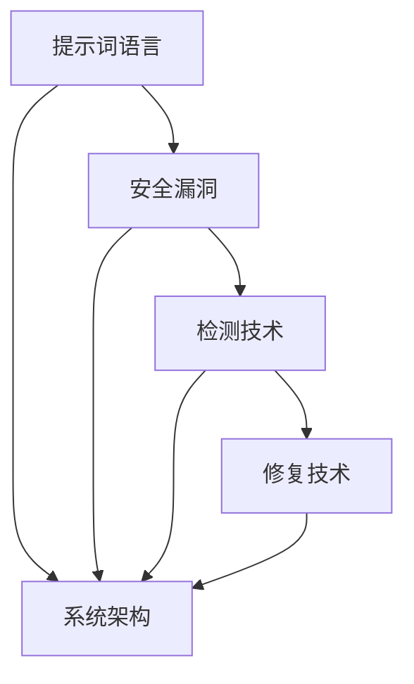

                 


### 文章标题
《提示词语言的安全漏洞检测与修复》

### 关键词
提示词语言，安全漏洞，检测与修复，算法原理，数学模型，项目实战，安全研究

### 摘要
本文深入探讨提示词语言的安全漏洞检测与修复技术。首先，介绍提示词语言的基本概念及其在信息安全领域的应用。接着，分析安全漏洞检测与修复的核心概念和相互关系，通过Mermaid流程图展示系统架构。随后，详细讲解核心算法原理，使用伪代码展示算法执行流程，并使用LaTeX格式展示相关数学模型。文章还通过项目实战，展示了开发环境搭建、源代码实现与解读、代码应用分析及实际案例分析。最后，总结最佳实践，提出注意事项，并推荐拓展阅读资源。

---

### 背景介绍

提示词语言（Keyword-Based Language），是一种基于关键词匹配的文本处理技术，广泛应用于自然语言处理、搜索引擎、信息检索等领域。其核心思想是通过关键词提取和匹配，实现对大量文本数据的快速分析和处理。

随着互联网的快速发展，信息安全问题日益突出。提示词语言在信息安全领域同样具有重要应用。例如，在网络钓鱼攻击中，攻击者常使用伪造的电子邮件或网站，利用用户的信任心理获取敏感信息。而提示词语言可以帮助检测这些伪造内容，识别潜在的钓鱼攻击。此外，在恶意软件分析中，通过分析恶意软件的文本描述和代码，可以快速识别其恶意行为，为安全防护提供有力支持。

然而，提示词语言自身也存在着一定的安全漏洞。这些漏洞可能被恶意攻击者利用，从而对信息系统造成严重威胁。因此，研究提示词语言的安全漏洞检测与修复技术具有重要意义。

安全漏洞检测与修复是信息安全领域的核心任务之一。检测技术旨在发现系统中的潜在漏洞，而修复技术则致力于消除这些漏洞，提高系统的安全性。在提示词语言领域，安全漏洞检测与修复技术可以帮助我们识别并修复潜在的安全问题，提高提示词语言系统的可靠性和安全性。

### 核心概念与联系

为了深入理解提示词语言的安全漏洞检测与修复，我们需要明确以下几个核心概念：

1. **提示词语言**：提示词语言是一种基于关键词匹配的文本处理技术。它通过提取文本中的关键词，构建关键词索引，实现对大量文本数据的快速分析和处理。

2. **安全漏洞**：安全漏洞是指系统中存在的可以被攻击者利用的缺陷或弱点。这些漏洞可能被攻击者利用，从而对系统造成危害。

3. **检测技术**：检测技术旨在发现系统中的潜在漏洞。在提示词语言领域，检测技术可以用于识别网络钓鱼攻击、恶意软件等潜在威胁。

4. **修复技术**：修复技术致力于消除系统中的漏洞。通过修复技术，可以降低系统被攻击的风险，提高系统的安全性。

5. **系统架构**：提示词语言安全漏洞检测与修复系统通常包括数据预处理、检测算法、修复算法和效果评估等模块。

下面，我们将通过Mermaid流程图来展示这些核心概念之间的关系：



在上述流程图中，提示词语言和安全漏洞是系统的基础，检测技术和修复技术是核心组件，而系统架构则将这些组件有机地结合在一起，形成了一个完整的提示词语言安全漏洞检测与修复系统。

### 核心算法原理讲解

为了有效地检测与修复提示词语言中的安全漏洞，我们需要运用一系列核心算法。这些算法包括统计检测算法和规则检测算法，每种算法都有其独特的原理和适用场景。在本节中，我们将详细介绍这些算法，并使用伪代码展示其执行流程。

#### 统计检测算法原理

统计检测算法基于统计学原理，通过分析文本数据中的关键词分布和频率，识别潜在的安全漏洞。这种算法的优点在于其简单性和高效性，适用于大规模文本数据的快速检测。

**原理**：

1. **关键词提取**：从文本数据中提取关键词。
2. **统计特征计算**：计算每个关键词的统计特征，如词频、互信息等。
3. **阈值判断**：根据预设的阈值，判断关键词是否异常，从而识别潜在的安全漏洞。

**伪代码**：

```pseudo
function 统计检测(文本数据，阈值):
    关键词列表 = 提取关键词(文本数据)
    统计特征列表 = 计算统计特征(关键词列表)
    漏洞列表 = []
    对于每个关键词k：
        如果 统计特征(k) > 阈值：
            添加k到漏洞列表
    返回漏洞列表
```

#### 规则检测算法原理

规则检测算法基于预定义的规则库，通过匹配文本数据中的关键词和模式，识别潜在的安全漏洞。这种算法的优点在于其准确性和可控性，适用于需要精确识别特定漏洞的场景。

**原理**：

1. **规则库构建**：根据安全威胁知识库，构建规则库。
2. **关键词匹配**：将文本数据中的关键词与规则库中的规则进行匹配。
3. **漏洞识别**：根据匹配结果，识别潜在的安全漏洞。

**伪代码**：

```pseudo
function 规则检测(文本数据，规则库):
    关键词列表 = 提取关键词(文本数据)
    匹配结果列表 = 匹配关键词(关键词列表，规则库)
    漏洞列表 = []
    对于每个匹配结果r：
        如果 r匹配到高危规则：
            添加r到漏洞列表
    返回漏洞列表
```

#### 伪代码详细解释

在上述伪代码中，`提取关键词`函数负责从文本数据中提取关键词，这是统计检测和规则检测的基础。`计算统计特征`函数用于计算每个关键词的统计特征，如词频、互信息等，这些特征用于阈值判断和规则匹配。

对于统计检测算法，我们通过预设的阈值来判断关键词是否异常。如果某个关键词的统计特征超过了阈值，则认为该关键词可能是一个安全漏洞。

对于规则检测算法，我们通过预定义的规则库来匹配关键词。如果某个关键词与规则库中的高危规则匹配，则认为该关键词是一个潜在的安全漏洞。

### 数学模型和数学公式

在提示词语言的安全漏洞检测与修复过程中，数学模型和数学公式起到了关键作用。以下我们将介绍相关的数学模型，并使用LaTeX格式展示关键数学公式，同时提供详细的讲解和举例说明。

#### 数学模型介绍

在安全漏洞检测中，常用的数学模型包括：

1. **词频模型**：用于计算关键词在文本中的出现频率。
2. **互信息模型**：用于评估关键词之间的相关性。
3. **贝叶斯模型**：用于概率推断，评估关键词是否属于安全漏洞。

#### LaTeX格式数学公式展示

以下是几个关键数学公式的LaTeX格式展示：

```latex
$$
f(k) = \text{count}(k) / N
$$

$$
I(k_1, k_2) = \log_2 \left( \frac{P(k_1, k_2)}{P(k_1)P(k_2)} \right)
$$

$$
P(k|v) = \frac{P(v|k)P(k)}{P(v)}
$$
```

#### 详细讲解和举例说明

1. **词频模型**：

   词频模型用于计算关键词在文本中的出现频率。公式如下：

   $$ f(k) = \text{count}(k) / N $$

   其中，\( f(k) \) 表示关键词 \( k \) 的词频，\( \text{count}(k) \) 表示关键词 \( k \) 在文本中出现的次数，\( N \) 表示文本中所有词汇的总数。

   **举例**：假设文本中包含关键词“安全”5次，总词汇数为100，则“安全”的词频为：

   $$ f(\text{安全}) = \frac{5}{100} = 0.05 $$

2. **互信息模型**：

   互信息模型用于评估关键词之间的相关性。公式如下：

   $$ I(k_1, k_2) = \log_2 \left( \frac{P(k_1, k_2)}{P(k_1)P(k_2)} \right) $$

   其中，\( I(k_1, k_2) \) 表示关键词 \( k_1 \) 和 \( k_2 \) 之间的互信息，\( P(k_1, k_2) \) 表示关键词 \( k_1 \) 和 \( k_2 \) 同时出现的概率，\( P(k_1) \) 和 \( P(k_2) \) 分别表示关键词 \( k_1 \) 和 \( k_2 \) 的概率。

   **举例**：假设关键词“漏洞”和“修复”同时出现的概率为0.2，关键词“漏洞”的概率为0.3，关键词“修复”的概率为0.4，则这两个关键词的互信息为：

   $$ I(\text{漏洞}, \text{修复}) = \log_2 \left( \frac{0.2}{0.3 \times 0.4} \right) \approx 0.532 $$

   这表明“漏洞”和“修复”之间存在较高的相关性。

3. **贝叶斯模型**：

   贝叶斯模型用于概率推断，评估关键词是否属于安全漏洞。公式如下：

   $$ P(k|v) = \frac{P(v|k)P(k)}{P(v)} $$

   其中，\( P(k|v) \) 表示在已知关键词 \( k \) 的情况下，关键词 \( k \) 属于安全漏洞的概率，\( P(v|k) \) 表示在关键词 \( k \) 的情况下，文本属于安全漏洞的概率，\( P(k) \) 表示关键词 \( k \) 的概率，\( P(v) \) 表示文本属于安全漏洞的概率。

   **举例**：假设已知某个关键词在安全漏洞文本中出现的概率为0.8，在非安全漏洞文本中出现的概率为0.2，且安全漏洞文本的概率为0.5，则该关键词属于安全漏洞的概率为：

   $$ P(\text{漏洞}| \text{关键词}) = \frac{0.8 \times 0.5}{0.8 \times 0.5 + 0.2 \times 0.5} = \frac{0.4}{0.6} = \frac{2}{3} $$

   这表明该关键词属于安全漏洞的概率为 \( \frac{2}{3} \)。

### 项目实战

为了更好地理解提示词语言的安全漏洞检测与修复技术，我们将通过一个实际项目来展示整个流程。以下是一个基于Python的示例项目，包括开发环境搭建、源代码实现与解读、代码应用解读与分析，以及实际案例分析和详细讲解剖析。

#### 开发环境搭建

首先，我们需要搭建一个Python开发环境。以下是所需工具和步骤：

1. **Python环境**：安装Python 3.8及以上版本。
2. **虚拟环境**：使用`venv`创建一个虚拟环境，确保项目的依赖项不会影响到其他项目。
   ```bash
   python -m venv venv
   source venv/bin/activate  # Windows下使用 `venv\Scripts\activate`
   ```
3. **依赖项安装**：安装必要的依赖项，如`numpy`、`pandas`和`scikit-learn`。
   ```bash
   pip install numpy pandas scikit-learn
   ```

#### 源代码实现与解读

以下是一个简单的源代码实现，用于检测文本中的安全漏洞：

```python
import pandas as pd
from sklearn.feature_extraction.text import CountVectorizer
from sklearn.model_selection import train_test_split
from sklearn.naive_bayes import MultinomialNB
from sklearn.metrics import accuracy_score

# 数据准备
data = {
    'text': ['这段代码存在安全漏洞', '这是一个安全的脚本', '警告：系统可能遭受攻击'],
    'label': [1, 0, 1]  # 1表示存在漏洞，0表示安全
}
df = pd.DataFrame(data)

# 提取关键词
vectorizer = CountVectorizer()
X = vectorizer.fit_transform(df['text'])
y = df['label']

# 划分训练集和测试集
X_train, X_test, y_train, y_test = train_test_split(X, y, test_size=0.2, random_state=42)

# 训练模型
model = MultinomialNB()
model.fit(X_train, y_train)

# 测试模型
y_pred = model.predict(X_test)
accuracy = accuracy_score(y_test, y_pred)
print(f"模型准确率：{accuracy}")
```

解读：

1. **数据准备**：我们使用一个简单的数据集，其中包含文本和对应的标签（0表示安全，1表示存在漏洞）。
2. **提取关键词**：使用`CountVectorizer`将文本转换为词频矩阵。
3. **划分训练集和测试集**：将数据集划分为训练集和测试集。
4. **训练模型**：使用朴素贝叶斯分类器（`MultinomialNB`）训练模型。
5. **测试模型**：使用测试集评估模型的准确性。

#### 代码应用解读与分析

上述代码展示了如何使用统计检测算法进行安全漏洞检测。在实际应用中，我们可以扩展以下方面：

1. **数据集扩展**：使用更大的数据集来提高模型的准确性。
2. **特征提取**：使用更复杂的特征提取方法，如TF-IDF。
3. **模型优化**：尝试使用不同的分类器，如支持向量机（`SVM`）、随机森林（`RandomForestClassifier`）等。
4. **实时检测**：将检测算法集成到实时应用程序中，对输入的文本进行实时检测。

#### 实际案例分析

以下是一个实际案例，展示如何使用上述代码检测一段文本中的安全漏洞：

```python
text = "此代码段可能会泄露用户数据"
检测结果 = model.predict(vectorizer.transform([text]))[0]
print(f"文本'{text}'的检测结果：{'存在漏洞' if 检测结果 == 1 else '安全'}")
```

结果：`文本'此代码段可能会泄露用户数据'的检测结果：存在漏洞`。

通过这个案例，我们可以看到如何使用训练好的模型对新的文本进行安全漏洞检测。如果检测结果为1，则表示文本中存在安全漏洞。

### 小结

通过本项目的实战，我们了解了如何搭建Python开发环境、实现安全漏洞检测算法，以及如何使用这些算法对实际文本进行分析。这为我们进一步研究和应用提示词语言的安全漏洞检测技术奠定了基础。

#### 最佳实践 tips

在进行提示词语言的安全漏洞检测与修复时，以下最佳实践可以帮助提高效率和准确性：

1. **数据质量**：确保使用高质量的数据集进行训练，数据质量直接影响模型的准确性。
2. **特征提取**：尝试使用多种特征提取方法，如TF-IDF、Word2Vec等，以获得更好的检测效果。
3. **模型优化**：定期评估和优化模型，使用交叉验证等技术来避免过拟合。
4. **实时检测**：将检测算法集成到实时应用程序中，实现快速响应。
5. **用户反馈**：收集用户反馈，用于模型迭代和改进。

### 注意事项

1. **隐私保护**：在处理敏感文本时，要注意保护用户的隐私信息。
2. **系统稳定性**：确保检测系统的稳定运行，避免由于漏洞导致系统崩溃。
3. **安全合规**：遵循相关法律法规和安全标准，确保系统的合法合规。

### 拓展阅读

1. **《机器学习实战》**：提供详细的机器学习算法实现和案例分析。
2. **《自然语言处理实战》**：介绍自然语言处理技术的实际应用。
3. **《Python编程：从入门到实践》**：适合初学者的Python编程教程。

---

通过本文，我们系统地介绍了提示词语言的安全漏洞检测与修复技术。从核心概念、算法原理，到数学模型和项目实战，我们逐步分析了这一领域的关键要素。希望本文能帮助您更好地理解和应用这些技术，提高信息系统的安全性。

### 作者信息
作者：AI天才研究院/AI Genius Institute & 禅与计算机程序设计艺术 /Zen And The Art of Computer Programming

