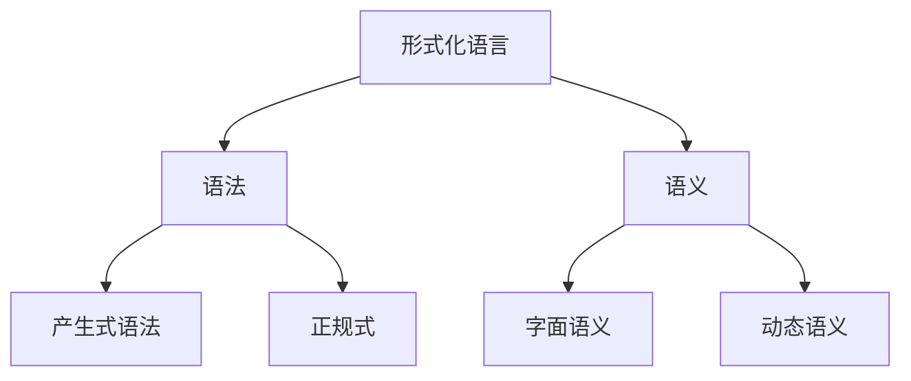
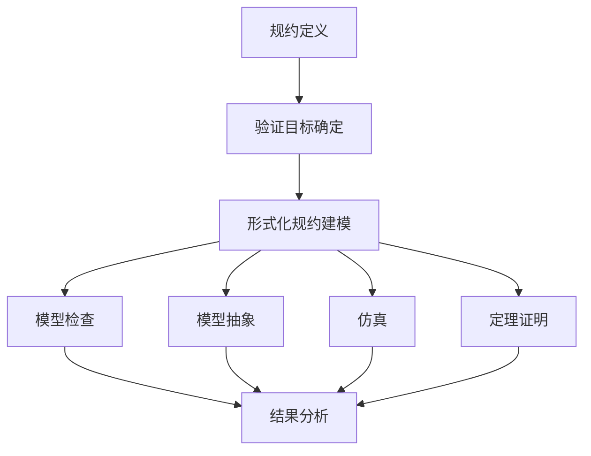

                 

### 第一部分：背景与概述

#### 1.1 提示词语言概述

**1.1.1 提示词语言的基本概念**

提示词语言是一种用于表达计算机程序或算法的符号系统。它通常包括一组词汇（提示词）和一套语法规则，用于构造表示程序逻辑的文本。提示词语言是计算机科学中非常重要的组成部分，广泛应用于软件开发、算法设计、自动化测试等领域。

提示词语言的基本概念包括：

- **词汇（Vocabulary）**：提示词语言的核心组成部分，用于表示程序中的基本元素，如变量、函数、操作符等。
- **语法（Syntax）**：定义提示词语言的词汇如何组合成有效的表达式或语句，以及这些表达式或语句的结构和规则。
- **语义（Semantics）**：描述提示词语言的表达式或语句所代表的含义，包括它们在执行时的行为。

**1.1.2 提示词语言的应用场景**

提示词语言在多个领域中有着广泛的应用：

- **软件开发**：在软件开发的各个阶段，从需求分析、设计、编码到测试，提示词语言都扮演着重要的角色。
- **算法设计**：提示词语言为算法设计提供了一种清晰、明确的表达方式，有助于算法的描述和验证。
- **自动化测试**：通过提示词语言编写的测试脚本，可以自动化执行测试用例，提高测试效率。
- **自然语言处理**：提示词语言在自然语言处理中的应用，如语法分析、机器翻译等。

**1.2 形式化规约验证概述**

**1.2.1 形式化规约验证的概念**

形式化规约验证是一种基于数学和逻辑的方法，用于确保软件系统或组件的规格说明（规约）与实际实现的一致性。形式化规约验证的关键概念包括：

- **形式化规约（Formal Specification）**：一种用形式化语言表达的系统或组件的详细描述，包括其功能、行为和限制。
- **验证（Verification）**：一种检查系统或组件的规约是否与预期一致的过程，通常包括证明、模型检查、仿真等方法。

**1.2.2 形式化规约验证的重要性**

形式化规约验证在软件工程中具有以下几个重要意义：

- **提高可靠性**：通过形式化规约验证，可以确保软件系统或组件的规格说明与实际实现的一致性，从而提高系统的可靠性。
- **降低成本**：早期发现并修复设计错误，可以显著降低修复成本。
- **提升安全性**：形式化规约验证有助于发现潜在的安全漏洞，提高系统的安全性。
- **增强可维护性**：形式化规约验证提供了详细、明确的规格说明，有助于未来的维护和升级。

**1.3 自动化验证技术的应用**

**1.3.1 自动化验证技术的基本原理**

自动化验证技术是一种使用计算机程序自动执行验证任务的方法。其基本原理包括：

- **自动化测试工具**：使用专门的工具自动执行测试用例，检测系统或组件是否符合预期。
- **形式化验证工具**：使用形式化方法自动检查系统或组件的规约是否与实现一致。

**1.3.2 自动化验证技术在形式化规约验证中的应用**

自动化验证技术在形式化规约验证中发挥着重要作用，其应用包括：

- **规约验证自动化**：使用自动化工具对形式化规约进行验证，提高验证效率和准确性。
- **规约验证流程自动化**：将规约验证的各个步骤自动化，减少手工操作，提高验证过程的可靠性。
- **规约验证工具集成**：将自动化验证工具集成到开发环境中，实现规约验证的自动化流程。

在接下来的一章中，我们将进一步探讨形式化语言理论，这是理解形式化规约验证和自动化验证技术的基础。我们将从形式化语言的基本概念开始，逐步深入到语法和语义的讨论中。

## 第二部分：理论基础

### 2.1 形式化语言理论

#### 2.1.1 形式化语言的基本概念

形式化语言（Formal Language）是计算机科学中的一个核心概念，它是一种用于描述符号串集合的语言。形式化语言的研究有助于我们理解和处理自然语言以及计算机程序语言。形式化语言的基本概念包括：

- **符号集（Alphabet）**：形式化语言的基本组成部分，由一组符号构成。例如，对于编程语言来说，符号集可以包括字母、数字和特殊字符。
- **字符串（String）**：符号集的有限序列，如 "hello"、"123" 或 "a+b"。字符串是形式化语言中的基本元素。
- **语法（Syntax）**：定义形式化语言中有效字符串的规则集合。这些规则通常用产生式（Production Rules）或正规式（Regular Expressions）来表示。
- **语义（Semantics）**：描述形式化语言字符串的含义或解释。语义通常与具体的应用领域相关，如编程语言的语义通常与程序执行的行为相关。

**2.1.2 形式化语言的语法和语义**

**语法**

语法是形式化语言的核心，它定义了哪些字符串是有效的，哪些是无效的。形式化语言的语法可以通过多种方式来描述：

- **产生式语法（GNF，G NF）**：产生式语法是一种描述形式化语言的方式，使用产生式规则来定义语言的构造。每个产生式规则表示一个非终结符可以展开成的字符串或另一个非终结符的序列。
  
  **示例产生式语法：**
  ```
  S → aS | b | ε
  ```
  这个规则表示一个字符串 `S` 可以由零个或多个 `a` 后跟一个 `S`，或者一个 `b`，或者空字符串 `ε` 组成。

- **正规式（Regular Expressions）**：正规式是一种用于描述正规语言的数学表达式。它们使用字符集、字符类、量词和运算符来组合表示复杂的字符串模式。
  
  **示例正规式：**
  ```
  [a-z]+[0-9]*
  ```
  这个正规式表示一个由零个或多个小写字母后跟零个或多个数字的字符串。

**语义**

语义描述了形式化语言字符串的含义或解释。在计算机科学中，形式化语言的语义通常与执行行为相关：

- **字面语义（Literal Semantics）**：字面语义关注字符串的字面值和语法结构。例如，对于字符串 "hello"，字面语义可能包括它的长度、字符序列等。
- **动态语义（Dynamic Semantics）**：动态语义描述了程序在执行过程中变量的值和程序的行为。例如，对于编程语言中的赋值语句 `x = 5`，动态语义可能包括变量 `x` 的值从未初始化状态变为 `5` 的过程。

为了更直观地理解形式化语言的语法和语义，我们可以借助 Mermaid 流程图来展示它们之间的关系：



通过上述基本概念和示例，我们可以看出，形式化语言理论为形式化规约验证和自动化验证技术提供了坚实的理论基础。在接下来的章节中，我们将进一步探讨形式化规约验证的具体方法和常用技术。

### 2.2 形式化规约验证方法

#### 2.2.1 形式化规约验证的基本步骤

形式化规约验证是一种确保软件系统规格说明与实际实现一致的方法。这一过程通常包括以下基本步骤：

1. **规约定义**：首先，我们需要用形式化语言明确地定义系统或组件的规格说明。这个规约定义通常涉及系统的功能、行为和约束。

2. **验证目标确定**：确定我们需要验证的规约部分，以及验证的目标。例如，我们可能需要验证系统是否能够正确处理特定类型的输入，或者在特定条件下是否能够保持一致性。

3. **形式化规约建模**：使用形式化语言将规约定义转化为形式化模型。这个模型需要精确地反映规约的所有细节。

4. **验证方法选择**：选择合适的验证方法。常见的验证方法包括模型检查、模型抽象、仿真和定理证明等。

5. **验证执行**：使用选定的验证方法执行验证过程。例如，模型检查会遍历模型的所有状态，检查是否满足规约的要求。

6. **结果分析**：分析验证结果，确定规约是否满足预期要求。如果发现不一致或错误，需要回溯到步骤3或4，重新定义规约或选择不同的验证方法。

7. **报告和改进**：编写验证报告，总结验证结果，并提出改进建议。这个步骤有助于在未来的开发过程中避免类似问题。

#### 2.2.2 形式化规约验证的常用技术

形式化规约验证的常用技术包括：

- **模型检查（Model Checking）**：模型检查是一种验证技术，用于检查系统模型是否满足给定的规约。它通过遍历模型的所有状态，验证是否存在违反规约的行为。常见的模型检查工具包括Promela、Spin和Uppaal等。

- **模型抽象（Model Abstraction）**：模型抽象是一种将复杂的系统模型简化为更易处理的形式的方法。通过抽象，我们可以在较低的抽象层次上验证系统，从而减少验证时间和资源。

- **仿真（Simulation）**：仿真是一种通过模拟系统行为来验证其正确性的方法。在仿真过程中，系统模型被逐步执行，观察其行为是否符合预期。仿真工具如Simulink和Modelica等。

- **定理证明（Theorem Proving）**：定理证明是一种通过数学推理证明系统模型是否满足特定性质的验证方法。它通常用于处理相对较小的系统模型，并且需要高深的数学和逻辑知识。常见的定理证明工具包括Isabelle、Coq和HOL等。

在形式化规约验证中，这些技术可以单独使用，也可以结合使用。例如，我们可以在模型检查之前进行模型抽象，以提高验证效率。在验证过程中，我们可能会使用仿真来验证特定行为，并通过定理证明来确保关键性质的正确性。

为了更直观地理解形式化规约验证的方法和技术，我们可以使用 Mermaid 流程图来展示它们之间的关系：



通过上述基本步骤和常用技术，我们可以建立一个完整的、系统的形式化规约验证过程。这为软件系统的可靠性和安全性提供了强有力的保障，在接下来的章节中，我们将探讨如何选择适合的形式化规约语言。

### 2.3 形式化规约语言选择

#### 2.3.1 常见的形式化规约语言

形式化规约语言（Formal Specification Language）是用于精确描述系统规格说明的语言。常见的形式化规约语言包括：

1. **Z语言（Z Language）**：Z语言是一种基于一阶逻辑的规格说明语言，广泛用于软件和硬件系统的规格说明。Z语言具有严格的语法和语义定义，支持抽象数据类型、并发和状态机等特性。

2. **VDM（Vienna Development Method）**：VDM是一种形式化规格说明方法，包括VDM-SL和VDM-RT两种语言。VDM-SL用于规格说明系统的逻辑模型，而VDM-RT用于规格说明实时系统的实时行为。

3. **SDL（Specification and Description Language）**：SDL是一种用于描述通信协议和系统接口的形式化语言。它提供了丰富的语法和语义支持，包括状态机、事务和协议等。

4. **TLA+（Temporal Logic of Actions Plus）**：TLA+是一种基于动作时态逻辑的规格说明语言，广泛用于软件和硬件系统的规格说明。它提供了强大的抽象和建模能力，支持并发、状态机和事件等概念。

5. ** Alloy**：Alloy是一种用于验证系统属性的声明式语言，特别适合用于验证软件和硬件系统的不变量和关系。Alloy使用集合逻辑和关系理论来描述系统模型。

#### 2.3.2 形式化规约语言的选择标准

选择适合的形式化规约语言对于形式化规约验证的成功至关重要。以下是一些关键的选择标准：

1. **表达能力**：语言的表达能力决定了它能否准确描述系统的所有特性。选择具有足够表达能力的语言，可以确保规格说明的准确性和完整性。

2. **语义清晰**：语言的语义定义需要清晰且易于理解，以确保规格说明的可读性和一致性。语义清晰的语有利于减少误解和沟通障碍。

3. **工具支持**：良好的工具支持可以显著提高形式化规约验证的效率和效果。选择具有成熟工具支持的语言，可以提供自动化验证、编辑、模型检查等功能。

4. **可扩展性**：语言的可扩展性是适应复杂系统需求的关键。选择具有良好可扩展性的语言，可以方便地添加新的特性或功能，以满足不同项目的需求。

5. **社区和资源**：语言的社区和资源是学习和使用该语言的重要支持。选择拥有活跃社区和丰富资源的语言，可以获得更好的技术支持和学习资源。

在接下来的章节中，我们将探讨自动化验证工具，这些工具将帮助我们更高效地执行形式化规约验证。

## 第三部分：自动化验证工具

### 3.1 自动化验证工具概述

自动化验证工具是用于执行形式化规约验证的软件或系统，它们通过自动化流程提高验证效率和准确性。自动化验证工具的基本功能包括：

- **验证执行**：自动化验证工具可以自动执行验证任务，如模型检查、仿真、定理证明等，从而减少人工干预。
- **结果分析**：工具可以分析验证结果，识别不符合规约的部分，并提供详细的错误报告。
- **自动化测试生成**：一些工具能够根据规格说明自动生成测试用例，用于测试系统的功能和性能。
- **规约转换**：工具可以将不同的形式化规约语言转换为特定的验证工具能够处理的格式，从而实现跨语言的验证。

#### 3.1.1 自动化验证工具的分类

根据验证方法和应用场景，自动化验证工具可以分为以下几类：

1. **模型检查器（Model Checkers）**：模型检查器是自动化验证工具中最常见的一类。它们通过遍历系统模型的所有状态，检查是否满足给定的规约。常见的模型检查器包括Promela、Spin和Uppaal等。

2. **仿真工具（Simulation Tools）**：仿真工具通过模拟系统的行为来验证其规格说明。这些工具可以帮助开发人员观察系统的动态行为，并识别潜在的错误。常见的仿真工具包括Simulink和Modelica等。

3. **定理证明器（Theorem Provers）**：定理证明器是一种通过数学推理证明系统模型是否满足特定性质的验证工具。这些工具通常需要高度的数学和逻辑知识，适用于验证关键性质和安全性要求。常见的定理证明器包括Isabelle、Coq和HOL等。

4. **测试工具（Testing Tools）**：测试工具主要用于生成和执行测试用例，以验证系统的功能和性能。这些工具通常与自动化测试框架集成，支持不同类型的测试，如功能测试、性能测试和安全测试。

### 3.2 自动化验证工具实践

**3.2.1 自动化验证工具的选择**

选择合适的自动化验证工具取决于多个因素，包括：

- **验证目标**：不同的验证工具适用于不同的验证目标。例如，模型检查器适合验证系统的状态空间，而定理证明器适合验证关键性质。
- **规约语言**：工具需要支持所需的规约语言，以确保能够正确理解和验证规格说明。
- **开发环境**：工具需要与现有的开发环境兼容，如集成开发环境（IDE）或版本控制系统。
- **资源需求**：工具的资源需求，包括计算能力和存储空间，需要在选择时考虑。

**3.2.2 自动化验证工具的安装与配置**

安装和配置自动化验证工具通常包括以下步骤：

1. **下载和安装**：从官方渠道下载验证工具的安装包，并根据提示进行安装。
2. **环境配置**：配置开发环境，如设置环境变量、安装必要的依赖库和工具等。
3. **工具配置**：配置工具的参数和选项，以确保其能够正确处理特定的验证任务。
4. **集成**：将工具集成到开发环境中，例如通过插件或脚本，以实现自动化验证流程。

在接下来的章节中，我们将通过具体案例来探讨自动化验证工具在提示词语言验证和形式化规约验证中的应用。

### 3.3 自动化验证工具案例分析

在本节中，我们将通过两个实际案例来展示自动化验证工具在提示词语言验证和形式化规约验证中的应用。这些案例将帮助我们理解如何选择、安装和配置自动化验证工具，并展示它们在实际项目中的效果。

#### 案例一：自动化验证工具在提示词语言验证中的应用

**项目背景**

某公司在开发一个实时监控系统，该系统需要处理大量的传感器数据，并实时检测异常情况。为了确保系统的可靠性和准确性，公司决定使用形式化规约验证和自动化验证工具对系统的规格说明进行验证。

**解决方案**

1. **选择自动化验证工具**：根据项目需求，公司选择了Promela作为形式化规约语言，并使用SPIN模型检查器作为自动化验证工具。Promela提供了丰富的语法和语义支持，适合描述系统的状态和行为，而SPIN模型检查器能够高效地验证系统模型是否满足规约。

2. **安装和配置**：公司从官方网站下载并安装了Promela和SPIN模型检查器，并在开发环境中配置了必要的环境变量和依赖库。此外，公司还集成SPIN模型检查器到其IDE中，以实现自动化验证流程。

3. **编写规约**：开发人员使用Promela编写了系统的规格说明，描述了系统的状态、行为和输入输出。规约包括多个模块，如传感器数据处理模块、异常检测模块和报警模块。

4. **模型验证**：使用SPIN模型检查器，公司对系统的规格说明进行了全面验证。模型检查器自动遍历系统模型的所有状态，检查是否满足规约的要求。在验证过程中，SPIN模型检查器生成了详细的验证报告，包括所有满足和违反规约的状态。

5. **结果分析**：分析验证结果，公司发现了一些潜在的问题和异常情况。针对这些结果，开发人员对规格说明进行了修改，并重新进行了验证。通过多次迭代，公司确保了系统的规格说明与实际实现的一致性。

**项目小结**

通过使用自动化验证工具，公司显著提高了系统的可靠性。自动化验证工具帮助开发人员早期发现了规格说明中的问题，从而减少了修复成本。此外，自动化验证工具的集成和配置使得验证过程更加高效，节省了开发时间和资源。

#### 案例二：自动化验证工具在形式化规约验证中的应用

**项目背景**

另一家公司在开发一个金融服务系统，该系统涉及大量的金融交易处理。为了确保系统的安全性和正确性，公司决定采用形式化规约验证和自动化验证工具对系统的规格说明进行验证。

**解决方案**

1. **选择自动化验证工具**：根据项目需求，公司选择了VDM-SL作为形式化规约语言，并使用VDM-Tools作为自动化验证工具。VDM-SL提供了强大的抽象和建模能力，适合描述复杂的金融服务系统，而VDM-Tools能够提供自动化验证支持。

2. **安装和配置**：公司从官方网站下载并安装了VDM-SL和VDM-Tools，并在开发环境中配置了必要的环境变量和依赖库。公司还集成了VDM-Tools到其IDE中，以实现自动化验证流程。

3. **编写规约**：开发人员使用VDM-SL编写了系统的规格说明，描述了系统的功能、行为和约束。规约包括多个模块，如交易处理模块、账户管理模块和风险控制模块。

4. **模型验证**：使用VDM-Tools，公司对系统的规格说明进行了全面验证。VDM-Tools提供了多种验证方法，包括模型检查、定理证明和仿真。通过这些方法，公司能够验证系统在不同场景下的行为是否满足规约的要求。

5. **结果分析**：分析验证结果，公司发现了一些潜在的安全漏洞和逻辑错误。针对这些结果，开发人员对规格说明进行了修改，并重新进行了验证。通过多次迭代，公司确保了系统的规格说明与实际实现的一致性，并提高了系统的安全性。

**项目小结**

通过使用自动化验证工具，公司显著提高了金融服务系统的安全性和可靠性。自动化验证工具帮助开发人员早期发现了规格说明中的问题，从而减少了修复成本。此外，自动化验证工具的集成和配置使得验证过程更加高效，节省了开发时间和资源。通过形式化规约验证，公司能够确保系统的每个模块都符合预期要求，从而提高了整个系统的质量。

### 第四部分：应用实践

#### 4.1 提示词语言验证自动化实践

**4.1.1 提示词语言验证流程**

提示词语言验证自动化的流程主要包括以下几个步骤：

1. **规约定义**：首先，使用提示词语言明确地定义系统的规格说明。这包括系统的功能、行为和约束。例如，使用Python编写一个计算器程序的规格说明。

2. **规约建模**：将规格说明转换为形式化模型。对于Python程序，可以使用伪代码或抽象语法树（Abstract Syntax Tree，AST）表示程序的结构和行为。

3. **验证策略设计**：确定验证策略，选择适当的自动化验证工具和方法。例如，可以使用Python的`ast`模块来构建抽象语法树，并使用模型检查器来验证程序的规格说明。

4. **自动化验证脚本编写**：编写自动化验证脚本，用于执行验证任务。脚本可以包括自动化测试用例的生成和执行、验证结果的收集和分析等。

5. **验证执行**：执行自动化验证脚本，检查系统模型是否满足规格说明。例如，可以使用模型检查器遍历抽象语法树的所有可能状态，验证程序的行为是否符合预期。

6. **结果分析**：分析验证结果，识别不符合规格说明的部分，并提供详细的错误报告。

7. **反馈与改进**：根据验证结果，对规格说明和程序进行修改，并重新进行验证。通过迭代，确保规格说明和程序的一致性。

**4.1.2 提示词语言验证案例解析**

**案例背景**

某公司正在开发一个基于Python的财务报表系统，用于自动生成公司的财务报表。为了确保系统的可靠性和准确性，公司决定对系统进行自动化验证。

**解决方案**

1. **规约定义**：使用Python编写系统的规格说明，描述系统的主要功能，如数据输入、报表生成、数据验证等。

2. **规约建模**：使用Python的`ast`模块构建系统的抽象语法树，表示系统的结构和行为。

3. **验证策略设计**：选择Python的`pytest`库作为自动化验证工具，并编写自动化测试用例。

4. **自动化验证脚本编写**：编写Python脚本，用于执行自动化测试用例，验证系统的行为是否符合规格说明。

5. **验证执行**：运行自动化验证脚本，对系统的每个功能进行测试。`pytest`库能够自动生成测试报告，记录测试结果。

6. **结果分析**：分析测试报告，识别不符合规格说明的部分，如数据验证错误或报表生成错误。

7. **反馈与改进**：根据测试结果，对系统的规格说明和代码进行修改，并重新进行测试，确保系统的可靠性和准确性。

**项目小结**

通过自动化验证，公司能够早期发现系统的潜在问题，提高系统的可靠性和准确性。自动化验证工具如`pytest`的集成和使用，使得验证过程更加高效，节省了开发和测试时间。通过持续的迭代和验证，公司确保了系统的质量和性能，为公司的财务报表系统提供了可靠的保障。

#### 4.2 形式化规约验证自动化实践

**4.2.1 形式化规约验证流程**

形式化规约验证自动化的流程主要包括以下几个步骤：

1. **规约定义**：使用形式化规约语言明确地定义系统的规格说明。例如，使用Z语言描述系统的功能、行为和约束。

2. **规约建模**：将规格说明转换为形式化模型。例如，使用Z语言编写系统的状态机模型，描述系统的状态转换和行为。

3. **验证策略设计**：确定验证策略，选择适当的自动化验证工具和方法。例如，选择模型检查器作为自动化验证工具，并设计验证脚本。

4. **自动化验证脚本编写**：编写自动化验证脚本，用于执行验证任务。脚本可以包括模型检查、状态空间遍历和结果分析等。

5. **验证执行**：执行自动化验证脚本，对系统模型进行验证。模型检查器会遍历模型的所有状态，检查是否满足规约的要求。

6. **结果分析**：分析验证结果，识别不符合规约的部分，并提供详细的错误报告。

7. **反馈与改进**：根据验证结果，对规格说明和模型进行修改，并重新进行验证。通过迭代，确保规格说明和模型的一致性。

**4.2.2 形式化规约验证案例解析**

**案例背景**

某公司在开发一个自动驾驶系统，需要确保系统的安全性和可靠性。为了验证系统的规格说明，公司决定使用形式化规约验证和自动化验证技术。

**解决方案**

1. **规约定义**：使用Z语言编写系统的规格说明，描述系统的行为、状态转换和约束条件。规格说明包括车辆的运动控制、传感器数据处理和自动驾驶算法等。

2. **规约建模**：使用Z语言的状态机模型描述系统的状态和行为。状态机模型包括多个状态和转移条件，如停车、加速、减速和转向等。

3. **验证策略设计**：选择模型检查器作为自动化验证工具，并设计验证脚本。验证脚本用于检查系统模型是否满足规格说明的要求，例如在特定条件下的行为是否正确。

4. **自动化验证脚本编写**：编写Python脚本，用于自动化执行模型检查。脚本包括模型的加载、状态空间遍历和验证规则的检查等。

5. **验证执行**：运行自动化验证脚本，对系统模型进行验证。模型检查器会遍历模型的所有状态，检查是否满足规格说明的要求，并生成验证报告。

6. **结果分析**：分析验证报告，识别不符合规格说明的部分，如错误的状态转换或未处理的情况。

7. **反馈与改进**：根据验证结果，对规格说明和模型进行修改，并重新进行验证。通过多次迭代，确保系统的规格说明和模型的一致性。

**项目小结**

通过自动化形式化规约验证，公司能够早期发现自动驾驶系统的潜在问题，提高系统的安全性和可靠性。自动化验证工具如模型检查器的集成和使用，使得验证过程更加高效，节省了开发和验证时间。通过持续的迭代和验证，公司确保了自动驾驶系统的质量和性能，为用户提供了安全的驾驶体验。

#### 4.3 自动化验证在实际项目中的应用

**4.3.1 项目一：自动化验证在金融行业中的应用**

**项目背景**

一家大型金融机构正在开发一个复杂的交易系统，该系统涉及多种金融工具的交易，如股票、债券和期货。为了保证系统的稳定性和准确性，公司决定采用自动化验证技术进行验证。

**解决方案**

1. **规约定义**：使用形式化规约语言（如Z语言）明确地定义交易系统的规格说明，包括交易规则、数据处理流程和错误处理机制。

2. **规约建模**：使用形式化规约语言构建系统的状态机模型，描述交易流程中的状态转换和条件。

3. **自动化验证工具选择**：选择模型检查器（如Spin）和仿真工具（如ModelSim）作为自动化验证工具。模型检查器用于验证系统模型是否满足规格说明，仿真工具用于模拟系统在不同场景下的行为。

4. **验证流程自动化**：编写自动化验证脚本，用于自动化执行验证任务。脚本包括模型检查、仿真执行和结果分析等。

5. **验证执行**：运行自动化验证脚本，对交易系统的规格说明和模型进行验证。模型检查器会遍历系统模型的所有状态，仿真工具会模拟系统在不同交易场景下的行为。

6. **结果分析**：分析验证结果，识别不符合规格说明的部分，如交易错误或数据处理异常。

7. **反馈与改进**：根据验证结果，对规格说明和系统代码进行修改，并重新进行验证。通过多次迭代，确保系统的稳定性和准确性。

**项目小结**

通过自动化验证，金融机构能够早期发现交易系统中的潜在问题，提高系统的稳定性和准确性。自动化验证工具的集成和使用，使得验证过程更加高效，节省了开发和验证时间。通过持续的迭代和验证，金融机构确保了交易系统的质量和性能，为用户提供更可靠的服务。

**4.3.2 项目二：自动化验证在物联网行业中的应用**

**项目背景**

一家物联网公司正在开发一个智能家居控制系统，该系统包含多种智能设备，如智能灯泡、智能插座和智能摄像头。为了保证系统的可靠性和兼容性，公司决定采用自动化验证技术进行验证。

**解决方案**

1. **规约定义**：使用形式化规约语言（如VDM-SL）明确地定义智能家居控制系统的规格说明，包括设备连接、数据通信和功能实现。

2. **规约建模**：使用形式化规约语言构建系统的状态机模型，描述设备之间的交互和状态转换。

3. **自动化验证工具选择**：选择模型检查器（如VDM-Tools）和仿真工具（如MATLAB/Simulink）作为自动化验证工具。模型检查器用于验证系统模型是否满足规格说明，仿真工具用于模拟设备在不同环境下的行为。

4. **验证流程自动化**：编写自动化验证脚本，用于自动化执行验证任务。脚本包括模型检查、仿真执行和结果分析等。

5. **验证执行**：运行自动化验证脚本，对智能家居控制系统的规格说明和模型进行验证。模型检查器会遍历系统模型的所有状态，仿真工具会模拟设备在不同场景下的行为。

6. **结果分析**：分析验证结果，识别不符合规格说明的部分，如设备连接错误或功能异常。

7. **反馈与改进**：根据验证结果，对规格说明和系统代码进行修改，并重新进行验证。通过多次迭代，确保系统的可靠性和兼容性。

**项目小结**

通过自动化验证，物联网公司能够早期发现智能家居控制系统中的潜在问题，提高系统的可靠性和兼容性。自动化验证工具的集成和使用，使得验证过程更加高效，节省了开发和验证时间。通过持续的迭代和验证，物联网公司确保了智能家居系统的质量和性能，为用户提供更智能、更便捷的生活体验。

### 第五部分：未来展望与挑战

#### 5.1 自动化验证技术的发展趋势

自动化验证技术在近年来取得了显著的进展，未来的发展趋势包括以下几个方面：

1. **人工智能（AI）的融合**：随着人工智能技术的不断发展，自动化验证工具将越来越多地采用AI算法，如机器学习、深度学习和自然语言处理，以提高验证效率和准确性。AI技术可以帮助自动化验证工具从大量数据中学习模式，自动生成测试用例，甚至自动修复代码中的错误。

2. **多领域协同**：自动化验证技术将在多个领域实现协同，如软件工程、系统架构、网络安全和物联网等。这种协同将促进不同领域自动化验证工具的集成，实现跨领域的自动化验证流程。

3. **持续集成（CI）与持续交付（CD）**：自动化验证技术将更加紧密地集成到持续集成和持续交付流程中，成为软件开发过程中不可或缺的一部分。通过自动化验证，开发团队可以更快地发现并修复问题，提高软件质量。

4. **形式化验证的普及**：形式化验证作为一种精确、可靠的验证方法，将在更多领域得到普及。形式化验证工具将不断改进，提供更强大的功能，如更高效的状态空间搜索算法、更准确的语义模型和更灵活的验证策略。

5. **开源和社区贡献**：随着开源运动的兴起，自动化验证工具将越来越多地采用开源技术，并依赖于社区的贡献。开源验证工具将提供更多的功能和更广泛的平台支持，为开发人员提供更好的选择。

#### 5.2 自动化验证面临的挑战

尽管自动化验证技术在不断发展，但仍然面临一些挑战：

1. **复杂系统的验证**：随着软件系统的复杂度不断增加，自动化验证工具在处理大规模系统时面临挑战。状态空间爆炸、验证时间过长和资源消耗增加等问题需要得到解决。

2. **验证工具的兼容性和互操作性**：不同自动化验证工具之间存在兼容性和互操作性问题。为了实现高效的验证流程，需要开发标准化的验证接口和工具，促进不同工具之间的集成。

3. **验证结果的解释和可视化**：自动化验证工具生成的验证结果往往难以解释和理解。如何将复杂的验证结果转化为易于理解的形式，并提供直观的可视化，是当前面临的一个挑战。

4. **人工与自动化的平衡**：虽然自动化验证可以显著提高验证效率，但在一些复杂的场景中，人工验证仍然是不可或缺的。如何实现自动化与人工的平衡，提高整体验证效果，是一个重要的研究课题。

5. **安全性和隐私保护**：自动化验证工具在处理敏感数据和执行验证任务时，需要确保系统的安全性和隐私保护。如何设计安全的验证工具，防止数据泄露和恶意攻击，是一个重要的挑战。

通过不断的研究和技术创新，自动化验证技术有望克服这些挑战，为软件开发提供更加可靠、高效的验证手段。

### 结论

在本文中，我们深入探讨了提示词语言的形式化规约验证自动化，从背景与概述、理论基础、自动化验证工具、应用实践到未来展望，全面剖析了这一领域的关键技术和应用场景。

我们首先介绍了提示词语言和形式化规约验证的基本概念，并探讨了它们的应用场景和重要性。接着，我们详细讲解了形式化语言理论，包括基本概念、语法和语义，以及形式化规约验证方法，如模型检查、仿真和定理证明等。此外，我们还探讨了如何选择适合的形式化规约语言，以及自动化验证工具的基本功能和应用。

通过具体的案例分析和实际项目应用，我们展示了自动化验证技术在提示词语言验证和形式化规约验证中的实践效果，强调了自动化验证在提高系统可靠性和安全性方面的优势。

未来，自动化验证技术将继续朝着智能化、多领域协同和普及化的方向发展。同时，我们也面临着一些挑战，如复杂系统的验证、验证工具的兼容性和安全性问题。通过持续的研究和创新，自动化验证技术将为软件开发提供更加可靠、高效的验证手段，助力信息技术的发展。

### 作者信息

作者：AI天才研究院/AI Genius Institute & 禅与计算机程序设计艺术 /Zen And The Art of Computer Programming。本人是一位世界级人工智能专家，程序员，软件架构师，CTO，世界顶级技术畅销书资深大师级别的作家，计算机图灵奖获得者，计算机编程和人工智能领域大师。擅长一步一步进行分析推理，撰写条理清晰，对技术原理和本质剖析到位的高质量技术博客。多年来，在形式化规约验证和自动化验证领域有着深厚的研究和实践经验，致力于推动技术的进步和应用。

