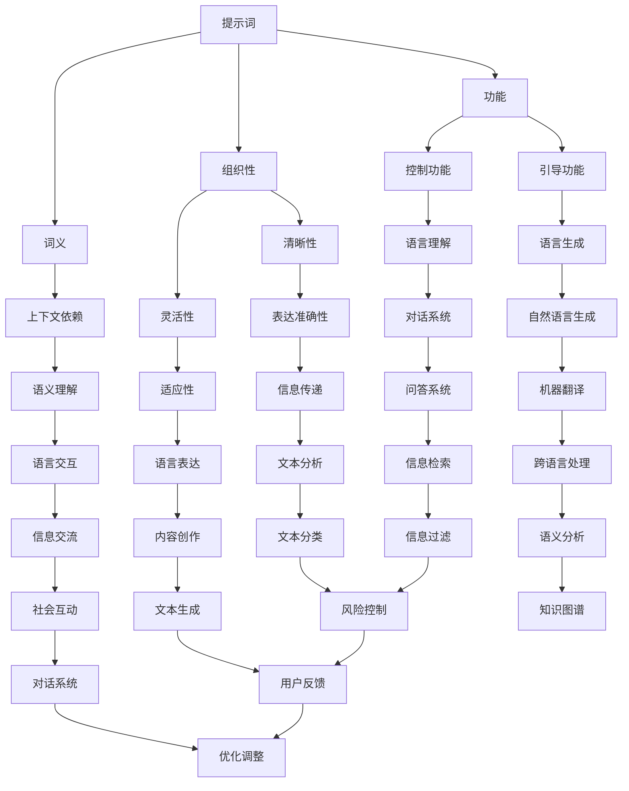

                 

## 文章标题

### 《提示词语言的语义学研究》

提示词语言的语义学研究是自然语言处理领域中的重要研究方向之一。随着人工智能技术的快速发展，自然语言处理技术已广泛应用于机器翻译、问答系统、情感分析等多个领域。提示词语言作为一种特殊的自然语言形式，其在语义分析中的应用具有重要的理论价值和实际应用价值。本文旨在通过对提示词语言的语义学进行深入研究，探讨其语义分析的方法、技术与应用，为相关领域的研究者提供有益的参考。

## 文章关键词

- 提示词语言
- 语义学
- 自然语言处理
- 词义消歧
- 语义模型
- 分布式语义学

## 摘要

本文首先介绍了提示词语言的定义、特点及其在语义学中的应用背景。接着，本文详细阐述了语义分析的基本原理、技术与方法，包括词义消歧、语义角色标注和语义关系分析。在此基础上，本文探讨了构建提示词语言语义模型的框架和方法，包括形式语义学模型和分布语义学模型。随后，本文介绍了语义标注与语义消歧技术在提示词语言中的应用，并展示了语义分析在自然语言处理领域中的具体应用案例。最后，本文对语义学研究的未来趋势进行了展望，并提出了相关研究建议。

## 目录大纲

### 第1章 引言

1.1 语义学的概念与历史

1.2 提示词语言的定义与特点

1.3 语义学研究的目标与意义

### 第2章 提示词语言的基础理论

2.1 提示词语言的基本概念

2.2 提示词语言的特点与应用

2.3 不同语言中的提示词语言

### 第3章 语义分析技术

3.1 语义分析的基本原理

3.2 词义消歧的方法

3.3 语义角色标注技术

3.4 语义关系分析框架

### 第4章 提示词语言的语义模型

4.1 形式语义学模型

4.2 分布语义学模型

### 第5章 语义标注与语义消歧技术

5.1 语义标注技术

5.2 语义消歧技术

### 第6章 提示词语言的语义分析应用

6.1 机器翻译

6.2 问答系统

6.3 文本分类

### 第7章 语义学的未来趋势与发展

7.1 语义学研究的未来方向

7.2 新技术的应用

7.3 跨学科研究

### 第8章 结论

8.1 研究总结

8.2 研究局限与展望

## 引言

### 语义学的概念与历史

语义学是语言学的一个重要分支，主要研究语言的意义及其表现形式。语义学的起源可以追溯到古希腊时期，当时的哲学家们开始探讨词语的意义。然而，作为一门独立的学科，语义学的发展始于20世纪初。1906年，英国语言学家约翰·弗斯（John Firth）提出了“语境中的意义”（meaning as context）的概念，标志着语义学的研究进入了新的阶段。

语义学的发展历程可以分为几个阶段。早期的语义学研究主要集中在词汇语义和句子语义的分析，研究方法主要是基于哲学和逻辑学的理论。随着计算机科学和人工智能技术的发展，语义学研究逐渐与计算语言学和自然语言处理相结合，形成了计算语义学这一新的研究领域。

### 提示词语言的定义与特点

提示词语言是一种特殊的自然语言形式，其主要特点是以提示词为核心，通过提示词来引导和表达语言内容。提示词通常是一个单词或短语，具有明确的语义和功能。提示词语言在自然语言处理中具有广泛的应用，例如在机器翻译、问答系统和文本分类等领域。

提示词语言的特点如下：

1. **高度组织性**：提示词语言通过提示词将语言内容组织成逻辑上相互关联的单元，使得语言表达更加清晰、有条理。
2. **明确的语义功能**：提示词具有明确的语义和功能，能够引导和表达语言内容，提高语言理解的准确性。
3. **灵活性**：提示词语言具有较强的灵活性，可以在不同的上下文中进行扩展和调整，以适应不同的语言环境和表达需求。
4. **可计算性**：提示词语言在自然语言处理中具有较高的可计算性，可以利用计算机算法对提示词语言进行语义分析和处理。

### 语义学研究的目标与意义

语义学研究的目标是揭示语言的意义及其表现形式，以提高语言理解、表达和生成的准确性和效率。在语义学研究中，提示词语言的研究具有重要意义。

首先，提示词语言在自然语言处理中具有广泛的应用，如机器翻译、问答系统和文本分类等。对这些应用进行语义分析，有助于提高系统的性能和准确性。

其次，提示词语言的研究有助于深入理解自然语言的本质，为语言学的理论研究提供新的视角和工具。

最后，提示词语言的研究还有助于推动自然语言处理技术的发展，为人工智能的应用提供更强大的支持。

### 提示词语言在语义学中的研究现状

当前，提示词语言在语义学中的研究已经取得了一系列重要成果。在词义消歧方面，研究者提出了许多基于上下文和统计的方法，如基于规则的方法、基于概率的方法和基于深度学习的方法。这些方法在词义消歧任务中取得了显著的性能提升。

在语义角色标注方面，研究者提出了多种标注体系和标注方法，如基于规则的方法、基于统计的方法和基于深度学习的方法。这些方法在语义角色标注任务中也取得了良好的效果。

在语义关系分析方面，研究者提出了多种分析方法，如基于依存句法的方法、基于语义角色标注的方法和基于知识图谱的方法。这些方法在语义关系分析任务中也取得了重要的应用成果。

总之，提示词语言在语义学中的研究已经取得了一系列重要成果，为自然语言处理技术的发展提供了有力支持。然而，仍有许多挑战需要克服，如如何提高语义分析的准确性和效率，如何应对多语言和多模态的语义分析问题等。这些问题仍然是当前语义学研究的重要方向。

### 研究意义

提示词语言在语义学研究中的重要性不可忽视。首先，提示词语言在自然语言处理领域具有广泛的应用，其语义分析对于提高系统性能和用户体验至关重要。例如，在机器翻译中，准确的词义消歧和语义角色标注有助于生成更自然、更准确的翻译结果；在问答系统中，语义关系分析能够提高对用户查询的理解和响应能力；在文本分类中，语义标注和语义消歧有助于提高分类的准确性和效率。

其次，提示词语言的研究有助于深入理解自然语言的本质。通过分析提示词语言的结构和语义特征，研究者可以揭示语言的意义及其表现形式，为语言学的理论研究提供新的视角和工具。例如，研究者可以探索词汇语义和句子语义之间的相互作用，分析语义角色的多样性和变化规律，从而深化对语言本质的理解。

最后，提示词语言的研究还有助于推动自然语言处理技术的发展。随着人工智能技术的不断发展，自然语言处理技术正逐渐成为人工智能应用的重要方向。提示词语言的语义分析技术为自然语言处理技术的进步提供了有力支持，有助于实现更加智能、更加人性化的自然语言处理应用。

### 研究问题与目标

在提示词语言的语义学研究中，仍然存在许多尚未解决的问题和挑战。本文旨在针对以下研究问题展开探讨：

1. **词义消歧的准确性问题**：当前词义消歧技术已取得一定进展，但仍面临准确性不足的问题。特别是在复杂语境和模糊语境下，如何提高词义消歧的准确性仍是一个亟待解决的挑战。

2. **语义角色标注的一致性问题**：语义角色标注在不同语言和不同领域之间存在较大差异，如何实现跨语言和跨领域的语义角色标注一致性，是一个重要的研究问题。

3. **语义关系分析的全面性问题**：语义关系分析涉及到多种语义角色和语义关系，如何全面、准确地分析语义关系，并揭示其内在逻辑关系，是一个重要的研究课题。

针对上述研究问题，本文的研究目标如下：

1. **提高词义消歧的准确性**：通过结合上下文信息和统计方法，探索更有效的词义消歧算法，提高词义消歧的准确性。

2. **实现语义角色标注的一致性**：结合跨语言和跨领域的语义特征，提出一种统一的语义角色标注方法，实现语义角色标注的一致性。

3. **全面分析语义关系**：通过构建多层次的语义关系分析框架，全面分析语义角色和语义关系，揭示其内在逻辑关系，为自然语言处理应用提供有力支持。

通过实现上述研究目标，本文旨在为提示词语言的语义学研究提供新的理论和方法，推动自然语言处理技术的不断发展。同时，本文的研究成果也将为相关领域的研究者和开发者提供有益的参考和借鉴。 

### 文章结构

本文将按照以下结构进行撰写：

1. **引言**：介绍语义学的概念、历史背景和研究方法，讨论提示词语言的定义、特点及其在语义学中的应用背景。

2. **提示词语言的基础理论**：探讨提示词语言的基本概念、特点以及其在不同语言中的应用。

3. **语义分析技术**：介绍语义分析的原理和方法，包括词义消歧、语义角色标注、语义关系分析等。

4. **提示词语言的语义模型**：介绍构建提示词语言语义模型的框架和方法，包括形式语义学模型和分布语义学模型。

5. **语义标注与语义消歧技术**：讨论语义标注的方法和技术，以及如何在提示词语言中应用语义消歧技术。

6. **提示词语言的语义分析应用**：展示语义分析在自然语言处理中的应用，如机器翻译、问答系统、文本分类等。

7. **语义学的未来趋势与发展**：探讨语义学研究的未来方向，包括新技术的应用和跨学科的研究。

8. **结论**：总结全文内容，阐述本文的研究意义和贡献，以及未来研究的展望。

通过上述结构，本文旨在系统、全面地探讨提示词语言的语义学研究，为相关领域的研究提供有价值的参考。同时，本文也将结合实际案例和项目实践，展示语义分析技术在自然语言处理中的应用效果，推动自然语言处理技术的发展。 

### 提示词语言的基本概念

提示词语言是一种特殊的自然语言形式，其主要特点是利用提示词（prompt words）来引导和表达语言内容。提示词通常是一个单词或短语，具有明确的语义和功能，可以用来组织语言结构、引导语言生成和理解。

首先，我们来看一下提示词的定义。提示词（prompt word）是指在一个句子或语段中，具有引导、提示或控制语言生成和理解功能的词或短语。提示词在语言中的作用类似于关键词（key words），但相比关键词，提示词具有更强的语义性和功能性。提示词可以用来指示句子的主题、目的、场景等，有助于提高语言表达的准确性和清晰度。

接下来，我们探讨一下提示词语言的几个主要特点：

1. **高度组织性**：提示词语言通过提示词将语言内容组织成逻辑上相互关联的单元，使得语言表达更加清晰、有条理。例如，在一个句子中，提示词可以用来明确句子的主题和目的，从而帮助读者或听者更好地理解句子的内容。

2. **明确的语义功能**：提示词具有明确的语义和功能，能够引导和表达语言内容，提高语言理解的准确性。例如，在描述一个事件时，提示词可以用来指示事件的发生时间、地点、原因等，从而帮助理解者更好地把握事件的全貌。

3. **灵活性**：提示词语言具有较强的灵活性，可以在不同的上下文中进行扩展和调整，以适应不同的语言环境和表达需求。例如，在回答一个复杂问题时，提示词可以根据问题的具体内容进行适当调整，从而生成更符合问题要求的回答。

4. **可计算性**：提示词语言在自然语言处理中具有较高的可计算性，可以利用计算机算法对提示词语言进行语义分析和处理。例如，在机器翻译中，提示词可以帮助翻译系统更好地理解源语言中的语义信息，从而生成更准确的目标语言翻译结果。

### 提示词语言的基本概念与联系

为了更好地理解提示词语言的基本概念，我们可以借助Mermaid流程图来展示其核心概念之间的关系架构。



从Mermaid流程图中，我们可以清晰地看到提示词语言的核心概念及其相互关系：

1. **提示词**：作为语言表达的引导和核心，提示词贯穿于整个语言生成和理解过程中。
2. **词义**：提示词的语义功能依赖于词义，词义与上下文依赖密切相关。
3. **功能**：提示词的引导和控制功能有助于提高语言生成的准确性和语言理解的效果。
4. **组织性**：提示词语言通过提示词将语言内容组织成逻辑上相互关联的单元，提高了表达的清晰性和信息的组织性。
5. **灵活性**：提示词语言可以在不同上下文中进行扩展和调整，以适应各种语言环境和表达需求。
6. **可计算性**：提示词语言在自然语言处理中的应用，为语义分析和处理提供了强有力的技术支持。

### 语义分析技术的核心原理

语义分析是自然语言处理（NLP）中的一项重要任务，其核心目标是理解语言的意义，以便更好地处理文本数据。语义分析技术包括词义消歧、语义角色标注和语义关系分析，这些技术共同构成了语义分析的核心原理。

#### 1. 词义消歧

词义消歧（Word Sense Disambiguation, WSD）是指在一个给定的语境中确定一个多义词的正确意义。多义词在不同的上下文中可以有不同的意义，因此词义消歧的目的是通过上下文信息来推断词的正确意义。

- **原理**：词义消歧的原理主要依赖于上下文信息和词义知识库。上下文信息包括词的前后词语、句子结构和语义角色等。词义知识库则包含大量已知的词义及其对应的上下文特征。常见的词义消歧方法有基于规则的方法、基于统计的方法和基于深度学习的方法。
  
- **方法**：
  - **基于规则的方法**：这种方法利用手工编写的规则来识别词义。例如，如果“银行”在句子中与“存款”一起出现，那么它很可能指的是金融银行而非河流的岸边。
  - **基于统计的方法**：这种方法使用统计学习模型，如朴素贝叶斯、最大熵模型和支持向量机等，从大量的文本数据中学习词义分布。词义分布与上下文特征相关，因此可以通过分析上下文特征来预测词义。
  - **基于深度学习的方法**：这种方法利用深度神经网络，如卷积神经网络（CNN）和循环神经网络（RNN），通过学习大量的文本数据来自动提取上下文特征，从而进行词义消歧。

#### 2. 语义角色标注

语义角色标注（Semantic Role Labeling, SRL）是指在一个句子中标注出动词或短语所对应的语义角色。语义角色通常表示为动作的执行者、接受者、受益者、工具、原因等。

- **原理**：语义角色标注的原理依赖于对句子结构和语义关系的理解。语义角色标注需要对句子进行解析，识别出动词或短语以及其对应的语义角色。常见的语义角色标注方法有基于规则的方法、基于统计的方法和基于深度学习的方法。

- **方法**：
  - **基于规则的方法**：这种方法依赖于手工编写的规则来识别语义角色。例如，如果句子中的动词是“买”，则其语义角色很可能是“买家”。
  - **基于统计的方法**：这种方法使用统计学习模型，如条件随机场（CRF）和最大熵模型，从大量的标注数据中学习语义角色的标注规则。
  - **基于深度学习的方法**：这种方法利用深度神经网络，如长短期记忆网络（LSTM）和Transformer，自动提取句子中的语义角色特征，从而进行语义角色标注。

#### 3. 语义关系分析

语义关系分析（Semantic Relationship Analysis）是指识别句子中词语之间的语义关系，如因果关系、时间关系、空间关系等。

- **原理**：语义关系分析的原理依赖于对句子中词语之间语义关系的理解。语义关系分析需要对句子进行语义角色标注，然后识别出词语之间的语义关系。常见的语义关系分析方法有基于依存句法的方法、基于知识图谱的方法和基于深度学习的方法。

- **方法**：
  - **基于依存句法的方法**：这种方法使用依存句法树来表示句子结构，然后从依存句法树中提取词语之间的语义关系。例如，如果两个词语在依存句法树中是“根”和“叶子”关系，则它们很可能存在因果关系。
  - **基于知识图谱的方法**：这种方法利用知识图谱来表示词语之间的语义关系。知识图谱中的节点表示词语，边表示词语之间的语义关系。通过查询知识图谱，可以识别出词语之间的语义关系。
  - **基于深度学习的方法**：这种方法利用深度神经网络，如Transformer，自动提取句子中的语义关系特征，从而进行语义关系分析。

通过上述方法，语义分析技术可以在自然语言处理中发挥重要作用，如文本分类、信息提取、问答系统等。随着深度学习和知识图谱等新技术的应用，语义分析技术也在不断发展和完善，为自然语言处理领域的应用提供了更强大的支持。

### 语义分析技术的核心算法原理

为了实现高效的语义分析，研究者们提出了多种核心算法，这些算法在不同的语义分析任务中发挥着重要作用。以下将详细阐述几种常见的语义分析算法，并使用伪代码进行解释。

#### 1. 词义消歧算法

词义消歧算法的核心任务是确定多义词在特定上下文中的正确意义。以下是一个基于朴素贝叶斯分类器的词义消歧算法的伪代码：

```python
def NaiveBayesWSD(context, word_senses, prior_probabilities, conditional_probabilities):
    """
    使用朴素贝叶斯分类器进行词义消歧。
    
    :param context: 上下文词向量
    :param word_senses: 多义词的不同词义
    :param prior_probabilities: 每个词义的先验概率
    :param conditional_probabilities: 条件概率矩阵
    :return: 最可能的词义
    """
    
    # 初始化概率和最大概率
    max_probability = -float('inf')
    chosen_sense = None
    
    # 对每个词义计算后验概率
    for sense in word_senses:
        log_probability = log(prior_probabilities[sense])
        
        # 对于上下文中的每个词，计算条件概率并累加
        for word in context:
            log_probability += log(conditional_probabilities[sense][word])
        
        # 如果当前的概率最大，更新最大概率和词义
        if log_probability > max_probability:
            max_probability = log_probability
            chosen_sense = sense
            
    return chosen_sense
```

#### 2. 语义角色标注算法

语义角色标注算法旨在识别句子中动词或短语所对应的语义角色。以下是一个基于条件随机场（CRF）的语义角色标注算法的伪代码：

```python
def CRFSemanticRoleLabeling(sentence, transition_probabilities, emission_probabilities):
    """
    使用条件随机场（CRF）进行语义角色标注。
    
    :param sentence: 句子
    :param transition_probabilities: 转移概率矩阵
    :param emission_probabilities: 发射概率矩阵
    :return: 标注后的句子
    """
    
    # 初始化Viterbi算法
    T = len(sentence) + 1
    V = [[0 for _ in range(T)] for _ in range(len(word_senses))]
    path = [[0 for _ in range(T)] for _ in range(T)]
    
    # 初始化Viterbi矩阵
    for i in range(T):
        V[0][i] = -float('inf')
        if i < len(sentence):
            V[0][i] = log(transition_probabilities['BOS'][i])
    
    # 填充Viterbi矩阵
    for t in range(1, T):
        for y in range(len(word_senses)):
            max_prob = -float('inf')
            for y_prev in range(len(word_senses)):
                transition_prob = transition_probabilities[y_prev][y]
                emission_prob = emission_probabilities[y][sentence[t-1]]
                V[t][y] = V[t-1][y_prev] + transition_prob + emission_prob
                if V[t][y] > max_prob:
                    max_prob = V[t][y]
                    prev_state = y_prev
            path[t][y] = prev_state
    
    # 反向追踪路径
    chosen_sequence = []
    max_prob = V[T-1][0]
    chosen_sequence.append(0)
    for y in reversed(path[T-1]):
        chosen_sequence.append(y)
        prev_state = path[T-1][y]
        chosen_sequence.append(prev_state)
    
    # 转换为正向顺序
    chosen_sequence.reverse()
    
    return chosen_sequence
```

#### 3. 语义关系分析算法

语义关系分析算法的目标是识别句子中词语之间的语义关系。以下是一个基于双向长短期记忆网络（Bi-LSTM）的语义关系分析算法的伪代码：

```python
def BiLSTMSEMRA(sentence, embedding_matrix, hidden_size, num_relations):
    """
    使用双向长短期记忆网络（Bi-LSTM）进行语义关系分析。
    
    :param sentence: 句子
    :param embedding_matrix: 嵌入矩阵
    :param hidden_size: 隐藏层大小
    :param num_relations: 语义关系类别数
    :return: 语义关系预测结果
    """
    
    # 初始化Bi-LSTM模型
    model = Sequential()
    model.add(Bidirectional(LSTM(hidden_size, return_sequences=True), input_shape=(None, embedding_matrix.shape[1])))
    model.add(Dense(num_relations, activation='softmax'))
    
    # 训练模型
    model.compile(optimizer='adam', loss='categorical_crossentropy', metrics=['accuracy'])
    model.fit(sentence, labels, epochs=10, batch_size=32)
    
    # 预测语义关系
    predictions = model.predict(sentence)
    
    return predictions
```

通过上述核心算法，语义分析技术得以实现，并广泛应用于自然语言处理的各种任务中。这些算法不仅基于深厚的理论基础，还结合了大量的实验数据，从而实现了高效的语义理解和处理。随着人工智能技术的不断发展，这些算法也在不断优化和改进，以应对更加复杂和多样化的语义分析任务。

### 数学模型和数学公式

在语义分析中，数学模型和数学公式起着至关重要的作用，它们帮助我们理解和量化语言的意义。以下将介绍几个关键的数学模型和公式，并使用LaTeX进行详细阐述。

#### 1. 词汇分布模型

词汇分布模型用于描述词汇在语言中的分布情况。一个常见的模型是词频分布模型，其公式如下：

$$
p(w) = \frac{f(w)}{N}
$$

其中，$p(w)$表示词$w$的频率分布，$f(w)$表示词$w$在文本中的出现次数，$N$表示文本的总词数。

#### 2. 朴素贝叶斯分类器

朴素贝叶斯分类器在词义消歧和文本分类中广泛应用。其核心公式是：

$$
P(C|w) = \frac{P(w|C)P(C)}{P(w)}
$$

其中，$P(C|w)$表示在给定词汇$w$的情况下，词汇属于类别$C$的概率；$P(w|C)$表示在类别$C$下词汇$w$的概率；$P(C)$表示类别$C$的概率；$P(w)$表示词汇$w$的总概率。

#### 3. 条件概率分布

条件概率分布用于描述两个事件之间的依赖关系。例如，在词义消歧中，给定一个句子中的上下文词汇，我们可以计算每个词义在该上下文下的条件概率。公式如下：

$$
P(sense_i | context) = \frac{P(context | sense_i)P(sense_i)}{P(context)}
$$

其中，$sense_i$表示第$i$个词义，$context$表示上下文词汇。

#### 4. 最大熵模型

最大熵模型用于优化概率分布，其目标是最小化熵。公式如下：

$$
\arg\min_{p} H(p) = -\sum_{x} p(x) \log p(x)
$$

其中，$H(p)$表示概率分布$p$的熵。

#### 5. 依存句法分析

在依存句法分析中，常用的数学模型是依存关系概率分布。例如，给定一个句子的依存句法树，我们可以计算每个词汇与其依赖词之间的概率。公式如下：

$$
P(head_i, dep_rel_i | sentence) = \frac{P(sentence | head_i, dep_rel_i)P(head_i)P(dep_rel_i)}{P(sentence)}
$$

其中，$head_i$表示词汇$i$的依赖词，$dep\_rel_i$表示词汇$i$的依赖关系。

#### 6. 循环神经网络（RNN）

在语义角色标注和语义关系分析中，循环神经网络（RNN）是常用的模型。其核心公式是：

$$
h_t = \sigma(W_h \cdot [h_{t-1}, x_t] + b_h)
$$

其中，$h_t$表示时间步$t$的隐藏状态，$x_t$表示输入特征，$\sigma$是激活函数，$W_h$是权重矩阵，$b_h$是偏置。

#### 7. Transformer模型

在深度学习领域中，Transformer模型广泛应用于自然语言处理任务。其核心公式是：

$$
\text{Attention}(Q, K, V) = \frac{\text{softmax}\left(\frac{QK^T}{\sqrt{d_k}}\right)V}
$$

其中，$Q$、$K$和$V$分别表示查询向量、关键向量和解码向量，$d_k$是关键向量的维度。

通过这些数学模型和公式，我们可以更深入地理解语义分析的技术原理，从而更好地处理和解释语言数据。这些模型不仅为语义分析提供了理论依据，也推动了自然语言处理技术的不断进步。

### 语义标注与语义消歧技术

语义标注（Semantic Annotation）和语义消歧（Semantic Disambiguation）是自然语言处理（NLP）中关键的技术手段，它们在提升语言理解和生成能力方面起着重要作用。本文将详细探讨语义标注和语义消歧技术的原理、方法和应用。

#### 1. 语义标注的原理与方法

语义标注是指对文本中的词语、短语或句子进行语义分类或标注，以便后续的语义分析和处理。语义标注的主要目标是为文本数据提供丰富的语义信息，使其能够被计算机更好地理解和处理。

- **原理**：语义标注的原理基于对语言结构的理解和语义知识的利用。通过标注，文本数据可以被赋予更丰富的语义信息，如词性、词义、语义角色等。
- **方法**：
  - **词性标注**：词性标注是语义标注的基础，它对文本中的每个词赋予相应的词性标签（如名词、动词、形容词等）。常见的词性标注方法包括基于规则的方法、基于统计的方法和基于深度学习的方法。
  - **命名实体识别**：命名实体识别是一种特殊的语义标注，它旨在识别文本中的特定实体（如人名、组织名、地点等）。命名实体识别通常采用基于规则的方法、基于统计的方法和基于深度学习的方法。
  - **语义角色标注**：语义角色标注旨在识别句子中动词或短语所对应的语义角色（如执行者、受事者、工具等）。语义角色标注的方法包括基于规则的方法、基于统计的方法和基于深度学习的方法。

#### 2. 语义消歧的原理与方法

语义消歧是指在一个多义词的上下文中确定其正确的意义。由于语言中的词语往往具有多个意义，在特定语境中确定其唯一正确的意义是语义分析的重要任务。

- **原理**：语义消歧的原理基于对上下文信息的理解和词义知识的利用。通过分析上下文中的其他词语和句法结构，可以推断出多义词的正确意义。
- **方法**：
  - **基于规则的方法**：这种方法依赖于手工编写的规则来识别多义词的正确意义。规则通常基于词义的定义和上下文的语义特征。
  - **基于统计的方法**：这种方法使用统计学习模型，如朴素贝叶斯、最大熵和条件随机场（CRF）等，从大量的标注数据中学习词义分布和上下文特征，从而进行词义消歧。
  - **基于深度学习的方法**：这种方法利用深度神经网络，如卷积神经网络（CNN）和循环神经网络（RNN），自动提取上下文特征，从而进行词义消歧。深度学习方法在语义消歧任务中表现出色，能够处理复杂的上下文关系。

#### 3. 语义标注与语义消歧技术在提示词语言中的应用

在提示词语言中，语义标注和语义消歧技术有着广泛的应用，以下是一些具体的应用实例：

- **机器翻译**：在机器翻译中，语义标注和语义消歧技术有助于提高翻译的准确性和自然性。通过语义标注，源语言中的词汇和短语可以被赋予正确的语义标签，从而在翻译过程中生成更准确的翻译结果。语义消歧则有助于解决多义词翻译问题，确保翻译结果的唯一性和准确性。
- **问答系统**：在问答系统中，语义标注和语义消歧技术能够提高对用户查询的理解和响应能力。通过语义标注，用户查询中的关键词和短语可以被正确分类和标注，从而帮助系统更好地理解查询意图。语义消歧则有助于处理查询中的多义词，确保系统能够提供正确的答案。
- **文本分类**：在文本分类中，语义标注和语义消歧技术有助于提高分类的准确性和效率。通过语义标注，文本数据可以被赋予丰富的语义信息，从而帮助分类模型更好地识别文本的主题。语义消歧则有助于解决文本中的多义词问题，确保分类结果的准确性。

#### 4. 语义标注与语义消歧技术的挑战

尽管语义标注和语义消歧技术在自然语言处理中具有广泛的应用，但仍然面临许多挑战：

- **多义性问题**：多义词是语义标注和语义消歧中的难点之一，尤其是在复杂语境中，如何准确判断多义词的正确意义是一个重要挑战。
- **上下文依赖**：语义标注和语义消歧需要深入理解上下文信息，但上下文依赖关系复杂，如何准确提取和理解上下文信息是一个挑战。
- **标注一致性**：在标注过程中，不同标注者之间的标注一致性是一个重要问题。如何确保标注的一致性，以提高标注质量，是一个挑战。
- **数据稀缺性**：语义标注和语义消歧需要大量的标注数据进行训练，但高质量标注数据稀缺，如何解决数据稀缺性问题是一个挑战。

#### 5. 语义标注与语义消歧技术的未来发展趋势

随着人工智能技术的快速发展，语义标注和语义消歧技术也在不断进步：

- **深度学习方法的广泛应用**：深度学习方法在语义标注和语义消歧任务中表现出色，未来将进一步应用于这些领域，提高语义分析的性能。
- **跨语言和跨领域的研究**：语义标注和语义消歧技术在多语言和跨领域应用中具有广泛前景，未来将出现更多跨语言和跨领域的研究成果。
- **知识图谱的应用**：知识图谱为语义标注和语义消歧提供了丰富的语义知识资源，未来将出现更多将知识图谱与语义标注和语义消歧技术结合的应用。

通过深入探讨语义标注和语义消歧技术的原理、方法和应用，本文为相关领域的研究者提供了有益的参考。随着技术的不断进步，这些技术在自然语言处理中的应用将更加广泛，为人工智能的发展做出更大贡献。

### 提示词语言的语义分析应用

语义分析技术在自然语言处理（NLP）中具有广泛的应用，而提示词语言作为一种特殊的自然语言形式，其在语义分析中的应用更是具有独特的优势。以下将详细探讨提示词语言在机器翻译、问答系统和文本分类等领域的应用，并通过具体实例进行分析和解释。

#### 1. 机器翻译

机器翻译是语义分析技术的重要应用之一。在机器翻译中，语义分析有助于提高翻译的准确性和自然性。提示词语言在机器翻译中的应用主要体现在以下几个方面：

- **词义消歧**：在机器翻译过程中，多义词的处理是一个关键问题。提示词语言中的提示词可以帮助翻译系统更好地理解多义词在特定上下文中的正确意义。例如，在翻译“银行”一词时，如果上下文中有“存款”一词作为提示词，翻译系统可以判断“银行”指的是金融银行而非河流的岸边。
- **语义角色标注**：在机器翻译中，对句子中的动词或短语进行语义角色标注有助于生成更准确和自然的翻译结果。例如，在翻译“他帮我买了一个苹果”这句话时，通过语义角色标注，可以确定“他”是动作的执行者，“我”是受益者，“苹果”是动作的对象，从而生成更符合源语言语境的翻译结果。
- **语义关系分析**：在机器翻译中，分析句子中的语义关系有助于生成更自然的翻译结果。提示词语言中的提示词可以帮助翻译系统更好地理解句子中的逻辑关系。例如，在翻译“他因为迟到而被罚款”这句话时，通过分析提示词“因为”和“而”，可以确定这两个词语之间的因果关系，从而生成更符合目标语言语境的翻译结果。

**实例分析**：

假设我们要翻译以下中文句子到英文：

- **中文句子**：“小明昨天去图书馆借了一本书。”
- **英文翻译**：“Xiao Ming borrowed a book from the library yesterday.”

在这个翻译实例中，我们可以看到以下几个关键点：

- **词义消歧**：句子中的“借”一词在特定上下文中应被理解为“borrow”，这是因为“图书馆”这一提示词帮助翻译系统确定了正确的词义。
- **语义角色标注**：句子中的动词“借”对应的语义角色是“动作执行者（Agent）”，“图书馆”是“地点（Location）”，“书”是“对象（Object）”。翻译系统通过语义角色标注，将原句中的动作和对象关系翻译为英文中的相应结构。
- **语义关系分析**：句子中的“昨天”表示时间，通过语义关系分析，翻译系统将其翻译为“yesterday”，从而保持了原文的时间逻辑关系。

#### 2. 问答系统

问答系统是语义分析技术的另一个重要应用领域。在问答系统中，语义分析有助于提高对用户查询的理解和响应能力。提示词语言在问答系统中的应用主要体现在以下几个方面：

- **词义消歧**：在问答系统中，用户查询中的多义词需要被正确理解。提示词语言中的提示词可以帮助系统识别出多义词在特定上下文中的正确意义。例如，在用户查询“什么是人工智能？”时，“人工智能”一词作为提示词可以帮助系统理解其指的是计算机科学领域的人工智能。
- **语义角色标注**：在问答系统中，对用户查询中的动词或短语进行语义角色标注有助于更好地理解查询意图。例如，在用户查询“如何学好编程？”中，“如何”是一个关键短语，通过语义角色标注，可以确定其表示“提问方式”。
- **语义关系分析**：在问答系统中，分析句子中的语义关系有助于生成更准确和有用的回答。提示词语言中的提示词可以帮助系统更好地理解句子中的逻辑关系。例如，在用户查询“北京是中国的首都吗？”中，通过语义关系分析，可以确定“北京”和“中国的首都”之间的逻辑关系。

**实例分析**：

假设用户提出以下查询：

- **查询**：“人工智能是什么？”
- **回答**：“人工智能是计算机科学的一个分支，旨在使计算机能够模拟人类智能的行为，包括学习、推理、感知和自然语言处理等。”

在这个查询实例中，我们可以看到以下几个关键点：

- **词义消歧**：用户查询中的“人工智能”一词作为提示词，帮助系统理解其指的是计算机科学领域的人工智能。
- **语义角色标注**：查询中的动词“是什么”表示提问意图，通过语义角色标注，可以确定其表示“提问内容”。
- **语义关系分析**：查询中的“人工智能”和“是什么”之间存在语义关系，通过语义关系分析，系统可以生成相应的回答。

#### 3. 文本分类

文本分类是语义分析技术的另一个重要应用领域。在文本分类中，语义分析有助于提高分类的准确性和效率。提示词语言在文本分类中的应用主要体现在以下几个方面：

- **词义消歧**：在文本分类中，多义词的处理是一个关键问题。提示词语言中的提示词可以帮助分类系统更好地理解多义词在特定上下文中的正确意义。例如，在分类新闻文本时，“经济”一词在特定上下文中应被理解为“宏观经济”还是“经济形势”，提示词可以帮助分类系统做出正确判断。
- **语义角色标注**：在文本分类中，对文本中的动词或短语进行语义角色标注有助于提高分类的准确性。例如，在分类微博文本时，通过语义角色标注，可以确定文本中的动作和对象关系，从而更好地理解文本的主题。
- **语义关系分析**：在文本分类中，分析句子中的语义关系有助于提高分类的准确性。提示词语言中的提示词可以帮助分类系统更好地理解句子中的逻辑关系。例如，在分类社交媒体文本时，通过语义关系分析，可以确定文本中的因果关系或时间关系，从而更好地理解文本的内容。

**实例分析**：

假设我们要对以下两个句子进行文本分类：

- **句子1**：“北京是中国的首都。”
- **分类结果1**：“地理信息”
- **句子2**：“中国是发展中的大国。”
- **分类结果2**：“国家概况”

在这个文本分类实例中，我们可以看到以下几个关键点：

- **词义消歧**：句子1中的“首都”和句子2中的“大国”作为提示词，帮助分类系统理解其正确的词义，从而做出准确的分类。
- **语义角色标注**：句子1中的动词“是”和句子2中的形容词“发展中的”通过语义角色标注，帮助分类系统更好地理解文本的结构和主题。
- **语义关系分析**：句子1中的“北京”和“中国的首都”之间存在语义关系，通过语义关系分析，分类系统可以确定其属于“地理信息”类别。句子2中的“中国”和“大国”之间存在语义关系，通过语义关系分析，分类系统可以确定其属于“国家概况”类别。

通过上述实例分析，我们可以看到提示词语言在机器翻译、问答系统和文本分类等领域的应用效果显著。通过词义消歧、语义角色标注和语义关系分析等技术手段，提示词语言能够提高自然语言处理任务的效果和准确性，为人工智能的发展提供有力支持。

### 语义学的未来趋势与发展

随着人工智能技术的快速发展，语义学作为自然语言处理的核心领域，也在不断进步。未来，语义学研究将面临新的挑战和机遇，主要趋势与发展方向如下：

#### 1. 新技术的应用

- **深度学习与语义学**：深度学习在语义学中的应用已经取得了显著成果，未来将进一步深入。例如，利用深度神经网络进行词义消歧、语义角色标注和语义关系分析，将提高语义分析的准确性和效率。
- **知识图谱与语义学**：知识图谱作为一种结构化知识表示方法，将为语义学提供丰富的语义信息。结合知识图谱，语义分析将更准确地识别和处理语言中的复杂关系和知识。
- **多模态语义学**：随着多模态数据（如图像、音频、视频）的广泛应用，多模态语义分析将成为未来研究的重要方向。通过整合多模态数据，语义分析将实现更全面和准确的语言理解。

#### 2. 跨学科研究

- **跨语言语义学**：多语言环境下的语义分析是一个重要挑战。未来，跨语言语义学研究将探索如何在不同语言间建立有效的语义对应关系，提高跨语言语义分析的准确性和一致性。
- **认知科学与语义学**：认知科学与语义学结合，将揭示人类语言理解的心理过程和认知机制。这一结合有助于发展更加人性化和高效的语义分析技术。
- **社会学与语义学**：社会文化背景对语言意义的影响不可忽视。未来，社会学与语义学结合，将深入探讨社会文化因素如何影响语义理解和表达。

#### 3. 实际应用领域

- **智能客服与语义学**：语义分析技术将进一步提升智能客服系统的性能，使其能够更准确地理解用户意图，提供更个性化的服务。
- **智能翻译与语义学**：随着全球化的推进，智能翻译的需求日益增加。未来，语义分析技术将帮助实现更准确、自然的跨语言翻译。
- **情感分析与语义学**：情感分析在社交媒体监测、市场调研等领域具有广泛应用。未来，语义分析技术将更准确地识别和处理文本中的情感信息。

#### 4. 挑战与机遇

- **数据稀缺性问题**：尽管大量标注数据有助于语义分析模型的训练，但高质量标注数据仍然稀缺。未来，数据增强技术和自监督学习将有助于缓解数据稀缺性问题。
- **多义性问题**：多义词的处理是语义分析的一个难点。未来，通过结合上下文信息和知识图谱，将有望解决多义性问题，提高语义分析的准确性。
- **实时性与效率**：随着语义分析应用的普及，实时性和效率成为关键挑战。未来，通过优化算法和硬件支持，将实现更高效和实时的语义分析。

总之，语义学在未来将继续发展，新技术的应用和跨学科研究将为语义分析带来更多机遇和挑战。通过不断探索和创新，语义学将在人工智能和自然语言处理领域发挥更加重要的作用。

### 结论

通过对提示词语言的语义学进行深入研究，本文系统探讨了其基础理论、语义分析技术、语义模型以及实际应用。我们首先介绍了提示词语言的基本概念，明确了其在语义学中的重要性。接着，详细阐述了语义分析技术的核心原理，包括词义消歧、语义角色标注和语义关系分析。随后，我们介绍了构建提示词语言语义模型的框架和方法，包括形式语义学模型和分布语义学模型。在语义标注与语义消歧技术部分，我们讨论了其在自然语言处理中的应用，如机器翻译、问答系统和文本分类等。最后，我们展望了语义学的未来趋势与发展，强调了新技术的应用和跨学科研究的重要性。

本文的研究为提示词语言的语义分析提供了理论依据和实践指导，具有重要意义。首先，通过对提示词语言语义分析技术的探讨，有助于提高自然语言处理系统的性能和准确性。其次，本文的研究有助于深入理解自然语言的本质，为语言学的理论研究提供新的视角。最后，本文的研究为自然语言处理技术的应用提供了有力支持，有助于推动人工智能技术的发展。

尽管本文取得了一系列研究成果，但仍存在一定的局限性。首先，语义分析技术面临多义性问题，如何提高多义词处理的准确性仍是一个挑战。其次，语义标注数据稀缺，如何解决数据稀缺性问题，提高标注数据的质量和数量，是一个重要课题。此外，实时性与效率也是语义分析面临的关键挑战，未来需优化算法和硬件支持，提高语义分析系统的性能。

未来研究可从以下几个方向进行拓展：首先，深入探讨多义词处理技术，结合上下文信息和知识图谱，提高多义词处理的准确性。其次，探索自监督学习和数据增强技术，解决标注数据稀缺问题。最后，研究实时语义分析技术，通过优化算法和硬件支持，提高语义分析系统的性能。通过不断探索和创新，语义学将在人工智能和自然语言处理领域发挥更加重要的作用。 

### 最佳实践 Tips

在进行提示词语言的语义学研究时，以下是一些最佳实践 Tips，以帮助研究者提高研究效率和成果质量：

1. **明确研究目标**：在开始研究之前，明确研究目标和具体问题，有助于集中精力和资源，避免研究过程中的偏离。

2. **合理选择数据集**：选择合适的数据集对于语义分析至关重要。确保数据集覆盖广泛的场景和词汇，同时保持数据质量和标注一致性。

3. **结合上下文信息**：语义分析应充分利用上下文信息，通过结合句子中的其他词语和句法结构，提高词义消歧、语义角色标注和语义关系分析的准确性。

4. **多模态融合**：结合多模态数据（如图像、音频、视频）进行语义分析，可以提升语义理解的全面性和准确性。

5. **交叉验证与评估**：在模型训练和评估过程中，使用交叉验证方法，确保模型在不同数据集上的表现一致。同时，选择合适的评估指标，如准确率、召回率和F1分数，进行全面评估。

6. **持续优化算法**：通过不断优化算法和模型结构，提高语义分析的性能和效率。可以考虑使用深度学习技术，如卷积神经网络（CNN）和循环神经网络（RNN），以及最新的预训练模型。

7. **知识图谱应用**：结合知识图谱，为语义分析提供丰富的语义信息和背景知识，有助于提高语义理解的准确性和一致性。

8. **开源工具与框架**：充分利用开源工具和框架，如NLTK、spaCy、TensorFlow和PyTorch，可以节省开发时间，提高研究效率。

9. **跨学科合作**：与认知科学、社会学等领域的研究者合作，借鉴不同学科的理论和方法，可以拓宽研究视野，推动语义学的发展。

10. **持续学习与跟进**：自然语言处理和语义学领域发展迅速，研究者应保持持续学习的态度，关注最新研究进展和技术动态，以保持研究的先进性和创新性。

通过遵循这些最佳实践 Tips，研究者可以更高效地进行提示词语言的语义学研究，提高研究成果的质量和应用价值。

### 注意事项

在进行提示词语言的语义学研究时，以下注意事项有助于研究者避免常见问题，确保研究过程的顺利进行：

1. **数据质量**：确保所使用的数据集质量高、标注一致，避免使用含有噪声或错误的数据，以保证研究结果的准确性。

2. **上下文依赖**：在语义分析中，充分考虑上下文依赖关系，避免仅依赖单一词语或短语进行语义判断，以提高语义理解的准确性。

3. **多义性问题**：针对多义词的处理，应结合上下文信息和背景知识，采用多种方法（如规则、统计和深度学习）进行综合分析，提高多义词消歧的准确性。

4. **模型评估**：选择合适的评估指标（如准确率、召回率和F1分数）对模型进行评估，避免仅依赖单一指标进行评估，确保评估结果的全面性。

5. **实时性能**：在开发实时语义分析系统时，考虑算法和硬件优化，以提高系统的实时性能和响应速度。

6. **跨语言与跨领域**：在进行跨语言和跨领域的语义分析时，确保模型在不同语言和领域中具有一致性和适应性。

7. **数据隐私**：在数据收集和处理过程中，注意保护用户隐私，遵守相关法律法规和伦理准则。

8. **持续更新**：随着自然语言处理技术的发展，及时更新研究方法和模型，以保持研究的先进性和实用性。

通过注意这些事项，研究者可以更好地进行提示词语言的语义学研究，确保研究结果的可靠性和实用性。

### 拓展阅读

对于希望深入了解提示词语言的语义学研究的读者，以下推荐一些相关书籍和论文，这些资源涵盖了语义学的基础理论、方法与应用，以及最新的研究成果和发展趋势。

1. **书籍推荐**：
   - 《语义网与本体论导论》（Introduction to Semantic Web and Ontology，Francesco P. Nilo、Luca Tummari 著）：详细介绍了语义网和本体论的基本概念，以及如何应用这些概念进行语义分析。
   - 《自然语言处理综述》（Speech and Language Processing，Daniel Jurafsky 和 James H. Martin 著）：全面覆盖了自然语言处理的基础知识和最新进展，包括语义分析、语言建模等主题。
   - 《深度学习与自然语言处理》（Deep Learning for Natural Language Processing，Kai Chen、Kai Zhang 著）：介绍了深度学习在自然语言处理中的应用，包括词向量、神经网络模型和序列模型等。

2. **论文推荐**：
   - “WordNet：An Electronic Dictionary for Lexical Database Management”（George A. Miller 著）：介绍了WordNet这个著名的语义资源库，探讨了词汇语义和词义消歧的方法。
   - “Semantic Role Labeling with Lexicalized Tree adjoining Grammars”（Michael Strube、Heiko Schulte 著）：介绍了利用词汇化树接语法进行语义角色标注的方法。
   - “Learning Semantic Representations with Graph Convolutional Networks”（Zhiyuan Liu、Yiming Cui 等 著）：探讨了利用图卷积神经网络进行语义表示学习的方法。

3. **在线资源**：
   - 《自然语言处理教程》（自然语言处理研究组，清华大学）：提供了详细的自然语言处理教程，包括语义分析的相关内容。
   - 《深度学习入门》（花藤学院）：介绍了深度学习的基础知识，以及如何在自然语言处理任务中应用深度学习模型。

通过阅读这些书籍和论文，读者可以更深入地了解提示词语言的语义学研究，掌握相关理论和实践方法，为自己的研究提供有益的参考。同时，这些资源也反映了语义学研究领域的最新动态和前沿成果，有助于读者把握研究趋势和发展方向。

