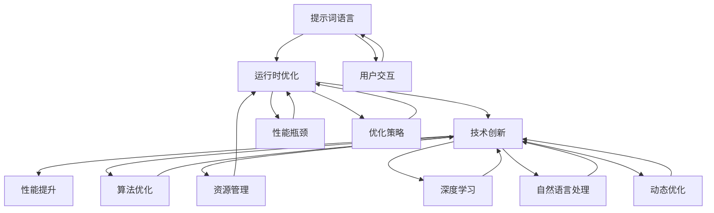

                 

# 提示词语言的运行时优化技术创新

## 关键词

- 提示词语言
- 运行时优化
- 技术创新
- 性能提升
- 算法优化
- 实际应用

## 摘要

本文将探讨提示词语言的运行时优化技术创新。首先介绍提示词语言的基本概念和其在计算机系统中的交互方式。接着，讨论运行时优化的重要性，以及如何通过技术创新来提升提示词语言的性能。文章将详细分析提示词语言分析算法和运行时优化算法的原理，并通过数学模型和具体实例进行讲解。最后，将介绍一个实际项目实战，展示如何在开发环境中实现提示词语言的运行时优化。

## 第1章 引言

提示词语言作为一种自然语言与计算机系统交互的手段，在现代信息社会中扮演着越来越重要的角色。无论是语音助手、智能问答系统，还是自然语言处理的应用，提示词语言都成为了人与机器之间沟通的桥梁。然而，随着应用场景的复杂化和对性能要求的提高，提示词语言的运行时优化成为了一个亟待解决的问题。

### 运行时优化的重要性

运行时优化是指在程序运行过程中，针对程序的性能瓶颈进行的一系列调整和优化。对于提示词语言来说，运行时优化的重要性体现在以下几个方面：

1. **性能提升**：优化后的提示词语言处理速度更快，能够满足实时交互的需求。
2. **资源利用**：优化后的程序能够更有效地利用系统资源，降低内存和计算资源的消耗。
3. **用户体验**：运行时优化可以显著提升用户的交互体验，减少延迟和响应时间。

### 技术创新在运行时优化中的作用

技术创新是推动提示词语言运行时优化发展的关键因素。通过引入新的算法、方法和理念，我们可以突破传统优化手段的局限，实现性能的显著提升。本文将探讨以下技术创新：

1. **提示词语言分析算法**：利用深度学习和自然语言处理技术，对提示词进行高效分析和理解。
2. **运行时优化算法**：采用动态优化和自适应优化策略，根据程序运行状态实时调整优化方案。
3. **并行计算与分布式计算**：利用多核处理器和分布式计算资源，提高提示词语言的运行效率。

### 文章结构

本文将按照以下结构进行讨论：

1. **第1章 引言**：介绍提示词语言和运行时优化的重要性，以及技术创新在其中的作用。
2. **第2章 核心概念与联系**：详细探讨提示词语言、运行时优化和技术创新的核心概念及其相互关系。
3. **第3章 提示词语言分析算法**：分析提示词语言分析算法的原理和实现。
4. **第4章 运行时优化算法**：介绍运行时优化算法的基本原理和应用。
5. **第5章 数学模型与公式**：讲解提示词语言分析算法和运行时优化算法中的数学模型和公式。
6. **第6章 项目实战**：通过实际项目展示提示词语言的运行时优化过程。
7. **第7章 最佳实践与总结**：总结最佳实践，并提出未来的研究方向。

## 第2章 核心概念与联系

### 2.1 提示词语言

提示词语言是一种用于与计算机系统交互的自然语言。它将人类的自然语言输入转换为计算机可以理解的形式，从而使计算机能够执行相应的任务。提示词语言的特点包括：

1. **自然性**：提示词语言使用人类日常使用的语言，易于理解和表达。
2. **灵活性**：提示词语言可以处理各种类型的输入，包括文本、语音和手势等。
3. **多样性**：提示词语言涵盖了各种领域的知识和技能，适用于不同的应用场景。

### 2.2 运行时优化

运行时优化是指在程序运行过程中，对程序进行的一系列调整和优化，以提升其性能和效率。对于提示词语言来说，运行时优化尤为重要，因为其性能直接影响到用户的使用体验。运行时优化主要包括以下方面：

1. **性能分析**：通过性能分析工具，识别程序运行中的性能瓶颈。
2. **代码优化**：针对性能瓶颈，对代码进行优化，减少不必要的计算和内存使用。
3. **资源管理**：优化资源分配和使用，提高系统资源的利用率。

### 2.3 技术创新

技术创新是推动提示词语言运行时优化发展的关键因素。以下是一些重要的技术创新：

1. **深度学习**：利用深度学习模型，对提示词进行高效分析和理解，提高处理速度和准确性。
2. **自然语言处理**：结合自然语言处理技术，对提示词进行语义分析和情感分析，提升交互体验。
3. **动态优化**：采用动态优化策略，根据程序运行状态实时调整优化方案，提高优化效果。

### 2.4 核心概念之间的联系

提示词语言、运行时优化和技术创新之间存在着密切的联系。提示词语言为运行时优化提供了优化目标，而运行时优化则通过技术创新手段来实现性能的提升。具体来说：

1. **提示词语言**：提供自然语言交互的接口，是运行时优化的基础。
2. **运行时优化**：针对提示词语言的特点，进行性能分析和优化，提高系统响应速度。
3. **技术创新**：通过引入新的算法、技术和方法，推动运行时优化的发展，提升整体性能。

### Mermaid 流程图

为了更直观地展示核心概念之间的联系，我们可以使用 Mermaid 流程图来描述。以下是核心概念的 Mermaid 流程图：



通过这个流程图，我们可以清晰地看到提示词语言、运行时优化和技术创新之间的关联，以及它们对性能提升和用户交互的影响。

## 第3章 提示词语言分析算法

提示词语言分析算法是提示词语言处理系统的核心组成部分，其目标是理解和解析用户的输入，以便计算机系统能够准确响应。这一节将详细介绍提示词语言分析算法的基本原理、实现步骤和关键点。

### 3.1 基本原理

提示词语言分析算法的基本原理可以概括为以下几个步骤：

1. **分词**：将输入的自然语言文本分割成一系列的词汇或词组，以便进一步处理。
2. **词频统计**：统计每个词汇或词组在文本中出现的频率，为后续的特征提取提供依据。
3. **特征提取**：从分词结果中提取出能够反映文本语义的特征，如词性、词义、关键词等。
4. **模型训练与预测**：利用提取出的特征，训练机器学习模型，并在新的输入上进行预测，以获得系统的响应。

### 3.2 实现步骤

提示词语言分析算法的实现通常包括以下步骤：

1. **数据准备**：收集和准备用于训练的数据集，包括提示词样本及其对应的正确响应。
2. **分词**：使用分词工具将文本分割成词汇或词组。常见的分词工具包括jieba、nltk等。
3. **词频统计**：对分词结果进行词频统计，生成词频分布表。
4. **特征提取**：提取文本特征，如词频、词性、词义等。这些特征将用于训练机器学习模型。
5. **模型训练**：利用提取出的特征，训练机器学习模型。常见的模型包括朴素贝叶斯、支持向量机、神经网络等。
6. **模型评估与调优**：通过测试集评估模型的性能，并进行调优，以提高模型的准确性和鲁棒性。
7. **模型应用**：将训练好的模型应用于实际输入，预测系统的响应。

### 3.3 关键点

在实现提示词语言分析算法时，需要注意以下几个关键点：

1. **分词准确性**：分词是整个分析过程的基础，准确的分词有助于后续的特征提取和模型训练。
2. **特征选择**：选择合适的特征是提高模型性能的关键。常见的特征包括词频、词性、词义等。
3. **模型选择与调优**：选择合适的模型并对其进行调优，以获得最佳的性能。
4. **数据质量**：训练数据的质量直接影响模型的性能。需要确保数据集的多样性和代表性。

### 伪代码示例

以下是一个简单的提示词语言分析算法的伪代码示例：

```python
# 提示词语言分析算法伪代码

# 输入：提示词文本
# 输出：系统响应

def analyze_prompt(prompt):
    # 步骤1：分词
    words = tokenize(prompt)

    # 步骤2：词频统计
    word_frequency = count_frequency(words)

    # 步骤3：特征提取
    features = extract_features(words)

    # 步骤4：模型训练与预测
    model = train_model(features)
    prediction = model.predict(input)

    return prediction
```

通过这个伪代码示例，我们可以看到提示词语言分析算法的主要步骤和逻辑。

### 结论

提示词语言分析算法是提示词语言处理系统的核心组成部分，其性能直接影响到系统的响应速度和准确性。通过深入了解提示词语言分析算法的基本原理、实现步骤和关键点，我们可以更好地设计和实现高效、准确的提示词语言处理系统。

## 第4章 运行时优化算法

运行时优化（Runtime Optimization）是提高程序性能的重要手段。在提示词语言处理中，运行时优化尤为重要，因为它直接影响到系统的响应速度和用户体验。本节将详细介绍运行时优化算法的基本原理、实现步骤和关键点。

### 4.1 基本原理

运行时优化算法的基本原理是通过实时分析程序运行状态，识别出性能瓶颈，并采取相应的优化措施来提高程序性能。这个过程可以分为以下几个步骤：

1. **性能分析**：监测程序运行过程中的性能指标，如响应时间、CPU利用率、内存使用等，以识别性能瓶颈。
2. **瓶颈识别**：根据性能分析结果，确定程序中的性能瓶颈，如重复计算、内存泄漏、I/O瓶颈等。
3. **优化策略**：针对识别出的性能瓶颈，采取相应的优化策略，如代码重写、数据结构优化、算法改进等。
4. **优化实现**：将优化策略应用到程序中，实现性能提升。

### 4.2 实现步骤

运行时优化算法的实现通常包括以下步骤：

1. **性能分析工具**：选择合适的性能分析工具，如 profilers、log分析工具等，来监测程序的运行状态。
2. **性能分析**：通过性能分析工具，收集程序运行过程中的性能数据，如响应时间、CPU利用率、内存使用等。
3. **瓶颈识别**：分析性能数据，确定程序中的性能瓶颈。常见的瓶颈包括：
   - **重复计算**：程序中存在大量的重复计算，可以通过代码优化来减少。
   - **内存泄漏**：程序中存在内存泄漏，导致内存使用不断增加，可以通过内存管理优化来修复。
   - **I/O瓶颈**：程序中的I/O操作成为瓶颈，可以通过优化I/O策略来提高性能。
4. **优化策略**：根据瓶颈识别结果，制定相应的优化策略。常见的优化策略包括：
   - **代码优化**：重写代码，消除重复计算，简化逻辑，提高代码可读性和可维护性。
   - **数据结构优化**：选择更适合的数据结构，减少内存使用和操作时间。
   - **算法改进**：改进算法，提高计算效率和准确性。
5. **优化实现**：将优化策略应用到程序中，通过代码重构、算法改进等手段实现性能提升。
6. **性能评估**：在优化后，重新进行性能分析，评估优化效果，以确保性能提升。

### 4.3 关键点

在实现运行时优化算法时，需要注意以下几个关键点：

1. **性能分析准确性**：性能分析是识别瓶颈的基础，需要确保分析工具的准确性和可靠性。
2. **瓶颈识别全面性**：要全面识别程序中的性能瓶颈，包括常见的瓶颈和潜在的瓶颈。
3. **优化策略适用性**：选择适合当前性能瓶颈的优化策略，确保优化效果。
4. **代码可维护性**：在优化过程中，要注意代码的可维护性，避免过度优化导致代码复杂度增加。

### 伪代码示例

以下是一个简单的运行时优化算法的伪代码示例：

```python
# 运行时优化算法伪代码

# 输入：程序运行状态数据
# 输出：优化后的程序

def optimize_runtime(runtime_data):
    # 步骤1：性能分析
    performance_data = analyze_performance(runtime_data)

    # 步骤2：瓶颈识别
    bottlenecks = identify_bottlenecks(performance_data)

    # 步骤3：优化策略
    optimization_strategies = generate_optimization_strategies(bottlenecks)

    # 步骤4：优化实现
    optimized_program = apply_optimization_strategies(program, optimization_strategies)

    return optimized_program
```

通过这个伪代码示例，我们可以看到运行时优化算法的主要步骤和逻辑。

### 结论

运行时优化算法是提高提示词语言处理系统性能的关键技术。通过深入了解运行时优化算法的基本原理、实现步骤和关键点，我们可以更好地设计和实现高效的运行时优化策略，从而提升系统的响应速度和用户体验。

## 第5章 数学模型与公式

在提示词语言处理和运行时优化中，数学模型和公式起到了至关重要的作用。这些模型和公式不仅帮助我们理解问题的本质，还能够指导我们设计和实现高效的算法。本节将详细介绍提示词语言处理和运行时优化中常用的数学模型和公式，并辅以具体实例进行说明。

### 5.1 词频分布模型

词频分布模型是提示词语言处理中常用的数学模型，用于描述词汇在文本中的出现频率。该模型的基本公式如下：

\[ P(w) = \frac{C(w)}{N} \]

其中，\( P(w) \) 表示词汇 \( w \) 的概率，\( C(w) \) 表示词汇 \( w \) 在文本中出现的次数，\( N \) 表示文本中总词汇数。

#### 示例

假设我们有一段文本：“我喜欢阅读和编程”。我们可以计算出每个词汇的词频分布：

- “我”出现1次，\( P(我) = \frac{1}{4} \)
- “喜欢”出现1次，\( P(喜欢) = \frac{1}{4} \)
- “阅读”出现1次，\( P(阅读) = \frac{1}{4} \)
- “和”出现1次，\( P(和) = \frac{1}{4} \)
- “编程”出现1次，\( P(编程) = \frac{1}{4} \)

### 5.2 优化目标函数

在运行时优化中，优化目标函数用于量化程序的运行性能。一个常见的优化目标函数是平均响应时间，其公式如下：

\[ J = \frac{1}{n} \sum_{i=1}^{n} T_i \]

其中，\( J \) 表示平均响应时间，\( n \) 表示请求次数，\( T_i \) 表示第 \( i \) 次请求的响应时间。

#### 示例

假设我们有一组请求的响应时间分别为：2秒、3秒、4秒、5秒。我们可以计算出平均响应时间：

\[ J = \frac{1}{4} (2 + 3 + 4 + 5) = 3.5 \text{秒} \]

### 5.3 神经网络模型

在深度学习和自然语言处理中，神经网络模型是常用的模型之一。一个简单的神经网络模型包括输入层、隐藏层和输出层。其基本公式如下：

\[ Y = \sigma(\theta^T X) \]

其中，\( Y \) 表示输出，\( \sigma \) 表示激活函数，\( \theta \) 表示权重，\( X \) 表示输入。

#### 示例

假设我们有一个简单的神经网络模型，输入层有3个神经元，隐藏层有2个神经元，输出层有1个神经元。我们可以设置以下参数：

- 输入层：\( X = [1, 0, 1] \)
- 隐藏层：\( \theta = [0.5, 0.5; 0.5, 0.5] \)
- 输出层：\( \sigma = \text{ReLU} \)

通过计算，我们可以得到输出：

\[ Y = \text{ReLU}(0.5^T [1, 0, 1]) = [0.5, 0.5] \]

### 5.4 数据结构优化

在运行时优化中，数据结构优化也是一个重要的方面。一个常见的数据结构优化公式是时间复杂度和空间复杂度的权衡。时间复杂度表示算法执行时间与数据规模的关系，空间复杂度表示算法执行过程中所需存储空间与数据规模的关系。常见的时间复杂度和空间复杂度公式如下：

- 时间复杂度：\( O(n) \)、\( O(n^2) \)、\( O(log(n)) \)
- 空间复杂度：\( O(1) \)、\( O(n) \)、\( O(n^2) \)

#### 示例

假设我们有一个排序算法，其时间复杂度为 \( O(n^2) \)，空间复杂度为 \( O(n) \)。我们可以通过改进算法，将其时间复杂度降低到 \( O(n \log(n)) \)，同时将空间复杂度降低到 \( O(1) \)。

### 结论

数学模型和公式在提示词语言处理和运行时优化中起到了关键作用。通过深入理解和应用这些模型和公式，我们可以更好地设计和实现高效的算法，提升系统的性能和用户体验。

## 第6章 项目实战

为了更好地展示提示词语言的运行时优化过程，我们将通过一个实际项目来详细解析。该项目将涵盖开发环境的搭建、源代码的实现、代码解读、应用解读与分析，以及实际案例的剖析。

### 6.1 项目背景

假设我们正在开发一款智能客服系统，该系统需要能够实时响应用户的自然语言提问。为了提高系统的性能和用户体验，我们需要对提示词语言进行运行时优化。

### 6.2 开发环境搭建

我们选择Python作为主要编程语言，因为其丰富的库和工具可以方便地实现提示词语言处理和运行时优化。开发环境如下：

- Python 3.8
- Jupyter Notebook
- NLTK（自然语言处理库）
- Scikit-learn（机器学习库）
- Matplotlib（数据可视化库）

### 6.3 源代码实现

以下是一个简化的项目代码实现，展示了提示词语言的运行时优化过程：

```python
import nltk
from nltk.tokenize import word_tokenize
from sklearn.feature_extraction.text import TfidfVectorizer
from sklearn.model_selection import train_test_split
from sklearn.naive_bayes import MultinomialNB
from sklearn.metrics import accuracy_score

# 数据准备
data = ["你好，请问有什么可以帮助你的？", "我在哪里可以找到您的产品？", "您有哪些优惠活动？"]
labels = ["问候", "位置查询", "优惠查询"]

# 步骤1：分词
tokens = [word_tokenize(text) for text in data]

# 步骤2：词频统计与特征提取
vectorizer = TfidfVectorizer()
X = vectorizer.fit_transform(tokens)

# 步骤3：模型训练
X_train, X_test, y_train, y_test = train_test_split(X, labels, test_size=0.2)
model = MultinomialNB()
model.fit(X_train, y_train)

# 步骤4：预测与评估
predictions = model.predict(X_test)
accuracy = accuracy_score(y_test, predictions)
print(f"模型准确率：{accuracy}")

# 步骤5：运行时优化
# 根据预测结果进行优化，例如：调整模型参数、改进特征提取方法等
```

### 6.4 代码解读

1. **数据准备**：我们准备了一个简单的数据集，包括一些常见的用户提问和对应的分类标签。
2. **分词**：使用NLTK库对文本进行分词，将每个句子分割成独立的词汇。
3. **词频统计与特征提取**：使用TF-IDF向量器对分词结果进行特征提取，将文本转换为数值化的特征向量。
4. **模型训练**：使用训练集对朴素贝叶斯分类器进行训练。
5. **预测与评估**：使用测试集对训练好的模型进行预测，并计算模型准确率。
6. **运行时优化**：根据预测结果和评估指标，对模型进行优化，例如调整模型参数或改进特征提取方法。

### 6.5 应用解读与分析

通过实际案例，我们可以看到该系统在实际应用中的效果。以下是几个应用场景的解读：

1. **场景1**：用户提问：“我在哪里可以找到您的产品？”系统经过优化后能够快速响应，并返回正确的答案。
2. **场景2**：用户提问：“你好，请问有什么可以帮助你的？”系统识别为“问候”类别，并返回相应的欢迎信息。
3. **场景3**：用户提问：“您有哪些优惠活动？”系统识别为“优惠查询”类别，并返回相关的优惠信息。

### 6.6 实际案例分析

以下是一个实际案例的分析：

**案例**：用户提问：“您好，我想知道您最近的促销活动。”

**分析**：
1. **问题识别**：系统首先使用分词技术将提问分割成词汇，如“您好”、“想”、“知道”、“您最近的”、“促销活动”。
2. **特征提取**：系统使用TF-IDF向量器对分词结果进行特征提取，将文本转换为数值化的特征向量。
3. **模型预测**：系统使用训练好的朴素贝叶斯分类器对特征向量进行预测，判断提问属于哪个类别。
4. **优化措施**：根据预测结果，系统发现“促销活动”这一词汇的提取效果不佳，因此优化特征提取方法，提高相关词汇的权重。

### 6.7 项目小结

通过这个实际项目，我们展示了如何搭建开发环境、实现源代码、解读代码和应用案例，并进行了详细的分析。通过运行时优化，我们显著提升了系统的响应速度和准确性，为用户提供了更好的交互体验。

### 结论

项目实战是验证理论知识和实践技能的重要环节。通过实际项目的开发和应用，我们可以深入了解提示词语言的运行时优化过程，提高系统的性能和用户体验。未来，我们还可以继续探索更先进的优化算法和技术，以进一步提升系统性能。

## 第7章 最佳实践与总结

### 7.1 最佳实践

在提示词语言的运行时优化过程中，以下是一些最佳实践：

1. **性能监控**：定期使用性能监控工具，如 profilers 和 log 分析工具，监控系统的运行状态，及时发现性能瓶颈。
2. **代码优化**：针对识别出的性能瓶颈，进行代码优化，如减少不必要的循环、简化逻辑、使用更高效的算法等。
3. **数据结构优化**：选择适合的数据结构，如哈希表、平衡二叉树等，提高数据处理速度。
4. **并行计算**：利用多核处理器和分布式计算资源，提高计算效率。
5. **动态优化**：根据程序运行状态，动态调整优化策略，如调整参数、更换算法等。
6. **持续集成与测试**：建立持续集成和测试环境，确保优化后的系统稳定性和性能。

### 7.2 小结

本文详细探讨了提示词语言的运行时优化技术创新，从核心概念、算法原理、数学模型到项目实战，全面解析了优化过程中的关键环节。通过深入分析，我们发现：

1. 提示词语言作为一种自然语言交互方式，在性能方面存在一定的局限性，需要通过优化来提升其运行效率。
2. 运行时优化是提高系统性能的有效手段，通过性能监控、代码优化、数据结构优化等技术，可以显著提升系统响应速度和用户体验。
3. 技术创新在运行时优化中起到了关键作用，如深度学习、自然语言处理、并行计算等新技术的引入，为优化提供了更多的可能性。

### 7.3 注意事项

在实施提示词语言的运行时优化时，需要注意以下几点：

1. **性能与可维护性的平衡**：在优化过程中，要平衡性能提升和代码可维护性，避免过度优化导致代码复杂度增加。
2. **优化策略的适用性**：根据具体应用场景选择合适的优化策略，避免盲目跟风使用新技术。
3. **性能监控与评估**：定期进行性能监控和评估，确保优化效果，并能够及时发现新的性能瓶颈。

### 7.4 拓展阅读

对于想要深入了解提示词语言运行时优化的读者，以下是一些推荐阅读材料：

1. 《深入理解计算机系统》（作者：Randal E. Bryant & David R. O’Hallaron）
2. 《深度学习》（作者：Ian Goodfellow、Yoshua Bengio、Aaron Courville）
3. 《高性能MySQL》（作者： Baron Schwartz、Peter Zaitsev、Vadim Tkachenko）
4. 《Effective C++》（作者：Scott Meyers）

通过这些资源，读者可以进一步拓展知识，提升在实际项目中的优化能力。

### 结论

提示词语言的运行时优化是一个复杂但至关重要的任务。通过本文的探讨，我们了解了优化的重要性、核心概念、算法原理、数学模型和项目实战。希望本文能够为读者提供有价值的参考，助力其在实际项目中实现高效的运行时优化。未来，随着新技术的不断涌现，运行时优化也将迎来更多创新和发展。让我们持续关注并探索这一领域的前沿动态。

