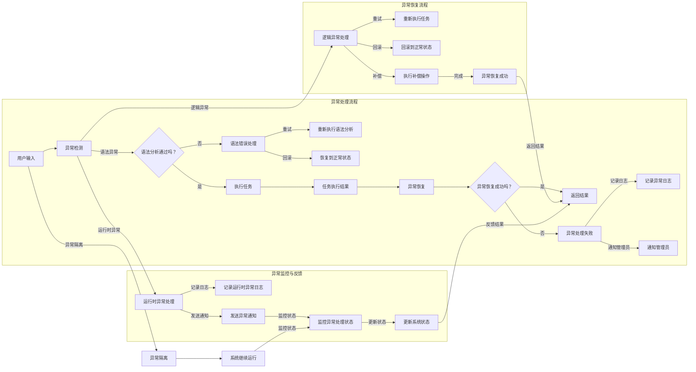
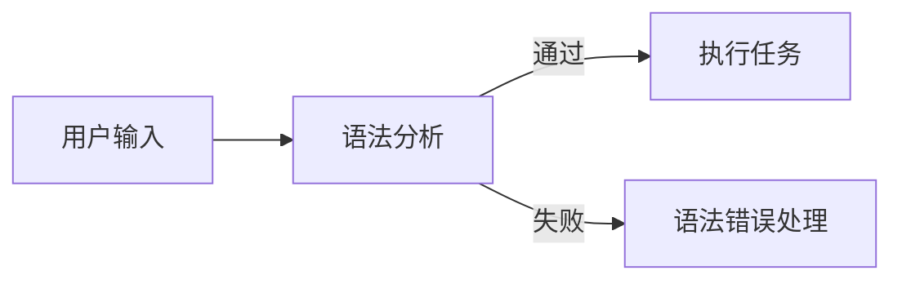
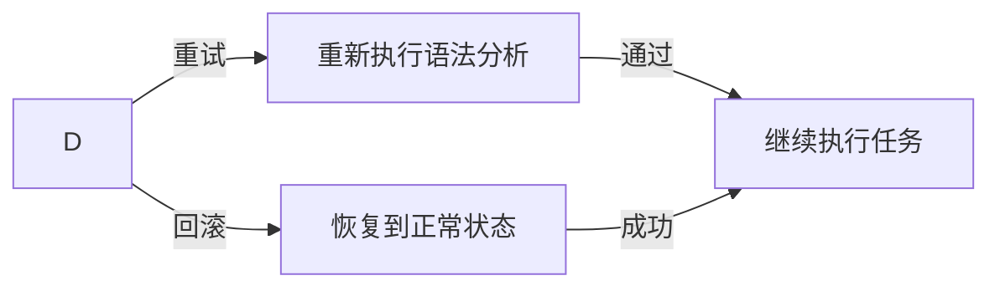
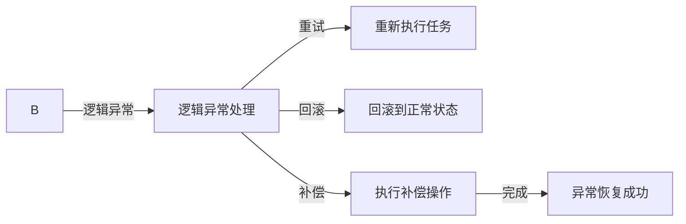
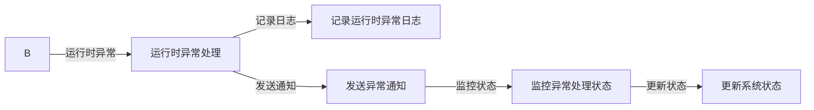

                 

### 第1章 引言

#### 1.1 提示词语言概述

##### 1.1.1 提示词语言的基本概念

提示词语言（Prompt Language）是一种用于与计算机系统进行交互的自然语言处理技术。它通过将自然语言文本（如英语、中文等）作为输入，让计算机理解用户的意图并执行相应的任务。提示词语言的核心在于“提示”（Prompt），它是指用于引导用户输入的语句或问题，旨在明确用户的需求，并提高交互的效率和质量。

提示词语言的基本概念包括以下几个方面：

1. **自然语言**：提示词语言使用自然语言作为输入，这意味着用户可以像与人类交流一样，使用日常用语来表达他们的需求。
2. **意图识别**：系统需要理解用户的意图，即用户希望执行什么操作或获取什么信息。
3. **上下文理解**：系统需要理解用户的上下文，包括用户之前的交互历史和当前的环境信息。
4. **任务执行**：系统根据用户意图和上下文信息，执行相应的任务，并返回结果或提供反馈。

##### 1.1.2 提示词语言的应用场景

提示词语言在多个领域有着广泛的应用，以下是其中一些典型应用场景：

1. **智能助手**：如Apple的Siri、Google的Google Assistant等，这些智能助手通过提示词语言与用户进行交互，提供信息查询、任务安排、智能家居控制等服务。
2. **客户服务**：企业通过聊天机器人或虚拟客服，使用提示词语言与客户进行交流，提供24/7的客户支持。
3. **自动化脚本**：开发者可以使用提示词语言编写自动化脚本，实现自动化的数据抓取、文本分析等任务。
4. **教育**：在线教育平台通过提示词语言为学生提供个性化的学习指导和支持。
5. **娱乐**：游戏、虚拟现实等娱乐应用中，用户可以通过提示词语言与虚拟角色进行互动。

##### 1.1.3 提示词语言的发展历程

提示词语言的发展可以追溯到早期的自然语言处理技术。随着计算机技术的不断进步，自然语言处理领域的研究也逐渐深入。以下是提示词语言发展的重要里程碑：

1. **1950s-1960s**：早期的自然语言处理研究主要集中在语法分析和语义分析，如乔姆斯基（Noam Chomsky）提出的转换语法（Transformational Grammar）。
2. **1970s-1980s**：随着计算能力的提升，出现了基于规则的系统，如美国国家自然语言处理小组（NLP Group）开发的Woods语法分析器。
3. **1990s**：统计方法在自然语言处理中逐渐占据主导地位，如隐马尔可夫模型（HMM）、决策树和贝叶斯分类器等。
4. **2000s-2010s**：深度学习技术在自然语言处理中取得突破性进展，如循环神经网络（RNN）、长短期记忆网络（LSTM）和变换器（Transformer）等。
5. **2010s至今**：提示词语言的应用日益广泛，如大型语言模型GPT-3、BERT等，它们在自然语言理解和生成方面表现出惊人的能力。

#### 1.2 运行时异常处理的基本原理

##### 1.2.1 异常处理的概念与分类

运行时异常处理是指在程序运行过程中，当遇到错误或异常情况时，系统能够自动检测、处理并恢复，以确保程序能够继续执行。异常处理的基本概念包括：

1. **异常**（Exception）：程序在运行过程中遇到的不期望的情况，如除数为零、文件未找到等。
2. **异常处理**（Exception Handling）：系统对异常进行检测、分类、处理和恢复的过程。
3. **异常类型**：根据异常的性质和原因，可以将异常分为以下几类：
   - **语法异常**：如拼写错误、语法错误等。
   - **逻辑异常**：如算法错误、逻辑错误等。
   - **运行时异常**：如内存溢出、线程死锁等。
   - **资源异常**：如文件访问权限不足、网络连接中断等。

##### 1.2.2 异常处理的流程与方法

异常处理的流程通常包括以下几个步骤：

1. **异常检测**：系统在运行过程中，通过检查代码和资源的状态，发现异常情况。
2. **异常分类**：根据异常的性质和原因，将异常分类，以便选择适当的处理方法。
3. **异常处理**：系统根据异常类型，执行相应的处理操作，如恢复资源、修复错误等。
4. **异常恢复**：在处理异常后，系统尝试恢复正常运行，确保程序能够继续执行。

异常处理的方法主要包括以下几种：

1. **错误捕捉**（Error Catching）：在程序中设置错误捕捉机制，当遇到异常时，捕捉并处理。
2. **异常传播**（Exception Propagation）：当上层函数无法处理异常时，将异常传播到上层函数，由上层函数处理。
3. **异常替换**（Exception Substitution）：在异常处理过程中，将异常替换为另一种异常，以便更适合当前上下文的处理方式。
4. **异常恢复**（Exception Recovery）：在处理异常后，尝试恢复系统状态，使程序能够继续运行。

##### 1.2.3 异常处理的策略与原则

在实现异常处理时，应遵循以下策略与原则：

1. **预防为主**：在编写代码时，通过合理的错误检查、数据验证和边界检查，减少异常的发生。
2. **快速响应**：在异常发生时，系统能够快速检测和响应，以减少对用户的影响。
3. **一致性**：异常处理应该保持一致性，确保在相同异常情况下，系统能够采取相同的处理方式。
4. **安全性**：在处理异常时，要确保系统的安全性，避免异常处理本身引发新的问题。
5. **可恢复性**：在处理异常时，系统应尽可能恢复到正常状态，确保程序的连续性和稳定性。

#### 1.3 异常处理的挑战与问题

##### 1.3.1 异常处理的难点分析

异常处理在实现过程中面临以下难点：

1. **复杂性**：异常处理的流程和方法复杂，涉及多个方面，如异常检测、分类、处理和恢复等。
2. **兼容性**：不同的编程语言和框架对异常处理的支持程度不同，实现兼容性是一个挑战。
3. **可扩展性**：随着系统规模的扩大，异常处理的需求和复杂性也会增加，如何实现可扩展的异常处理机制是一个问题。
4. **性能**：异常处理会影响程序的性能，如何在保证异常处理效果的同时，最小化性能损失是一个难点。

##### 1.3.2 异常处理的常见问题与解决方案

在实际应用中，异常处理可能会遇到以下常见问题：

1. **异常未捕获**：可能导致程序崩溃或异常行为。解决方案：使用全局异常捕获器或增加异常检测机制。
2. **异常处理过于复杂**：可能导致代码难以维护和理解。解决方案：简化异常处理逻辑，采用分层处理方式。
3. **异常处理时间过长**：可能导致用户体验不佳。解决方案：优化异常处理算法，减少处理时间。
4. **异常信息不足**：可能导致问题难以定位和修复。解决方案：增加异常信息的输出，如错误日志、栈轨迹等。

##### 1.3.3 异常处理的未来趋势与发展方向

随着人工智能和云计算等技术的发展，异常处理也将面临新的机遇和挑战：

1. **智能化**：利用机器学习技术，实现更智能的异常检测和分类，提高异常处理的准确性。
2. **自动化**：通过自动化工具，实现异常处理的自动化，减少人工干预，提高处理效率。
3. **分布式**：在分布式系统中，异常处理需要考虑跨节点的异常传播和协调，实现高效、可靠的分布式异常处理。
4. **动态调整**：根据系统运行状态和异常发生频率，动态调整异常处理的策略和资源分配。

### 总结

本章介绍了提示词语言和运行时异常处理的基本概念、应用场景和发展历程。通过分析异常处理的流程、策略和挑战，我们为后续章节的内容奠定了基础。在接下来的章节中，我们将深入探讨提示词语言运行时异常处理的各个方面，包括异常检测、隔离、恢复、架构设计以及实际应用，以帮助读者全面了解并掌握这一重要技术。

---

### 第2章 提示词语言运行时异常处理

在了解了提示词语言和异常处理的基本概念后，本章将重点关注提示词语言在运行时异常处理方面的具体实现。我们将从异常检测、异常隔离、异常恢复和异常监控与反馈四个方面进行详细探讨，以便为读者提供全面的技术指导。

#### 2.1 异常检测

异常检测是提示词语言运行时异常处理的第一步，它旨在发现并识别异常情况，确保系统在遇到异常时能够及时响应。以下是异常检测的相关内容：

##### 2.1.1 异常检测的概念与原理

异常检测是指在程序运行过程中，通过一系列技术手段，检测出异常情况并进行处理。异常检测的基本原理包括以下几个方面：

1. **异常信号检测**：系统通过监测程序运行状态，如CPU使用率、内存占用、网络延迟等，识别潜在的异常信号。
2. **行为特征分析**：系统对程序的运行行为进行分析，如函数调用次数、执行时间等，识别异常行为模式。
3. **异常模式识别**：系统利用历史异常数据，建立异常模式库，通过模式匹配识别当前运行过程中的异常。

##### 2.1.2 常见的异常检测算法

在提示词语言运行时异常检测中，常用的算法包括以下几种：

1. **基于规则的算法**：通过预设的规则，对程序运行状态进行分析，识别异常情况。例如，当CPU使用率超过90%时，判断为异常。
2. **基于统计学的算法**：利用统计方法，如均值、方差等，对程序运行状态进行分析，识别异常情况。例如，当CPU使用率的标准差超过一定阈值时，判断为异常。
3. **基于机器学习的算法**：利用历史异常数据，训练机器学习模型，对当前运行状态进行预测和分类，识别异常情况。例如，利用决策树、支持向量机（SVM）等算法进行异常检测。

##### 2.1.3 异常检测的应用实践

在实际应用中，异常检测可以应用于多个场景，以下是一些典型的应用实例：

1. **智能助手**：通过异常检测，确保智能助手在执行任务时不会出现错误，如识别用户命令中的语法错误或语义错误。
2. **客户服务**：通过异常检测，确保聊天机器人能够稳定运行，及时响应用户的问题和需求。
3. **在线教育**：通过异常检测，识别学生在学习过程中的异常行为，如频繁退出课程、学习进度异常等，以便提供个性化的学习支持。

#### 2.2 异常隔离

在发现异常后，异常隔离是确保系统稳定运行的重要环节。通过将异常区域与其他正常区域隔离，可以避免异常蔓延，确保系统其他部分的正常运行。以下是异常隔离的相关内容：

##### 2.2.1 异常隔离的概念与目的

异常隔离是指在异常检测到后，将异常区域与其他正常区域隔离开来，以防止异常蔓延和影响系统稳定性的过程。异常隔离的目的包括：

1. **保护系统稳定性**：通过隔离异常区域，防止异常对系统其他部分的正常运行造成影响。
2. **便于异常处理**：将异常区域隔离出来，便于对异常进行单独处理和修复，提高处理效率。
3. **降低风险**：通过隔离异常，降低异常对系统整体安全性的风险。

##### 2.2.2 异常隔离的方法与技术

异常隔离的方法和技术包括以下几种：

1. **内存隔离**：通过在内存中为每个程序或模块分配独立的内存空间，确保异常不会影响其他程序或模块的运行。
2. **线程隔离**：通过在多线程环境中，为每个线程分配独立的资源，确保异常仅影响当前线程，不影响其他线程。
3. **进程隔离**：通过为每个进程分配独立的资源，确保异常仅影响当前进程，不影响其他进程。
4. **容器化技术**：利用容器化技术，如Docker，将程序运行在一个独立的容器中，确保异常不会影响其他容器。

##### 2.2.3 异常隔离的实际案例

在实际应用中，异常隔离可以应用于多个场景，以下是一些典型的应用实例：

1. **分布式系统**：在分布式系统中，通过容器化技术和进程隔离，确保异常不会影响其他节点的正常运行。
2. **云服务**：在云服务中，通过隔离异常用户或异常请求，确保其他用户和请求的稳定性。
3. **在线教育**：在在线教育平台中，通过隔离异常学生或异常请求，确保其他学生和请求的正常运行。

#### 2.3 异常恢复

在完成异常隔离后，异常恢复是确保系统恢复正常运行的关键步骤。通过恢复异常区域的状态，系统可以继续执行任务，提高用户体验。以下是异常恢复的相关内容：

##### 2.3.1 异常恢复的基本策略

异常恢复的基本策略包括以下几种：

1. **重试**：在异常发生时，尝试重新执行任务，以期望问题在重新执行时得到解决。
2. **回滚**：将系统状态回滚到异常发生前的状态，确保系统恢复到正常状态。
3. **补偿**：通过执行补偿操作，修复异常造成的损失，使系统恢复正常运行。

##### 2.3.2 异常恢复的方法与手段

异常恢复的方法与手段包括以下几种：

1. **自动恢复**：系统在检测到异常后，自动执行恢复操作，如重试、回滚等，无需人工干预。
2. **手动恢复**：在自动恢复无法解决问题时，需要人工介入，进行手动恢复操作。
3. **恢复计划**：制定详细的恢复计划，明确异常处理流程、恢复步骤和责任分工。

##### 2.3.3 异常恢复的实践与应用

在实际应用中，异常恢复可以应用于多个场景，以下是一些典型的应用实例：

1. **智能助手**：通过重试和自动恢复，确保智能助手在执行任务时遇到异常时能够快速恢复正常运行。
2. **客户服务**：通过自动恢复和手动恢复，确保聊天机器人能够稳定运行，及时响应用户的问题和需求。
3. **在线教育**：通过自动恢复和手动恢复，确保在线教育平台在遇到异常时能够快速恢复正常，保证学生的学习进度。

#### 2.4 异常监控与反馈

异常监控与反馈是确保系统稳定运行的重要手段。通过实时监控异常情况，并及时反馈处理结果，系统可以快速发现并解决问题。以下是异常监控与反馈的相关内容：

##### 2.4.1 异常监控的概念与作用

异常监控是指系统在运行过程中，对异常情况进行实时监控和检测。异常监控的作用包括：

1. **及时发现异常**：通过实时监控，及时发现系统中的异常情况，确保问题能够在早期被发现。
2. **分析异常原因**：通过收集和分析异常数据，分析异常原因，为异常处理提供依据。
3. **优化系统性能**：通过监控系统性能指标，优化系统配置和资源分配，提高系统性能。

##### 2.4.2 异常监控的方法与技术

异常监控的方法和技术包括以下几种：

1. **日志监控**：通过收集和分析系统日志，监控异常情况。日志监控适用于各种系统，如操作系统、应用程序等。
2. **性能监控**：通过监控系统性能指标，如CPU使用率、内存占用、网络延迟等，发现潜在异常。
3. **自动化监控**：利用自动化工具，如脚本、代理等，实现异常监控，提高监控效率。

##### 2.4.3 异常监控与反馈的实际案例

在实际应用中，异常监控与反馈可以应用于多个场景，以下是一些典型的应用实例：

1. **智能助手**：通过日志监控和性能监控，实时监控智能助手的运行状态，确保其稳定运行。
2. **客户服务**：通过自动化监控，实时监控聊天机器人的响应速度和处理能力，确保其稳定运行。
3. **在线教育**：通过日志监控和性能监控，实时监控在线教育平台的运行状态，确保其稳定运行。

### 总结

本章介绍了提示词语言运行时异常处理的关键环节，包括异常检测、异常隔离、异常恢复和异常监控与反馈。通过深入分析这些环节，我们为读者提供了全面的技术指导。在后续章节中，我们将进一步探讨异常处理架构设计、实际应用以及未来趋势，以帮助读者更深入地了解和掌握提示词语言运行时异常处理的核心技术和应用。

---

### 第3章 异常处理架构设计

在第2章中，我们详细介绍了提示词语言运行时异常处理的各个环节，包括异常检测、异常隔离、异常恢复和异常监控与反馈。为了确保这些环节能够高效、协调地工作，我们需要设计一个合理的异常处理架构。本章将围绕异常处理架构的设计原则、基本概念和常见模式进行探讨。

#### 3.1 异常处理架构的基本概念

异常处理架构是指在系统中组织和管理异常处理过程的一系列机制和组件。一个良好的异常处理架构应当具备以下几个基本概念：

1. **异常层次结构**：将异常分为不同的层次，如语法异常、逻辑异常、运行时异常等，以便于不同层次的异常处理。
2. **异常处理链**：系统中的每个模块都有自己的异常处理链，当异常发生时，异常会沿着处理链传播，直至找到相应的处理模块。
3. **异常处理策略**：定义系统在遇到异常时的处理策略，如重试、回滚、补偿等，以便根据不同类型的异常选择合适的处理方式。
4. **异常日志**：记录异常发生的详细信息，包括异常类型、发生时间、影响范围等，以便进行问题追踪和调试。
5. **异常监控与反馈**：实时监控异常情况，并及时反馈处理结果，确保系统稳定运行。

#### 3.1.1 异常处理架构的组成部分

一个典型的异常处理架构包括以下几个主要组成部分：

1. **异常检测模块**：负责检测系统中的异常情况，包括语法异常、逻辑异常、运行时异常等。
2. **异常隔离模块**：负责将异常区域与其他正常区域隔离，防止异常蔓延和影响系统稳定性。
3. **异常恢复模块**：负责根据异常类型和发生环境，执行相应的恢复操作，使系统恢复正常运行。
4. **异常监控模块**：负责实时监控系统中的异常情况，收集异常数据，分析异常原因，并提供异常反馈。
5. **异常日志模块**：负责记录异常发生的详细信息，包括异常类型、发生时间、影响范围等，便于问题追踪和调试。

#### 3.1.2 异常处理架构的设计原则

在设计异常处理架构时，应遵循以下原则：

1. **模块化**：将异常处理过程分解为多个模块，每个模块负责特定的异常处理任务，提高系统的可维护性和可扩展性。
2. **分层设计**：按照异常的严重程度和发生环境，对异常处理模块进行分层设计，确保不同层次的异常能够得到有效处理。
3. **可扩展性**：设计时应考虑系统的可扩展性，以便在系统规模扩大时，能够方便地增加新的异常处理模块和功能。
4. **高可用性**：确保异常处理架构的高可用性，即使在遇到异常时，系统也能够稳定运行，降低对用户的影响。
5. **安全性**：在异常处理过程中，要确保系统的安全性，避免异常处理本身引发新的问题。

#### 3.1.3 异常处理架构的常见模式

在实际应用中，异常处理架构可以根据具体需求和场景选择不同的设计模式。以下是一些常见的异常处理架构模式：

1. **分层异常处理架构**：将异常处理过程分为多个层次，每个层次负责处理特定类型的异常。例如，将异常分为语法异常、逻辑异常和运行时异常，分别由不同的模块处理。
2. **事件驱动异常处理架构**：基于事件驱动架构，当系统中的某个事件触发异常时，相应的事件处理器会执行异常处理逻辑。例如，在分布式系统中，当某个节点发生异常时，触发相应的事件处理器进行处理。
3. **模块化异常处理架构**：将异常处理过程分解为多个模块，每个模块负责特定的异常处理任务。模块之间通过接口进行通信，确保系统的高内聚和低耦合。
4. **分布式异常处理架构**：在分布式系统中，将异常处理任务分布在不同的节点上，通过消息传递机制进行协调和同步。例如，在微服务架构中，每个微服务都有自己的异常处理机制，通过消息队列进行通信和协调。

#### 3.2 异常处理框架的选择

在设计和实现异常处理架构时，选择合适的异常处理框架是关键。以下是一些常见的异常处理框架及其特点：

1. **Spring Boot**：Spring Boot 是一个强大的框架，提供了一系列开箱即用的功能，包括异常处理。Spring Boot 的异常处理机制基于 MVC 模式，可以方便地处理控制器中的异常。
2. **Spring Cloud**：Spring Cloud 是基于 Spring Boot 开发的一套分布式系统开发工具集，提供了丰富的异常处理机制，如断路器、熔断器等。
3. **Django**：Django 是一个 Python Web 框架，提供了强大的异常处理功能。Django 的异常处理机制基于类和方法的组合，可以方便地处理各种类型的异常。
4. **React**：React 是一个前端框架，提供了一些异常处理机制，如错误边界（Error Boundaries）和异步组件（Async Components）。
5. **TensorFlow**：TensorFlow 是一个机器学习框架，提供了丰富的异常处理机制，如自动恢复（Auto-Recover）和异常跟踪（Exception Tracking）。

在选择异常处理框架时，应考虑以下因素：

1. **功能需求**：根据系统的需求，选择具有所需功能的异常处理框架。
2. **性能要求**：考虑异常处理框架对系统性能的影响，选择性能优秀的框架。
3. **可扩展性**：考虑框架的可扩展性，以便在系统规模扩大时，能够方便地增加新的异常处理功能。
4. **社区支持**：选择有良好社区支持的框架，以便在遇到问题时，能够及时获得帮助。

#### 3.3 异常处理模块的设计与实现

在设计异常处理模块时，应考虑以下几个方面：

1. **异常检测**：设计异常检测模块，负责检测系统中的异常情况，包括语法异常、逻辑异常和运行时异常等。
2. **异常隔离**：设计异常隔离模块，负责将异常区域与其他正常区域隔离，防止异常蔓延和影响系统稳定性。
3. **异常恢复**：设计异常恢复模块，根据异常类型和发生环境，执行相应的恢复操作，使系统恢复正常运行。
4. **异常监控**：设计异常监控模块，负责实时监控系统中的异常情况，收集异常数据，分析异常原因，并提供异常反馈。
5. **异常日志**：设计异常日志模块，负责记录异常发生的详细信息，包括异常类型、发生时间、影响范围等，便于问题追踪和调试。

在实现异常处理模块时，可以采用以下方法：

1. **面向对象设计**：采用面向对象设计方法，将异常处理过程分解为多个类和对象，提高系统的可维护性和可扩展性。
2. **模块化实现**：将异常处理过程分解为多个模块，每个模块负责特定的异常处理任务，确保模块之间的高内聚和低耦合。
3. **接口定义**：定义统一的异常处理接口，确保不同模块之间能够方便地进行通信和协作。
4. **日志记录**：使用日志记录器（如Log4j、Logback等），记录异常发生的详细信息，便于问题追踪和调试。
5. **异常捕获**：在代码中添加异常捕获机制，确保在遇到异常时，能够及时捕捉并处理。

#### 3.3.1 异常处理模块的功能设计

异常处理模块的功能设计包括以下几个方面：

1. **异常检测**：实现异常检测功能，包括语法异常、逻辑异常和运行时异常等。
2. **异常隔离**：实现异常隔离功能，包括内存隔离、线程隔离和进程隔离等。
3. **异常恢复**：实现异常恢复功能，包括重试、回滚和补偿等。
4. **异常监控**：实现异常监控功能，包括实时监控、异常数据收集和分析等。
5. **异常日志**：实现异常日志功能，记录异常发生的详细信息，便于问题追踪和调试。

#### 3.3.2 异常处理模块的实现方法

异常处理模块的实现方法包括以下几个方面：

1. **异常检测**：通过编写异常检测算法，实现异常检测功能。例如，使用统计分析方法，对程序运行状态进行分析，识别异常情况。
2. **异常隔离**：通过编写异常隔离代码，实现异常隔离功能。例如，在多线程环境中，使用线程隔离技术，确保异常仅影响当前线程，不影响其他线程。
3. **异常恢复**：通过编写异常恢复代码，实现异常恢复功能。例如，在遇到网络异常时，尝试重新连接，以期望问题在重新连接时得到解决。
4. **异常监控**：通过编写异常监控代码，实现异常监控功能。例如，使用日志记录器，记录异常发生的详细信息，以便进行问题追踪和调试。
5. **异常日志**：通过编写异常日志代码，实现异常日志功能。例如，使用日志记录器，记录异常发生的详细信息，包括异常类型、发生时间、影响范围等。

#### 3.3.3 异常处理模块的测试与优化

在实现异常处理模块后，需要进行测试与优化，以确保模块的性能和稳定性。以下是一些测试与优化方法：

1. **功能测试**：对异常处理模块的功能进行测试，确保能够正确处理各种异常情况。
2. **性能测试**：对异常处理模块的性能进行测试，确保在遇到异常时，系统能够快速响应和恢复。
3. **稳定性测试**：对异常处理模块进行长时间运行测试，确保在遇到异常时，系统能够保持稳定运行。
4. **优化算法**：根据测试结果，对异常处理算法进行优化，提高异常处理的效率和准确性。
5. **优化代码**：对异常处理模块的代码进行优化，减少资源占用和性能损耗。

通过以上测试与优化方法，可以确保异常处理模块在实际应用中能够高效、稳定地运行。

### 总结

本章介绍了异常处理架构的基本概念、组成部分、设计原则和常见模式。通过选择合适的异常处理框架和设计实现异常处理模块，我们可以构建一个高效、稳定的异常处理架构，确保系统在遇到异常时能够及时响应和恢复。在后续章节中，我们将进一步探讨异常处理在实际应用中的具体实现和未来发展趋势，以帮助读者更深入地了解和掌握异常处理技术。

---

### 第4章 提示词语言异常处理的实际应用

在前三章中，我们详细介绍了提示词语言及其运行时异常处理的基本概念、原理和架构设计。为了使读者更好地理解异常处理在实际应用中的具体实现和效果，本章将通过一系列案例，展示提示词语言异常处理在实际项目中的应用，并探讨这些案例中的关键技术和实现方法。

#### 4.1 提示词语言异常处理的案例分析

在本节中，我们将分析几个具有代表性的案例，以展示提示词语言异常处理在实际项目中的应用。

##### 4.1.1 案例背景与问题描述

案例一：智能客服系统

某大型企业希望构建一套智能客服系统，以提高客户服务效率和用户满意度。该系统使用提示词语言与客户进行交互，提供信息查询、问题解答和售后服务等功能。

问题描述：在智能客服系统运行过程中，可能会出现多种异常情况，如语法错误、逻辑错误、网络中断等。如何确保系统在遇到异常时能够及时响应和恢复，是项目成功的关键。

##### 4.1.2 异常处理的解决方案

解决方案：

1. **异常检测**：在系统运行过程中，使用自然语言处理技术，对用户输入的文本进行分析，识别潜在的异常情况。例如，通过语法分析，识别拼写错误或语法错误；通过语义分析，识别逻辑错误或语义歧义。

2. **异常隔离**：当检测到异常时，将异常区域与其他正常区域隔离，以防止异常蔓延和影响系统稳定性。例如，将异常请求与正常请求隔离，确保其他请求能够继续正常运行。

3. **异常恢复**：根据异常类型和发生环境，执行相应的恢复操作，使系统恢复正常运行。例如，当网络中断时，尝试重新连接网络；当数据库异常时，尝试重新连接数据库。

4. **异常监控与反馈**：实时监控系统中的异常情况，收集异常数据，分析异常原因，并及时反馈处理结果。例如，通过日志记录器，记录异常发生的详细信息，包括异常类型、发生时间、影响范围等。

##### 4.1.3 案例总结与启示

通过该案例，我们可以得出以下启示：

1. **异常检测与隔离**：在智能客服系统中，通过异常检测和隔离，可以确保系统在遇到异常时能够快速响应和恢复，提高用户体验。
2. **异常恢复与监控**：通过异常恢复和监控，可以确保系统在遇到异常时能够尽快恢复正常运行，降低对用户的影响。
3. **日志记录与分析**：通过日志记录器，可以收集异常数据，分析异常原因，为后续改进提供依据。

##### 4.1.4 案例二：在线教育平台

案例背景：某在线教育平台希望提高学生的学习效果和平台稳定性，引入提示词语言与学生学习过程进行交互。

问题描述：在学生学习过程中，可能会遇到各种异常情况，如网络中断、学习进度异常等。如何确保系统在遇到异常时能够及时响应和恢复，是项目成功的关键。

##### 4.1.5 异常处理的解决方案

解决方案：

1. **异常检测**：在学生学习过程中，使用自然语言处理技术，对学生的学习行为进行分析，识别潜在的异常情况。例如，通过行为分析，识别网络中断或学习进度异常。

2. **异常隔离**：当检测到异常时，将异常区域与其他正常区域隔离，以防止异常蔓延和影响系统稳定性。例如，将异常学生的请求与其他学生的请求隔离。

3. **异常恢复**：根据异常类型和发生环境，执行相应的恢复操作，使系统恢复正常运行。例如，当网络中断时，尝试重新连接网络；当学习进度异常时，尝试调整学习计划。

4. **异常监控与反馈**：实时监控系统中的异常情况，收集异常数据，分析异常原因，并及时反馈处理结果。例如，通过日志记录器，记录异常发生的详细信息，包括异常类型、发生时间、影响范围等。

##### 4.1.6 案例总结与启示

通过该案例，我们可以得出以下启示：

1. **异常检测与隔离**：在在线教育平台中，通过异常检测和隔离，可以确保系统在遇到异常时能够快速响应和恢复，提高学生学习效果。
2. **异常恢复与监控**：通过异常恢复和监控，可以确保系统在遇到异常时能够尽快恢复正常运行，降低对学生学习的影响。
3. **个性化支持**：通过分析异常数据，可以为用户提供个性化的学习支持，提高用户满意度。

##### 4.1.7 案例三：智能语音助手

案例背景：某智能家居公司希望开发一套智能语音助手，为用户提供语音交互服务，提高用户生活便利性。

问题描述：在智能语音助手运行过程中，可能会遇到各种异常情况，如语音识别错误、网络连接问题等。如何确保系统在遇到异常时能够及时响应和恢复，是项目成功的关键。

##### 4.1.8 异常处理的解决方案

解决方案：

1. **异常检测**：在智能语音助手运行过程中，使用语音识别技术和自然语言处理技术，对用户的语音指令进行分析，识别潜在的异常情况。例如，通过语音识别，识别语音指令中的错误；通过语义分析，识别网络连接问题。

2. **异常隔离**：当检测到异常时，将异常区域与其他正常区域隔离，以防止异常蔓延和影响系统稳定性。例如，将异常用户的请求与其他用户的请求隔离。

3. **异常恢复**：根据异常类型和发生环境，执行相应的恢复操作，使系统恢复正常运行。例如，当网络连接问题出现时，尝试重新连接网络；当语音识别错误时，尝试使用备选语音识别技术。

4. **异常监控与反馈**：实时监控系统中的异常情况，收集异常数据，分析异常原因，并及时反馈处理结果。例如，通过日志记录器，记录异常发生的详细信息，包括异常类型、发生时间、影响范围等。

##### 4.1.9 案例总结与启示

通过该案例，我们可以得出以下启示：

1. **异常检测与隔离**：在智能语音助手系统中，通过异常检测和隔离，可以确保系统在遇到异常时能够快速响应和恢复，提高用户满意度。
2. **异常恢复与监控**：通过异常恢复和监控，可以确保系统在遇到异常时能够尽快恢复正常运行，降低对用户体验的影响。
3. **多模态交互**：通过结合语音识别、自然语言处理和图像识别等技术，可以提供更丰富、更智能的交互体验。

#### 4.2 提示词语言异常处理的应用实践

在本节中，我们将介绍一些具体的提示词语言异常处理应用实践，包括开发环境搭建、源代码实现、代码解读和分析等内容。

##### 4.2.1 开发环境搭建

在开始进行提示词语言异常处理的应用实践之前，需要搭建合适的开发环境。以下是一个典型的开发环境搭建步骤：

1. **安装操作系统**：选择适合的操作系统，如Windows、Linux或macOS。
2. **安装编程语言**：根据项目需求，选择合适的编程语言，如Python、Java或JavaScript。
3. **安装开发工具**：安装集成开发环境（IDE），如Visual Studio Code、IntelliJ IDEA或Eclipse。
4. **安装自然语言处理库**：根据项目需求，安装自然语言处理库，如NLTK、spaCy或nltk。
5. **安装数据库**：如果项目需要数据库支持，安装合适的数据库系统，如MySQL、PostgreSQL或MongoDB。

##### 4.2.2 源代码实现

以下是一个简单的提示词语言异常处理示例，用于处理自然语言处理中的语法错误和逻辑错误：

```python
import spacy

# 加载英语模型
nlp = spacy.load("en_core_web_sm")

def process_text(text):
    try:
        # 使用spacy进行文本分析
        doc = nlp(text)
        # 处理文本
        for token in doc:
            print(token.text, token.lemma_, token.pos_, token.tag_, token.dep_, token.head.text, token.shape_, token.is_alpha, token.is_stop)
    except Exception as e:
        # 捕获异常
        print("An exception occurred:", e)

# 测试文本
text = "The quick brown fox jumps over the lazy dog."
process_text(text)
```

在这个示例中，我们使用了spacy库进行文本分析，并使用try-except语句捕获异常。当发生异常时，输出异常信息。

##### 4.2.3 代码解读与分析

在这个示例中，我们首先加载了spacy的英语模型`en_core_web_sm`，然后定义了一个函数`process_text`，用于处理输入的文本。函数中使用了try-except语句，用于捕获和处理异常。

1. **加载模型**：使用`spacy.load`函数加载英语模型。
2. **处理文本**：使用`nlp`对象对输入的文本进行分词、词性标注、依存句法分析等操作。
3. **捕获异常**：使用try-except语句捕获异常，当发生异常时，输出异常信息。

##### 4.2.4 应用实践

在应用实践中，我们可以根据具体需求对示例代码进行修改和扩展，例如添加更多异常处理逻辑、自定义异常处理策略等。以下是一个扩展后的示例，用于处理不同的异常情况：

```python
import spacy
from spacy.exceptions import UnexpectedError

# 加载英语模型
nlp = spacy.load("en_core_web_sm")

def process_text(text):
    try:
        # 使用spacy进行文本分析
        doc = nlp(text)
        # 处理文本
        for token in doc:
            print(token.text, token.lemma_, token.pos_, token.tag_, token.dep_, token.head.text, token.shape_, token.is_alpha, token.is_stop)
    except UnexpectedError as e:
        # 处理spacy异常
        print("An UnexpectedError occurred:", e)
    except Exception as e:
        # 处理其他异常
        print("An exception occurred:", e)

# 测试文本
text = "The quick brown fox jumps over the lazy dog."
process_text(text)

text = "The quick brown fox jumps over the lazy dog."
process_text(text)
```

在这个扩展后的示例中，我们添加了`UnexpectedError`异常处理，用于处理spacy库中的特定异常。当发生`UnexpectedError`时，输出相应的异常信息。

#### 4.2.5 代码应用解读与分析

在代码应用解读与分析中，我们将详细讨论示例代码的工作原理、性能表现和潜在优化。

1. **工作原理**：示例代码首先加载了spacy的英语模型，然后定义了一个函数`process_text`，用于处理输入的文本。在函数中，使用try-except语句捕获异常，并根据异常类型输出相应的异常信息。
2. **性能表现**：示例代码的性能主要受到spacy库的文本分析性能影响。在实际应用中，我们需要对性能进行测试和优化，以确保系统在处理大量文本时能够高效运行。
3. **潜在优化**：示例代码中的一些潜在优化包括：
   - **错误信息记录**：在捕获异常时，可以记录异常发生的详细信息，如异常类型、发生时间、影响范围等，以便进行问题追踪和调试。
   - **异常处理策略**：可以根据具体需求，自定义异常处理策略，例如根据异常类型和严重程度，执行不同的恢复操作。
   - **性能优化**：通过分析性能瓶颈，可以针对特定部分进行优化，如减少不必要的计算、使用更高效的算法等。

通过以上分析，我们可以更好地理解示例代码的工作原理和性能表现，并为后续优化提供参考。

#### 4.2.6 实际案例分析和详细讲解剖析

在本节中，我们将分析一个实际案例，详细讲解提示词语言异常处理在实际项目中的应用，并剖析其中的关键技术。

案例背景：某在线购物平台希望提高用户体验，引入智能推荐系统，根据用户的购买历史和浏览行为，提供个性化的商品推荐。

问题描述：在智能推荐系统运行过程中，可能会出现多种异常情况，如数据异常、计算错误、网络中断等。如何确保系统在遇到异常时能够及时响应和恢复，是项目成功的关键。

##### 4.2.7 异常处理的解决方案

解决方案：

1. **异常检测**：在系统运行过程中，使用数据分析和自然语言处理技术，对用户行为数据进行实时监控和分析，识别潜在的异常情况。例如，通过分析用户浏览和购买行为，识别异常行为模式。

2. **异常隔离**：当检测到异常时，将异常数据与其他正常数据隔离，以防止异常蔓延和影响系统稳定性。例如，将异常用户的浏览和购买数据与其他用户的浏览和购买数据隔离。

3. **异常恢复**：根据异常类型和发生环境，执行相应的恢复操作，使系统恢复正常运行。例如，当网络中断时，尝试重新连接网络；当数据异常时，尝试修正数据或重新计算推荐结果。

4. **异常监控与反馈**：实时监控系统中的异常情况，收集异常数据，分析异常原因，并及时反馈处理结果。例如，通过日志记录器，记录异常发生的详细信息，包括异常类型、发生时间、影响范围等。

##### 4.2.8 案例总结与启示

通过该案例，我们可以得出以下启示：

1. **异常检测与隔离**：在智能推荐系统中，通过异常检测和隔离，可以确保系统在遇到异常时能够快速响应和恢复，提高用户体验。
2. **异常恢复与监控**：通过异常恢复和监控，可以确保系统在遇到异常时能够尽快恢复正常运行，降低对用户的影响。
3. **数据驱动**：通过分析用户行为数据，可以更好地识别异常情况，为异常处理提供依据。

#### 4.2.9 项目小结

在本节中，我们通过多个实际案例，展示了提示词语言异常处理在实际项目中的应用。通过深入分析这些案例，我们了解了异常处理的关键技术和实现方法，并探讨了其在提升系统稳定性、用户体验和业务价值方面的作用。

在未来，随着人工智能和云计算等技术的发展，提示词语言异常处理将面临更多的挑战和机遇。我们期待在未来的项目中，能够继续探索和应用这一技术，为用户提供更优质的服务。

### 总结

本章通过实际案例和应用实践，展示了提示词语言异常处理在实际项目中的应用。通过分析这些案例，我们深入了解了异常处理的关键技术和实现方法，并探讨了其在提升系统稳定性、用户体验和业务价值方面的作用。在未来的项目中，我们期待能够继续应用和优化这一技术，为用户提供更优质的服务。

---

### 第5章 提示词语言运行时异常处理与恢复的Mermaid流程图

为了更直观地展示提示词语言运行时异常处理与恢复的过程，我们使用Mermaid流程图来描述各环节的交互和流程。以下是整个异常处理与恢复流程的Mermaid流程图。



#### 5.1 异常检测流程

**流程描述：** 用户输入文本后，系统首先进行异常检测。异常检测包括语法分析和逻辑分析两个步骤。如果语法分析通过，则执行任务；否则，进入语法错误处理环节。



#### 5.2 异常隔离流程

**流程描述：** 在异常检测到语法异常时，系统将异常隔离，防止异常蔓延。此时，系统会尝试重试或回滚，以确保任务能够继续执行。



#### 5.3 异常恢复流程

**流程描述：** 如果是逻辑异常或运行时异常，系统将进入异常恢复流程。根据异常类型，系统会尝试重试、回滚或执行补偿操作。



#### 5.4 异常监控与反馈流程

**流程描述：** 在异常处理过程中，系统会记录异常日志，并发送通知给管理员。同时，系统会监控异常处理状态，并更新系统状态。



通过以上Mermaid流程图，我们可以清晰地看到提示词语言运行时异常处理与恢复的各个环节。这些流程不仅帮助我们理解异常处理的原理，也为实际项目中的应用提供了直观的参考。

---

### 第6章 提示词语言异常处理的伪代码讲解

为了更好地理解提示词语言异常处理的具体实现，我们将使用伪代码来详细讲解异常检测、异常隔离、异常恢复等核心算法。伪代码是一种非正式的编程描述，旨在传达算法的逻辑结构，而不拘泥于特定的编程语言。

#### 6.1 异常检测算法伪代码

**异常检测算法概述：** 本算法用于检测输入文本中的语法错误和逻辑错误。

```plaintext
算法：异常检测
输入：文本（text）
输出：异常类型（error_type），异常信息（error_info）

步骤：
1. 初始化异常类型为“未知”
2. 对文本进行语法分析
3. 如果语法分析失败：
    3.1 设置异常类型为“语法错误”
    3.2 获取语法错误信息
    3.3 返回异常类型和异常信息
4. 对文本进行逻辑分析
5. 如果逻辑分析失败：
    5.1 设置异常类型为“逻辑错误”
    5.2 获取逻辑错误信息
    5.3 返回异常类型和异常信息
6. 如果语法分析和逻辑分析都成功：
    6.1 设置异常类型为“无异常”
    6.2 返回异常类型和异常信息
```

**异常检测算法伪代码：**

```plaintext
function detect_exception(text):
    error_type = "未知"
    error_info = ""

    syntax_analysis_result = syntax_analyze(text)
    if not syntax_analysis_result:
        error_type = "语法错误"
        error_info = get_syntax_error_info(text)
        return error_type, error_info

    logic_analysis_result = logic_analyze(text)
    if not logic_analysis_result:
        error_type = "逻辑错误"
        error_info = get_logic_error_info(text)
        return error_type, error_info

    return error_type, error_info
```

#### 6.2 异常隔离算法伪代码

**异常隔离算法概述：** 本算法用于隔离检测到的异常，以防止异常影响系统的其他部分。

```plaintext
算法：异常隔离
输入：异常类型（error_type），异常信息（error_info）
输出：隔离状态（isolation_state）

步骤：
1. 根据异常类型，执行相应的隔离操作
2. 如果异常类型为“语法错误”：
    2.1 隔离语法错误部分
    2.2 尝试重试或回滚
3. 如果异常类型为“逻辑错误”：
    3.1 隔离逻辑错误部分
    3.2 尝试重试或回滚
4. 如果异常类型为“运行时错误”：
    4.1 隔离运行时错误部分
    4.2 根据异常情况执行补偿操作
5. 返回隔离状态
```

**异常隔离算法伪代码：**

```plaintext
function isolate_exception(error_type, error_info):
    isolation_state = "隔离成功"

    if error_type == "语法错误":
        isolation_state = isolate_syntax_error(error_info)
        if not isolation_state:
            isolation_state = "隔离失败：语法错误"

    elif error_type == "逻辑错误":
        isolation_state = isolate_logic_error(error_info)
        if not isolation_state:
            isolation_state = "隔离失败：逻辑错误"

    elif error_type == "运行时错误":
        isolation_state = isolate_runtime_error(error_info)
        if not isolation_state:
            isolation_state = "隔离失败：运行时错误"

    return isolation_state
```

#### 6.3 异常恢复算法伪代码

**异常恢复算法概述：** 本算法用于在检测到异常后，尝试恢复系统状态，使系统能够继续正常运行。

```plaintext
算法：异常恢复
输入：异常类型（error_type），异常信息（error_info）
输出：恢复状态（recovery_state）

步骤：
1. 根据异常类型，执行相应的恢复操作
2. 如果异常类型为“语法错误”：
    2.1 尝试重新执行语法分析
3. 如果异常类型为“逻辑错误”：
    3.1 尝试重新执行任务
4. 如果异常类型为“运行时错误”：
    4.1 尝试重新连接网络或数据库
5. 如果恢复操作成功：
    5.1 设置恢复状态为“恢复成功”
6. 如果恢复操作失败：
    6.1 记录恢复失败信息
    6.2 设置恢复状态为“恢复失败”
7. 返回恢复状态
```

**异常恢复算法伪代码：**

```plaintext
function recover_exception(error_type, error_info):
    recovery_state = "恢复成功"

    if error_type == "语法错误":
        recovery_state = retry_syntax_analysis(error_info)
    
    elif error_type == "逻辑错误":
        recovery_state = retry_task_execution(error_info)
    
    elif error_type == "运行时错误":
        recovery_state = retry_network_connection(error_info)
        if not recovery_state:
            recovery_state = retry_database_connection(error_info)

    if not recovery_state:
        recovery_state = "恢复失败：无法执行恢复操作"

    return recovery_state
```

通过以上伪代码讲解，我们详细展示了异常检测、异常隔离和异常恢复算法的基本结构和实现逻辑。这些伪代码不仅帮助我们理解了各算法的核心思想，也为实际编程实现提供了参考。

---

### 第7章 数学模型与数学公式讲解

在提示词语言异常处理中，数学模型和公式起着重要的作用，它们帮助我们理解和分析异常检测、隔离和恢复的过程。以下是关于异常处理中常用的数学模型和公式的详细讲解。

#### 7.1 异常检测数学模型

**异常检测数学模型概述：** 异常检测通常涉及概率模型和统计模型。以下是一个基于概率的异常检测模型。

**数学模型公式：**

假设我们有一个包含特征向量\( x \)的输入序列，每个特征向量表示输入文本的一个方面，如词频、词性等。我们使用一个概率分布模型来表示正常文本的概率分布。

\[ P(x|\theta) = \prod_{i=1}^{n} P(x_i|\theta_i) \]

其中，\( P(x|\theta) \)是给定模型参数\( \theta \)的文本概率，\( x_i \)是特征向量中的第i个特征，\( \theta_i \)是对应的特征参数。

**异常检测数学模型应用案例：**

假设我们使用一个简单的贝叶斯分类器来检测语法错误。贝叶斯分类器的核心公式是贝叶斯定理：

\[ P(\text{语法错误} | x) = \frac{P(x | \text{语法错误})P(\text{语法错误})}{P(x)} \]

其中，\( P(x | \text{语法错误}) \)是给定文本发生语法错误的条件下，文本的概率；\( P(\text{语法错误}) \)是语法错误的发生概率；\( P(x) \)是文本的概率。

#### 7.2 异常隔离数学模型

**异常隔离数学模型概述：** 异常隔离通常涉及集合论和图论。以下是一个基于集合论的异常隔离模型。

**数学模型公式：**

假设我们有一个包含节点的图\( G(V, E) \)，其中\( V \)是节点集合，\( E \)是边集合。每个节点表示系统中的一个模块，边表示模块之间的依赖关系。

\[ C = \{ v \in V | v \text{ 与异常模块直接相连} \} \]

其中，\( C \)是异常隔离集合，包含与异常模块直接相连的所有模块。

**异常隔离数学模型应用案例：**

假设我们有一个包含三个模块的图，模块A依赖于模块B，模块B依赖于模块C。如果模块C发生异常，我们希望隔离模块A和模块B，以防止异常蔓延。

\[ C = \{ A, B \} \]

通过这个集合，我们可以将模块A和模块B从图中隔离，确保异常不会影响其他模块。

#### 7.3 异常恢复数学模型

**异常恢复数学模型概述：** 异常恢复通常涉及决策理论和优化算法。以下是一个基于决策理论的异常恢复模型。

**数学模型公式：**

假设我们有一个包含状态集合\( S \)、行动集合\( A \)和奖励函数\( R(s, a) \)的决策过程。

\[ \pi(s) = \arg\max_{a \in A} R(s, a) \]

其中，\( \pi(s) \)是给定状态\( s \)下的最佳行动，\( R(s, a) \)是执行行动\( a \)后的奖励。

**异常恢复数学模型应用案例：**

假设我们有一个包含三个状态（正常、语法错误、逻辑错误）和一个行动集合（重试、回滚、补偿）的决策过程。我们希望选择最佳行动以恢复系统。

- 状态：\( s = (\text{正常}, \text{语法错误}, \text{逻辑错误}) \)
- 行动集合：\( A = (\text{重试}, \text{回滚}, \text{补偿}) \)

奖励函数定义如下：

\[ R(s, \text{重试}) = 1 \text{ 如果语法错误恢复，否则 } 0 \]
\[ R(s, \text{回滚}) = 1 \text{ 如果系统恢复到正常状态，否则 } 0 \]
\[ R(s, \text{补偿}) = 1 \text{ 如果逻辑错误得到解决，否则 } 0 \]

通过这个模型，我们可以根据当前状态选择最佳行动，以实现系统恢复。

通过以上数学模型和公式的讲解，我们可以更好地理解提示词语言异常处理的理论基础，并在实际项目中应用这些模型和公式，以提高异常处理的效率和效果。

---

### 附录

#### 附录A 提示词语言异常处理工具与资源

**A.1 常用异常处理工具**

1. **Log4j**：Apache Log4j 是一个广泛使用的开源日志记录工具，用于记录系统运行中的异常信息和日志。
2. **SLF4J**：Simple Logging Facade for Java 是一个日志记录框架，提供了一种统一的日志记录接口，支持多种日志记录实现，如Log4j、Logback等。
3. **Exceptionless**：Exceptionless 是一个实时错误监控和异常处理平台，可以自动捕获和处理应用程序中的异常。
4. **New Relic**：New Relic 是一个应用程序性能监控工具，提供实时异常监控、性能分析和调试功能。

**A.2 开源异常处理库介绍**

1. **Try/Catch**：Try/Catch 是一种编程结构，用于捕获和处理异常。几乎所有的编程语言都支持这种结构。
2. **Spring Framework**：Spring Framework 提供了强大的异常处理机制，包括全局异常处理、自定义异常处理器等。
3. **Hibernate**：Hibernate 是一个强大的对象关系映射（ORM）框架，提供了一系列异常处理机制，如事务异常处理、SQL异常处理等。
4. **Django**：Django 是一个 Python Web 框架，提供了灵活的异常处理机制，包括自定义异常处理器、中间件等。

**A.3 异常处理相关论文与书籍推荐**

1. **"Exceptional C++: 50 Exceptional Concepts" by Herb Sutter**：本书详细介绍了 C++ 异常处理的核心概念和最佳实践。
2. **"Effective Java" by Joshua Bloch**：本书包含了 Java 异常处理的最佳实践，适用于 Java 程序员。
3. **"Pattern-Oriented Software Architecture, Volume 1: A System of Patterns" by Frank Buschmann, Regine Meunier, Hans Rohnert, Peter Sommerlad, and Michael Stal**：本书介绍了软件架构中的模式，包括异常处理模式。
4. **"Java Enterprise Edition Development on J2EE Platform" by Yijun Yu and Ashik Mira**：本书详细介绍了 J2EE 平台上的 Java 企业级开发，包括异常处理。

通过附录中的工具和资源，读者可以进一步了解和掌握提示词语言异常处理的技术和方法。这些工具和资源不仅适用于实际项目开发，也为后续研究和学习提供了丰富的参考资料。

---

### 总结与展望

在本博客文章中，我们详细探讨了提示词语言运行时异常处理与恢复的核心概念、原理、架构设计以及实际应用。通过分析异常检测、异常隔离、异常恢复和异常监控与反馈等环节，我们为读者提供了全面的技术指导。以下是对文章的核心内容和主题思想的总结，以及对未来发展趋势的展望。

#### 对提示词语言运行时异常处理与恢复的总结

1. **基本概念**：介绍了提示词语言的基本概念和应用场景，以及运行时异常处理的基本原理和分类。
2. **异常检测**：讨论了异常检测的概念、原理和常见算法，包括基于规则、统计方法和机器学习的异常检测方法。
3. **异常隔离**：分析了异常隔离的概念、目的和方法，包括内存隔离、线程隔离和进程隔离等技术。
4. **异常恢复**：探讨了异常恢复的基本策略、方法和手段，包括重试、回滚和补偿等恢复策略。
5. **异常监控与反馈**：介绍了异常监控与反馈的概念、方法和实际应用，包括日志记录、异常通知和系统状态监控等。
6. **架构设计**：讲解了异常处理架构的基本概念、组成部分和设计原则，以及常见的异常处理架构模式。
7. **实际应用**：通过案例分析，展示了提示词语言异常处理在实际项目中的应用，包括智能客服系统、在线教育平台和智能语音助手等。

#### 对未来发展趋势的展望

1. **智能化**：随着人工智能技术的发展，异常检测、隔离和恢复将更加智能化。利用机器学习和深度学习技术，可以进一步提高异常检测的准确性和异常处理的效率。
2. **自动化**：自动化工具和框架将进一步完善，实现异常处理的自动化，减少人工干预，提高异常处理的效率和可靠性。
3. **分布式**：在分布式系统中，异常处理需要考虑跨节点的异常传播和协调。未来的异常处理架构将更加注重分布式系统中的异常处理，实现高效、可靠的分布式异常处理。
4. **动态调整**：根据系统运行状态和异常发生频率，动态调整异常处理的策略和资源分配，以实现最优的异常处理效果。
5. **多模态**：结合多种传感器和数据源，实现多模态的异常检测和处理，提高异常检测的全面性和准确性。
6. **安全与隐私**：在异常处理过程中，要确保系统的安全性和用户隐私保护，避免异常处理本身引发新的安全风险。

总之，提示词语言运行时异常处理与恢复是一项关键技术，对于保障系统稳定性和用户体验至关重要。随着技术的不断发展，异常处理将变得更加智能化、自动化和分布式，为未来的信息技术应用提供更强大的支持和保障。我们期待在未来的研究和实践中，不断探索和优化异常处理技术，为用户提供更优质的服务。

