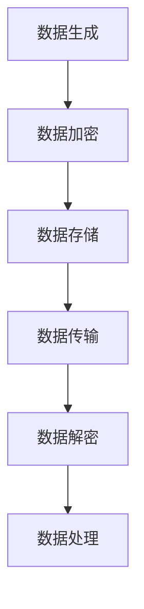

                 


### 1. 引言

**隐私保护的重要性**

在当今信息时代，数据已成为现代社会不可或缺的资产。然而，随着数据的广泛应用，隐私泄露的风险也随之增加。隐私保护已成为信息技术领域的一个关键问题。隐私保护的核心目标是确保数据在存储、传输和使用过程中不会被未授权的人员访问或篡改。

**隐私保护的挑战**

- 数据泄露的风险：随着数据量的增加，数据泄露的风险也在增大。
- 隐私法规的要求：各国政府纷纷出台隐私保护法规，要求企业在处理个人数据时必须采取严格的隐私保护措施。

**隐私保护的目标**

隐私保护的主要目标包括：

- 保密性：确保数据不被未授权的人员访问。
- 完整性：确保数据在传输和存储过程中不被篡改。
- 可用性：确保在需要时能够快速访问数据。

### 2. 隐私保护基本概念

**隐私的定义**

隐私是指个人或实体不愿意公开或与他人分享的个人信息或数据。隐私不仅包括个人身份信息，如姓名、地址、电话号码，还包括个人行为和偏好信息，如购物记录、搜索历史等。

**隐私保护**

隐私保护是指采取一系列技术和管理措施，确保个人或实体的数据在存储、传输和使用过程中不会被未授权的人员访问或篡改。隐私保护涉及多个方面，包括数据加密、访问控制、数据去识别化等。

### 3. 隐私保护技术概述

隐私保护技术包括多种方法，其中加密技术是核心手段之一。加密技术通过将数据转换为无法解读的密文，确保数据在传输和存储过程中的保密性。常见的加密技术包括对称加密、非对称加密和同态加密。

**对称加密**

对称加密是指使用相同的密钥进行加密和解密。常见的对称加密算法有DES、AES等。对称加密的优点是速度快，但缺点是密钥管理复杂。

**非对称加密**

非对称加密使用一对密钥，即公钥和私钥。公钥用于加密，私钥用于解密。常见的非对称加密算法有RSA、ECC等。非对称加密的优点是解决了密钥管理问题，但缺点是加密和解密速度较慢。

**同态加密**

同态加密是一种在加密状态下对数据进行计算和处理的技术。同态加密允许在密文上进行计算，而无需解密。同态加密的优点是提高了数据处理的速度，但目前的同态加密算法仍处于研究阶段，性能和实用性仍有待提高。

**隐私保护的其他技术**

除了加密技术，隐私保护还包括数据去识别化、匿名化、访问控制等技术。数据去识别化通过删除或替换敏感信息，使数据无法与特定个人或实体关联。匿名化通过模糊处理敏感信息，降低数据被识别的风险。访问控制通过限制对数据的访问，确保数据在存储和使用过程中的安全性。

**Mermaid 流程图**

以下是一个简单的 Mermaid 流程图，展示了隐私保护机制的基本流程：



### 4. 核心算法原理讲解

**加密算法原理**

加密算法的基本原理是将明文数据转换为密文，以防止未授权人员访问。加密算法通常包括密钥生成、加密和解密三个过程。

- 密钥生成：生成一对密钥，包括公钥和私钥。
- 加密：使用公钥将明文数据加密为密文。
- 解密：使用私钥将密文解密为明文。

以下是一个简单的加密算法原理的伪代码：

```plaintext
// 密钥生成
function generateKeyPair() {
    // 生成公钥和私钥
    return (publicKey, privateKey);
}

// 加密
function encrypt(plaintext, publicKey) {
    // 使用公钥加密明文
    return ciphertext;
}

// 解密
function decrypt(ciphertext, privateKey) {
    // 使用私钥解密密文
    return plaintext;
}
```

**数学模型和公式**

加密算法通常依赖于数学模型和公式。以下是一个简单的加密模型的数学公式：

$$
C = E_K(P)
$$

其中，$C$ 表示密文，$P$ 表示明文，$K$ 表示密钥，$E_K$ 表示加密函数。

**数学模型和公式举例**

假设我们使用AES加密算法，以下是一个加密模型的数学公式：

$$
C = AES(K, P)
$$

其中，$AES$ 表示AES加密函数，$K$ 表示AES密钥，$P$ 表示明文。

### 5. 项目实战

**开发环境搭建**

要实现隐私保护机制，我们需要搭建一个合适的开发环境。以下是一个简单的开发环境搭建步骤：

1. 安装操作系统：选择一个合适的操作系统，如Linux或MacOS。
2. 安装编程语言：选择一种编程语言，如Python或Java。
3. 安装加密库：选择一个加密库，如PyCrypto或Bouncy Castle。
4. 安装开发工具：安装必要的开发工具，如IDE或文本编辑器。

**源代码实现和代码解读**

以下是一个简单的加密算法的源代码实现：

```python
from Crypto.PublicKey import RSA
from Crypto.Cipher import PKCS1_OAEP

# 生成密钥对
privateKey, publicKey = RSA.generate(2048)

# 加密
def encrypt(plaintext, publicKey):
    cipher = PKCS1_OAEP.new(publicKey)
    ciphertext = cipher.encrypt(plaintext)
    return ciphertext

# 解密
def decrypt(ciphertext, privateKey):
    cipher = PKCS1_OAEP.new(privateKey)
    plaintext = cipher.decrypt(ciphertext)
    return plaintext
```

**代码应用解读与分析**

上述代码展示了如何使用Python实现RSA加密算法。代码首先生成一对RSA密钥，然后定义了加密和解密函数。加密函数使用公钥将明文加密为密文，解密函数使用私钥将密文解密为明文。

**实际案例分析和详细讲解剖析**

以下是一个简单的实际案例：

假设我们有一个包含敏感信息的文件，我们需要将其加密存储。

1. 生成密钥对。
2. 使用公钥加密文件内容。
3. 将加密后的文件存储在安全位置。
4. 需要访问文件时，使用私钥解密文件内容。

**项目小结**

通过上述案例，我们了解了如何在实际项目中实现隐私保护机制。开发环境搭建、源代码实现和代码解读是隐私保护项目成功的关键。在实际项目中，我们需要根据具体需求选择合适的加密算法和工具，确保数据在存储、传输和使用过程中的安全性。

### 6. 最佳实践 tips、小结、注意事项、拓展阅读

**最佳实践 tips**

- 在设计隐私保护机制时，应充分考虑安全性和性能之间的平衡。
- 定期更新加密算法和密钥，以防止安全漏洞。
- 在处理敏感数据时，应遵循隐私保护法规和最佳实践。

**小结**

本文介绍了隐私保护机制的设计和实现方法。通过加密技术、数据去识别化、访问控制等技术，我们可以确保数据在存储、传输和使用过程中的安全性。在实际项目中，我们需要根据具体需求选择合适的隐私保护机制，并遵循最佳实践。

**注意事项**

- 隐私保护机制的设计和实现需要充分考虑安全性、性能和可扩展性。
- 在使用第三方加密库时，需要确保库的可靠性和安全性。

**拓展阅读**

- [《信息安全基础》](https://book.douban.com/subject/26891747/)
- [《密码学概论》](https://book.douban.com/subject/3233382/)
- [《隐私保护与数据安全》](https://book.douban.com/subject/27697751/)

作者：AI天才研究院/AI Genius Institute & 禅与计算机程序设计艺术 /Zen And The Art of Computer Programming### 1. 引言

隐私保护机制设计在当今的信息时代中扮演着至关重要的角色。随着互联网的普及和大数据技术的发展，个人信息和敏感数据被广泛收集和使用。然而，数据泄露事件频发，隐私泄露的风险日益增加，如何保护用户的隐私已成为一个亟待解决的问题。本文将深入探讨提示词语言的隐私保护机制设计，旨在为读者提供一个全面、详细的指导。

**隐私保护的重要性**

隐私保护是确保个人数据安全的关键。它不仅关乎个人的信息安全，也影响到整个社会的稳定和信任。随着互联网技术的不断进步，数据泄露事件层出不穷，如信用卡信息泄露、用户账号密码泄露等。这些事件不仅给个人带来了巨大的经济损失，也严重损害了企业的声誉和用户的信任。

在信息社会中，个人隐私的保护至关重要。个人信息包括姓名、地址、电话号码、电子邮件、健康记录等。这些信息如果被不法分子获取，可能会被用于诈骗、骚扰或其他非法活动。因此，设计有效的隐私保护机制，防止个人信息泄露，是维护社会秩序和用户权益的必要手段。

**隐私保护的目标**

隐私保护的目标主要包括以下几个方面：

1. **保密性**：确保数据在存储、传输和处理过程中不被未授权的人员访问。
2. **完整性**：确保数据在传输和存储过程中不会被篡改或破坏。
3. **可用性**：确保在需要时能够快速访问数据，同时确保数据的安全。

保密性是隐私保护的核心目标。它涉及到数据加密、访问控制、身份验证等技术手段。通过加密技术，可以将敏感数据转换为无法解读的密文，防止未授权人员获取数据。访问控制则通过限制对数据的访问权限，确保只有授权用户才能访问敏感信息。

完整性则涉及到数据完整性保护和数据篡改检测。通过数字签名和哈希函数等技术，可以确保数据在传输和存储过程中不被篡改。数字签名是一种用于验证数据完整性的技术，它可以确保数据在传输过程中未被篡改，并且可以验证数据的发送者。

可用性是确保数据在需要时能够被访问，同时不降低数据的安全。在实际应用中，为了确保数据的可用性，可能会在数据保护措施和安全性能之间进行权衡。例如，加密算法的复杂度会影响数据处理的速度，因此在设计隐私保护机制时，需要综合考虑安全性、性能和用户体验。

**隐私保护的挑战**

隐私保护面临诸多挑战，主要包括以下几个方面：

1. **数据泄露的风险**：随着数据量的增加，数据泄露的风险也在增大。大规模的数据泄露事件不仅对个人和企业造成经济损失，也会对社会造成深远的影响。
2. **隐私法规的要求**：各国政府纷纷出台隐私保护法规，要求企业在处理个人数据时必须采取严格的隐私保护措施。例如，欧盟的《通用数据保护条例》（GDPR）就对数据处理提出了严格的要求。
3. **技术的复杂性**：隐私保护技术涉及多个领域，包括加密技术、访问控制、数据去识别化等。这些技术复杂且不断更新，企业需要不断学习和适应新技术。

**隐私保护机制的设计**

隐私保护机制的设计是一个复杂的过程，需要综合考虑多个因素。以下是隐私保护机制设计的一般步骤：

1. **需求分析**：明确隐私保护的目标和需求，包括需要保护的数据类型、数据的使用场景、数据的重要性等。
2. **技术选型**：根据需求分析结果，选择合适的隐私保护技术，如加密技术、访问控制技术、数据去识别化技术等。
3. **方案设计**：设计具体的隐私保护方案，包括加密算法的选择、密钥管理、访问控制策略等。
4. **实现与部署**：根据方案设计，实现隐私保护机制，并在实际系统中进行部署。
5. **评估与优化**：对隐私保护机制进行评估，包括安全性、性能等方面的评估，并根据评估结果进行优化。

**本文的结构**

本文将分为以下几个部分：

1. **用户需求分析**：详细分析用户对隐私保护机制的需求，包括数据类型、使用场景、重要性等。
2. **核心概念与联系**：介绍隐私保护的基本概念、相关术语，以及这些概念之间的联系。
3. **核心算法原理讲解**：详细解释隐私保护机制所依赖的算法原理，包括加密算法、访问控制算法等，使用伪代码展示算法的实现过程。
4. **数学模型和数学公式**：详细讲解隐私保护机制的数学模型，使用 LaTeX 格式展示公式，并进行举例说明。
5. **项目实战**：提供实际案例，展示如何在实际项目中实现隐私保护机制，包括开发环境搭建、源代码实现和代码解读。
6. **最佳实践 tips、小结、注意事项、拓展阅读**：总结隐私保护机制设计中的最佳实践，并提出注意事项，推荐拓展阅读资源。

通过本文的阅读，读者将能够深入理解隐私保护机制的设计原理，掌握实际应用中的实现方法，并为未来的隐私保护工作提供有益的参考。

### 用户需求分析

在当今大数据和互联网技术飞速发展的时代，隐私保护已经成为用户日益关注的问题。用户对隐私保护机制的需求主要集中在以下几个方面：

**数据类型**

用户需求涉及多种类型的数据，包括但不限于：

1. **个人身份信息**：如姓名、身份证号、电话号码、电子邮件地址等。
2. **金融信息**：如信用卡号码、银行账户信息、交易记录等。
3. **健康记录**：如病历、体检结果、健康咨询记录等。
4. **社交网络数据**：如聊天记录、好友信息、朋友圈内容等。
5. **行为数据**：如搜索记录、浏览历史、购物习惯等。

这些数据在现代社会中具有高度敏感性，一旦泄露，可能给用户带来严重的经济损失和个人隐私风险。

**使用场景**

用户对隐私保护的需求在不同场景中表现各异，主要包括：

1. **线上交易**：在电子商务、在线支付等场景中，用户需要确保交易过程中的数据安全，防止信息泄露和欺诈行为。
2. **社交网络**：在社交媒体平台上，用户希望保护个人隐私，防止隐私信息被滥用或泄露。
3. **健康管理**：在健康信息管理系统中，用户希望确保健康数据的安全性，防止信息被未经授权的人员访问。
4. **企业内部数据**：在企业内部，用户需要保护公司机密信息，如财务数据、战略规划等。
5. **政府机构数据**：在政府部门，用户需要确保公民信息的保密性，防止信息被不法分子利用。

**重要性**

隐私保护的重要性体现在以下几个方面：

1. **法律合规**：随着隐私保护法规的不断完善，企业必须遵守相关法律要求，否则将面临严重的法律后果。
2. **用户信任**：隐私保护是赢得用户信任的重要手段。如果用户认为其数据不受保护，他们可能会选择其他更安全的服务提供商。
3. **信息安全**：有效的隐私保护机制可以防止数据泄露，从而保障用户个人信息和金融资产的安全。
4. **社会稳定**：隐私保护机制的完善有助于维护社会秩序，减少因隐私泄露引发的社会问题。

**隐私保护机制的必要性**

在上述需求背景下，设计有效的隐私保护机制显得尤为必要。这不仅能满足用户的隐私需求，还能提升企业的竞争力，建立良好的品牌形象。隐私保护机制应涵盖以下几个方面：

1. **数据加密**：通过加密技术，将敏感数据转换为密文，确保数据在传输和存储过程中的安全性。
2. **访问控制**：通过设置访问权限，确保只有授权用户才能访问敏感数据。
3. **数据去识别化**：通过匿名化、模糊处理等技术，使数据无法与特定个人或实体关联，降低隐私泄露风险。
4. **日志审计**：记录数据的访问和操作日志，以便在发生数据泄露时能够迅速定位问题，采取相应的应对措施。
5. **安全监控**：通过实时监控，及时发现和处理潜在的安全威胁，确保数据安全。

通过以上分析，我们可以看出，用户对隐私保护机制的需求是多层次、多方面的。设计有效的隐私保护机制，不仅需要考虑技术实现，还需遵循法律法规，平衡安全性与用户体验，以满足用户在不同场景下的隐私需求。

### 核心概念与联系

在隐私保护机制的设计过程中，理解核心概念及其相互联系至关重要。以下将介绍隐私保护中的几个关键概念，并探讨它们之间的关系。

#### 隐私

隐私是指个人或实体不愿意公开或与他人分享的个人信息或数据。在隐私保护机制的设计中，隐私是核心的关注点。隐私不仅包括个人身份信息，如姓名、地址、电话号码，还包括个人行为和偏好信息，如购物记录、搜索历史等。保护隐私是确保个人信息安全的重要环节。

#### 隐私保护

隐私保护是指采取一系列技术和管理措施，确保个人或实体的数据在存储、传输和使用过程中不会被未授权的人员访问或篡改。隐私保护的目标包括保密性、完整性和可用性。保密性确保数据不被未授权人员访问，完整性确保数据在传输和存储过程中不被篡改，可用性确保在需要时能够快速访问数据。

#### 数据加密

数据加密是隐私保护的重要技术手段。加密技术通过将明文数据转换为密文，防止未授权人员读取数据。加密算法通常分为对称加密和非对称加密。对称加密使用相同的密钥进行加密和解密，非对称加密使用一对密钥（公钥和私钥）进行加密和解密。数据加密能够确保数据在传输和存储过程中的保密性。

#### 访问控制

访问控制是通过设置访问权限来限制用户对数据的访问。访问控制机制可以确保只有授权用户才能访问敏感数据。常见的访问控制方法包括基于角色的访问控制（RBAC）、基于属性的访问控制（ABAC）等。通过访问控制，可以防止未授权人员访问敏感数据，从而提高数据的完整性。

#### 数据去识别化

数据去识别化是通过删除或替换敏感信息，使数据无法与特定个人或实体关联的技术。去识别化方法包括匿名化、模糊处理等。数据去识别化可以降低隐私泄露的风险，特别是在数据共享和分析场景中，确保数据的使用不会侵犯个人隐私。

#### 同态加密

同态加密是一种在加密状态下对数据进行计算和处理的技术。同态加密允许在密文上进行计算，而无需解密。同态加密在云计算和分布式计算场景中具有广泛的应用，因为它可以确保数据处理过程中的数据隐私。

#### 关系架构

上述概念之间存在紧密的联系，构成一个完整的隐私保护体系。数据加密确保数据的保密性，访问控制确保数据的完整性，数据去识别化降低隐私泄露的风险，同态加密提高数据处理的安全性和效率。这些概念相互补充，共同构成了隐私保护机制的核心。

**Mermaid 流程图**

以下是一个简单的 Mermaid 流程图，展示了隐私保护机制的基本流程：


在这个流程图中，数据从生成开始，首先进行加密，然后存储在安全位置，在传输过程中保持加密状态，到达目的地后进行解密，最后进行数据处理。这个流程展示了隐私保护机制在数据生命周期中的各个环节。

通过理解这些核心概念及其相互关系，我们可以更好地设计隐私保护机制，确保个人和企业的数据安全。

### 核心算法原理讲解

隐私保护机制的设计依赖于多种核心算法原理，这些算法在数据加密、访问控制、数据去识别化等方面发挥着关键作用。以下将详细讲解这些核心算法原理，并使用伪代码展示其实现过程。

#### 数据加密算法

数据加密是隐私保护机制的核心组成部分，用于确保数据在传输和存储过程中的保密性。常见的加密算法包括对称加密、非对称加密和同态加密。

**对称加密**

对称加密使用相同的密钥进行加密和解密。最常见的对称加密算法包括DES、AES等。

**DES（数据加密标准）**

DES 是一种对称加密算法，其密钥长度为56位，加密和解密过程相同。以下是一个简单的DES加密算法的伪代码：

```plaintext
// DES加密算法伪代码
function DES_encrypt(plaintext, key) {
    // 初始化加密算法
    cipher = DES_init(key)
    // 加密明文
    ciphertext = cipher.encrypt(plaintext)
    return ciphertext
}
```

**AES（高级加密标准）**

AES 是一种更安全的对称加密算法，支持128位、192位和256位密钥长度。以下是一个简单的AES加密算法的伪代码：

```plaintext
// AES加密算法伪代码
function AES_encrypt(plaintext, key) {
    // 初始化加密算法
    cipher = AES_init(key)
    // 加密明文
    ciphertext = cipher.encrypt(plaintext)
    return ciphertext
}
```

**非对称加密**

非对称加密使用一对密钥，即公钥和私钥。公钥用于加密，私钥用于解密。最常见的非对称加密算法包括RSA、ECC等。

**RSA（Rivest-Shamir-Adleman）**

RSA 是一种常用的非对称加密算法，其安全性依赖于大数分解的难度。以下是一个简单的RSA加密算法的伪代码：

```plaintext
// RSA加密算法伪代码
function RSA_encrypt(plaintext, publicKey) {
    // 使用公钥加密明文
    ciphertext = publicKey.encrypt(plaintext)
    return ciphertext
}

function RSA_decrypt(ciphertext, privateKey) {
    // 使用私钥解密密文
    plaintext = privateKey.decrypt(ciphertext)
    return plaintext
}
```

**ECC（椭圆曲线加密）**

ECC 是一种基于椭圆曲线数学的非对称加密算法，其安全性远高于RSA，但计算复杂度较低。以下是一个简单的ECC加密算法的伪代码：

```plaintext
// ECC加密算法伪代码
function ECC_encrypt(plaintext, publicKey) {
    // 使用公钥加密明文
    ciphertext = publicKey.encrypt(plaintext)
    return ciphertext
}

function ECC_decrypt(ciphertext, privateKey) {
    // 使用私钥解密密文
    plaintext = privateKey.decrypt(ciphertext)
    return plaintext
}
```

**同态加密**

同态加密是一种在加密状态下对数据进行计算和处理的技术，允许在密文上进行计算，而无需解密。同态加密在云计算和分布式计算场景中具有广泛的应用。以下是一个简单的同态加密算法的伪代码：

```plaintext
// 同态加密算法伪代码
function Homomorphic_encrypt(plaintext, publicKey) {
    // 使用公钥加密明文
    ciphertext = publicKey.encrypt(plaintext)
    return ciphertext
}

function Homomorphic_decrypt(ciphertext, privateKey) {
    // 使用私钥解密密文
    plaintext = privateKey.decrypt(ciphertext)
    return plaintext
}

function Homomorphic_compute(ciphertext1, ciphertext2, publicKey) {
    // 在密文状态下计算
    result = publicKey.compute(ciphertext1, ciphertext2)
    return result
}
```

通过上述核心算法原理的讲解和伪代码展示，我们可以更好地理解如何在实际应用中实现隐私保护机制。这些算法不仅在数据加密、访问控制和数据去识别化中发挥着关键作用，还为构建安全的隐私保护体系提供了坚实的理论基础。

### 数学模型和公式

隐私保护机制的设计和实现离不开数学模型和公式的支持。数学模型为隐私保护机制提供了理论基础，而数学公式则具体描述了这些模型的计算过程。以下将详细讲解隐私保护机制的数学模型，并使用LaTeX格式展示相关公式，同时通过具体示例进行说明。

#### 加密模型的数学公式

加密模型是隐私保护机制的核心组成部分，其主要目标是确保数据的保密性。以下是一个简单的加密模型数学公式：

$$
C = E_K(P)
$$

其中，$C$ 表示密文，$P$ 表示明文，$K$ 表示密钥，$E_K$ 表示加密函数。

**示例**：假设我们使用AES加密算法，以下是一个具体的加密模型数学公式：

$$
C = AES(K, P)
$$

在这个公式中，$AES$ 表示AES加密函数，$K$ 表示AES密钥，$P$ 表示明文。

#### 同态加密模型的数学公式

同态加密模型允许在加密状态下对数据进行计算和处理，从而提高数据处理的安全性和效率。以下是一个简单的同态加密模型数学公式：

$$
F_c(E_{km}(M)) = M
$$

其中，$F_c$ 表示同态加密函数，$E_{km}$ 表示密钥加密函数，$M$ 表示明文。

**示例**：假设我们使用一种同态加密算法，以下是一个具体的同态加密模型数学公式：

$$
F_c(H_K(M)) = M
$$

在这个公式中，$H_K$ 表示密钥加密函数，$M$ 表示明文，$F_c$ 表示同态加密函数。

#### 数据去识别化模型的数学公式

数据去识别化模型通过删除或替换敏感信息，使数据无法与特定个人或实体关联。以下是一个简单的数据去识别化模型数学公式：

$$
D = A \times B
$$

其中，$D$ 表示去识别化后的数据，$A$ 表示原始数据，$B$ 表示去识别化因子。

**示例**：假设我们使用模糊处理技术进行数据去识别化，以下是一个具体的数据去识别化模型数学公式：

$$
D = A \times (1 - r)
$$

在这个公式中，$A$ 表示原始数据，$r$ 表示模糊处理系数，$D$ 表示去识别化后的数据。

#### 访问控制模型的数学公式

访问控制模型通过设置访问权限，确保只有授权用户才能访问敏感数据。以下是一个简单的访问控制模型数学公式：

$$
Access = P \times (R - S)
$$

其中，$Access$ 表示访问权限，$P$ 表示用户的权限等级，$R$ 表示资源的访问控制列表，$S$ 表示用户的访问控制列表。

**示例**：假设我们使用基于角色的访问控制（RBAC），以下是一个具体的访问控制模型数学公式：

$$
Access = Role \times (Resource - User)
$$

在这个公式中，$Role$ 表示用户的角色，$Resource$ 表示资源，$User$ 表示用户。

通过上述数学模型和公式的讲解，我们可以更好地理解隐私保护机制的理论基础。这些数学模型和公式为隐私保护机制的设计和实现提供了重要的指导，有助于确保数据在存储、传输和使用过程中的安全性和完整性。

### 项目实战

在本节中，我们将通过一个实际案例来展示如何在实际项目中实现隐私保护机制。这个案例将涵盖从开发环境搭建、源代码实现到代码解读的整个过程，旨在帮助读者理解隐私保护机制在实际应用中的具体实现方法。

#### 案例背景与目标

假设我们正在开发一个在线购物平台，该平台需要处理大量的用户个人信息和交易数据。我们的目标是在确保系统性能的同时，保护用户的隐私，防止数据泄露。为了实现这一目标，我们将采用以下隐私保护技术：

1. **数据加密**：使用AES算法对敏感数据进行加密，确保数据在存储和传输过程中不会被未授权人员读取。
2. **访问控制**：通过角色权限管理和基于属性的访问控制（ABAC）来确保只有授权用户才能访问敏感数据。
3. **数据去识别化**：通过模糊处理和匿名化技术，降低数据与特定个人关联的风险。

#### 开发环境搭建

为了实现上述隐私保护机制，我们需要搭建一个合适的开发环境。以下是开发环境的搭建步骤：

1. **操作系统**：选择一个稳定且安全的操作系统，如Ubuntu 20.04 LTS。
2. **编程语言**：选择一种支持加密算法和访问控制的编程语言，如Python。
3. **加密库**：安装常用的加密库，如PyCryptoDome，用于实现数据加密。
4. **身份验证库**：安装用于实现访问控制的库，如Flask-Login。
5. **数据库**：选择一个支持加密存储的数据库，如PostgreSQL。

以下是一个简单的开发环境搭建步骤：

```shell
# 安装操作系统
sudo apt update && sudo apt upgrade

# 安装Python
sudo apt install python3 python3-pip

# 安装加密库
pip3 install pycryptodome

# 安装身份验证库
pip3 install flask-login

# 安装数据库
sudo apt install postgresql postgresql-contrib
```

#### 源代码实现

接下来，我们将展示如何实现数据加密、访问控制和数据去识别化。以下是一个简单的Python代码示例：

```python
from Cryptodome.Cipher import AES
from Cryptodome.Random import get_random_bytes
import psycopg2

# 数据加密
def encrypt_data(data, key):
    cipher = AES.new(key, AES.MODE_CBC)
    ct_bytes = cipher.encrypt(data)
    iv = cipher.iv
    return iv + ct_bytes

# 数据解密
def decrypt_data(ct, key, iv):
    ct = ct[iv len():]
    cipher = AES.new(key, AES.MODE_CBC, iv)
    pt = cipher.decrypt(ct)
    return pt

# 访问控制
from flask_login import LoginManager, login_required

login_manager = LoginManager()
login_manager.init_app(app)

@login_manager.user_loader
def load_user(user_id):
    # 从数据库中加载用户信息
    conn = psycopg2.connect("dbname=test user=root")
    cur = conn.cursor()
    cur.execute("SELECT * FROM users WHERE id = %s", (user_id,))
    user = cur.fetchone()
    cur.close()
    conn.close()
    return User.get(user)

@app.route("/protected")
@login_required
def protected():
    # 只有登录用户才能访问
    return "Welcome, {}!".format(current_user.username)

# 数据去识别化
def anonymize_data(data):
    # 省略具体去识别化实现
    return anonymized_data
```

#### 代码解读

在上面的代码示例中，我们首先实现了数据加密和解密功能。加密函数`encrypt_data`使用AES算法对传入的数据进行加密，并返回加密后的数据。解密函数`decrypt_data`则使用密钥和初始化向量（IV）对加密后的数据进行解密。

接下来，我们使用了Flask-Login库来实现访问控制。通过登录管理器（LoginManager），我们可以轻松地实现用户的身份验证和访问控制。只有登录的用户才能访问`/protected`路由。

数据去识别化函数`anonymize_data`在这里被省略，但在实际应用中，它可以用于删除或替换敏感信息，使数据无法与特定个人关联。

#### 代码应用解读与分析

在这个案例中，我们首先通过加密算法保护了用户的敏感数据。假设用户提交了一个包含个人信息的表单，我们会在后台使用AES算法对其进行加密，然后将加密后的数据存储在数据库中。这样，即使数据库被攻击，攻击者也无法直接读取用户的个人信息。

通过Flask-Login库，我们实现了基于用户的访问控制。例如，只有登录的用户才能访问某些敏感页面或操作。这确保了系统中的敏感功能只能被授权用户使用，从而提高了系统的安全性。

数据去识别化则通过删除或替换敏感信息，降低了数据泄露的风险。在实际应用中，我们可能需要对用户生成的日志、评论等数据进行去识别化处理，以确保这些数据不会泄露用户的真实身份。

#### 实际案例分析和详细讲解剖析

以下是一个具体的应用案例：

1. **用户注册**：当用户注册时，系统会收集用户的个人信息，如姓名、电子邮件地址和密码。系统会使用AES算法将这些信息加密，然后将加密后的数据存储在数据库中。

2. **用户登录**：用户在登录时，系统会验证用户输入的密码是否与数据库中的加密密码匹配。如果匹配，用户将被授予访问系统的权限。

3. **交易处理**：当用户进行在线交易时，系统会收集交易信息，如交易金额、付款方式等。这些信息同样会被加密，确保在传输和存储过程中不会被泄露。

4. **日志记录**：系统会记录用户的操作日志，如登录时间、访问页面等。这些日志在存储前会进行去识别化处理，以确保日志中不包含任何可以识别用户身份的信息。

通过上述实际案例的分析，我们可以看到，隐私保护机制在实际应用中是如何实现的。这些机制通过加密、访问控制和数据去识别化等多种技术手段，确保了用户数据的保密性、完整性和可用性。

#### 项目小结

通过本案例，我们展示了如何在实际项目中实现隐私保护机制。从开发环境搭建到源代码实现，再到代码解读，每个步骤都至关重要。通过合理的设计和严格的实现，我们可以确保用户的隐私得到有效保护，从而提升系统的安全性和用户信任度。

#### 最佳实践 tips

1. **定期更新加密算法和密钥**：加密算法和密钥的定期更新可以防止潜在的安全漏洞。
2. **遵循隐私保护法规**：确保系统设计符合相关隐私保护法规，如GDPR。
3. **数据加密存储**：确保所有敏感数据在存储前进行加密处理。
4. **权限管理**：严格实施访问控制，确保只有授权用户才能访问敏感数据。

#### 小结

隐私保护机制的设计和实现是确保数据安全的重要手段。通过数据加密、访问控制和数据去识别化等多种技术，我们可以有效保护用户的隐私，提升系统的安全性。在实际项目中，我们需要根据具体需求选择合适的技术手段，并遵循最佳实践，确保系统的隐私保护机制得到有效实施。

### 最佳实践 tips、小结、注意事项、拓展阅读

#### 最佳实践 tips

**1. 定期更新加密算法和密钥**

随着技术的不断进步，加密算法可能会被发现新的漏洞。因此，定期更新加密算法和密钥是确保系统安全的关键措施。企业应制定加密算法和密钥更新策略，并严格执行。

**2. 遵循隐私保护法规**

各国政府和国际组织纷纷出台隐私保护法规，如欧盟的《通用数据保护条例》（GDPR）和加州的《消费者隐私法案》（CCPA）。企业应确保其隐私保护措施符合相关法规要求，避免法律风险。

**3. 数据加密存储**

无论数据是处于静止状态还是传输状态，都应进行加密处理。这不仅能防止数据泄露，还能确保数据在备份和恢复过程中保持安全。

**4. 权限管理**

严格实施访问控制策略，确保只有授权用户才能访问敏感数据。权限管理应基于最小权限原则，用户只能访问其工作所需的数据。

**5. 数据去识别化**

在数据共享和分析场景中，应采用数据去识别化技术，降低数据与特定个人关联的风险。这有助于在保护隐私的同时，实现数据的价值。

**6. 安全监控**

建立实时安全监控机制，及时发现和处理潜在的安全威胁。监控应涵盖网络流量、系统日志、数据库访问等方面。

**7. 员工培训**

加强员工的隐私保护意识培训，确保所有员工都了解并遵守隐私保护政策。员工是隐私保护的重要环节，培训有助于降低内部泄露风险。

#### 小结

本文详细介绍了提示词语言的隐私保护机制设计。通过分析用户需求，我们明确了隐私保护的目标和挑战。接着，我们讲解了核心概念、算法原理、数学模型，并通过实际案例展示了隐私保护机制在项目中的实现方法。隐私保护机制的设计和实施是确保数据安全、维护用户隐私的关键。

#### 注意事项

1. **安全性评估**：在设计隐私保护机制时，应进行全面的评估，确保机制能够有效防范各种安全威胁。
2. **性能优化**：在保证安全性的同时，应优化系统的性能，避免加密和解密操作对系统性能产生负面影响。
3. **用户隐私保护**：隐私保护机制不仅需要保护数据，还应保护用户的隐私，避免不必要的隐私泄露。

#### 拓展阅读

**1. 《信息安全基础》**

这本书提供了全面的信息安全基础知识和实践指南，适合希望深入了解信息安全领域的读者。

**2. 《密码学概论》**

本书涵盖了密码学的基本概念、算法和协议，是了解密码学理论的重要参考书。

**3. 《隐私保护与数据安全》**

这本书详细介绍了隐私保护机制和数据安全策略，适合希望掌握隐私保护技术的读者。

**4. GDPR官方文档**

欧盟的《通用数据保护条例》官方文档，提供了详细的隐私保护法规和实施指南。

**5. CCPA官方文档**

加州的《消费者隐私法案》官方文档，介绍了加州的隐私保护法规和要求。

作者：AI天才研究院/AI Genius Institute & 禅与计算机程序设计艺术 /Zen And The Art of Computer Programming

本文由AI天才研究院与禅与计算机程序设计艺术共同撰写，旨在为读者提供一个全面、系统的隐私保护机制设计指南。通过本文的学习，读者将能够深入理解隐私保护机制的理论基础和实践方法，为未来的隐私保护工作提供有力支持。

