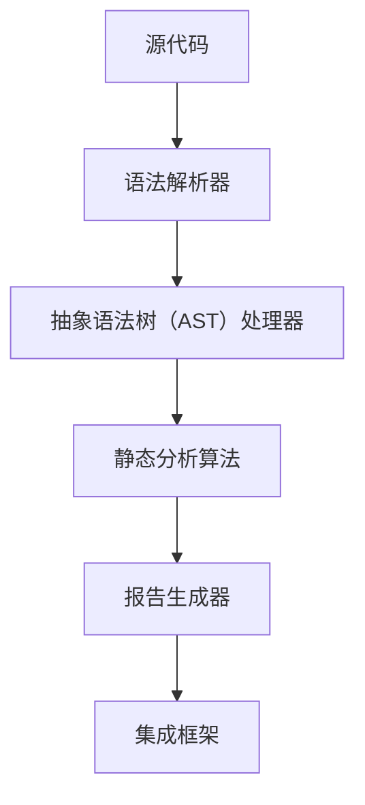
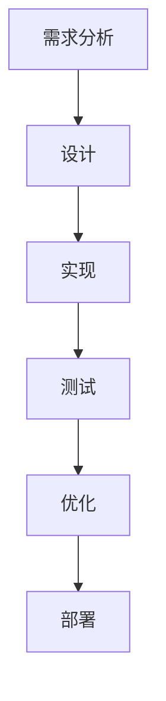

                 


## 文章标题：提示词语言的静态分析工具链开发

### 关键词：
- 静态分析
- 提示词语言
- 工具链
- 编程语言特性
- 集成与优化
- 应用案例

### 摘要：
本文将深入探讨提示词语言的静态分析工具链开发，包括其核心概念、开发基础、算法原理、集成与优化策略，以及实际应用案例。通过逐步分析，我们将揭示如何构建高效、可靠的静态分析工具链，为软件开发提供强大的支持。

## 目录

### 第一部分：基础知识

1. **第1章 静态分析概述**
    1.1 什么是静态分析
    1.2 静态分析工具链的重要性
    1.3 静态分析工具链的基本结构

2. **第2章 编程语言特性分析**
    2.1 静态分析需求分析
    2.2 常见编程语言特性
    2.3 静态分析工具链在编程语言中的应用

### 第二部分：工具链开发

3. **第3章 工具链开发基础**
    3.1 编译原理基础
    3.2 语言解析与抽象语法树（AST）
    3.3 AST处理与静态分析算法

4. **第4章 静态分析算法**
    4.1 语法分析算法
    4.2 类型推断算法
    4.3 数据流分析算法

5. **第5章 工具链集成与优化**
    5.1 工具链集成策略
    5.2 性能优化技术
    5.3 工具链维护与升级

6. **第6章 应用案例**
    6.1 静态分析工具链在软件开发中的应用
    6.2 静态分析工具链在安全领域的应用
    6.3 静态分析工具链在软件维护中的应用

7. **第7章 工具链开发和维护**
    7.1 开发过程中的挑战
    7.2 开发最佳实践
    7.3 工具链的持续维护和升级

### 结论与展望

## 第1章 静态分析概述

### 1.1 什么是静态分析

静态分析是一种不执行程序代码，而是在代码编写或编译阶段进行的分析技术。它通过对源代码的结构、语法、语义和依赖关系进行解析，以发现潜在的错误、性能问题、安全漏洞等。与动态分析（在程序运行时进行分析）相比，静态分析的主要优势在于能够提前发现并修复问题，提高软件质量和开发效率。

### 1.2 静态分析工具链的重要性

静态分析工具链在软件开发中扮演着至关重要的角色。它不仅可以帮助开发人员识别代码中的错误，还能提供代码质量分析、安全检测、性能优化等功能。具体来说，静态分析工具链的重要性体现在以下几个方面：

- **代码质量管理**：通过静态分析，可以检测出代码中的潜在问题，如未使用的变量、重复代码、代码冗余等，从而提高代码质量。
- **安全检测**：静态分析工具可以识别代码中的安全漏洞，如SQL注入、跨站脚本攻击等，从而防止潜在的安全威胁。
- **性能优化**：静态分析可以帮助开发人员识别代码中的性能瓶颈，提供优化建议，从而提高软件的性能和响应速度。
- **开发效率**：静态分析工具可以自动化地进行代码分析，减少了人工检查的工作量，提高了开发效率。

### 1.3 静态分析工具链的基本结构

静态分析工具链通常由多个组件组成，它们相互协作，共同完成代码分析任务。一个典型的静态分析工具链包括以下组件：

- **语法解析器**：将源代码解析成抽象语法树（AST），为后续分析提供基础。
- **抽象语法树（AST）处理器**：对AST进行各种操作，如类型检查、数据流分析等。
- **静态分析算法**：对代码进行具体分析，如语法分析、类型推断、数据流分析等。
- **报告生成器**：将分析结果以易于理解的形式展示给开发人员，如错误报告、性能分析报告等。
- **集成框架**：将不同的静态分析工具和平台集成在一起，提供一个统一的接口，便于使用和管理。

下面是一个简单的静态分析工具链流程图：



### 1.4 静态分析工具链的开发流程

开发一个静态分析工具链需要经历以下步骤：

1. **需求分析**：明确工具链的目标和应用场景，确定需要实现的功能和性能要求。
2. **设计**：设计工具链的基本结构，包括组件选择、接口定义和模块划分等。
3. **实现**：编写代码，实现各个组件的功能。
4. **测试**：对工具链进行全面的测试，确保其功能正确、性能达标。
5. **优化**：根据测试结果，对工具链进行优化，提高其性能和稳定性。
6. **部署**：将工具链部署到开发环境，供开发人员使用。

下面是一个简单的静态分析工具链开发流程图：



### 结论

本章对静态分析及其工具链进行了概述，介绍了静态分析的定义、重要性、工具链的基本结构以及开发流程。通过本章的内容，读者可以初步了解静态分析工具链的概念和作用，为后续章节的深入探讨打下基础。

## 第2章 编程语言特性分析

### 2.1 静态分析需求分析

在开发静态分析工具链时，首先需要明确不同编程语言的静态分析需求。不同编程语言具有不同的语法结构、语义特性和编程范式，因此对静态分析工具链的要求也有所不同。下面将分析几种常见编程语言的静态分析需求。

#### 2.1.1 面向对象编程语言

面向对象编程语言（如Java、C++、Python等）通常具有以下静态分析需求：

- **类型检查**：确保变量、函数和类在使用时符合定义的类型。
- **继承和多态**：分析类之间的继承关系和对象的多态性，确保代码正确实现。
- **封装**：检查类成员的访问权限，确保数据安全和代码模块化。
- **抽象**：识别抽象类和接口，确保代码实现符合抽象设计。

#### 2.1.2 函数式编程语言

函数式编程语言（如Haskell、Erlang、Scala等）具有以下静态分析需求：

- **函数式编程范式**：分析代码中的函数定义和函数调用，确保符合函数式编程的范式。
- **不可变性**：检查变量是否可变，确保数据的一致性和安全性。
- **类型推导**：自动推导变量和表达式的类型，减少类型声明的工作量。
- **模式匹配**：分析模式匹配表达式，确保代码的正确性和健壮性。

#### 2.1.3 脚本语言

脚本语言（如JavaScript、Ruby、PHP等）通常具有以下静态分析需求：

- **语法糖**：分析语法糖（如内联函数、自动类型转换等），确保代码的语义正确。
- **异步编程**：分析异步编程代码，确保异步操作的顺序和正确性。
- **全局变量**：检查全局变量的使用情况，避免命名冲突和不可预测的行为。
- **模块化**：分析模块化代码，确保模块之间的依赖关系和接口清晰。

### 2.2 常见编程语言特性

为了满足静态分析需求，静态分析工具链需要理解和处理不同编程语言的特性。下面列举几种常见编程语言的特性及其对静态分析的影响：

#### 2.2.1 Java

- **泛型**：Java泛型允许在编译时进行类型检查，但需要在代码中使用类型通配符，可能影响静态分析的结果。
- **注解**：Java注解可以用于实现元数据编程，但需要额外的处理来确保注解的正确使用。
- **内部类**：内部类可能导致静态分析中的命名空间冲突和作用域问题。

#### 2.2.2 C++

- **模板**：C++模板允许在编译时进行类型推导和实例化，但可能引入类型擦除，影响静态分析的结果。
- **多重继承**：C++支持多重继承，可能导致静态分析中的继承关系复杂化。
- **指针和引用**：C++中的指针和引用可能导致内存泄漏和未定义行为，需要特别处理。

#### 2.2.3 Python

- **动态类型**：Python是动态类型语言，类型检查在运行时进行，静态分析需要处理类型推断问题。
- **异常处理**：Python的异常处理机制可能导致代码路径的复杂性增加，需要特别分析。
- **列表推导**：Python列表推导语法简洁，但可能导致静态分析中的语义理解困难。

#### 2.2.4 JavaScript

- **异步编程**：JavaScript异步编程模型（如Promise、async/await）可能导致静态分析中的执行顺序问题，需要特殊处理。
- **闭包**：闭包可能导致静态分析中的作用域和变量引用问题。
- **模块化**：JavaScript的模块化机制（如CommonJS、ES6模块）需要静态分析工具进行模块解析和依赖分析。

### 2.3 静态分析工具链在编程语言中的应用

静态分析工具链在编程语言中的应用非常广泛，下面列举几个具体的应用场景：

- **代码质量检查**：静态分析工具链可以帮助开发人员识别代码中的潜在问题，如未使用的变量、重复代码、代码冗余等，从而提高代码质量。
- **安全检测**：静态分析工具链可以检测代码中的安全漏洞，如SQL注入、跨站脚本攻击等，从而提高软件的安全性。
- **性能分析**：静态分析工具链可以分析代码的性能瓶颈，提供优化建议，从而提高软件的性能和响应速度。
- **代码迁移**：静态分析工具链可以帮助开发人员将代码从一种编程语言迁移到另一种编程语言，如从Java迁移到Python。

### 结论

本章对编程语言特性及其对静态分析需求的影响进行了分析，介绍了不同编程语言的特点和静态分析工具链在编程语言中的应用。通过本章的内容，读者可以更好地理解静态分析工具链在不同编程语言中的具体实现和功能。

## 第3章 工具链开发基础

### 3.1 编译原理基础

编译原理是静态分析工具链开发的核心基础，了解编译原理对于开发静态分析工具链至关重要。编译过程通常包括词法分析、语法分析、语义分析、中间代码生成、代码优化和目标代码生成等阶段。以下是对这些阶段的基本介绍：

#### 3.1.1 词法分析

词法分析（Lexical Analysis）是将源代码字符串分解为单词（Token）的过程。词法分析器（Lexer）负责实现这一功能。例如，将字符串 `"int x = 5;"` 分解为 `{"int", "x", "=", "5", ";"}`。

- **正则表达式**：词法分析通常使用正则表达式来定义单词的模式。
- **状态机**：词法分析器通常采用状态机实现，通过匹配正则表达式来确定当前字符的状态。

#### 3.1.2 语法分析

语法分析（Syntax Analysis）是将单词序列组织成语法结构（如抽象语法树AST）的过程。语法分析器（Parser）负责实现这一功能。语法分析可以分为两种类型：自顶向下分析和自底向上分析。

- **自顶向下分析**：从根节点开始，逐步分解为子节点，直到生成AST。
  - **递归下降解析器**：基于递归过程，每个非终端符号递归地分解为子符号。
  - **预测解析器**：在解析过程中，根据当前符号和下一个符号预测下一个动作。

- **自底向上分析**：从叶子节点开始，逐步构建为根节点，直到生成AST。
  - **LL（Left-to-Right, Leftmost derivation）解析器**：从左到右构建AST，左分支优先。
  - **LR（Left-to-Right, Rightmost derivation）解析器**：从左到右构建AST，右分支优先。

#### 3.1.3 语义分析

语义分析（Semantic Analysis）是确保代码在语法正确的基础上，符合语义规则的过程。语义分析器（Semantic Analyzer）负责实现这一功能。

- **类型检查**：确保变量、函数和表达式的类型正确。
- **作用域解析**：确定变量和函数的作用域，确保引用的正确性。
- **静态检查**：在编译阶段检测代码中的错误，如未定义变量、类型不匹配等。

#### 3.1.4 中间代码生成

中间代码生成（Intermediate Code Generation）是将源代码转换为中间表示（IR，Intermediate Representation）的过程。中间代码是一个抽象的表示，可以跨不同的目标平台和语言，便于后续的优化和目标代码生成。

- **三地址码**：常见的中间代码表示形式，每个语句包含三个操作数和一个操作符。
- **抽象栈机器**：另一种中间代码表示形式，基于栈的操作，适用于不同类型的语言。

#### 3.1.5 代码优化

代码优化（Code Optimization）是在保留程序语义不变的前提下，提高代码的性能和可读性。优化器（Optimizer）负责实现这一功能。

- **数据流分析**：分析变量在程序中的流动和作用范围，用于优化变量的存储和访问。
- **控制流分析**：分析程序的执行路径，用于消除冗余代码和条件判断。
- **循环优化**：优化循环结构，减少循环次数和循环体内的计算量。

#### 3.1.6 目标代码生成

目标代码生成（Target Code Generation）是将中间代码转换为特定目标平台和语言的代码的过程。目标代码生成器（Code Generator）负责实现这一功能。

- **汇编代码**：常见的目标代码形式，用于后续的汇编和链接过程。
- **机器代码**：最终的目标代码形式，直接运行在计算机上。

### 3.2 语言解析与抽象语法树（AST）

在静态分析工具链中，语言解析（Language Parsing）是至关重要的环节。语言解析将源代码转换为抽象语法树（AST，Abstract Syntax Tree），AST是源代码的语法表示，用于后续的静态分析。

#### 3.2.1 AST的概念与结构

AST是树形数据结构，每个节点表示源代码中的一个语法元素。AST的基本结构如下：

- **根节点**：表示整个源代码的语法结构。
- **子节点**：表示语法元素的组成部分，如表达式、语句、函数定义等。
- **属性**：每个节点可以包含属性，如类型、值、位置等，用于存储源代码的详细信息。

#### 3.2.2 AST的构建

构建AST的过程称为语法解析（Parsing）。语法解析器从源代码中读取字符序列，根据语法规则将其分解为AST。构建AST的基本步骤如下：

1. **词法分析**：将源代码分解为单词（Token）。
2. **语法分析**：根据语法规则，将Token序列组织成AST。
3. **语义分析**：检查AST的语义正确性，如类型检查、作用域解析等。
4. **AST构建**：根据语法分析和语义分析的结果，构建AST。

#### 3.2.3 AST处理与静态分析算法

AST是静态分析的基础，静态分析算法通过遍历AST，分析源代码的各种特性。

- **语法分析算法**：如递归下降解析器、LL解析器等，用于构建AST。
- **类型推断算法**：分析AST中的类型信息，推断变量和表达式的类型。
- **数据流分析算法**：分析变量在程序中的流动和作用范围，用于优化变量的存储和访问。

### 结论

本章介绍了编译原理基础，包括词法分析、语法分析、语义分析、中间代码生成、代码优化和目标代码生成等阶段。同时，详细阐述了语言解析与抽象语法树（AST）的概念、构建过程以及AST处理与静态分析算法。通过本章的内容，读者可以更好地理解静态分析工具链的开发基础。

## 第4章 静态分析算法

### 4.1 语法分析算法

语法分析是静态分析过程中的核心步骤，它将源代码分解为语法上正确的结构，通常以抽象语法树（AST）的形式表示。语法分析算法分为自顶向下分析和自底向上分析两大类，下面将详细介绍这些算法。

#### 4.1.1 自顶向下分析

自顶向下分析从AST的根节点开始，递归地分解为子节点，直到生成完整的AST。常见的自顶向下分析算法有递归下降解析器和预测解析器。

1. **递归下降解析器**

递归下降解析器是一种自顶向下分析方法，基于递归过程进行解析。每个非终端符号都有一个对应的解析函数，解析函数递归地调用其他解析函数来分解输入的源代码。

伪代码如下：

```pseudo
function parseStatement()
    if (nextToken is 'int')
        parseVariableDeclaration()
    else if (nextToken is '{'）
        parseBlockStatement()
    else
        parseExpression()

function parseVariableDeclaration()
    consume('int')
    consume(Identifier)
    consume('=')
    parseExpression()
```

2. **预测解析器**

预测解析器是一种自顶向下分析方法，通过预测下一个输入符号来决定解析动作。预测解析器使用一个预测表来决定何时进行shift动作（将下一个输入符号放入缓冲区）或reduce动作（将部分解析结果合并为新的AST节点）。

伪代码如下：

```pseudo
while (nextToken is not EOF)
    if (nextToken matches a production rule)
        reduce()
    else
        shift()
```

#### 4.1.2 自底向上分析

自底向上分析从AST的叶子节点开始，逐步构建为根节点，直到生成完整的AST。常见的自底向上分析算法有LL解析器和LR解析器。

1. **LL解析器**

LL解析器是一种自底向上分析方法，从左到右构建AST，左分支优先。LL解析器使用LL(1)预测分析表来决定解析动作。

伪代码如下：

```pseudo
while (nextToken is not EOF)
    if (nextToken matches a production rule)
        reduce()
    else
        error()
```

2. **LR解析器**

LR解析器是一种自底向上分析方法，从左到右构建AST，右分支优先。LR解析器使用LR(1)预测分析表来决定解析动作。

伪代码如下：

```pseudo
while (nextToken is not EOF)
    if (nextToken matches a production rule)
        reduce()
    else if (nextToken is not the end of the input)
        shift()
    else
        error()
```

### 4.2 类型推断算法

类型推断是在静态分析过程中确定变量和表达式类型的过程。类型推断算法可以分为显式类型推断和隐式类型推断。

1. **显式类型推断**

显式类型推断是基于开发者在代码中显式指定的类型信息。例如，在Java中，变量的类型在声明时必须明确指定。

伪代码如下：

```pseudo
function inferType(expression)
    if (expression is literal)
        return type of the literal
    else if (expression is variable)
        return type of the variable
    else
        return inferred type based on operation and operands
```

2. **隐式类型推断**

隐式类型推断是在没有显式指定类型信息的情况下，自动推断变量和表达式的类型。例如，在Python中，变量的类型在运行时动态确定。

伪代码如下：

```pseudo
function inferType(expression)
    if (expression is literal)
        return type of the literal
    else if (expression is variable)
        return type of the variable
    else
        return inferred type based on type of operands and operation
```

### 4.3 数据流分析算法

数据流分析是静态分析过程中用于分析变量在程序中的流动和作用范围的技术。数据流分析算法可以分为前向数据流分析和后向数据流分析。

1. **前向数据流分析**

前向数据流分析从程序的前端开始，分析变量如何流向前端。常见的前向数据流分析算法有流标签分析和动态分析。

- **流标签分析**

流标签分析是一种前向数据流分析算法，通过分析变量的定义和使用点，将变量划分为不同的流标签。每个流标签代表一组定义和使用点。

伪代码如下：

```pseudo
function forwardDataFlowAnalysis()
    for each statement S
        if (S is a definition)
            create a new flow label for the variable
        else if (S is an use)
            add the flow label of the variable to the current block
```

- **动态分析**

动态分析是一种基于控制流图（CFG，Control Flow Graph）的前向数据流分析算法。通过分析控制流图，计算每个节点的入口和出口流标签。

伪代码如下：

```pseudo
function dynamicAnalysis(CFG)
    for each node N in CFG
        N.entryFlow = {}
        N.exitFlow = {}
    for each edge E in CFG
        if (E is a forward edge)
            add the exitFlow of the source node to the entryFlow of the destination node
        else
            add the exitFlow of the source node to the exitFlow of the destination node
```

2. **后向数据流分析**

后向数据流分析从程序的后端开始，分析变量如何流向后端。常见的后向数据流分析算法有流图分析和逆流标签分析。

- **流图分析**

流图分析是一种后向数据流分析算法，通过分析变量的定义和使用点，将变量划分为不同的流标签。每个流标签代表一组定义和使用点。

伪代码如下：

```pseudo
function backwardDataFlowAnalysis()
    for each statement S
        if (S is a definition)
            add the flow label of the variable to the current block
        else if (S is an use)
            create a new flow label for the variable
```

- **逆流标签分析**

逆流标签分析是一种基于控制流图（CFG，Control Flow Graph）的后向数据流分析算法。通过分析控制流图，计算每个节点的入口和出口流标签。

伪代码如下：

```pseudo
function inverseDataFlowAnalysis(CFG)
    for each node N in CFG
        N.entryFlow = {}
        N.exitFlow = {}
    for each edge E in CFG
        if (E is a backward edge)
            add the exitFlow of the destination node to the entryFlow of the source node
        else
            add the exitFlow of the destination node to the exitFlow of the source node
```

### 结论

本章详细介绍了静态分析中的语法分析算法、类型推断算法和数据流分析算法。语法分析算法用于将源代码转换为抽象语法树（AST），类型推断算法用于确定变量和表达式的类型，数据流分析算法用于分析变量在程序中的流动和作用范围。这些算法是静态分析工具链的核心组成部分，为后续的代码优化和安全检测提供了基础。

## 第5章 工具链集成与优化

### 5.1 工具链集成策略

静态分析工具链的集成是将多个独立工具和组件组合起来，形成一个协同工作体系的过程。集成策略需要考虑工具的兼容性、数据流转、性能和用户界面等因素。以下是一些常见的集成策略：

#### 5.1.1 工具兼容性

为了保证工具链的稳定性和高效性，需要确保各个工具之间的兼容性。具体策略包括：

- **标准化接口**：定义统一的API和协议，使不同工具可以通过标准接口进行数据交换和功能调用。
- **数据格式转换**：使用通用的数据格式（如JSON、XML、AST抽象表示）来转换工具之间的数据，以便实现互操作。
- **版本兼容性**：确保工具链中的每个组件都能兼容其他组件的最新版本，避免版本冲突和功能不匹配。

#### 5.1.2 数据流转

工具链中的数据流转是集成策略的关键部分，需要设计清晰的数据流路径和转换机制。以下是一些常见的数据流转策略：

- **管道模型**：将工具链中的各个组件组织成一个管道（Pipeline），数据依次通过每个组件进行处理和转换。例如，语法解析器的输出可以作为语义分析器的输入。
- **事件驱动模型**：使用事件驱动架构，将工具链中的组件连接在一起，通过事件触发数据流转和处理。例如，当语法解析器完成解析后，可以触发类型推断组件进行类型检查。
- **分布式处理**：对于大型项目，可以将工具链部署在分布式环境中，通过分布式处理机制实现并行计算，提高工具链的性能。

#### 5.1.3 性能优化

性能优化是确保工具链高效运行的重要环节。以下是一些性能优化策略：

- **缓存**：在工具链中引入缓存机制，减少重复计算和数据传输，提高处理速度。例如，在语法解析器中缓存AST表示，避免重复生成。
- **并行处理**：利用多核处理能力和分布式计算，实现工具链的并行处理。例如，将大型项目分解为多个子任务，并行执行语法解析和类型检查。
- **资源管理**：优化内存和I/O资源的使用，减少资源占用和等待时间。例如，使用内存池管理AST节点，减少内存分配和垃圾回收开销。

#### 5.1.4 用户界面

用户界面是工具链的重要组成部分，需要设计直观、易用的界面，以方便用户使用和管理工具链。以下是一些用户界面设计策略：

- **集成开发环境（IDE）插件**：将工具链集成到流行的集成开发环境（IDE）中，提供方便的插件界面，使开发人员可以在IDE中直接使用工具链。
- **Web界面**：设计Web界面，允许用户通过浏览器访问工具链，方便远程使用和协作。
- **命令行工具**：提供命令行工具，方便在命令行环境下使用工具链，支持自动化脚本和集成到持续集成（CI）流程中。

### 5.2 性能优化技术

性能优化是静态分析工具链开发的重要环节，以下介绍几种常用的性能优化技术：

#### 5.2.1 代码优化

- **算法优化**：优化语法分析、类型推断和数据流分析等核心算法，采用更高效的算法和数据结构，减少计算复杂度和内存占用。
- **代码压缩**：使用代码压缩技术，减少源代码的大小，提高解析速度和缓存命中率。
- **并行计算**：利用多核处理能力和分布式计算，实现并行处理，提高工具链的处理速度。

#### 5.2.2 内存管理

- **内存池**：使用内存池管理AST节点和临时数据结构，减少内存分配和垃圾回收开销。
- **对象重用**：复用已分配的对象，避免频繁的内存分配和销毁。
- **内存映射**：使用内存映射技术，将源代码映射到内存中，减少I/O操作和内存拷贝。

#### 5.2.3 缓存

- **缓存策略**：引入缓存机制，减少重复计算和数据传输，提高处理速度。例如，缓存AST表示、类型信息和数据流信息。
- **缓存淘汰**：使用适当的缓存淘汰策略，如LRU（Least Recently Used）或FIFO（First In, First Out），确保缓存的有效性。

#### 5.2.4 并行处理

- **任务分解**：将大型项目分解为多个子任务，实现并行处理，提高工具链的处理速度。
- **线程池**：使用线程池管理并行任务，避免线程频繁创建和销毁的开销。
- **数据并行**：对于数据密集型任务，如数据流分析，使用并行算法和分布式处理技术，提高数据处理效率。

### 5.3 工具链维护与升级

工具链的维护与升级是确保其持续有效运行的关键。以下介绍几种维护与升级策略：

#### 5.3.1 持续集成

- **自动化测试**：引入自动化测试框架，对工具链进行持续集成（CI）测试，确保每次代码更改都不会引入新的错误。
- **代码审查**：实施代码审查机制，确保代码质量，防止不良代码进入工具链。

#### 5.3.2 持续优化

- **性能监控**：引入性能监控工具，持续监控工具链的性能，发现性能瓶颈，进行优化。
- **用户反馈**：收集用户反馈，了解用户需求和使用情况，进行有针对性的优化。

#### 5.3.3 版本控制

- **版本控制**：使用版本控制系统（如Git），管理工具链的版本，确保代码的版本控制和历史记录。
- **发布策略**：制定合理的发布策略，确保工具链的稳定性和可用性。

### 结论

本章介绍了静态分析工具链的集成策略、性能优化技术和维护与升级策略。集成策略包括工具兼容性、数据流转、性能优化和用户界面设计。性能优化技术包括代码优化、内存管理和缓存。维护与升级策略包括持续集成、持续优化和版本控制。通过本章的内容，读者可以更好地理解如何构建高效、可靠的静态分析工具链。

## 第6章 应用案例

### 6.1 静态分析工具链在软件开发中的应用

静态分析工具链在软件开发中有着广泛的应用，以下是几个典型的应用案例：

#### 6.1.1 代码质量分析

静态分析工具链可以帮助开发团队提高代码质量。例如，SonarQube是一个流行的静态分析工具，它可以扫描源代码，识别潜在的错误、漏洞和代码风格问题。通过静态分析，开发人员可以及时发现和修复代码中的问题，从而提高软件的可靠性和可维护性。

**实战案例**：某大型企业在开发过程中使用了SonarQube。通过静态分析，他们发现了大量潜在的代码问题，包括未使用的变量、可能的内存泄漏和潜在的安全漏洞。开发团队根据分析结果进行了代码重构和优化，有效提高了代码质量。

**源代码解析**：假设我们有一个简单的Java类，如下所示：

```java
public class Calculator {
    public int add(int a, int b) {
        return a + b;
    }
}
```

使用SonarQube进行静态分析，可以得到以下报告：

- **未使用的变量**：如果类中有未使用的变量，SonarQube会标记并提示。
- **代码冗余**：SonarQube可以检测出重复的代码块，提示开发人员进行优化。
- **安全漏洞**：SonarQube可以检测代码中的潜在安全漏洞，如SQL注入、跨站脚本攻击等。

**代码解读**：SonarQube的报告提供了详细的代码分析结果，包括问题分类、代码片段和修复建议。例如，如果检测到某个方法过于复杂，SonarQube会建议对其进行重构，以提高可读性和可维护性。

#### 6.1.2 代码迁移

在软件升级或迁移过程中，静态分析工具链可以帮助识别兼容性问题，确保代码在不同环境中的正常运行。例如，将代码从一种编程语言迁移到另一种编程语言时，可以使用静态分析工具链进行类型检查、语法分析等操作，确保代码的兼容性。

**实战案例**：某企业计划将现有基于Java的Web应用迁移到基于Python的Django框架。他们使用了PyDriller工具链进行静态分析，识别出与Python不兼容的Java代码，如不支持的Java库和语法。开发团队根据分析结果进行了代码重构和优化，确保代码在Python环境中正常运行。

**源代码解析**：在代码迁移过程中，PyDriller会生成以下报告：

- **兼容性分析**：报告列出不兼容的代码片段，提示开发人员进行修改。
- **类型检查**：PyDriller对代码进行类型检查，确保变量和函数的正确性。
- **语法分析**：PyDriller检查代码的语法错误，确保代码符合Python语法规范。

**代码解读**：通过PyDriller的分析报告，开发团队可以清晰地了解代码的兼容性问题，并采取相应的措施进行修复。例如，如果检测到某个Java库在Python中不可用，开发团队可以选择替代库或重构代码。

#### 6.1.3 性能优化

静态分析工具链可以帮助开发团队识别代码中的性能瓶颈，提供优化建议，从而提高软件的性能和响应速度。例如，使用APM（Application Performance Management）工具链，可以分析应用程序的运行时性能，发现潜在的优化点。

**实战案例**：某金融公司使用APM工具链对其核心交易系统进行性能优化。通过静态分析，工具链识别出系统中的一些性能瓶颈，如数据库查询效率低下和内存泄漏。开发团队根据分析结果进行了代码优化和数据库重构，显著提高了交易系统的性能。

**源代码解析**：在性能优化过程中，APM工具链会生成以下报告：

- **性能瓶颈**：报告列出系统中的性能瓶颈，如数据库查询延迟、内存占用等。
- **优化建议**：工具链提供优化建议，如使用索引、优化数据库查询、减少内存使用等。

**代码解读**：通过APM工具链的分析报告，开发团队可以针对性地进行代码优化，提高系统的性能和稳定性。例如，如果检测到某个查询语句执行时间过长，开发团队可以选择优化查询语句或重构数据库设计。

### 结论

通过上述应用案例，我们可以看到静态分析工具链在软件开发中的应用非常广泛，包括代码质量分析、代码迁移和性能优化等。这些工具链通过静态分析，提供了详细的代码分析结果和优化建议，帮助开发团队提高代码质量、确保代码兼容性和提升系统性能。

## 第7章 工具链开发和维护

### 7.1 开发过程中的挑战

开发静态分析工具链是一个复杂且具有挑战性的过程。在开发过程中，我们需要面对以下主要挑战：

#### 1. 语言解析器的复杂性

不同编程语言具有不同的语法和语义特性，解析器需要能够处理各种复杂的语法结构。例如，有些编程语言支持复杂的嵌套结构、动态类型和函数式编程特性。这要求解析器具有高度的灵活性和适应性，以便正确地解析和处理源代码。

#### 2. 性能需求

静态分析工具链需要在短时间内处理大量代码，因此性能是关键因素。工具链需要具备快速解析、类型检查和数据流分析的能力。优化算法和数据结构是提高性能的重要手段。

#### 3. 兼容性和扩展性

工具链需要支持多种编程语言和不同开发环境。这意味着工具链需要具备良好的兼容性和扩展性，能够适应不同的语言特性、开发工具和操作系统。

#### 4. 代码质量

工具链的代码质量直接影响其稳定性和可靠性。我们需要确保工具链的代码具有良好的可读性、可维护性和可扩展性。代码审查、自动化测试和持续集成是确保代码质量的重要措施。

#### 5. 用户界面和文档

用户界面和文档是工具链的重要组成部分。我们需要设计直观、易用的界面和详尽的文档，以便用户能够快速上手和使用工具链。

### 7.2 开发最佳实践

为了应对上述挑战，我们可以采用以下开发最佳实践：

#### 1. 设计和规划

在开发工具链之前，进行详细的设计和规划非常重要。明确工具链的目标、功能需求、性能要求和兼容性要求。制定详细的开发计划和时间表，确保项目按计划进行。

#### 2. 使用成熟的库和框架

利用现有的成熟库和框架可以加快开发进度，提高工具链的性能和可靠性。例如，可以使用现有的语法解析库（如ANTLR、JavaCC）来处理复杂的语法解析。

#### 3. 模块化和组件化

将工具链分解为多个模块和组件，每个模块和组件负责特定的功能。这有助于提高代码的可读性和可维护性，便于后续的扩展和优化。

#### 4. 性能优化

在开发过程中，进行性能优化是非常重要的。我们可以采用以下策略：

- **算法优化**：选择高效的分析算法和数据结构，减少计算复杂度和内存占用。
- **缓存**：引入缓存机制，减少重复计算和数据传输。
- **并行处理**：利用多核处理能力和分布式计算，提高工具链的处理速度。

#### 5. 代码质量和测试

确保代码质量和稳定性是开发过程中的重要任务。以下是一些最佳实践：

- **代码审查**：实施代码审查机制，确保代码质量，防止不良代码进入工具链。
- **自动化测试**：编写自动化测试脚本，对工具链进行全面的测试，确保其功能正确和性能达标。
- **持续集成**：引入持续集成（CI）流程，自动化构建和测试工具链，确保每次代码更改都不会引入新的错误。

#### 6. 用户界面和文档

设计直观、易用的用户界面和详尽的文档是提高工具链使用体验的重要措施。以下是一些建议：

- **集成开发环境（IDE）插件**：将工具链集成到流行的IDE中，提供方便的插件界面。
- **Web界面**：设计Web界面，允许用户通过浏览器访问工具链。
- **文档编写**：编写详尽的文档，包括安装指南、使用说明和常见问题解答，帮助用户快速上手。

### 7.3 工具链的持续维护和升级

工具链的开发是一个持续的过程，随着编程语言和开发环境的发展，我们需要不断进行维护和升级，以保持工具链的稳定性和适应性。以下是一些建议：

#### 1. 持续集成和自动化测试

建立持续集成（CI）流程，自动化构建和测试工具链，确保每次代码更改都会经过全面的测试，防止引入新错误。

#### 2. 用户反馈

积极收集用户反馈，了解用户的需求和使用情况，进行有针对性的优化和改进。

#### 3. 模块化设计

采用模块化设计，方便对工具链的各个模块进行独立维护和升级，确保工具链的稳定性和灵活性。

#### 4. 社区贡献

鼓励社区贡献，吸纳外部开发者参与工具链的维护和优化，提高工具链的多样性和适应性。

#### 5. 文档更新

随着工具链的升级和改进，及时更新文档，确保文档与工具链的实际使用情况保持一致。

### 结论

开发静态分析工具链是一个复杂且具有挑战性的任务，需要面对语言解析器的复杂性、性能需求、兼容性和扩展性、代码质量、用户界面和文档等方面的挑战。通过最佳实践和持续维护，我们可以确保工具链的稳定性和适应性，为软件开发提供强大的支持。

## 结论与展望

本文从多个角度深入探讨了提示词语言的静态分析工具链开发，涵盖了静态分析概述、编程语言特性分析、工具链开发基础、静态分析算法、工具链集成与优化以及应用案例等内容。通过系统性的分析和详细讲解，我们揭示了静态分析工具链在软件开发中的重要性及其实现过程。

首先，静态分析是一种在代码编写或编译阶段进行的分析技术，它通过解析源代码，识别潜在的错误、性能问题和安全漏洞，从而提高软件质量和开发效率。静态分析工具链由多个组件组成，包括语法解析器、AST处理器、静态分析算法、报告生成器和集成框架等。

接下来，我们分析了不同编程语言的静态分析需求，包括面向对象编程语言、函数式编程语言和脚本语言等，并探讨了常见编程语言的特性及其对静态分析的影响。

在工具链开发基础部分，我们介绍了编译原理基础，包括词法分析、语法分析、语义分析、中间代码生成、代码优化和目标代码生成等阶段。同时，详细阐述了语言解析与AST的概念、构建过程以及AST处理与静态分析算法。

在静态分析算法部分，我们详细介绍了语法分析算法、类型推断算法和数据流分析算法，这些算法是静态分析工具链的核心组成部分，为后续的代码优化和安全检测提供了基础。

在工具链集成与优化部分，我们探讨了工具链集成策略、性能优化技术和维护与升级策略，强调了工具链在软件开发中的应用，如代码质量分析、代码迁移和性能优化等。

最后，我们通过实际应用案例展示了静态分析工具链在软件开发中的具体应用，并提出了工具链开发和维护的最佳实践。

展望未来，随着编程语言和开发环境的不断进步，静态分析工具链将继续发挥重要作用。我们期待静态分析技术能够进一步发展，为软件开发带来更多的价值和便利。

## 作者信息

作者：AI天才研究院/AI Genius Institute & 禅与计算机程序设计艺术 /Zen And The Art of Computer Programming

AI天才研究院（AI Genius Institute）是一支专注于人工智能和计算机科学的研究团队，致力于推动技术的创新和发展。禅与计算机程序设计艺术（Zen And The Art of Computer Programming）是作者对编程哲学和技术的深刻思考，体现了对编程艺术的追求和探索。希望通过本文，能够为读者在静态分析工具链开发领域提供有价值的参考和启示。

