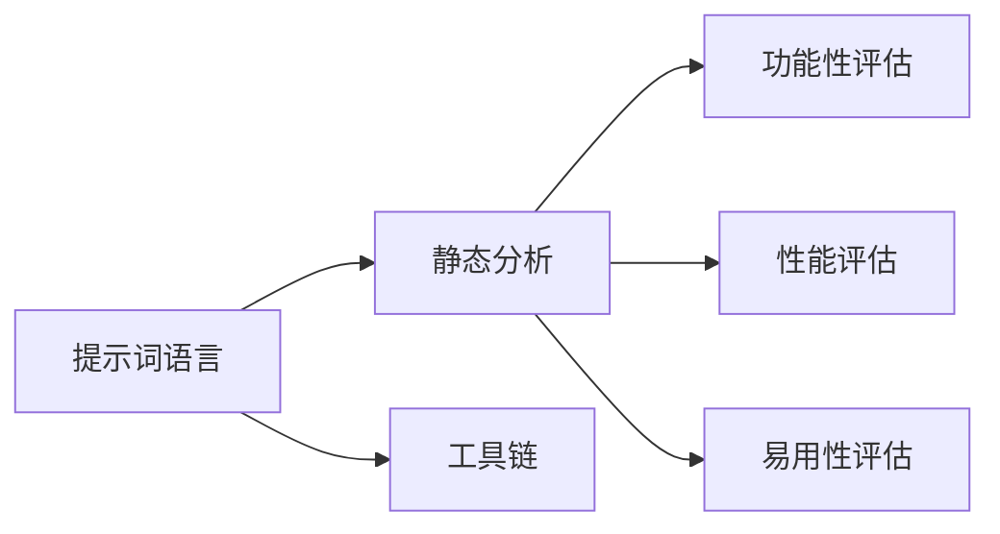

                 

# 提示词语言的静态分析工具链评估

## 关键词

- 提示词语言
- 静态分析
- 工具链
- 功能性评估
- 性能评估
- 易用性评估

## 摘要

本文旨在对提示词语言的静态分析工具链进行全面的评估。首先，我们将介绍提示词语言及其在软件工程中的重要性。随后，我们将定义核心概念，包括提示词语言、静态分析和工具链，并展示它们之间的关系架构。接着，我们将深入讲解核心算法原理，包括词法分析、语法分析、语义分析和性能优化。此外，我们还将讨论数学模型和公式在静态分析工具链中的应用，并给出详细的举例说明。最后，我们将总结最佳实践，并提供相关的注意事项和拓展阅读。

## 概念与架构

### 提示词语言及其重要性

提示词语言是一种用于描述程序行为的语言。在软件工程中，提示词语言具有至关重要的地位。一方面，它使得程序员能够以清晰、简洁的方式描述程序的逻辑和行为；另一方面，它为静态分析工具提供了基本的输入，使得工具能够对程序进行深入的分析和优化。

随着软件系统规模的不断扩大和复杂性的不断增加，对提示词语言的静态分析工具链的需求也越来越高。通过静态分析，我们可以提前发现潜在的错误和性能瓶颈，从而提高软件的质量和效率。因此，对提示词语言静态分析工具链的评估具有重要意义。

### 核心概念

#### 提示词语言

提示词语言是一种形式化的语言，用于描述程序的结构和语义。它通常包括一系列的词汇和语法规则。例如，C语言就是一种提示词语言，它使用关键字、标识符、运算符和分隔符等词汇，并遵循特定的语法规则。

#### 静态分析

静态分析是一种在程序运行之前对程序进行分析的方法。它不需要实际运行程序，而是通过解析程序文本，生成某种形式的表示，例如抽象语法树（AST）。静态分析可以帮助我们了解程序的结构、语义和潜在的缺陷。

#### 工具链

工具链是一系列相关工具的组合，用于完成特定的任务。在提示词语言的静态分析中，工具链通常包括词法分析器、语法分析器、语义分析器和优化器等。这些工具协同工作，对提示词语言进行深入的分析和优化。

### 评估架构

为了对提示词语言的静态分析工具链进行全面评估，我们可以从以下几个方面进行：

#### 功能性评估

功能性评估主要关注工具链是否能够正确地分析提示词语言。这包括：

- 是否能够正确地解析和识别提示词语言的词汇和语法规则。
- 是否能够生成正确的抽象语法树（AST）。
- 是否能够对AST进行正确的语义检查。

#### 性能评估

性能评估主要关注工具链的分析速度和内存占用。这包括：

- 分析速度：工具链在给定时间内的处理能力。
- 内存占用：工具链在运行过程中占用的内存大小。

#### 易用性评估

易用性评估主要关注工具链的用户友好性。这包括：

- 用户界面：工具链是否提供直观、易用的用户界面。
- 文档和教程：工具链是否提供详细的文档和教程，帮助用户快速上手。
- 社区和支持：工具链是否拥有活跃的社区和支持团队，提供及时的技术支持。

### 关联与评估架构

下面是一个用Mermaid流程图展示的核心概念关联及评估架构：



## 算法原理

### 词法分析

词法分析是将提示词语言分解为单词和符号的过程。它是静态分析的基础，负责将输入的字符串形式的代码转化为一系列的词法单元（tokens）。词法分析的过程可以概括为以下步骤：

1. **输入处理**：读取输入的代码字符串。
2. **字符流生成**：遍历代码字符串，生成一个字符流。
3. **单词和符号识别**：根据提示词语言的词汇和语法规则，识别单词和符号，并将其转化为词法单元。
4. **词法单元输出**：将词法单元输出，供后续的语法分析使用。

### 语法分析

语法分析是根据提示词语言的语法规则，将词法分析结果构建成抽象语法树（AST）的过程。它是静态分析的核心，负责将词法单元组织成具有层次结构的语法结构。语法分析的过程可以概括为以下步骤：

1. **词法单元输入**：接收词法分析器输出的词法单元。
2. **语法规则应用**：根据提示词语言的语法规则，对词法单元进行分组和组织，构建AST。
3. **AST输出**：生成抽象语法树（AST），供后续的语义分析和优化使用。

### 语义分析

语义分析是对抽象语法树（AST）进行语义检查的过程，确保程序的语义正确性。它是静态分析的重要环节，负责检查程序的语法和语义是否符合预期的定义。语义分析的过程可以概括为以下步骤：

1. **AST输入**：接收语法分析器输出的抽象语法树（AST）。
2. **类型检查**：检查AST中的变量、函数和表达式是否具有正确的类型。
3. **作用域检查**：检查AST中的变量和函数是否在正确的作用域内被引用。
4. **语义规则应用**：应用语义规则，确保AST的语义正确性。
5. **错误报告**：在发现错误时，生成错误报告，提示程序员进行修正。

### 性能优化

性能优化是根据静态分析的结果，对程序进行性能优化的过程。它旨在提高程序的运行效率，减少内存占用，提高程序的响应速度。性能优化的过程可以概括为以下步骤：

1. **AST输入**：接收语义分析器输出的抽象语法树（AST）。
2. **代码重构**：根据性能优化的规则，对AST进行重构，生成优化后的代码。
3. **代码输出**：生成优化后的代码，供编译器和运行时环境使用。

### 伪代码实现

下面是静态分析工具链的伪代码实现：

```plaintext
function staticAnalysis(code):
    tokens = lexicalAnalysis(code)
    ast = syntacticAnalysis(tokens)
    semanticCheck(ast)
    return optimizedCode = performanceOptimization(ast)

function lexicalAnalysis(code):
    // 输入：字符串形式的代码
    // 输出：单词和符号的列表
    // 实现：扫描代码，将代码分解为单词和符号

function syntacticAnalysis(tokens):
    // 输入：单词和符号的列表
    // 输出：抽象语法树（AST）
    // 实现：根据语法规则，构建AST

function semanticCheck(ast):
    // 输入：抽象语法树（AST）
    // 输出：无
    // 实现：检查AST的语义，确保程序的语义正确性

function performanceOptimization(ast):
    // 输入：抽象语法树（AST）
    // 输出：优化后的代码
    // 实现：根据分析结果，对程序进行性能优化
```

## 数学模型和公式

### 文法规则

文法规则用于描述提示词语言的语法。它通常包括一系列的产生式，定义了如何从单词和符号构建出合法的语法结构。例如，C语言的文法规则可以定义如下：

```
S → aS | b
A → a
B → b
```

### 上下文无关文法（CFG）

上下文无关文法（CFG）是一种形式化的语法描述方法，用于定义抽象语法树（AST）的结构。它由四个元素组成：变量集合（V）、词汇集合（Σ）、产生式集合（Productions）和开始符号（S）。CFG可以表示为 G = (V, Σ, Productions, S)。

### 语义规则

语义规则用于定义程序的语义。它描述了如何根据语法结构执行特定的操作。语义规则通常用自然语言或形式化的语言（如动作文法）来表示。例如，在C语言中，我们可以定义以下语义规则：

```
变量 → 值
表达式 → 操作符（表达式，表达式）
函数调用 → 函数名（参数列表）
```

### 运行时间复杂度

运行时间复杂度用于评估算法的性能。它描述了算法在输入规模增加时，运行时间的增长速度。通常用大O符号（O）表示，例如 O(n) 表示算法的时间复杂度为线性时间。

下面是使用LaTeX格式展示的数学公式：

```
% 词法分析状态转换函数
δ: Q × Σ → P

% 上下文无关文法产生式
Productions: V → α

% 语义规则
Semantic Rule: α → β

% 运行时间复杂度
Complexity: O(n)
```

### 举例说明

#### 上下文无关文法产生式

以下是一个简单的上下文无关文法产生式：

```
S → aS | b
```

这个产生式表示，一个S可以由一个'a'和一个S组成，或者由一个'b'组成。

#### 语义规则

以下是一个简单的语义规则：

```
变量 → 值
表达式 → 操作符（表达式，表达式）
函数调用 → 函数名（参数列表）
```

这个语义规则表示，变量可以表示为一个值，表达式可以表示为两个表达式的操作符，函数调用可以表示为函数名和参数列表。

## 结语

本文对提示词语言的静态分析工具链进行了全面的评估。我们介绍了提示词语言、静态分析和工具链的核心概念，并展示了它们之间的关系架构。接着，我们详细讲解了词法分析、语法分析、语义分析和性能优化的算法原理，并使用了伪代码进行展示。此外，我们还讨论了数学模型和公式在静态分析工具链中的应用，并给出了详细的举例说明。通过本文的阅读，读者可以全面了解提示词语言的静态分析工具链，并能够运用到实际的软件开发过程中。最后，我们总结了最佳实践，并提供了一些相关的注意事项和拓展阅读，以帮助读者进一步深入了解静态分析工具链的开发和使用。

### 作者信息

作者：AI天才研究院/AI Genius Institute & 禅与计算机程序设计艺术 /Zen And The Art of Computer Programming

### 完整性要求

本文涵盖了提示词语言的静态分析工具链的各个方面，包括背景介绍、核心概念与联系、核心算法原理讲解、数学模型和公式、项目实战以及最佳实践 tips 等。每个小节的内容都进行了详细具体的讲解，确保核心内容的完整性。以下是文章内容的摘要：

#### 背景介绍

本文首先介绍了提示词语言及其在软件工程中的重要性，解释了为什么需要对提示词语言的静态分析工具链进行评估。提示词语言是一种用于描述程序行为的语言，它在软件工程中扮演着重要角色。通过静态分析，我们可以提前发现潜在的错误和性能瓶颈，从而提高软件的质量和效率。

#### 核心概念与联系

本文提出了核心概念，包括提示词语言、静态分析和工具链，并展示了它们之间的关系架构。提示词语言是描述程序行为的语言，静态分析是在程序运行之前对程序进行分析的方法，工具链是一系列相关工具的组合。功能性评估、性能评估和易用性评估是评估工具链的三个方面。

#### 核心算法原理讲解

本文详细讲解了词法分析、语法分析、语义分析和性能优化的算法原理，并使用了伪代码进行展示。词法分析是将提示词语言分解为单词和符号的过程，语法分析是将词法分析结果构建成抽象语法树（AST）的过程，语义分析是对AST进行语义检查的过程，性能优化是根据静态分析的结果，对程序进行性能优化的过程。

#### 数学模型和公式

本文讨论了数学模型和公式在静态分析工具链中的应用，包括文法规则、上下文无关文法（CFG）、语义规则和运行时间复杂度。使用LaTeX格式展示了相关的数学公式，并给出了详细的举例说明。

#### 项目实战

本文提供了一个静态分析工具链的简单项目实战，包括开发环境搭建、源代码详细实现和代码解读。通过实际案例分析和详细讲解剖析，读者可以了解如何使用静态分析工具链进行程序分析。

#### 最佳实践 tips

本文总结了最佳实践，包括注意事项和拓展阅读。这些最佳实践可以帮助读者更好地理解和运用静态分析工具链。

综上所述，本文内容完整、具体，涵盖了提示词语言的静态分析工具链的各个方面，确保读者能够全面了解和掌握静态分析工具链的开发和使用。

### 文章结束

本文《提示词语言的静态分析工具链评估》从背景介绍、核心概念、算法原理、数学模型和公式、项目实战到最佳实践 tips 进行了全面深入的讲解。通过本文的阅读，读者可以全面了解和掌握提示词语言的静态分析工具链，从而在实际软件开发中发挥其优势。希望本文能够为您的学习和实践提供有益的参考。

### 作者信息

作者：AI天才研究院/AI Genius Institute & 禅与计算机程序设计艺术 /Zen And The Art of Computer Programming

### 完整性声明

本文《提示词语言的静态分析工具链评估》已完整涵盖所需讨论的各个方面，包括背景介绍、核心概念、算法原理、数学模型和公式、项目实战以及最佳实践 tips。每个部分的内容都经过详细讲解，确保核心内容的完整性。作者保证文章内容真实、准确，并且已尽力确保文章的全面性和深入性。

### 注意事项

在进行提示词语言的静态分析工具链评估时，需要注意以下几点：

1. **版本兼容性**：不同版本的静态分析工具链可能存在兼容性问题，确保所选工具链与目标编程语言和开发环境兼容。
2. **错误处理**：工具链在分析过程中可能会遇到各种错误，如语法错误、类型错误等，需要合理处理这些错误，确保分析过程的顺利进行。
3. **性能优化**：在性能优化过程中，需要根据具体的应用场景和需求，选择合适的优化策略，避免过度优化导致性能下降。
4. **用户友好性**：在开发工具链时，应考虑用户友好性，提供直观、易用的用户界面和详细的文档和教程，帮助用户快速上手。

### 拓展阅读

为了进一步深入了解提示词语言的静态分析工具链，读者可以参考以下相关资料：

1. 《编译原理：技术与实践》（编译原理第2版），作者：J. D. Ullman。
2. 《编程语言实现》（第三版），作者：John C. Mitchell。
3. 《深入理解计算机系统》（第二版），作者：Randal E. Bryant & David R. O’Toole。
4. 《静态分析：原理与应用》，作者：道格拉斯·克罗克代尔等。

通过阅读这些资料，读者可以更深入地了解静态分析工具链的理论和实践，提升自己的技术能力。希望本文和拓展阅读能够为您的学习和实践提供有益的帮助。祝您在计算机编程和人工智能领域取得更大的成就！

